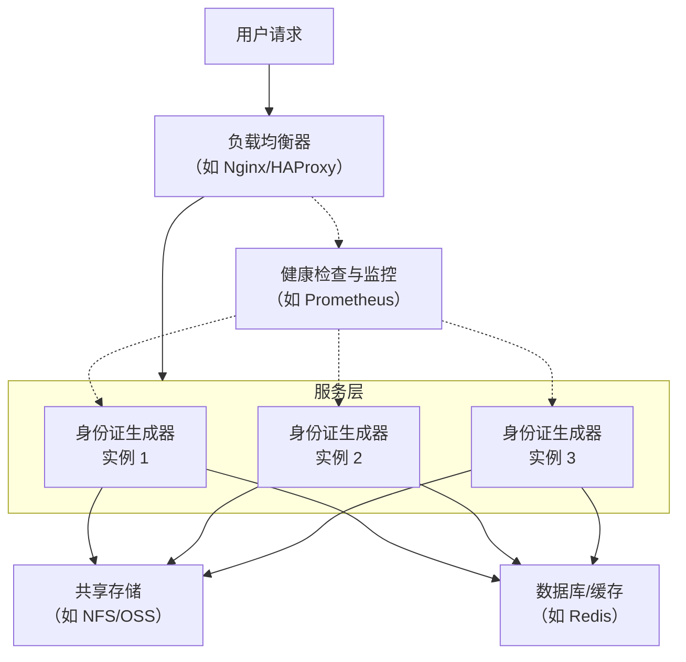

# 20200320

ClientSide高可用部署

animus 基础服务的一部分

身份证生成器

结合你的笔记内容，这组关键词指向的是一项关于为客户端系统构建高可用架构的技术方案，涉及"ClientSide高可用部署"、"AnimUs基础服务"和"身份证生成器"三个核心要素。

一个比较完整的思路是把它们串联起来理解：**你需要为 AnimUs 这个系统中的"身份证生成器"这个客户端服务，设计一套保障其持续在线、稳定运行的部署方案。**

以下是基于你的笔记和相关信息，梳理出的一个可参考的技术框架。

### 高可用部署的核心思路

对于这类服务和工具，高可用部署的目标是即使单个服务节点出问题，整个系统也能正常工作。主流思路是**构建一个无状态的服务集群**，并用一些关键组件来管理流量和故障。

这个架构通常包含以下三个层次：

1.  **负载均衡层**：作为系统的唯一入口，接收所有用户请求，然后根据策略（如轮询、最少连接）将请求分发给后端的多个服务实例。
2.  **服务集群层**：部署多个"身份证生成器"服务实例，每个实例都能独立处理请求。关键在于保证服务**无状态**，这样任何请求都能被任一实例处理。
3.  **容灾与故障转移层**：当某个服务实例或它依赖的资源（如存储、数据库）出现故障时，系统能自动发现并迅速隔离故障，将流量切换到健康的实例上，保证服务不中断。

### 具体部署方案参考

假设你的系统是基于 Web 服务或 API 的形式，可以参考下面的技术选型和配置思路：

**1. 部署架构图**


**2. 关键技术点**

*   **负载均衡配置（以 Nginx 为例）**：可以使用 Nginx 将流量分发到后端多个"身份证生成器"服务。配置一个 `upstream` 组，列出所有服务实例的地址和端口，并配置健康检查，Nginx 会自动屏蔽故障节点。
    ```nginx
    upstream idcard_servers {
        server 192.168.1.101:7860 weight=3; # 权重越高，分配的流量越多
        server 192.168.1.102:7860 weight=2;
        server 192.168.1.103:7860 weight=2;

        # 健康检查：每3秒检查一次，失败3次则标记为下线
        check interval=3000 rise=2 fall=3 timeout=1000;
    }

    server {
        listen 80;
        server_name your-animus-domain.com;

        location / {
            proxy_pass http://idcard_servers;
            # 传递真实IP等头部信息
            proxy_set_header Host $host;
            proxy_set_header X-Real-IP $remote_addr;
            proxy_set_header X-Forwarded-For $proxy_add_x_forwarded_for;
            
            # 针对图像处理等耗时操作，适当延长超时时间
            proxy_connect_timeout 60s;
            proxy_send_timeout 180s;
            proxy_read_timeout 180s;
        }
    }
    ```

*   **服务无状态化**：这是水平扩展的基础。不能让用户的状态（如会话、临时生成的图片）只保存在某一台服务器上。应该将会话信息存入 Redis 这类外部缓存，并将生成的图片等文件存入共享存储（如 NFS、对象存储 OSS）。

*   **故障转移与容灾**：
    *   **多副本部署**：在至少两个可用区或机房部署服务实例，避免单点故障。
    *   **数据同步**：确保共享存储和数据库在主要和备用区域之间数据同步。
    *   **自动切换**：配合 Keepalived 这类工具，当主负载均衡器故障时，能自动将虚拟IP（VIP）切换到备用节点上。

### 关于身份证生成器的注意点

你笔记中提到的"身份证生成器"很可能是一个内部开发或测试工具，需要注意：
*   **用途限定**：许多此类项目仅限用于学习交流，应避免用于伪造真实身份证件等非法用途。
*   **开源项目参考**：市面上有HivisionIDPhotos等开源证件照生成项目，它们支持Docker部署，其架构思路（如处理无状态、资源消耗）可以为你提供参考。
*   **资源消耗**：图像生成或处理是计算密集型任务。在高可用集群设计时，需要评估每个实例的CPU、内存等资源需求，避免因资源争抢导致性能下降。

### 总结
为了实现"ClientSide高可用部署"，核心是**构建一个包含负载均衡、无状态服务集群和自动故障转移的体系**。你需要将"身份证生成器"服务化并部署多个实例，在它前面架设负载均衡器分发请求和管理流量。同时，务必将服务设计为无状态的，并使用外部共享存储和缓存服务。这样，你的"AnimUs基础服务"就能具备抵御单点故障的能力，保障"身份证生成器"服务持续可用。
