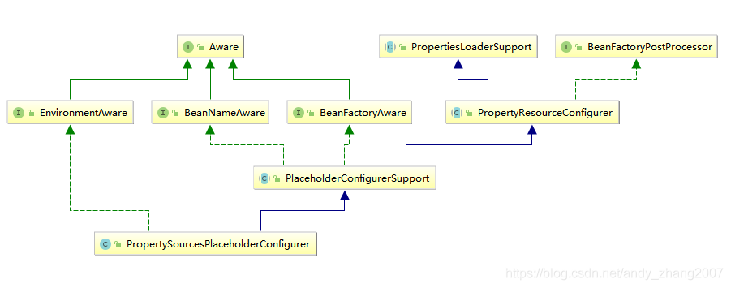

# 20201010

周六日 上班

Spring 工具类
org.springframework.context.support.PropertySourcesPlaceholderConfigurer
pspc 缩写
https://blog.csdn.net/andy_zhang2007/article/details/92770752

参数配置properties文件
自定义PropertySourcesPlaceholderConfigurer
继承PropertySourcesPlaceholderConfigurer，重写loadProperties(Properties props)方法

https://blog.csdn.net/qyp199312/article/details/54313784


org.springframework.context.EnvironmentAware
org.springframework.core.env.Environment

spring-bean org.springframework.beans.factory.Aware
```shell script
ApplicationEventPublisherAware (org.springframework.context)
    EventPublicationInterceptor (org.springframework.context.event)
ServletContextAware (org.springframework.web.context)
    WebApplicationObjectSupport (org.springframework.web.context.support)
    SimpleServletPostProcessor (org.springframework.web.servlet.handler)
    ViewResolverComposite (org.springframework.web.servlet.view)
    ServletContextParameterFactoryBean (org.springframework.web.context.support)
    WebMvcConfigurationSupport (org.springframework.web.servlet.config.annotation)
    CommonsMultipartResolver (org.springframework.web.multipart.commons)
    TilesConfigurer (org.springframework.web.servlet.view.tiles2)
    ContentNegotiationManagerFactoryBean (org.springframework.web.accept)
    DefaultServletHttpRequestHandler (org.springframework.web.servlet.resource)
    ServletContextAttributeFactoryBean (org.springframework.web.context.support)
    GenericFilterBean (org.springframework.web.filter)
    VelocityConfigurer (org.springframework.web.servlet.view.velocity)
    TilesConfigurer (org.springframework.web.servlet.view.tiles3)
    FreeMarkerConfigurer (org.springframework.web.servlet.view.freemarker)
    ServletContextAttributeExporter (org.springframework.web.context.support)
MessageSourceAware (org.springframework.context)
    ResponseStatusExceptionResolver (org.springframework.web.servlet.mvc.annotation)
ResourceLoaderAware (org.springframework.context)
    ConfigurationClassPostProcessor (org.springframework.context.annotation)
    ReloadableResourceBundleMessageSource (org.springframework.context.support)
    ScriptFactoryPostProcessor (org.springframework.scripting.support)
    ClassPathScanningCandidateComponentProvider (org.springframework.context.annotation)
    VelocityConfigurer (org.springframework.web.servlet.view.velocity)
    FreeMarkerConfigurer (org.springframework.web.servlet.view.freemarker)
NotificationPublisherAware (org.springframework.jmx.export.notification)
EnvironmentAware (org.springframework.context)
    ConfigurationClassPostProcessor (org.springframework.context.annotation)
    HttpServletBean (org.springframework.web.servlet)
        ResourceServlet (org.springframework.web.servlet)
        FrameworkServlet (org.springframework.web.servlet)
            DispatcherServlet (org.springframework.web.servlet)
    PropertySourcesPlaceholderConfigurer (org.springframework.context.support)
    GenericFilterBean (org.springframework.web.filter)
        DelegatingFilterProxy (org.springframework.web.filter)
        ResourceUrlEncodingFilter (org.springframework.web.servlet.resource)
        OncePerRequestFilter (org.springframework.web.filter)
    MBeanExportConfiguration (org.springframework.context.annotation)
BeanFactoryAware (org.springframework.beans.factory)
    AnnotationJmxAttributeSource (org.springframework.jmx.export.annotation)
    AbstractBeanFactoryAwareAdvisingPostProcessor (org.springframework.aop.framework.autoproxy)
    ScriptFactoryPostProcessor (org.springframework.scripting.support)
    PropertyPathFactoryBean (org.springframework.beans.factory.config)
    AbstractApplicationEventMulticaster (org.springframework.context.event)
    SimpleBeanFactoryAwareAspectInstanceFactory (org.springframework.aop.config)
    AbstractFactoryBean (org.springframework.beans.factory.config)
    ScheduledAnnotationBeanPostProcessor (org.springframework.scheduling.annotation)
    EnhancedConfiguration in ConfigurationClassEnhancer (org.springframework.context.annotation)
    GroovyScriptFactory (org.springframework.scripting.groovy)
    CommonAnnotationBeanPostProcessor (org.springframework.context.annotation)
    AbstractBeanFactoryPointcutAdvisor (org.springframework.aop.support)
    AnnotationMethodHandlerAdapter (org.springframework.web.servlet.mvc.annotation)
    AsyncExecutionAspectSupport (org.springframework.aop.interceptor)
    ServiceLocatorFactoryBean (org.springframework.beans.factory.config)
    CacheAspectSupport (org.springframework.cache.interceptor)
    MethodLocatingFactoryBean (org.springframework.aop.config)
    MBeanExporter (org.springframework.jmx.export)
    MethodInvokingBean (org.springframework.beans.factory.config)
    ProxyFactoryBean (org.springframework.aop.framework)
    JndiObjectFactoryBean (org.springframework.jndi)
    AsyncAnnotationAdvisor (org.springframework.scheduling.annotation)
    GenericTypeAwareAutowireCandidateResolver (org.springframework.beans.factory.support)
    PlaceholderConfigurerSupport (org.springframework.beans.factory.config)
    AbstractAutoProxyCreator (org.springframework.aop.framework.autoproxy)
    DefaultLifecycleProcessor (org.springframework.context.support)
    AspectJExpressionPointcutAdvisor (org.springframework.aop.aspectj)
    AbstractJaxWsServiceExporter (org.springframework.remoting.jaxws)
    RequiredAnnotationBeanPostProcessor (org.springframework.beans.factory.annotation)
    AutowiredAnnotationBeanPostProcessor (org.springframework.beans.factory.annotation)
    ScopedProxyFactoryBean (org.springframework.aop.scope)
    MBeanExportConfiguration (org.springframework.context.annotation)
    LoadTimeWeaverAwareProcessor (org.springframework.context.weaving)
    WebAsyncTask (org.springframework.web.context.request.async)
    AspectJExpressionPointcut (org.springframework.aop.aspectj)
    RequestMappingHandlerAdapter (org.springframework.web.servlet.mvc.method.annotation)
    BeanConfigurerSupport (org.springframework.beans.factory.wiring)
ImportAware (org.springframework.context.annotation)
    AbstractAsyncConfiguration (org.springframework.scheduling.annotation)
    AbstractCachingConfiguration (org.springframework.cache.annotation)
    LoadTimeWeavingConfiguration (org.springframework.context.annotation)
    MBeanExportConfiguration (org.springframework.context.annotation)
EmbeddedValueResolverAware (org.springframework.context)
    ScheduledAnnotationBeanPostProcessor (org.springframework.scheduling.annotation)
    FormattingConversionServiceFactoryBean (org.springframework.format.support)
    RequestMappingHandlerMapping (org.springframework.web.servlet.mvc.method.annotation)
    FormattingConversionService (org.springframework.format.support)
    EmbeddedValueResolutionSupport (org.springframework.context.support)
ServletConfigAware (org.springframework.web.context)
    SimpleServletPostProcessor (org.springframework.web.servlet.handler)
LoadTimeWeaverAware (org.springframework.context.weaving)
    AspectJWeavingEnabler (org.springframework.context.weaving)
BeanNameAware (org.springframework.beans.factory)
    ExecutorConfigurationSupport (org.springframework.scheduling.concurrent)
    ConcurrentMapCacheFactoryBean (org.springframework.cache.concurrent)
    ServletForwardingController (org.springframework.web.servlet.mvc)
    AbstractView (org.springframework.web.servlet.view)
    PropertyPathFactoryBean (org.springframework.beans.factory.config)
    PlaceholderConfigurerSupport (org.springframework.beans.factory.config)
    AbstractRefreshableConfigApplicationContext (org.springframework.context.support)
    ScheduledAnnotationBeanPostProcessor (org.springframework.scheduling.annotation)
    GenericFilterBean (org.springframework.web.filter)
    DefaultAdvisorAutoProxyCreator (org.springframework.aop.framework.autoproxy)
    TaskExecutorFactoryBean (org.springframework.scheduling.config)
    FieldRetrievingFactoryBean (org.springframework.beans.factory.config)
    ServletWrappingController (org.springframework.web.servlet.mvc)
BeanClassLoaderAware (org.springframework.beans.factory)
    JndiRmiProxyFactoryBean (org.springframework.remoting.rmi)
    MBeanProxyFactoryBean (org.springframework.jmx.access)
    DefaultContextLoadTimeWeaver (org.springframework.context.weaving)
    ScriptFactoryPostProcessor (org.springframework.scripting.support)
    BshScriptFactory (org.springframework.scripting.bsh)
    LocalStatelessSessionProxyFactoryBean (org.springframework.ejb.access)
    AbstractApplicationEventMulticaster (org.springframework.context.event)
    StandardScriptFactory (org.springframework.scripting.support)
    ConcurrentMapCacheManager (org.springframework.cache.concurrent)
    AbstractFactoryBean (org.springframework.beans.factory.config)
    ResourceBundleMessageSource (org.springframework.context.support)
    ResourceBundleThemeSource (org.springframework.ui.context.support)
    GroovyScriptFactory (org.springframework.scripting.groovy)
    SimpleRemoteStatelessSessionProxyFactoryBean (org.springframework.ejb.access)
    MBeanServerConnectionFactoryBean (org.springframework.jmx.support)
    ProxyProcessorSupport (org.springframework.aop.framework)
    InterfaceBasedMBeanInfoAssembler (org.springframework.jmx.export.assembler)
    JRubyScriptFactory (org.springframework.scripting.jruby)
    MBeanExporter (org.springframework.jmx.export)
    MethodInvokingBean (org.springframework.beans.factory.config)
    FieldRetrievingFactoryBean (org.springframework.beans.factory.config)
    JaxWsPortClientInterceptor (org.springframework.remoting.jaxws)
    ServiceLoaderFactoryBean (org.springframework.beans.factory.serviceloader)
    ProxyFactoryBean (org.springframework.aop.framework)
    BshScriptEvaluator (org.springframework.scripting.bsh)
    JndiObjectFactoryBean (org.springframework.jndi)
    LoadTimeWeavingConfiguration (org.springframework.context.annotation)
    MethodInvokingRunnable (org.springframework.scheduling.support)
    AspectJWeavingEnabler (org.springframework.context.weaving)
    RmiProxyFactoryBean (org.springframework.remoting.rmi)
    ServiceFactoryBean (org.springframework.beans.factory.serviceloader)
    AbstractSingletonProxyFactoryBean (org.springframework.aop.framework)
    CustomScopeConfigurer (org.springframework.beans.factory.config)
    RemotingSupport (org.springframework.remoting.support)
    ServiceListFactoryBean (org.springframework.beans.factory.serviceloader)
    ConfigurationClassPostProcessor (org.springframework.context.annotation)
    CustomAutowireConfigurer (org.springframework.beans.factory.annotation)
    GroovyScriptEvaluator (org.springframework.scripting.groovy)
    Jackson2ObjectMapperFactoryBean (org.springframework.http.converter.json)
    MBeanClientInterceptor (org.springframework.jmx.access)
    AbstractHttpInvokerRequestExecutor (org.springframework.remoting.httpinvoker)
    StandardScriptEvaluator (org.springframework.scripting.support)
    AbstractServiceLoaderBasedFactoryBean (org.springframework.beans.factory.serviceloader)
ApplicationContextAware (org.springframework.context)
    GroovyMarkupConfigurer (org.springframework.web.servlet.view.groovy)
    ViewResolverComposite (org.springframework.web.servlet.view)
    LiveBeansView (org.springframework.context.support)
    EventListenerMethodProcessor (org.springframework.context.event)
    WebMvcConfigurationSupport (org.springframework.web.servlet.config.annotation)
    FrameworkServlet (org.springframework.web.servlet)
    ApplicationObjectSupport (org.springframework.context.support)
    ScheduledAnnotationBeanPostProcessor (org.springframework.scheduling.annotation)
    Jackson2ObjectMapperFactoryBean (org.springframework.http.converter.json)
    AbstractJUnit4SpringContextTests (org.springframework.test.context.junit4)
    HandlerMappingIntrospector (org.springframework.web.servlet.handler)
    LocalValidatorFactoryBean (org.springframework.validation.beanvalidation)
    ExceptionHandlerExceptionResolver (org.springframework.web.servlet.mvc.method.annotation)
    AbstractTestNGSpringContextTests (org.springframework.test.context.testng)
```


super-diamond-client 提供一个

com.github.diamond.client.PropertiesConfigurationFactoryBean


implements FactoryBean<Properties>


提供了要给java.utils.Properties对象


Spring 中 用 ${xxx} 读取properties文件的说明

```java
@Value("${spring_only}")
private String springOnly;
```

备注：读下spring doc相关的文档

https://blog.csdn.net/qq_16605855/article/details/73456952


Could not resolve placeholder 'jdbc.driver' in value "${jdbc.driver}"


https://blog.csdn.net/qism007/article/details/52876703


sqlite jdbc 加密

https://github.com/Willena/sqlite-jdbc-crypt#get-started-with-encryption

npk后缀的文件


mybatis foreach item 标签的使用