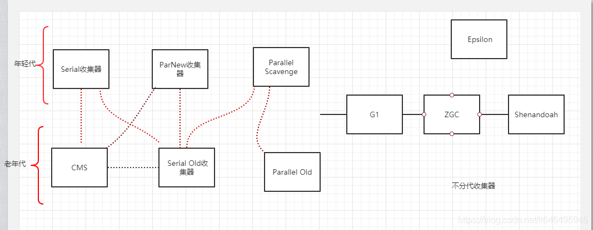

# 20210322

Mysql高级-day02.md

手动开启事务

批量插入

严格按照顺序插入

jvm的三种垃圾回收算法以及10种垃圾收集器
jvm参数里面有各种回收器
https://blog.csdn.net/li646495946/article/details/106013554/

1 jvm的三种基本算法
1.1 标记-清除算法（Mark-Sweep）
1.2 复制算法(Copying)
1.3标记-整理算法（Mark-Compact）
1.4分代收集算法

2. 10种垃圾回收器
2.1 Serial收集器
2.2 Serial Old收集器
2.3ParNew收集器
2.4.Parallel Old
2.5Parallel Scavenge
2.6 CMS
2.7 G1（Garbage First）
2.8 ZGC
2.9 Shenandoah
2.10 Epsilon

java垃圾回收器

java 命令行参数

gcc参数

mysql参数

my.cnf

eclipse.ini