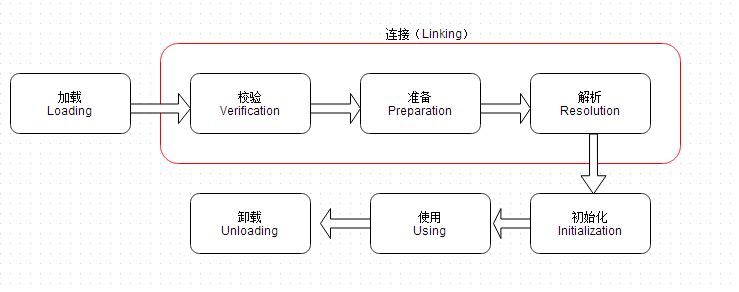

# 20210324

jvm 类加载机制 在哪些地方应用？
class文件加密
maven依赖冲突，引用多个版本的库
tomcat 多个webapp，不同项目引用不同的jar包

### 加载：

加载过程主要完成三件事情：
1. 通过类的全限定名来获取定义此类的二进制字节流
2. 将这个类字节流代表的静态存储结构转为方法区的运行时数据结构
3. 在堆中生成一个代表此类的java.lang.Class对象，作为访问方法区这些数据结构的入口。

这个过程主要就是类加载器完成。
### 校验：

此阶段主要确保Class文件的字节流中包含的信息符合当前虚拟机的要求，并且不会危害虚拟机的自身安全。
1. 文件格式验证：基于字节流验证。
2. 元数据验证：基于***方法区\***的存储结构验证。
3. 字节码验证：基于方法区的存储结构验证。
4. 符号引用验证：基于方法区的存储结构验证。

### 准备：
为类变量分配内存，并将其初始化为默认值。（此时为默认值，在初始化的时候才会给变量赋值）即在方法区中分配这些变量所使用的内存空间。

### 解析：
把类型中的符号引用转换为直接引用。
- 符号引用与虚拟机实现的布局无关，引用的目标并不一定要已经加载到内存中。各种虚拟机实现的内存布局可以各不相同，但是它们能接受的符号引用必须是一致的，因为符号引用的字面量形式明确定义在Java虚拟机规范的Class文件格式中。
- 直接引用可以是指向目标的指针，相对偏移量或是一个能间接定位到目标的句柄。如果有了直接引用，那引用的目标必定已经在内存中存在

主要有以下四种：

1. 类或接口的解析
2. 字段解析
3. 类方法解析
4. 接口方法解析

### 初始化：
初始化阶段是执行类构造器<client>方法的过程。<client>方法是由编译器自动收集类中的类变量的赋值操作和静态语句块中的语句合并而成的。虚拟机会保证<client>方法执行之前，父类的<client>方法已经执行完毕。如果一个类中没有对静态变量赋值也没有静态语句块，那么编译器可以不为这个类生成<client>()方法。

java中，对于初始化阶段，有且只有以下五种情况才会对要求类立刻“初始化”（加载，验证，准备，自然需要在此之前开始）：

1. 使用new关键字实例化对象、访问或者设置一个类的静态字段（被final修饰、编译器优化时已经放入常量池的例外）、调用类方法，都会初始化该静态字段或者静态方法所在的类。
2. 初始化类的时候，如果其父类没有被初始化过，则要先触发其父类初始化。
3. 使用java.lang.reflect包的方法进行反射调用的时候，如果类没有被初始化，则要先初始化。
4. 虚拟机启动时，用户会先初始化要执行的主类（含有main）
5. jdk 1.7后，如果java.lang.invoke.MethodHandle的实例最后对应的解析结果是 REF_getStatic、REF_putStatic、REF_invokeStatic方法句柄，并且这个方法所在类没有初始化，则先初始化。
