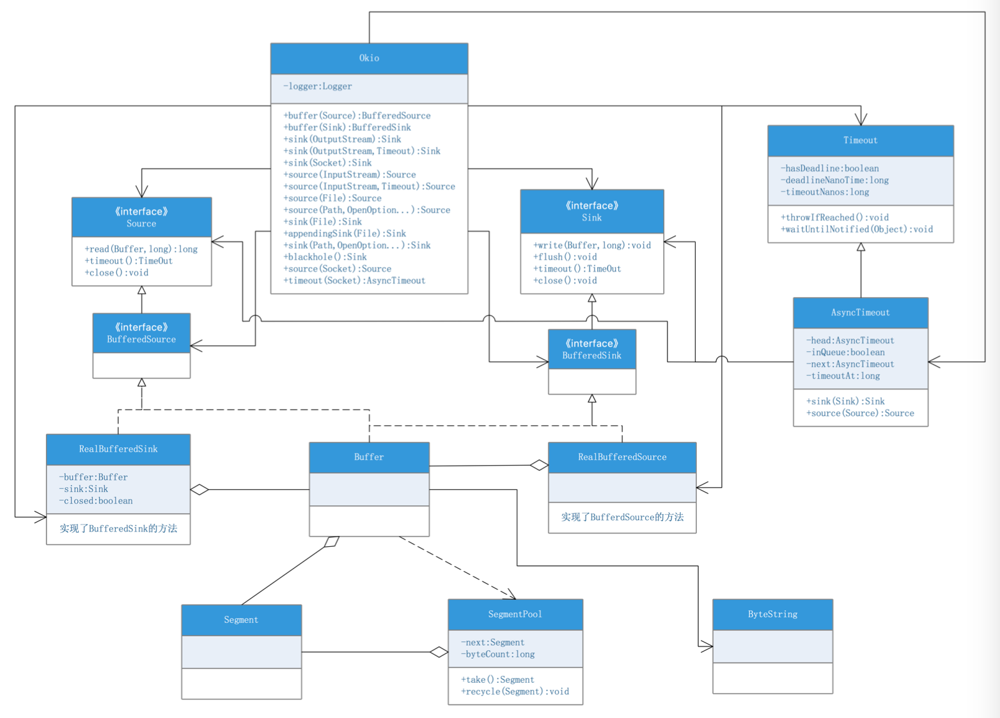

# 20210422

银行核心银行系统,英文名称:Core Banking System


java
byte数值范围

java.nio.ByteOrder 大端 小端 不同操作系统网络数据包 写进testjdk8

```shell
Java HotSpot(TM) 64-Bit Server VM warning: Options -Xverify:none and -noverify were deprecated in JDK 13 and will likely be removed in a future release.
Exception in thread "main" java.lang.ClassCastException: class jdk.internal.loader.ClassLoaders$AppClassLoader cannot be cast to class java.net.URLClassLoader (jdk.internal.loader.ClassLoaders$AppClassLoader and java.net.URLClassLoader are in module java.base of loader 'bootstrap')
	at org.springframework.boot.devtools.restart.DefaultRestartInitializer.getUrls(DefaultRestartInitializer.java:93)
	at org.springframework.boot.devtools.restart.DefaultRestartInitializer.getInitialUrls(DefaultRestartInitializer.java:56)
	at org.springframework.boot.devtools.restart.Restarter.<init>(Restarter.java:140)
	at org.springframework.boot.devtools.restart.Restarter.initialize(Restarter.java:583)
	at org.springframework.boot.devtools.restart.RestartApplicationListener.onApplicationStartingEvent(RestartApplicationListener.java:67)
	at org.springframework.boot.devtools.restart.RestartApplicationListener.onApplicationEvent(RestartApplicationListener.java:45)
	at org.springframework.context.event.SimpleApplicationEventMulticaster.doInvokeListener(SimpleApplicationEventMulticaster.java:172)
	at org.springframework.context.event.SimpleApplicationEventMulticaster.invokeListener(SimpleApplicationEventMulticaster.java:165)
	at org.springframework.context.event.SimpleApplicationEventMulticaster.multicastEvent(SimpleApplicationEventMulticaster.java:139)
	at org.springframework.context.event.SimpleApplicationEventMulticaster.multicastEvent(SimpleApplicationEventMulticaster.java:122)
	at org.springframework.boot.context.event.EventPublishingRunListener.starting(EventPublishingRunListener.java:69)
	at org.springframework.boot.SpringApplicationRunListeners.starting(SpringApplicationRunListeners.java:48)
	at org.springframework.boot.SpringApplication.run(SpringApplication.java:292)
	at org.springframework.boot.SpringApplication.run(SpringApplication.java:1118)
	at org.springframework.boot.SpringApplication.run(SpringApplication.java:1107)
	at com.baeldung.SpringHypermediaApiApplication.main(SpringHypermediaApiApplication.java:12)
```

okio
native
方法


java.security.MessageDigest#getInstance(java.lang.String)

柜面前端系统
柜面前端项目
正职员工被抽调走了

cnki
百度搜索

以前是命令行的，现在是ui系统


中国金融电脑
中国农村金融
金融电子化
http://www.pbc.gov.cn/rmyh/105223/105401/index.html
https://mall.cnki.net/magazine/magalist/JRDZ.htm

Bank Front-End System


银行综合前置系统


中国农业银行研发中心 cnki来源 机构
华夏银行信息科技部
交通银行软件开发中心

CMDB配置项


交通银行税控服务管理系统

发票红冲

税控机


浅谈电子发票对银行财务核算的影响

testokhttp okio源码详解

javax.annotation.Nullable

存款，贷款，汇款，公共，中间业务，柜面5大模块
柜面 cheng微信 有个联系人


[HTTP上传数据的方式和OKHttp的实现](https://blog.csdn.net/weixin_40763897/article/details/106806721)
multipart/form-data与x-www-form-urlencoded区别：
multipart/form-data：既可以上传文件等二进制数据，也可以上传表单键值对，只是最后会转化为一条信息；
x-www-form-urlencoded：只能上传键值对，并且键值对都是间隔分开的。


java.util.concurrent.SynchronousQueue

java.util.concurrent.ThreadFactory
Thread newThread(Runnable r);

  public static ThreadFactory threadFactory(String name, boolean daemon) {
    return runnable -> {
      Thread result = new Thread(runnable, name);
      result.setDaemon(daemon);
      return result;
    };
  }
