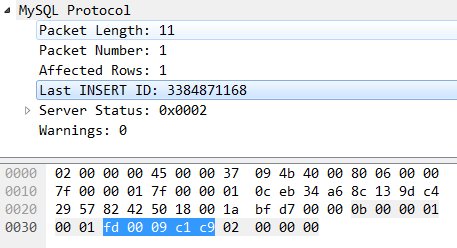

# 20210616

mybatis

mybatis plus

自增int

插入数据 返回id

mysql jdbc协议数据包格式
​     服务器响应包分为4类： OK包  ERR包   EOF包   数据包
​     OK包：在5.7.5之前，ok包首字节为0,；在5.7.5之后，ok包的首字节可能为0xFE，表示EOF。
​               该包包括成功执行后影响的行数，最新的自增id， 告警信息（4.1版本之上），服务器状态信息：status_flag(该字段要留意，后续后讲到）
​              执行函数：sql/protocol_classic.cc :  net_send_ok
​          由于协议的内容容易变更，建议查看官网的最新版格式：https://dev.mysql.com/doc/internals/en/packet-OK_Packet.html

Mysql JDBC的通信协议
https://www.cnblogs.com/msdn1433/p/13214344.html

https://zhuanlan.zhihu.com/p/41979884

https://dev.mysql.com/doc/internals/en/packet-OK_Packet.html

useGeneratedKeys="true" keyColumn="id" keyProperty="id"