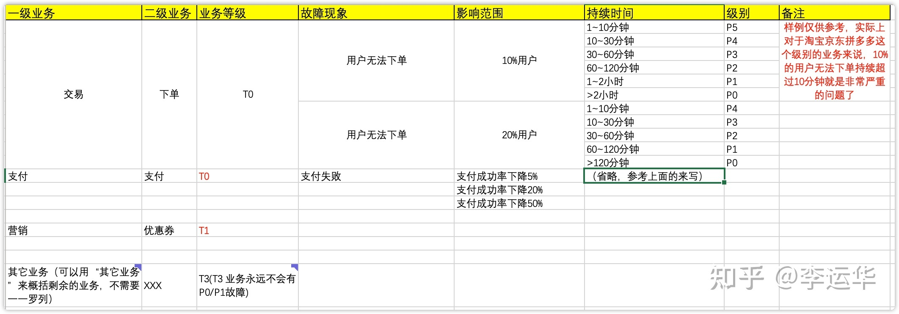

# 20221115

https://www.zhihu.com/question/535244045/answer/2740884550

作为一名六年开发经验，做过10+以上系统的后端开发工程师，我从代码设计的角度来谈谈我的观点
1.先设计，再开发一个正规的软件项目，开发前期一定是先进行需求调研->输出需求文档->需求评审->系统设计->输出设计文档->设计评审，最后才是真正的编码，真正的代码实现只占用20%的时间。系统研发的前期应该主要把精力放在如何设计系统流程上面，设计初期可以根据自己对业务的理解画出关键模块的流程图，关键业务逻辑的时序图，再根据这些图对业务逻辑进行抽象，指导表结构的设计，类结构设计等。这样做有几个好处：1）设计时如果需求有变更，可以更好的应对，因为此时还没有开始编码2）在画流程图，时序图时，可以提前理清思路，同时利用这些门槛较低的，基本上大家都能看懂的工具和客户或者产品经理进行沟通，更好的对接需求3）设计初期输出的这些文档或者图例，可以直接放进概要设计，详细设计等文档中，减轻文档编写的痛苦当然，肯定也有一些项目特别紧急，或者是走敏捷开发的项目，在项目开始的时候需求都不明确，无法进行针对性设计的情况时，我还是建议在干活之前自己在纸上画一下关键步骤的流程图，或者画一下关键流程的时序图，对理清业务逻辑，理清思路还是特别有帮助的，只有思路清晰，代码才会清晰，逻辑清晰的代码永远是最好的注释，但前提是代码可读性要好。这里分享一下我使用的时序图绘制工具，idea的插件PlantUML，个人感觉非常好用，推荐大家试一试，直接在idea插件商店里面搜索即可

为什么硬盘不能按实际标称容量来生产或注明实际容量？
我买的4TB硬盘，实际存储容量只有3630GB，看到网上的解释是厂家为了方便计算，按你1TB=1000GB来计算，那我买4TB的硬盘，你至少得给我到4000GB的空间啊，3630GB算什么？难道按1TB=1024GB来生产产品，从技术上来说很难吗？不在产品上作出实际容量的说明，这不是误导消费者吗？
可是，1024B=1KB,1024KB=1MB,1024MB=1GB,1024GB=1TB，这是计算机的换算方法，微软的操作系统用这个方法计算空间容量有什么问题啊？为什么是操作系统的锅？

因为机械硬盘行业一直都这样，节省成本，是个一直都在垂死挣扎的行业。要说这是微软的锅，这就笑话大发了，因为微软并不是第一个操作系统产商，在微软开始做操作系统的时候，计算机已经存在很多年了。微软选择1k=1024，并不是微软突发奇想，而是因为在当时，这就是计算机行业的通行规则，微软只是按照行业通行规则执行而已。这种用法早在 193x~196x 年间就已经很流行。至于有人说，所谓的 KiB, MiB, GiB 的 SI 新标准，请搞清楚先后，那已经是 200x 年之后的事了，此时计算机行业已经发展了接近半个世纪，你 SI 定个新标准就让所有历史文献全都修改用法，这不是搞笑么。何况这根本就不是计算机行业内的标准部门，为何要干涉IT领域的事，也属实奇怪。你喜不喜欢微软是另一回事，但在这个问题上，微软坚持行业一贯的尺寸标注，是完全正确而合理的选择。硬盘产商被骂，为什么一点不冤？因为硬盘一开始就是用于计算机行业的，并不是用于其它行业的。既然你一开始就是计算机行业的专用硬件，不用计算机行业的通行标准标注容量尺寸，反而自己定一套标准，问题当然是硬盘产商的锅。要知道，软盘，光盘，内存条，SSD，SD卡，TF卡，等各种存储的容量尺寸，全都是按照 1k=1024 标注的，全世界几乎所有的「计算机行业」内的存储都按照这个标准标注，就唯独硬盘产商搞特殊？为什么用 1k=1000 在计算机行业内是错的？一个简单的问题：你的机械硬盘需要多少空间，才能完整存储在32G内存中的数据？需要多少空间才能完整存储一个32G存储卡的数据？你硬盘虚标，与计算机领域所有其它设备的存储标注都不符合，是不是坑害消费者？再来一个灵魂拷问吧：32G内存的实际存储量是 34,359,738,368 字节，所以，有没有哪个产商把 32G 内存标注为 34G 内存？有没有哪个产商把16G内存标注为17G内存？为什么硬盘产商这样虚标反而就有一堆人洗地呢？如果你认为16G内存，32G内存这种标注是错的，如果你认为他们应该标注为17G，34G，那你说硬盘虚标合理，我就认同你不是双标，不然，呵呵。所幸，这帮硬盘产商大概都死得差不多了，要我说，这帮硬盘产商真心死的不冤，因为从一开始，吃相就很难看，现在与将来，大概也会持续的难看。他们（硬盘产商）不想要体面，我们就用脚投票，帮他们体面。

vim用于linux系统编程的话，查询linux系统调用或C库函数只需要在普通模式下把光标放在函数名上，按下Shift+k组合（即大写K）即可打开函数的man文档，按q退出后自动跳回代码编辑界面。

问：getter 和 setter 方法有什么意义？
答：来自《 API design for C++ 》1. 有效性验证（可以在setter里检查设置的值是否在许可区间里）2. 惰性求值（比如一个成员计算过于耗时，而这个类的用户（这里的用户指其他程序员）不一定需要时，可以在getter方法调用的时候再计算）3. 缓存额外的操作（比如用户调用setter方法时，可以把这个值更新到配置文件里）4. 通知（其它模块可能需要在某个值发生变化的时候做一些操作，那么就可以在setter里实现）5. 调试（可以方便的打印设置日志，从而追踪错误）6. 同步（如果多线程访问需要加锁的话，setter里加锁不是很容易么）7. 更精细的权限访问（比如private变量只有getter没有setter，那客户对该变量就是只读了，而类的内部代码可以读写）8. 维护不变式关系（比如一个类内部要维持连个变量a和b有a = b * 2的关系，那么在a和b的setter里计算就能维持这样的关系）我再说个，还可以不对外暴露内部的数据组织方式，即使类数据的组织结构发生变化也不需要修改外部用户的代码。

https://www.zhihu.com/question/21401198/answer/37192335

如何理解保护模式?
其实，我真心感觉《Intel 64 and IA-32 Architectures Software Developer's Manual Volume 3: System Programming Guide》最好不过了，这毕竟是第一手的资料。觉得英文吃力的话可以先行读读《x86汇编-从实模式到保护模式》。不过还是建议你读完后再去读读前面提到的资料。另外，关于操作系统设计的问题。窃以为CPU提供了各种机制，而设计人员制定各种相关的策略。不必拘泥于机制，比如出于别的考量，一些x86下的OS进程切换未必完全按照Intel提供的TSS的一般方式。

https://www.zhihu.com/question/26295633/answer/32495882

如何制定业务的故障分级标准？

相信很多同学都有这样的想法，找大公司比如说阿里腾讯的故障定级标准，然后拿过来套到自己的业务上，这样简单方便，毕竟 BAT 都是这么干的，我们跟着学肯定没错。
但这样做其实就很容易掉到坑里去了，为什么直接学习大公司的标准，结果还掉到坑里去了呢？有几个核心的原因：
1）业务领域和规模不同，故障的定义和容忍度都会不同：比如说支付业务和社交业务，很显然支付业务的故障容忍度要低，毕竟和钱打交道；即使同样是电商，拼多多用户 6 亿，而一个小程序电商用户可能就 100 万；
2）大公司的基建和技术能力很强：比如说淘宝的单元化、异地多活；蚂蚁的底层数据库是 OceanBase，一般的公司没有这个技术能力或者还没有做相应的高可用方案；
3）大公司的高可用配套完善：比如说完善的监控运维平台、全链路跟踪、各种问题定位工具等，不是所有的公司都具备这样的配套设施。
基于以上三点，故障分级标准也一定要遵循架构实战营讲的三原则中的“合适原则”和“演进原则”，不能简单照搬网上或者其它公司的标准，而应该基于自己的业务、技术、团队来按需定制（合适原则），然后随着业务和技术发展逐步调整（演进原则）。
在具体制定故障分级标准的时候，有几个通用的原则，这个原则是和公司大小以及业务类型没有关系的。具体如下：
1）合适原则：这点最重要，并不是可用性要求越高越好，适合团队和业务最重要，因为要提升可用性是需要投入的，而且越到后面代价越大，比如说：从 99.9 提升到 99.95，代价可能是做同城双机房，而从 99.95 提升到 99.99，代价就是做异地多活了；而且可用性的提升是一个体系化的工程，并不是在纸上把标准写高了就自然达到了，而是要有各种措施来保障，包括自动化测试、全链路跟踪、自动化运维监控平台，强大的基础设施等；
2）风险共担原则：这点非常重要，否则就会出现头铁的产品经理或者业务老大，无限拔高可用性要求，如果产品不愿意承担风险，那么就不要制定这样的标准，因为必然是技术背锅，而且产品也跑不了，因为出了 P0/P1/P2 的故障是要汇报给高层级大佬的，汇报的时候“产研测维”一个都跑不了。
3）业务导向原则：从业务角度触发来分级：影响程度 = 业务重要性 * 影响范围 * 影响时长，比如说淘宝的领金币，就算 100%的用户全部不可以领，影响程度也没有 5%的用户不能下单那么大；或者说主备系统，备机挂了，只要主机不挂，这个时候对业务没影响，故障定级最多 P3。
具体的故障定级一般是用 P0~P4，有的是 P0~P5，我个人觉得 P4 已经够了，没有必要把线上所有的问题都定级。P0~P4 通常没有统一的量化标准，一般都按照如下来理解：
P0：致命 、P1：严重、P2：重大、P3：一般、P4：轻微
具体什么叫“致命、严重”，这就需要产品研发测试运维和老板一起来定了，一般按照影响范围、影响程度、损失程度来制定。比如说：100万的用户规模，影响1%算P3，10%算P2，20% P1，40% P0；损失1万元是P4，损失10万是P3，损失100万是P2这种。
什么样的标准算是比较合理的呢？正常来说：3 年都不应该发生一次的是 P0，1 年最多发生 1 次的是 P1，1 个季度最多发生 1 次的是 P2，P3/P4 是可以发生的，完全杜绝 P3/P4 的故障是不可能的，当然也不能太多，总体趋势应该是逐渐减少。
关于风险共担原则，如果遇到头铁的产品人员，肯定会跳出来说“可用性是技术的事情”，但是这里要据理力争，那怎么争呢？
第 1 个技巧是：产品设计不合理的要求会导致技术方案变复杂和容易出错（当然，头铁的产品还是会说那也是你们能力的事情）；
第 2 个技巧：出了 P0/P1/P2 的故障是要汇报给高级别的，汇报的时候产品也要去，而且技术可以说是产品设计太复杂要求太高，在大佬的眼中，最后只会看到“某某产品很烂，经常出故障经常汇报”，大佬绝不会说“这个业务的产品人员很厉害，只是技术人员差了点” ：）
第 3 个技巧：墨菲定律，不可能做出一个没有任何问题的系统，提升可用性是需要巨大投入的，包括流程、人员、基础设施等，巧妇难为无米之炊，可以给老板讲讲阿里腾讯怎么做各种保障的，以及要实现这些东西代价是什么；
下面给出一个模板参考，大家可以根据自己的业务增加对应的列：

制定标准后，最好先按照架构实战营讲过的FMEA方法分析一下业务的现状技术能力，看看是否真的能够达到。如果明确达不到标准，要么调整标准，要么架构重构。
