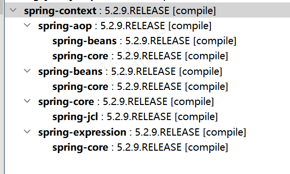

# 202309_week2

## 时间范围

- 202309 月第 2 周

## 本周记录

- 20230908：纠正一个观点，工作是用来给公司创造价值的，996的公司没有下班时间给员工学习提高，不是很忙的时候员工要在工作之余的时间好好学习工作用到的技术
- 20230909：冰河技术 RPC手撸专栏 15章；自定义注解，注解扫描；provider实现
- 20230910：汤家凤 评论追星负面，有人组织搞南京数学系，评论，在不涉及自己利益的时候，不要多嘴；南京数学系不招聘研究生了；专业投机原理
- 20230911：结算单主表，有两个值是空，我没注意，应该自己发现的；徽商总行；信息科技部、大数据部、系统开发部
- 20230912：B站内推；@陆地上的鱼 加kratos的社区群，他们很多员工在里面；横向，项目实践
- 20230913：复习 写给大忙人看的java8；Java8在String类中只添加了一个新方法，就是join，该方法实现了字符串的拼接，可以把它看作split方法的逆操作。；报错
- 20230914：；缓存穿透；缓存雪崩
