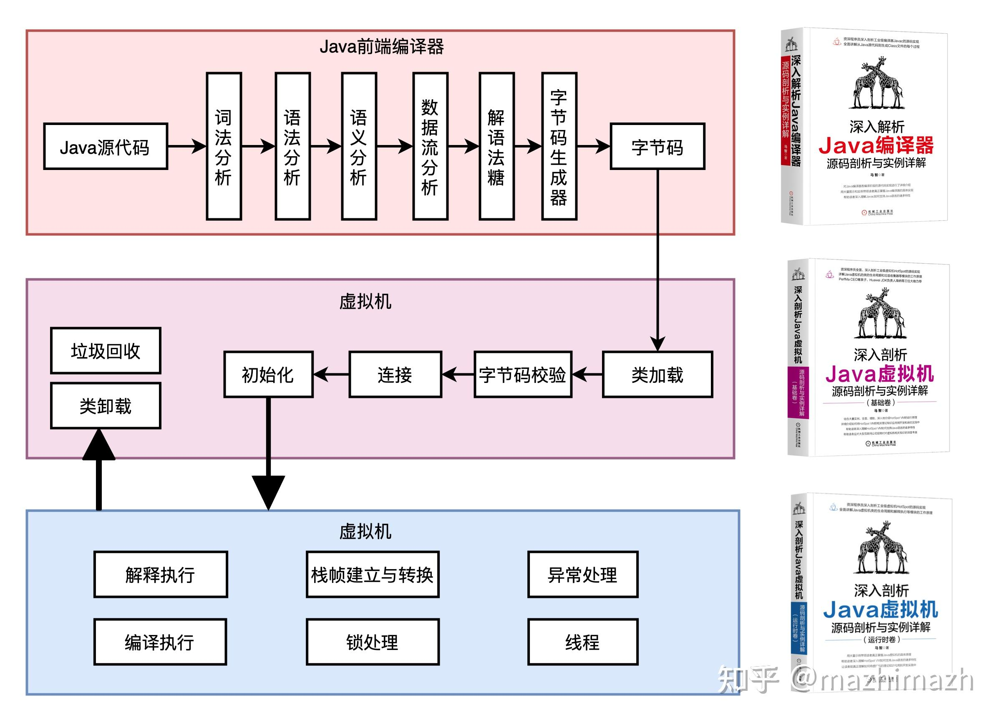

# 202309_week3

## 时间范围

- 202309 月第 3 周

## 本周记录

- 20230915：中台技术财务应用蓝皮书.pdf；微服务可靠性设计 李林锋；分布式服务框架
- 20230916：补充了当日日志，暂未提炼出明确主题。
- 20230917：；《聚沙成塔：Go语言构建高性能、分布式爬虫项目》；概念数据模型、逻辑数据模型和物理数据模型的先后顺序是：概念设计、逻辑设计、物理设计。
- 20230918：Oracle XData数据建模；编排（Choreography）；治理 Orchestration
- 20230919：从ChatGPT 上车奔驰，到理想汽车发布自研的大模型Mind GPT，科大讯飞的星火认知大模型迎来了首次上车，与奇瑞星纪元ES共同打造“LION AI”大模型平台。；写代码依赖调试和debug，断点，不能理清思路后编码，写demo写多了，不能肉眼debug；早上8：18起床，37分才出发，墨迹
- 20230920：曾经有很多技术试图解决这个问题，比如windows平台上的ActiveX嵌入web，再后来就是wpf/xaml技术描述UI在web/桌面各自rendering，比如基于flash的Flex/Air，Extjs想搞过但是还是得一个air的壳儿，eclipse rcp/swt借助于rap/Orion项目想要一套代码桌面原生ui和web两种表示最终做了一个che。故事的最后还是Electron实现了当前的大一统，可以看一下vscode，目前看到的有桌面版本和web IDE版本。十来年前的时候，某个银行软开就喜欢所有系统都有一套web的，一套桌面的。最开始是做两套，Struts和swing这种。后来引入spring和rpc技术，后台一套，前台用不同ui技术，web尝试过tapestry模板，flex，extjs，jsf服务端组件模型，桌面尝试过vsto集成，eclipse rcp，wpf，qt。经过几年试验，最后设计了一套类似wpf的UI组件元模型，配合一套支持各类不同的后端组件渲染引擎，从而可以配置出一套类似现在的低代码系统，生成出来多套web和桌面应用。；kimmking；最近看到一个对Rust的评论，很有意思，大概的说法是：现在大家狂吹Rust的一个重要原因是它还没有出现几个重量级的超大规模应用，它确实在语言特性层面有优势，但目前都是用来做的小而精的东西，一旦我们把它用到千人以上规模的分布式协作性项目里，工程化带来的问题，会消灭掉它目前几乎所有的优势，从而让大家认清楚这个语言的本来面目，实际上并不比现在最广泛流行的语言强大/有用。这个评论先不管对错。很有意思，每2-3年都有一种定位于“替换”Java或C++的语言出现，从ROR、Groovy、Scala、Golang、Kotlin，但是直到目前为止，大的格局依然没变。
- 20230921：[滴滴] 深入解析：Synchronized锁升级机制的内部工作原理。；[京东] ConcurrentHashMap：其背后的高效工作机制及优质设计策略。；[菜鸟物流] 对象存储解析：一个空Object对象到底占据多少内存？
