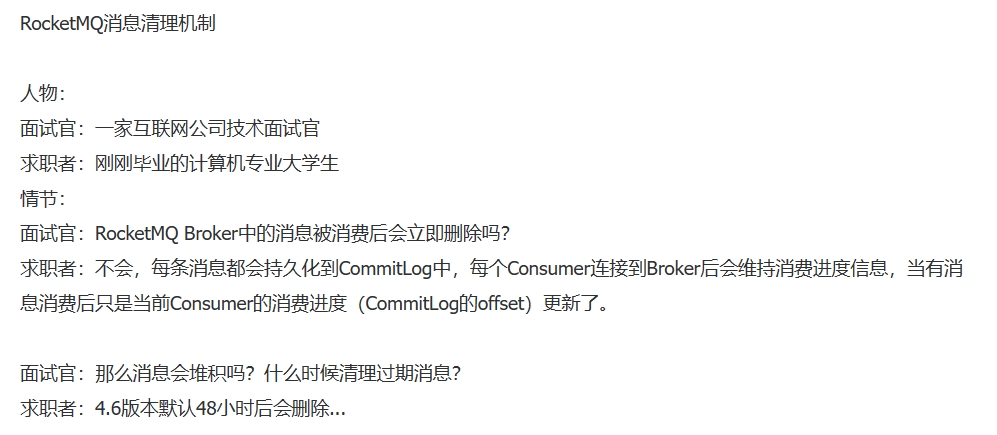

# 20240103

单一字段搜索，根据联想词搜索
汉字的
可以考虑用ES
模糊搜索，提升用户体验

冰河技术
rocketmq消费掉的消息，默认48小时再删除

RocketMQ消息清理机制

人物：
面试官：一家互联网公司技术面试官
求职者：刚刚毕业的计算机专业大学生
情节：
面试官：RocketMQ Broker中的消息被消费后会立即删除吗？
求职者：不会，每条消息都会持久化到CommitLog中，每个Consume旌接到Broker后会维持消费进度信息，当有消息消费后只是当前Consumer的消费进度（CommitLog的offset）更新了。

面试官：那么消息会堆积吗？什么时候清理过期消息？
求职者：4.6版本默认48小时后会删除…

dbeaver
格式化sql，多表join的sql，更直观，有缩进
join的表，join后面，双击，可以直接选中
navicat格式化sql，如何有缩紧？

github做笔记，需要查看前三个月的笔记，这就不方便了

知识星球，另存为，保存的也不是网页，是一个网址的链接
技术原理

if else代码使用策略模式
https://zhuanlan.zhihu.com/p/453689771
https://cloud.tencent.com/developer/article/1691946

SQL Shack is a new SQL server blog with articles about database auditing, server performance, data recovery and more
https://twitter.com/SQLShack
https://www.sqlshack.com/overview-of-the-sql-row-number-function/

https://sqlfiddle.com/sql-server/online-compiler

MySQL 8.0窗口函数ROW_NUMBER() OVER()函数的使用
https://dev.mysql.com/doc/refman/8.0/en/window-function-descriptions.html#function_row-number

按照功能划分，可以把MySQL支持的窗口函数分为如下几类：
序号函数：row_number()/rank()/dense_rank()
分布函数：percent_rank()/cume_dist()
前后函数：lag()/lead()
头尾函数：first_val()/last_val()
其他函数：nth_value()/nfile()

下面按你给 MySQL 的**同一套分类口径**，直接整理 Oracle、SQL Server、DB2 的窗口函数清单（只列系统自带、常用的），方便你对比和写示例。

## 一、Oracle 窗口函数（分析函数）

### 1. 序号函数（排名）
- `ROW_NUMBER()`：连续唯一序号（1,2,3…）
- `RANK()`：并列同号、跳号（1,1,3…）
- `DENSE_RANK()`：并列同号、连续（1,1,2…）
- `NTILE(n)`：分成 n 组，返回组号

### 2. 分布函数
- `PERCENT_RANK()`：百分位排名 [0,1]
- `CUME_DIST()`：累计分布值（占比）
- `RATIO_TO_REPORT(expr)`：当前行 / 分区总和（Oracle 特有）

### 3. 前后函数（偏移）
- `LAG(expr [,n [,default]])`：取前 n 行
- `LEAD(expr [,n [,default]])`：取后 n 行

### 4. 头尾函数
- `FIRST_VALUE(expr)`：分区第一行值
- `LAST_VALUE(expr)`：分区最后一行值（注意 frame）

### 5. 其他/取值函数
- `NTH_VALUE(expr, n)`：取分区第 n 行
- 聚合开窗：`SUM/AVG/MIN/MAX/COUNT() OVER (...)`

---

## 二、SQL Server 窗口函数

### 1. 序号函数
- `ROW_NUMBER()`
- `RANK()`
- `DENSE_RANK()`
- `NTILE(n)`

### 2. 分布函数
- `PERCENT_RANK()`
- `CUME_DIST()`
- `PERCENTILE_CONT()`：连续百分位（插值）
- `PERCENTILE_DISC()`：离散百分位（取存在值）

### 3. 前后函数
- `LAG(expr [,n [,default]])`
- `LEAD(expr [,n [,default]])`

### 4. 头尾函数
- `FIRST_VALUE(expr)`
- `LAST_VALUE(expr)`（必须显式 frame）

### 5. 其他/取值函数
- `NTH_VALUE(expr, n)`（2016+）
- 聚合开窗：`SUM/AVG/MIN/MAX/COUNT() OVER (...)`

---

## 三、DB2 窗口函数

### 1. 序号函数
- `ROW_NUMBER()`
- `RANK()`
- `DENSE_RANK()`
- `NTILE(n)`

### 2. 分布函数
- `PERCENT_RANK()`
- `CUME_DIST()`（DB2 10.5+）

### 3. 前后函数
- `LAG(expr [,n [,default]])`
- `LEAD(expr [,n [,default]])`

### 4. 头尾函数
- `FIRST_VALUE(expr)`
- `LAST_VALUE(expr)`

### 5. 其他/取值函数
- `NTH_VALUE(expr, n)`（DB2 11.1+）
- 聚合开窗：`SUM/AVG/MIN/MAX/COUNT() OVER (...)`

---

## 四、四大数据库对照速览（同分类）

| 分类 | MySQL | Oracle | SQL Server | DB2 |
|---|---|---|---|---|
| **序号** | ROW_NUMBER/RANK/DENSE_RANK/NTILE | 同左 | 同左 | 同左 |
| **分布** | PERCENT_RANK/CUME_DIST | 同左+RATIO_TO_REPORT | 同左+PERCENTILE_CONT/DISC | PERCENT_RANK/CUME_DIST |
| **前后** | LAG/LEAD | 同左 | 同左 | 同左 |
| **头尾** | FIRST_VALUE/LAST_VALUE | 同左 | 同左 | 同左 |
| **其他** | NTH_VALUE | NTH_VALUE | NTH_VALUE(2016+) | NTH_VALUE(11.1+) |
| **聚合开窗** | 支持 | 支持 | 支持 | 支持 |

---

如果你需要，我可以下一步直接给你：
- 一份**跨数据库兼容写法模板**（同逻辑在 MySQL/Oracle/SQL Server/DB2 分别怎么写）
