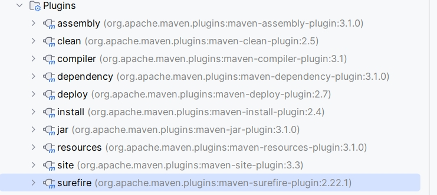

# 20240109

mvn package是生命周期，不是插件的命令行
7个
https://maven.apache.org/guides/introduction/introduction-to-the-lifecycle.html



maven构建生命周期
cmake
conan

cmake 中有类似maven build lifecycle之类的概念吗？
在 CMake 中，没有像 Maven 中的构建生命周期（build lifecycle）一样明确定义的概念。CMake 是一个构建系统生成工具，它的主要目标是生成适合不同平台和编译器的构建文件（如 Makefile、Ninja 构建文件等），以便构建项目。CMake 本身并不处理构建的过程和构建阶段，而是由生成的构建文件（如 Makefile）来控制构建过程。
与 Maven 不同，CMake 不具备预定义的构建生命周期阶段（如编译、测试、打包等）。相反，CMake 提供了一种灵活的方式来组织和管理构建过程，开发者可以根据项目的需求自定义构建过程。在 CMakeLists.txt 文件中，您可以使用 CMake 的命令和指令来定义目标（target）、依赖关系、编译选项等。
开发者可以通过使用 CMake 的命令来执行构建任务，例如：

- `add_executable()`：定义可执行目标。
- `add_library()`：定义库目标。
- `target_compile_options()`：设置编译选项。
- `add_custom_target()`：定义自定义目标。
- `add_dependencies()`：定义目标之间的依赖关系。
- `add_test()`：定义测试目标。

使用这些命令，您可以自由定义构建过程中的目标和构建任务，并通过设置依赖关系来控制构建的顺序。
尽管 CMake 没有像 Maven 那样具体的构建生命周期概念，但您可以使用自定义目标和依赖关系来实现类似的构建流程。这使得开发者能够更灵活地组织和管理项目的构建过程。
总而言之，CMake 提供了一种灵活而强大的方式来生成构建文件，并通过自定义目标和依赖关系来组织和管理构建过程，以满足不同项目的需求。

maven编译产物文件夹
target

cmake默认
cmake-builld-debug
cmake-build-release
build

conan默认编译文件夹

pip
conda

maven 插件的goal 绑定生命周期了

maven site插件

src/site文件夹下面
是的，Maven site生成的是HTML格式的文档。  通过执行命令"mvn site"，它会在target/site目录下生成一个静态的网站，包含项目的概况、源码、测试、依赖、报告以及自定义的内容等。

https://zhuanlan.zhihu.com/p/666035943

https://zhuanlan.zhihu.com/p/637812523

```shell
filename="boot"
len=${#filename}
```

错误写法，字符没加双引号，= 左右边不能有空格

```shell
filename = boot
len=${#filename}
```

bash脚本需要抽象方法

你在命令行执行的代码，组合成bash脚本
bash脚本跟python脚本的区别？
python有函数
bash只有可执行程序的组合

github action也是类似的
travis的自动化构建脚本

```shell
if command -v wget &> /dev/null; then
    echo "wget command exists."
else
    echo "wget command does not exist."
fi
```

抽象成函数

```shell
check_command_exists() {
    if command -v "$1" &> /dev/null; then
        echo "$1 command exists."
    else
        echo "$1 command does not exist."
    fi
}
```

调用函数检查 wget 命令是否存在
check_command_exists "wget"

在java类文件内部，也可是抽象函数，减少重复代码

多个.sh文件之间如何调用？

在 Bash 中，可以使用不同的方法在多个 `.sh` 文件之间进行调用和交互。下面列出了几种常见的方法：

1. 使用 `source` 命令：使用 `source` 命令可以在一个脚本中加载并执行另一个脚本。这样，被调用的脚本中定义的函数和变量将在调用脚本中可用。示例：`source script2.sh`
2. 使用 `.` 命令：类似于 `source`，`.` 命令也可用于加载并执行另一个脚本。示例：`. script2.sh`
3. 使用可执行脚本：如果要从一个脚本中调用另一个脚本，可以将被调用的脚本设置为可执行，并使用 `./` 表示当前目录。示例：`./script2.sh`
4. 使用函数：在一个脚本中定义函数，然后从另一个脚本中调用该函数。这样可以将代码逻辑封装为函数，便于代码复用和模块化。示例：

```bash
# script1.sh
# 定义一个函数
function greet() {
   echo "Hello, world!"
}

# script2.sh
# 调用 script1.sh 中的函数
source script1.sh
greet
```

这些方法提供了不同的方式来实现脚本之间的调用和交互，具体使用哪种方法取决于您的需求和场景。

希望这可以帮助您在多个 `.sh` 文件之间进行调用和交互。如果您有其他问题，请随时提问。

git 一次性merge多个分支?

git merge localbranchA localbranchB
git merge localbranchA remoteName/branchB

git fetch origin new_branch
git merge origin/new_branch
