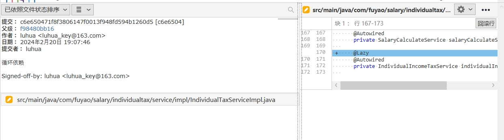

# 20240220

在 MyBatis 的 `mybatis-config.xml` 文件中，您可以定义变量并在配置文件的其他地方使用这些变量。以下是一个示例，展示如何在 `mybatis-config.xml` 中定义和使用变量：

```xml
<configuration>
  <!-- 定义变量 -->
  <properties>
    <property name="myVariable" value="Hello, World!" />
  </properties>

  <!-- 使用变量 -->
  <mappers>
    <mapper resource="${myVariable}/UserMapper.xml" />
  </mappers>
</configuration>
```

```yml
# mybatis配置
mybatis:
#  mapper-locations: classpath:sqlmap/oracle/**/*.xml
  mapper-locations: classpath:sqlmap/mysql/**/*.xml
  configuration:
    variables:
      defaultSchema: HRBASE_UAT2
      fuyaoUserSchema: FUYAO_USER_DEV
      appMarketSchema: APP_MARKET_DEV
      fuyaoApplicationSchema: FUYAO_APPLICATION_DEV
      fuyaoHroSchema: SMART_HRO
```


上述示例中，我们在 `<properties>` 元素中定义了一个名为 `myVariable` 的变量，并将其值设置为 "Hello, World!"。然后，在 `<mapper>` 元素的 `resource` 属性中，我们使用 `${myVariable}` 来引用该变量，并将其作为 XML 映射文件的路径。

您可以根据自己的需求定义和使用更多的变量。在配置文件的其他位置，您可以使用 `${变量名}` 的形式来引用变量。

请注意，`mybatis-config.xml` 文件中的变量是静态的，只能在配置文件加载时进行解析和使用。如果您希望在运行时动态使用变量，可以考虑使用 MyBatis 的动态 SQL 功能或通过编程方式进行参数传递和处理。

sudo apt-get install boost-all-dev -y 错
sudo apt-get install libboost-all-dev -y 对

    public class UserBillDiffData implements Serializable {
	    private static final long serialVersionUID = 1570325444686191980L;

    private String name;//姓名
	    private String jobNo;//工号
	    private String depName;//部门
	    //省略get/set
	}

    List`<UserBillDiffData>` billLocalUserDiffEntityList;
		按照姓名排序billLocalUserDiffEntityList

// 将数组转换为Set
    Set`<String>` stringSet = Arrays.stream(completionArray).collect(Collectors.toSet());

```shell
19:00:29.955 [] [                   main] ERROR org.springframework.boot.diagnostics.LoggingFailureAnalysisReporter - 

***************************
APPLICATION FAILED TO START
***************************

Description:

The dependencies of some of the beans in the application context form a cycle:

   annualBonusController (field com.fuyao.salary.commission.service.CommissionService com.fuyao.salary.annualbonus.web.AnnualBonusController.commissionService)
      ↓
   commissionServiceImpl (field com.fuyao.salary.calculator.service.SalaryCalculateService com.fuyao.salary.commission.service.impl.CommissionServiceImpl.salarycalculateservice)
┌─────┐
|  salaryCalculateServiceImpl defined in URL [jar:file:/app/fuyao-hr/fuyao-hr-api/boot/fuyao-hr-api.jar!/com/fuyao/salary/calculator/service/impl/SalaryCalculateServiceImpl.class]
↑     ↓
|  individualTaxServiceImpl (field private com.fuyao.salary.individualtax.service.IndividualIncomeTaxService com.fuyao.salary.individualtax.service.impl.IndividualTaxServiceImpl.individualIncomeTaxService)
↑     ↓
|  individualIncomeTaxServiceImpl (field com.fuyao.salary.calculator.service.impl.SalaryCalculateServiceImpl com.fuyao.salary.individualtax.service.impl.IndividualIncomeTaxServiceImpl.salaryCalculateServiceImpl)
```

spring ioc循环依赖
解决



加上
@Lazy注解

userBillDiffDataByInsureList.stream().map(UserBillDiffDataByInsure::getInsureName).collect(Collectors.toSet());

https://e.coding.net/yitongjinfushiyebu/SMART_SALARY_1_0/fuyao-salary.git

https://e.coding.net/yitongjinfushiyebu/OPEN_PLATFORM/B_CLOUD_MP_HRMREG.git

https://www.toutiao.com/
头条pc网页版

centos 7安装mysql server并且修改root密码，ip访问权限
sudo rpm -Uvh https://dev.mysql.com/get/mysql57-community-release-el7-11.noarch.rpm
sudo yum update -y
sudo rpm --import https://repo.mysql.com/RPM-GPG-KEY-mysql-2022
sudo yum install mysql-community-server -y
sudo systemctl enable mysqld
sudo systemctl start mysqld
sudo grep 'temporary password' /var/log/mysqld.log
mysql -u root -p
GwkgoB8Udo(o
ALTER USER 'root'@'localhost' IDENTIFIED BY '5%Edidadas';
ALTER USER 'root'@'%' IDENTIFIED BY '5%Edidadas';
FLUSH PRIVILEGES;
exit;

CREATE USER 'wdidada'@'*' IDENTIFIED BY '5%Edidadas';
GRANT ALL PRIVILEGES ON *.* TO 'wdidada'@'*';


GRANT ALL PRIVILEGES ON *.* TO 'wdidada'@'%' IDENTIFIED BY '5%Edidadas' WITH GRANT OPTION;
FLUSH   PRIVILEGES;


GRANT ALL PRIVILEGES ON *.* TO 'root'@'%' IDENTIFIED BY '5%Edidadas' WITH GRANT OPTION;
FLUSH   PRIVILEGES;


https://blog.csdn.net/qq_37502106/article/details/80207052


安装/更新 MySQL：GPG key at file:///etc/pki/rpm-gpg/RPM-GPG-KEY-mysql (0x5072E1F5) is already installed

https://blog.csdn.net/peng2hui1314/article/details/129585869

