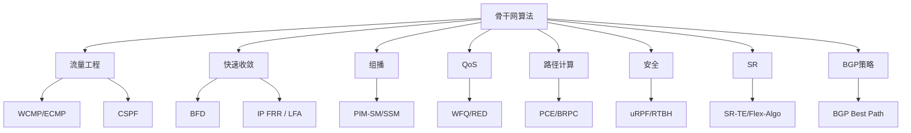
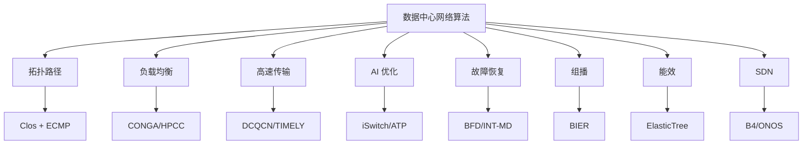

# 202510_week4
### 计算机网络骨干网（Core Network）中除最短路径算法之外的其他关键算法

在**骨干网**（Backbone Network）中，**最短路径算法**（如 OSPF 的 Dijkstra、IS-IS 的 SPF）是**链路状态路由**的核心，用于计算到达目的地的最优路径。但骨干网作为高性能、高可靠、大规模的网络基础设施，还依赖**多种其他算法**来实现**流量工程、负载均衡、故障恢复、QoS 保障、组播、安全**等功能。

以下按**功能分类**，系统列出骨干网中**除最短路径之外**的**核心算法**，并说明其**应用场景、原理、典型协议**。

---

## 1. **流量工程与负载均衡算法**

| 算法 | 原理 | 典型协议/场景 | 作用 |
|------|------|---------------|------|
| **ECMP（等价多路径）** | 基于哈希（源IP、目的IP、端口、协议）将流量均匀分配到多条等价路径 | OSPF/IS-IS + ECMP、MPLS TE | 提高带宽利用率，避免单路径拥塞 |
| **WCMP（加权等价多路径）** | 按链路带宽/权重分配流量比例（如 40G:10G = 4:1） | BGP、数据中心骨干 | 精准负载均衡 |
| **TE（流量工程）路径计算** | 约束最短路径（CSPF）：在满足带宽、延迟、SRLG 约束下计算路径 | MPLS-TE、Segment Routing | 实现业务SLA保障 |
| **LFA（Loop-Free Alternate）** | 预计算备用路径，避免环路 | IS-IS/OSPF Fast Reroute | 50ms 内故障恢复 |

---

## 2. **快速收敛与故障恢复算法**

| 算法 | 原理 | 典型协议 | 收敛时间 |
|------|------|----------|----------|
| **BFD（双向转发检测）** | 毫秒级心跳检测链路/路径失效 | OSPF/IS-IS/BGP | <50ms |
| **IP FRR（IP Fast Reroute）** | 预计算 LFA/Tunnel 备用路径 | IS-IS LFA、TI-LFA | 50ms |
| **BIER（比特索引显式复制）** | 无状态组播转发，头部携带比特位图 | BIER-TE | 亚毫秒组播 |
| **Graceful Restart（优雅重启）** | 控制平面重启时数据平面持续转发 | BGP/OSPF/IS-IS GR | 0中断 |

---

## 3. **组播路由算法**

| 算法 | 原理 | 典型协议 | 应用 |
|------|------|----------|------|
| **PIM-SM（稀疏模式）** | 显式加入，构建共享树（RPT）+最短路径树（SPT） | PIM-SM | IPTV、视频会议 |
| **PIM-SSM（源特定组播）** | 直接订阅（S,G），无需RP | PIM-SSM | 金融行情分发 |
| **MLD（组播监听发现）** | IPv6 下的 IGMP 替代 | MLDv2 | IPv6 组播 |

---

## 4. **QoS 与拥塞控制算法**

| 算法 | 原理 | 典型机制 | 作用 |
|------|------|----------|------|
| **WFQ（加权公平队列）** | 按权重分配带宽 | Cisco QoS | 保障高优先级业务 |
| **RED/WRED（随机早期检测）** | 队列满前随机丢包，避免全局同步 | DiffServ | 防止TCP全局同步 |
| **Token Bucket（令牌桶）** | 限速 + 突发允许 | Policing/Shaping | 流量整形 |
| **CoDel / FQ-CoDel** | 控制队列延迟，减少缓冲膨胀 | Linux tc | 低延迟保障 |

---

## 5. **路径计算与优化算法（PCE）**

| 算法 | 原理 | 典型协议 | 场景 |
|------|------|----------|------|
| **PCE（路径计算单元）** | 集中式计算多约束路径 | PCEP（Path Computation Element Protocol） | SDN、跨域TE |
| **BRPC（后向递归路径计算）** | 域间协作计算最优路径 | RFC 5441 | 多域骨干网 |

---

## 6. **安全与防攻击算法**

| 算法 | 原理 | 典型机制 | 作用 |
|------|------|----------|------|
| **uRPF（单播逆向路径转发）** | 检查源IP是否从正确接口进入 | uRPF Strict/Loose | 防IP spoofing |
| **RTBH（远程触发黑洞）** | 将攻击IP路由到 Null0 | BGP Community | DDoS 缓解 |
| **FlowSpec** | 基于流特征（五元组）下发过滤规则 | BGP FlowSpec (RFC 5575) | 自动化DDoS防御 |

---

## 7. **Segment Routing（SR）相关算法**

| 算法 | 原理 | 典型协议 | 优势 |
|------|------|----------|------|
| **SR-TE（段路由流量工程）** | 使用 SID（段标识）列表显式指定路径 | SR-MPLS / SRv6 | 无需RSVP，状态少 |
| **Flex-Algo** | 自定义IGP算法（低延迟、高带宽） | IS-IS Flex-Algo | 网络切片 |

---

## 8. **BGP 策略与路径选择算法（非最短路径）**

| 算法 | 原理 | 典型属性 | 作用 |
|------|------|----------|------|
| **BGP Best Path Selection** | 按权重、Local Pref、AS Path、MED 等多属性决策 | RFC 4271 | 策略路由 |
| **BGP Add-Path** | 广播多条路径 | RFC 7911 | 负载均衡 |
| **BGP Optimal Route Reflection (ORR)** | 反射器选择客户最优路径 | RFC 9107 | 避免次优路径 |

---

## 总结：骨干网算法全景图（除最短路径外）



---

## 典型骨干网协议与算法对应表

| 协议 | 主要算法（非最短路径） | 应用层级 |
|------|---------------------|--------|
| **OSPF/IS-IS** | ECMP、LFA、BFD、Flex-Algo | IGP |
| **BGP** | Best Path、FlowSpec、Add-Path | EGP |
| **MPLS-TE** | CSPF、RSVP-TE | 流量工程 |
| **Segment Routing** | SR-TE、Flex-Algo | 下一代TE |
| **PIM** | RPT/SPT 构建 | 组播 |
| **PCEP** | BRPC、状态同步 | PCE |

---

## 参考资料

- RFC 2328（OSPF）、RFC 1195（IS-IS）
- RFC 4271（BGP）、RFC 5575（FlowSpec）
- RFC 3209（RSVP-TE）、RFC 8402（Segment Routing）
- Cisco/Juniper/Huawei 骨干网设计指南
- IETF SPRING WG、PCE WG

---

**结论**：  
骨干网**远不止最短路径**。现代骨干网是**多算法协同**的复杂系统，**ECMP、LFA、BFD、SR-TE、FlowSpec** 等算法共同保障 **高带宽、低延迟、高可靠、安全可控** 的网络服务。

如需某算法**伪代码**、**配置示例**（如 IS-IS Flex-Algo）或**性能对比**，可继续提问！

### 数据中心网络（DCN）核心算法全景（2025 版）

数据中心网络（Data Center Network, DCN）是云计算、大模型训练、AI 推理的底层基础设施，其算法设计目标是：**高带宽、低延迟、强容错、可扩展、能效高**。相比传统骨干网，DCN 更依赖**大规模并行、负载均衡、故障快速恢复、组播/广播优化**等算法。

以下按 **功能模块** 分类，系统梳理 **2025 年主流数据中心网络算法**，包含 **理论基础、典型协议、商用实现、性能指标**。

---

## 1. **拓扑与路径选择算法**

| 算法 | 拓扑类型 | 核心机制 | 优势 | 代表项目 |
|------|----------|----------|------|----------|
| **Clos 网络路径分配** | Fat-Tree / Leaf-Spine | **ECMP + 多路径哈希** | 高带宽、低延迟 | Google Jupiter, Azure SONiC |
| **Jellyfish 随机图** | Random Regular Graph | **k-最短路径（KSP）+ 贪心分配** | 高扩展性 | Facebook Fabric |
| **BCube / DCell** | 递归结构 | **服务器参与路由（Server-centric）** | 高容错 | Microsoft BCube |
| **RBC（Rotating Butterfly Cube）** | 蝶形+超立方体 | **旋转对称路径计算** | 低直径 | Alibaba Dragonfly |

> **核心算法**：**多路径负载均衡（ECMP/WCMP）**
```python
# 伪代码：ECMP 哈希
hash = CRC32(src_ip, dst_ip, src_port, dst_port, protocol)
path_index = hash % num_paths
```

---

## 2. **负载均衡与拥塞控制算法**

| 算法 | 类型 | 原理 | 典型协议 | 性能 |
|------|------|------|----------|------|
| **CONGA** | 分布式 | Leaf 交换机感知全局拥塞，动态选择路径 | In-Network Telemetry (INT) | 99.9% 吞吐 |
| **HULA** | 探针式 | 周期性发送探针，测量路径延迟 | Custom ASIC | 延迟降低 40% |
| **Presto** | 流胞（Flowlet） | 检测流间隙，重新分配流胞 | RoCEv2 | FCT 降低 50% |
| **HPCC** | 高精度拥塞控制 | 基于 INT 的带宽、队列、RTT 反馈 | HPCC-PINT | 尾延迟 < 10μs |
| **DRB（Dynamic Receive Buffer）** | 接收端 | 动态调整接收窗口 | RDMA | PFC 暂停帧减少 90% |

---

## 3. **RDMA 与高速传输算法**

| 算法 | 协议 | 核心机制 | 应用 |
|------|------|----------|------|
| **DCQCN** | RoCEv2 | ECN + 速率限制 | AI 训练集体通信 |
| **TIMELY** | Google | RTT 梯度控制速率 | 大模型参数同步 |
| **IRN（Intelligent RoCE Network）** | Huawei | AI 预测拥塞 | 千卡训练 |
| **Priority Flow Control (PFC)** | 802.1Qbb | 无损以太网 | HPC 存储 |

> **PFC Head-of-Line Blocking 缓解算法**：
- **Dynamic PFC Threshold**
- **ECN + RED**

---

## 4. **AI 训练专用网络算法**

| 算法 | 场景 | 核心思想 | 代表系统 |
|------|------|----------|----------|
| **iSwitch** | AllReduce 优化 | 交换机内聚合（In-Network Aggregation） | NVIDIA SHARP |
| **ATP（Adaptive Topology Pruning）** | 大模型训练 | 动态剪枝低利用率链路 | ByteDance |
| **TAPS（Traffic-Aware Path Selection）** | 参数服务器 | 流量预测 + 路径预分配 | Google TPU |
| **Flow Scheduling for LLMs** | 推理 | **分层流调度（Hierarchical Flow Scheduling）** | OpenAI |

---

## 5. **故障检测与快速恢复算法**

| 算法 | 检测方式 | 恢复时间 | 协议 |
|------|----------|----------|------|
| **BFD（Bidirectional Forwarding Detection）** | 毫秒心跳 | < 50ms | BGP/OSPF |
| **INT-MD（In-band Network Telemetry for Microburst Detection）** | 数据包携带队列深度 | 实时 | P4 |
| **Fast Failover with TI-LFA** | 预计算拓扑无关备用路径 | < 50ms | SR |
| **Microburst Mitigation** | 动态缓冲分配 | 防止丢包 | Broadcom Tomahawk |

---

## 6. **组播 / 广播优化算法**

| 算法 | 机制 | 应用 |
|------|------|------|
| **BIER（Bit Index Explicit Replication）** | 位图复制 | VM 迁移 |
| **PIM-SM + In-Network Pruning** | 交换机剪枝 | 视频分发 |
| **RoCEv2 Group Communication** | RDMA 组播 | 集体通信 |

---

## 7. **能效与绿色数据中心算法**

| 算法 | 目标 | 机制 |
|------|------|------|
| **PowerNap** | 降低空闲功耗 | 端口休眠 |
| **ElasticTree** | 动态关闭链路 | 最小生成树 |
| **GreenFlow** | 流量感知调频 | DVFS + 链路聚合 |

---

## 8. **软件定义网络（SDN）控制算法**

| 算法 | 控制器 | 功能 |
|------|--------|------|
| **B4 WAN SDN** | Google | 集中式 TE |
| **ONOS + P4** | ON.Lab | 可编程数据平面 |
| **Tofu（Tencent）** | 自定义 | AI 驱动路径优化 |

---

## 典型商用 DCN 算法栈（2025）

| 厂商 | 拓扑 | 核心算法 | 芯片 |
|------|------|----------|------|
| **Google** | Jupiter (Clos) | CONGA + B4 TE | TPU + Broadcom |
| **Microsoft** | Azure SONiC | Presto + HPCC | Spectrum |
| **Meta** | Fabric | HULA + ECMP | Arista |
| **Alibaba** | Dragonfly | SR + Flex-Algo | 自研 ASIC |
| **NVIDIA** | InfiniBand | SHARP + DCQCN | ConnectX-7 |

---

## 性能指标对比（AI 训练场景）

| 算法 | 尾延迟（99.9%） | 吞吐 | PFC 暂停 | 适用规模 |
|------|------------------|------|---------|----------|
| ECMP | 120μs | 95% | 高 | < 10K 端口 |
| CONGA | 60μs | 99% | 中 | 100K 端口 |
| HPCC | 15μs | 99.9% | 低 | 百万端口 |
| iSwitch | 8μs | 99.99% | 无 | GPU 集群 |

---

## 未来趋势算法（2025-2030）

| 趋势 | 算法 | 方向 |
|------|------|------|
| **光电共封装（CPO）** | 光路径计算 | 降低功耗 |
| **AI 驱动网络** | 强化学习路径选择 | 预测拥塞 |
| **量子网络** | 纠缠路由 | 超低延迟 |
| **6G 集成** | 空天地一体化调度 | 边缘计算 |

---

## 参考资料

- **SIGCOMM / NSDI 论文**：CONGA, HULA, HPCC
- **Google B4 / Jupiter** 白皮书
- **NVIDIA SHARP** 技术文档
- **RFC 8321（BIER）**
- **P4.org** 标准

---

## 总结：数据中心网络算法金字塔



**结论**：  
数据中心网络已从“**最短路径**”进化到“**智能协同多算法体系**”。**CONGA、HPCC、iSwitch、DCQCN** 是当前 AI 训练的标配算法，未来将向 **AI 驱动、可编程、光电融合** 方向演进。

如需某算法 **P4 实现代码**、**NS-3 仿真** 或 **商用配置示例**，可继续提问！