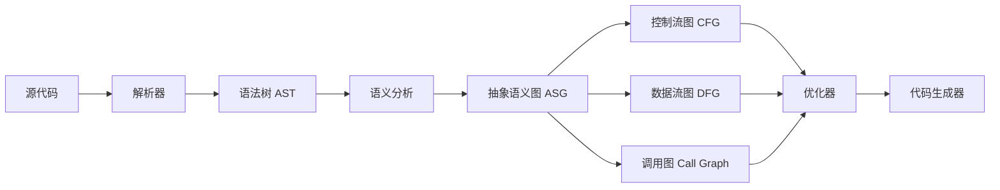

# 20260310

cmake注释
超级实用总结
单行：# 注释内容
多行：[[ 多行注释 ]]
注释掉报错代码：直接在前面加 # 就行

bash注释

pplications/Xcode.app/Contents/Developer/Toolchains/XcodeDefault.xctoolchain/usr/bin/ranlib: file: /Users/ibqo/Develop/git/github/cpp/test_quic_codex/testmsquic/third_party/msquic/build/_deps/opensslquic-build/quictls/lib/libcrypto.a.new(libcrypto-lib-e_bf.o) has no symbols
/Applications/Xcode.app/Contents/Developer/Toolchains/XcodeDefault.xctoolchain/usr/bin/ranlib: file: /Users/ibqo/Develop/git/github/cpp/test_quic_codex/testmsquic/third_party/msquic/build/_deps/opensslquic-build/quictls/lib/libcrypto.a.new(libcrypto-lib-e_cast.o) has no symbols
/Applications/Xcode.app/Contents/Developer/Toolchains/XcodeDefault.xctoolchain/usr/bin/ranlib: file: /Users/ibqo/Develop/git/github/cpp/test_quic_codex/testmsquic/third_party/msquic/build/_deps/opensslquic-build/quictls/lib/libcrypto.a.new(libcrypto-lib-e_idea.o) has no symbols
/Applications/Xcode.app/Contents/Developer/Toolchains/XcodeDefault.xctoolchain/usr/bin/ranlib: file: /Users/ibqo/Develop/git/github/cpp/test_quic_codex/testmsquic/third_party/msquic/build/_deps/opensslquic-build/quictls/lib/libcrypto.a.new(libcrypto-lib-e_rc2.o) has no symbols
/Applications/Xcode.app/Contents/Developer/Toolchains/XcodeDefault.xctoolchain/usr/bin/ranlib: file: /Users/ibqo/Develop/git/github/cpp/test_quic_codex/testmsquic/third_party/msquic/build/_deps/opensslquic-build/quictls/lib/libcrypto.a.new(libcrypto-lib-e_rc4.o) has no symbols
/Applications/Xcode.app/Contents/Developer/Toolchains/XcodeDefault.xctoolchain/usr/bin/ranlib: file: /Users/ibqo/Develop/git/github/cpp/test_quic_codex/testmsquic/third_party/msquic/build/_deps/opensslquic-build/quictls/lib/libcrypto.a.new(libcrypto-lib-e_rc4_hmac_md5.o) has no symbols
/Applications/Xcode.app/Contents/Developer/Toolchains/XcodeDefault.xctoolchain/usr/bin/ranlib: file: /Users/ibqo/Develop/git/github/cpp/test_quic_codex/testmsquic/third_party/msquic/build/_deps/opensslquic-build/quictls/lib/libcrypto.a.new(libcrypto-lib-e_rc5.o) has no symbols
/Applications/Xcode.app/Contents/Developer/Toolchains/XcodeDefault.xctoolchain/usr/bin/ranlib: file: /Users/ibqo/Develop/git/github/cpp/test_quic_codex/testmsquic/third_party/msquic/build/_deps/opensslquic-build/quictls/lib/libcrypto.a.new(libcrypto-lib-e_sm4.o) has no symbols
/Applications/Xcode.app/Contents/Developer/Toolchains/XcodeDefault.xctoolchain/usr/bin/ranlib: file: /Users/ibqo/Develop/git/github/cpp/test_quic_codex/testmsquic/third_party/msquic/build/_deps/opensslquic-build/quictls/lib/libcrypto.a.new(libcrypto-lib-pbe_scrypt.o) has no symbols
/Applications/Xcode.app/Contents/Developer/Toolchains/XcodeDefault.xctoolchain/usr/bin/ranlib: file: /Users/ibqo/Develop/git/github/cpp/test_quic_codex/testmsquic/third_party/msquic/build/_deps/opensslquic-build/quictls/lib/libcrypto.a.new(libcrypto-lib-kdf_err.o) has no symbols
/Applications/Xcode.app/Contents/Developer/Toolchains/XcodeDefault.xctoolchain/usr/bin/ranlib: file: /Users/ibqo/Develop/git/github/cpp/test_quic_codex/testmsquic/third_party/msquic/build/_deps/opensslquic-build/quictls/lib/libcrypto.a.new(libcrypto-lib-lh_stats.o) has no symbols
/Applications/Xcode.app/Contents/Developer/Toolchains/XcodeDefault.xctoolchain/usr/bin/ranlib: file: /Users/ibqo/Develop/git/github/cpp/test_quic_codex/testmsquic/third_party/msquic/build/_deps/opensslquic-build/quictls/lib/libcrypto.a.new(libcrypto-lib-ebcdic.o) has no symbols
/Applications/Xcode.app/Contents/Developer/Toolchains/XcodeDefault.xctoolchain/usr/bin/ranlib: file: /Users/ibqo/Develop/git/github/cpp/test_quic_codex/testmsquic/third_party/msquic/build/_deps/opensslquic-build/quictls/lib/libcrypto.a.new(libcrypto-lib-quic_vlint.o) has no symbols
/Applications/Xcode.app/Contents/Developer/Toolchains/XcodeDefault.xctoolchain/usr/bin/ranlib: file: /Users/ibqo/Develop/git/github/cpp/test_quic_codex/testmsquic/third_party/msquic/build/_deps/opensslquic-build/quictls/lib/libcrypto.a.new(libcrypto-lib-threads_lib.o) has no symbols
/Applications/Xcode.app/Contents/Developer/Toolchains/XcodeDefault.xctoolchain/usr/bin/ranlib: file: /Users/ibqo/Develop/git/github/cpp/test_quic_codex/testmsquic/third_party/msquic/build/_deps/opensslquic-build/quictls/lib/libcrypto.a.new(libcrypto-lib-threads_none.o) has no symbols
/Applications/Xcode.app/Contents/Developer/Toolchains/XcodeDefault.xctoolchain/usr/bin/ranlib: file: /Users/ibqo/Develop/git/github/cpp/test_quic_codex/testmsquic/third_party/msquic/build/_deps/opensslquic-build/quictls/lib/libcrypto.a.new(libcrypto-lib-threads_win.o) has no symbols
/Applications/Xcode.app/Contents/Developer/Toolchains/XcodeDefault.xctoolchain/usr/bin/ranlib: file: /Users/ibqo/Develop/git/github/cpp/test_quic_codex/testmsquic/third_party/msquic/build/_deps/opensslquic-build/quictls/lib/libcrypto.a.new(libcrypto-lib-ocb128.o) has no symbols
/Applications/Xcode.app/Contents/Developer/Toolchains/XcodeDefault.xctoolchain/usr/bin/ranlib: file: /Users/ibqo/Develop/git/github/cpp/test_quic_codex/testmsquic/third_party/msquic/build/_deps/opensslquic-build/quictls/lib/libcrypto.a.new(libcrypto-lib-siv128.o) has no symbols
/Applications/Xcode.app/Contents/Developer/Toolchains/XcodeDefault.xctoolchain/usr/bin/ranlib: file: /Users/ibqo/Develop/git/github/cpp/test_quic_codex/testmsquic/third_party/msquic/build/_deps/opensslquic-build/quictls/lib/libcrypto.a.new(libcrypto-lib-rand_deprecated.o) has no symbols
/Applications/Xcode.app/Contents/Developer/Toolchains/XcodeDefault.xctoolchain/usr/bin/ranlib: file: /Users/ibqo/Develop/git/github/cpp/test_quic_codex/testmsquic/third_party/msquic/build/_deps/opensslquic-build/quictls/lib/libcrypto.a.new(libcrypto-lib-thread_none.o) has no symbols
/Applications/Xcode.app/Contents/Developer/Toolchains/XcodeDefault.xctoolchain/usr/bin/ranlib: file: /Users/ibqo/Develop/git/github/cpp/test_quic_codex/testmsquic/third_party/msquic/build/_deps/opensslquic-build/quictls/lib/libcrypto.a.new(libcrypto-lib-thread_win.o) has no symbols
/Applications/Xcode.app/Contents/Developer/Toolchains/XcodeDefault.xctoolchain/usr/bin/ranlib: file: /Users/ibqo/Develop/git/github/cpp/test_quic_codex/testmsquic/third_party/msquic/build/_deps/opensslquic-build/quictls/lib/libcrypto.a.new(libdefault-lib-argon2.o) has no symbols
/Applications/Xcode.app/Contents/Developer/Toolchains/XcodeDefault.xctoolchain/usr/bin/ranlib: file: /Users/ibqo/Develop/git/github/cpp/test_quic_codex/testmsquic/third_party/msquic/build/_deps/opensslquic-build/quictls/lib/libcrypto.a.new(libdefault-lib-scrypt.o) has no symbols
/Applications/Xcode.app/Contents/Developer/Toolchains/XcodeDefault.xctoolchain/usr/bin/ranlib: file: /Users/ibqo/Develop/git/github/cpp/test_quic_codex/testmsquic/third_party/msquic/build/_deps/opensslquic-build/quictls/lib/libcrypto.a.new(libdefault-lib-rand_cpu_x86.o) has no symbols
/Applications/Xcode.app/Contents/Developer/Toolchains/XcodeDefault.xctoolchain/usr/bin/ranlib: file: /Users/ibqo/Develop/git/github/cpp/test_quic_codex/testmsquic/third_party/msquic/build/_deps/opensslquic-build/quictls/lib/libcrypto.a.new(libdefault-lib-rand_tsc.o) has no symbols
/Applications/Xcode.app/Contents/Developer/Toolchains/XcodeDefault.xctoolchain/usr/bin/ranlib: file: /Users/ibqo/Develop/git/github/cpp/test_quic_codex/testmsquic/third_party/msquic/build/_deps/opensslquic-build/quictls/lib/libcrypto.a.new(libdefault-lib-rand_win.o) has no symbols
install libssl.a -> /Users/ibqo/Develop/git/github/cpp/test_quic_codex/testmsquic/third_party/msquic/build/_deps/opensslquic-build/quictls/lib/libssl.a
/Applications/Xcode.app/Contents/Developer/Toolchains/XcodeDefault.xctoolchain/usr/bin/ranlib: file: /Users/ibqo/Develop/git/github/cpp/test_quic_codex/testmsquic/third_party/msquic/build/_deps/opensslquic-build/quictls/lib/libssl.a.new(libssl-lib-d1_srtp.o) has no symbols
/Applications/Xcode.app/Contents/Developer/Toolchains/XcodeDefault.xctoolchain/usr/bin/ranlib: file: /Users/ibqo/Develop/git/github/cpp/test_quic_codex/testmsquic/third_party/msquic/build/_deps/opensslquic-build/quictls/lib/libssl.a.new(libssl-lib-ssl_err_legacy.o) has no symbols
/Applications/Xcode.app/Contents/Developer/Toolchains/XcodeDefault.xctoolchain/usr/bin/ranlib: file: /Users/ibqo/Develop/git/github/cpp/test_quic_codex/testmsquic/third_party/msquic/build/_deps/opensslquic-build/quictls/lib/libssl.a.new(libssl-lib-ssl_utst.o) has no symbols
/Applications/Xcode.app/Contents/Developer/Toolchains/XcodeDefault.xctoolchain/usr/bin/ranlib: file: /Users/ibqo/Develop/git/github/cpp/test_quic_codex/testmsquic/third_party/msquic/build/_deps/opensslquic-build/quictls/lib/libssl.a.new(libssl-lib-tls_srp.o) has no symbols
created directory `/Users/ibqo/Develop/git/github/cpp/test_quic_codex/testmsquic/third_party/msquic/build/_deps/opensslquic-build/quictls/lib/pkgconfig'
install exporters/libcrypto.pc -> /Users/ibqo/Develop/git/github/cpp/test_quic_codex/testmsquic/third_party/msquic/build/_deps/opensslquic-build/quictls/lib/pkgconfig/libcrypto.pc
install exporters/libssl.pc -> /Users/ibqo/Develop/git/github/cpp/test_quic_codex/testmsquic/third_party/msquic/build/_deps/opensslquic-build/quictls/lib/pkgconfig/libssl.pc
install exporters/openssl.pc -> /Users/ibqo/Develop/git/github/cpp/test_quic_codex/testmsquic/third_party/msquic/build/_deps/opensslquic-build/quictls/lib/pkgconfig/openssl.pc
created directory `/Users/ibqo/Develop/git/github/cpp/test_quic_codex/testmsquic/third_party/msquic/build/_deps/opensslquic-build/quictls/lib/cmake'
created directory `/Users/ibqo/Develop/git/github/cpp/test_quic_codex/testmsquic/third_party/msquic/build/_deps/opensslquic-build/quictls/lib/cmake/OpenSSL'
install exporters/OpenSSLConfig.cmake -> /Users/ibqo/Develop/git/github/cpp/test_quic_codex/testmsquic/third_party/msquic/build/_deps/opensslquic-build/quictls/lib/cmake/OpenSSL/OpenSSLConfig.cmake
install exporters/OpenSSLConfigVersion.cmake -> /Users/ibqo/Develop/git/github/cpp/test_quic_codex/testmsquic/third_party/msquic/build/_deps/opensslquic-build/quictls/lib/cmake/OpenSSL/OpenSSLConfigVersion.cmake
[ 73%] Built target OpenSSL_Target
[ 74%] Building C object src/platform/CMakeFiles/msquic_platform.dir/crypt.c.o
[ 76%] Building C object src/platform/CMakeFiles/msquic_platform.dir/hashtable.c.o
[ 77%] Building C object src/platform/CMakeFiles/msquic_platform.dir/pcp.c.o
[ 79%] Building C object src/platform/CMakeFiles/msquic_platform.dir/platform_worker.c.o
[ 80%] Building C object src/platform/CMakeFiles/msquic_platform.dir/toeplitz.c.o
[ 82%] Building C object src/platform/CMakeFiles/msquic_platform.dir/platform_posix.c.o
[ 84%] Building C object src/platform/CMakeFiles/msquic_platform.dir/storage_posix.c.o
[ 85%] Building C object src/platform/CMakeFiles/msquic_platform.dir/cgroup.c.o
[ 87%] Building C object src/platform/CMakeFiles/msquic_platform.dir/datapath_unix.c.o
[ 88%] Building C object src/platform/CMakeFiles/msquic_platform.dir/datapath_kqueue.c.o
[ 90%] Building C object src/platform/CMakeFiles/msquic_platform.dir/tls_quictls.c.o
[ 92%] Building C object src/platform/CMakeFiles/msquic_platform.dir/crypt_openssl.c.o
[ 93%] Building C object src/platform/CMakeFiles/msquic_platform.dir/certificates_darwin.c.o
[ 95%] Building C object src/platform/CMakeFiles/msquic_platform.dir/selfsign_openssl.c.o
[ 96%] Linking C static library ../../obj/Release/libmsquic_platform.a
[ 96%] Built target msquic_platform
[ 98%] Building C object src/bin/CMakeFiles/msquic.dir/linux/init.c.o
[100%] Linking C shared library ../../bin/Release/libmsquic.dylib
[100%] Built target msquic
ibqo@ibqodeMBP msquic % sudo cmake --install build
Password:
-- Install configuration: "Release"
-- Installing: /usr/local/lib/libmsquic.2.6.0.dylib
-- Installing: /usr/local/lib/libmsquic.2.dylib
-- Installing: /usr/local/lib/libmsquic.dylib
-- Installing: /usr/local/lib/libmsquic_platform.a
-- Installing: /usr/local/include/msquic.h
-- Installing: /usr/local/include/msquic.hpp
-- Installing: /usr/local/include/msquic_fuzz.h
-- Installing: /usr/local/include/msquic_posix.h
-- Installing: /usr/local/include/msquic_winkernel.h
-- Installing: /usr/local/include/msquic_winuser.h
-- Installing: /usr/local/include/msquichelper.h
-- Installing: /usr/local/include/msquicp.h
-- Installing: /usr/local/include/quic_cert.h
-- Installing: /usr/local/include/quic_crypt.h
-- Installing: /usr/local/include/quic_datapath.h
-- Installing: /usr/local/include/quic_driver_helpers.h
-- Installing: /usr/local/include/quic_hashtable.h
-- Installing: /usr/local/include/quic_pcp.h
-- Installing: /usr/local/include/quic_platform.h
-- Installing: /usr/local/include/quic_platform_posix.h
-- Installing: /usr/local/include/quic_platform_winkernel.h
-- Installing: /usr/local/include/quic_platform_winuser.h
-- Installing: /usr/local/include/quic_sal_stub.h
-- Installing: /usr/local/include/quic_storage.h
-- Installing: /usr/local/include/quic_tls.h
-- Installing: /usr/local/include/quic_toeplitz.h
-- Installing: /usr/local/include/quic_trace.h
-- Installing: /usr/local/include/quic_trace_manifested_etw.h
-- Installing: /usr/local/include/quic_var_int.h
-- Installing: /usr/local/include/quic_versions.h
-- Installing: /usr/local/share/msquic/msquic-config.cmake
-- Installing: /usr/local/share/msquic/msquic.cmake
-- Installing: /usr/local/share/msquic/msquic-release.cmake
ibqo@ibqodeMBP msquic % 

mini-performance/crypto.sysu.c


/mnt/d/develops/git/github/cpp/YatCC/cmake-build-debug-wsl24/test/task0/mini-performance/crypto.sysu.c /mnt/d/develops/git/github/cpp/YatCC/test/diy-cases/001_002_crypto.sysu.c.out

**语义图**、**抽象语义图** 和 **ASG** 是编译器设计和程序分析中的重要概念，以下是清晰的解释：

## 1. 核心概念对比

| 概念 | 全称 | 层级 | 作用 |
|------|------|------|------|
| **语法树（AST）** | Abstract Syntax Tree | 语法层面 | 反映源代码的语法结构 |
| **语义图（Semantic Graph）** | - | 语义层面 | 表达程序的语义关系网络 |
| **抽象语义图（ASG）** | Abstract Semantic Graph | 语义层面 | 增强的语义图，包含丰富语义信息 |
| **控制流图（CFG）** | Control Flow Graph | 执行流程 | 展示程序执行路径 |
| **数据流图（DFG）** | Data Flow Graph | 数据依赖 | 展示数据值如何流动 |

## 2. 抽象语义图（ASG）详解

**ASG 是 AST 的语义增强版本**，在编译器前端（语法分析后）生成。

### 主要特点：
- **有向图结构**：不同于 AST 的树结构，ASG 是有向图，可表示共享节点
- **丰富的语义信息**：包含类型信息、符号表引用、作用域信息
- **消除语法糖**：将语法糖转换为更基础的语义表示
- **跨语言中间表示**：可作为多种源语言的统一中间表示

### 示例：从 AST 到 ASG
```c
// 源代码
int x = 10;
int y = x + 5;

// AST（简化）：
//   Declaration(int, x, 10)
//   Declaration(int, y, Add(Var(x), 5))

// ASG 表示：
//   [Var:x]---type:int---[Const:10]
//      |
//      +---dataflow--->[Add]---[Const:5]
//      |                   |
//      |               [Var:y]---type:int
```
在 ASG 中，变量 `x` 的使用点会**直接指向**声明点，形成数据流边。

## 3. ASG 的核心组件

### 3.1 节点类型
```python
class ASGNode:
    # 声明节点
    VariableDecl(name: str, type: Type)
    FunctionDecl(name: str, params: List[...], return_type: Type)
    
    # 表达式节点
    BinaryOp(op: str, left: ASGNode, right: ASGNode)
    CallExpr(callee: FunctionDecl, args: List[ASGNode])
    
    # 类型节点
    TypeNode(name: str, size: int, members: Dict)
    
    # 控制流节点
    IfStmt(cond: ASGNode, then: ASGNode, else: ASGNode)
    LoopStmt(body: ASGNode)
```

### 3.2 边类型
- **数据流边**：值从定义流向使用
- **控制流边**：执行顺序
- **类型边**：变量/表达式 → 类型定义
- **作用域边**：符号 → 作用域容器
- **继承边**：类之间的继承关系（OOP）

## 4. ASG 的应用场景

### 4.1 编译器优化
```python
# 常量传播示例
# 原始：x = 10; y = x + 5;
# 优化后：x = 10; y = 15;  # ASG 可识别常量表达式
```

### 4.2 静态分析
- **类型检查**：沿类型边验证类型一致性
- **未初始化变量检测**：检查数据流路径
- **死代码消除**：基于控制流分析

### 4.3 代码生成
```c
// ASG 可作为多种后端的输入
ASG → LLVM IR
     → WebAssembly
     → JVM bytecode
     → 其他中间表示
```

## 5. 实际实现示例

### Python 的 AST 与语义图对比
```python
# 源代码
def add(a: int, b: int) -> int:
    return a + b

# AST（Python ast 模块）
#   FunctionDef(name='add', args=arguments(...), body=[Return(...)])

# ASG 增强信息：
#   - 参数 a, b 的类型为 int
#   - 返回类型为 int
#   - 函数签名：add(int, int) -> int
#   - 符号表：{a: int, b: int}
```

### 工具支持
- **Clang/LLVM**：通过 `clang -ast-dump` 可查看类似 ASG 的表示
- **Roslyn**（.NET 编译器平台）：包含丰富的语义 API
- **Pyright/Pylance**：Python 语言服务器的语义分析器
- **Tree-sitter**：带增量更新的解析器，可扩展为语义图

## 6. ASG 与相关概念的关系



## 7. 在编译器中的位置
```
编译流程：
源代码 → 词法分析 → 语法分析 → AST → 语义分析 → ASG → 优化 → 目标代码
                                  ↓
                              符号表、类型系统
```

**总结**：ASG 是连接语法分析和后续优化的桥梁，将语法信息与丰富的语义信息（类型、作用域、数据依赖）结合起来，为高级程序分析和优化提供了基础数据结构。现代 IDE 的智能提示、重构功能，以及编译器的优化都重度依赖 ASG 或其变体。