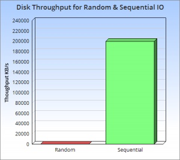

# LSMT

今天来聊聊lsm tree，它的全称是log structured merge tree ，简单来说，lsm tree可以认为是针对传统b树在磁盘写入上低劣表现的一种优化，其核心思想的核心就是放弃部分读能力，换取写入的最大化能力。

https://www.cnblogs.com/shenzhaohai1989/p/3893123.html

在我们介绍LSMT的原理之前，我们先来介绍一下它的子结构SSTable。

第一次看到这个单词的时候觉得一头雾水是正常的，SSTable的全称是Sorted String Table，本质就是一个KV结构顺序排列的文件。我们来看下下图：

[分布式——吞吐量巨强、Hbase的承载者 LSMT](https://mp.weixin.qq.com/s?__biz=MzUyMTM5OTM2NA==&mid=2247484853&idx=1&sn=99fa9bf9cc6a31d1f248a87c25966858&chksm=f9daf89ecead71885c7fb7cabc2ba719500aea4a8af277cd0744536dedd9b3dbead5f9253898&scene=21#wechat_redirect)

首先，我们先从背景知识开始。我们之前介绍B+树的时候说过，B+树和B树最大的不同就是将所有的数据都放在了叶子节点。从而优化了我们批量插入以及批量查询的效率，而优化的核心逻辑就是因为无论是什么存储介质，顺序存储的效率一定要比随机存储更高，并且高的还不是一点半点。这个已经算是老生常谈了，如果我没记错的话，这已经是我第三次在文章当中提到这一点了。

我最近看到了一张图，很好地阐述了随机读取和顺序读取两者的效率差，我们来看下面这张图。其中绿色的部分表示硬盘顺序读取的最大速度，而红色表示随机读取时的速度。

我们看下纵坐标就知道，这两者差的不是一点半点，已经有数量级的差距了。而且还不止是一个数量级，至少相差了三个数量级，显然这是非常恐怖的。另外，这个差距并不只是在传统的机械硬盘上存在，即使是现在比较先进的SSD固态硬盘上，也一样存在。也就是说这个差距是介质无关的。

LSMT

SSTable开源实现

levelDb

https://www.cnblogs.com/Jack47/p/sstable-1.html

https://blog.csdn.net/sdulibh/article/details/49719877