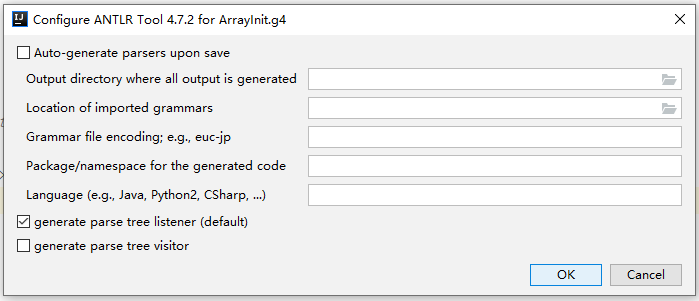

# antlr

## maven
下面给出 完整、可直接拷贝 的 `pom.xml` 片段，确保：

1. `.g4` 文件里只保留 `@header { package play; }`（不需要 `@parser::header`、`@lexer::header`）  
2. Maven 插件自动把生成的 Java 源码放到 `src/main/java/play` 目录  
3. 生成的 Java 文件顶部自动出现 `package play;`  

```xml
<build>
    <plugins>

        <!-- ANTLR 4 Maven Plugin -->
        <plugin>
            <groupId>org.antlr</groupId>
            <artifactId>antlr4-maven-plugin</artifactId>
            <version>4.7.2</version>

            <executions>
                <execution>
                    <id>antlr</id>
                    <goals>
                        <goal>antlr4</goal>
                    </goals>

                    <configuration>
                        <!-- 1. 生成 listener / visitor（根据需要打开） -->
                        <listener>true</listener>
                        <visitor>true</visitor>

                        <!-- 2. 关键：把生成的源码放到指定的 package 目录 -->
                        <!--    这里的路径必须和 .g4 中 @header 一致 -->
                        <outputDirectory>${project.build.directory}/generated-sources/antlr4/play</outputDirectory>

                        <!-- 3. 让 Maven 自动把 generated-sources 加入编译路径 -->
                        <sourceDirectory>${project.basedir}/src/main/antlr</sourceDirectory>
                        <!--   （假设 .g4 文件放在 src/main/antlr 下面） -->

                        <!-- 4. （可选）如果想让生成的源码直接进入 src/main/java 而不是 target -->
                        <!-- <outputDirectory>${project.basedir}/src/main/java/play</outputDirectory> -->
                    </configuration>
                </execution>
            </executions>
        </plugin>

        <!-- 让 Maven 编译 generated-sources -->
        <plugin>
            <artifactId>maven-compiler-plugin</artifactId>
            <version>3.11.0</version>
            <configuration>
                <source>1.8</source>
                <target>1.8</target>
                <!-- 自动包含 generated-sources -->
                <compilerArgs>
                    <arg>-parameters</arg>
                </compilerArgs>
            </configuration>
        </plugin>

    </plugins>
</build>
```

## 关键点解释

| 配置项 | 作用 |
|--||
| `@header { package play; }` | 只在 .g4 文件里写这一行，ANTLR 会在每个生成的 Java 文件顶部自动插入 `package play;` |
| `<outputDirectory>${project.build.directory}/generated-sources/antlr4/play</outputDirectory>` | 让插件把 所有 生成的 `.java` 文件放到 `target/generated-sources/antlr4/play` 目录，目录结构正好对应 package |
| `<sourceDirectory>` | 告诉插件 `.g4` 文件所在目录（默认 `src/main/antlr`） |
| `maven-compiler-plugin` | 把 `target/generated-sources/antlr4` 加入编译 classpath（Maven 自动识别 `generated-sources`） |


## 完整目录结构示例
```
my-project
 ├─ pom.xml
 ├─ src
 │   └─ main
 │       ├─ antlr
 │       │   └─ Play.g4          ← 里面只有 @header { package play; }
 │       └─ java
 │           └─ (你的业务代码)
 └─ target
     └─ generated-sources
         └─ antlr4
             └─ play
                 ├─ PlayParser.java
                 ├─ PlayLexer.java
                 └─ … (Listener/Visitor)
```

生成的 `PlayParser.java` 顶部会是：
```java
package play;

// Generated from ...
public class PlayParser extends Parser { … }
```

## 常见错误 & 排查

| 症状 | 原因 | 解决 |
||||
| 生成的文件 没有 `package play;` | `@header` 写错或被 `@parser::header` 覆盖 | 只保留 `@header { package play; }` |
| 生成的文件在 `target/generated-sources/antlr4` 根目录，没有 `play` 子目录 | 没配置 `<outputDirectory>` | 加上 `<outputDirectory>…/play</outputDirectory>` |
| IDE 报 “cannot find symbol PlayParser” | `generated-sources` 没加入编译路径 | 确认 `maven-compiler-plugin` 正常运行，或在 IDE 中 Refresh Maven Project |

### 一键命令（如果已经配置好 pom）
```bash
mvn clean generate-sources
```

执行后 `target/generated-sources/antlr4/play` 里就会出现 带正确 package 的 Java 文件。

总结：  
- `.g4` 只写 `@header { package play; }`  
- 插件 `outputDirectory` 指向 `…/play`  
- Maven 会自动编译  

照着上面的 `pom.xml` 粘贴即可，生成的 Java 文件天然就是 `package play;`，无需再手动改动。祝编码愉快!

### ANTLR 在开源项目中的应用（除了 Hive 和 ShardingSphere）

ANTLR（ANother Tool for Language Recognition）是一个广泛用于构建解析器和编译器的开源工具，它支持生成词法分析器、语法分析器和抽象语法树（AST），常用于语言处理、SQL 查询解析、代码生成等领域。除了您提到的 Apache Hive（用于 HiveQL 解析）和 Apache ShardingSphere（用于 DistSQL 和 SQL 解析）之外，ANTLR 被众多知名开源项目采用。这些项目涵盖数据库、编程语言、工具链和框架等领域，通常使用 ANTLR 4 版本来处理复杂语法。

以下是基于最新开源社区数据（截至 2025 年 10 月 16 日）筛选的 10 个典型开源项目示例。我优先选择了活跃度高、影响力大的项目，并附上简要描述、使用场景、GitHub 地址和许可证信息。列表按 GitHub 星级（stars）降序排列，便于参考。

| 项目名称 | 描述 | 使用场景 | GitHub 地址 | 许可证 | 星级（约） |
|-||-|-|--||
| Apache Cassandra | 分布式 NoSQL 数据库，使用 ANTLR 解析 CQL（Cassandra Query Language）查询，支持 AST 构建和语义分析。 | 分布式数据存储查询解析。 | [https://github.com/apache/cassandra](https://github.com/apache/cassandra) | Apache 2.0 | 8,000+ |
| Presto (Trino) | 分布式 SQL 查询引擎，使用 ANTLR 解析标准 SQL 语法，支持多数据源查询优化。 | 大规模数据分析 SQL 处理。 | [https://github.com/trinodb/trino](https://github.com/trinodb/trino) | Apache 2.0 | 8,500+ |
| Apache Calcite | SQL 解析和优化框架，使用 ANTLR 生成 SQL 解析器，支持插件式扩展。 | 数据库中间件和查询优化。 | [https://github.com/apache/calcite](https://github.com/apache/calcite) | Apache 2.0 | 4,000+ |
| OpenJDK | Java 平台的开源实现，其 Compiler Grammar 项目使用 ANTLR 构建 javac 编译器的实验版本，支持 Java 语法解析。 | 编程语言编译器开发。 | [https://github.com/openjdk/jdk](https://github.com/openjdk/jdk) | GPL 2.0 | 15,000+ |
| libevent | 事件驱动网络库，使用 ANTLR 处理配置语法和事件描述语言。 | 高性能网络 I/O 解析。 | [https://github.com/libevent/libevent](https://github.com/libevent/libevent) | BSD 3-Clause | 10,000+ |
| Ballerina | 云原生编程语言，使用 ANTLR 解析其 DSL（领域特定语言）语法，支持代码生成和集成。 | 微服务和 API 开发。 | [https://github.com/ballerina-platform/ballerina-lang](https://github.com/ballerina-platform/ballerina-lang) | Apache 2.0 | 4,500+ |
| Surelog | SystemVerilog 预处理器、解析器和编译器，使用 ANTLR 处理硬件描述语言（HDL）语法。 | 硬件设计和验证。 | [https://github.com/alexforencich/surelog](https://github.com/alexforencich/surelog) | Apache 2.0 | 1,000+ |
| che-che4z-lsp-for-COBOL | COBOL 语言服务器协议（LSP）扩展，使用 ANTLR 解析 COBOL 语法，支持 VS Code 集成。 | 遗留系统现代化和 IDE 插件。 | [https://github.com/che-che4z/che-che4z-lsp-for-cobol](https://github.com/che-che4z/che-che4z-lsp-for-cobol) | Eclipse Public License | 200+ |
| proleap-cobol-parser | COBOL 解析器库，使用 ANTLR 构建 AST，支持主frame 代码分析。 | 企业级 COBOL 迁移和工具。 | [https://github.com/michael-simons/proleap-cobol-parser](https://github.com/michael-simons/proleap-cobol-parser) | MIT | 100+ |
| ncalc | .NET 数学表达式解析器，使用 ANTLR 评估动态表达式，支持自定义函数。 | 科学计算和公式引擎。 | [https://github.com/sklose/ncalc](https://github.com/sklose/ncalc) | MIT | 2,500+ |

### 说明与建议
- 选择依据：这些项目来自 ANTLR 官方文档、GitHub 仓库分析和开源社区（如 LibHunt、Awesome Open Source）的数据。它们展示了 ANTLR 在数据库（SQL 解析）、编译器（语言语法）和工具（LSP/IDE 插件）中的多样应用。许多项目使用 ANTLR 4 的 Visitor/Listener 模式来遍历 AST，实现语义检查或代码生成。
- 常见模式：在数据库项目中，ANTLR 常用于 SQL 方言解析（如 CQL、HiveQL 的变体）；在语言工具中，用于构建编译器前端。
- 扩展学习：如果您想深入某个项目，可以查看其源码中的 `*.g4` 文件（ANTLR 语法定义）。例如，在 Cassandra 中搜索 `cql` 目录下的 ANTLR 文件。
- 注意：ANTLR 本身是开源的（BSD 许可证），并支持多语言目标（如 Java、C++），适合您的背景（Java 基础 + C++ 新手）。

### ANTLR学习资料推荐

ANTLR（ANother Tool for Language Recognition）是一个强大的解析器生成器，用于构建语言工具、SQL解析器等。Apache Hive 和 Apache ShardingSphere 都使用 ANTLR 来解析 SQL 语法：Hive 使用 ANTLR 3.4 生成抽象语法树 (AST) 处理 HiveQL 查询；ShardingSphere 使用 ANTLR 4 解析分布式 SQL (DistSQL)，支持 SQL 分片路由和语法扩展。

鉴于您有 Java 基础（ANTLR 的主要工具和运行时基于 Java），我会优先推荐 Java 目标的资源。C++ 新手部分，我会标注适合 C++ 目标的入门（ANTLR 支持 C++ 代码生成，但语法定义仍用 Java 工具）。资源分为三类：基础入门（适合快速上手）、Hive/ShardingSphere 相关（项目特定解析示例）、高级/硕博级（理论深度，适合研究生课程）。业界资源偏实用教程，硕博资源偏书籍和学术分析。

#### 1. 基础入门资源（Java 优先，适合有 Java 基础的开发者快速构建简单解析器）
这些资源从简单表达式解析开始，逐步引入语法定义、AST 构建和 Java 集成。预计 1-2 天上手。

| 资源名称 | 描述 | 适用人群 | 链接 |
|-||-||
| Java with ANTLR (Baeldung) | 实用 Java 教程：自定义语言解析、现有语法文件使用（如 Java8.g4 进行代码 linting）。包含 Maven 集成、Listener/Visitor 示例。 | 业界 Java 开发者，入门到中级。 | [https://www.baeldung.com/java-antlr](https://www.baeldung.com/java-antlr) |
| ANTLR Mega Tutorial | 全面教程：从语法定义到 AST 操作，支持 Java/JS/Python/C#。包含表达式解析、Visitor 模式和测试。 | 业界/本科生，Java 基础即可。C++ 部分有生成示例。 | [https://tomassetti.me/antlr-mega-tutorial/](https://tomassetti.me/antlr-mega-tutorial/) |
| Getting Started with ANTLR (RipTutorial) | 简短入门：安装、运行时库、Java 代码生成。包含简单计算器示例。 | 快速上手，Java/C++ 新手。 | [https://riptutorial.com/antlr](https://riptutorial.com/antlr) |
| ANTLR Basic Example (Stack Overflow) | 简单四则运算器示例：从 .g4 语法到 Java 代码生成和运行。 | Java 基础，C++ 生成类似（用 -Dlanguage=Cpp）。 | [https://stackoverflow.com/questions/1931307/antlr-is-there-a-simple-example](https://stackoverflow.com/questions/1931307/antlr-is-there-a-simple-example) |
| ANTLR Hello World (Java Code Geeks) | 基础“Hello World”解析器：语法文件、错误处理、Maven 集成。 | 业界入门，Java 优先。 | [https://www.javacodegeeks.com/2012/04/antlr-tutorial-hello-word.html](https://www.javacodegeeks.com/2012/04/antlr-tutorial-hello-word.html) |

安装提示：下载 antlr-4.x-complete.jar（https://www.antlr.org/download/antlr-4.13.2-complete.jar），用 `java -jar antlr-4.13.2-complete.jar -Dlanguage=Java YourGrammar.g4` 生成 Java 代码。对于 C++：`-Dlanguage=Cpp` 生成头文件和源文件，但需熟悉 C++ 运行时。

#### 2. Hive 和 ShardingSphere 相关的 ANTLR 资源
这些聚焦项目源码中的 ANTLR 使用：Hive 的 HiveQL 解析（ANTLR 3/4），ShardingSphere 的 DistSQL/SQL 解析（ANTLR 4）。适合扩展到分布式查询解析。

| 资源名称 | 描述 | 适用人群 | 链接 |
|-||-||
| Parsing Hive Create Table Query (RevisitClass) | 使用 Hive 库解析 CREATE TABLE 查询：AST 提取表名、列名、类型。包含 Java 代码示例和 HiveParserDriver。 | 业界，Hive SQL 解析实践。 | [https://www.revisitclass.com/hadoop/parsing-hive-create-table-query-using-apache-hive-library/](https://www.revisitclass.com/hadoop/parsing-hive-create-table-query-using-apache-hive-library/) |
| Hive HPLSQL Grammar (GitHub) | Hive 源码中的 HPLSQL.g4 语法文件：解析 Hive 过程 SQL。示例规则如 expr_dot、select_stmt。 | 硕博/业界，分析 Hive AST。 | [https://github.com/apache/hive/blob/master/hplsql/src/main/antlr4/org/apache/hive/hplsql/Hplsql.g4](https://github.com/apache/hive/blob/master/hplsql/src/main/antlr4/org/apache/hive/hplsql/Hplsql.g4) |
| ANTLR in Hive (Stack Overflow) | 讨论 Hive .g 文件（HiveLexer.g 等）到 JavaScript/JS 生成的挑战。包含 ANTLR 3.4 版本分析。 | 业界，Hive 语法移植。 | [https://stackoverflow.com/questions/28593867/determining-antlr-version-to-use-or-converting-between](https://stackoverflow.com/questions/28593867/determining-antlr-version-to-use-or-converting-between) |
| Develop DistSQL in ShardingSphere | ShardingSphere DistSQL 开发教程：ANTLR 4 语法定义（如 Keyword.g4）、Visitor 模式实现路由。包含 Maven 编译示例。 | 业界，分布式 SQL 扩展。 | [https://shardingsphere.apache.org/blog/en/material/jan_28_blog_x_how_to-develop_your_distributed_sql_statement_in_apache_shardingsphere/](https://shardingsphere.apache.org/blog/en/material/jan_28_blog_x_how_to-develop_your_distributed_sql_statement_in_apache_shardingsphere/) |
| ShardingSphere Parse Engine | ShardingSphere 解析引擎文档：ANTLR 4 处理 DDL/TCL/DAL 等 SQL，缓存优化。包含性能对比。 | 硕博，SQL 解析原理。 | [https://shardingsphere.apache.org/document/4.1.0/en/features/sharding/principle/parse/](https://shardingsphere.apache.org/document/4.1.0/en/features/sharding/principle/parse/) |

实践提示：克隆 Hive 源码（https://github.com/apache/hive），查看 `ql/src/java/org/apache/hadoop/hive/ql/parse/` 中的 .g 文件；ShardingSphere（https://github.com/apache/shardingsphere），查看 `shardingsphere-sql-parser/` 中的 antlr4 目录。

#### 3. 高级/硕博级资源（理论深度，适合研究生课程或研究）
这些强调解析理论、AST 操作、语义分析。结合 Hive/ShardingSphere 可用于论文或高级项目。C++ 支持良好，但需额外学习运行时。

| 资源名称 | 描述 | 适用人群 | 链接 |
|-||-||
| The Definitive ANTLR 4 Reference (Terence Parr) | ANTLR 4 圣经：高级解析技术、Visitor/Listener、错误恢复。包含 R 解析器、JSON-XML 转换示例。 | 硕博，理论+代码。Java/C++ 示例。 | [https://pragprog.com/titles/tpantlr2/the-definitive-antlr-4-reference/](https://pragprog.com/titles/tpantlr2/the-definitive-antlr-4-reference/) |
| ANTLR Mega Tutorial (Advanced Parts) | 高级章节：语义谓词、表达式处理、词法模式、多语言文档解析。包含测试和调试。 | 硕博/业界高级，Java/C++。 | [https://tomassetti.me/antlr-mega-tutorial/](https://tomassetti.me/antlr-mega-tutorial/) |
| ANTLR Course (Strumenta) | 专业课程：构建 DSL、编译器、语义分析。动手项目，覆盖 Hive-like SQL 解析。 | 硕博教学，业界培训。 | [https://strumenta.com/antlr-consulting/](https://strumenta.com/antlr-consulting/) |
| Learn to Build Professional Parsers (Strumenta) | 高级教程：递归下降解析、AST 验证/转换。无需算法理论，直接上手。 | 硕博，Java/JS/Python/C#。 | [https://tomassetti.me/antlr-course-2-edition/](https://tomassetti.me/antlr-course-2-edition/) |
| ANTLR Grammars-v4 Repo | 现成语法仓库：HiveQL、SQL92 等 .g4 文件。可生成 Java/C++ 解析器。 | 硕博研究，扩展 Hive/ShardingSphere。 | [https://github.com/antlr/grammars-v4](https://github.com/antlr/grammars-v4) |

C++ 新手提示：ANTLR 生成 C++ 代码需安装运行时（antlr4-runtime-cpp）。从 Mega Tutorial 的 C# 部分类比（类似面向对象）。推荐先用 Java 练习语法，再切换目标语言。

学习路径建议：
1. 起步：Baeldung + Mega Tutorial（1 周，构建简单 SQL 解析器）。
2. 项目相关：Hive/ShardingSphere 文档 + 源码分析（2 周，解析真实查询）。
3. 高级：Definitive Reference 书籍 + Strumenta 课程（1 月，硕博级 AST 优化）。

如果需要特定代码示例（如 Hive CREATE TABLE 的 Java 解析器）或 C++ 集成细节，请提供更多要求！

https://docs.rs/crate/antlr-rust/latest

JavaCC Java compiler compiler 编译器的编译器
提供代码生成器,运行时

.g4文件调试器

## api

```java
	import org.antlr.v4.runtime.misc.LogManager;

    LogManager mgr = new LogManager();
    mgr.log("atn", "test msg");
    mgr.log("dfa", "test msg 2");
    System.out.println(mgr);
    try {

        mgr.save();
    }catch (IOException ioException){
        ioException.printStackTrace();
    }
```

## some
antlr只支持大写字符?
看编写的.g4规则

ANTLR（Another Tool for Language Recognition）本身并不限定只支持大写字符，无论是解析 JSON 字符串还是 SQL 语句，它对大小写的支持情况取决于你所定义的词法规则。下面详细分析在解析 JSON 和 SQL 时大小写相关的情况：

### 解析 JSON 时大小写情况
JSON 规范里键和值对大小写是敏感的，在使用 ANTLR 解析 JSON 时，通常定义的词法规则会允许大小写字符。以下是一个简单的 ANTLR JSON 语法规则示例：

```antlr
grammar JSON;

// 起始规则
json: value;

// 值可以是对象、数组、字符串、数字、布尔值或 null
value: object
     | array
     | STRING
     | NUMBER
     | 'true'
     | 'false'
     | 'null'
     ;

// 对象由花括号包裹的键值对组成
object: '{' (pair (',' pair)*)? '}';
pair: STRING ':' value;

// 数组由方括号包裹的值列表组成
array: '[' (value (',' value)*)? ']';

// 字符串由双引号包裹的字符序列组成
STRING: '"' (ESC | ~["\\])* '"';
fragment ESC: '\\' (["\\/bfnrt] | UNICODE);
fragment UNICODE: 'u' HEX HEX HEX HEX;
fragment HEX: [0-9a-fA-F];

// 数字可以是整数或浮点数
NUMBER: '-'? INT ('.' [0-9]+)? EXP?;
fragment INT: '0' | [1-9] [0-9]*;
fragment EXP: [Ee] [+\-]? INT;

// 忽略空白字符
WS: [ \t\r\n]+ -> skip;
```
在这个规则里，`STRING` 规则允许任意大小写的字符，`true`、`false` 和 `null` 这些关键字也是明确支持小写的。所以，解析 JSON 时 ANTLR 能很好地处理大小写字符。

### 解析 SQL 时大小写情况
在 SQL 里，关键字一般不区分大小写，但标识符（如表名、列名）通常区分大小写，不过这也依赖于数据库的配置。当使用 ANTLR 解析 SQL 时，如果词法规则只定义了大写的关键字，那就只能解析大写的 SQL 语句。例如下面这个简单的 SQL 语法规则：

```antlr
grammar SimpleSQL;

// 起始规则
parse: SELECT columns FROM tableName;

// 关键字，这里只定义了大写
SELECT: 'SELECT';
FROM: 'FROM';

// 标识符，允许大小写
columns: ID (',' ID)*;
tableName: ID;

ID: [a-zA-Z]+;

// 忽略空白字符
WS: [ \t\r\n]+ -> skip;
```
在这个规则中，`SELECT` 和 `FROM` 关键字只定义了大写形式，所以只能解析大写的 SQL 语句。若要支持小写或大小写不敏感，需要修改词法规则。例如，让关键字大小写不敏感：

```antlr
grammar SimpleSQL;

// 起始规则
parse: SELECT columns FROM tableName;

// 关键字，大小写不敏感
SELECT: [sS][eE][lL][eE][cC][tT];
FROM: [fF][rR][oO][mM];

// 标识符，允许大小写
columns: ID (',' ID)*;
tableName: ID;

ID: [a-zA-Z]+;

// 忽略空白字符
WS: [ \t\r\n]+ -> skip;
```
这样修改后，就可以解析大小写混合的 SQL 语句了。

综上所述，ANTLR 对大小写的支持取决于你定义的词法规则，你可以根据具体需求来调整规则以支持不同的大小写情况。 

antlr之类的parser generator。

看antlr是如何从支持mysql 5.7到支持mysql 8的

G4 编码规范
公共规范
每行长度不超过 200 个字符，保证每一行语义完整以便于理解。
词法解析规范
每个规则一行，规则间无需空行。
规则名称使用大写字母。如果名称由多个单词组成，用 下划线 间隔。DataType 和 Symbol 的规则命名以 下划线 结尾。与 ANTLR 内置变量或关键字重名的规则在结尾加 下划线 以示区分。
不对外暴露的规则使用 fragment，fragment 定义的规则需在其服务的规则之后声明。
公用规则定义放在 Keyword.g4，每个数据库可以有自己特有的规则定义。例如：MySQLKeyword.g4。
语法解析规范
每个规则结束后空一行，空行无需缩进。
规则名称前面不空格，冒号 后空一格再开始写规则，分号 在单独一行并保持和上一行相同缩进。
如果一个规则的分支超过 5 个，则每个分支一行。
规则命名采用 java 变量的驼峰形式。
为每种 SQL 语句类型定义一个独立的语法文件，文件名称由 数据库名称 + 语句类型名称 + Statement。例如：MySQLDQLStatement.g4

[antlr](https://www.antlr.org/)

[开源语法分析器--ANTLR](https://www.cnblogs.com/blfshiye/p/4359390.html)

词法分析是计算机科学中将字符序列转换为标记（token）序列的过程。从输入字符流中生成标记的过程叫作标记化（tokenization），在这个过程中，词法分析器还会对标记进行分类。

antlr可以对接多种语言
runtime

#### antlr的概述

antlr是一个包含了`词法分析`,`语法分析`两大模块的工具，并且提供了大量主流语言的现成的语法描述`grammar`文件

使用antlr你可以将某种语言的代码文件，以纯文本字符串的方式输入，被antlr整理分析成一个语法树，一个可以清晰地从树状结构里，看到代码真正的逻辑的结构化数据。

通俗易懂的说，antlr的作用就是将计算机不明白，无法读取，无法执行的字符串代码，一个字一个字`读`，一行一行的`分析`，最后把`字符串`读明白了，分析明白了，转化成了计算机程序能`弄懂`(也就是能遍历，能执行，能运行的)的结构化数据`语法树`

听起来是不是很神秘？没错，这里面其实是编译原理里面的概念，我们所写的C++,OC,JAVA各种知名语言，我们其实写的都是一行一行字符串，这一行行的字符是怎么编译成可以运行的app的，这都是要经过这样的一个步骤，但这也只是编译原理中的一环，经过了`词法,语法解析`，后面还有很多重要的环节

- 有了`词法,语法解析`，我们甚至还可以独创我们自己的语言
- 有了`词法,语法解析`，再引入编译原理中的其他概念，我们甚至还可以自己写我们独创语言的编译器

看起来是不是很神秘很牛逼~我们今天深入讨论一下

#### antlr的基本使用

antlr包含以下几个部分

- antlr 主工程
- antlr 语法描述 grammer
- antlr 运行时 runtime

目标语言的语法描述grammer文件，在antlr官网可以下载,https://github.com/antlr/grammars-v4，从里面可以看到，我们可以找到几乎所有主流语言的语法描述，换句话说，如果我们要分析的语言有现成的grammar文件，那我们可以直接拿来输入给antlr就能搞起词法语法分析。

antlr主工程虽然是Java，但是antlr运行可以在Java，JavaScript，Python，C#等语言里，原因就是官网开放了这四种语言的antlr运行时，[www.antlr.org/download](http://www.antlr.org/download.html)。

备注：
https://beyondtheloop.dev/Antlr-cpp-cmake/

举个通俗点的例子，如果我打算用JavaScript语言，用来分析Oc语法，那么

- 我需要先去官网下载`ObjectiveC.g4`grammer语法描述文件
- 我需要用antlr的Java主程序，输入OC的grammer，选择JavaScript语言输出，生成`ObjectiveCParser.js`这个用js代码写出来的，OC解析器
- 我需要开始搭建我的JS程序，将一整个antlr的JavaScript运行时都import进来，并且import进来刚刚生成的`ObjectiveCParser.js`，在JS代码里开始编写JSPatchConvertor的代码逻辑

antlr书籍

测试用例推荐熟悉的json sql

不要看cvs

Antlr简介
ANTLR 语言识别的一个工具 (ANother Tool for Language Recognition ) 是一种语言工具，它提供了一个框架，可以通过包含 Java, C++, 或 C# 动作（action）的语法描述来构造语言识别器，编译器和解释器。 计算机语言的解析已经变成了一种非常普遍的工作，在这方面的理论和工具经过近 40 年的发展已经相当成熟，使用 Antlr 等识别工具来识别，解析，构造编译器比手工编程更加容易，同时开发的程序也更易于维护。
语言识别的工具有很多种，比如大名鼎鼎的 Lex 和 YACC，Linux 中有他们的开源版本，分别是 Flex 和 Bison。在 Java 社区里，除了 Antlr 外，语言识别工具还有 JavaCC 和 SableCC 等。
和大多数语言识别工具一样，Antlr 使用上下文无关文法描述语言。最新的 Antlr 是一个基于 LL(*) 的语言识别器。在 Antlr 中通过解析用户自定义的上下文无关文法，自动生成词法分析器 (Lexer)、语法分析器 (Parser) 和树分析器 (Tree Parser)。
### 编译原理

词法分析 lex
语法分析

lr vs ll

中科大

ll(0)
ll(k)

antlr有两个部分
lex 语法分析

.g4文件 

Lexer命令 command
https://github.com/antlr/antlr4/blob/master/doc/lexer-rules.md

- skip
- type


- skip    A 'skip' command tells the lexer to get another token and throw out the current text.
- more
- popMode
- mode( x )
- pushMode( x )
- type( x )
- channel( x )

ANTLR(ANTLR(ANother Tool for Language Recognition)是自上而下分析器的自动生成器，http://www.antlr.org/，ANTLR3支持LL(*)文法及分析技术，ANTLR4支持Adaptive LL(*)文法及分析技术。本视频是2022秋季中国科大《编译原理和技术(H)》的讲课视频。

https://www.bilibili.com/video/BV1AR4y1o78H/
03-parsing-part3-antlr.pdf
张煜
yuzhang@ustc.edu.cn
计算机科学与技术学院

原理
ANTLR3：LL(*)
ANTLR4：Adaptive LL(*)


词法分析  lex
语法分析 parse

对应.g4文件的两部分


MySqlParser.g4 
sql必须大写

重视对官方提供的antlr语法 github 的学习https://github.com/antlr/grammars-v4

图形工具 有一个

IDEA Preview

Lex

token

ast

parser

dfn

ANTLR与与编译原理学习笔记

https://blog.csdn.net/qq_38835878/article/details/82355616

DFA

确定的有限自动机

org.antlr.v4.runtime.dfa.DFA

antlr的maven插件给生成的代码设置包名

LL

Antlr 支持上下文无关文法 LL(*)。
第一个L：从左至右分析输入；
第二个L: 使用最左派生分析语法规则；

Antlr4 现在支持直接左递归，但不支持间接左递归。

https://www.thinbug.com/q/46798136


https://github.com/apache/groovy
antlr groovy解析

sharding-jdbc之ANTLR4 SQL解析

https://my.oschina.net/u/3180962/blog/3100218/print


生成java代码的位置

target\generated-sources\antlr4

maven插件

https://www.zhihu.com/question/27051306/answer/35904732


maven插件


https://www.zhihu.com/question/27051306/answer/35904732


BNF是描述编程语言的文法。自然语言存在不同程度的二义性。这种模糊、不确定的方式无法精确定义一门程序设计语言。必须设计一种准确无误地描述程序设计语言的语法结构，这种严谨、简洁、易读的形式规则描述的语言结构模型称为文法。

最著名的文法描述形式是由Backus定义Algol60语言时提出的Backus-Naur范式（Backus-Naur Form, BNF）及其扩展形式EBNF。BNF能以一种简洁、灵活的方式描述语言的语法。具体内容可参考针对编译原理的书。

巴科斯范式


BNF是John Backus 在20世纪90年代提出的用以简洁描述一种编程语言的语言。

基本结构为：

<non-terminal> ::= <replacement>

non-terminal意为非终止符，就是说我们还没有定义完的东西，还可以继续由右边的replacement，也就是代替物来进一步解释、定义。

举个例子：

在中文语法里，一个句子一般由“主语”、“谓语”和“宾语”组成，主语可以是名词或者代词，谓语一般是动词，宾语可以使形容词，名词或者代词。那么“主语”、“谓语”和“宾语”就是非终止符，因为还可以继续由“名词”、“代词”、“动词”、“形容词”等替代。

例1. <句子> ::= <主语><谓语><宾语>

例2. <主语> ::= <名词>|<代词>

例3. <谓语>::=<动词>

例4. <宾语>::=<形容词>|<名词>|<代词>

例5. <代词>::=<我>

例6. <动词>::=<吃>

例7. <动词>::=<喜欢>

例8. <名词>::=<车>

例9. <名词>::=<肉>

如上，在::=左边的就是non-terminal非终止符，右边的就是replacement，可以是一系列的非终止符，如例1中的replacement便是后面例234左边的非终止符，也可以是终止符，如例56789的右边，找不到别的符号来进一步代替。

因此，终止符永远不会出现在左边。一旦我们看到了终止符，这个描述过程就结束了。


类似EBNF（Extended Backus-Naur Form）

ebnf是个规范，描述

cfg(上下文无关文法)

cfg的一个实现


cfg是一个数学概念，bnf ebnf是其计算机领域的实现


https://www.beichengjiu.com/informationscience/172297.html


熟悉SQL语言（关系代数、RBO、CBO）、编译原理，熟悉ANTLR、JavaCC、Calcite、SystemML或类似的开源框架，有DSL实现经验是加分项。
在数据库领域中，RBO（Rule-Based Optimization）和CBO（Cost-Based Optimization）是两种重要的查询优化技术，它们的主要目的是生成最佳的执行计划以提高查询效率。

RBO（基于规则优化）
RBO是一种根据预先定义的一套规则来选择执行计划的方法。它不考虑数据的分布和统计信息，仅根据操作符的类型和顺序来决定优先级。RBO的优点在于简单易懂，不依赖于数据的变化，适合于数据量小或者统计信息不准确的情况。然而，RBO的缺点也很明显，它不能适应复杂的查询场景，不能充分利用数据的特征，可能导致执行效率低下。

CBO（基于代价优化）

CBO则是一种根据数据的分布和统计信息来估算每个执行计划的代价，并选择代价最低的执行计划的方法。CBO的优点在于能够根据数据的实际情况来做出最优的选择，适合于数据量大或者查询复杂的情况。然而，CBO的缺点是需要维护数据的统计信息，否则可能导致代价估算不准确，影响执行效果。

在实际应用中，随着数据库技术的发展和数据的增长，CBO逐渐成为主流的优化方法。它可以根据数据的实际情况进行灵活调整，以获取更好的查询性能。同时，随着技术的进步，一些数据库系统也提供了更先进的优化策略，如动态调整执行计划、优化子查询和连接操作等，以进一步提高查询效率。

需要注意的是，无论是RBO还是CBO，都有其适用的场景和限制。在选择使用哪种优化方法时，需要根据具体的数据库环境、数据特点和查询需求进行综合考虑。


[antlr 官网](https://www.antlr.org/)

[开源语法分析器--ANTLR 简介 2.7.5 ](https://blog.csdn.net/lionzl/article/details/88713123)


antlr

词法分析器（Lexer）

语法分析器（Parser）


[antlr](https://www.antlr.org/)

[开源语法分析器--ANTLR](https://www.cnblogs.com/blfshiye/p/4359390.html)


[antlr](https://www.antlr.org/)

[开源语法分析器--ANTLR](https://www.cnblogs.com/blfshiye/p/4359390.html)


词法分析是计算机科学中将字符序列转换为标记（token）序列的过程。从输入字符流中生成标记的过程叫作标记化（tokenization），在这个过程中，词法分析器还会对标记进行分类。

antlr可以对接多种语言
runtime


antlr idea插件的使用，需要熟悉


### antlr的概述

antlr是一个包含了`词法分析`,`语法分析`两大模块的工具，并且提供了大量主流语言的现成的语法描述`grammar`文件

使用antlr你可以将某种语言的代码文件，以纯文本字符串的方式输入，被antlr整理分析成一个语法树，一个可以清晰地从树状结构里，看到代码真正的逻辑的结构化数据。

通俗易懂的说，antlr的作用就是将计算机不明白，无法读取，无法执行的字符串代码，一个字一个字`读`，一行一行的`分析`，最后把`字符串`读明白了，分析明白了，转化成了计算机程序能`弄懂`(也就是能遍历，能执行，能运行的)的结构化数据`语法树`

听起来是不是很神秘？没错，这里面其实是编译原理里面的概念，我们所写的C++,OC,JAVA各种知名语言，我们其实写的都是一行一行字符串，这一行行的字符是怎么编译成可以运行的app的，这都是要经过这样的一个步骤，但这也只是编译原理中的一环，经过了`词法,语法解析`，后面还有很多重要的环节

- 有了`词法,语法解析`，我们甚至还可以独创我们自己的语言
- 有了`词法,语法解析`，再引入编译原理中的其他概念，我们甚至还可以自己写我们独创语言的编译器

看起来是不是很神秘很牛逼~我们今天深入讨论一下

##### antlr的基本使用

antlr包含以下几个部分

- antlr 主工程
- antlr 语法描述 grammer
- antlr 运行时 runtime


目标语言的语法描述grammer文件，在antlr官网可以下载,https://github.com/antlr/grammars-v4，从里面可以看到，我们可以找到几乎所有主流语言的语法描述，换句话说，如果我们要分析的语言有现成的grammar文件，那我们可以直接拿来输入给antlr就能搞起词法语法分析。

antlr主工程虽然是Java，但是antlr运行可以在Java，JavaScript，Python，C#等语言里，原因就是官网开放了这四种语言的antlr运行时，[www.antlr.org/download](http://www.antlr.org/download.html)。

举个通俗点的例子，如果我打算用JavaScript语言，用来分析Oc语法，那么

- 我需要先去官网下载`ObjectiveC.g4`grammer语法描述文件
- 我需要用antlr的Java主程序，输入OC的grammer，选择JavaScript语言输出，生成`ObjectiveCParser.js`这个用js代码写出来的，OC解析器
- 我需要开始搭建我的JS程序，将一整个antlr的JavaScript运行时都import进来，并且import进来刚刚生成的`ObjectiveCParser.js`，在JS代码里开始编写JSPatchConvertor的代码逻辑


#### README

antlr是Java语言开发的，

http://www.ietf.org/rfc/rfc4627.txt

Antlr4解析Json
https://blog.csdn.net/sjhuangx/article/details/100548057
https://blog.csdn.net/xindoo/article/details/104735750
https://blog.csdn.net/Freyr_Wings/article/details/78070181

[Antlr4 入门](https://www.cnblogs.com/clonen/p/9083359.html)

二.主要应用场景
1.定制特定领域语言（DSL)
类似hibernate中的HQL，用DSL来定义要执行操作的高层语法，这种语法接近人可理解的语言，由DSL到计算机语言的翻译则通过ANTLR来做，可在ANTLR的结构语言中定义DSL命令具体要执行何种操作。
2.文本解析 可利用ANTLR解析JSON，HTML，XML，EDIFACT，或自定义的报文格式。解析出来的信息需要做什么处理也可以在结构文件中定义。
3.数学计算 加减乘除，线性方程，几何运算，微积分等等

[another repo](https://github.com/edidada/antlr)

- ParseJsonMain
- ParseJsonMin 自定义visitor 可以查看回调的方法，参数


ParseJsonMain
Lex - token
Parse- 自定义result

```shell
Fri Oct 25 15:47:44 CST 2019 AnOtherVisitor visit
Fri Oct 25 15:47:44 CST 2019 AnOtherVisitor visitJson
Fri Oct 25 15:47:44 CST 2019 AnOtherVisitor visitChildren
Fri Oct 25 15:47:44 CST 2019 AnOtherVisitor visitAnObject
Fri Oct 25 15:47:44 CST 2019 AnOtherVisitor visitChildren
Fri Oct 25 15:47:44 CST 2019 AnOtherVisitor visitTerminal
Fri Oct 25 15:47:44 CST 2019 AnOtherVisitor visitPair
Fri Oct 25 15:47:44 CST 2019 AnOtherVisitor visitChildren
Fri Oct 25 15:47:44 CST 2019 AnOtherVisitor visitTerminal
Fri Oct 25 15:47:44 CST 2019 AnOtherVisitor visitErrorNode
Fri Oct 25 15:47:44 CST 2019 AnOtherVisitor visitArrayValue
Fri Oct 25 15:47:44 CST 2019 AnOtherVisitor visitChildren
Fri Oct 25 15:47:44 CST 2019 AnOtherVisitor visitArrayOfValues
Fri Oct 25 15:47:44 CST 2019 AnOtherVisitor visitChildren
Fri Oct 25 15:47:44 CST 2019 AnOtherVisitor visitTerminal
Fri Oct 25 15:47:44 CST 2019 AnOtherVisitor visitString
Fri Oct 25 15:47:44 CST 2019 AnOtherVisitor visitChildren
Fri Oct 25 15:47:44 CST 2019 AnOtherVisitor visitTerminal
Fri Oct 25 15:47:44 CST 2019 AnOtherVisitor visitTerminal
```


Antlr IDEA使用
安装插件 ANTLR v4 grammar plugin
maven插件  antlr4-maven-plugin
.g4文件右键


如何手动输入EOF
EOF是一个计算机术语，为End Of File的缩写，在操作系统中表示资料源无更多的资料可读取。资料源通常称为档案或串流。
而在不同系统的EOF所代表的值是不一样的，在Visual Studio 2017下为ctrl+c，windows下为ctrl+z，linux/unix下为ctrl+c或ctrl+d

[在IDEA中使用ANTLR4教程](https://blog.csdn.net/sherrywong1220/article/details/53697737)


#### Antlr Preview
文法可视化
打开Antlr Preview


在跟idea terminal 同样的位置

先选择.g4文件，然后选择

profile 主要是看性能和语法是不是有歧义，目前还没怎么用它。


在ArrayInit.g4中选中一个语法定义符号，如expr。右键选中的符合，选择Text Rule expr。
在ANTLR Preview中选择input,输入表达式，如{99,3,45}。则能显示出可视化的文法。


[ANTLR4的IntelliJ插件安装及示例Hello.g4](https://www.cnblogs.com/wynjauu/articles/9873231.html)


Antlr Preview
文法可视化
打开Antlr Preview。
在ArrayInit.g4中选中一个语法定义符号，如expr。右键选中的符合，选择Text Rule expr。
在ANTLR Preview中选择input,输入表达式，如{99,3,45}。则能显示出可视化的文法。

antlr4-maven-plugin生成的标准
自定义包
src\main\antlr4文件夹下放.g4文件
java代码生成包有两种方式
antlr4下放文件夹 文件夹的路径就是包

pom.xml中
<libDirectory>src/main/antlr4_imports</libDirectory>
.g4不会生成java文件 这个文件夹下面的.g4文件夹是代引用的
src/main/antlr4/文件夹下相对路径就是java代码的package名称


```shell

@header {
package cn.wdidada;
}
@members {
double x, y; // keep column sums in these fields
}
```

```

//@header {
//package cn.wdidada;
//}
@members {
double x, y; // keep column sums in these fields
}
```


生成的文件在
target\generated-sources\antlr4


插件会为 src/main/antlr4 下的 .g4 文件在 target/generated-sources/antlr4 目录下生成好代码


.g4文件右键 configure antlr/Generator Antlr Recoginzer

选项





[ANTLR4使用](https://blog.csdn.net/qq_37255629/article/details/85239156)


从2.7.3版本开始，ANTLR开始支持C#

### ArrayInit 例子 testantlr 这个github repo

### ArrayInit

从2.7.3版本开始，ANTLR开始支持C#

### ArrayInit 例子 testantlr 这个github repo

{1,{2,3},4}
^D
(init { (value 1) , (value (init { (value 2) , (value 3) })) , (value 4) })


antlr-v4-grammar-plugin idea插件，有图形界面

Java grammar view
antlr语法中的fragment

https://www.crifan.com/


https://www.crifan.com/

#### .g4


```shell

*
```
一次或多次？

```shell
+
```
至少一次

```shell
?
```

可选


ATN antlr


.g4


parser
head

？


[antlr v4 使用指南连载3——g4文件概览](https://www.cnblogs.com/laud/p/antlrv4_3.html)

[Antlr4  规则文件概览](https://blog.csdn.net/yangguosb/article/details/85621059)

antlr

P.91


```
fragment 
```

https://abcdabcd987.com/notes-on-antlr4/

用 `fragment` 可以给 Lexer 规则中的公共部分命名

ANTLR4 笔记.mhtml

https://www.cnblogs.com/chunzhulovefeiyue/p/7577199.html


https://www.crifan.com/antlr_v3_syntax_fragment/

RuleContext
get


ANTLR（ANother Tool for Language Recognition）是一款强大的语言识别工具，在解析过程中会涉及到自顶向下和自底向上两种解析策略，下面为你详细介绍这两种策略及其在 ANTLR 中的应用。

### 自顶向下解析
#### 原理
自顶向下解析是从语法的起始符号开始，尝试根据语法规则逐步推导出输入的符号串。它从语法树的根节点开始，递归地尝试匹配输入的符号，不断向下扩展语法树，直到匹配完所有输入符号或者发现匹配失败。

#### 优点
- 易于实现：自顶向下解析算法通常比较直观，易于理解和实现。对于简单的语法，手动编写自顶向下的解析器相对容易。
- 适合左递归消除后的语法：通过消除左递归，自顶向下解析器可以高效地处理许多常见的语法结构。

#### 缺点
- 左递归问题：自顶向下解析器不能直接处理左递归的语法规则。左递归是指一个非终结符可以直接或间接地推导出以自身开头的符号串，这会导致解析器陷入无限循环。
- 回溯问题：在某些情况下，自顶向下解析器可能需要进行回溯，即尝试不同的推导路径，这会增加解析的时间复杂度。

#### ANTLR 中的应用
ANTLR 可以处理自顶向下的解析，不过它会自动处理左递归问题。ANTLR 在解析时，会根据语法规则从起始符号开始，逐步匹配输入符号，构建语法树。例如，对于一个简单的算术表达式语法，ANTLR 会从表达式的起始规则开始，递归地匹配操作数和运算符。

### 自底向上解析
#### 原理
自底向上解析是从输入的符号串开始，逐步将相邻的符号组合成更大的语法结构，直到最终组合成语法的起始符号。它从语法树的叶子节点开始，不断向上合并节点，构建完整的语法树。

#### 优点
- 处理能力强：自底向上解析器可以处理更广泛的语法，包括左递归语法，不需要进行左递归消除。
- 效率高：对于一些复杂的语法，自底向上解析器通常比自顶向下解析器更高效。

#### 缺点
- 实现复杂：自底向上解析算法相对复杂，实现起来比较困难。手动编写自底向上的解析器需要对解析算法有深入的理解。
- 错误处理复杂：在自底向上解析过程中，错误处理相对复杂，因为解析器可能已经进行了一些不必要的归约操作。

#### ANTLR 中的应用
ANTLR 默认使用 LL(*) 解析策略，这是一种自顶向下的解析策略，但它也具备一定的自底向上的特性。ANTLR 在解析过程中会根据输入符号和语法规则进行匹配和归约操作，类似于自底向上解析的归约步骤。例如，在处理表达式的优先级和结合性时，ANTLR 会根据语法规则进行正确的归约，确保解析结果的正确性。

### 总结
ANTLR 结合了自顶向下和自底向上解析的优点，它通过自动处理左递归和回溯问题，提供了一种高效、灵活的解析方式。在实际应用中，ANTLR 可以根据不同的语法特点和需求，选择合适的解析策略，以实现高效、准确的语法分析。 


除了 LL(*) 解析策略外，常见的解析策略还有 LL、LR、LALR、SLR、GLR 等，下面为你详细介绍这些解析策略：

### 1. LL 解析策略
- 原理：“LL” 代表从左到右扫描输入（Left-to-right），并最左推导（Leftmost derivation）。LL 解析器从语法的起始符号开始，通过不断地预测下一个要匹配的符号，逐步构建语法树。它是一种自顶向下的解析策略。
- 优点：实现相对简单，易于理解和调试。对于一些简单的语法，LL 解析器可以高效地工作。
- 缺点：LL 解析器只能处理 LL(k) 文法，其中 k 表示需要向前查看 k 个符号来决定使用哪个产生式。当 k 较大时，解析器的实现会变得复杂，而且很多实际的语法并不是 LL(k) 文法。
- 适用场景：适用于简单的、没有左递归和二义性的语法，如一些简单的配置文件语法。

### 2. LR 解析策略
- 原理：“LR” 代表从左到右扫描输入（Left-to-right），并最右推导的逆过程（Rightmost derivation in reverse）。LR 解析器是一种自底向上的解析策略，它从输入的符号串开始，逐步将相邻的符号组合成更大的语法结构，直到最终组合成语法的起始符号。
- 优点：LR 解析器可以处理比 LL 解析器更广泛的语法，包括左递归语法，不需要进行左递归消除。它是一种非常强大的解析策略，能够处理大多数实际的编程语言语法。
- 缺点：LR 解析器的实现相对复杂，需要构建状态转移表，并且对于大型语法，状态转移表可能会非常大。
- 适用场景：适用于复杂的编程语言语法，如 C、C++、Java 等。

### 3. LALR 解析策略
- 原理：LALR（Look-Ahead LR）是 LR 解析策略的一种简化版本。它通过合并 LR(1) 状态转移表中的一些相似状态，减少状态转移表的大小，从而降低解析器的实现复杂度。
- 优点：LALR 解析器在保持 LR 解析器强大处理能力的同时，减少了状态转移表的存储空间，提高了解析效率。它是一种常用的解析策略，被广泛应用于编译器和解释器的实现中。
- 缺点：LALR 解析器可能会丢失一些 LR(1) 解析器的信息，导致在某些情况下无法处理一些二义性语法。
- 适用场景：适用于大多数编程语言的语法分析，是一种平衡了处理能力和实现复杂度的解析策略。

### 4. SLR 解析策略
- 原理：SLR（Simple LR）是 LR 解析策略的一种简单实现。它通过使用简单的向前看符号来决定使用哪个产生式，从而简化了状态转移表的构建过程。
- 优点：SLR 解析器的实现相对简单，状态转移表的构建过程也比较容易理解。对于一些简单的语法，SLR 解析器可以高效地工作。
- 缺点：SLR 解析器的处理能力相对较弱，它只能处理一些简单的语法，对于一些复杂的语法可能会产生冲突。
- 适用场景：适用于简单的语法分析，如一些简单的脚本语言语法。

### 5. GLR 解析策略
- 原理：GLR（Generalized LR）是一种通用的 LR 解析策略，它可以处理任意的上下文无关文法，包括二义性文法。GLR 解析器通过并行地尝试所有可能的解析路径，来处理二义性和复杂的语法结构。
- 优点：GLR 解析器具有非常强大的处理能力，可以处理几乎所有的上下文无关文法，包括一些复杂的、具有二义性的语法。
- 缺点：GLR 解析器的时间复杂度较高，因为它需要并行地尝试所有可能的解析路径。在处理大规模输入时，解析效率可能会较低。
- 适用场景：适用于处理具有二义性或复杂结构的语法，如自然语言处理中的语法分析。

### 6. ANTLR 中的其他策略
ANTLR 主要使用 LL(*) 解析策略，但它也支持一些其他的特性和策略，例如：
- 预测策略：ANTLR 的 LL(*) 解析策略使用了自适应预测机制，可以根据输入的符号动态地调整预测的深度，从而提高解析效率。
- 回溯策略：在某些情况下，ANTLR 可以使用回溯策略来处理一些复杂的语法结构。回溯策略允许解析器在匹配失败时返回之前的状态，尝试其他的解析路径。


在 ANTLR 中，`.g4` 文件的嵌套通常指的是在一个语法文件中引用另一个语法文件的规则，这样可以实现语法的模块化和复用。下面为你详细介绍如何实现 `.g4` 文件的嵌套，以及相关示例和注意事项。

### 实现方式
ANTLR 支持通过 `import` 关键字来实现 `.g4` 文件的嵌套，具体步骤如下：

#### 1. 创建基础语法文件
首先，创建一个基础的 `.g4` 文件，例如 `Base.g4`，其中定义了一些通用的规则。

```antlr
// Base.g4
grammar Base;

// 定义一个简单的标识符规则
ID : [a-zA-Z]+ ;

// 定义空白字符规则，跳过空白字符
WS : [ \t\r\n]+ -> skip ;
```

#### 2. 创建主语法文件并引用基础语法文件
然后，创建一个主语法文件，例如 `Main.g4`，在其中使用 `import` 关键字引用 `Base.g4` 中的规则。

```antlr
// Main.g4
grammar Main;

// 引用 Base.g4 中的规则
import Base;

// 定义一个规则，使用 Base.g4 中的 ID 规则
statement : 'print' ID ';' ;
```

#### 3. 生成解析器代码
使用 ANTLR 工具生成解析器代码，确保所有相关的 `.g4` 文件都在同一目录下，然后执行以下命令：

```bash
java -jar antlr-4.x-complete.jar Main.g4
```

### 注意事项
- 语法文件的兼容性：被引用的语法文件（如 `Base.g4`）和主语法文件（如 `Main.g4`）必须具有相同的解析模式（词法或语法）。也就是说，如果 `Base.g4` 是词法语法文件，那么 `Main.g4` 也应该是词法语法文件或者同时包含词法和语法规则的混合语法文件。
- 规则命名冲突：在引用多个语法文件时，要确保规则名称不会发生冲突。如果不同的语法文件中存在相同名称的规则，可能会导致解析错误。
- 路径问题：如果 `.g4` 文件不在同一目录下，需要确保 ANTLR 工具能够找到被引用的语法文件。可以通过设置 `CLASSPATH` 或使用相对路径来解决路径问题。

### 示例代码（Java 测试）
以下是一个简单的 Java 测试代码示例，用于测试上述嵌套语法文件生成的解析器：

```java
import org.antlr.v4.runtime.*;
import org.antlr.v4.runtime.tree.*;

public class MainTest {
    public static void main(String[] args) {
        String input = "print hello;";
        ANTLRInputStream inputStream = new ANTLRInputStream(input);
        MainLexer lexer = new MainLexer(inputStream);
        CommonTokenStream tokens = new CommonTokenStream(lexer);
        MainParser parser = new MainParser(tokens);

        ParseTree tree = parser.statement();
        System.out.println(tree.toStringTree(parser));
    }
}
```

### 编译和运行测试代码
将上述测试代码保存为 `MainTest.java`，然后编译并运行：

```bash
javac -cp antlr-4.x-complete.jar:. MainTest.java
java -cp antlr-4.x-complete.jar:. MainTest
```

通过以上步骤，你可以实现 ANTLR `.g4` 文件的嵌套，提高语法文件的可维护性和复用性。


关于标签label
ANTLR4 可以在产生式的后面加上以井号开头的标签 # label，要求：

对于某个 nonterminal
要么所有的产生式都有标签
要么所有的产生式都没有标签
两个产生式可以使用相同的标签
对于不同的 nonterminal ，标签不能相同

antlr label就是注释吧？不完全是

不是，标签label 决定生成代码的类名？
Json.g4 
array : '[' value (',' value)* ']'  # ArrayOfValues
      | '[' ']'                     # EmptyArray // 空数组
      ;

c++ Java代码中ArrayOfValuesContext类就是ArrayOfValues标签
c++ Java代码中EmptyArrayContext类就是EmptyArray标签

确实，你在 ANTLR 的语法规则中使用的标签（`# LabelName`）不仅仅是一种注释。它们在生成解析器代码时具有特定的功能和意义。具体来说，标签决定了生成的解析器类中针对每个规则选项的具体上下文类名。

### 标签的作用

当你在一个产生式的不同选项前加上 `# LabelName` 时，ANTLR 会为该选项生成一个单独的上下文类。这使得你可以更精细地控制如何处理不同的语法分支。

例如，在你的 JSON 解析器示例中：

```antlr
array
    : '[' value (',' value)* ']'  # ArrayOfValues
    | '[' ']'                     # EmptyArray // 空数组
    ;
```

对于上述规则，ANTLR 会为 `array` 规则生成两个具体的上下文类：

1. `ArrayOfValuesContext`：对应于第一个选项 `‘[’ value (‘,’ value)* ‘]’`。
2. `EmptyArrayContext`：对应于第二个选项 `‘[’ ‘]’`。

这意味着在你的访问者或监听器实现中，你可以根据具体的上下文类型来区分不同的情况，并执行相应的逻辑。

### 示例说明

假设你有一个简单的访问者模式实现如下：

```cpp
class JsonVisitor : public JsonBaseVisitor {
public:
    antlrcpp::Any visitArrayOfValues(JsonParser::ArrayOfValuesContext *ctx) override {
        // 处理非空数组的情况
        std::cout << "Processing non-empty array." << std::endl;
        return "";
    }

    antlrcpp::Any visitEmptyArray(JsonParser::EmptyArrayContext *ctx) override {
        // 处理空数组的情况
        std::cout << "Processing empty array." << std::endl;
        return "";
    }
};
```

在这个例子中，`visitArrayOfValues` 和 `visitEmptyArray` 方法分别处理 `array` 规则的不同选项。通过这种方式，你可以针对不同的语法结构编写特定的逻辑。

### 标签与代码生成的关系

- 标签影响生成的类名：如前所述，标签直接决定了生成的上下文类的名字。这对于需要对语法的不同部分进行精细化处理非常有用。
- 提高代码可读性和维护性：使用标签可以使你的访问者或监听器代码更加清晰，因为你可以直接基于具体的上下文类型来组织逻辑，而不是依赖复杂的条件判断。
- 简化错误处理和调试：由于每个标签都对应一个明确的上下文类型，因此更容易定位和处理特定类型的错误。

### 总结

ANTLR 中的标签（`# LabelName`）不仅仅是注释，它们在生成解析器代码时起到了关键作用，决定了生成的上下文类名。通过合理使用标签，可以让你的解析器代码更加模块化、易于理解和维护。

在 ANTLR 中，ATN（自动机转换网络，Automaton Transition Network）是解析器用来识别输入文本是否符合特定语法规则的核心机制。你提到的元组 `(ATN state, predicted alt, syntactic context, semantic context)` 是与 ATN 的工作原理紧密相关的几个关键概念，它们帮助解释了 ANTLR 解析过程中的状态和上下文信息。

### 元组组成部分解释

1. ATN State（ATN 状态）:
   - 这是指当前解析过程中，ATN 自动机所处的状态。ATN 由多个状态组成，每个状态代表了对输入进行分析的一个步骤或位置。根据输入字符的不同，ATN 会从一个状态转移到另一个状态，以完成整个语法分析过程。
2. Predicted Alt（预测的备选）:
   - 在某些情况下，ANTLR 需要决定遵循哪一条路径继续解析。例如，在遇到一个可以匹配多个规则的情况时，ANTLR 可能需要“预测”哪一个备选（alternative）是最合适的。这个值表示的是对于当前 ATN 状态，预测将采用哪个备选路径。
3. Syntactic Context（句法上下文）:
   - 这是一个图结构的栈节点，其到根的路径表示了为了到达当前状态而调用的规则链。换句话说，它记录了如何通过一系列的语法规则应用来到达当前的 ATN 状态。这有助于理解当前解析位置在整个语法结构中的位置，并支持诸如回溯等高级特性。
4. Semantic Context（语义上下文）:
   - 它是由在达到某个 ATN 状态之前遇到的所有语义谓词组成的树。语义谓词允许你在语法中嵌入任意的条件判断逻辑，这些逻辑可以在解析过程中动态地影响解析流程。语义上下文提供了关于这些谓词的信息，包括它们的组合方式（如 AND、OR 等），这对于确定解析路径至关重要。

### 应用场景

- 错误恢复和调试: 了解当前的 ATN 状态及其上下文可以帮助开发者更好地理解和修复解析过程中出现的问题。
- 高级解析策略: 利用这些信息，ANTLR 能够实现更复杂的解析策略，比如局部回溯、预测性解析等。
- 性能优化: 对于大规模语言处理任务，理解这些概念有助于优化解析器的性能，减少不必要的计算开销。

总之，上述元组为 ANTLR 提供了一种机制来跟踪和管理解析过程中的复杂状态和依赖关系，确保能够准确且高效地解析各种复杂的语言结构。如果你有关于如何利用这些信息进行具体操作的问题，或者想要了解更多细节，请随时提问！