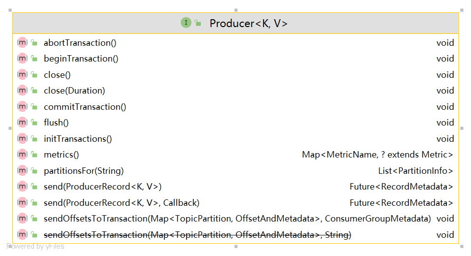

# Kafka权威指南2

https://book.douban.com/subject/36161660/

Windows 10电脑上有第一版pdf

Kafka权威指南.[美]Neha Narkhede(详细书签).pdf
2018年第一版

https://www.ituring.com.cn/book/2931


第 1 章 初识Kafka


第 2 章 安装Kafka


第 3 章 Kafka生产者——向Kafka写入数据
参考
https://gitee.com/edidada/testkafka

jar包
```xml
         <dependency>
          <groupId>org.apache.kafka</groupId>
          <artifactId>kafka-clients</artifactId>
          <version>3.0.0</version>
        </dependency>
```

api
KafkaProducer
org.apache.kafka.clients.producer.KafkaProducer

Producer
org.apache.kafka.clients.producer.Producer



send()
Future<RecordMetadata> send(ProducerRecord<K, V> record);


三个必须配置项
kafka broker地址
org.apache.kafka.clients.producer.ProducerConfig#BOOTSTRAP_SERVERS_CONFIG
org.apache.kafka.clients.producer.ProducerConfig#KEY_SERIALIZER_CLASS_CONFIG
org.apache.kafka.clients.producer.ProducerConfig#VALUE_SERIALIZER_CLASS_CONFIG
kafka消息 kv
k的序列化器
v的序列化器


ShortSerializer (org.apache.kafka.common.serialization)
ListSerializer (org.apache.kafka.common.serialization)
DoubleSerializer (org.apache.kafka.common.serialization)
ByteArraySerializer (org.apache.kafka.common.serialization)
IntegerSerializer (org.apache.kafka.common.serialization)
UUIDSerializer (org.apache.kafka.common.serialization)
StringSerializer (org.apache.kafka.common.serialization)
VoidSerializer (org.apache.kafka.common.serialization)
ByteBufferSerializer (org.apache.kafka.common.serialization)
FloatSerializer (org.apache.kafka.common.serialization)
LongSerializer (org.apache.kafka.common.serialization)
BytesSerializer (org.apache.kafka.common.serialization)


第 4 章 Kafka消费者——从Kafka读取数据
KafkaConsumer
public void subscribe(Collection<String> topics) 
ConsumerRecords


第 5 章 编程式管理Kafka


第 6 章 深入Kafka 


第 7 章 可靠的数据传递


第 8 章 精确一次性语义


第 9 章 构建数据管道


第 10 章 跨集群数据镜像


https://cwiki.apache.org/confluence/display/KAFKA/Ecosystem

