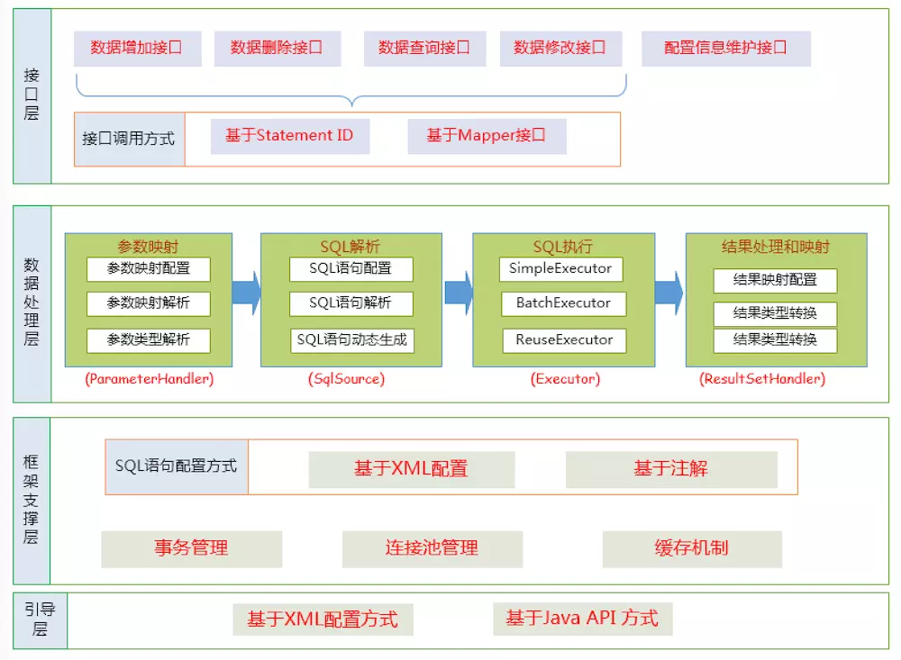

# MyBatis从入门到精通





## mybatis什么版本的？


参数映射
sql解析
sql执行
处理结果映射

https://book.douban.com/subject/27074809/


Annotatin java1.5加的
mybatis版本3.5
[MyBatis从入门到精通](https://book.douban.com/subject/27074809/)
[Mapper.xml中的命名空间及命名解析](https://blog.csdn.net/weixin_36210698/article/details/82992771)


mybatis 基础上的其他框架
pagehelper
tk-mybatis

Mybatis架构图
xml解析
自带数据连接池      使用dbcp连接池

动态代理生成类  MapperProxy继承Invocation
插件体系  Plugin劫持StateStatement

缓存 数据源 执行器 日志 反射 脚本 会话 事务

jdk自带的api
mysql-connector-java的api
mybatis的api
JdbcTemplete的api
区别


MyBatis java api doc
https://mybatis.org/mybatis-3/zh/apidocs/index.html

mybatis-spring架构图


mybatis 设计模式

命名空间
interface
xml


mybatis-config.xml

配置项 有严格的顺序


事务


mybatis-spring 用，主要用这个


cglib
动态代理


sql解析的时候


trim 语法 prefix suffix？

case
when
end

需要结合SQL记忆

动态sql
需要记忆 分类记忆
多写代码验证记忆是否正确

https://mybatis.org/mybatis-3/zh/dynamic-sql.html

if test = " !=null != ''"

  <if test="title != null">
    AND title like #{title}
  </if>
  <if test="author != null and author.name != null">
    AND author_name like #{author.name}
  </if>

if
choose when otherwise
trim、where、set
foreach
script
bind

需要记忆的点

where 元素只会在子元素返回任何内容的情况下才插入 “WHERE” 子句。而且，若子句的开头为 “AND” 或 “OR”，where 元素也会将它们去除。
<where>

<trim> 比 where高级
	如果 where 元素与你期望的不太一样，你也可以通过自定义 trim 元素来定制 where 元素的功能

<set>

```shell
<update id="updateAuthorIfNecessary">
  update Author
    <set>
      <if test="username != null">username=#{username},</if>
      <if test="password != null">password=#{password},</if>
      <if test="email != null">email=#{email},</if>
      <if test="bio != null">bio=#{bio}</if>
    </set>
  where id=#{id}
</update>
```

@Update({"<script>",
  "update Author",
  "  <set>",
  "    <if test='username != null'>username=#{username},</if>",
  "    <if test='password != null'>password=#{password},</if>",
  "    <if test='email != null'>email=#{email},</if>",
  "    <if test='bio != null'>bio=#{bio}</if>",
  "  </set>",
  "where id=#{id}",
  "</script>"})
void updateAuthorValues(Author author);

bind
bind元素允许你在OGNL表达式以外创建一个变量，并将其绑定到当前的上下文


## Chap.1 入门

ORM框架
Hibernate
Jpa
MyBatis

JDBCTemplate


缓存
连接管理
消除SQL注入


阿里巴巴大量使用
插件系统  pagehelper插件
MyBatis Generator
负面的观点：xml或者注解太啰嗦，hibinate更加智能化
c++ odb 目前不支持一个表多次操作？

mybatis 自己写sql 方便优化 h生成sql，不方便优化


## Chap. 2 XML方式
动态代理实现原理
java.lang.Class#getCanonicalName
java.lang.reflect.Proxy 静态代理


```java
public static Object newProxyInstance(ClassLoader loader,
                                      Class<?>[] interfaces,
                                      InvocationHandler h)
```

Java标准库的代理，必须要传接口

## Chap. 3 MyBatis注解方式

Mybatis 3使用动态注解来实现


MyBatis从入门到精通__刘增辉

接口要有

- dtd格式的xml文件

- 注解
@Select
@insert
@update
@delete

provider


## Chap. 4 MyBatis动态SQL

select中 wehre if
防止判断条件为null

if test后面是ongl表达式
== != null 适用于所有类型数据
== != '' 仅仅是String

<where>
  <set>

where 和set 标签的功能都可以用trim 标签来实现，并且在底层就是通过
TrimSqlNode 实现的。
where 和set 标签的功能都可以用trim 标签来实现，并且在底层就是通过
TrimSqlNode 实现的。
where 和set 标签的功能都可以用trim 标签来实现，并且在底层就是通过
TrimSqlNode 实现的。

foreach批量插入
in
动态update  map数据

4.7 ongl用法 重点 


MyBatis 常用的OGNL 表达式如下。
1. el or e2
2. el and e2
3. el == e2 或el eq e2
4 . el ! = e2 或el neq e2
5. el lt e2 ：小于
6. el lte e2 ：小于等于，其他表示为gt （大于）、gte （大于等于）
7. el + e2 、e l 食e2 、e 1/e2 、e 1 - e2 、e l 宅e2
8. ! e 或not e ：非，取反
9. e.method(args ） ： 调用对象方法
JO. e.property ： 对象属性值
11. el[ e2 ］ ： 按索引取值（ List 、数组和Map)
12. @class@method(args ）：调用类的静态方法
13. @class@f 工eld ：调用类的静态字段值


bind concat


4.4.2 foreach实现批量插入 预处理 耗时长，开启 Mybatis BATCH模式


## Chap. 5 Mybatis生成器


## Chap. 6 MyBatis高级查询

存储过程
高级结果映射


使用自定义的类型处理器


## Chap. 7 MyBatis缓存配置


Mapper.xml

<cache 节点配置

@CacheNamespace


mybatis-encache	


## Chap. 8 MyBatis插件开发

重点

org.apache.ibatis.plugin.Interceptor


@Intercepts

@Signature


默认情况下， MyBatis允许拦截器拦截Executor的方法、 ParameterHandler 的方法、 ResultSetHandler 的方法以及StatementHandler 的方法，这个四个对象可称为Mybatis的四大对象。

本章挨个讲如何拦截

org.apache.ibatis.executor.Executor

org.apache.ibatis.executor.parameter.ParameterHandler

org.apache.ibatis.executor.resultset.ResultSetHandler

org.apache.ibatis.executor.statement.StatementHandler


### 8.4 分页插件


## Chap.9 Spring集成MyBatis


## Chap.10 MyBatis跟Spring Boot结合使用


## Chap.11 MyBatis开源项目

git啥的