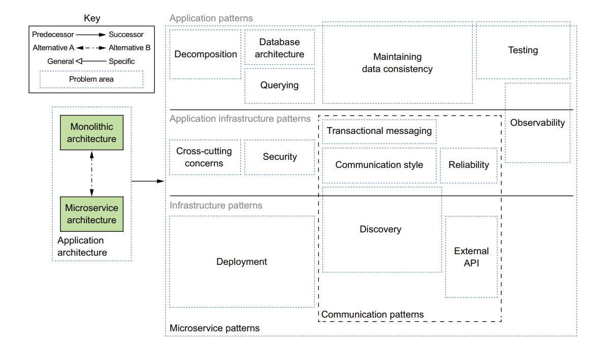

# 微服务架构设计模式

https://book.douban.com/subject/33425123/
With Examples in Java

刚出版，没中文免费电子版
看英文版

FTGO应用程序 书中的例子程序

[再谈微服务-微服务架构设计模式](https://www.funtl.com/zh/micro-service-about/再谈微服务-微服务架构设计模式.html)

https://www.jb51.net/books/526124.html

英文版

https://ru.b-ok2.org/book/3620439/ea5ed9

https://github.com/microservices-patterns/ftgo-application

源码

Microservices Patterns: With examples in Java

本书由世界十大软件架构师之一、微服务架构的先驱、Java开发者社区的意见领袖Chris Richardson亲笔撰写，旨在帮助架构师和程序员学会使用微服务架构成功开发应用程序。书中描述了如何解决我们将面临的众多架构设计挑战，包括如何管理分布式数据，还介绍了如何将单体应用程序重构为微服务架构，涵盖44个架构设计模式，系统解决服务拆分、事务管理、查询和跨服务通信等难题。本书并不是鼓吹微服务架构的宣言，作者既介绍了微服务的原理、原则，又详细讲解了实际落地中的架构设计模式，将使你理解微服务架构、它的好处和弊端，以及应该何时使用微服务架构。本书将帮助你建立微服务的全局视野，并学会在纷繁复杂的情况下做出正确的选择

Chris Richardson 微服务系列文章 翻译
https://www.jianshu.com/p/1a2cea16ffab

#### chap. 1 逃离单体地狱

软件模式
软件复用技术已经从通用类库进化到了面向领域的应用框架和设计模式,它们 可在领域内重复使用以完成某类特定系统的体系结构设计.

1. Coursera

https://www.coursera.org/

2. Udacity（优达学城）

3.edX（www.edx.org/)）

4.Stanford Online

https://online.stanford.edu/

saga not 2pc

不是aotomic commit

存在中间状态

hell 地狱

**monolithic 单片的**

The art of Scalability
AFK扩展立方体定义了三种不同的扩展应用程序的方法："X轴扩展在多个相同实例之间实现请求的负载均衡；Z轴扩展根据请求的属性路由请求；Y轴扩展根据功能将应用程序拆分为服务

X轴 水平复制 克隆
Z轴 数据分区 sharding
Y轴 功能性分解 Y轴扩展把一个单体应用扩展成一组服务

SOA与微服务区别

esb通信 soap webservice
共享数据库连接池
较大的单体应用

典型场景：把多个独立的系统整合到一起

微服务架构优势：
使大型的复杂应用程序可以持续交付和持续部署
每个服务都相对较小并容易维护
服务可以独立部署
服务可以独立扩展
微服务架构可以实现团队的自治
更容易实验和采纳新的技术
更好的容错性

沟通成本 N表示员工人数
N的平方

#### Chap. 2 拆分微服务

domain module

https://mp.weixin.qq.com/s/LY9cT5P6WilLBKtXeT_p1g

###### DDD 名词和术语 

**Event Storming（事件风暴）：**事件风暴是一项团队活动，旨在通过领域事件识别出聚合根，进而划分微服务的限界上下文。在活动中，团队先通过头脑风暴的形式罗列出领域中所有的领域事件，整合之后形成最终的领域事件集合，然后对于每一个事件，标注出导致该事件的命令（Command），再然后为每个事件标注出命令发起方的角色，命令可以是用户发起，也可以是第三方系统调用或者是定时器触发等。最后对事件进行分类整理出聚合根以及限界上下文。

**Entity（实体）：**每个实体是唯一的，并且可以相当长的一段时间内持续地变化。我们可以对实体做多次修改，故一个实体对象可能和它先前的状态大不相同。但是，由于它们拥有相同的身份标识，他们依然是同一个实体。例如一件商品在电商商品上下文中是一个实体，通过商品中台唯一的商品 id 来标示这个实体。

**ValueObject（值对象）：**值对象用于度量和描述事物，当你只关心某个对象的属性时，该对象便可作为一个值对象。实体与值对象的区别在于唯一的身份标识和可变性。当一个对象用于描述一个事物，但是又没有唯一标示，那么它就是一个值对象。例如商品中的商品类别，类别就没有一个唯一标识，通过图书、服装等这些值就能明确表示这个商品类别。

**Aggregate（聚合）：**聚合是实体的升级，是由一组与生俱来就密切相关实体和值对象组合而成的，整个组合的最上层实体就是聚合。

**Bounded Context（限界上下文）：**用来封装通用语言和领域对象，为领域提供上下文语境，保证在领域之内的一些术语、业务相关对象等（通用语言）有一个确切的含义，没有二义性。使团队所有成员能够明确地知道什么必须保持一致，什么必须独立开发。

https://zhuanlan.zhihu.com/p/100059832

http://www.itdks.com/Home/Act/apply?id=3188

2019领域驱动设计峰会

微服务架构设计模式
https://github.com/edidada/ftgo-application 相关源码 在线阅读
https://livebook.manning.com/book/microservices-patterns/chapter-1/

有code

pattern

模式语言

模式的结构

需求 force

结果上下文

相关模式

相关模式描述了这个模式和其他模式之间的关系 包括五种

前导
后续 
替代 alternative
泛化 generation
特化 specialization

O’Reilly 软件架构大会
https://www.infoq.cn/article/2016/04/oreilysacon-day-one

saturn 会议

The SEI Architecture Technology User Network Conference

软件架构的定义

软件架构的4+1模型

逻辑视图
实现视图
进程视图
部署视图

六边形架构

CCP 闭包原则

架构的功能因素和非功能因素

chap. 3 微服务架构中的进程间通信

REST成熟度模型

chap. 4 使用Saga管理事务

soga建立在松耦合 异步服务

六边形架构

入站适配器

出战适配器

数据库连接池

第5章　微服务架构中的业务逻辑设计

chap. 6 使用事件溯源开发业务逻辑

现代溯源模式

cloud foundary 最初是基于AWS的

第7章　在微服务架构中实现查询

第8章　外部API模式

第9章　微服务架构中的测试策略（上）

第10章　微服务架构中的测试策略（下）

第11章　开发面向生产环境的微服务应用

第12章　部署微服务应用
第13章　微服务架构的重构策略