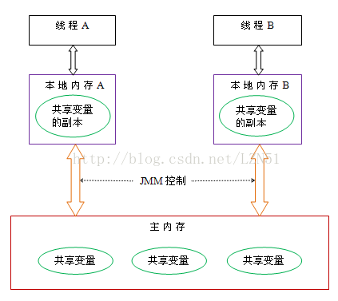
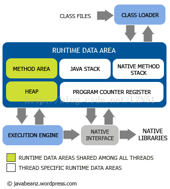

# 深入理解Java虚拟机（第3版）

https://book.douban.com/subject/34907497/

面试经常用

jvm指令集 6.4


周志明（博士）

资深Java技术专家-机器学习技术专家和企业级开发技术专家，现任远光软件研究院院长。

开源技术的积极倡导者和推动者，对计算机科学相关的多个领域都有深刻的见解，尤其是人工智能-Java技术和敏捷开发等，对虚拟机技术有非常深入的研究。

撰写了《深入理解Java虚拟机》《深入理解OSGi》《智慧的疆界》等多本著作，翻译了《Java虚拟机规范》等著作。其中《深入理解Java虚拟机》已累计印刷逾36次，总销超过30万册，成为原创计算机专业图书领域难以逾越的丰碑。


周志明，Java技术、机器学习和企业级开发技术专家，现任远光软件研究院院长，机器学习方向博士， 开源技术的积极倡导者和推动者，对计算机科学和相关的多个领域都有深刻的见解，尤其是人工智能、Java技术和敏捷开发等领域。曾受邀在InfoQ和IBMDeveloperWorks等网站撰写技术专栏。 著有畅销书多本。著有《智慧的疆界》、《深入理解Java虚拟机》、《深入理解OSGi》，翻译了《Java虚拟机规范》等著作。其中《深入理解Java虚拟机》第1版出版于2011年，已经出至第3版，累计印刷超过35次，销量30万册；不仅销量好，而且口碑更好，是中文计算机图书领域公认的、难得一见的佳作。


windows上下载了，百度网盘上有


hotspot虚拟机日志

jdk9以前乱

jdk8

对于4G/6G内存的，选CMS垃圾回收器


```plain
-XX:+PrintGCDetails
-Xms30M
-Xmx30M
-Xmn10M
-XX:SurvivorRatio=8
```

参数含义分别是：

打印GC日志

最小堆内存

最大堆内存

堆中新生代内存

新生代内存中Eden和Survivor大小之比，如果为8表示Eden占80%，另外两个Survivor各占10%


[jdk1.8 Hotspot虚拟机参数通用配置](https://blog.csdn.net/weixin_43532530/article/details/83548082)


只能去找hotspot相关的书籍 论文 博文 开发者文档


##### 3.7  jdk1.8 Hotspot虚拟机参数通用配置


新生代 egen + 1s

老年代 1s


mingc fullgc

要多看，多做实验


jit编译器


aot编译器


Apache Harmony


Azul VM

IBM J9 VM


#### Java内存模型（Java Memory Mode，JMM）

https://www.jianshu.com/p/07f5fceb6f12


Java内存模型定义了线程和主内存之间的抽象关系，具体如下：

- 共享变量存储于主内存之中，每个线程都可以访问。
- 每个线程都有私有的工作内存或者称为本地内存。
- 工作内存只存储该线程对共享变量的副本。
- 线程不能直接操作主内存，只有先操作本地内存之后才能写入主内存。
- 工作内存和Java内存模型一样也是一个抽象的概念，它其实并不存在，它涵盖了缓存、寄存器、编译器优化以及硬件等。



#### JVM内存模型


1、**Class Loader**（类加载器）就是将Class文件加载到内存，再说的详细一点就是，把描述类的数据从Class文件加载到内存，并对数据进行校验、转换解析和初始化，最终形成可以被虚拟机直接使用的Java类型，这就是类加载器的作用。
 2、**Run Data Area**（运行时数据区） 就是我们常说的JVM管理的内存了，也是我们这里主要讨论的部分。运行数据区是整个JVM的重点。我们所有写的程序都被加载到这里，之后才开始运行。这部分也是我们这里将要讨论的重点。

3、**Execution engine**（执行引擎） 是Java虚拟机最核心的组成部分之一。执行引擎用于执行指令，不同的java虚拟机内部实现中，执行引擎在执行Java代码的时候可能有解释执行（解释器执行）和编译执行（通过即时编译器产生本地代码执行，例如BEA JRockit），也有可能两者兼备。任何JVM specification实现(JDK)的核心都是Execution engine，不同的JDK例如Sun 的JDK 和IBM的JDK好坏主要就取决于他们各自实现的Execution engine的好坏。
 4、**Native interface** 与native libraries交互，是其它编程语言交互的接口。当调用native方法的时候，就进入了一个全新的并且不再受虚拟机限制的世界，所以也很容易出现JVM无法控制的native heap OutOfMemory。





Chap. 7 虚拟机类加载机制 


## 跨年摘录（2020–2026 日常笔记聚合，2026-09-23 整理）

### 2020-02
> ————《深入理解Java虚拟机》

### 2024-04
> understanding-the-jvm：《深入理解Java虚拟机》阅读笔记

### 2026-03
> 4. 底层优化：补充《Java并发编程的艺术》+《深入理解Java虚拟机》（周志明），理解JVM线程调度、内存屏障，实现并发程序性能优化。

### 2026-04
> 原理深入（1-2 月）：宋红康全套 + 《深入理解Java虚拟机》书 + 极客时间专栏。


## 精读补写（系统整理，2026-09-23）

### 版本与 ISBN
- 《深入理解Java虚拟机：JVM高级特性与最佳实践（第3版）》，周志明 著，机械工业出版社，2019-12，**ISBN `978-7-111-64124-7`**（华章原创精品，521 页）。
- 全书五部分：**走近 Java**（第1章，技术体系、虚拟机家族、编译 JDK）→ **自动内存管理**（第2~5章，运行时数据区、GC 与内存分配、性能监控与故障处理、调优案例）→ **虚拟机执行子系统**（第6~9章，Class 文件结构、类加载、字节码执行引擎、动态类型与 invokedynamic）→ **程序编译与代码优化**（第10~11章，javac 前端、后端 JIT / AOT）→ **高效并发**（第12~13章，JMM、线程与协程、锁优化）。各部分互相独立，可任选专题切入。
- 注：第3版基于 **JDK 12/13** 撰写，比第2版（JDK 7）新增近 50%；读后务必用当期 LTS（JDK 17/21/25）校验已被修改的行为。

### 经典论文与原始文献根基
- Lindholm & Yellin《The Java Virtual Machine Specification》(1996 起，Oracle 持续维护)——规范原文是一切结论的裁判。
- McCarthy (1960) 标记-清除；Baker "List Processing in Real Time on a Serial Computer"(1978) 与 treadmill；Lieberman & Hewitt 分代思想；**Appel "Simple Generational GC" (1989)**；Ungar 分代 scavenging (1984)。
- Mohan 等《ARIES: A Transaction Recovery Method》(TODS 1992)——**WAL + 崩溃恢复**是 InnoDB redo/undo 与数据库持久化的共同根基。
- Kotzmann 等《Design of the Java HotSpot™ Client Compiler》(JVM'01)、Paleczny 等《The Java HotSpot™ Server Compiler》(JVM'01)——**C1/C2 分层编译**的原始设计。
- Stadler, Würthinger 等《An Experimental Study of the JIT Compilation of Scala/Java》(2013) 与 Graal IR 论文——**Graal 编译器**的学术来源。
- Manson, Pugh, Adve《The Java Memory Model》(POPL 2005)——JMM 形式化（happens-before、因果要求）。

### 最新研究与产业进展
- **低延迟 GC**：ZGC（JEP 333→351，着色指针 + 读屏障，亚毫秒级暂停；**JDK 21 起支持分代 ZGC，JEP 439**）、Shenandoah（JEP 379， Brooks 指针 + 并发压缩）；G1 自 JDK 9 起为默认收集器。
- **原生与静态化**：GraalVM Native Image（Substrate VM）；**Project Leyden**（静态镜像/condenser，JDK 24 起进入主线）；**CRaC**（JEP 429，检查点-恢复，冷启动近乎为零）。
- **并发模型变革**：Project Loom 虚拟线程 **JDK 21 GA（JEP 444）**，结构化并发（JEP 453，预览演进中），Scoped Values（JEP 506）——书中"线程与协程"章节的现实落地。
- **AOT 与向量化**：Jaotc 已移除（JDK 17 起），路线转向 Graal Native Image；Vector API（JEP 469+）、FFM API（JEP 454）取代 JNI。

### 常见误区 / 纠错（结合日常笔记）
- **永久代 → 元空间**：JDK 8 起方法区由本地内存"元空间"实现，笔记中若仍写"PermGen OOM"须按 JDK 版本修正（JDK 8+ 为 `Metaspace` 相关参数）。
- **偏向锁已废弃**：JDK 15 起偏向锁默认关闭并弃用、后续版本移除；"synchronized 一定重"或"默认走偏向锁"的说法都已过时，正确说法是 JDK 1.6 后引入锁粗化/锁消除/自适应自旋，现代 JDK 去掉偏向锁并转向轻量级锁与无锁路径。
- 书中 GC 章节基于 JDK 12/13，**CMS 已在 JDK 14 移除**（JEP 363），不要按第2版笔记继续调优 CMS。
- 逃逸分析/标量替换默认开启但受 JIT 阈值影响，"对象一定在堆上"的说法在启用标量替换时不成立。
