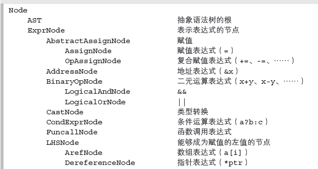

# 自制编译器


[自制编译器](https://book.douban.com/subject/26806041/)

青木峰郎

[随书代码](https://www.ituring.com.cn/book/download/20cc8fae-cd7b-4570-a5ea-013a040c14f4)


有配套的实验吗？书上有测试题吗？


关于Linux 的兼容模式，请参考http://www.ituring.com.cn/book/1308。另外，也可以参考ubuntu 64 位
系统下的cbc 版本：https://github.com/leungwensen/cbc-ubuntu-64bit（提供docker 镜像）。——译者注
打开http://www.ituring.com.cn/book/1308，点击“随书下载”，下载C♭ 编译器。


中文版翻译不好？


A Retargetable C Compiler

https://book.douban.com/subject/1610344/

介绍的是一个完整但简单得多的C语言编译器LCC

一个简单的用Java实现的简化版C的编译器cbc


JavaCC工具，前端

BNF


生成可执行代码


elf


头

data

text


## Chap.1 开始制作编译器

elf

file linux命令


### 第2章　CB和cbc


cb c语言子集


Compiler含有main函数，编译器程序的入口函数main 就定义在compiler 包的Compiler 类中。

类名作用
Compiler 统管其他所有类的facade 类（compiler driver）
Visitor
语义分析相关的类（第9 章）
DereferenceChecker
LocalReferenceResolver
TypeChecker
TypeResolver


IRGenerator 从抽象语法树生成中间代码的类（第11 章）


### 第5章　基于JavaCC 的解析器的描述

ebnf

### 第6章　语法分析

if

while

for

expr


### 第7章　JavaCC 的action 和抽象语法树



Token


Node


### 第8章　抽象语法树的生成

运算

### 第9章　语义分析（1）引用的消解

reference

https://blog.csdn.net/dengzhao3993/article/details/101506041

### 第10章　语义分析（2）静态类型检查


static type check


### 第11章　中间代码的转换

https://www.cnblogs.com/fisherss/p/13905395.html


## 第3部分　汇编代码
### 第12章　x86 架构的概要


### 第13章　x86 汇编器编程

x86 指令集

mov

push

pip

lea

movsx

movzx

add

sub

imul

idiv

div

inc

des

neg

and

or

xor

not

sal

sar

shr

ump

jz jnz jejne

cpm

test

call

ret


### 第14章　函数和变量

caller-save callee-save


#### 第15章　编译表达式和语句


net.loveruby.cflat.sysdep.CodeGenerator接口，生成汇编代码

net.loveruby.cflat.sysdep.x86.CodeGenerator


jump

Cjump

call

return


```
Expr (net.loveruby.cflat.ir)
    Mem (net.loveruby.cflat.ir)
    Var (net.loveruby.cflat.ir)
    Call (net.loveruby.cflat.ir)
    Addr (net.loveruby.cflat.ir)
    Bin (net.loveruby.cflat.ir)
    Uni (net.loveruby.cflat.ir)
    Str (net.loveruby.cflat.ir)
    Int (net.loveruby.cflat.ir)
Case (net.loveruby.cflat.ir)
Stmt (net.loveruby.cflat.ir)
    Assign (net.loveruby.cflat.ir)
    CJump (net.loveruby.cflat.ir)
    ExprStmt (net.loveruby.cflat.ir)
    Jump (net.loveruby.cflat.ir)
    Switch (net.loveruby.cflat.ir)
    Return (net.loveruby.cflat.ir)
    LabelStmt (net.loveruby.cflat.ir)

```


### 第16章　分配栈帧

net.loveruby.cflat.sysdep.x86.CodeGenerator.StackFrameInfo

#### 第17章　优化的方法

一般优化

cbc中的优化


## 第4部分　链接和加载

#### 第18章　生成目标文件


elf

使用readelf 命令输出节头 输出程序头 输出符号表

as命令

net.loveruby.cflat.sysdep.GNUAssembler

### 第19章　链接和库

ld命令


静动态库

```
net.loveruby.cflat.sysdep.GNULinker
```


```java
static final private String LINKER = "/usr/bin/ld";
static final private String DYNAMIC_LINKER      = "/lib/ld-linux.so.2";
static final private String C_RUNTIME_INIT      = "/usr/lib/crti.o";
static final private String C_RUNTIME_START     = "/usr/lib/crt1.o";
static final private String C_RUNTIME_START_PIE = "/usr/lib/Scrt1.o";
static final private String C_RUNTIME_FINI      = "/usr/lib/crtn.o";
```

Glibc辅助运行库 (C RunTime Library): crt0.o,crt1.o,crti.o crtn.o,crtbegin.o crtend.o

crt1.o, crti.o, crtbegin.o, crtend.o, crtn.o 等目标文件和daemon.o（由我们自己的C程序文件产生）链接成一个执行文件。前面这5个目标文件的作用分别是启动、初始化、构造、析构和结束，它们通常会被自动链接到应用程序中。例如，应用程序的main()函数就是通过这些文件来调用的。如果不进行标准的链接的话（编译选项-nostdlib），我们就必须指明这些必要的目标文件，如果未指定，链接器就会提示找不到_start符号，并因此导致链接失败。且，将目标文件提供给编译器的次序也很重要，因为GNU链接器（编译器会自动调用该链接器进行目标文件的链接）只是个单次处理链接器。


Glibc有几个辅助程序运行的运行库 (C RunTime Library)，分别是/usr/lib/crt1.o、/usr/lib/crti.o和/usr/lib/crtn.o，其中crt1.o中包含程序的入口函数_start以及两个未定义的符号__libc_start_main和main，由_start负责调用__libc_start_main初始化libc，然后调用我们源代码中定义的main函数；另外，由于类似于全局静态对象这样的代码需要在main函数之前执行，crti.o和crtn.o负责辅助启动这些代码。另外，Gcc中同样也有crtbegin.o和crtend.o两个文件，这两个目标文件用于配合glibc来实现C++的全局构造和析构。
android bionic,这个C runtime library设计并不是功能特别强大,并且有些gnu glic中的函数没有实现,这是移植时会碰到的问题.而且,这个C runtime library也并没有采用crt0.o,crt1.o,crti.o crtn.o,crtbegin.o crtend.o,而是采用了android自己的crtbegin_dynamic.o, crtbegin_static.o 和crtend_android.o。crt1.o是crt0.o的后续演进版本,crt1.o中会非常重要的.init段和.fini段以及_start函数的入口..init段和.fini段实际上是靠crti.o以及crtn.o来实现的. init段是main函数之前的初始化工作代码, 比如全局变量的构造. fini段则负责main函数之后的清理工作.crti.o crtn.o是负责C的初始化,而C++则必须依赖crtbegin.o和crtend.o来帮助实现.
So,在标准的linux平台下,link的顺序是:ld crt1.o crti.o [user_objects] [system_libraries] crtn.o
而在android下,link的顺序是:arm-eabi-g++ crtbegin_dynamic.o [user_objects] [system_libraries]crtend_android.o
所以这就是从另一个方面说明为什么不适合codesourcery之类编译来开发android底层东西的原因了,这里不包括BSP之类.
main()也是一个函数。
这是因为在编译连接时它将会作为crt0.s汇编程序的函数被调用。crt0.s是一个桩（stub）程序，名称中的“crt”是“C run-time”的缩写。该程序的目标文件将被链接在每个用户执行程序的开始部分，主要用于设置一些初始化全局变量。通常使用gcc编译链接生成文件时，gcc会自动把该文件的代码作为第一个模块链接在可执行程序中。在编译时使用显示详细信息选项“-v”就可以明显地看出这个链接操作过程。因此在通常的编译过程中，我们无需特别指定stub模块crt0.o。为了使用ELF格式的目标文件以及建立共享库模块文件，现在的编译器已经把crt0扩展成几个模块：crt1.0、crti.o、crtbegin.o、crtend.o和crtn.o。这些模块的链接顺序为crt1.o、crti.o、crtbegin.o（crtbeginS.o）、所有程序模块、crtend.o（crtendS.o）、crtn.o、库模块文件。gcc的配置文件specfile指定了这种链接顺序。其中，crt1.o、crti.o和crtn.o由C库提供，是C程序的“启动”模块；crtbegin.o和crtend.o是C++语言的启动模块，由编译器gcc提供；而crt1.o则与crt0.o的作用类似，主要用于在调用main()之前做一些初始化工作，全局符号_start就定义在这个模块中。crtbegin.o和crtend.o主要用于C++语言，在.ctors和.dtors区中执行全局构造（constructor）和析构（destructor）函数。crtbeginS.o和crtendS.o的作用与前两者类似，但用于创建共享模块中。crti.o用于在.init区中执行初始化函数init()。.init区中包含进程的初始化代码，即当程序开始执行时，系统会在调用main()之前先执行.init中的代码。crtn.o则用于在.fini区中执行进程终止退出处理函数fini()函数，即当程序正常退出时（main()返回之后），系统会安排执行.fini中的代码。


### 第20章　加载程序

加载ELF 段

mmap

读入静态库 动态库

#### 第21章　生成地址无关代码


全局偏移表（GOT）


## 跨年摘录（2020–2026 日常笔记聚合，2026-09-23 整理）

### 2020-10
> 曾于2016年6月出版《自己动手写Java虚拟机》一书，广受读者好评，并多次重印。《自己动手实现Lua：虚拟机、编译器、标准库》是他时隔两年之后推出的又一力作。

