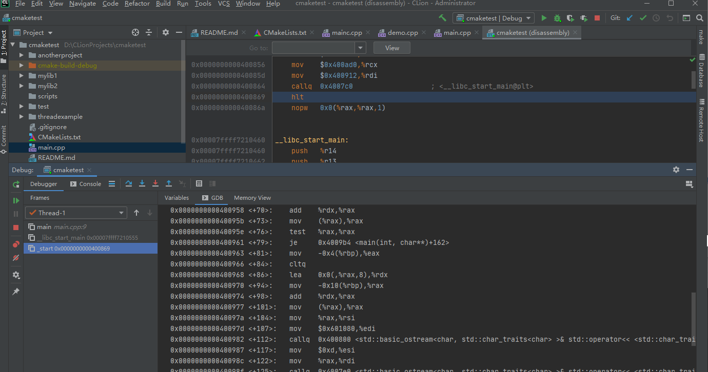

# gdb

[GDB的基本工作原理](https://blog.csdn.net/weiwangchao_/article/details/11884639)

那么，gdb到底是凭什么接管的一个进程的执行呢？其实，很简单，通过一个系统调用：ptrace。ptrace系统调用的原型如下：

```c

#include <sys/ptrace.h>
long ptrace(enum __ptrace_request request,  pid_t pid, void *addr, void *data);

```
说明：ptrace系统调用提供了一种方法来让父进程可以观察和控制其它进程的执行，检查和改变其核心映像以及寄存器。 主要用来实现断点调试和系统调用跟踪。（man手册）
其实，说到这里，一切原理层面应该都比较明朗了（且先不去管内核中是怎么实现ptrace的）。gdb就是调用这个系统调用，然后通过一些参数来控制其他进程的执行的。

https://blog.csdn.net/weiwangchao_/article/details/11884639

b -- break

gdb-subscribe@sourceware.org

https://www.gnu.org/software/gdb/documentation/


https://blog.csdn.net/xiongxinlei/article/details/78119714


gdb调试技巧

gdb disas clion debug（注意不是run） 进断点后，

clion gdb界面 输入disas

https://www.cnblogs.com/Forever-Kenlen-Ja/p/8631663.html




[使用 GDB 对程序进行汇编级调试](http://www.cnblogs.com/diylab/archive/2009/07/16/1524483.html)


 下断点
 (gdb) b *0x0804ce2b
  b 表示 break

 单步步过
 (gdb) ni  (next instruction)
 单步步入 
 (gdb) si  ( step instruction )
 继续执行
 ( gdb )c

 执行到返回

