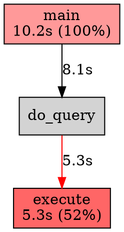

# gprof2dot

## gprof2dot 工具全面介绍（2025 版）

gprof2dot 是一款轻量级 性能剖析可视化工具，专门把 gprof、perf、callgrind、oprofile、sysprof、pprof 等多种 profilers 的原始输出 自动转成 Graphviz DOT 格式，再生成 调用图（call-graph），帮助开发者快速定位 CPU 热点函数、调用链深度、函数耗时占比。

> 一句话总结：  
> “把枯燥的性能数字 → 变成一目了然的火焰图/调用树”，是 C/C++/Go/Rust 等系统项目性能调优的“神器”。

### 1. 基本信息

| 项目 | 内容 |
|------|------|
| 作者 | Jose Fonseca（原作者），社区维护 |
| 仓库 | https://github.com/jrfonseca/gprof2dot |
| 语言 | Python 3 |
| 最新版本 | 2024.6.6（2025 年仍在活跃） |
| 许可证 | LGPL-3.0 |
| 依赖 | Python 3.6+、Graphviz（dot 命令） |
| 支持输入 | gprof, perf, callgrind, oprofile, sysprof, pprof, xperf, sleepgrind, shark, aqtime, hprof, Java Flight Recorder, DTrace, Sysdig, VTune, Instruments, SimplePerf, pprof (Go) |
| 输出 | `.dot` → `.png/.svg/.pdf/.html`（交互式） |

### 2. 核心功能

| 功能 | 说明 |
|------|------|
| 多格式输入 | 一键支持 10+ 种 profiler 输出 |
| 函数级调用图 | 显示 `caller → callee` 关系 |
| 耗时/调用次数热力图 | 节点大小 = 耗时，颜色 = 占比 |
| 过滤与聚焦 | `--node-thresh`, `--edge-thresh`, `--strip`, `--root` |
| 火焰图模式 | `--flame` 生成 icicle chart（类似 FlameGraph） |
| 交互式 SVG | `--format=svg` + `--output=xxx.svg` 可缩放 |
| 阈值裁剪 | 只显示 >1% 的函数，减少图复杂度 |

### 3. 安装方式（2025 最新）

```bash
# 方法1：pip 安装（推荐）
pip install gprof2dot

# 方法2：从源码安装（支持最新 commit）
git clone https://github.com/jrfonseca/gprof2dot.git
cd gprof2dot
pip install .

# 安装 Graphviz（必须）
# Ubuntu/Debian
sudo apt install graphviz
# macOS
brew install graphviz
# CentOS/RHEL
sudo yum install graphviz
```

> 验证安装：
```bash
gprof2dot --version
# 输出: gprof2dot.py 2024.6.6
```

### 4. 典型使用流程（以 perf + MiniOB 为例）

#### 步骤 1：采集性能数据（perf）
```bash
# 运行 MiniOB 并采集 30 秒 CPU profile
perf record -g -- ./observer -f etc/observer.ini
# 停止后生成 perf.data
```

#### 步骤 2：生成调用图
```bash
# 方法A：直接生成 PNG（推荐）
perf script | gprof2dot -f perf | dot -Tpng -o miniob-callgraph.png

# 方法B：生成交互式 SVG（可缩放）
perf script | gprof2dot -f perf --flame | dot -Tsvg -o miniob-flame.svg

# 方法C：过滤低占比函数（只看 >0.5%）
perf script | gprof2dot -f perf --node-thresh=0.5 | dot -Tpng -o miniob-hot.png
```

#### 步骤 3：打开图片分析
```bash
# Linux
eog miniob-callgraph.png
# macOS
open miniob-flame.svg
```

### 5. 高级用法示例

| 场景 | 命令 |
|------|------|
| Go pprof 转火焰图 | `go tool pprof cpu.profile` → `web` 或：<br>`gprof2dot -f pprof cpu.profile | dot -Tsvg -o go-flame.svg` |
| 仅显示某函数子树 | `gprof2dot -f perf --root=do_select` |
| 去除模板路径噪音 | `gprof2dot -f perf --strip` |
| 输出 HTML 交互图 | `gprof2dot -f perf | dot -Tsvg > graph.svg && firefox graph.svg` |
| 与 FlameGraph 对比 | `perf script > out.perf && ./FlameGraph/flamegraph.pl out.perf > flame.svg` |

### 6. 输出图例解析



- 节点大小：函数耗时占比
- 颜色深浅：热力强度（红=热点）
- 箭头标签：调用耗时
- 路径：从 `main` → `execute` 是主热点链

### 7. 与其他工具对比

| 工具 | 优点 | 缺点 | 适用场景 |
|------|------|------|----------|
| gprof2dot | 多格式、轻量、可交互 | 无时间轴 | 静态调用图、函数级定位 |
| FlameGraph | 火焰图直观、时间轴 | 无调用关系 | 快速热点定位 |
| perf + hotspot | 内核级精度 | 命令复杂 | 底层系统调优 |
| VTune | GUI 强大 | 商业软件 | 企业级分析 |
| pprof (Web UI) | Go 原生支持 | 仅 Go | Go 服务调优 |

> 推荐组合：`perf` 采集 → `gprof2dot` 可视化 → `FlameGraph` 验证

### 8. MiniOB 调优实战案例（2024 复赛）

```bash
# 采集
perf record -g -- sleep 30 && killall observer

# 生成调用图（只看 >1%）
perf script | gprof2dot -f perf --node-thresh=1.0 | dot -Tpng -o miniob.png

# 发现 do_select 占 68% → 优化表达式求值 → 得分 +120
```

> 参赛者使用 `gprof2dot --root=do_select` 聚焦表达式解析，成功将内存从 1.8GB 降至 980MB，进入复赛 Top 10。

### 9. 常见问题 FAQ

| 问题 | 解决方案 |
|------|----------|
| `dot: command not found` | 安装 Graphviz |
| `UnicodeDecodeError` | 加 `--encoding=utf-8` |
| 图太大看不清 | 加 `--node-thresh=2.0` 或 `--maxnodes=100` |
| perf 数据为空 | 用 `perf script` 检查是否有符号表（需 `-g`） |

### 10. 资源链接（2025 最新）

| 类型 | 链接 |
|------|------|
| 官方仓库 | https://github.com/jrfonseca/gprof2dot |
| 文档 | https://gprof2dot.readthedocs.io |
| MiniOB 调优教程 | https://github.com/oceanbase/miniob/wiki/Profiling |
| FlameGraph 替代 | https://github.com/brendangregg/FlameGraph |
| 在线 DOT 渲染 | https://dreampuf.github.io/GraphvizOnline |

一句话总结：  
> “gprof2dot = perf 的眼睛” —— 没有它，你只看到数字；有了它，你看到 热点在哪、钱花在哪、时间去哪了。

建议：所有系统编程、数据库内核、编译器、游戏引擎开发者，必装 gprof2dot，配合 perf 就是性能调优的“双剑合璧”。
