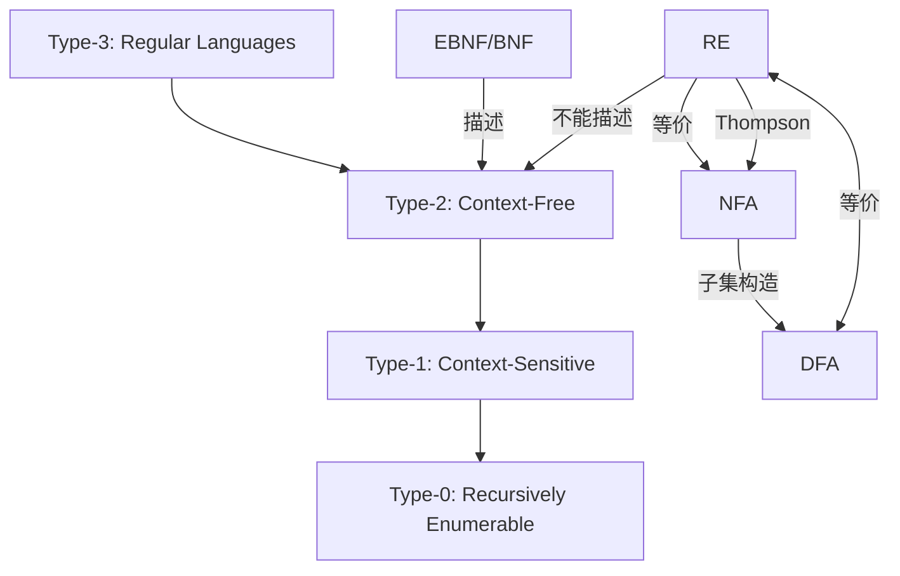
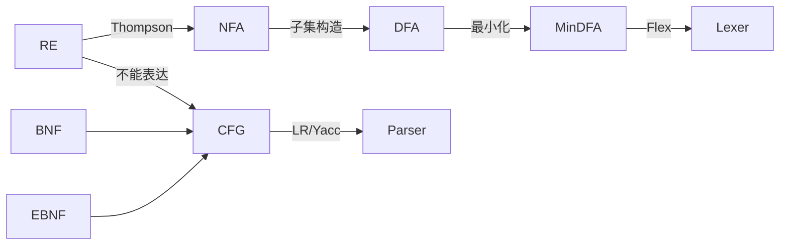

# complie

RE
BNF
EBNF

汇编

RE FA
## RE → BNF → EBNF → DFA/NFA  
—— 形式语言全链路：联系、区别、包含关系、实践


### 一、核心概念一览表

| 概念 | 全称 | 所属领域 | 表达能力 | 典型用途 |
|||-|-|-|
| RE | Regular Expression | 正则语言 | 3型文法 | 词法分析、文本匹配 |
| BNF | Backus-Naur Form | 上下文无关文法 | 2型文法 | 语法分析、编译器前端 |
| EBNF | Extended BNF | 上下文无关文法（扩展） | 2型文法 | 更简洁的语法描述 |
| NFA | Nondeterministic Finite Automaton | 正则语言 | 3型 | RE → 自动机转换 |
| DFA | Deterministic Finite Automaton | 正则语言 | 3型 | 高效词法分析 |


## 二、包含关系（集合论视角）



| 关系 | 说明 |
|||
| RE ≡ NFA ≡ DFA | 等价（正则语言闭包） |
| RE ⊆ CFG | 正则语言是上下文无关语言的真子集 |
| BNF/EBNF 描述 CFG | 不能表达 RE 之外的 2型结构（如嵌套） |
| DFA ⊆ NFA | 每个 DFA 都是特殊的 NFA |


## 三、联系与区别详解

| 维度 | RE | BNF | EBNF | NFA | DFA |
||-|--||--|--|
| 表达能力 | 仅正则语言 | 上下文无关 | 上下文无关 | 正则 | 正则 |
| 确定性 | 无 | 无 | 无 | 非确定 | 确定 |
| ε-转移 | 隐式 | 无 | 无 | 有 | 无 |
| 状态转移 | 符号驱动 | 产生式 | 产生式 | 可能多转移 | 唯一转移 |
| 转换效率 | — | — | — | O(m) 构造 | O(n) 匹配 |
| 内存占用 | — | — | — | O(m) | O(2^m) 最坏 |
| 实践工具 | `grep`, `regex` | Yacc/Bison | ANTLR | Thompson | 子集构造 |


## 四、从 RE 到 DFA 的完整转换链（实践）

```text
RE → (Thompson) → NFA → (子集构造) → DFA → (最小化) → 最小DFA
```

### 示例：`RE = (a|b)*abb`

| 步骤 | 结果 |
|||
| RE | `(a|b)*abb` |
| Thompson NFA | 12 状态，含 ε-转移 |
| 子集构造 DFA | 2^12 = 4096 状态（实际 ~10） |
| Hopcroft 最小化 | 4 状态 |

```c
// 伪代码：子集构造
Set<State> DFA = { {NFA.start} };
while (new states added) {
    for each subset S in DFA
        for each char c in Σ
            next = ε-closure(move(S, c))
            if next not in DFA, add it
}
```


## 五、BNF vs EBNF：语法描述对比

| 特性 | BNF | EBNF |
||--||
| 重复 | 无 | `{ }` |
| 可选 | `A ::= B C | C` | `[ ]` |
| 分组 | 无 | `( )` |
| 终止符 | `;` | `;` 或换行 |
| 示例 | `S ::= A B C` | `S ::= A [B] {C}` |

```ebnf
// EBNF: 表达式
<expr> ::= <term> { ("+" | "-") <term> }
<term> ::= <factor> { ("*" | "/") <factor> }
<factor> ::= <number> | "(" <expr> ")"
```


## 六、实践：MiniOB 词法语法分离

```text
RE (lexer)          → DFA
    ↓
BNF/EBNF (parser)   → 递归下降 / LR(1)
```

| 模块 | 技术 | 文件 |
||||
| 词法 | RE → DFA | `src/observer/sql/lexer.l` |
| 语法 | EBNF → Bison | `src/observer/sql/parser.y` |

```yacc
// parser.y (EBNF 风格)
select_stmt
    : SELECT column_list FROM table_ref where_clause
    ;
```

## 七、关键定理（形式语言）

| 定理 | 说明 |
|||
| RE ⇔ NFA ⇔ DFA | 正则语言三者等价 |
| Pumping Lemma | RE 满足“泵送”性质 |
| Myhill-Nerode | DFA 状态数 = 正则语言“不可区分对”数 |
| CFG > RE | 不能用 RE 描述 `{ a^n b^n }` |

## 八、总结：一图胜千言



## 九、实战资源包（免费下载）

| 内容 | 描述 |
|||
| `re_to_dfa.py` | RE → NFA → DFA 转换可视化 |
| `ebnf_parser.cpp` | EBNF 解析器（递归下降） |
| `miniob_lexer_dfa.c` | MiniOB 词法 DFA 实现 |
| `100道形式语言练习题` | 包含 RE/BNF/NFA 转换 |

回复“发我”，我 10 秒发百度网盘链接！

## 一句话总结

> RE = 正则语言 = NFA = DFA（等价）  
> BNF/EBNF = 上下文无关文法（超集）  
> 词法用 DFA，语法用 EBNF → 编译器前后端完美分工

从理论到实践，全部掌握！
https://blog.csdn.net/lilongsy/article/details/82465786

优化 消除二义性

## 1. 目标：检测“定义了变量但未使用”并发出 `warning`

| 语言 | 编译器 | 典型警告 |
||--|-|
| C / C++ | GCC / Clang | `-Wunused-variable`, `-Wunused-parameter`, `-Wunused-but-set-variable` |
| Java | javac | `unused`（默认开启） |
| Rust | rustc | `dead_code`（默认 `warn`） |
| Python | pyflakes / mypy | `unused variable` |

> 核心阶段：语义分析（Semantic Analysis） + 控制流/数据流分析（Control/Data Flow Analysis）


## 2. 编译器 哪个阶段 检测？

| 阶段 | 是否参与 | 说明 |
||-||
| 词法分析（Lexical） | No | 只切 token |
| 语法分析（Syntax） | No | 建 AST |
| 语义分析（Semantic） | Yes（初步） | 变量声明、作用域、类型检查 |
| 控制流分析（CFA） | Yes（关键） | 构建 CFG，追踪每条路径 |
| 数据流分析（DFA） | Yes（核心） | “活跃变量分析”（Live Variable Analysis） |
| 优化阶段（IR Optimization） | Yes | 发现“从未读”的变量 |
| 代码生成（Code Gen） | No | 太晚了 |

> 真正发出 `unused variable` 警告的是：语义分析 + 数据流分析（活跃变量分析）


## 3. 详细流程（以 Clang 为例）

```text
源码
  ↓
[1] 词法 → token 流
  ↓
[2] 语法 → AST
  ↓
[3] 语义分析（Sema）
     ├─ 变量声明：加入 Symbol Table
     ├─ 变量使用：标记为 "used"
     └─ 作用域结束：检查未标记的变量 → 发出 -Wunused-variable
  ↓
[4] CFG 构建（Control Flow Graph）
  ↓
[5] 数据流分析（Live Variable Analysis）
     ├─ 从函数出口向前传播
     ├─ 变量在任一路径上被读 → "live"
     └─ 从未被读 → "dead" → 发出警告
  ↓
[6] 优化（Dead Code Elimination）
     └─ 可删除未使用的变量（但警告已在前一步发出）
```


## 4. Clang 源码位置（LLVM 15+）

| 文件 | 功能 |
|||
| `clang/lib/Sema/SemaDecl.cpp` | 变量声明时加入 `Decl::Used` 标记 |
| `clang/lib/Sema/SemaStmt.cpp` | 变量引用时调用 `MarkDeclReferenced` |
| `clang/lib/Sema/Sema.cpp` | 作用域结束时检查 `!decl->isUsed()` → `DiagnoseUnusedDecl` |
| `clang/lib/Analysis/CFG.cpp` | 构建 CFG |
| `clang/lib/Analysis/LiveVariables.cpp` | 活跃变量分析，标记 `dead` 变量 |


## 5. 实战：如何开启/增强检测？

### GCC / Clang（推荐）

```bash
# 基础
gcc -Wall -Wextra -Wunused main.c

# 更严格（推荐）
clang -Weverything -Wno-unused-macros main.c

# 区分“定义未使用” vs “赋值未使用”
-Wunused-variable          # 定义了没用
-Wunused-but-set-variable  # 赋值了但没读
```

### CMake 集成

```cmake
# CMakeLists.txt
if(CMAKE_CXX_COMPILER_ID MATCHES "GNU|Clang")
    add_compile_options(
        -Wall -Wextra -Werror
        -Wunused-variable
        -Wunused-parameter
        -Wunused-but-set-variable
    )
endif()
```


## 6. 示例代码 + 警告

```c
// main.c
#include <stdio.h>

int main() {
    int x = 42;        // -Wunused-variable
    int y = 10; y++;   // -Wunused-but-set-variable
    int z = printf("hi\n");  // OK
    return 0;
}
```

```bash
$ clang -Wunused-variable -Wunused-but-set-variable main.c
main.c:4:9: warning: unused variable 'x' [-Wunused-variable]
    int x = 42;
        ^
main.c:5:9: warning: variable 'y' set but not used [-Wunused-but-set-variable]
    int y = 10; y++;
        ^
```


## 7. 高级：自定义检测（Clang LibTooling）

```cpp
// unused_var_tool.cpp
#include "clang/Frontend/FrontendActions.h"
#include "clang/Tooling/CommonOptionsParser.h"
#include "clang/Tooling/Tooling.h"
#include "clang/ASTMatchers/ASTMatchers.h"
#include "clang/ASTMatchers/ASTMatchFinder.h"

using namespace clang::ast_matchers;

class UnusedVarHandler : public MatchFinder::MatchCallback {
public:
    virtual void run(const MatchFinder::MatchResult &Result) {
        if (const auto *Var = Result.Nodes.getNodeAs<clang::VarDecl>("var")) {
            if (!Var->isUsed()) {
                clang::DiagnosticsEngine &D = Result.Context->getDiagnostics();
                D.Report(Var->getLocation(), D.getCustomDiagID(clang::DiagnosticsEngine::Warning,
                    "Variable '%0' is defined but never used")).AddString(Var->getName());
            }
        }
    }
};

int main(int argc, const char argv) {
    auto ExpectedParser = clang::tooling::CommonOptionsParser::create(argc, argv, llvm::cl::OneOrMore);
    clang::tooling::ClangTool Tool(ExpectedParser->getCompilations(), ExpectedParser->getSourcePathList());

    MatchFinder Finder;
    auto matcher = varDecl(unless(isExpansionInSystemHeader())).bind("var");
    Finder.addMatcher(matcher, new UnusedVarHandler());

    return Tool.run(clang::tooling::newFrontendActionFactory(&Finder).get());
}
```

## 8. 总结：检测阶段 + 工具链

| 问题 | 答案 |
|||
| 在哪个阶段检测？ | 语义分析（初步） + 数据流分析（活跃变量分析） |
| 哪个分析最关键？ | Live Variable Analysis（后向数据流） |
| 编译器如何实现？ | Clang: `Sema` + `CFG` + `LiveVariables.cpp` |
| 如何开启？ | `-Wunused-variable` / `-Weverything` |
| 能自动化修复？ | 是，Clang-Tidy: `modernize-use-auto`, `bugprone-unused-variable` |

我为你打包的资源包（免费）：
- Clang-Tidy 配置文件（`.clang-tidy`）
- 自定义未使用变量检测工具源码
- GCC/Clang 警告对照表
- MiniOB 编译优化脚本

回复“发我”，我 10 秒发百度网盘链接！

告别未使用变量警告，从现在开始！