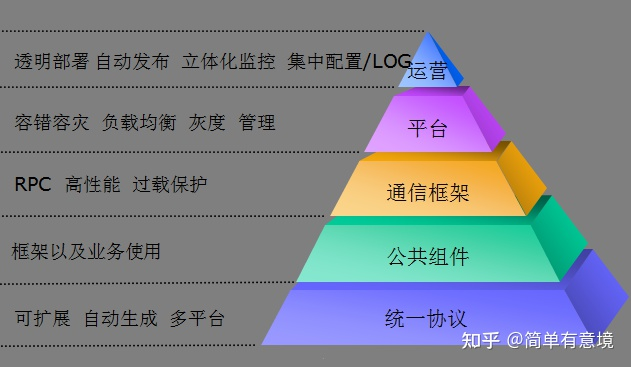

# Tars

## chatgpt的例子
TARS (Tencent Architecture for Reliable Service) 是一种高效、易用的服务框架，支持多种编程语言，包括 C++ 和 Java。下面是一个简单的例子，展示如何在 TARS 中使用 C++ 和 Java 来创建和调用服务。

### 安装 TARS

在开始之前，确保你已经安装了 TARS 框架。你可以参考 [TARS 官方文档](https://github.com/TarsCloud/Tars/blob/master/docs/cn/Installation.md) 进行安装。

### Thrift 定义文件

首先，我们定义一个简单的 Thrift 文件，定义一个计算服务 `Calculator`，它具有两个方法 `add` 和 `subtract`。

创建一个名为 `Calculator.tars` 的文件，内容如下：

```tars
module Example
{
    interface Calculator
    {
        int add(int num1, int num2);
        int subtract(int num1, int num2);
    };
};
```

### 生成代码

使用 TARS 编译器生成代码。确保 TARS 编译器已添加到路径中。

```bash
tars2cpp Calculator.tars
tars2java Calculator.tars
```

### C++ 服务端代码

#### 服务实现 (`CalculatorImp.h` 和 `CalculatorImp.cpp`)

`CalculatorImp.h`：

```cpp
#ifndef _CALCULATORIMP_H_
#define _CALCULATORIMP_H_

#include "servant/Application.h"
#include "Calculator.h"

using namespace Example;

class CalculatorImp : public Calculator
{
public:
    virtual ~CalculatorImp() {}

    virtual int add(int num1, int num2, tars::TarsCurrentPtr current);
    virtual int subtract(int num1, int num2, tars::TarsCurrentPtr current);
};

#endif
```

`CalculatorImp.cpp`：

```cpp
#include "CalculatorImp.h"

int CalculatorImp::add(int num1, int num2, tars::TarsCurrentPtr current)
{
    return num1 + num2;
}

int CalculatorImp::subtract(int num1, int num2, tars::TarsCurrentPtr current)
{
    return num1 - num2;
}
```

#### 服务启动代码 (`main.cpp`)

```cpp
#include "servant/Application.h"
#include "CalculatorImp.h"

using namespace tars;

class CalculatorApp : public Application
{
protected:
    virtual void initialize()
    {
        addServant<CalculatorImp>(ServerConfig::Application + "." + ServerConfig::ServerName + ".CalculatorObj");
    }

    virtual void destroyApp()
    {
    }
};

int main(int argc, char* argv[])
{
    try
    {
        CalculatorApp app;
        app.main(argc, argv);
        app.waitForShutdown();
    }
    catch (std::exception& e)
    {
        cerr << "std::exception: " << e.what() << endl;
    }
    catch (...)
    {
        cerr << "unknown exception." << endl;
    }
    return 0;
}
```

### Java 客户端代码

#### 客户端实现 (`CalculatorClient.java`)

```java
import com.qq.tars.client.Communicator;
import com.qq.tars.client.CommunicatorConfig;
import com.qq.tars.client.CommunicatorFactory;
import Example.CalculatorPrx;

public class CalculatorClient {
    public static void main(String[] args) {
        CommunicatorConfig cfg = new CommunicatorConfig();
        Communicator communicator = CommunicatorFactory.getInstance().getCommunicator(cfg);

        CalculatorPrx proxy = communicator.stringToProxy(CalculatorPrx.class, "Example.CalculatorServer.CalculatorObj@tcp -h 127.0.0.1 -p 9000");

        int result = proxy.add(1, 1);
        System.out.println("1 + 1 = " + result);

        result = proxy.subtract(5, 3);
        System.out.println("5 - 3 = " + result);
    }
}
```

### 编译和运行

#### 编译 C++ 代码

确保已安装必要的编译器和依赖库，然后编译 C++ 代码：

```bash
g++ -o CalculatorServer main.cpp CalculatorImp.cpp -ltarsservant -ltarsutil
```

#### 运行 C++ 服务

```bash
./CalculatorServer --config=config.conf
```

#### 编译和运行 Java 客户端

编译 Java 客户端代码：

```bash
javac -cp path_to_tars_java_lib/* CalculatorClient.java
```

运行 Java 客户端：

```bash
java -cp .:path_to_tars_java_lib/* CalculatorClient
```

### 参考资料

- [TARS 官方文档](https://github.com/TarsCloud/Tars/blob/master/docs/cn/Installation.md)
- [TARS GitHub 仓库](https://github.com/TarsCloud/Tars)

## trpc

https://tarscloud.org/

tars docker 部署
https://tarscloud.github.io/TarsDocs/installation/docker.html

只能Linux，
docker run -d -p 3306:3306 --net=tars -e MYSQL_ROOT_PASSWORD="123456" --ip="172.25.0.2" -v /data/framework-mysql:/var/lib/mysql -v /etc/localtime:/etc/localtime --name=tars-mysql mysql:5.6

tars 负载均衡
https://xie.infoq.cn/article/c2ebc08fc1ace1da3421ed8e2

微信的微服务框架svrkit

腾讯联合科大讯飞，TARS 正式支持 Google ProtoBuf
讯飞用tars

https://tarscloud.github.io/TarsDocs/installation/docker.html

腾讯、阅文、虎牙、微软、微众、ARM、科大讯飞、好未来、优品财富、大唐移动

Tars 是一个由腾讯开发的高性能微服务框架，而 Kubernetes (K8s) 是一个开源的容器编排平台。Tars 和 Kubernetes 都可以用于构建和管理微服务架构，但它们的设计思路和功能特点有所不同。
以下是 Tars 和 Kubernetes 的主要特点和区别：
1. 架构设计：Tars 的基础架构是基于 C++ 开发的 TarsNode，作为运行 Tars 服务的节点。Tars 通过 TarsProtocol 来实现服务治理、负载均衡、故障恢复等功能。相比之下，Kubernetes 的基础架构是由多个组件构成的，包括 API Server、etcd、Controller Manager、Scheduler、kubelet 等。Kubernetes 通过资源对象来管理和调度容器，提供了更为灵活的扩展和管理能力。
2. 适用场景：Tars 主要用于构建大规模的分布式系统，特别是针对游戏、社交等对实时性要求较高的场景。而 Kubernetes 更加通用，适用于构建和管理各种类型的应用程序，包括 Web 应用、数据库、消息队列等。
3. 部署方式：Tars 的部署方式比较传统，需要手动安装和配置 TarsNode，然后将服务部署到 TarsNode 上。而 Kubernetes 使用容器来打包应用程序，可以使用 Docker 等工具自动化构建和部署应用程序。
4. 资源调度：Tars 通过 TarsProtocol 来实现服务的负载均衡和故障恢复，但是对于其他资源的调度和管理能力相对较弱。而 Kubernetes 通过调度器和控制器来管理和调度容器，可以根据资源使用情况、服务负载等因素来进行动态调度。
总的来说，Tars 和 Kubernetes 都是优秀的微服务架构解决方案，但是它们的设计思路和实现方式有所不同。选择哪种方案取决于具体的应用场景和需求。如果需要构建大规模的分布式系统，特别是针对游戏、社交等对实时性要求较高的场景，可以考虑使用 Tars；如果需要构建和管理各种类型的应用程序，包括 Web 应用、数据库、消息队列等，可以考虑使用 Kubernetes。

TARS 框架服务的运维管理平台 TarsWeb


tup 协议进行封装的各种语言开发包 TarsTup


文档没有Dubbo全

腾讯内部taf
讯飞用

microservice

RPC

Dubbo里面，消费者和提供者都有一份接口
taf里面，有类似的？


Dubbo没有熔断限流，鉴权


虎牙的核心业务是跑在Tars上的。

https://www.infoq.cn/article/GT2d84ovUaBPUSH-mPmC

张波，Nacos Committer，虎牙基础保障部中间件团队负责人，阿里云 MVP。

### tars 架构


.gitmodules

[submodule "framework"]
	path = framework
	url = https://github.com/TarsCloud/TarsFramework
[submodule "cpp"]
	path = cpp
	url = https://github.com/TarsCloud/TarsCpp
[submodule "java"]
	path = java
	url = https://github.com/TarsCloud/TarsJava
[submodule "nodejs"]
	path = nodejs
	url = https://github.com/tars-node/Tars.js
[submodule "php"]
	path = php
	url = https://github.com/TarsPHP/TarsPHP
[submodule "tup"]
	path = tup
	url = https://github.com/TarsCloud/TarsTup
[submodule "web"]
	path = web
	url = https://github.com/TarsCloud/TarsWeb
[submodule "go"]
	path = go
	url = https://github.com/TarsCloud/TarsGo
[submodule "docs"]
	path = docs
	url = https://github.com/TarsCloud/TarsDocs
[submodule "docker"]
	path = docker
	url = https://github.com/TarsCloud/TarsDocker.git
[submodule "docs_en"]
	path = docs_en
	url = https://github.com/TarsCloud/TarsDocs_en


https://tarscloud.github.io/TarsDocs/SUMMARY.html

[tars docker部署](https://tarscloud.github.io/TarsDocs/installation/docker.html)

tars架构图


[腾讯微服务框架Tars及源码研究](https://zhuanlan.zhihu.com/p/377589339)


