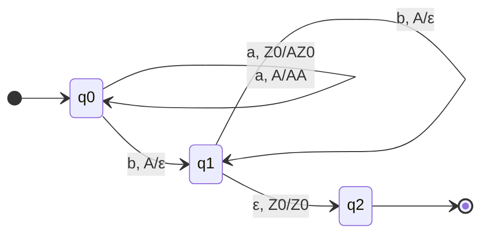

# 笔记：下推自动机（Pushdown Automaton, PDA）概念介绍

> **整理日期**：2026-09-12
> **性质**：概念梳理笔记（形式语言与自动机）
> **一句话概括**：PDA = **有限状态控制 + 一个后进先出栈**的计算模型，它识别的语言类恰好是**上下文无关语言（CFL）**，也就是**上下文无关文法（CFG）**能生成的那一类语言。

---

## 1. 先定位：为什么需要 PDA

### 1.1 有限自动机（FA）的极限

有限自动机只有"有限个状态"，**没有任何记忆**，因此它连最简单的"计数"都做不到：

- `L = { aⁿbⁿ | n ≥ 1 }` —— 读了多少个 `a`，就需要在读到 `b` 时知道还要读几个，FA 没有地方存这个数。
- 而这类"配对/嵌套"结构恰恰是所有编程语言的核心：括号匹配、`if…fi`、函数调用嵌套、表达式优先级。

### 1.2 解决思路：给它一块栈

| 记忆形式 | 能力 | 对应模型 |
|---|---|---|
| 无记忆（只有有限状态） | 只能记"有限种情况" | 有限自动机（DFA/NFA） |
| **无限但**只能后进先出（LIFO） | 能记**嵌套/配对**，不能随机存取 | **下推自动机（PDA）** |
| 无限且可随机读写 | 通用计算 | 图灵机（TM） |

**核心直觉**：栈的"后进先出"天然对应"最近打开的还没关闭"，所以 PDA 刚好描述**套嵌结构**。

### 1.3 在乔姆斯基层次中的位置

| 类型 | 文法 | 语言类 | 识别器 |
|---|---|---|---|
| 3 型 | 正则文法 | 正则语言 | 有限自动机（DFA/NFA/RE） |
| **2 型** | **上下文无关文法 CFG** | **上下文无关语言 CFL** | **下推自动机 PDA** |
| 1 型 | 上下文有关文法 | 上下文有关语言 | 线性有界自动机（LBA） |
| 0 型 | 无限制文法 | 递归可枚举语言 | 图灵机（TM） |

包含关系（真包含）：

```
正则 ⊊ DCFL ⊊ CFL ⊊ CSL ⊊ 递归语言 ⊊ 递归可枚举语言
        ↑        ↑
     DPDA 可识别  NPDA 可识别
```

---

## 2. 形式定义

### 2.1 七元组

一个（非确定）下推自动机是一个七元组：

\[
M = (Q,\ \Sigma,\ \Gamma,\ \delta,\ q_0,\ Z_0,\ F)
\]

| 符号 | 名称 | 含义 |
|---|---|---|
| \(Q\) | 状态集 | **有限**，表示控制器的"当前处境" |
| \(\Sigma\) | 输入字母表 | 有限的输入符号集 |
| \(\Gamma\) | 栈字母表 | **有限**的栈符号集，通常 \(\Sigma \subseteq \Gamma\) |
| \(\delta\) | 转移函数 | 下一步怎么走（见下） |
| \(q_0 \in Q\) | 初始状态 | 启动时处于此状态 |
| \(Z_0 \in \Gamma\) | 初始栈符号（栈底符号） | 启动时栈里只有它，用来"感知栈空" |
| \(F \subseteq Q\) | 接受状态集 | 终态接受的判定依据 |

**转移函数**（非确定版本，最一般的形式）：

\[
\delta:\ Q \times (\Sigma \cup \{\varepsilon\}) \times \Gamma \ \longrightarrow\ \mathcal{P}(Q \times \Gamma^{*})
\]

读法：**在当前状态 \(q\)、下一个输入符号是 \(a\)（或 ε，即不读输入）、栈顶符号是 \(X\) 时，可以迁移到状态 \(q'\)，并把栈顶 \(X\) 换成串 \(\gamma \in \Gamma^*\)。**

三个要点最容易被忽略：

1. **可以看到栈顶 \(X\)，但看不到栈内部** —— 这是"只能 LIFO"的形式化体现。
2. **替换的是整个栈顶 \(X\)，可以换成任意串 \(\gamma\)**：
   - \(\gamma = \varepsilon\) → **出栈**（pop，栈变浅）；
   - \(\gamma = X\) → 栈不变（只改状态）；
   - \(\gamma = YX\) → **入栈**（push，栈变深，\(Y\) 成为新栈顶）；
   - \(\gamma = YZX\) → 一次压入多个。
   所以**"push/pop"只是替换的特例**，定义中并不需要专门的原语。
3. **允许 ε 输入转移**：可以不读输入就动（空转移）；一个格局可能有多个后继 → **非确定性是内建的**，不是附加特性。

### 2.2 确定型 PDA（DPDA）的额外约束

\(\delta\) 退化为部分函数：

\[
\delta:\ Q \times (\Sigma \cup \{\varepsilon\}) \times \Gamma \ \longrightarrow\ (Q \times \Gamma^{*}) \cup \{\bot\}
\]

且对任意 \(q \in Q,\ a \in \Sigma,\ X \in \Gamma\)，必须同时满足：

1. **唯一性**：\(|\delta(q,a,X)| \le 1\)；
2. **ε 与普通转移不冲突**：若 \(\delta(q,\varepsilon,X) \neq \bot\)，则对所有 \(a \in \Sigma\) 都有 \(\delta(q,a,X) = \bot\)。

> **关键结论**：FA 中 DFA 与 NFA 等价，但 **PDA 中 DPDA ≠ NPDA**（DPDA 严格弱于 NPDA）。这是自动机理论里最重要的"反直觉"点之一。

---

## 3. 瞬时描述（格局）与运行语义

### 3.1 瞬时描述 ID（Instantaneous Description）

PDA 的"快照"是一个三元组：

\[
(q,\ w,\ \gamma)
\]

- \(q\)：当前状态
- \(w\)：**尚未读入**的输入串（剩余输入）
- \(\gamma\)：**栈内容**，约定**最左为栈顶**

初始 ID：\((q_0,\ w,\ Z_0)\)

### 3.2 一步推导

\[
(q,\ aw,\ X\beta) \ \vdash\ (q',\ w,\ \alpha\beta)
\quad\text{当}\quad (q',\alpha) \in \delta(q,a,X)
\]

若用 ε 转移：

\[
(q,\ w,\ X\beta) \ \vdash\ (q',\ w,\ \alpha\beta)
\quad\text{当}\quad (q',\alpha) \in \delta(q,\varepsilon,X)
\]

- \(\vdash^{*}\)：零步或多步；\(\vdash^{n}\)：恰好 n 步。
- 与 FA 不同，PDA 的"格局是否等价"可能有无穷多个（栈可以无限变深）→ **PDA 的配置图是无限图**。

### 3.3 两种接受方式

| 方式 | 定义 | 形式化 |
|---|---|---|
| **终态接受** | 输入读完后，状态属于 \(F\) | \((q_0, w, Z_0) \vdash^{*} (q_f, \varepsilon, \gamma)\)，\(q_f \in F\) |
| **空栈接受** | 不看状态，只要**输入读完且栈空** | \((q_0, w, Z_0) \vdash^{*} (q, \varepsilon, \varepsilon)\) |

**等价性定理**：对**非确定** PDA，两种接受方式互相等价（任意一种定义的机器都能改造成另一种）。

- 空栈 → 终态：加一个新栈底符号与新开始状态，先用 ε 转移在原机器上"跑"，结束后再弹空栈并进入新终态。
- 终态 → 空栈：从接受状态加一个"清栈"状态，用 ε 转移不断 pop，直到栈空。

> ⚠️ 注意：对 **DPDA 二者不等价**。空栈接受的 DPDA 识别的语言恰好是 DCFL 中具有**前缀性质**（没有一个串是另一个串的前缀）的那一部分。这又是一个"非确定与确定不等价"的体现。

---

## 4. 典型构造示例

### 4.1 例 1：\(L_1 = \{ a^n b^n \mid n \ge 1 \}\)

**思路**：读到 `a` 就压栈（记账），读到 `b` 就弹栈（销账），栈底 `Z0` 露出时表示账已平。

\[
M_1 = (\{q_0,q_1,q_2\},\ \{a,b\},\ \{A,Z_0\},\ \delta,\ q_0,\ Z_0,\ \{q_2\})
\]

| 转移 | 动作 |
|---|---|
| \(\delta(q_0,a,Z_0) = \{(q_0, AZ_0)\}\) | 第一个 a：压入 A |
| \(\delta(q_0,a,A) = \{(q_0, AA)\}\) | 后续 a：继续压栈 |
| \(\delta(q_0,b,A) = \{(q_1, \varepsilon)\}\) | 遇到 b：开始弹栈（换到 q1 是关键——**不允许 a 再出现**） |
| \(\delta(q_1,b,A) = \{(q_1, \varepsilon)\}\) | 继续弹栈 |
| \(\delta(q_1,\varepsilon,Z_0) = \{(q_2, Z_0)\}\) | 栈底露出：ε 转移进入终态 |



### 4.2 例 2：\(L_2 = \{ ww^{R} \mid w \in \{a,b\}^{+} \}\)（回文，偶数长度）

**思路**：先一直压栈（读前半段），**非确定地猜中点**，然后进入匹配阶段，每读一个符号就与栈顶核对。

- 阶段一 \(q_0\)：\(\delta(q_0,x,X) \ni (q_0, xX)\)（对 \(x \in \{a,b\}\)）
- **猜中点**：\(\delta(q_0,\varepsilon,X) \ni (q_1,X)\)（对任何栈顶 \(X\)）
- 阶段二 \(q_1\)：\(\delta(q_1,x,x) = \{(q_1,\varepsilon)\}\)（读到的符号必须等于栈顶）
- 收尾：\(\delta(q_1,\varepsilon,Z_0) = \{(q_2,Z_0)\}\)，\(F = \{q_2\}\)

**"猜中点"就是非确定性**：PDA 事先不知道 `w` 有多长，只能在每个位置都"猜一次"，错了的分支自然死掉。

对比一下：**加上中心标记就变成确定的了** ——

\[
L_3 = \{ w\,c\,w^{R} \mid w \in \{a,b\}^{+} \}
\]

是 DCFL：读到 `c` 就明确知道要切到匹配阶段，无需猜测。这就是 **DPDA 与 NPDA 能力差异的具体体现**。

### 4.3 例 3：Dyck 语言（平衡括号）

\[
L_{dyck} = \{\ \text{由配对的 }(\ )\ \text{和 }[\ ]\ \text{构成的串}\ \}
\]

栈顶存"最近未闭合的括号类型"，遇到闭括号时与栈顶比对——**这就是编译器/编辑器做括号匹配的算法**，本质上就是一个确定型 PDA。

### 4.4 编译器里的真实 PDA：语法分析栈

| 解析技术 | 自动机视角 |
|---|---|
| 递归下降 | 用**调用栈**（操作系统栈）实现 PDA，靠函数递归压栈 |
| LL(1) 分析 | 显式**分析栈**存"待匹配的非终结符"，读输入决定用哪条产生式 |
| LR(1)/LALR（yacc、bison、lalrpop） | **移进-归约**：移进=压栈，归约=弹栈并压入非终结符 |

所以"用 PDA 解析 CFL"不是理论玩具：**SQL、JSON、各类编程语言的解析器都是（确定型）下推自动机**。

---

## 5. PDA 与 CFG 的等价性

**定理**：语言 \(L\) 是上下文无关语言（CFL）**当且仅当**存在一个 PDA 接受它。即 \(\text{CFG} \equiv \text{PDA}\)（对**非确定** PDA 成立）。

### 5.1 CFG → PDA：最直观的构造（单个状态 + 空栈接受）

思路：**让栈保存"尚未匹配的句型（sentential form）"，用栈顶模拟最左推导。**

设 CFG 为 \(G = (V, T, P, S)\)，构造 PDA：

\[
M = (\{q\},\ T,\ V \cup T \cup \{Z_0\},\ \delta,\ q,\ Z_0,\ \varnothing)
\]

只有**一个状态**，三类转移：

1. **初始化**：\(\delta(q,\varepsilon,Z_0) = \{(q,\, S Z_0)\}\) —— 把开始符号压栈。
2. **推导（展开非终结符）**：对每条产生式 \(A \to \alpha\)（\(\alpha \neq \varepsilon\)），
   \(\delta(q,\varepsilon,A) \ni (q,\ \alpha)\) —— **非确定地选产生式**，替换栈顶。若 \(\alpha=\varepsilon\) 则直接弹掉 \(A\)。
3. **匹配输入**：对每个终结符 \(a\)：\(\delta(q,a,a) = \{(q,\varepsilon)\}\) —— 栈顶与输入一致就双双弹出。

接受方式为**空栈**，且该构造是**非确定**的（第 2 类转移要猜产生式）—— 再次印证"非确定是 CFL 的内在特征"。

> 例题走一遍：\(S \to aSb \mid ab\)，输入 `aabb`：
> 栈：`Z0` →(1) `SZ0` →(2) `aSbZ0` →(3) `SbZ0` →(2) `abbZ0` →(3) 逐符号弹出 →(3) `Z0` →(3) 弹出 → 空栈，接受。

### 5.2 PDA → CFG

构造更繁琐（把 "state + 栈顶符号" 编成非终结符 \(A_{pXq}\)，语义是"从状态 p、栈顶 X 出发，弹掉 X 并到达状态 q 的过程中消耗的输入串"），本质是**把 PDA 的每一次栈顶弹出对应成一条产生式**，得到等价的 CFG。结论：两者能力相同。

---

## 6. 能力边界：PDA 做不到什么

| 语言 | 是 CFL？ | 原因 |
|---|---|---|
| \(\{a^n b^n\}\) | ✅ | 一个栈足够（一增一减） |
| \(\{w w^{R}\}\)（回文） | ✅ | 压栈后比对，需非确定猜中点 |
| 平衡括号 / Dyck | ✅ | 栈顶即"最近未闭合的" |
| \(\{a^n\}\cup\{a^n b^n\}\) 等并/连接 | ✅ | CFL 对**并、连接、Kleene 星**封闭 |
| **\(\{w w\}\)**（复制） | ❌ | 需要"先记住整个 \(w\) 再原样重现"，栈会丢失信息 |
| **\(\{a^n b^n c^n\}\)** | ❌ | 需要一个**计数器比对三方**，单栈只能记两方 |
| \(\{a^{i}b^{j}c^{k} \mid i<j \text{ 或 } j<k\}\) | ⚠️ **是 CFL 但不是 DCFL** | CFL 对交不封闭；这是分离 CFL 与 DCFL 的经典例子 |
| 一般递归、随机访问数组、跨行引用 | ❌ | 需图灵机能力 |

**判定工具**：用 **CFL 的泵引理（pumping lemma）** 可证明 \(\{a^nb^nc^n\}\)、\(\{ww\}\) 不是 CFL。

### 6.1 重要事实：两个栈 = 图灵机

| 模型 | 能力 |
|---|---|
| 1 个栈（PDA） | CFL |
| **2 个栈（单方向、可读写）** | **等价于图灵机**（能力直接跳到"通用计算"） |
| 1 个栈 + 可随机读写的输入带 | 也等价于图灵机 |

所以"再多加一个栈"不是量变，而是**质变** —— 这也是 PDA 被单独列为一个层级的原因。

---

## 7. 与其他模型对比

| 维度 | FA | **PDA** | 图灵机 |
|---|---|---|---|
| 外部存储 | 无 | **1 个栈（无限深，仅 LIFO，只能读栈顶）** | 1 条带（可读写、可双向移动） |
| 存储访问 | — | **只能后进先出** | 随机访问 |
| 确定性 vs 非确定性 | 等价 | **不等价**（DPDA ⊊ NPDA） | 等价 |
| 识别语言 | 正则语言 | **上下文无关语言（CFL）** | 递归可枚举语言 |
| 生成机制 | 正则文法 / 正则表达式 | **上下文无关文法（CFG）** | 无限制文法 |
| 典型应用 | 词法分析、协议匹配 | **语法分析、括号匹配、表达式求值** | 通用计算 |

**记忆口诀**：
- 无记忆 → 正则；
- **加个栈 → 上下文无关**；
- 加个可随机读写的带 → 图灵机。

---

## 8. 常见易错点 / 考点

1. **PDA 不是"多栈"**：栈是单栈、只能访问栈顶；**两栈即图灵机**。
2. **非确定性不可去**：PDA 中 DPDA ≠ NPDA，这与 FA 的结论截然相反，务必区分。
3. **δ 的值域是集合**：\(\mathcal{P}(Q\times\Gamma^*)\)；写成"唯一后继"就退化成了 DPDA。
4. **ε 转移**：可以不消耗输入就动，且一个格局可有多个 ε 后继；在 DPDA 中 ε 转移与普通转移**不能对同一 \((q,X)\) 同时存在**。
5. **遗忘"栈底符号 \(Z_0\)"**：没有它就区分不了"栈空"和"栈里是别的符号"，很多构造题会卡在这里。
6. **接受方式选一个，别混用**：终态接受时不要在 \(\gamma\) 上写条件，空栈接受时不要拿 \(F\) 判断。二者对 NPDA 等价，对 DPDA 不等价。
7. **"能设计出 PDA" ≠ "语言是 CFL"**：还需考虑 PDA 是否**非确定**；DCFL 只是 CFL 的真子集，且 DCFL 对并、交、连接的封闭性都很差。
8. **CFL 的封闭性陷阱**：CFL 对**交、补**不封闭（这是与正则语言的重要差别），但 DCFL 对**补**封闭。
9. **泵引理只用于证明"不是 CFL"**，不能反过来证明"是 CFL"。

---

## 9. 术语中英对照

| 中文 | 英文 | 备注 |
|---|---|---|
| 下推自动机 | Pushdown Automaton (PDA) | 又称"栈自动机" |
| 非确定型下推自动机 | NPDA | 识别全部 CFL |
| 确定型下推自动机 | DPDA | 识别 DCFL |
| 确定型上下文无关语言 | DCFL | Deterministic CFL |
| 上下文无关文法 | CFG | Context-Free Grammar |
| 瞬时描述 / 格局 | Instantaneous Description (ID) / Configuration | \((q, w, \gamma)\) |
| 栈顶 | top of stack | 约定 ID 最左为栈顶 |
| 栈底符号 | bottom marker, \(Z_0\) | 用于识别栈空 |
| 空转移 | ε-transition / spontaneous move | 不消耗输入 |
| 移进-归约 | shift-reduce | LR 解析的栈操作 |
| 最左推导 | leftmost derivation | CFG→PDA 构造的依据 |
| 泵引理 | pumping lemma | 用于证否 |
| 乔姆斯基层次 | Chomsky hierarchy | 3/2/1/0 型 |

---

## 10. 一句话总结

**下推自动机 = 有限状态 + 一个栈**。栈的"后进先出"恰好刻画了嵌套与配对，因此它的能力正好落在**有限自动机之上、图灵机之下**，识别的语言类就是**上下文无关语言**，也正因如此，**所有编程语言与 SQL 的语法分析器本质上都是下推自动机**。
