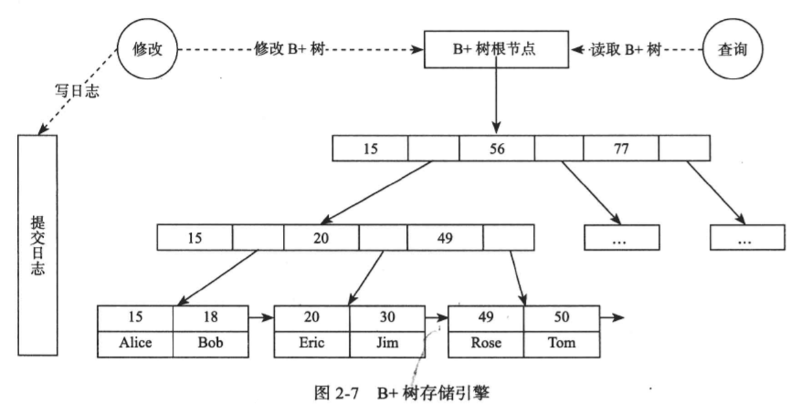

# innode

InnoDB的并发控制，锁，事务模型

[InnoDB并发如此高，原因竟然在这 架构师之路](https://mp.weixin.qq.com/s?__biz=MjM5ODYxMDA5OQ==&mid=2651961444&idx=1&sn=830a93eb74ca484cbcedb06e485f611e&chksm=bd2d0db88a5a84ae5865cd05f8c7899153d16ec7e7976f06033f4fbfbecc2fdee6e8b89bb17b&scene=21#wechat_redirect)

[innodb-locking](https://dev.mysql.com/doc/refman/5.7/en/innodb-locking.html)

root数据常驻内存

Treenode

isRoot()
pre
next
Children[]
isLeaf()

推荐的书籍太多了。除了几本业内的神书外，姜老师的书也非常推荐大家食用，还有就是阿里的数据库月报。

http://dimitrik.free.fr/blog/index.html

B+树 java实现
github.com/edidada/testalgorithm

所有的树结构都有Node
B+树
插入 更新 删除 查找效率平衡

innodb默认的页大小是16kb

各种索引实现

组合索引
