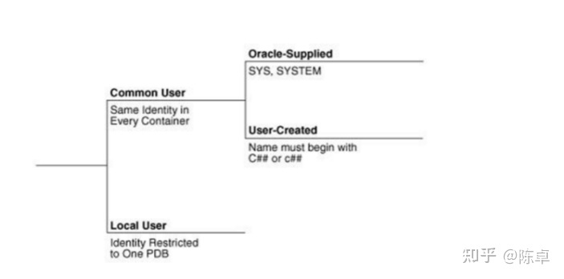

# oracle

-- 查看当前密码策略 SELECT * FROM dba_profiles WHERE profile = 'DEFAULT' AND resource_name = 'PASSWORD_LIFE_TIME'; 
-- 修改密码永不过期 ALTER PROFILE DEFAULT LIMIT PASSWORD_LIFE_TIME UNLIMITED;

https://sqlfiddle.com/


ifnull()类似的函数，有吗？
豆瓣

case
  when xxx isnull or xxx = '' then
    0
  else
    1
end as yyy

https://docs.oracle.com/en/database/oracle/oracle-database/19/sqlrf/Data-Types.html#GUID-1BABC478-FB47-4962-9B0C-8B8BD059E733

“两地三中心”是中国人民银行在2002年提出、2004年开始逐步实施的有关央行系统数据中心布局的战略部署，也被称为“一主两备”或“一个同城加两个异地”。它是指在北京建立两个数据中心，同时在天津和上海各建立一个数据中心。
在这个方案中，北京的两个数据中心采用双活模式，天津和上海的数据中心则采用异步方式（近同步）复制北京的数据，但不对用户开放。这样做的目的是保证当任何一个地方发生灾难时，其他的地方还可以对外提供服务。
这个方案的实施得到了花旗银行的支持。花旗银行的现金管理平台采用了Oracle真正应用集群（RAC）来整合位于纽约和伦敦的两个数据中心，并使用Oracle Data Guard作为第三点故障切换。这种多点集群技术可以提供更高的可用性，使系统在遇到故障时能够自动进行切换，从而最大限度地减少了系统的停机时间。


Oracle sql merge 语法

Oracle SQL中的MERGE语句用于将一个表的数据合并到另一个表中。它的基本语法如下：

```sql
MERGE INTO 目标表 AS T1
USING 源表 AS T2
ON (T1.匹配条件 = T2.匹配条件)
WHEN MATCHED THEN
    UPDATE SET T1.列名1 = T2.列名1, T1.列名2 = T2.列名2, ...
WHEN NOT MATCHED THEN
    INSERT (列名1, 列名2, ...)
    VALUES (T2.列名1, T2.列名2, ...);
```

其中，`目标表`是要更新或插入数据的表，`源表`是包含要合并数据的另一个表。`匹配条件`是两个表中用于匹配的列。`WHEN MATCHED`部分表示当匹配成功时，需要更新的目标表中的列值；`WHEN NOT MATCHED`部分表示当匹配失败时，需要插入到目标表中的新列值。


Oracle中的Service_name和SID都是用于标识数据库实例的参数，但它们之间存在一些区别。首先，Service_name是在Oracle 8i版本中引入的。在8i之前，使用SID来表示一个数据库实例。但在Oracle的并行环境中，一个数据库可以有多个实例，这意味着需要为每个实例设置一个网络服务名，导致设置变得繁琐。为了简化并行环境中的设置，引入了Service_name。具体来说，ServiceName方式是Oracle推荐的。对于集群来说，每个节点的SID可能不一致，但ServiceName是一致的，包含所有节点。而SID方式是我们在实际部署时经常使用的连接方式，其格式为：jdbc:oracle:thin:@<地址：端口号：SID。
简而言之，SID是数据库的一个实例，一个数据库可以有多个SID；而Service_name对应数据库，一个数据库也可以对应多个Service_name。在选择使用哪一种方式时，需要根据实际的应用场景和需求来决定。

还是很有希望的，Oracle现在已经是屎山了。我记得邓侃从国外回来的时候他们那边就已经新代码铺旧代码，谁都不敢轻易改了。不过oracle的特性还是很强，估计当前开源的这批关系型数据库连oralce 10G的特性都没有完全实现。不过那时候我最喜欢看的还是oralce有个专栏叫做ask tom，他们的VP讲oracle的一些功能细节实现真的很棒。

Oracle公司的"Ask Tom"专栏是一个非常受欢迎的技术问答栏目，由Oracle公司的副总裁Tom Kyte主持。Tom Kyte是Oracle公司的一位资深技术专家，拥有多年的数据库开发经验，对Oracle数据库的内部实现和最佳实践有着深入的了解。
在"Ask Tom"专栏中，Tom Kyte会回答用户提出的各种关于Oracle数据库的问题，内容包括性能优化、SQL调优、数据结构设计等方面。他的回答通常非常详细，不仅会解释问题的原因，还会给出具体的解决方案和代码示例。
Tom Kyte的回答经常被开发者们视为权威性的解答，因为他对Oracle数据库的了解非常深入，并且在实际应用中也有着丰富的经验。他的回答往往能够帮助开发者们更好地理解和使用Oracle数据库，提高应用程序的性能和稳定性。
总的来说，"Ask Tom"专栏是Oracle公司的一个非常有价值的资源，为开发者们提供了一个与专家交流的平台，帮助他们解决在实际开发中遇到的问题。

Tom Kyte是Oracle公司的一位副总裁，也是一位资深的技术专家和作家。他在数据库和软件开发领域有着丰富的经验，尤其擅长Oracle数据库的开发和优化。
Tom Kyte在Oracle公司担任多个职务，包括Oracle数据库开发团队的成员、Oracle支持团队的负责人、以及Oracle大学的教师。他对Oracle数据库的内部实现和最佳实践有着深入的了解，经常在全球范围内的技术会议上发表演讲。
除了"Ask Tom"专栏外，Tom Kyte还撰写了多本关于Oracle数据库和SQL的书籍，其中包括《Expert Oracle Database Architecture》、《Effective Oracle by Design》等。这些书籍被广大开发者视为权威性的参考资料，帮助他们更好地理解和使用Oracle数据库。
总的来说，Tom Kyte是一位备受尊重的技术专家，他的知识和经验对Oracle数据库的开发和优化领域产生了深远的影响。

oracle 需要手动提交事务

testoraclemybatis
资深dba 专家型dba推荐的学习Oracle的资料
https://dbaplus.cn/news-10-1475-1.html
https://dbaplus.cn/news-10-1475-1.html
https://dbaplus.cn/news-10-1475-1.html

Oracle 返回id
https://blog.csdn.net/mlsama/article/details/106690730

### oracle 11g docker安装

Oracle Database 11g Enterprise Edition Release 11.2.0.1.0 - 64bit Production

registry.aliyuncs.com/helowin/oracle_11g

【Docker】拉取Oracle 11g镜像配置 - OLIVER_QIN - 博客园.mhtml
https://www.cnblogs.com/OliverQin/p/9765808.html

dell刀片服务器

docker镜像

navicat连接oracle，服务名：helowinXDB
登录服务器
oracle

root


设置环境变量

sqlplus登录

sys system默认密码无

新建账户ETS，密码ETS，字母大写


wdidada账户 lock解除
alter user wdidada account unlock;
alter user wdidada identified by wdidada;
alter user sys identified by sys;
alter user system identified by system;
https://www.jb51.net/article/118365.htm


### Oracle新建表

先选择数据库
数据库操作可以用Database Configuration Assistant

选择或者新建表空间

默认表空间
TEMP
USER


```sql
CREATE TABLE "tb_user" (
  "ID" NUMBER(24,0) VISIBLE NOT NULL,
  "user_name" VARCHAR2(255 BYTE) VISIBLE,
  "password" VARCHAR2(255 BYTE) VISIBLE,
  "name" VARCHAR2(255 BYTE) VISIBLE,
  "age" NUMBER(3,0) VISIBLE,
  "sex" NUMBER(3,0) VISIBLE,
  "birthday" DATE VISIBLE,
  "created" DATE VISIBLE,
  "updated" DATE VISIBLE
)
LOGGING
NOCOMPRESS
PCTFREE 10
INITRANS 1
STORAGE (
  INITIAL 65536 
  NEXT 1048576 
  MINEXTENTS 1
  MAXEXTENTS 2147483645
  BUFFER_POOL DEFAULT
)
PARALLEL 1
NOCACHE
DISABLE ROW MOVEMENT
;
```

执行之后表不存在？
存在，但是查看的慢

https://blog.csdn.net/weixin_39559750/article/details/111490430


### Oracle Java代码仓库

https://gitee.com/edidada/testoracle


### Oracle Win 10电脑关闭和启动
https://blog.csdn.net/weixin_44291381/article/details/125160942

listener.ora tnsnames.ora
这两个文件ip修改

OracleOraDB12Home2TNSListener
OracleServiceDD
OracleServiceORCL
这个服务

备注：TNSListener 这个服务没启动，连接不上


Oracle ASM神书《拨云见日 解密Oracle ASM内核》

ui工具 oracle developer 自带的

idea datasource

自增 存储过程
int 没有 只有number
datetime -> date


oracle 12c 2013年6月发布

Oracle Database 19c 


问题：Oracle数据库创建数据库

方式之一：Database Configuration Assistant创建数据库

Oracle 12C 创建用户以c##开头
https://blog.csdn.net/songpeiying/article/details/82894922

Oracle 12C引入了CDB（Container Database数据库容器）与PDB（Pluggable Database插拔数据库）的新特性


Common User是指在每个容器中都存在的用户


```sql
create table C##TEST01.Users(id  number(3) primary key,name varchar2(20),email varchar2(20),country varchar2(20),password varchar2(20));
INSERT INTO C##TEST01.Users (id, name, email, country, password) VALUES (1, 'Pankaj', 'pankaj@apple.com', 'India', 'pankaj123');
INSERT INTO C##TEST01.Users (id, name, email, country, password) VALUES (4, 'David', 'david@gmail.com', 'USA', 'david123');
INSERT INTO C##TEST01.Users (id, name, email, country, password) VALUES (5, 'Raman', 'raman@google.com', 'UK', 'raman123');
commit;
```





### book

- Oracle Database 12c完全参考手册  第7版.pdf
- Oracle 12c数据库应用与开发 https://www.zhihu.com/pub/reader/119582341/chapter/1183441714831908864

表navicate上
所有者
表空间


https://github.com/edidada/testoracle

lsnrctl status
tnsping orcl

D:\Oracle\DataBase\app\edidada\product\12.1.0\dbhome_1\NETWORK\ADMIN
路径下三个文件sqlnet.ora listener.ora tnsnames.ora


oracle数据库tns配置方法详解
https://www.jb51.net/article/44668.htm
TNS是Oracle Net的一部分，专门用来管理和配置Oracle数据库和客户端连接的一个工具，在大多数情况下客户端和数据库要通讯，必须配置TNS，当然在少数情况下，不用配置TNS也可以连接Oracle数据库，比如通过JDBC。如果通过TNS连接Oracle，那么客户端必须安装Oracle client程序。


使用tcp.validnode_checking允许、限制机器访问数据库
https://www.cnblogs.com/lcword/p/8232066.html

https://blog.csdn.net/demonson/article/details/39506215

tnsping 192.168.0.104
TNS Ping Utility for 64-bit Windows: Version 12.1.0.2.0 - Production on 02-4月 -2021 21:37:09
Copyright (c) 1997, 2014, Oracle.  All rights reserved.
已使用的参数文件:
D:\Oracle\DataBase\app\edidada\product\12.1.0\dbhome_1\network\admin\sqlnet.ora
已使用 EZCONNECT 适配器来解析别名
尝试连接 (DESCRIPTION=(CONNECT_DATA=(SERVICE_NAME=))(ADDRESS=(PROTOCOL=TCP)(HOST=192.168.0.104)(PORT=1521)))
TNS-12541: TNS: 无监听程序


windows 防火墙开放端口访问
https://blog.csdn.net/weixin_43465312/article/details/102510619


刚装的Oracle 12c  访问 https://localhost:5500/em/login 使用 system 登录 报错 （权限/口令错误）

右键计算机 ->管理 -> 服务 ，右击名称 输入O 弹出以O开头的服务名称 ,找到 OracleJobSchedulerORCL
启动它。 再登录就OK了。


https://localhost:5500/em


在环境变量中把ORACLE_HOME 设置成D:\Oracle\DataBase\app\edidada\product\12.1.0\dbhome_1

netstat -an


windows服务
OracleOraDB12Home2TNSListener


如何实现Oracle的监听（listener）多个IP地址
https://blog.csdn.net/funnyfu0101/article/details/51029674

oracle工具
oracle net namager


https://blog.csdn.net/weixin_29888579/article/details/114017404

Oracle Database Express Edition (XE) Release 18.4.0.0.0 (18c)
https://www.oracle.com/database/technologies/xe-downloads.html

Linux on System z (64-bit)
HP-UX ia64
IBM AIX power
Oracle Solaris (SPARC systems, 64-bit)
Linux x86-64
Microsoft Windows x64 (64-bit)

20191212 搞Oracle 12

jdbc:oracle:thin:@192.168.3.98:1521:orcl
jdbc:表示采用jdbc方式连接数据库
oracle:表示连接的是oracle数据库
thin:表示连接时采用thin模式(oracle中有两种模式)

jdbc:oralce:thin:是一个jni方式的命名

@表示地址
1521和orcl表示端口和数据库名

@192.168.3.98:1521:orcl整个是一块
也就是说是这样[jdbc]:[oracle]:[thin]:[@192.168.3.98:1521:orcl]

二、

oracle的jdbc连接方式:oci和thin

oci和thin是Oracle提供的两套Java访问Oracle数据库方式。
thin是一种瘦客户端的连接方式，即采用这种连接方式不需要安装oracle客户端,只要求classpath中包含jdbc驱动的jar包就行。thin就是纯粹用Java写的ORACLE数据库访问接口。
oci是一种胖客户端的连接方式，即采用这种连接方式需要安装oracle客户端。oci是Oracle Call Interface的首字母缩写，是ORACLE公司提供了访问接口，就是使用Java来调用本机的Oracle客户端，然后再访问数据库，优点是速度 快，但是需要安装和配置数据库。
https://www.cnblogs.com/qingxinblog/p/4043173.html


Oracle 服务名/实例名，Service_name 和Sid的区别
Service Name

Service_name 和Sid的区别
Service_name：该参数是由oracle8i引进的。
在8i以前，使用SID来表示标识数据库的一个实例，但是在Oracle的并行环境中，一个数据库对应多个实例，这样就需要多个网络服务名，设置繁琐。为了方便并行环境中的设置，引进了Service_name参数，该参数对应一个数据库，而不是一个实例，而且该参数有许多其它的好处。


oracle 查看用户、权限、角色命令
https://blog.csdn.net/nature_fly088/article/details/8504823


https://blog.csdn.net/make_zhf/article/details/70154160


/oradata/TEST30/APPADMIN_TEMP_01.dbf

TEST_01.dbf
D:\Oracle\DataBase\app\edidada\oradata\orcl\


在Maven仓库中添加Oracle JDBC驱动
https://www.cnblogs.com/leiOOlei/p/3380568.html


cd/d D:\Oracle\DataBase\app\edidada\product\12.1.0\dbhome_1\jdbc\lib\
mvn install:install-file -DgroupId=com.oracle -DartifactId=ojdbc7 -Dversion=12.1.0.2.0 -Dpackaging=jar -DgeneratePom=true -Dfile=ojdbc7.jar
上述命令报错，在powershell中报错，在cmd中先运行cmd之后运行成功
https://stackoverflow.com/questions/6704813/maven-generating-pom-file/11199865#11199865

https://www.e-learn.cn/content/qita/2671944


https://www.oracle.com/database/technologies/jdbc-drivers-12c-downloads.html


Maven引入oracle ojdbc驱动

https://www.jianshu.com/p/70b68ce0dab2


oracle rac集群


https://blog.csdn.net/stevensxiao/article/details/90605443 sample是linux的，不是windows的

https://www.cndba.cn/dave/article/1985


navicate

用户角色

defalut

sysdba

sysoper

https://www.cnblogs.com/sunnyliu357/articles/2301738.html

orcl or（a cl（e 去掉 a e

Oracle RAC

https://docs.oracle.com/database/121/index.htm
https://www.oracletutorial.com/getting-started/oracle-sample-database/
https://www.cnblogs.com/lcword/p/8231860.html
navicate 连接oracle，是自动提交的
OCP/OCA认证考试指南全册:Oracle Database 11g
待正式从业后，再择机通过OCM认证提高自己。
OCA,OCP
现在基本上都是OCP，网上听课，然后线下就近考点考试即可，考试通过可以拿个证书，但是对于有工作经验的人来说好像价值已经不大了，现在ocm都漫天飞了。


在cmd中
C:\Documents and Settings\Administrator>sqlplus/nolog
SQL*Plus: Release 9.2.0.1.0 - Production on 星期四 11月 1 15:14:12 2007
Copyright (c) 1982, 2002, Oracle Corporation. All rightsreserved.
SQL> connect/as sysdba
已连接。

新版本都是云的    19

18

IBM Aix

HP Unix


oracle 12 c，其中c表示cloud


Oracle Database 19*c*


12c
https://www.oracle.com/database/technologies/database12c-win64-downloads.html

关于oracle sql语句查询时表名和字段名要加双引号的问题
https://blog.csdn.net/u011754180/article/details/85097434

1、oracle表和字段是有大小写的区别。oracle默认是大写，如果我们用双引号括起来的就区分大小写，如果没有，系统会自动转成大写。

2、我们在使用navicat使用可视化创建数据库时候，navicat自动给我们加上了“”。


https://docs.oracle.com/database/121/TDDDG/tdddg_dml.htm#TDDDG99941

```SQL
INSERT INTO EMPLOYEES (
  EMPLOYEE_ID,
  FIRST_NAME,
  LAST_NAME,
  EMAIL,
  PHONE_NUMBER,
  HIRE_DATE,
  JOB_ID,
  SALARY,
  COMMISSION_PCT,
  MANAGER_ID,
  DEPARTMENT_ID
)
VALUES (
  10,              -- EMPLOYEE_ID
  'George',        -- FIRST_NAME
  'Gordon',        -- LAST_NAME
  'GGORDON',       -- EMAIL
  '650.506.2222',  -- PHONE_NUMBER
  '01-JAN-07',     -- HIRE_DATE
  'SA_REP',        -- JOB_ID
  9000,            -- SALARY
  .1,              -- COMMISSION_PCT
  148,             -- MANAGER_ID
  80               -- DEPARTMENT_ID
);

```


select username,created from dba_users where created>sysdate-1;


sqlplus system/5Edidada@127.0.0.1:1521/ORCL

sqlplus system/5Edidada@127.0.0.1:1521/ORCL @mksample.sql 5Edidada 5Edidada 5Edidada 5Edidada 5Edidada 5Edidada 5Edidada 5Edidada users temp C:\Users\edidada\Desktop\db-sample-schemas-12.1.0.2\log\ 127.0.0.1:1521/ORCL
sqlplus system/5Edidada@127.0.0.1:1521/ORCL@drop_hr.sql


https://docs.oracle.com/en/database/oracle/oracle-database/12.2/comsc/installing-sample-schemas.html#GUID-1E645D09-F91F-4BA6-A286-57C5EC66321D

https://github.com/oracle/db-sample-schemas/releases/tag/v12.1.0.2

https://www.linuxidc.com/Linux/2017-08/146337.htm

http://www.uwenku.com/question/p-ymnovpyv-ts.html

https://docs.oracle.com/database/121/TDDDG/tdddg_connecting.htm#TDDDG99998

https://docs.oracle.com/database/121/TDDDG/tdddg_dml.htm#TDDDG99941

https://docs.oracle.com/database/121/CNCPT/tablecls.htm#CNCPT010
https://docs.oracle.com/database/121/index.htm#

登录https://localhost:5500/em/shell#/dbhome/show_regions
输入用户名system，密码5Edidada，可以登录


?\demo\db-sample-schemas-12.1.0.2\log\hr_main.log
127.0.0.1:1521/ORCL
D:/Oracle/DataBase/app/edidada/product/12.1.0/dbhome_1/demo/db-sample-schemas-12.1.0.2/human_resources


https://www.jianshu.com/p/7530246fc34b


```
conn as sysdba;
sys 5Edidada
alter session set container=PDBORCL;
DROP USER hr cascade;
CREATE USER hr IDENTIFIED BY "5Edidada";
ALTER USER hr DEFAULT TABLESPACE users;
ALTER USER hr TEMPORARY TABLESPACE temp;
GRANT CREATE SESSION, CREATE VIEW, ALTER SESSION, CREATE SEQUENCE TO hr;
GRANT CREATE SYNONYM, CREATE DATABASE LINK, RESOURCE , UNLIMITED TABLESPACE TO hr;
GRANT execute ON sys.dbms_stats TO hr;


show con_name;
select con_id,dbid,NAME,OPEN_MODE from v$pdbs;


CREATE TABLE employees( employee_id NUMBER(6),first_name VARCHAR2(20),last_name VARCHAR2(25) CONSTRAINT emp_last_name_nn NOT NULL,email VARCHAR2(25),phone_number VARCHAR2(20),hire_date DATE CONSTRAINT emp_hire_date_nn NOT NULL,job_id VARCHAR2(10)	CONSTRAINT     emp_job_nn  NOT NULL    , salary         NUMBER(8,2)    , commission_pct NUMBER(2,2),manager_id NUMBER(6),department_id NUMBER(4),CONSTRAINT emp_salary_min CHECK(salary > 0),CONSTRAINT emp_email_uk UNIQUE(email));

CREATE UNIQUE INDEX emp_emp_id_pk ON employees (employee_id);

ALTER TABLE employeesADD(CONSTRAINTemp_emp_id_pk PRIMARY KEY(employee_id),CONSTRAINT emp_dept_fk FOREIGN KEY(department_id) REFERENCES departments,CONSTRAINT emp_job_fk FOREIGN KEY(job_id) REFERENCES jobs (job_id),CONSTRAINT emp_manager_fk FOREIGN KEY(manager_id) REFERENCES employees);

ALTER TABLE departments ADD ( CONSTRAINT dept_mgr_fk FOREIGN KEY (manager_id)REFERENCES employees (employee_id));

```

登录sqlplus之后，执行sql脚本
@?/demo/hr_create.sql


https://www.jb51.net/article/92720.htm


cmd输入

```
查看oracle的sid叫什么，比如创建数据库的时候，实例名叫“orcl”，那么先手工设置一下oralce的sid，cmd命令窗口中，set ORACLE_SID=orcl（还是大写？？
不然报错：ORA-01034: ORACLE not available ORA-27101


用sqlplus / as sysdba登陆oracle系统，这种登录方式来使用的是操作系统的验证方式，因此，无源需输入用户名和密码即可直接登录进去。

sqlplus sys/orcl as sysdba       //orcl是数据库

select USERNAME, USER_ID  from dba_users;//查看数据库用户 前提是你度是有dba权限的帐号，如sys,system；
```


SYSTEM

SYS

HR       hr用户是个示例用户，是在创建数据库时选中“示例数据库”后产生的，实际上就是模拟一个人力资源部的数据库。

OE

PM

IX

SH

BI


Oracle数据库中sys，system，scott，hr用户的区别
https://blog.csdn.net/zhang18330699274/article/details/55517836


###### sys和system的区别？

存储的数据的重要性不同。所有oracle的数据字典的基表和视图都存放在sys用户中，这些基表和视图对于oracle的运行是至关重要的，由数据库自己维护，任何用户都不能手动更改。sys用户拥有dba,sysdba,sysoper等角色或权限，是oracle权限最高的用户。

　　system用户用于存放次一级的内部数据，如oracle的一些特性或工具的管理信息。system用户拥有普通dba角色权限。


cdb pdb

Oracle 12C引入了CDB与PDB的新特性

cdb容器数据库 pdb可插播数据库 

https://blog.csdn.net/qq877507054/article/details/81209967


新建数据库 C##开头


oracle12c 启用容器数据库之后，创建用户名只能c#[#开头，那怎么才能不适用c#](http://tieba.baidu.com/hottopic/browse/hottopic?topic_id=0&topic_name=开头，那怎么才能不适用c)#开头的用户呢。
如果你去搜索的话，90%的答案会告诉你重新创建数据库实例，然后把创“建为容器数据库”勾选掉。

其实并不用那么麻烦，只需要几部就可以创建不带C##的用户。
1.使用sqlplus 以 DBA 身份链接。 命令：sqlplus / as sysdba
2.在链接成功后，通过命令查看存在的PDB服务。语句：show pdbs;
3.切换到pdb服务上。语句：
alter session set container=pdb服务名;
alter pluggable database pdb服务名 open;
4.尝试创建不带C##的用户吧。

###### Oracle 12C 创建用户以c##开头

https://blog.csdn.net/songpeiying/article/details/82894922

角色


https://zhuanlan.zhihu.com/p/59402726


创建非cdb数据库


打开Database Configuration Assistant

点击“下一步”出现如下界面，在创建数据库的时候将“创建为容器数据库”项取消勾选。

数据库名要大写

TEST202005

5Edidada


ORA-03113:通信通道的文件结尾 解决办法
https://blog.csdn.net/zwk626542417/article/details/39667999


重点

https://blog.csdn.net/wangsimiao118/article/details/78818836


orcl表示数据库名

[oracle连接两种方式thin与oci区别](https://blog.csdn.net/kevin_pso/article/details/54949476)
thin:表示知连接时采用thin模式道(oracle中有两中模式)
Java连接Oracle两种方式thin与oci区别
1 从使用上来说，oci必须在客户机上安装oracle客户端或才能连接，而thin就不需要，因此从使用上来讲thin还是更加方便，这也是thin比较常见的原因。 
2 原理上来看，thin是纯java实现tcp/ip的c/s通讯；而oci方式,客户端通过native java method调用c library访问服务端，而这个c library就是oci(oracle called interface)，因此这个oci总是需要随着oracle客户端安装（从oracle10.1.0开始，单独提供OCI Instant Client，不用再完整的安装client） 
3 它们分别是不同的驱动类别，oci是二类驱动， thin是四类驱动，但它们在功能上并无差异。 
4 虽然很多人说oci的速度快于thin，但找了半天没有找到相关的测试报告。


oracle 命令行创建标（也可以用工具创建

https://jingyan.baidu.com/article/948f5924de98add80ef5f952.html


service name 和sid区别

https://www.cnblogs.com/matd/p/11051884.html

service name 该参数的缺省值为Db_name. Db_domain，即等于Global_name。一个数据库可以对应多个Service_name，以便实现更灵活的配置。该参数与SID没有直接关系，即不必Service name 必须与SID一样。Sid是数据库实例的名字，每个实例各不相同。


```
sqlplus查看服务名
查看服务名：

show parameter service

查看实例名：

select * from v$instance;

 查看数据库名：

select name from v$database;

查看数据库用到几个表空间：

select distinct TABLESPACE_NAME from tabs；

```


Oracle 12c 用户密码过期设置的一些问题

https://blog.csdn.net/seagal890/article/details/82716798


https://blog.csdn.net/weixin_39921821/article/details/82720851
oracle11g ORA-01078与LRM-00109 解决方法（详细）
https://blog.csdn.net/qq_15904277/article/details/86521808


新建数据库 ORA-03113: 通信通道的文件结尾

D:\Oracle\DataBase\app\edidada\admin

数据库文件


```
CREATE USER "AAA" IDENTIFIED BY "5Edidada" DEFAULT TABLESPACE "USERS" TEMPORARY TABLESPACE "TEMP";

GRANT "DBA" TO "AAA" WITH ADMIN OPTION;

ALTER USER "AAA" DEFAULT ROLE "DBA";

ALTER USER "AAA" QUOTA UNLIMITED ON "USERS";

GRANT UNLIMITED TABLESPACE TO "AAA" WITH ADMIN OPTION


```


oracle跟mysql区别在哪儿？

https://www.cnblogs.com/ios9/p/8227574.html#_label0


https://blog.csdn.net/qq_41303486/article/details/104452529


ORA-01034: ORACLE not available

https://blog.csdn.net/qq_22498277/article/details/51621863


web管理台

https://localhost:5500/em/shell#/dbhome/show_regions

https://www.cnblogs.com/sunsiyuan/p/8485418.html


Oracle 12c视频教程

[【千锋涛哥】最适合小白入门的Oracle 12c 教程](https://www.bilibili.com/video/BV1d54y197n3?p=10)

Oracle实例

Oracle数据库管理软件运行时占用内存，生成的进程


管理工具


sqlplus     有自己的指令

isqlplus是网页版

navicate

pl/sql

oem 数据库的企业管理功能


oracle账户

本地管理员

在sqlplus上输入用户名system as sysdba         （只输入system不行

密码输入5Edidada

system/5Edidada as sysdba

本地管理员可以不输入密码


disconn 断开

conn     连接

网络用户登录

username/pwd


连接时没有指定数据库，默认连接orcl


连接指定是数据库


### fucntion
sysdate


oracle表空间

https://www.cnblogs.com/fnng/archive/2012/08/12/2634485.html


navicate 15 查看表空间

undo表空间

temperary表空间    Temporary  Tablespaces


oracle 12c自带表空间有哪些？


​     在Oracle 12C之前，实例与数据库是一对一或一对多的关系（RAC）：即一个实例只能与一个数据库相关联，数据库可以被多个实例所加载。而实例与数据库不可能是一对多的关系。

​     当进入Oracle 12C后，实例与数据库可以是一对多的关系。


ORA-12514: TNS:listener does not currently know of service requested in connect descriptor

[oracle 新建数据库dd连接不上](https://stackoverflow.com/questions/10786782/ora-12514-tnslistener-does-not-currently-know-of-service-requested-in-connect-d)


需要切换service name

默认service name是orcl


```sql
select value from v$parameter where name='dd'
```
