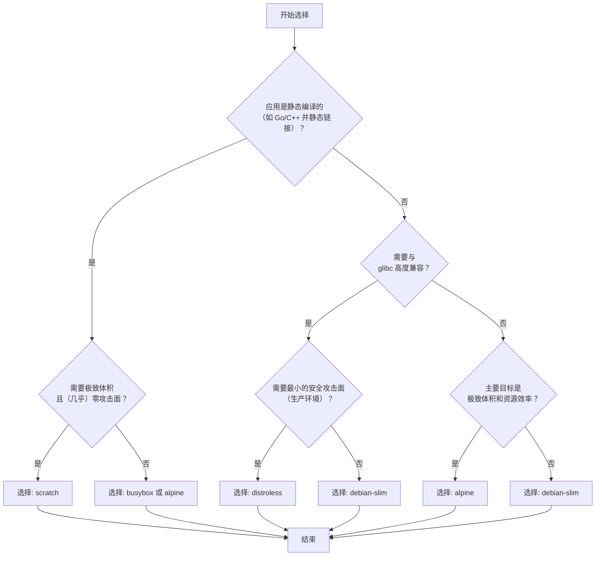

# docker
这是Docker镜像构建中一个非常核心且实用的概念。你提到的那个“精简Linux”有很多种，可以根据需求灵活选择，各有所长。

### 🐳 主流Docker基础镜像对比

| 基础镜像 | 核心特点 | 适用场景 | 注意事项 |
| :--- | :--- | :--- | :--- |
| Alpine | 体积小巧（~5MB），使用 `musl libc` 和 `apk` 包管理器。 | - 绝大多数通用应用：Node.js、Python、Java等微服务。<br>- 对镜像体积要求极高的场景。 | - 兼容性风险：因使用 `musl libc`，与依赖标准 `glibc` 的预编译二进制可能不兼容。 |
| Debian Slim / Ubuntu Minimal | 基于主流发行版的精简版（~30-120MB），使用标准 `glibc` 和 `apt-get` 包管理器。 | - 兼容性优先的项目：需要广泛软件包支持或依赖 `glibc` 的应用。<br>- 生产环境的稳定首选。 | - 体积比Alpine大不少，但带来了更好的兼容性。 |
| Distroless | 极精简（~2-20MB），由Google维护。不含Shell、包管理器等工具。 | - 安全至上的生产环境：无法通过 `docker exec` 进入容器，极大减少攻击面。 | - 调试困难：无法进入容器排查，需依赖应用自身的日志和监控机制。<br>- 适合配合多阶段构建使用。|
| Scratch | 一个空镜像，大小接近0字节，是所有镜像的“基底”。 | - 构建自有基础镜像的起点。<br>- 运行静态编译的二进制文件（如Go、Rust），实现极致体积。 | - 无Shell、无文件系统、无系统库，不可调试。<br>- 只能运行完全不依赖外部库的静态编译程序。 |
| BusyBox | 集成了上百种常用Linux命令的极简工具箱（~1-5MB）。 | - 简易工具型容器或初始化容器。<br>- 需要调试和排错的最小环境。 | - 不是一个完整的Linux发行版，缺少特定系统库，不支持动态链接程序。 |

### 基础镜像选择决策树



### 使用示例（以 `nginx` 为例）

假设我们要自定义一个 `nginx` 镜像，以下是使用不同基础镜像的 `Dockerfile` 示例。

*   Alpine
    ```dockerfile
    FROM nginx:alpine
    COPY ./custom.conf /etc/nginx/conf.d/default.conf
    ```
*   Debian Slim
    ```dockerfile
    FROM nginx:bookworm-slim
    RUN apt-get update && apt-get install -y curl && rm -rf /var/lib/apt/lists/*
    COPY ./custom.conf /etc/nginx/conf.d/default.conf
    ```
*   Distroless
    ```dockerfile
    FROM nginx:latest AS builder
    COPY ./custom.conf /etc/nginx/conf.d/default.conf

    FROM gcr.io/distroless/nginx
    COPY --from=builder /usr/share/nginx/html /usr/share/nginx/html
    COPY --from=builder /etc/nginx/conf.d /etc/nginx/conf.d
    ```
*   Scratch
    `scratch` 不包含操作系统，无法直接运行 `nginx`，必须配合多阶段构建，过程较为复杂，通常不这样使用。

其他通用的 `slim`、`alpine` 版本几乎都可以在 `docker hub` 上找到，比如 `python:3.12-slim`, `node:20-alpine` 等。你可以随时查看官方说明。

### 总结与建议

在Docker的世界里，没有绝对“最好”的基础镜像，只有“最适合”你当前应用场景的选择。了解不同选择的利弊，才是写出优质Dockerfile的关键。

你目前主要是在构建Java（Spring Boot）应用吧，并且部署在私有化K3s环境里。对于你的情况，最推荐、最稳妥的方案是官方 `openjdk` 或 `eclipse-temurin` 镜像的 `-slim` 版本，比如 `eclipse-temurin:17-jre-slim`。它体积适中，兼容性优秀，非常适合作为生产环境的应用镜像。

另外，你之前已经通过 `k3s ctr` 命令导入了很多 `:local` 的镜像，这些很可能是在你的开发机或另一台服务器上用Docker构建之后导出的。这其实也是一种常见的工作流，特别是在网络受限或需要固化环境的情况下。

改用 Rancher Desktop（免费、企业合法、最稳）
直接下载：https://rancherdesktop.io/安装后 禁用 Docker Desktop就能正常构建，不会出现任何商业订阅拦截

docker pull不下载，github codespaces里面拉取，tar文件
左侧右键下载

## 竟品
Podman、nerdctl

对于桌面端，docker也有了可以竞争者，那就是redhat的podman，你可以alise podman=docker，docker有的基础功能podman都有
服务器端，docker由于研发历史较早，加之cs架构，附带了很多功能restart=always功能，docker是才用了一个复杂的宿主机server实现的。这个和kubelet功能重合。docker net和pv管理。docker自带的net类型以及pv管理，对k8s是不需要的，k8s自带net和pv的实现方案。docker拉起用户进程的中间垫片程序过于臃肿，有创建容器的配置经过docker-server，containerd，containerd-shim层层传递和初始化，最终才到runc，用户进程。于是Google实现了一个精简版的cri-o，作为k8s的专属容器引擎。当然，最关键的原因，docker公司在云原生时代，已然成为打工仔，在容器领域的话语权已经被云计算厂商挤压

docker save -o k8s-1.12.3.tar
docker load
service docker start
systemctl
docker 启动日志
service docker status
Docker is not running

## subnet
# 创建一个名为tars的桥接(bridge)虚拟网络，网关172.25.0.1，网段为172.25.0.0
docker network create -d bridge --subnet=172.25.0.0/16 --gateway=172.25.0.1 tars

## docker 私有仓库管理工具
https://github.com/goharbor/harbor

金融场景 docker相比vm，安全性不够

docker run/exec/cp
docker cp contain_id:/file_to_path local_path
docker 　centos 7 'yum update'

Portainer 图形化工具
镜像重新命名
docker tag 3fa112fd3642 oracle:11g
docker exec -it /bin/bash

tars也使用docker部署了

docker linux上是正宗的，Windows macos上是vm

docker run xxx 从镜像中启动一个容器实例

docker ps 运行的container
docker ps -a 所有container
Docker start
docker imgae tag，在网页上查看

[docker](https://jingyan.baidu.com/article/aa6a2c142dc2774c4c19c4ca.html)
C:\Users\Public\Documents\Hyper-V\Virtual hard disks\MobyLinuxVM.vhdx

docker network create hadoop

docker mac windows都是虚拟机
linux使用了cgroup namespace

shutdown -h 10          #计算机将于10分钟后关闭，且会显示在登录用户的当前屏幕中
shutdown -h now       #计算机会立刻关机
shutdown -h 22:22     #计算机会在这个时刻关机
shutdown -r now        #计算机会立刻重启
shutdown -r +10         #计算机会将于10分钟后重启
reboot                           #重启
halt                                #关机
    
当然你如果是centos6.5学过来的，init 0与init 6一样在centos7适用。

docker wordpress
https://www.ruanyifeng.com/blog/2018/02/docker-wordpress-tutorial.html

docker 端口映射
https://www.cnblogs.com/kevingrace/p/9453987.html


轻量级虚拟机
一个项目需要引入docke，可以配置一个DockerFile

coreos竞争

plugin镜像名称 不能包含大写字母

<plugin>
          <groupId>com.spotify</groupId>
          <artifactId>docker-maven-plugin</artifactId>
          <version>1.2.0</version>
          <configuration>
            <!-- 镜像名称 不能包含大写字母-->
            <!--<imageName>${docker.image.prefix}/spring-cloud-producer-curd-withZipkinandAdmin</imageName>-->
            <imageName>${docker.image.prefix}/spring-cloud-producer-curd</imageName>

docker push edidada/spring-cloud-producer-curd-withZipkinandAdmin
invalid reference format: repository name must be lowercase

docker image必须小写

### cgroup

docker的cgroup篇
https://blog.csdn.net/ningyuxuan123/article/details/81981835

Go写的，支持多个系统
docker在原有镜像的基础上构建新的镜像
docker源码已经编译

利用Linux特性
cgroup

```shell

docker search zookeeper
k8s

```

docker打包成镜像
dockerfile

https://github.com/spotify/dockerfile-maven
maven项目打包成docker镜像的工具

[Docker探索系列2之镜像打包与DockerFile](https://www.cnblogs.com/liaojiafa/p/6151768.html)

https://docs.docker.com/develop/develop-images/dockerfile_best-practices/

docker可以根据现有的镜像打包新的镜像
cpp程序 可以直接根据操作系统打包镜像

docker import export

load

docker查看日志
docker logs
docker ip port

输入回车

invoke com.XXXX.media.platform.isomerization.proxy.api.IsomerizationAccessService.access({“prop”: “value”}, 1, “1”)

docker部署image之后，如何登录进去进行操作

docker exec
docker run 和 docker exec 的差异 - 龙凌云端 - 博客园
https://www.cnblogs.com/sparkdev/p/9129334.html

也可以通过 `docker ps -a` 命令查看已经在运行的容器，然后使用容器 ID 进入容器。

`docker exec -it 9df70f9a0714 /bin/bash`

```
docker info
Containers: 11
 Running: 8
 Paused: 0
 Stopped: 3
Images: 10
Server Version: 18.09.2
Storage Driver: overlay2
 Backing Filesystem: extfs
 Supports d_type: true
 Native Overlay Diff: true
Logging Driver: json-file
Cgroup Driver: cgroupfs
Plugins:
 Volume: local
 Network: bridge host macvlan null overlay
 Log: awslogs fluentd gcplogs gelf journald json-file local logentries splunk syslog
Swarm: inactive
Runtimes: runc
Default Runtime: runc
Init Binary: docker-init
containerd version: 9754871865f7fe2f4e74d43e2fc7ccd237edcbce
runc version: 09c8266bf2fcf9519a651b04ae54c967b9ab86ec
init version: fec3683
Security Options:
 seccomp
  Profile: default
Kernel Version: 4.9.125-linuxkit
Operating System: Docker for Mac
OSType: linux
Architecture: x86_64
CPUs: 4
Total Memory: 1.952GiB
Name: linuxkit-025000000001
ID: NSAV:ZK4I:LGUU:O2CR:HL3O:F25E:225E:BTEE:WB64:GJCV:XQJV:WIXB
Docker Root Dir: /var/lib/docker
Debug Mode (client): false
Debug Mode (server): true
 File Descriptors: 93
 Goroutines: 107
 System Time: 2020-08-27T15:01:26.053875352Z
 EventsListeners: 2
HTTP Proxy: gateway.docker.internal:3128
HTTPS Proxy: gateway.docker.internal:3129
Registry: https://index.docker.io/v1/
Labels:
Experimental: false
Insecure Registries:
 127.0.0.0/8
Live Restore Enabled: false
Product License: Community Engine
```

docker 对容器的管理和操作基本都是通过 containerd 完成的

### overlay
1. Overlay 网络
Overlay 技术概述

Overlay 在网络技术领域，指的是一种网络架构上叠加的虚拟化技术模式，其大体框架是对基础网络不进行大规模修改的条件下，实现应用在网络上的承载，并能与其它网络业务分离，并且以基于IP的基础网络技术为主。Overlay 技术是在现有的物理网络之上构建一个虚拟网络，上层应用只与虚拟网络相关。一个Overlay网络主要由三部分组成：

边缘设备：是指与虚拟机直接相连的设备
控制平面：主要负责虚拟隧道的建立维护以及主机可达性信息的通告
转发平面：承载 Overlay 报文的物理网络

当前主流的 Overlay 技术主要有VXLAN, GRE/NVGRE和 STT。这三种二层 Overlay 技术，大体思路均是将以太网报文承载到某种隧道层面，差异性在于选择和构造隧道的不同，而底层均是 IP 转发。如下表所示为这三种技术关键特性的比较。其中VXLAN利用了现有通用的UDP传输，其成熟性高。总体比较，VLXAN技术相对具有优势。

https://blog.csdn.net/cisco_eigrp/article/details/50829035

https://www.zhihu.com/question/24393680


笔者在前文《[RunC 简介](http://www.cnblogs.com/sparkdev/p/9032209.html)》和《[Containerd 简介](http://www.cnblogs.com/sparkdev/p/9063042.html)》中分别介绍了 runC 和 containerd。本文我们将结合 docker 中的其它组件探索 docker 是如何把这些组件组织起来协调工作的。

Docker CLI(docker)   /usr/bin/docker

Dockerd                     /usr/bin/dockerd

Containerd                /usr/bin/docker-containerd

Containerd-shim      /usr/bin/docker-containerd-shim

Runc                           /usr/bin/docker-runc


### containerd


### runc
[第一本Docker书（修订版）](https://book.douban.com/subject/26780404/)
[kubernetes权威指南 : 从Docker到Kubernetes实践全接触（第2版）](https://book.douban.com/subject/26902153/)
[Docker——容器与容器云（第2版）](https://book.douban.com/subject/26894736/)

浙江大学SEL实验室

[Spring Cloud与Docker微服务架构实战](https://book.douban.com/subject/27028228/)
[Docker——容器与容器云](https://book.douban.com/subject/26593175/)
[Docker进阶与实战](https://book.douban.com/subject/26701218/)

华为Docker实践小组 

[Docker源码分析](https://book.douban.com/subject/26581184/)
[Docker开发实践](https://book.douban.com/subject/26432893/)
[Docker容器绑定外部IP和端口](https://www.cnblogs.com/linjiqin/p/8670798.html)


docker run -d -P myfirstapp python app.py 

docker run -d -p 9118:8080 edidada/spring-cloud-eureka


`docker exec -it cfb02f1a32c9  /bin/bash`

https://www.cnblogs.com/quanbisen/p/11483118.html

docker search xxx

不能精确找tag

https://hub.docker.com/_/mysql/tags

docker pull mysql:5.7.42
docker exec -it 7c5f84ada3dc /bin/bash

https://blog.csdn.net/qq_42971035/article/details/127831101

## 提供加速Docker镜像下载的服务
https://www.daocloud.io/mirror

http://f1361db2.m.daocloud.io

## docker windows安装

## 版本version

## 代码仓库

## 源代码编译
