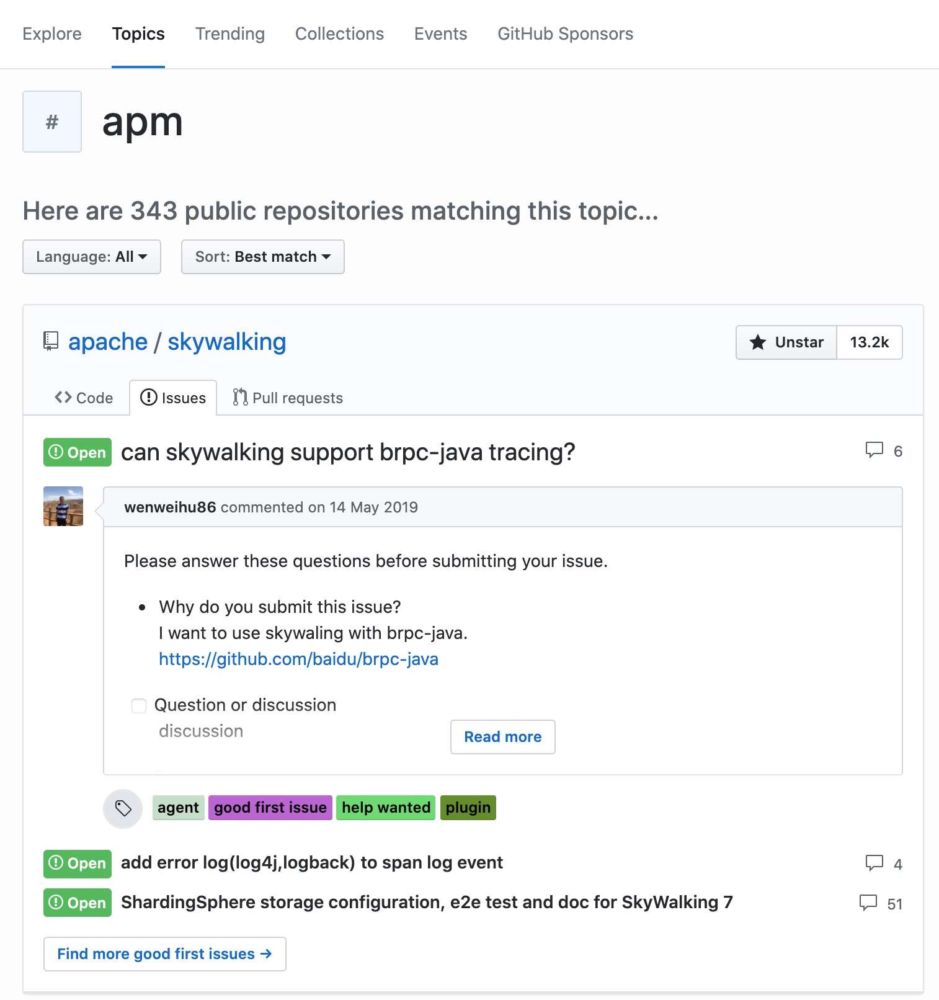

# github

## action
https://docs.github.com/en/actions/using-workflows/workflow-syntax-for-github-actions#choosing-github-hosted-runners

https://docs.github.com/en/actions/using-workflows/workflow-syntax-for-github-actions#jobsjob_idruns-on

### 可选的操作系统
Available GitHub-hosted runner types are:

ubuntu-latest, ubuntu-22.04, ubuntu-20.04
windows-latest, windows-2022, windows-2019
macos-latest, macos-12, macos-11

https://docs.github.com/zh/actions

## Codespaces
GitHub Codespaces于2022年5月正式推出，目前已经完全对外开放。 
github需要配置一堆东西，使用github desktop
使用Codespaces为开发者解决这样的痛点：

为项目设置和维护一个或一组开发工作站。
在“第一次提交”发生之前浪费的时间。
开发工作站之间的配置/工具/设置不一致。
版本控制工具/扩展、调试器和依赖项。
基于个人或团队的设置和自定义。
安全和漏洞。
硬件规格要求。
github添加token，http/https有效，git直接访问

github topic

一、打开IPAddress.com网站，查询下面3个网址对应的IP地址
1. github.com
2. assets-cdn.github.com
3. github.global.ssl.fastly.net

改本地hosts

ipconfig /flushdns

[GitHub 私人private仓库添加成员（协作者Collaborators）](https://blog.csdn.net/chenbetter1996/article/details/82871518)
