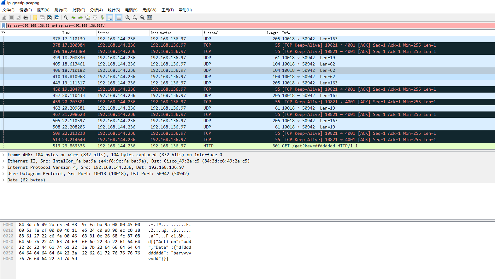

# jgossip


redis cluster 是gossip？

sentinal


redis用到了gossip


一致性是指：各个节点存储的数据完全一致

gossip protocol 最初是由施乐公司帕洛阿尔托研究中心（Palo Alto Research Center）的研究员艾伦·德默斯（Alan Demers）于1987年创造的。

https://www.iteblog.com/archives/2505.html


Gossip协议已经是P2P网络中比较成熟的协议了。Gossip协议的最大的好处是，即使集群节点的数量增加，每个节点的负载也不会增加很多，几乎是恒定的。这就允许Consul管理的集群规模能横向扩展到数千个节点。


Gossip算法又被称为反熵（Anti-Entropy），熵是物理学上的一个概念，代表杂乱无章，而反熵就是在杂乱无章中寻求一致，这充分说明了Gossip的特点：在一个有界网络中，每个节点都随机地与其他节点通信，经过一番杂乱无章的通信，最终所有节点的状态都会达成一致。每个节点可能知道所有其他节点，也可能仅知道几个邻居节点，只要这些节可以通过网络连通，最终他们的状态都是一致的，当然这也是疫情传播的特点。


- **Gossip协议的使用**

Redis 集群是去中心化的，彼此之间状态同步靠 gossip 协议通信，集群的消息有以下几种类型：

- **Meet** 通过「cluster meet ip port」命令，已有集群的节点会向新的节点发送邀请，加入现有集群。
- **Ping** 节点每秒会向集群中其他节点发送 ping 消息，消息中带有自己已知的两个节点的地址、槽、状态信息、最后一次通信时间等。
- **Pong** 节点收到 ping 消息后会回复 pong 消息，消息中同样带有自己已知的两个节点信息。
- **Fail** 节点 ping 不通某节点后，会向集群所有节点广播该节点挂掉的消息。其他节点收到消息后标记已下线。

由于去中心化和通信机制，Redis Cluster 选择了最终一致性和基本可用。

例如当加入新节点时(meet)，只有邀请节点和被邀请节点知道这件事，其余节点要等待 ping 消息一层一层扩散。除了 Fail 是立即全网通知的，其他诸如新节点、节点重上线、从节点选举成为主节点、槽变化等，都需要等待被通知到，也就是Gossip协议是最终一致性的协议。

由于 gossip 协议对服务器时间的要求较高，否则时间戳不准确会影响节点判断消息的有效性。另外节点数量增多后的网络开销也会对服务器产生压力，同时结点数太多，意味着达到最终一致性的时间也相对变长，因此官方推荐最大节点数为1000左右


[gossip redis](https://zhuanlan.zhihu.com/p/92937061)


官方集群版本在Redis3.0才出现，对其稳定性如何，很多公司都不愿做小白鼠，不过事实上经过迭代目前已经到了Redis5.x版本，官方集群版本还是很不错的


实现了服务器层的Sharding分片技术，换句话说官方没有中间层，而是多个服务结点本身实现了分片，当然也可以认为实现sharding的这部分功能被融合到了Redis服务本身中，并没有单独的Sharding模块。


```shell
member:GossipMember{cluster='gossip_cluster', ipAddress='127.0.0.1', port=60001, id='127.0.0.1:60001', state=JOIN}  state: JOIN
五月 31, 2020 7:53:04 下午 net.lvsq.jgossip.core.GossipManager
信息: Starting gossip! cluster[gossip_cluster] ip[127.0.0.1] port[60001] id[127.0.0.1:60001]
```


##### 实现

gossip 协议有多种实现，这里说一个例子当节点启动时，读配置文件，然后向一个 seed 发送信息，进行信息同步，然后开始没秒都随机选择一个 seed 节点来同步信息
1、随机取一个当前活着的节点，并向它发送同步请求
2、向随机一台不可达的机器发送同步请求
3、如果第一步中所选择的节点不是 seed，或者当前活着的节点数少于 seed 数，则向随意一台 seed 发送同步请求

##### 应用

Cassandra
Cassandra 主要是使用 Gossip 完成三方面的功能：
失败检测
动态负载均衡
去中心化的弹性扩展
Consul


gossip分为客户端和service端？不是，对等节点


一直找不到合适的MySQL监控工具，正好听同事无意中说起，Percona在2016年4月发布了一个监控套件，可以同时对多个MySQL、MongoDB实例进行监控。


memberlist是HashiCorp公司开源的*Gossip*库，这个库被consul（也是HashiCorp公司开源的）所引用。 它是SWIM的一个扩展实现。




