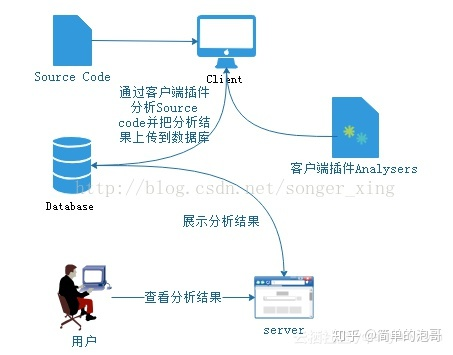

# SonarQube

不能用管理员账户启动sonarqube，因为es不能用管理员账户启动

https://docs.sonarsource.com/sonarqube/8.9/requirements/prerequisites-and-overview/

## sonarqube
历史版本下载
https://www.sonarsource.com/products/sonarqube/downloads/historical-downloads/

参考
代码规范和代码质量管理平台培训.pptx

圈复杂度
圈复杂度(Cyclomatic complexity)是一种代码复杂度的衡量标准，在1976年由Thomas J. McCabe, Sr. 提出。 在软件测试的概念里，圈复杂度用来衡量一个模块判定结构的复杂程度，数量上表现为线性无关的路径条数，即合理的预防错误所需测试的最少路径条数。


没有代码标准
sonar可以通过PMD,CheckStyle,Findbugs等等代码规则检测工具规范代码编写


pmd使用笔记
pmd是一块开源的代码静态分析工具，使用java编写，可以自定义规则来进行自己想要的分析。pmd可以单独使用，也可以作为idea、eclipse的插件使用。它的规则分为xpath规则，和java规则。https://pmd.github.io/

pmd内部工作机制比较简单，大概分为以下几个主要步骤。
1、使用是通过dir参数指定要分析的源码目录，pmd会将要分析的源码文件全部解析成抽象语法树。
2、遍历每一个文件，为每个文件的分析创建一个线程对象pmdrunable放到线程池。
3、针对每个文件根据文件类型，应用指定的规则集里每一条规则。
4、规则里可以根据自己关心的语法树节点类型进行分析处理，比较方便的是支持xpath的方式进行节点查找。
不足之处：
pmd将每个文件独立进行规则匹配，无法做到跨文件的关联分析，或者跨文件的数据流跟踪。
pmd目前主要支持的语言就是java，其他的还有xml、js、velocity模版。一些比较流行的语言比如 PHP go 等是不支持的。 
改进思路：

在进行规则匹配之前加入预处理功能，把所有文件进行预处理分析，比如每个类对其他类的方法的调用关系，将分析结果放到context里，后边的规则可以取出来用。

idea插件，pmd的idea插件目前还有些问题，不能满足需求，可能需要自己重新开发了。

安装后路径在
/Users/fsq/Library/Application Support/IdeaIC2017.2/PMD-Intellij/    mac
C:\Users\Administrator\.IdeaIC2017.3\system\plugins\PMD-Intellij\   windows
源码地址 https://github.com/amitdev/PMD-Intellij  ，自定义的规则，打包到jar文件后放在这个目录，重启idea即可生效。

自定义规则：
pmd将不同的规则放在不同的模块中，比如java的规则在 pmd-java模块中，如果想实现自己的java规则可以将自己的规则放在 pmd-java 模块的代码中，并配置到对应的 xml规则集里，然后将 pmd-java模块重新打包成jar文件，替换掉pmd中的 pmd-java的jar包即可。


sonar-pmd是sonar官方的支持pmd的插件，但是还不支持p3c，需要在pmd插件源码中添加p3c支持(p3c是阿里在pmd基础上根据阿里巴巴开发手册实现了其中的49开发规则)。

https://github.com/jborgers/sonar-pmd


https://github.com/mrprince/sonar-p3c-pmd/wiki/Install


Install puglin
put generate sonar-pmd-plugin-2.6.jar into extensions\plugins
run bin\linux-x86-64\sonar.sh
3.Config
Add new Quality Profiles - "p3c", click "Activate More" button, search keyword "[p3c]", active all rules.


tls版本 7.9  SonarQube requires Java 11 to run
8.9


7/8版本都需要java 11

中文语言包下载地址：https://github.com/SonarQubeCommunity/sonar-l10n-zh/tags 。找到自己版本对应的中文包。


插件是java写的


docker run -d --name sonar -p 9090:9000
 -e ALLOW_EMPTY_PASSWORD=yes
 -e SONARQUBE_DATABASE_USER=sonar
 -e SONARQUBE_DATABASE_NAME=sonar
 -e SONARQUBE_DATABASE_PASSWORD=sonar
 -e SONARQUBE_JDBC_URL="jdbc:mysql://mysql:3306/sonar?useUnicode=true&characterEncoding=utf8&rewriteBatchedStatements=true&useConfigs=maxPerformance&useSSL=false" 


### docker镜像

sonar-pmd是sonar官方的支持pmd的插件，但是还不支持p3c，需要在pmd插件源码中添加p3c支持(p3c是阿里在pmd基础上根据阿里开发手册实现了其中的49开发规则)。

源码下载地址：https://github.com/mrprince/sonar-p3c-pmd 此源码工程已经添加了P3C支持，直接mvn package打包即可。此源码工程已经在pmd插件的默认268条规则上添加了阿里的48条规则，少了一条AvoidManuallyCreateThreadRule．打好jar包后拷贝到sonar的plugins目录下：


https://github.com/SonarSource/sonarqube

AuthorizationDaoTest单元测试
1. 默认支持代码文本格式全为 UTF-8，其他编码可能会产生乱码；
2. 目前支持 C#、C++、Go、Groovy、Java、JavaScript、Lua、PHP、Python、Ruby、TypeScript、Web、XML；
3. 仅保存最近一次分析结果；
4. Pull Request 合并或关闭后将会移除分析结果。


https://github.com/SonarSource/sonarqube/tree/8.9.6.50800


sonarqube不支持Oracle？
sonar
从Sonar7.9版本，不再支持Mysql
sonar tls
sonar_scanner

https://zhuanlan.zhihu.com/p/45411597
https://zhuanlan.zhihu.com/p/37561538
https://www.zhihu.com/answer/2472177310


SonarQube是管理代码质量一个开放平台,可以快速的定位代码中潜在的或者明显的错误
https://docs.sonarqube.org/latest/setup/get-started-2-minutes/
https://docs.sonarqube.org/pages/viewpage.action?pageId=7996665


[代码质量管理平台SonarQube的安装、配置与使用](https://www.cnblogs.com/qiumingcheng/p/7253917.html)


### sonar集成自定义规则
下载p3c插件：https://github.com/caowenliang/sonar-pmd-p3c  （此插件兼容 sonarQube 7.7+ 以上版本，包括目前最新版8.4.2）
执行以下命令：
cd sonar-pmd-p3c
mvn clean install -Dmaven.test.skip=true
 将生成的 sonar-pmd-plugin-3.2.1.jar 包丢到sonarQube的插件目录 /extensions/plugins 即可，然后重新启动服务
https://blog.csdn.net/lu1171901273/article/details/121225962


travis 结合?

[代码质量管理平台SonarQube的安装、配置与使用](https://www.cnblogs.com/qiumingcheng/p/7253917.html)




Sonar 可以集成不同的测试工具，代码分析工具，以及持续集成工具，比如pmd-cpd、checkstyle、findbugs、Jenkins。sonar最大的特点就是插件化，可以根据不同的场景需求进行插件化安装，以Java代码检测为，但同时可以检测Python、C++等多种语言。


sonarqube-9

./bin/linux-x86-64/sonar.sh  start
Starting SonarQube...
Failed to start SonarQube.


Unrecognized option: --add-exports=java.base/jdk.internal.ref=ALL-UNNAMED


sonar启动报错 （sonarqube-9.1.0.47736 跟 java 8 不兼容）


wget https://download.java.net/openjdk/jdk11/ri/openjdk-11+28_linux-x64_bin.tar.gz
tar -xzvf jdk-11.0.14_linux-x64_bin.tar.gz

二、环境变量配置
1、修改环境配置文件

vim /etc/profile
根据需要的Java版本把下面代码加入到配置文件内容中

# Java11环境变量配置
JAVA_HOME=/devtools/java/java11/jdk-11.0.14
PATH=$JAVA_HOME/bin:$PATH
CLASSPATH=$JAVA_HOME/lib
export JAVA_HOME CLASSPATH PATH

# Java8环境变量配置
JAVA_HOME=/devtools/java/java8/jdk1.8.0_321
PATH=$PATH:$JAVA_HOME/bin
CLASSPATH=.:$JAVA_HOME/jre/lib/rt.jar:$JAVA_HOME/lib/dt.jar:$JAVA_HOME/lib/tools.jar
export JAVA_HOME PATH CLASSPATH
2、刷新配置文件使之生效

source /etc/profile


yum install java-11


https://blog.csdn.net/wawa8899/article/details/118027710

sonar支持的数据库
pg
oracle
sqlserver
h2默认
不支持MySQL

106.75.209.6:9000

admin 5Edidada

## docker 安装 sonarqube

ubuntu操作系统

https://docs.docker.com/engine/install/ubuntu/#set-up-the-repository

```
sudo apt-get update
sudo apt-get install ca-certificates curl gnupg
sudo install -m 0755 -d /etc/apt/keyrings
curl -fsSL https://download.docker.com/linux/ubuntu/gpg | sudo gpg --dearmor -o /etc/apt/keyrings/docker.gpg
sudo chmod a+r /etc/apt/keyrings/docker.gpg
echo \
  "deb [arch="$(dpkg --print-architecture)" signed-by=/etc/apt/keyrings/docker.gpg] https://download.docker.com/linux/ubuntu \
  "$(. /etc/os-release && echo "$VERSION_CODENAME")" stable" | \
sudo tee /etc/apt/sources.list.d/docker.list > /dev/null
sudo apt-get update
sudo apt-get install docker-ce docker-ce-cli containerd.io docker-buildx-plugin docker-compose-plugin
sudo docker run hello-world
```


https://docs.sonarsource.com/sonarqube/8.9/try-out-sonarqube/

sudo docker run -d --name sonarqube -e SONAR_ES_BOOTSTRAP_CHECKS_DISABLE=true -p 9000:9000 sonarqube:7.9.5-community


7.9.5-community


SonarQube is starting


http://113.31.107.240:9000/sessions/new?return_to=%2Fprojects


token:
8c01edfee9d89da5b6b27092e599c86c0c421eea

sonar-scanner.bat -D"sonar.projectKey=restcpp" -D"sonar.sources=." -D"sonar.host.url=http://113.31.107.240:9000" -D"sonar.login=8c01edfee9d89da5b6b27092e599c86c0c421eea"

sonar 10 的maven指令 已经废弃了
mvn clean verify sonar:sonar \
  -Dsonar.projectKey=springboothttpserver \
  -Dsonar.projectName='springboothttpserver' \
  -Dsonar.host.url=http://113.31.107.240:9000 \
  -Dsonar.token=sqp_06a845a3cdfbc574c1e541d7aa071c46bff0e027

sonar 7.9
mvn sonar:sonar \
  -Dsonar.projectKey=springmvccurl \
  -Dsonar.host.url=http://106.75.209.6:9000 \
  -Dsonar.login=c32e6db16db6c71e5f187b63444e7721972f511b

mvn sonar:sonar -Dsonar.projectKey=springboothttpserver -Dsonar.host.url=http://106.75.209.6:9000 -Dsonar.login=c32e6db16db6c71e5f187b63444e7721972f511b


```shell
[INFO] --- sonar-maven-plugin:3.7.0.1746:sonar (default-cli) @ springboothttpserver ---
[INFO] User cache: C:\Users\admin\.sonar\cache
[INFO] SonarQube version: 7.9.5
[INFO] Default locale: "zh_CN", source code encoding: "UTF-8"
[WARNING] SonarScanner will require Java 11 to run starting in SonarQube 8.x
[INFO] Load global settings
[INFO] Load global settings (done) | time=3922ms
[INFO] Server id: BF41A1F2-AYoriKh8F_C2AeaWEjrk
[INFO] User cache: C:\Users\admin\.sonar\cache
[INFO] Load/download plugins
[INFO] Load plugins index
[INFO] Load plugins index (done) | time=49ms
[INFO] Load/download plugins (done) | time=1287505ms
[INFO] Process project properties
[INFO] Execute project builders
[INFO] Execute project builders (done) | time=6ms
[INFO] Project key: springboothttpserver
[INFO] Base dir: D:\code_repo\IdeaProjects\springboothttpserver
[INFO] Working dir: D:\code_repo\IdeaProjects\springboothttpserver\target\sonar
[INFO] Load project settings for component key: 'springboothttpserver'
[INFO] Load project settings for component key: 'springboothttpserver' (done) | time=40ms
[INFO] Load quality profiles
[INFO] Load quality profiles (done) | time=81ms
[INFO] Load active rules
[INFO] Load active rules (done) | time=2883ms
[INFO] Indexing files...
[INFO] Project configuration:
[INFO] 38 files indexed
[INFO] 0 files ignored because of scm ignore settings
[INFO] Quality profile for java: Sonar way
[INFO] Quality profile for xml: Sonar way
[INFO] ------------- Run sensors on module springboothttpserver
[INFO] Load metrics repository
[INFO] Load metrics repository (done) | time=32ms
[INFO] Sensor JavaSquidSensor [java]
[INFO] Configured Java source version (sonar.java.source): 8
[INFO] JavaClasspath initialization
[INFO] JavaClasspath initialization (done) | time=32ms
[INFO] JavaTestClasspath initialization
[INFO] JavaTestClasspath initialization (done) | time=7ms
[INFO] Java Main Files AST scan
[INFO] 36 source files to be analyzed
[INFO] Load project repositories
[INFO] Load project repositories (done) | time=28ms
[INFO] 36/36 source files have been analyzed
[WARNING] Classes not found during the analysis : [javax.annotation.meta.When]
[INFO] Java Main Files AST scan (done) | time=4996ms
[INFO] Java Test Files AST scan
[INFO] 1 source files to be analyzed
[INFO] 1/1 source files have been analyzed
[INFO] Java Test Files AST scan (done) | time=105ms
[INFO] Sensor JavaSquidSensor [java] (done) | time=6243ms
[INFO] Sensor JaCoCo XML Report Importer [jacoco]
[INFO] Sensor JaCoCo XML Report Importer [jacoco] (done) | time=4ms
[INFO] Sensor SurefireSensor [java]
[INFO] parsing [D:\code_repo\IdeaProjects\springboothttpserver\target\surefire-reports]
[INFO] Sensor SurefireSensor [java] (done) | time=2ms
[INFO] Sensor JaCoCoSensor [java]
[INFO] Sensor JaCoCoSensor [java] (done) | time=2ms
[INFO] Sensor JavaXmlSensor [java]
[INFO] 1 source files to be analyzed
[INFO] Sensor JavaXmlSensor [java] (done) | time=247ms
[INFO] 1/1 source files have been analyzed
[INFO] Sensor HTML [web]
[INFO] Sensor HTML [web] (done) | time=21ms
[INFO] Sensor XML Sensor [xml]
[INFO] 1 source files to be analyzed
[INFO] 1/1 source files have been analyzed
[INFO] Sensor XML Sensor [xml] (done) | time=168ms
[INFO] ------------- Run sensors on project
[INFO] Sensor Zero Coverage Sensor
[INFO] Sensor Zero Coverage Sensor (done) | time=71ms
[INFO] Sensor Java CPD Block Indexer
[INFO] Sensor Java CPD Block Indexer (done) | time=95ms
[INFO] SCM provider for this project is: git
[INFO] 38 files to be analyzed
[INFO] 38/38 files analyzed
[INFO] 16 files had no CPD blocks
[INFO] Calculating CPD for 20 files
[INFO] CPD calculation finished
[INFO] Analysis report generated in 199ms, dir size=227 KB
[INFO] Analysis report compressed in 347ms, zip size=111 KB
[INFO] Analysis report uploaded in 137ms
[INFO] ANALYSIS SUCCESSFUL, you can browse http://113.31.107.240:9000/dashboard?id=springboothttpserver
[INFO] Note that you will be able to access the updated dashboard once the server has processed the submitted analysis report
[INFO] More about the report processing at http://113.31.107.240:9000/api/ce/task?id=AYoro7zPF_C2AeaWEl0K
[INFO] Analysis total time: 15.667 s
[INFO] ------------------------------------------------------------------------
[INFO] BUILD SUCCESS
[INFO] ------------------------------------------------------------------------
[INFO] Total time:  25:55 min
[INFO] Finished at: 2023-08-25T15:41:05+08:00
[INFO] ------------------------------------------------------------------------

Process finished with exit code 0
```

mvn sonar:sonar \
  -Dsonar.projectKey=erp-fi \
  -Dsonar.host.url=http://113.31.107.240:9000 \
  -Dsonar.login=8c01edfee9d89da5b6b27092e599c86c0c421eea


```shell
[INFO] --- sonar-maven-plugin:3.7.0.1746:sonar (default-cli) @ erp-fi ---
[INFO] User cache: C:\Users\admin\.sonar\cache
[INFO] SonarQube version: 7.9.5
[INFO] Default locale: "zh_CN", source code encoding: "UTF-8"
[WARNING] SonarScanner will require Java 11 to run starting in SonarQube 8.x
[INFO] Load global settings
[INFO] Load global settings (done) | time=163ms
[INFO] Server id: BF41A1F2-AYoriKh8F_C2AeaWEjrk
[INFO] User cache: C:\Users\admin\.sonar\cache
[INFO] Load/download plugins
[INFO] Load plugins index
[INFO] Load plugins index (done) | time=70ms
[INFO] Load/download plugins (done) | time=94ms
[INFO] Process project properties
[INFO] Execute project builders
[INFO] Execute project builders (done) | time=7ms
[INFO] Project key: erp-fi
[INFO] Base dir: D:\code_repo\IdeaProjects\putongjm-onlinepay\erp-fi
[INFO] Working dir: D:\code_repo\IdeaProjects\putongjm-onlinepay\erp-fi\target\sonar
[INFO] Load project settings for component key: 'erp-fi'
[INFO] Load project settings for component key: 'erp-fi' (done) | time=44ms
[INFO] Load quality profiles
[INFO] Load quality profiles (done) | time=125ms
[INFO] Load active rules
[INFO] Load active rules (done) | time=2599ms
[INFO] Indexing files...
[INFO] Project configuration:
[INFO] 855 files indexed
[INFO] 0 files ignored because of scm ignore settings
[INFO] Quality profile for java: Sonar way
[INFO] Quality profile for xml: Sonar way
[INFO] ------------- Run sensors on module ERP::FI
[INFO] Load metrics repository
[INFO] Load metrics repository (done) | time=26ms
[INFO] Sensor JavaSquidSensor [java]
[INFO] Configured Java source version (sonar.java.source): 8
[INFO] JavaClasspath initialization
[INFO] JavaClasspath initialization (done) | time=10ms
[INFO] JavaTestClasspath initialization
[INFO] JavaTestClasspath initialization (done) | time=9ms
[INFO] Java Main Files AST scan
[INFO] 766 source files to be analyzed
[INFO] Load project repositories
[INFO] Load project repositories (done) | time=311ms
[INFO] 125/766 files analyzed, current file: src/main/java/com/ykcloud/soa/erp/fi/dao/FiMoveWeightingCostDao.java
[INFO] 234/766 files analyzed, current file: src/main/java/com/ykcloud/soa/erp/fi/dto/FiExportSummaryDtlDTO.java
[INFO] 357/766 files analyzed, current file: src/main/java/com/ykcloud/soa/erp/fi/entity/FI_BL_SUP_BILL_PRE_SET_DTL.java
[INFO] 449/766 files analyzed, current file: src/main/java/com/ykcloud/soa/erp/fi/entity/FI_SOLIDIFIED_SUPPLY_ACCOUNT_DAILY.java
[INFO] 566/766 files analyzed, current file: src/main/java/com/ykcloud/soa/erp/fi/jiameng/service/impl/JMFiRecOrderServiceImpl.java
[INFO] 603/766 files analyzed, current file: src/main/java/com/ykcloud/soa/erp/fi/service/impl/FiBalanceFuncServiceImpl.java
[INFO] 621/766 files analyzed, current file: src/main/java/com/ykcloud/soa/erp/fi/service/impl/FiBlSupPayFundServiceImpl.java
[INFO] 639/766 files analyzed, current file: src/main/java/com/ykcloud/soa/erp/fi/service/impl/FiReportServiceImpl.java
[INFO] 654/766 files analyzed, current file: src/main/java/com/ykcloud/soa/erp/fi/service/impl/FiVoucherManageServiceImpl.java
[INFO] 766/766 source files have been analyzed
[INFO] Java Main Files AST scan (done) | time=95855ms
[INFO] Java Test Files AST scan
[INFO] 88 source files to be analyzed
[INFO] 88/88 source files have been analyzed
[INFO] Java Test Files AST scan (done) | time=2217ms
[INFO] Sensor JavaSquidSensor [java] (done) | time=98815ms
[INFO] Sensor JaCoCo XML Report Importer [jacoco]
[INFO] Sensor JaCoCo XML Report Importer [jacoco] (done) | time=4ms
[INFO] Sensor SurefireSensor [java]
[INFO] parsing [D:\code_repo\IdeaProjects\putongjm-onlinepay\erp-fi\target\surefire-reports]
[INFO] Sensor SurefireSensor [java] (done) | time=2ms
[INFO] Sensor JaCoCoSensor [java]
[INFO] Sensor JaCoCoSensor [java] (done) | time=1ms
[INFO] Sensor JavaXmlSensor [java]
[INFO] 1 source files to be analyzed
[INFO] Sensor JavaXmlSensor [java] (done) | time=142ms
[INFO] Sensor HTML [web]
[INFO] 1/1 source files have been analyzed
[INFO] Sensor HTML [web] (done) | time=12ms
[INFO] Sensor XML Sensor [xml]
[INFO] 1 source files to be analyzed
[INFO] Sensor XML Sensor [xml] (done) | time=122ms
[INFO] 1/1 source files have been analyzed
[INFO] ------------- Run sensors on project
[INFO] Sensor Zero Coverage Sensor
[INFO] Sensor Zero Coverage Sensor (done) | time=1002ms
[INFO] Sensor Java CPD Block Indexer
[INFO] Sensor Java CPD Block Indexer (done) | time=1302ms
[INFO] SCM provider for this project is: git
[INFO] 1 files to be analyzed
[INFO] 0/1 files analyzed
[WARNING] Missing blame information for the following files:
[WARNING]   * pom.xml
[WARNING] This may lead to missing/broken features in SonarQube
[INFO] 133 files had no CPD blocks
[INFO] Calculating CPD for 633 files
[INFO] CPD calculation finished
[INFO] Analysis report generated in 2463ms, dir size=13 MB
[INFO] Analysis report compressed in 5022ms, zip size=4 MB
[INFO] Analysis report uploaded in 806ms
[INFO] ANALYSIS SUCCESSFUL, you can browse http://113.31.107.240:9000/dashboard?id=erp-fi
[INFO] Note that you will be able to access the updated dashboard once the server has processed the submitted analysis report
[INFO] More about the report processing at http://113.31.107.240:9000/api/ce/task?id=AYorrGFNF_C2AeaWEl0M
[INFO] Analysis total time: 2:00.407 s
[INFO] ------------------------------------------------------------------------
[INFO] BUILD SUCCESS
[INFO] ------------------------------------------------------------------------
[INFO] Total time:  02:06 min
[INFO] Finished at: 2023-08-25T15:50:34+08:00
[INFO] ------------------------------------------------------------------------

Process finished with exit code 0

```

#### sonar与jenkins的集成

### SonarScanner进行扫描
版本兼容
4.7

SonarScanner will require Java 11 to run starting in SonarQube 8.x

https://docs.sonarqube.org/8.9/analysis/scan/sonarscanner/


https://blog.csdn.net/nikeylee/article/details/117367744


## sonarqube与IDEA sonalint插件
https://plugins.jetbrains.com/plugin/7973-sonarlint

idea sonalint插件
https://blog.csdn.net/zengmingen/article/details/106473012

pom.xml增加
```xml
    <build>
        <plugins>
            <plugin>
                <groupId>org.springframework.boot</groupId>
                <artifactId>spring-boot-maven-plugin</artifactId>
            </plugin>
            <plugin>
                <groupId>org.sonarsource.scanner.maven</groupId>
                <artifactId>sonar-maven-plugin</artifactId>
                <version>3.7.0.1746</version>
            </plugin>
        </plugins>
    </build>
```

idea maven插件 sonar执行

Downloading analyzer 'php'
Downloading analyzer 'ruby'
Downloading analyzer 'javascript'
Downloading analyzer 'kotlin'
Downloading analyzer 'python'


Plugin 'secrets' embeds dependencies. This will be deprecated soon. Plugin should be updated.

```
[SYNC] Downloading plugin 'sonar-scala-plugin-1.9.0.3429.jar'
Downloaded 'sonarscala' in 125036ms
[SYNC] Downloading plugin 'sonar-xml-plugin-2.5.0.3376.jar'
Downloaded 'xml' in 20056ms
[SYNC] Synchronizing analyzer configuration for project 'dsfasdfasd'
Downloaded settings in 602ms
[SYNC] Fetching rule set for language 'java' from profile 'AYCZOR_MC86mYA7mcuyI'
[SYNC] Fetching rule set for language 'js' from profile 'AYCZORi3C86mYA7mcuK1'
[SYNC] Fetching rule set for language 'kotlin' from profile 'AYCZORDxC86mYA7mcuCD'
[SYNC] Fetching rule set for language 'php' from profile 'AYCZOSUvC86mYA7mcvDs'
[SYNC] Fetching rule set for language 'py' from profile 'AYCZORsQC86mYA7mcuTB'
[SYNC] Fetching rule set for language 'ruby' from profile 'AYCZORxTC86mYA7mcuWl'
[SYNC] Fetching rule set for language 'scala' from profile 'AYCZORADC86mYA7mct-w'
[SYNC] Fetching rule set for language 'ts' from profile 'AYCZOSvBC86mYA7mcvYH'
[SYNC] Fetching rule set for language 'web' from profile 'AYCZOSHUC86mYA7mcu6U'
[SYNC] Fetching rule set for language 'xml' from profile 'AYCZOSL5C86mYA7mcu7k'
[SYNC] Synchronizing project branches for project 'dsfasdfasd'
Plugin 'secrets' embeds dependencies. This will be deprecated soon. Plugin should be updated.
Clearing all issues because binding was updated
Using connection '106.75.209.6' for project 'dsfasdfasd'
Analysing 3 files...
Found 0 issues
Using connection '106.75.209.6' for project 'dsfasdfasd'
Analysing 'A.java'...
Found 0 issues
```


启动sonarqube报错


### 完整报错：
```
ERROR: [1] bootstrap checks failed. You must address the points described in the following [1] lines before starting Elasticsearch.
bootstrap check failure [1] of [1]: max virtual memory areas vm.max_map_count [65530] is too low, increase to at least [262144]
ERROR: Elasticsearch did not exit normally - check the logs at /opt/sonarqube/logs/sonarqube.log
```

原因：由于 SonarQube 使用嵌入式 Elasticsearch，请确保您的 Docker 主机配置符合Elasticsearch 生产模式要求和文件描述符配置。
解决：在 Linux 上，您可以通过在主机上以 root 身份运行以下命令来设置当前会话的推荐值：（调整系统参数）
　　sysctl -w vm.max_map_count=262144
　　sysctl -w fs.file-max=65536
　　ulimit -n 65536
　　ulimit -u 4096

admin
5Edidada

`mvn clean verify sonar:sonar -Dsonar.projectKey=mytestsonarproject -Dsonar.host.url=http://106.75.209.6:9000 -Dsonar.login=9d7d2b7f76ef5353c4834875e6683912cc921daf`


```
 An API incompatibility was encountered while
 executing org.sonarsource.scanner.maven:sonar-maven-plugin:3.7.0.1746:sonar: java.lang.UnsupportedClassVersionError: org/sonar/batch/bootstrapper
/EnvironmentInformation has been compiled by a more recent version of the Java Runtime (class file version 55.0), this version of the Java Runtime
 only recognizes class file versions up to 52.0
```

```
org/sonar/batch/bootstrapper/EnvironmentInformation has been compiled by a more recent version of the Java Runtime (class file version 55.0), this version of the Java Runtime only recognizes class file versions up to 52.0
```

类文件版本号是指 Java 编译器生成的字节码文件的版本。每个 Java 编译器版本都对应一个特定的类文件版本号。在你提到的情况中，`org/sonar/batch/bootstrapper/EnvironmentInformation` 类的类文件版本为 55.0。

Java 类文件版本号的命名规则如下：

- Java SE 1.1 对应类文件版本 45.0
- Java SE 1.2 对应类文件版本 46.0
- Java SE 1.3 对应类文件版本 47.0
- Java SE 1.4 对应类文件版本 48.0
- Java SE 5 对应类文件版本 49.0
- Java SE 6 对应类文件版本 50.0
- Java SE 7 对应类文件版本 51.0
- Java SE 8 对应类文件版本 52.0
- Java SE 9 对应类文件版本 53.0
- Java SE 10 对应类文件版本 54.0
- Java SE 11 对应类文件版本 55.0

因此，类文件版本 55.0 对应于 Java SE 11。这意味着 `org/sonar/batch/bootstrapper/EnvironmentInformation` 类是使用 Java SE 11 编译器编译生成的类文件。

如果你的 Java 运行时环境版本低于类文件版本（例如，你的运行时环境只支持 Java SE 8），则无法加载类文件版本为 55.0 的类，因为该版本超出了运行时环境的兼容范围。

要解决这个问题，你需要确保你的 Java 运行时环境版本与编译生成的类文件版本兼容，或者升级你的 Java 运行时环境以支持更高的类文件版本。详细的解决方法已在之前的回答中提到。

需要将JDK版本更换至 Java 11

## sonar扫面出的提示

注释的代码块
空指针
直接抛出运行时异常

## sonar商业版

