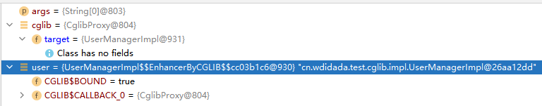

# cglib




github repo

testcglib https://github.com/edidada/testcglib


cglib是 code gen library的缩写

MyBatis使用动态代理

Proxy.newInstance()

Invoke
invoke()


spring非接口使用的代理


cn.wdidada.test.cglib.impl.UserManagerImpl$$EnhancerByBGLiB$$cc

```shell script
toString
method2
method1
method3
filter method3 
filter method1 
mmmmmmmmm
```

- TestCglib
- TestCglibFilter
- GCLibTest

```shell script
Cglib动态代理，监听开始！
调用了删除的方法！
传入参数为 userName: admin
Cglib动态代理，监听结束！
```


CGlib是一个强大的,高性能,高质量的Code生成类库。它常常被用来在运行期扩展Java类与实现Java接口。


CGLIB底层使用了ASM（一个短小精悍的字节码操作框架）来操作字节码生成新的类。除了CGLIB库外，脚本语言（如Groovy和BeanShell）也使用ASM生成字节码。ASM使用类似SAX的解析器来实现高性能。我们不鼓励直接使用ASM，因为它需要对Java字节码的格式足够的了解。


jar包

- cglib-nodep-2.2.jar：使用nodep包不需要关联asm的jar包,jar包内部包含asm的类.
- cglib-2.2.jar：使用此jar包需要关联asm的jar包,否则运行时报错.

基本代码很少，学起来有一定的困难，主要是缺少文档和示例

- net.sf.cglib.core: 底层字节码处理类，他们大部分与ASM有关系。
- net.sf.cglib.transform: 编译期或运行期类和类文件的转换
- net.sf.cglib.proxy: 实现创建代理和方法拦截器的类
- net.sf.cglib.reflect: 实现快速反射和C#风格代理的类
- net.sf.cglib.util: 集合排序等工具类
- net.sf.cglib.beans: JavaBean相关的工具类

net.sf.cglib.proxy.Enhancer

```java
new Enhancer()
setSuperclass()
net.sf.cglib.proxy.Enhancer#create(java.lang.Class, java.lang.Class[], net.sf.cglib.proxy.Callback)
net.sf.cglib.proxy.Enhancer#setCallbacks

net.sf.cglib.proxy.Enhancer#setCallbackFilter
```

net.sf.cglib.proxy.MethodInterceptor 等同于java.lang.reflect.InvocationHandler

```java
public Object intercept(Object obj, Method method, Object[] params,
                        MethodProxy proxy)
```
MethodProxy
public Object invokeSuper(Object obj, Object[] args)


net.sf.cglib.proxy.CallbackFilter

```java
public int accept(Method method)
```


net.sf.cglib.proxy.InterfaceMaker

```java
new InterfaceMaker()
```


MyBatis使用动态代理


ReflectiveMethodInvocation: public void .isomerization.proxy.service.impl.AopJavaBean.test(); target is of class [latform.isomerization.proxy.service.impl.AopJavaBean]

JDK中的动态代理是通过反射类Proxy以及InvocationHandler回调接口实现的，但是，JDK中所要进行动态代理的类必须要实现一个接口，也就是说只能对该类所实现接口中定义的方法进行代理，这在实际编程中具有一定的局限性，而且使用反射的效率也并不是很高。


CGLib不能对声明为final的方法进行代理，因为CGLib原理是动态生成被代理类的子类。


[cglib 介绍与原理](https://www.runoob.com/w3cnote/cglibcode-generation-library-intro.html)


[CGLIB API学习](https://blog.csdn.net/it_freshman/article/details/81223524)


cglib api doc
http://devdoc.net/javamisc/cglib-3.2.5/


asm  javaasist

api


[asm 3.0](https://www.jianshu.com/p/a1e6b3abd789)


[Java ByteCode](https://www.jianshu.com/p/92a75a18cbc1)

https://www.jianshu.com/p/a1e6b3abd789


https://www.jianshu.com/p/92a75a18cbc1


javap查看字节码


cglib使用了，动态生成字节码的

ASM

