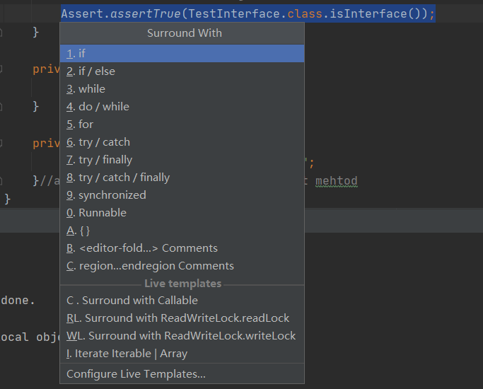

# IDEA

反向类图 时序图
一、检查UML类图插件是否开启
IDEA默认已经集成了该功能，只是默认没打开，我们要手动打开它，参考下图：
File——Settings——Plugins——UML Support：
https://blog.csdn.net/zj420964597/article/details/87856758

idea所有操作系统版本通用的
idea设置新建类模板

IDEA创建类模板和方法模板（超详细）
https://blog.csdn.net/sdut406/article/details/81750858

### Windows版本IDEA
Java OO
Ctrl - H 查看类继承关系
Ctrl - N 查找类
Alt - 7 查看当前类所有的方法
【CTRL+ALT+T】 将光标定位到这段代码,按快捷键,try catch快捷键



### git冲突解决

IDEA解决git冲突
先执行'git add'命令

### MAC版本IDEA查找接口的实现类：
IDEA 风格 ctrl+h
windows

IDEA 区分大小写 查找 CTrl -F
选择“Aa”

Ctrl+f12 查看

https://blog.csdn.net/weixin_36210698/article/details/78564252

https://www.cnblogs.com/exmyth/p/5949192.html

https://blog.csdn.net/qq_35625303/article/details/80346402


IntelliJ IDEA中用快捷键自动创建测试类的默认按键为：

ctrl+shift+t  --> create new test


https://blog.csdn.net/fanrenxiang/article/details/80497977

[IntelliJ IDEA 设置编码为utf-8编码](https://blog.csdn.net/m0_38132361/article/details/80628203)


[IDEA可以添加jetty tomcat等容器的servlet等jar包](https://blog.csdn.net/u013393958/article/details/78329192)


https://www.iteye.com/blog/baowp-1989575

#### IDEA debug时，可以改变变量的值

Mac 回到上一次光标的位置

Alt command 箭头

mac windows下的IDEA快捷键不同

[IDEA Debug模式下改变各类型变量值](https://blog.csdn.net/Peng_Hong_fu/article/details/79994860)

Ctrl P

copy reference 复制类的全路径

[IDEA中右侧出现hidden字样的处理方法](https://blog.csdn.net/budaoweng0609/article/details/87860205)

[IDEA中修改文件的默认打开方式](https://blog.csdn.net/u010814849/article/details/77675532)

[如何在IDEA中高效地使用和查找TODO标签](https://jingyan.baidu.com/article/ff42efa9c25811c19e2202ef.html)

[IDEA maven 无法下载源码](https://blog.csdn.net/weixin_33709590/article/details/92383254)

`mvn dependency:resolve -Dclassifier=sources`

IDEA Spring bean是否存在 提示信息

Windows，IntelliJ IDEA中用快捷键自动创建测类的默认按键为：

ctrl+shift+T  --> create new test

IntelliJ IDEA中用快捷键自动创建测类的默认按键为：

ctrl+shift+t  --> create new test

https://stackoverflow.com/questions/42966889/intellij-IDEA-tells-me-errorjava-compilation-failed-internal-java-compiler-e

https://jingyan.baidu.com/article/29697b9163ac7dab20de3cbf.html

全局搜索  Ctrl Shift F

https://jingyan.baidu.com/article/29697b9163ac7dab20de3cbf.html


### IDEA快捷键

[IntelliJ IDEA中 查看某个类中的所有方法](https://blog.csdn.net/tb9125256/article/details/81416358)

[Intellij IDEA 查找接口实现类的快捷键](https://blog.csdn.net/HeatDeath/article/details/79468782)


- 添加三方jar


### add jar
Project Struct


Modules Dependencies


IDEA新建Maven项目文件结构
src/main/webapp/WEB-INF

添加submodule
mvn install报错

```shell
[INFO] shardingspheretest 0.0.1 ........................... SUCCESS [  1.287 s]
[INFO] sumodule 0.0.1 ..................................... FAILURE [  1.187 s]
[INFO] ------------------------------------------------------------------------
[INFO] BUILD FAILURE
[INFO] ------------------------------------------------------------------------
[INFO] Total time: 2.935 s
[INFO] Finished at: 2019-03-12T22:08:51+08:00
[INFO] ------------------------------------------------------------------------
[ERROR] Failed to execute goal org.springframework.boot:spring-boot-maven-plugin:2.1.3.RELEASE:repackage (repackage) on project sumodule: Execution repackage of goal org.springframework.boot:spring-boot-maven-plugin:2.1.3.RELEASE:repackage
failed: Unable to find main class -> [Help 1]
[ERROR]
[ERROR] To see the full stack trace of the errors, re-run Maven with the -e switch.
[ERROR] Re-run Maven using the -X switch to enable full debug logging.
[ERROR]
[ERROR] For more information about the errors and possible solutions, please read the following articles:
[ERROR] [Help 1] http://cwiki.apache.org/confluence/display/MAVEN/PluginExecutionException
[ERROR]
[ERROR] After correcting the problems, you can resume the build with the command
[ERROR]   mvn <goals> -rf :sumodule

```


submodule中添加main方法

一般的编辑器中关闭当前文件快捷键为ctrl+w，而IDEA中默认为Ctrl+F4，用起来很不顺手。

IDEA class diagrm

https://blog.csdn.net/hy_coming/article/details/80741717

在IDEA中添加try/catch的快捷键 
ctrl+alt+t 
选中想被try/catch包围的语句，同时按下ctrl+alt+t， 

IDEA 生成javadoc步骤：

菜单
Tools
GEnerate JavaDoc scope
Output directory，选择一个文件夹
Other command line arguments:`-encoding UTF-8 `
[错误：编码GBK的不可映射字符](https://www.cnblogs.com/lucky-zhangcd/p/8409810.html)

[用IDEA生成javadoc文档](http://www.cnblogs.com/noKing/p/8006298.html)


[IDEA Error:java: Compilation failed: internal java compiler error](https://www.cnblogs.com/comeluder/p/8215317.html)

Intellij IDEA单元测试覆盖率插件JaCoCo的使用

IDEA中maven可以新建submodule，而不是新建Project

知道类名查找类:Ctrl+Shift+Alt+N; 

Ctrl+N按名字搜索类

Ctrl+Shift+N按文件名搜索文件

Ctrl+H 查看类的继承关系

Ctrl+Alt+B

Ctrl G linenumbr:XX
跳转到指定行

IDEA查找类的方法：
Ctrl F12

IDEA中查看某个类中的所有方法
alt + 7 （可以查看类的字段、属性、方法，是否继承等）

[IntelliJ IDEA全局内容搜索和替换](https://blog.csdn.net/gnail_oug/article/details/78281354)

Ctrl+H 查看类继承关系

IDEA Spring项目，配置bean的时候，Java代码可以跳转到xml文件


#### IDEA配置变异

ar
含义


断点 IDEA条件 IDEA选中断点 右键


IDEA mac ctrl o或者Shift Ctrl F

Win ctrl n 查找类

https://www.jianshu.com/p/9812be1f746d