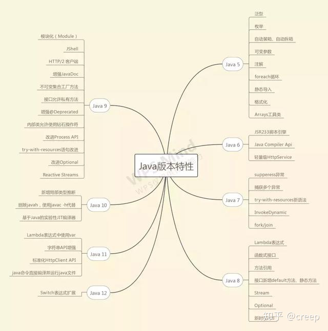

# java11


D:\Java\jdk-11.0.4\bin\java.exe  --list-modules
java.base@11.0.4
java.compiler@11.0.4
java.datatransfer@11.0.4
java.desktop@11.0.4
java.instrument@11.0.4
java.logging@11.0.4
java.management@11.0.4
java.management.rmi@11.0.4
java.naming@11.0.4
java.net.http@11.0.4
java.prefs@11.0.4
java.rmi@11.0.4
java.scripting@11.0.4
java.se@11.0.4
java.security.jgss@11.0.4
java.security.sasl@11.0.4
java.smartcardio@11.0.4
java.sql@11.0.4
java.sql.rowset@11.0.4
java.transaction.xa@11.0.4
java.xml@11.0.4
java.xml.crypto@11.0.4
jdk.accessibility@11.0.4
jdk.aot@11.0.4
jdk.attach@11.0.4
jdk.charsets@11.0.4
jdk.compiler@11.0.4
jdk.crypto.cryptoki@11.0.4
jdk.crypto.ec@11.0.4
jdk.crypto.mscapi@11.0.4
jdk.dynalink@11.0.4
jdk.editpad@11.0.4
jdk.hotspot.agent@11.0.4
jdk.httpserver@11.0.4
jdk.internal.ed@11.0.4
jdk.internal.jvmstat@11.0.4
jdk.internal.le@11.0.4
jdk.internal.opt@11.0.4
jdk.internal.vm.ci@11.0.4
jdk.internal.vm.compiler@11.0.4
jdk.internal.vm.compiler.management@11.0.4
jdk.jartool@11.0.4
jdk.javadoc@11.0.4
jdk.jcmd@11.0.4
jdk.jconsole@11.0.4
jdk.jdeps@11.0.4
jdk.jdi@11.0.4
jdk.jdwp.agent@11.0.4
jdk.jfr@11.0.4
jdk.jlink@11.0.4
jdk.jshell@11.0.4
jdk.jsobject@11.0.4
jdk.jstatd@11.0.4
jdk.localedata@11.0.4
jdk.management@11.0.4
jdk.management.agent@11.0.4
jdk.management.jfr@11.0.4
jdk.naming.dns@11.0.4
jdk.naming.rmi@11.0.4
jdk.net@11.0.4
jdk.pack@11.0.4
jdk.rmic@11.0.4
jdk.scripting.nashorn@11.0.4
jdk.scripting.nashorn.shell@11.0.4
jdk.sctp@11.0.4
jdk.security.auth@11.0.4
jdk.security.jgss@11.0.4
jdk.unsupported@11.0.4
jdk.unsupported.desktop@11.0.4
jdk.xml.dom@11.0.4
jdk.zipfs@11.0.4



https://www.ibm.com/developerworks/cn/java/the-new-features-of-Java-11/index.html

java 11没有sun.misc.BASE64Decoder;
您是正确的，Java 11中已经移除了sun.misc.BASE64Decoder类。在Java 9及之后的版本中，Oracle官方不再推荐使用sun.misc包下的类，因为它们是内部实现，不是公共API，可能会在未来的版本中被删除。

在Java 11中，您可以使用java.util.Base64类来进行Base64编解码操作。该类提供了静态方法来处理Base64数据。下面是一个示例：

```java
import java.util.Base64;

public class Base64Example {
    public static void main(String[] args) {
        String originalString = "Hello, World!";
        
        // 编码为Base64
        String encodedString = Base64.getEncoder().encodeToString(originalString.getBytes());
        System.out.println("Encoded string: " + encodedString);
        
        // 解码Base64
        byte[] decodedBytes = Base64.getDecoder().decode(encodedString);
        String decodedString = new String(decodedBytes);
        System.out.println("Decoded string: " + decodedString);
    }
}
```

在示例中，我们使用`Base64.getEncoder()`获取编码器对象，并调用`encodeToString()`方法将原始字符串编码为Base64字符串。然后，我们使用`Base64.getDecoder()`获取解码器对象，并调用`decode()`方法将Base64字符串解码为字节数组，最后将字节数组转换为字符串。
请注意，Java 11中的`java.util.Base64`类提供了更多的功能，例如支持URL和文件编解码，以及对流的支持。您可以根据实际需求选择适当的方法来进行Base64编解码操作。