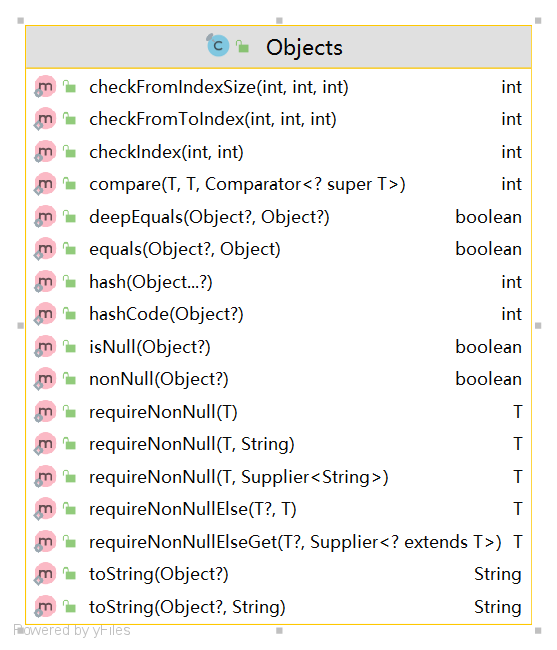

# javase


## java17新增api

https://docs.oracle.com/en/java/javase/17/
https://www.oracle.com/cn/news/announcement/oracle-releases-java-17-2021-09-14/

Java 17 是 JDK 17 版本的正式发布，它引入了一些新的 API 和功能。以下是 Java 17 中的一些新增 API 的概述：
1. Sealed Classes (密封类)：Java 17 引入了密封类的概念。密封类用于限制哪些类可以继承或实现它，从而提供更严格的类型层次结构控制。
2. Pattern Matching for Switch (Switch 表达式的模式匹配)：Java 17 扩展了 Switch 表达式，使其支持基于模式的匹配。这使得在 Switch 表达式中可以更方便地进行模式匹配和提取。
3. Sealed Interfaces (密封接口)：除了密封类，Java 17 还引入了密封接口。密封接口可以限制哪些类可以实现它，提供更严格的接口实现控制。
4. Strong Encapsulation for JDK Internals (JDK 内部的强封装)：Java 17 引入了一些机制，以进一步增强 JDK 内部的封装性，减少对内部 API 的直接访问。
5. Sealed JVM (密封的 JVM)：Java 17 引入了密封的 JVM 特性，允许在 JVM 层面对类加载和访问控制进行更严格的限制。
6. Foreign Function & Memory API (外部函数和内存 API)：Java 17 引入了 Foreign Function & Memory API，用于与本地代码进行交互，包括直接访问内存和调用外部函数。
7. Deprecating and Removing Features：Java 17 标记了一些过时（Deprecated）的 API，并删除了一些不再建议使用的功能。
请注意，以上只是 Java 17 中一些新增 API 的概述，并不是完整的列表。对于更详细和全面的信息，建议查阅 Java 17 的官方文档和发布说明。
Java 17 的官方文档和发布说明。
Java 18于2022年3月发布,主要新增了以下几个方面的API:

1. 并发 - Structured Concurrency 提供了结构化并发模型的支持,可以通过Scope控制异步任务的生命周期。
2. 集合 - Map和Set新增了toMap/toSet/toUnmodifiableMap/toUnmodifiableSet等集合转换方法。
3. 字符串 - String新增了isBlank/lines/strip/stripLeading/stripTrailing等字符串处理方法。
4. I/O - FileSystems新增了读取文件树的walkFileTree方法。
5. 工具类 - Records提供了方便创建只有getter方法的记录类的支持。
6. JVM - 增强了对 Foreign Memory Access 和虚拟线程的支持。
7. HTTP客户端 - HttpClient API更新到9.1版本。
8. 预览特性 - 新增Vector API和Foreign Linker API等。
此外还包含大量的安全、稳定性和bug修复等改进。

综上,Java 18对并发、集合、字符串、I/O等方面都有很实用的增强,以及对未来特性的预览支持。这些新API可以帮助开发者编写更清晰、高效的Java程序。


### sql


## Objects

java.util.Objects#isNull



ResultSetMetaData  缩写rsmd

java.sql.ResultSetMetaData

是接口


## Collectors

java.util.stream.Collectors


toCollection()

toList()

toSet()

counting()


Collectors.toCollection(TreeSet::new)

Collectors.joining(", ")

Collectors.summingInt(Employee::getSalary)

Collectors.groupingBy(Employee::getDepartment)


Map<Department, Integer> totalByDept      = employees.stream()                 .collect(Collectors.groupingBy(Employee::getDepartment,                                                Collectors.summingInt(Employee::getSalary)));


Map<Boolean, List<Student>> passingFailing =      students.stream().collect(Collectors.partitioningBy(s -> s.getGrade() >= PASS_THRESHOLD));


`Collection.toList()` 方法是 `java.util.stream.Collectors` 类中的一个静态方法，它用于将流（Stream）中的元素收集到一个列表中。

`java.util.stream.Collectors` 类是 Java 8 引入的，它提供了许多用于收集流元素的静态方法。这些方法可以与流的 `collect()` 操作一起使用，用于执行各种集合操作，如收集到列表、集合、映射等。

要使用 `toList()` 方法，需要在代码中导入 `Collectors` 类：

```java
import java.util.stream.Collectors;
```

然后，可以将流中的元素收集到列表中，如下所示：

```java
List<String> list = stream.collect(Collectors.toList());
```

在上述示例中，`stream` 是一个流对象，通过调用 `collect()` 方法并传递 `Collectors.toList()`，将流中的元素收集到一个名为 `list` 的列表中。

需要注意的是，`toList()` 方法返回的是一个 `List` 实现类的实例，具体的实现类取决于流的来源和上下文。一般情况下，返回的是 `ArrayList` 或 `LinkedList` 的实例。

这种方式可以将流中的元素转换为列表，方便进行后续的操作和处理。
