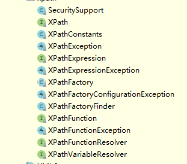

# jdk8

多线程 关键字 volitale synchronized Lock接口
集合 List Set Map
编码，文本格式 xml

https://docs.oracle.com/javase/8/docs/api/



I interface

ac abstrct class
# java se

https://docs.oracle.com/javase/8/docs/api/

https://openjdk.org/projects/jdk7/

JDK 7
The primary goal of this Project was to produce an open-source implementation of the seventh edition of the Java SE Platform, as defined by JSR 336 in the Java Community Process.

JDK 7 reached General Availability on 28 July 2011. Production-ready binary distributions based on the JDK 7 code base are available now from Oracle and will be available soon in most Linux distributions and from Oracle's Java SE licensees.

Detailed information on the main features of the release can be found on the features page. The JDK 7 development schedule was divided into a sequence of milestone cycles. A complete calendar of the entire development timeline is also available.

Development of JDK 7 update releases is being done in the nearby JDK 7 Updates Project.

History
After Oracle acquired Sun we replanned JDK 7 according to the "Plan B" proposal in order to accelerate its release while maintaining performance and quality. Features that needed more time to mature were deferred to JDK 8 or later releases as explained here. A handful of small, high-impact features which were not previously part of the plan but were finished, or nearly so, were added to the release.

The high-level schedule for the endgame of the release was as follows:

2010/12/23	Feature Complete (M11)
2011/02/17	Developer Preview (M12)
2011/04/12	Rampdown start: P1-P3 bugs only
2011/04/28	API/interface changes: Showstoppers only
2011/05/11	All targeted bugs addressed
2011/05/18	Bug fixes: Showstoppers only
2011/06/02	Last scheduled build (M13)
Final test cycle starts
2011/07/28	General Availability

## JDK 8
https://openjdk.org/projects/jdk8/

The goal of this Project was to produce an open-source reference implementation of the Java SE 8 Platform Specification defined by JSR 337 in the Java Community Process.

JDK 8 reached General Availability on 18 March 2014. Production-ready binary distributions based on the JDK 8 code base are available now from Oracle and will be available soon in most Linux distributions.

Development of JDK 8 Update Releases is being done in the nearby JDK 8 Updates Project.

Content
JDK 8 was the second part of "Plan B". The single driving feature of the release was Project Lambda. (Project Jigsaw was initially proposed for this release but later dropped). Additional features proposed via the JEP Process were included so long as they fit into the overall schedule required for Lambda. Detailed information on the features included in the release can be found on the features page.

Schedule
The original schedule aimed to ship the release in early September 2013, but due to an increased focus on browser-related security issues that date was not achievable. The final schedule, proposed on 2013/4/18 and adopted on 2013/4/26, was as follows:

2012/04/26	M1	
2012/06/14	M2	
2012/08/02	M3	
2012/09/13	M4	
2012/11/29	M5	
2013/01/31	M6	
2013/06/13	M7	Feature Complete
2013/09/05	M8	Developer Preview
2014/01/23	M9	Final Release Candidate
2014/03/18	GA	General Availability
Further information on milestone content and the final phases of the release can be found on the milestones page.

JDK 8
Features
JEPS are grouped according to the area and component taxonomy used in the JEP Process. On this page a JEP number links directly to the cited JEP document, while a JEP title links to the corresponding short summary below.

--/--	126	Lambda Expressions & Virtual Extension Methods
138	Autoconf-Based Build System
160	Lambda-Form Representation for Method Handles
161	Compact Profiles
162	Prepare for Modularization
164	Leverage CPU Instructions for AES Cryptography
174	Nashorn JavaScript Engine
176	Mechanical Checking of Caller-Sensitive Methods
179	Document JDK API Support and Stability
vm/--	142	Reduce Cache Contention on Specified Fields
vm/gc	122	Remove the Permanent Generation
173	Retire Some Rarely-Used GC Combinations
vm/rt	136	Enhanced Verification Errors
147	Reduce Class Metadata Footprint
148	Small VM
171	Fence Intrinsics
core/--	153	Launch JavaFX Applications
core/lang	101	Generalized Target-Type Inference
104	Annotations on Java Types
105	DocTree API
106	Add Javadoc to javax.tools
117	Remove the Annotation-Processing Tool (apt)
118	Access to Parameter Names at Runtime
120	Repeating Annotations
139	Enhance javac to Improve Build Speed
172	DocLint
core/libs	103	Parallel Array Sorting
107	Bulk Data Operations for Collections
109	Enhance Core Libraries with Lambda
112	Charset Implementation Improvements
119	javax.lang.model Implementation Backed by Core Reflection
135	Base64 Encoding & Decoding
149	Reduce Core-Library Memory Usage
150	Date & Time API
155	Concurrency Updates
170	JDBC 4.2
177	Optimize java.text.DecimalFormat.format
178	Statically-Linked JNI Libraries
180	Handle Frequent HashMap Collisions with Balanced Trees
core/i18n	127	Improve Locale Data Packaging and Adopt Unicode CLDR Data
128	BCP 47 Locale Matching
133	Unicode 6.2
core/net	184	HTTP URL Permissions
core/sec	113	MS-SFU Kerberos 5 Extensions
114	TLS Server Name Indication (SNI) Extension
115	AEAD CipherSuites
121	Stronger Algorithms for Password-Based Encryption
123	Configurable Secure Random-Number Generation
124	Enhance the Certificate Revocation-Checking API
129	NSA Suite B Cryptographic Algorithms
130	SHA-224 Message Digests
131	PKCS#11 Crypto Provider for 64-bit Windows
140	Limited doPrivileged
166	Overhaul JKS-JCEKS-PKCS12 Keystores
web/jaxp	185	Restrict Fetching of External XML Resources
A summary of the changes to this list over time is available at the bottom of this page.

--/--
126 Lambda Expressions & Virtual Extension Methods
Add lambda expressions (closures) and supporting features, including method references, enhanced type inference, and virtual extension methods, to the Java programming language and platform.
Owner: Brian Goetz
Author: Joseph D. Darcy
Discussion: lambda dash dev at openjdk dot java dot net
Milestone target: M7
138 Autoconf-Based Build System
Introduce autoconf (./configure-style) build setup, refactor the Makefiles to remove recursion, and leverage JEP 139: Enhance javac to Improve Build Speed.
Author: Magnus Ihse Bursie
Discussion: jdk8 dash dev at openjdk dot java dot net
Milestone target: M6
160 Lambda-Form Representation for Method Handles
Improve the implementation of method handles by replacing assembly language paths with an optimizable intermediate representation and then refactoring the implementation so that more work is done in portable Java code than is hardwired into the JVM.
Author: John Rose
Discussion: mlvm dash dev at openjdk dot java dot net
Milestone target: M6
161 Compact Profiles
Define a few subset Profiles of the Java SE Platform Specification so that applications that do not require the entire Platform can be deployed and run on small devices.
Owner: Bob Vandette
Author: Bob Vandette, Mark Reinhold
Discussion: jdk8 dash dev at openjdk dot java dot net
Milestone target: M7
162 Prepare for Modularization
Undertake changes to smooth the eventual transition to modules in a future release, provide new tools to help developers prepare for the modular platform, and deprecate certain APIs that are a significant impediment to modularization.
Author: Alan Bateman
Discussion: jigsaw dash dev at openjdk dot java dot net
Milestone target: M7
164 Leverage CPU Instructions for AES Cryptography
Improve the out-of-box AES Crypto performance by using x86 AES instructions when available, and by avoiding unnecessary re-expansion of the AES key.
Author: Vladimir Kozlov
Discussion: hotspot dash compiler dash dev at openjdk dot java dot net
Milestone target: M6
174 Nashorn JavaScript Engine
Design and implement a new lightweight, high-performance implementation of JavaScript, and integrate it into the JDK. The new engine will be made available to Java applications via the existing javax.script API, and also more generally via a new command-line tool.
Author: Jim Laskey
Discussion: nashorn dash dev at openjdk dot java dot net
Milestone target: M7
176 Mechanical Checking of Caller-Sensitive Methods
Improve the security of the JDK’s method-handle implementation by replacing the existing hand-maintained list of caller-sensitive methods with a mechanism that accurately identifies such methods and allows their callers to be discovered reliably.
Owner: John Rose
Author: John Rose, Christian Thalinger, Mandy Chung
Discussion: core dash libs dash dev at openjdk dot java dot net
Milestone target: M7
179 Document JDK API Support and Stability
There is a long-standing shortcoming in the JDK in terms of clearly specifying the support and stability usage contract for com.sun.* types and other types shipped with the JDK that are outside of the Java SE specification. These contracts and potential evolution policies should be clearly captured both in the source code of the types and in the resulting class files. This information can be modeled with JDK-specific annotation types.
Author: Joseph D. Darcy
Discussion: core dash libs dash dev at openjdk dot java dot net
Milestone target: M7
vm/--
142 Reduce Cache Contention on Specified Fields
Define a way to specify that one or more fields in an object are likely to be highly contended across processor cores so that the VM can arrange for them not to share cache lines with other fields, or other objects, that are likely to be independently accessed.
Owner: Tony Printezis
Author: Jesper Wilhelmsson, Tony Printezis
Discussion: hotspot dash dev at openjdk dot java dot net
Milestone target: M6
vm/gc
122 Remove the Permanent Generation
Remove the permanent generation from the Hotspot JVM and thus the need to tune the size of the permanent generation.
Author: Jon Masamitsu
Discussion: hotspot dash dev at openjdk dot java dot net
Milestone target: M5
173 Retire Some Rarely-Used GC Combinations
Remove three rarely-used combinations of garbage collectors in order to reduce ongoing development, maintenance, and testing costs.
Author: Bengt Rutisson
Discussion: hotspot dash gc dash dev at openjdk dot java dot net
Milestone target: M6
vm/rt
136 Enhanced Verification Errors
Provide additional contextual information about bytecode-verification errors to ease diagnosis of bytecode or stackmap deficiencies in the field.
Author: Keith McGuigan
Discussion: hotspot dash runtime dash dev at openjdk dot java dot net
Milestone target: M5
147 Reduce Class Metadata Footprint
Reduce HotSpot’s class metadata memory footprint in order to improve performance on small devices.
Author: Jiangli Zhou
Discussion: hotspot dash runtime dash dev at openjdk dot java dot net
Milestone target: M6
148 Small VM
Support the creation of a small VM that is no larger than 3MB.
Author: Joe Provino
Discussion: hotspot dash dev at openjdk dot java dot net
Milestone target: M6
171 Fence Intrinsics
Add three memory-ordering intrinsics to the sun.misc.Unsafe class.
Author: Doug Lea
Discussion: hotspot dash dev at openjdk dot java dot net
Milestone target: M7
core/--
153 Launch JavaFX Applications
Enhance the java command-line launcher to launch JavaFX applications.
Author: Kumar Srinivasan
Discussion: core dash libs dash dev at openjdk dot java dot net
Milestone target: M5
core/lang
101 Generalized Target-Type Inference
Smoothly expand the scope of method type-inference to support (i) inference in method context and (ii) inference in chained calls.
Author: Maurizio Cimadamore
Discussion: lambda dash dev at openjdk dot java dot net
Milestone target: M7
104 Annotations on Java Types
Extend the set of annotatable locations in the syntax of the Java programming language to include names which indicate the use of a type as well as (per Java SE 5.0) the declaration of a type.
Author: Michael Ernst, Alex Buckley
Discussion: type dash annotations dash dev at openjdk dot java dot net
Milestone target: M7
105 DocTree API
Extend the Compiler Tree API to provide structured access to the content of javadoc comments.
Author: Jonathan Gibbons
Discussion: compiler dash dev at openjdk dot java dot net
Milestone target: M5
106 Add Javadoc to javax.tools
Extend the javax.tools API to provide access to javadoc.
Author: Jonathan Gibbons
Discussion: compiler dash dev at openjdk dot java dot net
Milestone target: M5
117 Remove the Annotation-Processing Tool (apt)
Remove the apt tool, associated API, and documentation from the JDK.
Author: Joseph D. Darcy
Discussion: compiler dash dev at openjdk dot java dot net
Milestone target: M1
118 Access to Parameter Names at Runtime
Provide a mechanism to easily and reliably retrieve the parameter names of methods and constructors at runtime via core reflection.
Owner: Alex Buckley
Author: Joseph D. Darcy
Discussion: enhanced dash metadata dash spec dash discuss at openjdk dot java dot net
Milestone target: M7
120 Repeating Annotations
Change the Java programming language to allow multiple application of annotations with the same type to a single program element.
Owner: Alex Buckley
Author: Joseph D. Darcy
Discussion: enhanced dash metadata dash spec dash discuss at openjdk dot java dot net
Milestone target: M7
139 Enhance javac to Improve Build Speed
Reduce the time required to build the JDK and enable incremental builds by modifying the Java compiler to run on all available cores in a single persistent process, track package and class dependences between builds, automatically generate header files for native methods, and clean up class and header files that are no longer needed.
Author: Magnus Ihse Bursie
Discussion: compiler dash dev at openjdk dot java dot net
Milestone target: M6
172 DocLint
Provide a means to detect errors in Javadoc comments early in the development cycle and in a way that is easily linked back to the source code.
Author: Jonathan Gibbons
Discussion: javadoc dash dev at openjdk dot java dot net
Milestone target: M6
core/libs
103 Parallel Array Sorting
Add additional utility methods to java.util.Arrays that use the JSR 166 Fork/Join parallelism common pool to provide sorting of arrays in parallel.
Owner: Chris Hegarty
Author: David Holmes, Chris Hegarty
Discussion: core dash libs dash dev at openjdk dot java dot net
Milestone target: M6
107 Bulk Data Operations for Collections
Add functionality to the Java Collections Framework for bulk operations upon data. This is commonly referenced as “filter/map/reduce for Java.” The bulk data operations include both serial (on the calling thread) and parallel (using many threads) versions of the operations. Operations upon data are generally expressed as lambda functions.
Author: Mike Duigou
Discussion: lambda dash dev at openjdk dot java dot net
Milestone target: M7
109 Enhance Core Libraries with Lambda
Enhance the Java core library APIs using the new lambda language feature to improve the usability and convenience of the library.
Owner: Stuart W. Marks
Author: Stuart W. Marks, Mike Duigou
Discussion: core dash libs dash dev at openjdk dot java dot net
Milestone target: M7
112 Charset Implementation Improvements
Improve the maintainability and performance of the standard and extended charset implementations.
Author: Xueming Shen
Discussion: core dash libs dash dev at openjdk dot java dot net
Milestone target: M4
119 javax.lang.model Implementation Backed by Core Reflection
Provide an implementation of the javax.lang.model.* API backed by core reflection rather than by javac. In other words, provide an alternate API to access and process the reflective information about loaded classes provided by core reflection.
Author: Joseph D. Darcy
Discussion: compiler dash dev at openjdk dot java dot net
Milestone target: M7
135 Base64 Encoding & Decoding
Define a standard API for Base64 encoding and decoding.
Author: Alan Bateman
Discussion: core dash libs dash dev at openjdk dot java dot net
Milestone target: M6
149 Reduce Core-Library Memory Usage
Reduce the dynamic memory used by core-library classes without adversely impacting performance.
Owner: Roger Riggs
Author: Roger Riggs, Hinkmond Wong, David Holmes
Discussion: core dash libs dash dev at openjdk dot java dot net
Milestone target: M6
150 Date & Time API
Define a new date, time, and calendar API for the Java SE platform.
Owner: Xueming Shen
Author: Stephen Colebourne
Discussion: core dash libs dash dev at openjdk dot java dot net
Milestone target: M6
155 Concurrency Updates
Scalable updatable variables, cache-oriented enhancements to the ConcurrentHashMap API, ForkJoinPool improvements, and additional Lock and Future classes.
Owner: Chris Hegarty
Author: Doug Lea
Discussion: core dash libs dash dev at openjdk dot java dot net
Milestone target: M7
170 JDBC 4.2
Minor enhancements to JDBC to improve usability and portability
Author: Lance Andersen
Discussion: jdbc dash spec dash discuss at openjdk dot java dot net
Milestone target: M6
177 Optimize java.text.DecimalFormat.format
Optimize java.text.DecimalFormat.format by taking advantage of numerical properties of integer and floating-point arithmetic to accelerate cases with two or three digits after the decimal point.
Author: Joseph D. Darcy
Discussion: core dash libs dash dev at openjdk dot java dot net
Milestone target: M5
178 Statically-Linked JNI Libraries
Enhance the JNI specification to support statically linked native libraries.
Author: Bob Vandette
Discussion: jdk8 dash dev at openjdk dot java dot net
Milestone target: M7
180 Handle Frequent HashMap Collisions with Balanced Trees
Improve the performance of java.util.HashMap under high hash-collision conditions by using balanced trees rather than linked lists to store map entries. Implement the same improvement in the LinkedHashMap class.
Owner: Brent Christian
Author: Mike Duigou
Discussion: core dash libs dash dev at openjdk dot java dot net
Milestone target: M7
core/i18n
127 Improve Locale Data Packaging and Adopt Unicode CLDR Data
Create a tool to convert LDML (Locale Data Markup Language) files into a format usable directly by the runtime library, define a way to package the results into modules, and then use these to incorporate the de-facto standard locale data published by the Unicode Consortium’s CLDR project into the JDK.
Author: Naoto Sato
Discussion: i18n dash dev at openjdk dot java dot net
Milestone target: M5
128 BCP 47 Locale Matching
Define APIs so that applications that use BCP 47 language tags (see RFC 5646) can match them to a user’s language preferences in a way that conforms to RFC 4647.
Owner: Yuka Kamiya
Author: Naoto Sato
Discussion: i18n dash dev at openjdk dot java dot net
Milestone target: M5
133 Unicode 6.2
Extend existing platform APIs to support version 6.2 of the Unicode Standard.
Author: Yuka Kamiya
Discussion: i18n dash dev at openjdk dot java dot net
Milestone target: M5
core/net
184 HTTP URL Permissions
Define a new type of network permission which grants access in terms of URLs rather than low-level IP addresses.
Author: Michael McMahon
Discussion: net dash dev at openjdk dot java dot net
Milestone target: M7
core/sec
113 MS-SFU Kerberos 5 Extensions
Add the MS-SFU extensions to the JDK’s Kerberos 5 implementation.
Author: Weijun Wang
Discussion: security dash dev at openjdk dot java dot net
Milestone target: M5
114 TLS Server Name Indication (SNI) Extension
Add support for the TLS Server Name Indication (SNI) Extension to allow more flexible secure virtual hosting and virtual-machine infrastructure based on SSL/TLS protocols.
Author: Xuelei Fan
Discussion: security dash dev at openjdk dot java dot net
Milestone target: M5
115 AEAD CipherSuites
Support the AEAD/GCM cipher suites defined by SP-800-380D, RFC 5116, RFC 5246, RFC 5288, RFC 5289 and RFC 5430.
Owner: Bradford Wetmore
Author: Xuelei Fan
Discussion: security dash dev at openjdk dot java dot net
Milestone target: M7
121 Stronger Algorithms for Password-Based Encryption
Provide stronger Password-Based-Encryption (PBE) algorithm implementations in the SunJCE provider.
Owner: Vincent Ryan
Author: Valerie Peng
Discussion: security dash dev at openjdk dot java dot net
Milestone target: M5
123 Configurable Secure Random-Number Generation
Enhance the API for secure random-number generation so that it can be configured to operate within specified quality and responsiveness constraints.
Author: Bradford Wetmore
Discussion: security dash dev at openjdk dot java dot net
Milestone target: M7
124 Enhance the Certificate Revocation-Checking API
Improve the certificate revocation-checking API to support best-effort checking, end-entity certificate checking, and mechanism-specific options and parameters.
Author: Sean Mullan
Discussion: security dash dev at openjdk dot java dot net
Milestone target: M3
129 NSA Suite B Cryptographic Algorithms
Provide implementations of the cryptographic algorithms required by NSA Suite B.
Author: Valerie Peng
Discussion: security dash dev at openjdk dot java dot net
Milestone target: M4
130 SHA-224 Message Digests
Implement the SHA-224 message-digest algorithm and related algorithms.
Author: Valerie Peng
Discussion: security dash dev at openjdk dot java dot net
Milestone target: M3
131 PKCS#11 Crypto Provider for 64-bit Windows
Include the SunPKCS11 provider in the JDK for 64-bit Windows.
Author: Valerie Peng
Discussion: security dash dev at openjdk dot java dot net
Milestone target: M3
140 Limited doPrivileged
Enable code to assert a subset of its privileges without otherwise preventing the full access-control stack walk to check for other permissions.
Author: Sean Mullan
Discussion: security dash dev at openjdk dot java dot net
Milestone target: M7
166 Overhaul JKS-JCEKS-PKCS12 Keystores
Facilitate migrating data from JKS and JCEKS keystores by adding equivalent support to the PKCS#12 keystore. Enhance the KeyStore API to support new features such as entry metadata and logical views spanning several keystores. Enable the strong crypto algorithms introduced in JEP-121 to be used to protect keystore entries.
Author: Vincent Ryan
Discussion: security dash dev at openjdk dot java dot net
Milestone target: M6
web/jaxp
185 Restrict Fetching of External XML Resources
Enhance the JAXP APIs to add the ability to restrict the set of network protocols that may be used to fetch external resources.
Author: Joe Wang
Discussion: core dash libs dash dev at openjdk dot java dot net
Milestone target: M7
Change history
2012/9/11

103 Parallel Array Sorting — Targeted to M5
127 Improve Locale Data Packaging — Targeted to M5
150 JSR 310: Date and Time API — Targeted to M6
2012/11/6

121 Stronger Algorithms for Password-Based Encryption — Retargeted to M5
129 NSA Suite B Cryptographic Algorithms — Retargeted to M5
133 Unicode 6.2 — Retargeted to M5
2012/12/4

103 Parallel Array Sorting — Retargeted to M6
110 New HTTP Client — Retargeted to M6
111 Additional Unicode Constructs for Regular Expressions — Dropped
112 Charset Implementation Improvements — Retargeted to M4
119 javax.lang.model Implementation Backed by Core Reflection — Retargeted to M6
136 Enhanced Verification Errors — Targeted to M5
140 Limited doPrivileged — Retargeted to M6
2012/12/6

138 Autoconf-Based Build System — Targeted to M6
142 Reduce Cache Contention on Specified Fields — Targeted to M6
143 Improve Contended Locking — Targeted to M6
147 Reduce Class Metadata Footprint — Targeted to M6
148 Small VM — Targeted to M6
149 Reduce Core-Library Memory Usage — Targeted to M6
155 Concurrency Updates (jsr166e) — Targeted to M6
161 Compact Profiles — Targeted to M6
162 Prepare for Modularization — Targeted to M6
165 Compiler Control — Targeted to M6
166 Overhaul JKS-JCEKS-PKCS12 Keystores — Targeted to M6
170 JDBC 4.2 — Targeted to M6
171 Fence Intrinsics — Targeted to M6
172 DocLint — Targeted to M6
2012/12/20

139 Enhance javac to Improve Build Speed — Targeted to M6
2013/1/14

108 Collections Enhancements from Third-Party Libraries — Dropped
110 New HTTP Client — Dropped
156 G1 GC: Reduce need for full GCs — Dropped
107 Bulk Data Operations for Collections — Retargeted to M7
123 Configurable Secure Random-Number Generation — Retargeted to M7
155 Concurrency Updates — Retargeted to M7
171 Fence Intrinsics — Retargeted to M7
164 Leverage CPU Instructions for AES Cryptography — Targeted to M6
173 Retire Some Rarely-Used GC Combinations — Targeted to M6
2013/1/30

101 Generalized Target-Type Inference — Retargeted to M7
109 Enhance Core Libraries with Lambda — Retargeted to M7
118 Access to Parameter Names at Runtime — Retargeted to M7
119 javax.lang.model Implementation Backed by Core Reflection — Retargeted to M7
120 Repeating Annotations — Retargeted to M7
126 Lambda Expressions & Virtual Extension Methods — Retargeted to M7
140 Limited doPrivileged — Retargeted to M7
161 Compact Profiles — Retargeted to M7
174 Nashorn JavaScript Engine — Targeted to M7
2013/2/20

104 Annotations on Java Types — Retargeted to M7
115 AEAD CipherSuites — Retargeted to M7
162 Prepare for Modularization — Retargeted to M7
2013/4/30

143 Improve Contended Locking — Dropped
165 Compiler Control — Dropped
176 Mechanical Checking of Caller-Sensitive Methods — Targeted to M7
177 Optimize java.text.DecimalFormat.format — Targeted to M5
178 Statically-Linked JNI Libraries — Targeted to M7
179 Document JDK API Support and Stability — Targeted to M7
180 Handle Frequent HashMap Collisions with Balanced Trees — Targeted to M7
184 HTTP URL Permissions — Targeted to M7
2013/6/13

185 JAXP 1.5: Restrict Fetching of External Resources — Targeted to M7

## JDK 9
https://openjdk.org/projects/jdk9/

The goal of this Project was to produce an open-source reference implementation of the Java SE 9 Platform as defined by JSR 379 in the Java Community Process.

JDK 9 reached General Availability on 21 September 2017. Production-ready binaries under the GPL are available from Oracle; binaries from other vendors will follow shortly.

The features and schedule of this release were proposed and tracked via the JEP Process, as amended by the JEP 2.0 proposal.

Features
102: Process API Updates
110: HTTP 2 Client
143: Improve Contended Locking
158: Unified JVM Logging
165: Compiler Control
193: Variable Handles
197: Segmented Code Cache
199: Smart Java Compilation, Phase Two
200: The Modular JDK
201: Modular Source Code
211: Elide Deprecation Warnings on Import Statements
212: Resolve Lint and Doclint Warnings
213: Milling Project Coin
214: Remove GC Combinations Deprecated in JDK 8
215: Tiered Attribution for javac
216: Process Import Statements Correctly
217: Annotations Pipeline 2.0
219: Datagram Transport Layer Security (DTLS)
220: Modular Run-Time Images
221: Simplified Doclet API
222: jshell: The Java Shell (Read-Eval-Print Loop)
223: New Version-String Scheme
224: HTML5 Javadoc
225: Javadoc Search
226: UTF-8 Property Files
227: Unicode 7.0
228: Add More Diagnostic Commands
229: Create PKCS12 Keystores by Default
231: Remove Launch-Time JRE Version Selection
232: Improve Secure Application Performance
233: Generate Run-Time Compiler Tests Automatically
235: Test Class-File Attributes Generated by javac
236: Parser API for Nashorn
237: Linux/AArch64 Port
238: Multi-Release JAR Files
240: Remove the JVM TI hprof Agent
241: Remove the jhat Tool
243: Java-Level JVM Compiler Interface
244: TLS Application-Layer Protocol Negotiation Extension
245: Validate JVM Command-Line Flag Arguments
246: Leverage CPU Instructions for GHASH and RSA
247: Compile for Older Platform Versions
248: Make G1 the Default Garbage Collector
249: OCSP Stapling for TLS
250: Store Interned Strings in CDS Archives
251: Multi-Resolution Images
252: Use CLDR Locale Data by Default
253: Prepare JavaFX UI Controls & CSS APIs for Modularization
254: Compact Strings
255: Merge Selected Xerces 2.11.0 Updates into JAXP
256: BeanInfo Annotations
257: Update JavaFX/Media to Newer Version of GStreamer
258: HarfBuzz Font-Layout Engine
259: Stack-Walking API
260: Encapsulate Most Internal APIs
261: Module System
262: TIFF Image I/O
263: HiDPI Graphics on Windows and Linux
264: Platform Logging API and Service
265: Marlin Graphics Renderer
266: More Concurrency Updates
267: Unicode 8.0
268: XML Catalogs
269: Convenience Factory Methods for Collections
270: Reserved Stack Areas for Critical Sections
271: Unified GC Logging
272: Platform-Specific Desktop Features
273: DRBG-Based SecureRandom Implementations
274: Enhanced Method Handles
275: Modular Java Application Packaging
276: Dynamic Linking of Language-Defined Object Models
277: Enhanced Deprecation
278: Additional Tests for Humongous Objects in G1
279: Improve Test-Failure Troubleshooting
280: Indify String Concatenation
281: HotSpot C++ Unit-Test Framework
282: jlink: The Java Linker
283: Enable GTK 3 on Linux
284: New HotSpot Build System
285: Spin-Wait Hints
287: SHA-3 Hash Algorithms
288: Disable SHA-1 Certificates
289: Deprecate the Applet API
290: Filter Incoming Serialization Data
291: Deprecate the Concurrent Mark Sweep (CMS) Garbage Collector
292: Implement Selected ECMAScript 6 Features in Nashorn
294: Linux/s390x Port
295: Ahead-of-Time Compilation
297: Unified arm32/arm64 Port
298: Remove Demos and Samples
299: Reorganize Documentation
Schedule
2016/05/26		Feature Complete
2016/12/22		Feature Extension Complete
2017/01/05		Rampdown Start
2017/02/09		All Tests Run
2017/02/16		Zero Bug Bounce
2017/03/16		Rampdown Phase Two
2017/06/22		Initial Release Candidate
2017/07/06		Final Release Candidate
2017/09/21		General Availability
Phases
We stabilized the release in an increasingly-rigorous sequence of phases, listed here for the record:

Rampdown Phase One
Rampdown Phase Two
Release-Candidate Phase
During those phases we used three processes to coordinate our work:

Feature-Complete extension request process
Bug-deferral process (RDP 1 and later)
Fix-request process (RDP 2 and later)
Milestone definitions
The milestone definitions for JDK 9 were the same as those for JDK 8, with the addition of:

Feature Extension Complete — The date by which JEPs and small enhancements that have been granted extensions via the FC extension-request process must be integrated into the master forest.

Initial Release Candidate — The date on which the first release candidate is built and submitted for testing.

## 源码分包解析

java.applet

java.awt

java.awt.color

java.awt.datatransfer

java.awt.dnd

java.awt.event

java.awt.font

java.awt.geom

java.awt.im

java.awt.im.spi

java.awt.image

java.awt.image.renderable

java.awt.print

java.beans

java.beans.beancontext

java.io

java.lang

java.lang.annotation

java.lang.instrument

java.lang.invoke

java.lang.management

java.lang.ref

java.lang.reflect

java.math

java.net

java.nio

java.nio.channels

java.nio.channels.spi

java.nio.charset

java.nio.charset.spi

java.nio.file

java.nio.file.attribute

java.nio.file.spi

java.rmi

java.rmi.activation

java.rmi.dgc

java.rmi.registry

java.rmi.server

java.security

java.security.acl

java.security.cert

java.security.interfaces

java.security.spec

java.sql

java.text

java.text.spi

java.time

java.time.chrono

java.time.format

java.time.temporal

java.time.zone

java.util

java.util.concurrent

java.util.concurrent.atomic

java.util.concurrent.locks

java.util.function

java.util.jar

java.util.logging

java.util.prefs

java.util.regex

java.util.spi

java.util.stream

java.util.zip

javax.accessibility

javax.activation

javax.activity

javax.annotation


| javax.annotation            |      |      |
| --------------------------- | ---- | ---- |
| Enums                       |      |      |
|                             |      |      |
| Resource.AuthenticationType |      |      |
|                             |      |      |
| Annotation Types            |      |      |
| Generated                   |      |      |
| PostConstruct               |      |      |
| PreDestroy                  |      |      |
| Resource                    |      |      |
| Resources                   |      |      |


@Resource用法

```java
    @Resource
    private ObjectMapper objectMapper;
```


@PostConstruct

@PreDestroy

```java
    @PostConstruct
    public void init() {
    }

    @PreDestroy
    public void clean() {
    }
```


javax.annotation.processing


| javax.annotation.processing |      |      |
| --------------------------- | ---- | ---- |
| Interfaces                  |      |      |
| Completion                  |      |      |
| Filer                       |      |      |
| Messager                    |      |      |
| ProcessingEnvironment       |      |      |
| Processor                   |      |      |
| RoundEnvironment            |      |      |
|                             |      |      |
| Classes                     |      |      |
| AbstractProcessor           |      |      |
| Completions                 |      |      |
|                             |      |      |
| Exceptions                  |      |      |
| FilerException              |      |      |
|                             |      |      |
| Annotation Types            |      |      |
| SupportedAnnotationTypes    |      |      |
| SupportedOptions            |      |      |
| SupportedSourceVersion      |      |      |


javax.crypto

javax.crypto.interfaces

javax.crypto.spec

javax.imageio

javax.imageio.event

javax.imageio.metadata

javax.imageio.plugins.bmp

javax.imageio.plugins.jpeg

javax.imageio.spi

javax.imageio.stream

javax.jws

javax.jws.soap

javax.lang.model

javax.lang.model.element

javax.lang.model.type

javax.lang.model.util

javax.management

javax.management.loading

javax.management.modelmbean

javax.management.monitor

javax.management.openmbean

javax.management.relation

javax.management.remote

javax.management.remote.rmi

javax.management.timer

javax.naming

javax.naming.directory

javax.naming.event

javax.naming.ldap

javax.naming.spi

javax.net

javax.net.ssl

javax.print

javax.print.attribute

javax.print.attribute.standard

javax.print.event

javax.rmi

javax.rmi.CORBA

javax.rmi.ssl

javax.script

javax.security.auth

javax.security.auth.callback

javax.security.auth.kerberos

javax.security.auth.login

javax.security.auth.spi

javax.security.auth.x500

javax.security.cert

javax.security.sasl

javax.sound.midi

javax.sound.midi.spi

javax.sound.sampled

javax.sound.sampled.spi

javax.sql

javax.sql.rowset

javax.sql.rowset.serial

javax.sql.rowset.spi

javax.swing

javax.swing.border

javax.swing.colorchooser

javax.swing.event

javax.swing.filechooser

javax.swing.plaf

javax.swing.plaf.basic

javax.swing.plaf.metal

javax.swing.plaf.multi

javax.swing.plaf.nimbus

javax.swing.plaf.synth

javax.swing.table

javax.swing.text

javax.swing.text.html

javax.swing.text.html.parser

javax.swing.text.rtf

javax.swing.tree

javax.swing.undo

javax.tools

javax.transaction

javax.transaction.xa

javax.xml

javax.xml.bind

javax.xml.bind.annotation

javax.xml.bind.annotation.adapters

javax.xml.bind.attachment

javax.xml.bind.helpers

javax.xml.bind.util

javax.xml.crypto

javax.xml.crypto.dom

javax.xml.crypto.dsig

javax.xml.crypto.dsig.dom

javax.xml.crypto.dsig.keyinfo

javax.xml.crypto.dsig.spec

javax.xml.datatype

javax.xml.namespace

javax.xml.parsers

javax.xml.soap

javax.xml.stream

javax.xml.stream.events

javax.xml.stream.util

javax.xml.transform

javax.xml.transform.dom

javax.xml.transform.sax

javax.xml.transform.stax

javax.xml.transform.stream

javax.xml.validation

javax.xml.ws

javax.xml.ws.handler

javax.xml.ws.handler.soap

javax.xml.ws.http

javax.xml.ws.soap

javax.xml.ws.spi

javax.xml.ws.spi.http

javax.xml.ws.wsaddressing

javax.xml.xpath

org.ietf.jgss

org.omg.CORBA

org.omg.CORBA_2_3

org.omg.CORBA_2_3.portable

org.omg.CORBA.DynAnyPackage

org.omg.CORBA.ORBPackage

org.omg.CORBA.portable

org.omg.CORBA.TypeCodePackage

org.omg.CosNaming

org.omg.CosNaming.NamingContextExtPackage

org.omg.CosNaming.NamingContextPackage

org.omg.Dynamic

org.omg.DynamicAny

org.omg.DynamicAny.DynAnyFactoryPackage

org.omg.DynamicAny.DynAnyPackage

org.omg.IOP

org.omg.IOP.CodecFactoryPackage

org.omg.IOP.CodecPackage

org.omg.Messaging

org.omg.PortableInterceptor

org.omg.PortableInterceptor.ORBInitInfoPackage

org.omg.PortableServer

org.omg.PortableServer.CurrentPackage

org.omg.PortableServer.POAManagerPackage

org.omg.PortableServer.POAPackage

org.omg.PortableServer.portable

org.omg.PortableServer.ServantLocatorPackage

org.omg.SendingContext

org.omg.stub.java.rmi

org.w3c.dom

org.w3c.dom.bootstrap

org.w3c.dom.events

org.w3c.dom.ls

org.w3c.dom.views

org.xml.sax

org.xml.sax.ext

org.xml.sax.helpers


## java.applet


## java.awt


## java.awt.color


## java.awt.datatransfer


## java.awt.dnd


## java.awt.event

java.awt.font

java.awt.geom

java.awt.im

java.awt.im.spi

java.awt.image

java.awt.image.renderable

java.awt.print


## java.beans

### java.beans.beancontext


## java.io


## java.lang

### java.lang.annotation


### java.lang.instrument

### java.lang.invoke

### java.lang.management

### java.lang.ref

### java.lang.reflect


## java.math


## java.net

## java.nio


| java.nio                 |      |      |
| ------------------------ | ---- | ---- |
| Classes                  |      |      |
|                          |      |      |
| Buffer                   |      |      |
| ByteBuffer               |      |      |
| ByteOrder                |      |      |
| CharBuffer               |      |      |
| DoubleBuffer             |      |      |
| FloatBuffer              |      |      |
| IntBuffer                |      |      |
| LongBuffer               |      |      |
| MappedByteBuffer         |      |      |
| ShortBuffer              |      |      |
|                          |      |      |
| Exceptions               |      |      |
|                          |      |      |
| BufferOverflowException  |      |      |
| BufferUnderflowException |      |      |
| InvalidMarkException     |      |      |
| ReadOnlyBufferException  |      |      |


### java.nio.channels


| java.nio.channels               |      |      |
| ------------------------------- | ---- | ---- |
| Interfaces                      |      |      |
|                                 |      |      |
| AsynchronousByteChannel         |      |      |
| AsynchronousChannel             |      |      |
| ByteChannel                     |      |      |
| Channel                         |      |      |
| CompletionHandler               |      |      |
| GatheringByteChannel            |      |      |
| InterruptibleChannel            |      |      |
| MulticastChannel                |      |      |
| NetworkChannel                  |      |      |
| ReadableByteChannel             |      |      |
| ScatteringByteChannel           |      |      |
| SeekableByteChannel             |      |      |
| WritableByteChannel             |      |      |
|                                 |      |      |
| Classes                         |      |      |
|                                 |      |      |
| AsynchronousChannelGroup        |      |      |
| AsynchronousFileChannel         |      |      |
| AsynchronousServerSocketChannel |      |      |
| AsynchronousSocketChannel       |      |      |
| Channels                        |      |      |
| DatagramChannel                 |      |      |
| FileChannel                     |      |      |
| FileChannel.MapMode             |      |      |
| FileLock                        |      |      |
| MembershipKey                   |      |      |
| Pipe                            |      |      |
| Pipe.SinkChannel                |      |      |
| Pipe.SourceChannel              |      |      |
| SelectableChannel               |      |      |
| SelectionKey                    |      |      |
| Selector                        |      |      |
| ServerSocketChannel             |      |      |
| SocketChannel                   |      |      |
|                                 |      |      |
| Exceptions                      |      |      |
|                                 |      |      |
| AcceptPendingException          |      |      |
| AlreadyBoundException           |      |      |
| AlreadyConnectedException       |      |      |
| AsynchronousCloseException      |      |      |
| CancelledKeyException           |      |      |
| ClosedByInterruptException      |      |      |
| ClosedChannelException          |      |      |
| ClosedSelectorException         |      |      |
| ConnectionPendingException      |      |      |
| FileLockInterruptionException   |      |      |
| IllegalBlockingModeException    |      |      |
| IllegalChannelGroupException    |      |      |
| IllegalSelectorException        |      |      |
| InterruptedByTimeoutException   |      |      |
| NoConnectionPendingException    |      |      |
| NonReadableChannelException     |      |      |
| NonWritableChannelException     |      |      |
| NotYetBoundException            |      |      |
| NotYetConnectedException        |      |      |
| OverlappingFileLockException    |      |      |
| ReadPendingException            |      |      |
| ShutdownChannelGroupException   |      |      |
| UnresolvedAddressException      |      |      |
| UnsupportedAddressTypeException |      |      |
| WritePendingException           |      |      |


### java.nio.channels.spi


| java.nio.channels.spi        |      |      |
| ---------------------------- | ---- | ---- |
| AbstractInterruptibleChannel |      |      |
| AbstractSelectableChannel    |      |      |
| AbstractSelectionKey         |      |      |
| AbstractSelector             |      |      |
| AsynchronousChannelProvider  |      |      |
| SelectorProvider             |      |      |


### java.nio.charset


| java.nio.charset             |      |      |
| ---------------------------- | ---- | ---- |
| Classes                      |      |      |
|                              |      |      |
| Charset                      |      |      |
| CharsetDecoder               |      |      |
| CharsetEncoder               |      |      |
| CoderResult                  |      |      |
| CodingErrorAction            |      |      |
| StandardCharsets             |      |      |
|                              |      |      |
| Exceptions                   |      |      |
|                              |      |      |
| CharacterCodingException     |      |      |
| IllegalCharsetNameException  |      |      |
| MalformedInputException      |      |      |
| UnmappableCharacterException |      |      |
| UnsupportedCharsetException  |      |      |
|                              |      |      |
| Errors                       |      |      |
|                              |      |      |
| CoderMalfunctionError        |      |      |


#### java.nio.charset.spi


CharsetProvider


### java.nio.file


| java.nio.file                    |      |      |
| -------------------------------- | ---- | ---- |
| Interfaces                       |      |      |
|                                  |      |      |
| CopyOption                       |      |      |
| DirectoryStream                  |      |      |
| DirectoryStream.Filter           |      |      |
| FileVisitor                      |      |      |
| OpenOption                       |      |      |
| Path                             |      |      |
| PathMatcher                      |      |      |
| SecureDirectoryStream            |      |      |
| Watchable                        |      |      |
| WatchEvent                       |      |      |
| WatchEvent.Kind                  |      |      |
| WatchEvent.Modifier              |      |      |
| WatchKey                         |      |      |
| WatchService                     |      |      |
|                                  |      |      |
| Classes                          |      |      |
|                                  |      |      |
| Files                            |      |      |
| FileStore                        |      |      |
| FileSystem                       |      |      |
| FileSystems                      |      |      |
| LinkPermission                   |      |      |
| Paths                            |      |      |
| SimpleFileVisitor                |      |      |
| StandardWatchEventKinds          |      |      |
|                                  |      |      |
| Enums                            |      |      |
|                                  |      |      |
| AccessMode                       |      |      |
| FileVisitOption                  |      |      |
| FileVisitResult                  |      |      |
| LinkOption                       |      |      |
| StandardCopyOption               |      |      |
| StandardOpenOption               |      |      |
|                                  |      |      |
| Exceptions                       |      |      |
|                                  |      |      |
| AccessDeniedException            |      |      |
| AtomicMoveNotSupportedException  |      |      |
| ClosedDirectoryStreamException   |      |      |
| ClosedFileSystemException        |      |      |
| ClosedWatchServiceException      |      |      |
| DirectoryIteratorException       |      |      |
| DirectoryNotEmptyException       |      |      |
| FileAlreadyExistsException       |      |      |
| FileSystemAlreadyExistsException |      |      |
| FileSystemException              |      |      |
| FileSystemLoopException          |      |      |
| FileSystemNotFoundException      |      |      |
| InvalidPathException             |      |      |
| NoSuchFileException              |      |      |
| NotDirectoryException            |      |      |
| NotLinkException                 |      |      |
| ProviderMismatchException        |      |      |
| ProviderNotFoundException        |      |      |
| ReadOnlyFileSystemException      |      |      |


#### java.nio.file.attribute


|                                |      |      |
| ------------------------------ | ---- | ---- |
| Interfaces                     |      |      |
|                                |      |      |
| AclFileAttributeView           |      |      |
| AttributeView                  |      |      |
| BasicFileAttributes            |      |      |
| BasicFileAttributeView         |      |      |
| DosFileAttributes              |      |      |
| DosFileAttributeView           |      |      |
| FileAttribute                  |      |      |
| FileAttributeView              |      |      |
| FileOwnerAttributeView         |      |      |
| FileStoreAttributeView         |      |      |
| GroupPrincipal                 |      |      |
| PosixFileAttributes            |      |      |
| PosixFileAttributeView         |      |      |
| UserDefinedFileAttributeView   |      |      |
| UserPrincipal                  |      |      |
|                                |      |      |
| Classes                        |      |      |
|                                |      |      |
| AclEntry                       |      |      |
| AclEntry.Builder               |      |      |
| FileTime                       |      |      |
| PosixFilePermissions           |      |      |
| UserPrincipalLookupService     |      |      |
|                                |      |      |
| Enums                          |      |      |
|                                |      |      |
| AclEntryFlag                   |      |      |
| AclEntryPermission             |      |      |
| AclEntryType                   |      |      |
| PosixFilePermission            |      |      |
|                                |      |      |
| Exceptions                     |      |      |
|                                |      |      |
| UserPrincipalNotFoundException |      |      |


#### java.nio.file.spi


FileSystemProvider

FileTypeDetector


## java.rmi

### java.rmi.activation

### java.rmi.dgc

### java.rmi.registry

### java.rmi.server


## java.security

### java.security.acl

### java.security.cert

### java.security.interfaces

### java.security.spec


## java.sql


## java.text

java.text.spi

java.time


## java.time

| java.time         |      |      |
| ----------------- | ---- | ---- |
| Classes           |      |      |
|                   |      |      |
| Clock             |      |      |
| Duration          |      |      |
| Instant           |      |      |
| LocalDate         |      |      |
| LocalDateTime     |      |      |
| LocalTime         |      |      |
| MonthDay          |      |      |
| OffsetDateTime    |      |      |
| OffsetTime        |      |      |
| Period            |      |      |
| Year              |      |      |
| YearMonth         |      |      |
| ZonedDateTime     |      |      |
| ZoneId            |      |      |
| ZoneOffset        |      |      |
|                   |      |      |
| Enums             |      |      |
|                   |      |      |
| DayOfWeek         |      |      |
| Month             |      |      |
|                   |      |      |
| Exceptions        |      |      |
|                   |      |      |
| DateTimeException |      |      |


### java.time.chrono

### java.time.format

### java.time.temporal

### java.time.zone


## java.util

## java.util.concurrent


| java.util.concurrent                         |      |      |
| -------------------------------------------- | ---- | ---- |
| Interfaces                                   |      |      |
|                                              |      |      |
| BlockingDeque                                |      |      |
| BlockingQueue                                |      |      |
| Callable                                     |      |      |
| CompletableFuture.AsynchronousCompletionTask |      |      |
| CompletionService                            |      |      |
| CompletionStage                              |      |      |
| ConcurrentMap                                |      |      |
| ConcurrentNavigableMap                       |      |      |
| Delayed                                      |      |      |
| Executor                                     |      |      |
| ExecutorService                              |      |      |
| ForkJoinPool.ForkJoinWorkerThreadFactory     |      |      |
| ForkJoinPool.ManagedBlocker                  |      |      |
| Future                                       |      |      |
| RejectedExecutionHandler                     |      |      |
| RunnableFuture                               |      |      |
| RunnableScheduledFuture                      |      |      |
| ScheduledExecutorService                     |      |      |
| ScheduledFuture                              |      |      |
| ThreadFactory                                |      |      |
| TransferQueue                                |      |      |
|                                              |      |      |
| Classes                                      |      |      |
|                                              |      |      |
| AbstractExecutorService                      |      |      |
| ArrayBlockingQueue                           |      |      |
| CompletableFuture                            |      |      |
| ConcurrentHashMap                            |      |      |
| ConcurrentHashMap.KeySetView                 |      |      |
| ConcurrentLinkedDeque                        |      |      |
| ConcurrentLinkedQueue                        |      |      |
| ConcurrentSkipListMap                        |      |      |
| ConcurrentSkipListSet                        |      |      |
| CopyOnWriteArrayList                         |      |      |
| CopyOnWriteArraySet                          |      |      |
| CountDownLatch                               |      |      |
| CountedCompleter                             |      |      |
| CyclicBarrier                                |      |      |
| DelayQueue                                   |      |      |
| Exchanger                                    |      |      |
| ExecutorCompletionService                    |      |      |
| Executors                                    |      |      |
| ForkJoinPool                                 |      |      |
| ForkJoinTask                                 |      |      |
| ForkJoinWorkerThread                         |      |      |
| FutureTask                                   |      |      |
| LinkedBlockingDeque                          |      |      |
| LinkedBlockingQueue                          |      |      |
| LinkedTransferQueue                          |      |      |
| Phaser                                       |      |      |
| PriorityBlockingQueue                        |      |      |
| RecursiveAction                              |      |      |
| RecursiveTask                                |      |      |
| ScheduledThreadPoolExecutor                  |      |      |
| Semaphore                                    |      |      |
| SynchronousQueue                             |      |      |
| ThreadLocalRandom                            |      |      |
| ThreadPoolExecutor                           |      |      |
| ThreadPoolExecutor.AbortPolicy               |      |      |
| ThreadPoolExecutor.CallerRunsPolicy          |      |      |
| ThreadPoolExecutor.DiscardOldestPolicy       |      |      |
| ThreadPoolExecutor.DiscardPolicy             |      |      |
|                                              |      |      |
| Enums                                        |      |      |
|                                              |      |      |
| TimeUnit                                     |      |      |
|                                              |      |      |
| Exceptions                                   |      |      |
|                                              |      |      |
| BrokenBarrierException                       |      |      |
| CancellationException                        |      |      |
| CompletionException                          |      |      |
| ExecutionException                           |      |      |
| RejectedExecutionException                   |      |      |
| TimeoutException                             |      |      |

ConcurrentMap
ConcurrentNavigableMap
ConcurrentHashMap

ConcurrentMap
ConcurrentNavigableMap
接口
ConcurrentHashMap
类

ConcurrentNavigableMap实现类
ConcurrentSkipListMap


CompletableFuture java.util.concurrent.CompletableFuture

Java 8 引入的 `CompletableFuture` 类是用于处理异步编程和并发操作的工具类。它提供了一种方便的方式来执行异步任务并处理任务完成后的结果。

以下是 `CompletableFuture` 的一些主要作用：

1. 异步执行任务：`CompletableFuture` 可以用于执行耗时的任务，而不会阻塞主线程。你可以将任务包装在 `CompletableFuture` 中，并使用不同的方法链式地组合和处理任务。
2. 异步任务之间的依赖关系：你可以通过 `thenApply()`、`thenCompose()`、`thenCombine()` 等方法在 `CompletableFuture` 之间建立依赖关系。这使得你可以以清晰和灵活的方式组合多个异步任务，使其在满足条件时执行，或者在前一个任务完成后执行下一个任务。
3. 异步任务的结果处理：`CompletableFuture` 提供了一系列方法，如 `thenAccept()`、`thenApply()`、`handle()` 等，用于处理异步任务的结果。你可以根据任务的完成状态（正常完成、异常完成）来执行相应的操作，例如转换结果、处理异常等。
4. 并发操作的控制：`CompletableFuture` 提供了方法如 `allOf()`、`anyOf()`、`join()`，用于控制多个任务的并发执行和结果的收集。你可以等待所有任务都完成或任一任务完成，然后对结果进行处理或合并。
5. 异常处理：`CompletableFuture` 具备异常处理的能力。你可以使用 `exceptionally()`、`handle()` 等方法来捕获和处理任务执行过程中发生的异常，并返回一个默认值或执行其他操作。
通过使用 `CompletableFuture`，你可以更容易地编写并发代码和异步任务，处理任务之间的依赖关系和结果处理，以及控制并发操作。它提供了一种功能强大且易于使用的方式来处理异步编程场景。

下面是一个使用 `CompletableFuture` 的简单示例，展示了如何执行异步任务、处理任务结果和建立任务之间的依赖关系：

```java
import java.util.concurrent.CompletableFuture;
import java.util.concurrent.ExecutionException;

public class CompletableFutureExample {
    public static void main(String[] args) {
        // 异步执行任务
        CompletableFuture<String> future = CompletableFuture.supplyAsync(() -> {
            // 模拟耗时操作
            try {
                Thread.sleep(2000);
            } catch (InterruptedException e) {
                e.printStackTrace();
            }
            return "Hello";
        });

        // 处理任务结果
        CompletableFuture<String> result = future.thenApplyAsync(s -> s + " World");

        // 建立任务之间的依赖关系
        CompletableFuture<Void> dependency = result.thenAcceptAsync(System.out::println);

        // 等待任务完成
        try {
            dependency.get();
        } catch (InterruptedException | ExecutionException e) {
            e.printStackTrace();
        }
    }
}
```

在上述示例中，我们首先使用 `CompletableFuture.supplyAsync()` 方法异步执行一个任务，该任务返回字符串 "Hello"。在任务中，我们使用 `Thread.sleep()` 模拟了一个耗时的操作。

然后，我们使用 `thenApplyAsync()` 方法对任务的结果进行处理，将其与字符串 "World" 连接起来，形成新的结果。

接下来，我们建立了任务之间的依赖关系，使用 `thenAcceptAsync()` 方法来处理结果，并将其打印到控制台。

最后，我们使用 `get()` 方法等待任务的完成，以确保结果被正确处理。

当我们运行上述代码时，将会在控制台上输出 "Hello World"。

这只是 `CompletableFuture` 的简单用法示例，你可以根据具体的需求使用其他方法来处理任务结果、建立依赖关系、处理异常等。 `CompletableFuture` 还提供了许多其他方法，如 `thenCompose()`、`thenCombine()`、`exceptionally()` 等，可以满足更复杂的异步编程需求。

### java.util.concurrent.atomic


| java.util.concurrent.atomic |      |      |
| --------------------------- | ---- | ---- |
| Classes                     |      |      |
|                             |      |      |
| AtomicBoolean               |      |      |
| AtomicInteger               |      |      |
| AtomicIntegerArray          |      |      |
| AtomicIntegerFieldUpdater   |      |      |
| AtomicLong                  |      |      |
| AtomicLongArray             |      |      |
| AtomicLongFieldUpdater      |      |      |
| AtomicMarkableReference     |      |      |
| AtomicReference             |      |      |
| AtomicReferenceArray        |      |      |
| AtomicReferenceFieldUpdater |      |      |
| AtomicStampedReference      |      |      |
| DoubleAccumulator           |      |      |
| DoubleAdder                 |      |      |
| LongAccumulator             |      |      |
| LongAdder                   |      |      |


### java.util.concurrent.locks


| java.util.concurrent.locks       |      |      |
| -------------------------------- | ---- | ---- |
| Interfaces                       |      |      |
|                                  |      |      |
| Condition                        |      |      |
| Lock                             |      |      |
| ReadWriteLock                    |      |      |
|                                  |      |      |
| Classes                          |      |      |
|                                  |      |      |
| AbstractOwnableSynchronizer      |      |      |
| AbstractQueuedLongSynchronizer   |      |      |
| AbstractQueuedSynchronizer       |      |      |
| LockSupport                      |      |      |
| ReentrantLock                    |      |      |
| ReentrantReadWriteLock           |      |      |
| ReentrantReadWriteLock.ReadLock  |      |      |
| ReentrantReadWriteLock.WriteLock |      |      |
| StampedLock                      |      |      |


java.lang.FunctionalInterface

Stream

java.io.Flushable I

java.io.OutputStream ac

java.io.BufferedOutputStream c OutputStream 子类


java.lang.AutoCloseable I 1.7


[Java SE 12 扩展 Switch 语句 / 表达式完整指南](https://www.infoq.cn/article/HPohK0NfIssFx41yO*e2)

Collections 三大类Java
https://www.cnblogs.com/fysola/p/6021134.html
https://docs.oracle.com/javase/8/docs/api/java/util/Collections.html


## java.util.function


##### function


ToLongFunction<T>

BiFunction<T, U, R>

DoubleFunction<R>

DoubleToIntFunction

DoubleToLongFunction

Function<T, R>

IntFunction<R>

IntToDoubleFunction

IntToLongFunction

LongFunction<R>

LongToDoubleFunction

LongToIntFunction

ToDoubleBiFunction<T, U>

ToDoubleFunction<T>

ToIntBiFunction<T, U>

ToIntFunction<T>

ToLongBiFunction<T, U>


##### consumer

LongConsumer

Consumer<T>
BiConsumer<T, U>

DoubleConsumer

IntConsumer

ObjDoubleConsumer<T>

ObjIntConsumer<T>

ObjLongConsumer<T>


##### operator


BinaryOperator<T>

IntBinaryOperator

DoubleBinaryOperator

LongBinaryOperator


UnaryOperator<T>

IntUnaryOperator

DoubleUnaryOperator

LongUnaryOperator


##### predicate

LongPredicate

DoublePredicate

BiPredicate<T, U>

IntPredicate

Predicate<T>


##### supplier

Supplier<T>

IntSupplier

DoubleSupplier

BooleanSupplier
LongSupplier


Int Double Long Boolean


java8的类 BiFunction BiPredicate 中bi是啥意思

在 Java 8 中的函数式接口 `BiFunction` 和 `BiPredicate` 中，"Bi" 表示 "Binary"，意思是这些接口接受两个参数进行操作。

- `BiFunction<T, U, R>`：这是一个函数式接口，它接受两个输入参数 `T` 和 `U`，并返回一个结果 `R`。它的方法签名为 `R apply(T t, U u)`，用于根据给定的两个参数执行某种操作，并返回结果。

- `BiPredicate<T, U>`：这是一个函数式接口，它接受两个输入参数 `T` 和 `U`，并返回一个布尔值。它的方法签名为 `boolean test(T t, U u)`，用于根据给定的两个参数进行某种条件判断，并返回布尔结果。

在这两个接口中，"Bi" 表示接受两个参数的操作或条件判断。这样的接口在函数式编程中很有用，因为它们允许你处理涉及两个输入参数的情况，而不仅仅是单个参数的操作或判断。

通过使用 `BiFunction` 和 `BiPredicate`，你可以编写接受两个参数的函数式代码，并根据具体的需求进行操作或条件判断。


### java.util.jar

### java.util.logging

### java.util.prefs

### java.util.regex

### java.util.spi

### java.util.stream

### java.util.zip


## javax.accessibility


## javax.activation


## javax.activity


## javax.annotation

javax.annotation.processing


## javax.crypto

javax.crypto.interfaces

javax.crypto.spec


## javax.imageio

javax.imageio.event

javax.imageio.metadata

javax.imageio.plugins.bmp

javax.imageio.plugins.jpeg

javax.imageio.spi

javax.imageio.stream


## javax.jws

javax.jws.soap

## javax.lang

javax.lang.model

javax.lang.model.element

javax.lang.model.type

javax.lang.model.util


## javax.management

javax.management.loading

javax.management.modelmbean

javax.management.monitor

javax.management.openmbean

javax.management.relation

javax.management.remote

javax.management.remote.rmi

javax.management.timer


## javax.naming

javax.naming.directory

javax.naming.event

javax.naming.ldap

javax.naming.spi


## javax.net

javax.net.ssl


## javax.print

javax.print.attribute

javax.print.attribute.standard

javax.print.event


## javax.rmi

javax.rmi.CORBA

javax.rmi.ssl


## javax.script


## javax.security

javax.security.auth

javax.security.auth.callback

javax.security.auth.kerberos

javax.security.auth.login

javax.security.auth.spi

javax.security.auth.x500

javax.security.cert

javax.security.sasl


## javax.sound.midi

javax.sound.midi.spi

javax.sound.sampled

javax.sound.sampled.spi


## javax.sql

javax.sql.rowset

javax.sql.rowset.serial

javax.sql.rowset.spi


## javax.swing

javax.swing.border

javax.swing.colorchooser

javax.swing.event

javax.swing.filechooser

javax.swing.plaf

javax.swing.plaf.basic

javax.swing.plaf.metal

javax.swing.plaf.multi

javax.swing.plaf.nimbus

javax.swing.plaf.synth

javax.swing.table

javax.swing.text

javax.swing.text.html

javax.swing.text.html.parser

javax.swing.text.rtf

javax.swing.tree

javax.swing.undo


## javax.tools


## javax.transaction

javax.transaction.xa


## javax.xml


## javax.xml.bind

javax.xml.bind.annotation

javax.xml.bind.annotation.adapters

javax.xml.bind.attachment

javax.xml.bind.helpers

javax.xml.bind.util


## javax.xml.crypto

javax.xml.crypto.dom

javax.xml.crypto.dsig

javax.xml.crypto.dsig.dom

javax.xml.crypto.dsig.keyinfo

javax.xml.crypto.dsig.spec


## javax.xml.datatype


## javax.xml.namespace


## javax.xml.parsers


## javax.xml.soap


## javax.xml.stream

javax.xml.stream.events

javax.xml.stream.util

javax.xml.transform

javax.xml.transform.dom

javax.xml.transform.sax

javax.xml.transform.stax

javax.xml.transform.stream

javax.xml.validation


## javax.xml.ws

javax.xml.ws.handler

javax.xml.ws.handler.soap

javax.xml.ws.http

javax.xml.ws.soap

javax.xml.ws.spi

javax.xml.ws.spi.http

javax.xml.ws.wsaddressing


## javax.xml.xpath


## org.ietf.jgss


## org.omg.CORBA


## org.omg.CORBA_2_3

org.omg.CORBA_2_3.portable

org.omg.CORBA.DynAnyPackage

org.omg.CORBA.ORBPackage

org.omg.CORBA.portable

org.omg.CORBA.TypeCodePackage


## org.omg.CosNaming

org.omg.CosNaming.NamingContextExtPackage

org.omg.CosNaming.NamingContextPackage


## org.omg.Dynamic


## org.omg.DynamicAny

org.omg.DynamicAny.DynAnyFactoryPackage

org.omg.DynamicAny.DynAnyPackage


## org.omg.IOP

org.omg.IOP.CodecFactoryPackage

org.omg.IOP.CodecPackage

org.omg.Messaging

org.omg.PortableInterceptor

org.omg.PortableInterceptor.ORBInitInfoPackage

org.omg.PortableServer

org.omg.PortableServer.CurrentPackage

org.omg.PortableServer.POAManagerPackage

org.omg.PortableServer.POAPackage

org.omg.PortableServer.portable

org.omg.PortableServer.ServantLocatorPackage

org.omg.SendingContext

org.omg.stub.java.rmi


## org.w3c.dom

org.w3c.dom.bootstrap

org.w3c.dom.events

org.w3c.dom.ls

org.w3c.dom.views


## org.xml.sax

org.xml.sax.ext

org.xml.sax.helpers
