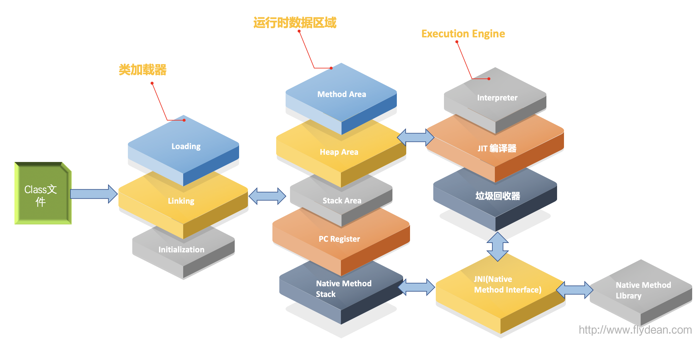

# jvm
gc

一般情况 。0.1s 级别
1s级别 特殊情况 堆内存占用 85%
由于在gc时候会停止处理，导致前端请求会超时，严重还会导致行程满。

引用访问量 14亿

可能原因 等待io gc
jvm stop the world日志
JVM GC中Stop the world案例实战
https://blog.csdn.net/sinat_25306771/article/details/52374498

jvm 打印类加载日志
java -verbose:class cn.wdidada.test.Hello

​```shell script
cd target/classes/
192:classes ibqo$ java -verbose:class cn.wdidada.test.Hello
[Opened /Library/Java/JavaVirtualMachines/jdk1.8.0_211.jdk/Contents/Home/jre/lib/rt.jar]
[Loaded java.lang.Object from /Library/Java/JavaVirtualMachines/jdk1.8.0_211.jdk/Contents/Home/jre/lib/rt.jar]
[Loaded java.io.Serializable from /Library/Java/JavaVirtualMachines/jdk1.8.0_211.jdk/Contents/Home/jre/lib/rt.jar]
[Loaded java.lang.Comparable from /Library/Java/JavaVirtualMachines/jdk1.8.0_211.jdk/Contents/Home/jre/lib/rt.jar]
[Loaded java.lang.CharSequence from /Library/Java/JavaVirtualMachines/jdk1.8.0_211.jdk/Contents/Home/jre/lib/rt.jar]
[Loaded java.lang.String from /Library/Java/JavaVirtualMachines/jdk1.8.0_211.jdk/Contents/Home/jre/lib/rt.jar]
[Loaded java.lang.reflect.AnnotatedElement from /Library/Java/JavaVirtualMachines/jdk1.8.0_211.jdk/Contents/Home/jre/lib/rt.jar]
[Loaded java.lang.reflect.GenericDeclaration from /Library/Java/JavaVirtualMachines/jdk1.8.0_211.jdk/Contents/Home/jre/lib/rt.jar]
[Loaded java.lang.reflect.Type from /Library/Java/JavaVirtualMachines/jdk1.8.0_211.jdk/Contents/Home/jre/lib/rt.jar]
[Loaded java.lang.Class from /Library/Java/JavaVirtualMachines/jdk1.8.0_211.jdk/Contents/Home/jre/lib/rt.jar]
[Loaded java.lang.Cloneable from /Library/Java/JavaVirtualMachines/jdk1.8.0_211.jdk/Contents/Home/jre/lib/rt.jar]
[Loaded java.lang.ClassLoader from /Library/Java/JavaVirtualMachines/jdk1.8.0_211.jdk/Contents/Home/jre/lib/rt.jar]
[Loaded java.lang.System from /Library/Java/JavaVirtualMachines/jdk1.8.0_211.jdk/Contents/Home/jre/lib/rt.jar]
[Loaded java.lang.Throwable from /Library/Java/JavaVirtualMachines/jdk1.8.0_211.jdk/Contents/Home/jre/lib/rt.jar]
[Loaded java.lang.Error from /Library/Java/JavaVirtualMachines/jdk1.8.0_211.jdk/Contents/Home/jre/lib/rt.jar]
[Loaded java.lang.ThreadDeath from /Library/Java/JavaVirtualMachines/jdk1.8.0_211.jdk/Contents/Home/jre/lib/rt.jar]
[Loaded java.lang.Exception from /Library/Java/JavaVirtualMachines/jdk1.8.0_211.jdk/Contents/Home/jre/lib/rt.jar]
[Loaded java.lang.RuntimeException from /Library/Java/JavaVirtualMachines/jdk1.8.0_211.jdk/Contents/Home/jre/lib/rt.jar]
[Loaded java.lang.SecurityManager from /Library/Java/JavaVirtualMachines/jdk1.8.0_211.jdk/Contents/Home/jre/lib/rt.jar]
[Loaded java.security.ProtectionDomain from /Library/Java/JavaVirtualMachines/jdk1.8.0_211.jdk/Contents/Home/jre/lib/rt.jar]
[Loaded java.security.AccessControlContext from /Library/Java/JavaVirtualMachines/jdk1.8.0_211.jdk/Contents/Home/jre/lib/rt.jar]
[Loaded java.security.SecureClassLoader from /Library/Java/JavaVirtualMachines/jdk1.8.0_211.jdk/Contents/Home/jre/lib/rt.jar]
[Loaded java.lang.ReflectiveOperationException from /Library/Java/JavaVirtualMachines/jdk1.8.0_211.jdk/Contents/Home/jre/lib/rt.jar]
[Loaded java.lang.ClassNotFoundException from /Library/Java/JavaVirtualMachines/jdk1.8.0_211.jdk/Contents/Home/jre/lib/rt.jar]
[Loaded java.lang.LinkageError from /Library/Java/JavaVirtualMachines/jdk1.8.0_211.jdk/Contents/Home/jre/lib/rt.jar]
[Loaded java.lang.NoClassDefFoundError from /Library/Java/JavaVirtualMachines/jdk1.8.0_211.jdk/Contents/Home/jre/lib/rt.jar]
[Loaded java.lang.ClassCastException from /Library/Java/JavaVirtualMachines/jdk1.8.0_211.jdk/Contents/Home/jre/lib/rt.jar]
[Loaded java.lang.ArrayStoreException from /Library/Java/JavaVirtualMachines/jdk1.8.0_211.jdk/Contents/Home/jre/lib/rt.jar]
[Loaded java.lang.VirtualMachineError from /Library/Java/JavaVirtualMachines/jdk1.8.0_211.jdk/Contents/Home/jre/lib/rt.jar]
[Loaded java.lang.OutOfMemoryError from /Library/Java/JavaVirtualMachines/jdk1.8.0_211.jdk/Contents/Home/jre/lib/rt.jar]
[Loaded java.lang.StackOverflowError from /Library/Java/JavaVirtualMachines/jdk1.8.0_211.jdk/Contents/Home/jre/lib/rt.jar]
[Loaded java.lang.IllegalMonitorStateException from /Library/Java/JavaVirtualMachines/jdk1.8.0_211.jdk/Contents/Home/jre/lib/rt.jar]
[Loaded java.lang.ref.Reference from /Library/Java/JavaVirtualMachines/jdk1.8.0_211.jdk/Contents/Home/jre/lib/rt.jar]
[Loaded java.lang.ref.SoftReference from /Library/Java/JavaVirtualMachines/jdk1.8.0_211.jdk/Contents/Home/jre/lib/rt.jar]
[Loaded java.lang.ref.WeakReference from /Library/Java/JavaVirtualMachines/jdk1.8.0_211.jdk/Contents/Home/jre/lib/rt.jar]
[Loaded java.lang.ref.FinalReference from /Library/Java/JavaVirtualMachines/jdk1.8.0_211.jdk/Contents/Home/jre/lib/rt.jar]
[Loaded java.lang.ref.PhantomReference from /Library/Java/JavaVirtualMachines/jdk1.8.0_211.jdk/Contents/Home/jre/lib/rt.jar]
[Loaded sun.misc.Cleaner from /Library/Java/JavaVirtualMachines/jdk1.8.0_211.jdk/Contents/Home/jre/lib/rt.jar]
[Loaded java.lang.ref.Finalizer from /Library/Java/JavaVirtualMachines/jdk1.8.0_211.jdk/Contents/Home/jre/lib/rt.jar]
[Loaded java.lang.ref.ReferenceQueue from /Library/Java/JavaVirtualMachines/jdk1.8.0_211.jdk/Contents/Home/jre/lib/rt.jar]
[Loaded java.lang.Runnable from /Library/Java/JavaVirtualMachines/jdk1.8.0_211.jdk/Contents/Home/jre/lib/rt.jar]
[Loaded java.lang.Thread from /Library/Java/JavaVirtualMachines/jdk1.8.0_211.jdk/Contents/Home/jre/lib/rt.jar]
[Loaded java.lang.Thread$UncaughtExceptionHandler from /Library/Java/JavaVirtualMachines/jdk1.8.0_211.jdk/Contents/Home/jre/lib/rt.jar]
[Loaded java.lang.ThreadGroup from /Library/Java/JavaVirtualMachines/jdk1.8.0_211.jdk/Contents/Home/jre/lib/rt.jar]
[Loaded java.util.Map from /Library/Java/JavaVirtualMachines/jdk1.8.0_211.jdk/Contents/Home/jre/lib/rt.jar]
[Loaded java.util.Dictionary from /Library/Java/JavaVirtualMachines/jdk1.8.0_211.jdk/Contents/Home/jre/lib/rt.jar]
[Loaded java.util.Hashtable from /Library/Java/JavaVirtualMachines/jdk1.8.0_211.jdk/Contents/Home/jre/lib/rt.jar]
[Loaded java.util.Properties from /Library/Java/JavaVirtualMachines/jdk1.8.0_211.jdk/Contents/Home/jre/lib/rt.jar]
[Loaded java.lang.reflect.AccessibleObject from /Library/Java/JavaVirtualMachines/jdk1.8.0_211.jdk/Contents/Home/jre/lib/rt.jar]
[Loaded java.lang.reflect.Member from /Library/Java/JavaVirtualMachines/jdk1.8.0_211.jdk/Contents/Home/jre/lib/rt.jar]
[Loaded java.lang.reflect.Field from /Library/Java/JavaVirtualMachines/jdk1.8.0_211.jdk/Contents/Home/jre/lib/rt.jar]
[Loaded java.lang.reflect.Parameter from /Library/Java/JavaVirtualMachines/jdk1.8.0_211.jdk/Contents/Home/jre/lib/rt.jar]
[Loaded java.lang.reflect.Executable from /Library/Java/JavaVirtualMachines/jdk1.8.0_211.jdk/Contents/Home/jre/lib/rt.jar]
[Loaded java.lang.reflect.Method from /Library/Java/JavaVirtualMachines/jdk1.8.0_211.jdk/Contents/Home/jre/lib/rt.jar]
[Loaded java.lang.reflect.Constructor from /Library/Java/JavaVirtualMachines/jdk1.8.0_211.jdk/Contents/Home/jre/lib/rt.jar]
[Loaded sun.reflect.MagicAccessorImpl from /Library/Java/JavaVirtualMachines/jdk1.8.0_211.jdk/Contents/Home/jre/lib/rt.jar]
[Loaded sun.reflect.MethodAccessor from /Library/Java/JavaVirtualMachines/jdk1.8.0_211.jdk/Contents/Home/jre/lib/rt.jar]
[Loaded sun.reflect.MethodAccessorImpl from /Library/Java/JavaVirtualMachines/jdk1.8.0_211.jdk/Contents/Home/jre/lib/rt.jar]
[Loaded sun.reflect.ConstructorAccessor from /Library/Java/JavaVirtualMachines/jdk1.8.0_211.jdk/Contents/Home/jre/lib/rt.jar]
[Loaded sun.reflect.ConstructorAccessorImpl from /Library/Java/JavaVirtualMachines/jdk1.8.0_211.jdk/Contents/Home/jre/lib/rt.jar]
[Loaded sun.reflect.DelegatingClassLoader from /Library/Java/JavaVirtualMachines/jdk1.8.0_211.jdk/Contents/Home/jre/lib/rt.jar]
[Loaded sun.reflect.ConstantPool from /Library/Java/JavaVirtualMachines/jdk1.8.0_211.jdk/Contents/Home/jre/lib/rt.jar]
[Loaded sun.reflect.FieldAccessor from /Library/Java/JavaVirtualMachines/jdk1.8.0_211.jdk/Contents/Home/jre/lib/rt.jar]
[Loaded sun.reflect.FieldAccessorImpl from /Library/Java/JavaVirtualMachines/jdk1.8.0_211.jdk/Contents/Home/jre/lib/rt.jar]
[Loaded sun.reflect.UnsafeFieldAccessorImpl from /Library/Java/JavaVirtualMachines/jdk1.8.0_211.jdk/Contents/Home/jre/lib/rt.jar]
[Loaded sun.reflect.UnsafeStaticFieldAccessorImpl from /Library/Java/JavaVirtualMachines/jdk1.8.0_211.jdk/Contents/Home/jre/lib/rt.jar]
[Loaded java.lang.annotation.Annotation from /Library/Java/JavaVirtualMachines/jdk1.8.0_211.jdk/Contents/Home/jre/lib/rt.jar]
[Loaded sun.reflect.CallerSensitive from /Library/Java/JavaVirtualMachines/jdk1.8.0_211.jdk/Contents/Home/jre/lib/rt.jar]
[Loaded java.lang.invoke.MethodHandle from /Library/Java/JavaVirtualMachines/jdk1.8.0_211.jdk/Contents/Home/jre/lib/rt.jar]
[Loaded java.lang.invoke.DirectMethodHandle from /Library/Java/JavaVirtualMachines/jdk1.8.0_211.jdk/Contents/Home/jre/lib/rt.jar]
[Loaded java.lang.invoke.MemberName from /Library/Java/JavaVirtualMachines/jdk1.8.0_211.jdk/Contents/Home/jre/lib/rt.jar]
[Loaded java.lang.invoke.MethodHandleNatives from /Library/Java/JavaVirtualMachines/jdk1.8.0_211.jdk/Contents/Home/jre/lib/rt.jar]
[Loaded java.lang.invoke.LambdaForm from /Library/Java/JavaVirtualMachines/jdk1.8.0_211.jdk/Contents/Home/jre/lib/rt.jar]
[Loaded java.lang.invoke.MethodType from /Library/Java/JavaVirtualMachines/jdk1.8.0_211.jdk/Contents/Home/jre/lib/rt.jar]
[Loaded java.lang.BootstrapMethodError from /Library/Java/JavaVirtualMachines/jdk1.8.0_211.jdk/Contents/Home/jre/lib/rt.jar]
[Loaded java.lang.invoke.CallSite from /Library/Java/JavaVirtualMachines/jdk1.8.0_211.jdk/Contents/Home/jre/lib/rt.jar]
[Loaded java.lang.invoke.ConstantCallSite from /Library/Java/JavaVirtualMachines/jdk1.8.0_211.jdk/Contents/Home/jre/lib/rt.jar]
[Loaded java.lang.invoke.MutableCallSite from /Library/Java/JavaVirtualMachines/jdk1.8.0_211.jdk/Contents/Home/jre/lib/rt.jar]
[Loaded java.lang.invoke.VolatileCallSite from /Library/Java/JavaVirtualMachines/jdk1.8.0_211.jdk/Contents/Home/jre/lib/rt.jar]
[Loaded java.lang.Appendable from /Library/Java/JavaVirtualMachines/jdk1.8.0_211.jdk/Contents/Home/jre/lib/rt.jar]
[Loaded java.lang.AbstractStringBuilder from /Library/Java/JavaVirtualMachines/jdk1.8.0_211.jdk/Contents/Home/jre/lib/rt.jar]
[Loaded java.lang.StringBuffer from /Library/Java/JavaVirtualMachines/jdk1.8.0_211.jdk/Contents/Home/jre/lib/rt.jar]
[Loaded java.lang.StringBuilder from /Library/Java/JavaVirtualMachines/jdk1.8.0_211.jdk/Contents/Home/jre/lib/rt.jar]
[Loaded sun.misc.Unsafe from /Library/Java/JavaVirtualMachines/jdk1.8.0_211.jdk/Contents/Home/jre/lib/rt.jar]
[Loaded java.lang.AutoCloseable from /Library/Java/JavaVirtualMachines/jdk1.8.0_211.jdk/Contents/Home/jre/lib/rt.jar]
[Loaded java.io.Closeable from /Library/Java/JavaVirtualMachines/jdk1.8.0_211.jdk/Contents/Home/jre/lib/rt.jar]
[Loaded java.io.InputStream from /Library/Java/JavaVirtualMachines/jdk1.8.0_211.jdk/Contents/Home/jre/lib/rt.jar]
[Loaded java.io.ByteArrayInputStream from /Library/Java/JavaVirtualMachines/jdk1.8.0_211.jdk/Contents/Home/jre/lib/rt.jar]
[Loaded java.io.File from /Library/Java/JavaVirtualMachines/jdk1.8.0_211.jdk/Contents/Home/jre/lib/rt.jar]
[Loaded java.net.URLClassLoader from /Library/Java/JavaVirtualMachines/jdk1.8.0_211.jdk/Contents/Home/jre/lib/rt.jar]
[Loaded java.net.URL from /Library/Java/JavaVirtualMachines/jdk1.8.0_211.jdk/Contents/Home/jre/lib/rt.jar]
[Loaded java.util.jar.Manifest from /Library/Java/JavaVirtualMachines/jdk1.8.0_211.jdk/Contents/Home/jre/lib/rt.jar]
[Loaded sun.misc.Launcher from /Library/Java/JavaVirtualMachines/jdk1.8.0_211.jdk/Contents/Home/jre/lib/rt.jar]
[Loaded sun.misc.Launcher$AppClassLoader from /Library/Java/JavaVirtualMachines/jdk1.8.0_211.jdk/Contents/Home/jre/lib/rt.jar]
[Loaded sun.misc.Launcher$ExtClassLoader from /Library/Java/JavaVirtualMachines/jdk1.8.0_211.jdk/Contents/Home/jre/lib/rt.jar]
[Loaded java.security.CodeSource from /Library/Java/JavaVirtualMachines/jdk1.8.0_211.jdk/Contents/Home/jre/lib/rt.jar]
[Loaded java.lang.StackTraceElement from /Library/Java/JavaVirtualMachines/jdk1.8.0_211.jdk/Contents/Home/jre/lib/rt.jar]
[Loaded java.nio.Buffer from /Library/Java/JavaVirtualMachines/jdk1.8.0_211.jdk/Contents/Home/jre/lib/rt.jar]
[Loaded java.lang.Boolean from /Library/Java/JavaVirtualMachines/jdk1.8.0_211.jdk/Contents/Home/jre/lib/rt.jar]
[Loaded java.lang.Character from /Library/Java/JavaVirtualMachines/jdk1.8.0_211.jdk/Contents/Home/jre/lib/rt.jar]
[Loaded java.lang.Number from /Library/Java/JavaVirtualMachines/jdk1.8.0_211.jdk/Contents/Home/jre/lib/rt.jar]
[Loaded java.lang.Float from /Library/Java/JavaVirtualMachines/jdk1.8.0_211.jdk/Contents/Home/jre/lib/rt.jar]
[Loaded java.lang.Double from /Library/Java/JavaVirtualMachines/jdk1.8.0_211.jdk/Contents/Home/jre/lib/rt.jar]
[Loaded java.lang.Byte from /Library/Java/JavaVirtualMachines/jdk1.8.0_211.jdk/Contents/Home/jre/lib/rt.jar]
[Loaded java.lang.Short from /Library/Java/JavaVirtualMachines/jdk1.8.0_211.jdk/Contents/Home/jre/lib/rt.jar]
[Loaded java.lang.Integer from /Library/Java/JavaVirtualMachines/jdk1.8.0_211.jdk/Contents/Home/jre/lib/rt.jar]
[Loaded java.lang.Long from /Library/Java/JavaVirtualMachines/jdk1.8.0_211.jdk/Contents/Home/jre/lib/rt.jar]
[Loaded java.lang.NullPointerException from /Library/Java/JavaVirtualMachines/jdk1.8.0_211.jdk/Contents/Home/jre/lib/rt.jar]
[Loaded java.lang.ArithmeticException from /Library/Java/JavaVirtualMachines/jdk1.8.0_211.jdk/Contents/Home/jre/lib/rt.jar]
[Loaded java.io.ObjectStreamField from /Library/Java/JavaVirtualMachines/jdk1.8.0_211.jdk/Contents/Home/jre/lib/rt.jar]
[Loaded java.util.Comparator from /Library/Java/JavaVirtualMachines/jdk1.8.0_211.jdk/Contents/Home/jre/lib/rt.jar]
[Loaded java.lang.String$CaseInsensitiveComparator from /Library/Java/JavaVirtualMachines/jdk1.8.0_211.jdk/Contents/Home/jre/lib/rt.jar]
[Loaded java.security.Guard from /Library/Java/JavaVirtualMachines/jdk1.8.0_211.jdk/Contents/Home/jre/lib/rt.jar]
[Loaded java.security.Permission from /Library/Java/JavaVirtualMachines/jdk1.8.0_211.jdk/Contents/Home/jre/lib/rt.jar]
[Loaded java.security.BasicPermission from /Library/Java/JavaVirtualMachines/jdk1.8.0_211.jdk/Contents/Home/jre/lib/rt.jar]
[Loaded java.lang.RuntimePermission from /Library/Java/JavaVirtualMachines/jdk1.8.0_211.jdk/Contents/Home/jre/lib/rt.jar]
[Loaded java.security.AccessController from /Library/Java/JavaVirtualMachines/jdk1.8.0_211.jdk/Contents/Home/jre/lib/rt.jar]
[Loaded java.lang.reflect.ReflectPermission from /Library/Java/JavaVirtualMachines/jdk1.8.0_211.jdk/Contents/Home/jre/lib/rt.jar]
[Loaded java.security.PrivilegedAction from /Library/Java/JavaVirtualMachines/jdk1.8.0_211.jdk/Contents/Home/jre/lib/rt.jar]
[Loaded sun.reflect.ReflectionFactory$GetReflectionFactoryAction from /Library/Java/JavaVirtualMachines/jdk1.8.0_211.jdk/Contents/Home/jre/lib/rt.jar]
[Loaded java.security.cert.Certificate from /Library/Java/JavaVirtualMachines/jdk1.8.0_211.jdk/Contents/Home/jre/lib/rt.jar]
[Loaded java.lang.Iterable from /Library/Java/JavaVirtualMachines/jdk1.8.0_211.jdk/Contents/Home/jre/lib/rt.jar]
[Loaded java.util.Collection from /Library/Java/JavaVirtualMachines/jdk1.8.0_211.jdk/Contents/Home/jre/lib/rt.jar]
[Loaded java.util.List from /Library/Java/JavaVirtualMachines/jdk1.8.0_211.jdk/Contents/Home/jre/lib/rt.jar]
[Loaded java.util.RandomAccess from /Library/Java/JavaVirtualMachines/jdk1.8.0_211.jdk/Contents/Home/jre/lib/rt.jar]
[Loaded java.util.AbstractCollection from /Library/Java/JavaVirtualMachines/jdk1.8.0_211.jdk/Contents/Home/jre/lib/rt.jar]
[Loaded java.util.AbstractList from /Library/Java/JavaVirtualMachines/jdk1.8.0_211.jdk/Contents/Home/jre/lib/rt.jar]
[Loaded java.util.Vector from /Library/Java/JavaVirtualMachines/jdk1.8.0_211.jdk/Contents/Home/jre/lib/rt.jar]
[Loaded java.util.Stack from /Library/Java/JavaVirtualMachines/jdk1.8.0_211.jdk/Contents/Home/jre/lib/rt.jar]
[Loaded sun.reflect.ReflectionFactory from /Library/Java/JavaVirtualMachines/jdk1.8.0_211.jdk/Contents/Home/jre/lib/rt.jar]
[Loaded java.lang.ref.Reference$Lock from /Library/Java/JavaVirtualMachines/jdk1.8.0_211.jdk/Contents/Home/jre/lib/rt.jar]
[Loaded java.lang.ref.Reference$ReferenceHandler from /Library/Java/JavaVirtualMachines/jdk1.8.0_211.jdk/Contents/Home/jre/lib/rt.jar]
[Loaded java.lang.InterruptedException from /Library/Java/JavaVirtualMachines/jdk1.8.0_211.jdk/Contents/Home/jre/lib/rt.jar]
[Loaded java.util.ArrayList from /Library/Java/JavaVirtualMachines/jdk1.8.0_211.jdk/Contents/Home/jre/lib/rt.jar]
[Loaded java.util.Collections from /Library/Java/JavaVirtualMachines/jdk1.8.0_211.jdk/Contents/Home/jre/lib/rt.jar]
[Loaded java.util.Set from /Library/Java/JavaVirtualMachines/jdk1.8.0_211.jdk/Contents/Home/jre/lib/rt.jar]
[Loaded java.util.AbstractSet from /Library/Java/JavaVirtualMachines/jdk1.8.0_211.jdk/Contents/Home/jre/lib/rt.jar]
[Loaded java.util.Collections$EmptySet from /Library/Java/JavaVirtualMachines/jdk1.8.0_211.jdk/Contents/Home/jre/lib/rt.jar]
[Loaded java.util.Collections$EmptyList from /Library/Java/JavaVirtualMachines/jdk1.8.0_211.jdk/Contents/Home/jre/lib/rt.jar]
[Loaded java.util.AbstractMap from /Library/Java/JavaVirtualMachines/jdk1.8.0_211.jdk/Contents/Home/jre/lib/rt.jar]
[Loaded java.util.Collections$EmptyMap from /Library/Java/JavaVirtualMachines/jdk1.8.0_211.jdk/Contents/Home/jre/lib/rt.jar]
[Loaded java.util.Collections$UnmodifiableCollection from /Library/Java/JavaVirtualMachines/jdk1.8.0_211.jdk/Contents/Home/jre/lib/rt.jar]
[Loaded java.util.Collections$UnmodifiableList from /Library/Java/JavaVirtualMachines/jdk1.8.0_211.jdk/Contents/Home/jre/lib/rt.jar]
[Loaded java.util.Collections$UnmodifiableRandomAccessList from /Library/Java/JavaVirtualMachines/jdk1.8.0_211.jdk/Contents/Home/jre/lib/rt.jar]
[Loaded java.lang.ref.ReferenceQueue$Null from /Library/Java/JavaVirtualMachines/jdk1.8.0_211.jdk/Contents/Home/jre/lib/rt.jar]
[Loaded java.lang.ref.ReferenceQueue$Lock from /Library/Java/JavaVirtualMachines/jdk1.8.0_211.jdk/Contents/Home/jre/lib/rt.jar]
[Loaded sun.misc.JavaLangRefAccess from /Library/Java/JavaVirtualMachines/jdk1.8.0_211.jdk/Contents/Home/jre/lib/rt.jar]
[Loaded java.lang.ref.Reference$1 from /Library/Java/JavaVirtualMachines/jdk1.8.0_211.jdk/Contents/Home/jre/lib/rt.jar]
[Loaded sun.misc.SharedSecrets from /Library/Java/JavaVirtualMachines/jdk1.8.0_211.jdk/Contents/Home/jre/lib/rt.jar]
[Loaded java.lang.IncompatibleClassChangeError from /Library/Java/JavaVirtualMachines/jdk1.8.0_211.jdk/Contents/Home/jre/lib/rt.jar]
[Loaded java.lang.NoSuchMethodError from /Library/Java/JavaVirtualMachines/jdk1.8.0_211.jdk/Contents/Home/jre/lib/rt.jar]
[Loaded sun.reflect.Reflection from /Library/Java/JavaVirtualMachines/jdk1.8.0_211.jdk/Contents/Home/jre/lib/rt.jar]
[Loaded java.util.HashMap from /Library/Java/JavaVirtualMachines/jdk1.8.0_211.jdk/Contents/Home/jre/lib/rt.jar]
[Loaded java.util.Map$Entry from /Library/Java/JavaVirtualMachines/jdk1.8.0_211.jdk/Contents/Home/jre/lib/rt.jar]
[Loaded java.util.HashMap$Node from /Library/Java/JavaVirtualMachines/jdk1.8.0_211.jdk/Contents/Home/jre/lib/rt.jar]
[Loaded sun.misc.VM from /Library/Java/JavaVirtualMachines/jdk1.8.0_211.jdk/Contents/Home/jre/lib/rt.jar]
[Loaded java.util.Hashtable$Entry from /Library/Java/JavaVirtualMachines/jdk1.8.0_211.jdk/Contents/Home/jre/lib/rt.jar]
[Loaded java.lang.Math from /Library/Java/JavaVirtualMachines/jdk1.8.0_211.jdk/Contents/Home/jre/lib/rt.jar]
[Loaded java.lang.ref.Finalizer$FinalizerThread from /Library/Java/JavaVirtualMachines/jdk1.8.0_211.jdk/Contents/Home/jre/lib/rt.jar]
[Loaded java.nio.charset.Charset from /Library/Java/JavaVirtualMachines/jdk1.8.0_211.jdk/Contents/Home/jre/lib/rt.jar]
[Loaded java.nio.charset.spi.CharsetProvider from /Library/Java/JavaVirtualMachines/jdk1.8.0_211.jdk/Contents/Home/jre/lib/rt.jar]
[Loaded sun.nio.cs.FastCharsetProvider from /Library/Java/JavaVirtualMachines/jdk1.8.0_211.jdk/Contents/Home/jre/lib/rt.jar]
[Loaded sun.nio.cs.StandardCharsets from /Library/Java/JavaVirtualMachines/jdk1.8.0_211.jdk/Contents/Home/jre/lib/rt.jar]
[Loaded sun.util.PreHashedMap from /Library/Java/JavaVirtualMachines/jdk1.8.0_211.jdk/Contents/Home/jre/lib/rt.jar]
[Loaded sun.nio.cs.StandardCharsets$Aliases from /Library/Java/JavaVirtualMachines/jdk1.8.0_211.jdk/Contents/Home/jre/lib/rt.jar]
[Loaded sun.nio.cs.StandardCharsets$Classes from /Library/Java/JavaVirtualMachines/jdk1.8.0_211.jdk/Contents/Home/jre/lib/rt.jar]
[Loaded sun.nio.cs.StandardCharsets$Cache from /Library/Java/JavaVirtualMachines/jdk1.8.0_211.jdk/Contents/Home/jre/lib/rt.jar]
[Loaded java.lang.ThreadLocal from /Library/Java/JavaVirtualMachines/jdk1.8.0_211.jdk/Contents/Home/jre/lib/rt.jar]
[Loaded java.util.concurrent.atomic.AtomicInteger from /Library/Java/JavaVirtualMachines/jdk1.8.0_211.jdk/Contents/Home/jre/lib/rt.jar]
[Loaded java.lang.Class$3 from /Library/Java/JavaVirtualMachines/jdk1.8.0_211.jdk/Contents/Home/jre/lib/rt.jar]
[Loaded java.lang.Class$ReflectionData from /Library/Java/JavaVirtualMachines/jdk1.8.0_211.jdk/Contents/Home/jre/lib/rt.jar]
[Loaded java.lang.Class$Atomic from /Library/Java/JavaVirtualMachines/jdk1.8.0_211.jdk/Contents/Home/jre/lib/rt.jar]
[Loaded sun.reflect.generics.repository.AbstractRepository from /Library/Java/JavaVirtualMachines/jdk1.8.0_211.jdk/Contents/Home/jre/lib/rt.jar]
[Loaded sun.reflect.generics.repository.GenericDeclRepository from /Library/Java/JavaVirtualMachines/jdk1.8.0_211.jdk/Contents/Home/jre/lib/rt.jar]
[Loaded sun.reflect.generics.repository.ClassRepository from /Library/Java/JavaVirtualMachines/jdk1.8.0_211.jdk/Contents/Home/jre/lib/rt.jar]
[Loaded java.lang.Class$AnnotationData from /Library/Java/JavaVirtualMachines/jdk1.8.0_211.jdk/Contents/Home/jre/lib/rt.jar]
[Loaded sun.reflect.annotation.AnnotationType from /Library/Java/JavaVirtualMachines/jdk1.8.0_211.jdk/Contents/Home/jre/lib/rt.jar]
[Loaded java.util.WeakHashMap from /Library/Java/JavaVirtualMachines/jdk1.8.0_211.jdk/Contents/Home/jre/lib/rt.jar]
[Loaded java.lang.ClassValue$ClassValueMap from /Library/Java/JavaVirtualMachines/jdk1.8.0_211.jdk/Contents/Home/jre/lib/rt.jar]
[Loaded java.lang.reflect.Modifier from /Library/Java/JavaVirtualMachines/jdk1.8.0_211.jdk/Contents/Home/jre/lib/rt.jar]
[Loaded sun.reflect.LangReflectAccess from /Library/Java/JavaVirtualMachines/jdk1.8.0_211.jdk/Contents/Home/jre/lib/rt.jar]
[Loaded java.lang.reflect.ReflectAccess from /Library/Java/JavaVirtualMachines/jdk1.8.0_211.jdk/Contents/Home/jre/lib/rt.jar]
[Loaded java.util.Arrays from /Library/Java/JavaVirtualMachines/jdk1.8.0_211.jdk/Contents/Home/jre/lib/rt.jar]
[Loaded sun.nio.cs.HistoricallyNamedCharset from /Library/Java/JavaVirtualMachines/jdk1.8.0_211.jdk/Contents/Home/jre/lib/rt.jar]
[Loaded sun.nio.cs.Unicode from /Library/Java/JavaVirtualMachines/jdk1.8.0_211.jdk/Contents/Home/jre/lib/rt.jar]
[Loaded sun.nio.cs.UTF_8 from /Library/Java/JavaVirtualMachines/jdk1.8.0_211.jdk/Contents/Home/jre/lib/rt.jar]
[Loaded java.lang.Class$1 from /Library/Java/JavaVirtualMachines/jdk1.8.0_211.jdk/Contents/Home/jre/lib/rt.jar]
[Loaded sun.reflect.ReflectionFactory$1 from /Library/Java/JavaVirtualMachines/jdk1.8.0_211.jdk/Contents/Home/jre/lib/rt.jar]
[Loaded sun.reflect.NativeConstructorAccessorImpl from /Library/Java/JavaVirtualMachines/jdk1.8.0_211.jdk/Contents/Home/jre/lib/rt.jar]
[Loaded sun.reflect.DelegatingConstructorAccessorImpl from /Library/Java/JavaVirtualMachines/jdk1.8.0_211.jdk/Contents/Home/jre/lib/rt.jar]
[Loaded java.lang.StringCoding from /Library/Java/JavaVirtualMachines/jdk1.8.0_211.jdk/Contents/Home/jre/lib/rt.jar]
[Loaded java.lang.ThreadLocal$ThreadLocalMap from /Library/Java/JavaVirtualMachines/jdk1.8.0_211.jdk/Contents/Home/jre/lib/rt.jar]
[Loaded java.lang.ThreadLocal$ThreadLocalMap$Entry from /Library/Java/JavaVirtualMachines/jdk1.8.0_211.jdk/Contents/Home/jre/lib/rt.jar]
[Loaded java.lang.StringCoding$StringDecoder from /Library/Java/JavaVirtualMachines/jdk1.8.0_211.jdk/Contents/Home/jre/lib/rt.jar]
[Loaded sun.nio.cs.ArrayDecoder from /Library/Java/JavaVirtualMachines/jdk1.8.0_211.jdk/Contents/Home/jre/lib/rt.jar]
[Loaded java.nio.charset.CharsetDecoder from /Library/Java/JavaVirtualMachines/jdk1.8.0_211.jdk/Contents/Home/jre/lib/rt.jar]
[Loaded sun.nio.cs.UTF_8$Decoder from /Library/Java/JavaVirtualMachines/jdk1.8.0_211.jdk/Contents/Home/jre/lib/rt.jar]
[Loaded java.nio.charset.CodingErrorAction from /Library/Java/JavaVirtualMachines/jdk1.8.0_211.jdk/Contents/Home/jre/lib/rt.jar]
[Loaded java.util.Hashtable$EntrySet from /Library/Java/JavaVirtualMachines/jdk1.8.0_211.jdk/Contents/Home/jre/lib/rt.jar]
[Loaded java.util.Collections$SynchronizedCollection from /Library/Java/JavaVirtualMachines/jdk1.8.0_211.jdk/Contents/Home/jre/lib/rt.jar]
[Loaded java.util.Collections$SynchronizedSet from /Library/Java/JavaVirtualMachines/jdk1.8.0_211.jdk/Contents/Home/jre/lib/rt.jar]
[Loaded java.util.Objects from /Library/Java/JavaVirtualMachines/jdk1.8.0_211.jdk/Contents/Home/jre/lib/rt.jar]
[Loaded java.util.Enumeration from /Library/Java/JavaVirtualMachines/jdk1.8.0_211.jdk/Contents/Home/jre/lib/rt.jar]
[Loaded java.util.Iterator from /Library/Java/JavaVirtualMachines/jdk1.8.0_211.jdk/Contents/Home/jre/lib/rt.jar]
[Loaded java.util.Hashtable$Enumerator from /Library/Java/JavaVirtualMachines/jdk1.8.0_211.jdk/Contents/Home/jre/lib/rt.jar]
[Loaded java.lang.Runtime from /Library/Java/JavaVirtualMachines/jdk1.8.0_211.jdk/Contents/Home/jre/lib/rt.jar]
[Loaded sun.misc.Version from /Library/Java/JavaVirtualMachines/jdk1.8.0_211.jdk/Contents/Home/jre/lib/rt.jar]
[Loaded java.io.FileInputStream from /Library/Java/JavaVirtualMachines/jdk1.8.0_211.jdk/Contents/Home/jre/lib/rt.jar]
[Loaded java.io.FileDescriptor from /Library/Java/JavaVirtualMachines/jdk1.8.0_211.jdk/Contents/Home/jre/lib/rt.jar]
[Loaded sun.misc.JavaIOFileDescriptorAccess from /Library/Java/JavaVirtualMachines/jdk1.8.0_211.jdk/Contents/Home/jre/lib/rt.jar]
[Loaded java.io.FileDescriptor$1 from /Library/Java/JavaVirtualMachines/jdk1.8.0_211.jdk/Contents/Home/jre/lib/rt.jar]
[Loaded java.io.Flushable from /Library/Java/JavaVirtualMachines/jdk1.8.0_211.jdk/Contents/Home/jre/lib/rt.jar]
[Loaded java.io.OutputStream from /Library/Java/JavaVirtualMachines/jdk1.8.0_211.jdk/Contents/Home/jre/lib/rt.jar]
[Loaded java.io.FileOutputStream from /Library/Java/JavaVirtualMachines/jdk1.8.0_211.jdk/Contents/Home/jre/lib/rt.jar]
[Loaded java.io.FilterInputStream from /Library/Java/JavaVirtualMachines/jdk1.8.0_211.jdk/Contents/Home/jre/lib/rt.jar]
[Loaded java.io.BufferedInputStream from /Library/Java/JavaVirtualMachines/jdk1.8.0_211.jdk/Contents/Home/jre/lib/rt.jar]
[Loaded java.util.concurrent.atomic.AtomicReferenceFieldUpdater from /Library/Java/JavaVirtualMachines/jdk1.8.0_211.jdk/Contents/Home/jre/lib/rt.jar]
[Loaded java.util.concurrent.atomic.AtomicReferenceFieldUpdater$AtomicReferenceFieldUpdaterImpl from /Library/Java/JavaVirtualMachines/jdk1.8.0_211.jdk/Contents/Home/jre/lib/rt.jar]
[Loaded java.security.PrivilegedExceptionAction from /Library/Java/JavaVirtualMachines/jdk1.8.0_211.jdk/Contents/Home/jre/lib/rt.jar]
[Loaded java.util.concurrent.atomic.AtomicReferenceFieldUpdater$AtomicReferenceFieldUpdaterImpl$1 from /Library/Java/JavaVirtualMachines/jdk1.8.0_211.jdk/Contents/Home/jre/lib/rt.jar]
[Loaded sun.reflect.misc.ReflectUtil from /Library/Java/JavaVirtualMachines/jdk1.8.0_211.jdk/Contents/Home/jre/lib/rt.jar]
[Loaded java.io.FilterOutputStream from /Library/Java/JavaVirtualMachines/jdk1.8.0_211.jdk/Contents/Home/jre/lib/rt.jar]
[Loaded java.io.PrintStream from /Library/Java/JavaVirtualMachines/jdk1.8.0_211.jdk/Contents/Home/jre/lib/rt.jar]
[Loaded java.io.BufferedOutputStream from /Library/Java/JavaVirtualMachines/jdk1.8.0_211.jdk/Contents/Home/jre/lib/rt.jar]
[Loaded java.io.Writer from /Library/Java/JavaVirtualMachines/jdk1.8.0_211.jdk/Contents/Home/jre/lib/rt.jar]
[Loaded java.io.OutputStreamWriter from /Library/Java/JavaVirtualMachines/jdk1.8.0_211.jdk/Contents/Home/jre/lib/rt.jar]
[Loaded sun.nio.cs.StreamEncoder from /Library/Java/JavaVirtualMachines/jdk1.8.0_211.jdk/Contents/Home/jre/lib/rt.jar]
[Loaded sun.security.action.GetPropertyAction from /Library/Java/JavaVirtualMachines/jdk1.8.0_211.jdk/Contents/Home/jre/lib/rt.jar]
[Loaded sun.nio.cs.ArrayEncoder from /Library/Java/JavaVirtualMachines/jdk1.8.0_211.jdk/Contents/Home/jre/lib/rt.jar]
[Loaded java.nio.charset.CharsetEncoder from /Library/Java/JavaVirtualMachines/jdk1.8.0_211.jdk/Contents/Home/jre/lib/rt.jar]
[Loaded sun.nio.cs.UTF_8$Encoder from /Library/Java/JavaVirtualMachines/jdk1.8.0_211.jdk/Contents/Home/jre/lib/rt.jar]
[Loaded java.nio.ByteBuffer from /Library/Java/JavaVirtualMachines/jdk1.8.0_211.jdk/Contents/Home/jre/lib/rt.jar]
[Loaded java.nio.HeapByteBuffer from /Library/Java/JavaVirtualMachines/jdk1.8.0_211.jdk/Contents/Home/jre/lib/rt.jar]
[Loaded java.nio.Bits from /Library/Java/JavaVirtualMachines/jdk1.8.0_211.jdk/Contents/Home/jre/lib/rt.jar]
[Loaded java.nio.ByteOrder from /Library/Java/JavaVirtualMachines/jdk1.8.0_211.jdk/Contents/Home/jre/lib/rt.jar]
[Loaded java.util.concurrent.atomic.AtomicLong from /Library/Java/JavaVirtualMachines/jdk1.8.0_211.jdk/Contents/Home/jre/lib/rt.jar]
[Loaded sun.misc.JavaNioAccess from /Library/Java/JavaVirtualMachines/jdk1.8.0_211.jdk/Contents/Home/jre/lib/rt.jar]
[Loaded java.nio.Bits$1 from /Library/Java/JavaVirtualMachines/jdk1.8.0_211.jdk/Contents/Home/jre/lib/rt.jar]
[Loaded java.io.BufferedWriter from /Library/Java/JavaVirtualMachines/jdk1.8.0_211.jdk/Contents/Home/jre/lib/rt.jar]
[Loaded java.io.DefaultFileSystem from /Library/Java/JavaVirtualMachines/jdk1.8.0_211.jdk/Contents/Home/jre/lib/rt.jar]
[Loaded java.io.FileSystem from /Library/Java/JavaVirtualMachines/jdk1.8.0_211.jdk/Contents/Home/jre/lib/rt.jar]
[Loaded java.io.UnixFileSystem from /Library/Java/JavaVirtualMachines/jdk1.8.0_211.jdk/Contents/Home/jre/lib/rt.jar]
[Loaded java.io.ExpiringCache from /Library/Java/JavaVirtualMachines/jdk1.8.0_211.jdk/Contents/Home/jre/lib/rt.jar]
[Loaded java.util.LinkedHashMap from /Library/Java/JavaVirtualMachines/jdk1.8.0_211.jdk/Contents/Home/jre/lib/rt.jar]
[Loaded java.io.ExpiringCache$1 from /Library/Java/JavaVirtualMachines/jdk1.8.0_211.jdk/Contents/Home/jre/lib/rt.jar]
[Loaded java.lang.Enum from /Library/Java/JavaVirtualMachines/jdk1.8.0_211.jdk/Contents/Home/jre/lib/rt.jar]
[Loaded java.io.File$PathStatus from /Library/Java/JavaVirtualMachines/jdk1.8.0_211.jdk/Contents/Home/jre/lib/rt.jar]
[Loaded java.nio.file.Watchable from /Library/Java/JavaVirtualMachines/jdk1.8.0_211.jdk/Contents/Home/jre/lib/rt.jar]
[Loaded java.nio.file.Path from /Library/Java/JavaVirtualMachines/jdk1.8.0_211.jdk/Contents/Home/jre/lib/rt.jar]
[Loaded java.lang.StringCoding$StringEncoder from /Library/Java/JavaVirtualMachines/jdk1.8.0_211.jdk/Contents/Home/jre/lib/rt.jar]
[Loaded java.lang.ClassLoader$3 from /Library/Java/JavaVirtualMachines/jdk1.8.0_211.jdk/Contents/Home/jre/lib/rt.jar]
[Loaded java.io.ExpiringCache$Entry from /Library/Java/JavaVirtualMachines/jdk1.8.0_211.jdk/Contents/Home/jre/lib/rt.jar]
[Loaded java.util.LinkedHashMap$Entry from /Library/Java/JavaVirtualMachines/jdk1.8.0_211.jdk/Contents/Home/jre/lib/rt.jar]
[Loaded java.lang.ClassLoader$NativeLibrary from /Library/Java/JavaVirtualMachines/jdk1.8.0_211.jdk/Contents/Home/jre/lib/rt.jar]
[Loaded java.lang.Terminator from /Library/Java/JavaVirtualMachines/jdk1.8.0_211.jdk/Contents/Home/jre/lib/rt.jar]
[Loaded sun.misc.SignalHandler from /Library/Java/JavaVirtualMachines/jdk1.8.0_211.jdk/Contents/Home/jre/lib/rt.jar]
[Loaded java.lang.Terminator$1 from /Library/Java/JavaVirtualMachines/jdk1.8.0_211.jdk/Contents/Home/jre/lib/rt.jar]
[Loaded sun.misc.Signal from /Library/Java/JavaVirtualMachines/jdk1.8.0_211.jdk/Contents/Home/jre/lib/rt.jar]
[Loaded sun.misc.NativeSignalHandler from /Library/Java/JavaVirtualMachines/jdk1.8.0_211.jdk/Contents/Home/jre/lib/rt.jar]
[Loaded java.lang.Integer$IntegerCache from /Library/Java/JavaVirtualMachines/jdk1.8.0_211.jdk/Contents/Home/jre/lib/rt.jar]
[Loaded sun.misc.OSEnvironment from /Library/Java/JavaVirtualMachines/jdk1.8.0_211.jdk/Contents/Home/jre/lib/rt.jar]
[Loaded sun.misc.JavaLangAccess from /Library/Java/JavaVirtualMachines/jdk1.8.0_211.jdk/Contents/Home/jre/lib/rt.jar]
[Loaded java.lang.System$2 from /Library/Java/JavaVirtualMachines/jdk1.8.0_211.jdk/Contents/Home/jre/lib/rt.jar]
[Loaded java.lang.IllegalArgumentException from /Library/Java/JavaVirtualMachines/jdk1.8.0_211.jdk/Contents/Home/jre/lib/rt.jar]
[Loaded java.lang.Compiler from /Library/Java/JavaVirtualMachines/jdk1.8.0_211.jdk/Contents/Home/jre/lib/rt.jar]
[Loaded java.lang.Compiler$1 from /Library/Java/JavaVirtualMachines/jdk1.8.0_211.jdk/Contents/Home/jre/lib/rt.jar]
[Loaded java.net.URLStreamHandlerFactory from /Library/Java/JavaVirtualMachines/jdk1.8.0_211.jdk/Contents/Home/jre/lib/rt.jar]
[Loaded sun.misc.Launcher$Factory from /Library/Java/JavaVirtualMachines/jdk1.8.0_211.jdk/Contents/Home/jre/lib/rt.jar]
[Loaded sun.security.util.Debug from /Library/Java/JavaVirtualMachines/jdk1.8.0_211.jdk/Contents/Home/jre/lib/rt.jar]
[Loaded java.lang.ClassLoader$ParallelLoaders from /Library/Java/JavaVirtualMachines/jdk1.8.0_211.jdk/Contents/Home/jre/lib/rt.jar]
[Loaded java.util.WeakHashMap$Entry from /Library/Java/JavaVirtualMachines/jdk1.8.0_211.jdk/Contents/Home/jre/lib/rt.jar]
[Loaded java.util.Collections$SetFromMap from /Library/Java/JavaVirtualMachines/jdk1.8.0_211.jdk/Contents/Home/jre/lib/rt.jar]
[Loaded java.util.WeakHashMap$KeySet from /Library/Java/JavaVirtualMachines/jdk1.8.0_211.jdk/Contents/Home/jre/lib/rt.jar]
[Loaded sun.misc.JavaNetAccess from /Library/Java/JavaVirtualMachines/jdk1.8.0_211.jdk/Contents/Home/jre/lib/rt.jar]
[Loaded java.net.URLClassLoader$7 from /Library/Java/JavaVirtualMachines/jdk1.8.0_211.jdk/Contents/Home/jre/lib/rt.jar]
[Loaded sun.misc.Launcher$ExtClassLoader$1 from /Library/Java/JavaVirtualMachines/jdk1.8.0_211.jdk/Contents/Home/jre/lib/rt.jar]
[Loaded java.util.StringTokenizer from /Library/Java/JavaVirtualMachines/jdk1.8.0_211.jdk/Contents/Home/jre/lib/rt.jar]
[Loaded sun.misc.MetaIndex from /Library/Java/JavaVirtualMachines/jdk1.8.0_211.jdk/Contents/Home/jre/lib/rt.jar]
[Loaded java.lang.Readable from /Library/Java/JavaVirtualMachines/jdk1.8.0_211.jdk/Contents/Home/jre/lib/rt.jar]
[Loaded java.io.Reader from /Library/Java/JavaVirtualMachines/jdk1.8.0_211.jdk/Contents/Home/jre/lib/rt.jar]
[Loaded java.io.BufferedReader from /Library/Java/JavaVirtualMachines/jdk1.8.0_211.jdk/Contents/Home/jre/lib/rt.jar]
[Loaded java.io.InputStreamReader from /Library/Java/JavaVirtualMachines/jdk1.8.0_211.jdk/Contents/Home/jre/lib/rt.jar]
[Loaded java.io.FileReader from /Library/Java/JavaVirtualMachines/jdk1.8.0_211.jdk/Contents/Home/jre/lib/rt.jar]
[Loaded sun.nio.cs.StreamDecoder from /Library/Java/JavaVirtualMachines/jdk1.8.0_211.jdk/Contents/Home/jre/lib/rt.jar]
[Loaded java.nio.CharBuffer from /Library/Java/JavaVirtualMachines/jdk1.8.0_211.jdk/Contents/Home/jre/lib/rt.jar]
[Loaded java.nio.HeapCharBuffer from /Library/Java/JavaVirtualMachines/jdk1.8.0_211.jdk/Contents/Home/jre/lib/rt.jar]
[Loaded java.nio.charset.CoderResult from /Library/Java/JavaVirtualMachines/jdk1.8.0_211.jdk/Contents/Home/jre/lib/rt.jar]
[Loaded java.nio.charset.CoderResult$Cache from /Library/Java/JavaVirtualMachines/jdk1.8.0_211.jdk/Contents/Home/jre/lib/rt.jar]
[Loaded java.nio.charset.CoderResult$1 from /Library/Java/JavaVirtualMachines/jdk1.8.0_211.jdk/Contents/Home/jre/lib/rt.jar]
[Loaded java.nio.charset.CoderResult$2 from /Library/Java/JavaVirtualMachines/jdk1.8.0_211.jdk/Contents/Home/jre/lib/rt.jar]
[Loaded java.lang.reflect.Array from /Library/Java/JavaVirtualMachines/jdk1.8.0_211.jdk/Contents/Home/jre/lib/rt.jar]
[Loaded java.util.HashMap$TreeNode from /Library/Java/JavaVirtualMachines/jdk1.8.0_211.jdk/Contents/Home/jre/lib/rt.jar]
[Loaded java.io.FileInputStream$1 from /Library/Java/JavaVirtualMachines/jdk1.8.0_211.jdk/Contents/Home/jre/lib/rt.jar]
[Loaded sun.net.www.ParseUtil from /Library/Java/JavaVirtualMachines/jdk1.8.0_211.jdk/Contents/Home/jre/lib/rt.jar]
[Loaded java.util.BitSet from /Library/Java/JavaVirtualMachines/jdk1.8.0_211.jdk/Contents/Home/jre/lib/rt.jar]
[Loaded java.util.Locale from /Library/Java/JavaVirtualMachines/jdk1.8.0_211.jdk/Contents/Home/jre/lib/rt.jar]
[Loaded sun.util.locale.LocaleObjectCache from /Library/Java/JavaVirtualMachines/jdk1.8.0_211.jdk/Contents/Home/jre/lib/rt.jar]
[Loaded java.util.Locale$Cache from /Library/Java/JavaVirtualMachines/jdk1.8.0_211.jdk/Contents/Home/jre/lib/rt.jar]
[Loaded java.util.concurrent.ConcurrentMap from /Library/Java/JavaVirtualMachines/jdk1.8.0_211.jdk/Contents/Home/jre/lib/rt.jar]
[Loaded java.util.concurrent.ConcurrentHashMap from /Library/Java/JavaVirtualMachines/jdk1.8.0_211.jdk/Contents/Home/jre/lib/rt.jar]
[Loaded java.util.concurrent.locks.Lock from /Library/Java/JavaVirtualMachines/jdk1.8.0_211.jdk/Contents/Home/jre/lib/rt.jar]
[Loaded java.util.concurrent.locks.ReentrantLock from /Library/Java/JavaVirtualMachines/jdk1.8.0_211.jdk/Contents/Home/jre/lib/rt.jar]
[Loaded java.util.concurrent.ConcurrentHashMap$Segment from /Library/Java/JavaVirtualMachines/jdk1.8.0_211.jdk/Contents/Home/jre/lib/rt.jar]
[Loaded java.util.concurrent.ConcurrentHashMap$Node from /Library/Java/JavaVirtualMachines/jdk1.8.0_211.jdk/Contents/Home/jre/lib/rt.jar]
[Loaded java.util.concurrent.ConcurrentHashMap$CounterCell from /Library/Java/JavaVirtualMachines/jdk1.8.0_211.jdk/Contents/Home/jre/lib/rt.jar]
[Loaded java.util.concurrent.ConcurrentHashMap$CollectionView from /Library/Java/JavaVirtualMachines/jdk1.8.0_211.jdk/Contents/Home/jre/lib/rt.jar]
[Loaded java.util.concurrent.ConcurrentHashMap$KeySetView from /Library/Java/JavaVirtualMachines/jdk1.8.0_211.jdk/Contents/Home/jre/lib/rt.jar]
[Loaded java.util.concurrent.ConcurrentHashMap$ValuesView from /Library/Java/JavaVirtualMachines/jdk1.8.0_211.jdk/Contents/Home/jre/lib/rt.jar]
[Loaded java.util.concurrent.ConcurrentHashMap$EntrySetView from /Library/Java/JavaVirtualMachines/jdk1.8.0_211.jdk/Contents/Home/jre/lib/rt.jar]
[Loaded sun.util.locale.BaseLocale from /Library/Java/JavaVirtualMachines/jdk1.8.0_211.jdk/Contents/Home/jre/lib/rt.jar]
[Loaded sun.util.locale.BaseLocale$Cache from /Library/Java/JavaVirtualMachines/jdk1.8.0_211.jdk/Contents/Home/jre/lib/rt.jar]
[Loaded sun.util.locale.BaseLocale$Key from /Library/Java/JavaVirtualMachines/jdk1.8.0_211.jdk/Contents/Home/jre/lib/rt.jar]
[Loaded sun.util.locale.LocaleObjectCache$CacheEntry from /Library/Java/JavaVirtualMachines/jdk1.8.0_211.jdk/Contents/Home/jre/lib/rt.jar]
[Loaded java.util.Locale$LocaleKey from /Library/Java/JavaVirtualMachines/jdk1.8.0_211.jdk/Contents/Home/jre/lib/rt.jar]
[Loaded sun.util.locale.LocaleUtils from /Library/Java/JavaVirtualMachines/jdk1.8.0_211.jdk/Contents/Home/jre/lib/rt.jar]
[Loaded java.lang.CharacterData from /Library/Java/JavaVirtualMachines/jdk1.8.0_211.jdk/Contents/Home/jre/lib/rt.jar]
[Loaded java.lang.CharacterDataLatin1 from /Library/Java/JavaVirtualMachines/jdk1.8.0_211.jdk/Contents/Home/jre/lib/rt.jar]
[Loaded java.net.Parts from /Library/Java/JavaVirtualMachines/jdk1.8.0_211.jdk/Contents/Home/jre/lib/rt.jar]
[Loaded java.net.URLStreamHandler from /Library/Java/JavaVirtualMachines/jdk1.8.0_211.jdk/Contents/Home/jre/lib/rt.jar]
[Loaded sun.net.www.protocol.file.Handler from /Library/Java/JavaVirtualMachines/jdk1.8.0_211.jdk/Contents/Home/jre/lib/rt.jar]
[Loaded sun.misc.JavaSecurityAccess from /Library/Java/JavaVirtualMachines/jdk1.8.0_211.jdk/Contents/Home/jre/lib/rt.jar]
[Loaded java.security.ProtectionDomain$JavaSecurityAccessImpl from /Library/Java/JavaVirtualMachines/jdk1.8.0_211.jdk/Contents/Home/jre/lib/rt.jar]
[Loaded sun.misc.JavaSecurityProtectionDomainAccess from /Library/Java/JavaVirtualMachines/jdk1.8.0_211.jdk/Contents/Home/jre/lib/rt.jar]
[Loaded java.security.ProtectionDomain$2 from /Library/Java/JavaVirtualMachines/jdk1.8.0_211.jdk/Contents/Home/jre/lib/rt.jar]
[Loaded java.security.ProtectionDomain$Key from /Library/Java/JavaVirtualMachines/jdk1.8.0_211.jdk/Contents/Home/jre/lib/rt.jar]
[Loaded java.security.Principal from /Library/Java/JavaVirtualMachines/jdk1.8.0_211.jdk/Contents/Home/jre/lib/rt.jar]
[Loaded java.util.HashSet from /Library/Java/JavaVirtualMachines/jdk1.8.0_211.jdk/Contents/Home/jre/lib/rt.jar]
[Loaded sun.misc.URLClassPath from /Library/Java/JavaVirtualMachines/jdk1.8.0_211.jdk/Contents/Home/jre/lib/rt.jar]
[Loaded sun.net.www.protocol.jar.Handler from /Library/Java/JavaVirtualMachines/jdk1.8.0_211.jdk/Contents/Home/jre/lib/rt.jar]
[Loaded sun.misc.Launcher$AppClassLoader$1 from /Library/Java/JavaVirtualMachines/jdk1.8.0_211.jdk/Contents/Home/jre/lib/rt.jar]
[Loaded java.lang.SystemClassLoaderAction from /Library/Java/JavaVirtualMachines/jdk1.8.0_211.jdk/Contents/Home/jre/lib/rt.jar]
[Loaded java.lang.invoke.MethodHandleImpl from /Library/Java/JavaVirtualMachines/jdk1.8.0_211.jdk/Contents/Home/jre/lib/rt.jar]
[Loaded java.lang.invoke.MethodHandleImpl$1 from /Library/Java/JavaVirtualMachines/jdk1.8.0_211.jdk/Contents/Home/jre/lib/rt.jar]
[Loaded java.util.function.Function from /Library/Java/JavaVirtualMachines/jdk1.8.0_211.jdk/Contents/Home/jre/lib/rt.jar]
[Loaded java.lang.invoke.MethodHandleImpl$2 from /Library/Java/JavaVirtualMachines/jdk1.8.0_211.jdk/Contents/Home/jre/lib/rt.jar]
[Loaded java.lang.invoke.MethodHandleImpl$3 from /Library/Java/JavaVirtualMachines/jdk1.8.0_211.jdk/Contents/Home/jre/lib/rt.jar]
[Loaded java.lang.ClassValue from /Library/Java/JavaVirtualMachines/jdk1.8.0_211.jdk/Contents/Home/jre/lib/rt.jar]
[Loaded java.lang.invoke.MethodHandleImpl$4 from /Library/Java/JavaVirtualMachines/jdk1.8.0_211.jdk/Contents/Home/jre/lib/rt.jar]
[Loaded java.lang.ClassValue$Entry from /Library/Java/JavaVirtualMachines/jdk1.8.0_211.jdk/Contents/Home/jre/lib/rt.jar]
[Loaded java.lang.ClassValue$Identity from /Library/Java/JavaVirtualMachines/jdk1.8.0_211.jdk/Contents/Home/jre/lib/rt.jar]
[Loaded java.lang.ClassValue$Version from /Library/Java/JavaVirtualMachines/jdk1.8.0_211.jdk/Contents/Home/jre/lib/rt.jar]
[Loaded java.lang.invoke.MemberName$Factory from /Library/Java/JavaVirtualMachines/jdk1.8.0_211.jdk/Contents/Home/jre/lib/rt.jar]
[Loaded java.lang.invoke.MethodHandleStatics from /Library/Java/JavaVirtualMachines/jdk1.8.0_211.jdk/Contents/Home/jre/lib/rt.jar]
[Loaded java.lang.invoke.MethodHandleStatics$1 from /Library/Java/JavaVirtualMachines/jdk1.8.0_211.jdk/Contents/Home/jre/lib/rt.jar]
[Loaded sun.misc.PostVMInitHook from /Library/Java/JavaVirtualMachines/jdk1.8.0_211.jdk/Contents/Home/jre/lib/rt.jar]
[Loaded sun.misc.PostVMInitHook$1 from /Library/Java/JavaVirtualMachines/jdk1.8.0_211.jdk/Contents/Home/jre/lib/rt.jar]
[Loaded sun.usagetracker.UsageTrackerClient from /Library/Java/JavaVirtualMachines/jdk1.8.0_211.jdk/Contents/Home/jre/lib/rt.jar]
[Loaded java.util.concurrent.atomic.AtomicBoolean from /Library/Java/JavaVirtualMachines/jdk1.8.0_211.jdk/Contents/Home/jre/lib/rt.jar]
[Loaded sun.usagetracker.UsageTrackerClient$1 from /Library/Java/JavaVirtualMachines/jdk1.8.0_211.jdk/Contents/Home/jre/lib/rt.jar]
[Loaded sun.usagetracker.UsageTrackerClient$4 from /Library/Java/JavaVirtualMachines/jdk1.8.0_211.jdk/Contents/Home/jre/lib/rt.jar]
[Loaded sun.usagetracker.UsageTrackerClient$3 from /Library/Java/JavaVirtualMachines/jdk1.8.0_211.jdk/Contents/Home/jre/lib/rt.jar]
[Loaded java.io.FileOutputStream$1 from /Library/Java/JavaVirtualMachines/jdk1.8.0_211.jdk/Contents/Home/jre/lib/rt.jar]
[Loaded sun.launcher.LauncherHelper from /Library/Java/JavaVirtualMachines/jdk1.8.0_211.jdk/Contents/Home/jre/lib/rt.jar]
[Loaded java.net.URLClassLoader$1 from /Library/Java/JavaVirtualMachines/jdk1.8.0_211.jdk/Contents/Home/jre/lib/rt.jar]
[Loaded sun.net.util.URLUtil from /Library/Java/JavaVirtualMachines/jdk1.8.0_211.jdk/Contents/Home/jre/lib/rt.jar]
[Loaded sun.misc.URLClassPath$3 from /Library/Java/JavaVirtualMachines/jdk1.8.0_211.jdk/Contents/Home/jre/lib/rt.jar]
[Loaded sun.misc.URLClassPath$Loader from /Library/Java/JavaVirtualMachines/jdk1.8.0_211.jdk/Contents/Home/jre/lib/rt.jar]
[Loaded sun.misc.URLClassPath$JarLoader from /Library/Java/JavaVirtualMachines/jdk1.8.0_211.jdk/Contents/Home/jre/lib/rt.jar]
[Loaded java.util.zip.ZipConstants from /Library/Java/JavaVirtualMachines/jdk1.8.0_211.jdk/Contents/Home/jre/lib/rt.jar]
[Loaded java.util.zip.ZipFile from /Library/Java/JavaVirtualMachines/jdk1.8.0_211.jdk/Contents/Home/jre/lib/rt.jar]
[Loaded sun.misc.JavaUtilZipFileAccess from /Library/Java/JavaVirtualMachines/jdk1.8.0_211.jdk/Contents/Home/jre/lib/rt.jar]
[Loaded java.util.zip.ZipFile$1 from /Library/Java/JavaVirtualMachines/jdk1.8.0_211.jdk/Contents/Home/jre/lib/rt.jar]
[Loaded sun.misc.URLClassPath$JarLoader$1 from /Library/Java/JavaVirtualMachines/jdk1.8.0_211.jdk/Contents/Home/jre/lib/rt.jar]
[Loaded sun.misc.FileURLMapper from /Library/Java/JavaVirtualMachines/jdk1.8.0_211.jdk/Contents/Home/jre/lib/rt.jar]
[Loaded java.util.jar.JarFile from /Library/Java/JavaVirtualMachines/jdk1.8.0_211.jdk/Contents/Home/jre/lib/rt.jar]
[Loaded sun.misc.JavaUtilJarAccess from /Library/Java/JavaVirtualMachines/jdk1.8.0_211.jdk/Contents/Home/jre/lib/rt.jar]
[Loaded java.util.jar.JavaUtilJarAccessImpl from /Library/Java/JavaVirtualMachines/jdk1.8.0_211.jdk/Contents/Home/jre/lib/rt.jar]
[Loaded java.nio.charset.StandardCharsets from /Library/Java/JavaVirtualMachines/jdk1.8.0_211.jdk/Contents/Home/jre/lib/rt.jar]
[Loaded sun.nio.cs.US_ASCII from /Library/Java/JavaVirtualMachines/jdk1.8.0_211.jdk/Contents/Home/jre/lib/rt.jar]
[Loaded sun.nio.cs.ISO_8859_1 from /Library/Java/JavaVirtualMachines/jdk1.8.0_211.jdk/Contents/Home/jre/lib/rt.jar]
[Loaded sun.nio.cs.UTF_16BE from /Library/Java/JavaVirtualMachines/jdk1.8.0_211.jdk/Contents/Home/jre/lib/rt.jar]
[Loaded sun.nio.cs.UTF_16LE from /Library/Java/JavaVirtualMachines/jdk1.8.0_211.jdk/Contents/Home/jre/lib/rt.jar]
[Loaded sun.nio.cs.UTF_16 from /Library/Java/JavaVirtualMachines/jdk1.8.0_211.jdk/Contents/Home/jre/lib/rt.jar]
[Loaded java.util.Queue from /Library/Java/JavaVirtualMachines/jdk1.8.0_211.jdk/Contents/Home/jre/lib/rt.jar]
[Loaded java.util.Deque from /Library/Java/JavaVirtualMachines/jdk1.8.0_211.jdk/Contents/Home/jre/lib/rt.jar]
[Loaded java.util.ArrayDeque from /Library/Java/JavaVirtualMachines/jdk1.8.0_211.jdk/Contents/Home/jre/lib/rt.jar]
[Loaded java.util.zip.ZipCoder from /Library/Java/JavaVirtualMachines/jdk1.8.0_211.jdk/Contents/Home/jre/lib/rt.jar]
[Loaded sun.misc.PerfCounter from /Library/Java/JavaVirtualMachines/jdk1.8.0_211.jdk/Contents/Home/jre/lib/rt.jar]
[Loaded sun.misc.Perf$GetPerfAction from /Library/Java/JavaVirtualMachines/jdk1.8.0_211.jdk/Contents/Home/jre/lib/rt.jar]
[Loaded sun.misc.Perf from /Library/Java/JavaVirtualMachines/jdk1.8.0_211.jdk/Contents/Home/jre/lib/rt.jar]
[Loaded sun.misc.PerfCounter$CoreCounters from /Library/Java/JavaVirtualMachines/jdk1.8.0_211.jdk/Contents/Home/jre/lib/rt.jar]
[Loaded sun.nio.ch.DirectBuffer from /Library/Java/JavaVirtualMachines/jdk1.8.0_211.jdk/Contents/Home/jre/lib/rt.jar]
[Loaded java.nio.MappedByteBuffer from /Library/Java/JavaVirtualMachines/jdk1.8.0_211.jdk/Contents/Home/jre/lib/rt.jar]
[Loaded java.nio.DirectByteBuffer from /Library/Java/JavaVirtualMachines/jdk1.8.0_211.jdk/Contents/Home/jre/lib/rt.jar]
[Loaded java.nio.LongBuffer from /Library/Java/JavaVirtualMachines/jdk1.8.0_211.jdk/Contents/Home/jre/lib/rt.jar]
[Loaded java.nio.DirectLongBufferU from /Library/Java/JavaVirtualMachines/jdk1.8.0_211.jdk/Contents/Home/jre/lib/rt.jar]
[Loaded sun.misc.JarIndex from /Library/Java/JavaVirtualMachines/jdk1.8.0_211.jdk/Contents/Home/jre/lib/rt.jar]
[Loaded java.util.zip.ZipEntry from /Library/Java/JavaVirtualMachines/jdk1.8.0_211.jdk/Contents/Home/jre/lib/rt.jar]
[Loaded java.util.jar.JarEntry from /Library/Java/JavaVirtualMachines/jdk1.8.0_211.jdk/Contents/Home/jre/lib/rt.jar]
[Loaded java.util.jar.JarFile$JarFileEntry from /Library/Java/JavaVirtualMachines/jdk1.8.0_211.jdk/Contents/Home/jre/lib/rt.jar]
[Loaded java.util.zip.ZipFile$ZipFileInputStream from /Library/Java/JavaVirtualMachines/jdk1.8.0_211.jdk/Contents/Home/jre/lib/rt.jar]
[Loaded java.util.zip.Inflater from /Library/Java/JavaVirtualMachines/jdk1.8.0_211.jdk/Contents/Home/jre/lib/rt.jar]
[Loaded java.util.zip.ZStreamRef from /Library/Java/JavaVirtualMachines/jdk1.8.0_211.jdk/Contents/Home/jre/lib/rt.jar]
[Loaded java.util.zip.InflaterInputStream from /Library/Java/JavaVirtualMachines/jdk1.8.0_211.jdk/Contents/Home/jre/lib/rt.jar]
[Loaded java.util.zip.ZipFile$ZipFileInflaterInputStream from /Library/Java/JavaVirtualMachines/jdk1.8.0_211.jdk/Contents/Home/jre/lib/rt.jar]
[Loaded java.util.AbstractSequentialList from /Library/Java/JavaVirtualMachines/jdk1.8.0_211.jdk/Contents/Home/jre/lib/rt.jar]
[Loaded java.util.LinkedList from /Library/Java/JavaVirtualMachines/jdk1.8.0_211.jdk/Contents/Home/jre/lib/rt.jar]
[Loaded java.util.LinkedList$Node from /Library/Java/JavaVirtualMachines/jdk1.8.0_211.jdk/Contents/Home/jre/lib/rt.jar]
[Loaded sun.misc.URLClassPath$FileLoader from /Library/Java/JavaVirtualMachines/jdk1.8.0_211.jdk/Contents/Home/jre/lib/rt.jar]
[Loaded sun.misc.Resource from /Library/Java/JavaVirtualMachines/jdk1.8.0_211.jdk/Contents/Home/jre/lib/rt.jar]
[Loaded sun.misc.URLClassPath$FileLoader$1 from /Library/Java/JavaVirtualMachines/jdk1.8.0_211.jdk/Contents/Home/jre/lib/rt.jar]
[Loaded java.lang.Package from /Library/Java/JavaVirtualMachines/jdk1.8.0_211.jdk/Contents/Home/jre/lib/rt.jar]
[Loaded sun.nio.ByteBuffered from /Library/Java/JavaVirtualMachines/jdk1.8.0_211.jdk/Contents/Home/jre/lib/rt.jar]
[Loaded java.security.PermissionCollection from /Library/Java/JavaVirtualMachines/jdk1.8.0_211.jdk/Contents/Home/jre/lib/rt.jar]
[Loaded java.security.Permissions from /Library/Java/JavaVirtualMachines/jdk1.8.0_211.jdk/Contents/Home/jre/lib/rt.jar]
[Loaded java.net.URLConnection from /Library/Java/JavaVirtualMachines/jdk1.8.0_211.jdk/Contents/Home/jre/lib/rt.jar]
[Loaded sun.net.www.URLConnection from /Library/Java/JavaVirtualMachines/jdk1.8.0_211.jdk/Contents/Home/jre/lib/rt.jar]
[Loaded sun.net.www.protocol.file.FileURLConnection from /Library/Java/JavaVirtualMachines/jdk1.8.0_211.jdk/Contents/Home/jre/lib/rt.jar]
[Loaded sun.net.www.MessageHeader from /Library/Java/JavaVirtualMachines/jdk1.8.0_211.jdk/Contents/Home/jre/lib/rt.jar]
[Loaded java.io.FilePermission from /Library/Java/JavaVirtualMachines/jdk1.8.0_211.jdk/Contents/Home/jre/lib/rt.jar]
[Loaded java.io.FilePermission$1 from /Library/Java/JavaVirtualMachines/jdk1.8.0_211.jdk/Contents/Home/jre/lib/rt.jar]
[Loaded java.io.FilePermissionCollection from /Library/Java/JavaVirtualMachines/jdk1.8.0_211.jdk/Contents/Home/jre/lib/rt.jar]
[Loaded java.security.AllPermission from /Library/Java/JavaVirtualMachines/jdk1.8.0_211.jdk/Contents/Home/jre/lib/rt.jar]
[Loaded java.security.UnresolvedPermission from /Library/Java/JavaVirtualMachines/jdk1.8.0_211.jdk/Contents/Home/jre/lib/rt.jar]
[Loaded java.security.BasicPermissionCollection from /Library/Java/JavaVirtualMachines/jdk1.8.0_211.jdk/Contents/Home/jre/lib/rt.jar]
[Loaded cn.wdidada.test.Hello from file:/Users/ibqo/Develop/git/github/metaspacetest/target/classes/]
[Loaded sun.launcher.LauncherHelper$FXHelper from /Library/Java/JavaVirtualMachines/jdk1.8.0_211.jdk/Contents/Home/jre/lib/rt.jar]
[Loaded java.lang.Class$MethodArray from /Library/Java/JavaVirtualMachines/jdk1.8.0_211.jdk/Contents/Home/jre/lib/rt.jar]
[Loaded java.lang.Void from /Library/Java/JavaVirtualMachines/jdk1.8.0_211.jdk/Contents/Home/jre/lib/rt.jar]
J
[Loaded java.lang.Shutdown from /Library/Java/JavaVirtualMachines/jdk1.8.0_211.jdk/Contents/Home/jre/lib/rt.jar]
[Loaded java.lang.Shutdown$Lock from /Library/Java/JavaVirtualMachines/jdk1.8.0_211.jdk/Contents/Home/jre/lib/rt.jar]
​```


跟踪类的加载和卸载：
-XX:+TraceClassLoading:跟踪类的加载
-XX:+TraceClassUnloading:跟踪类的卸载
-verbose:class:等于-XX:+TraceClassLoading和-XX:+TraceClassUnloading两个功能。

https://www.jianshu.com/p/7ecbb90478ef


-XX:+TraceClassLoading
https://blog.csdn.net/weixin_38106322/article/details/109166244
加上-XX:+TraceClassLoading和-XX:+TraceClassUnloading这两个参数，看下类加载和卸载的情况，确定下是不是有哪些类反复被生成和加载，找到相应的类，然后跟踪到代码里，排除问题。


了解了什么时候出发初始化操作后，那么初始化操作的执行顺序是什么样的？并发初始化情况下的运行机制又如何？
JVM虚拟机规定了几条标准：

先父类后子类，（源码中）先出现先执行
向前引用：一个类变量在定义前可以赋值，但是不能访问。
非必须：如果一个类或接口没有类变量的赋值动作和static代码块，那就不生成<clinit>方法.
执行接口的<clinit>方法不需要先执行父接口的<clinit>方法。只有当父接口中定义的变量被使用时，父接口才会被初始化。另外，接口的实现类在初始化时也一样不会执行接口的<clinit>方法。
同步性：<clinit>方法的执行具有同步性，并且只执行一次。但当一个线程执行该类的<clinit>方法时，其他的初始化线程需阻塞等待。


java 显示类解析过程 日志
https://segmentfault.com/a/1190000012527652
https://tech.meituan.com/2019/02/28/java-dynamic-trace.html
https://www.jianshu.com/p/7ecbb90478ef
https://www.javatt.com/p/48619

https://blog.csdn.net/qq_35394891/article/details/82947767


查看系统内类的分布情况
java虚拟机还允许在运行时打印，查看系统中类的分布情况，只要加上-XX:+PrintClassHistogram参数就可以看的。用jmap命令也可以，jmap -histo pid
jprofile就是用类似功能实现的

参数-XX:+printCommandLineFlags可以打印传递给虚拟机的显示和隐式参数，隐式参数是虚拟机自动设置的。
如下：(这是jvm8下默认参数，其中垃圾回收默认ParallelGC)。
```


[jvm 参数_jvm系列笔记-命令行参数](https://blog.csdn.net/weixin_39604516/article/details/110801008)


java程序暂停等待输入

```
        java.util.Scanner scin=new java.util.Scanner(System.in);
        int qqq = scin.nextInt();
```


Java.lang.String

对象
70095个


```
String a = "a";
a = "b";
```
有几个String对象？

2
https://github.com/edidada/teststringobject


java类加载过程
可以解释一个Java类静态变量
类对象属性变量
类静态代码块
什么时候加载
常量池

堆外内存 Netty


.java文件用java8编译后，在java6点机器上跑 报错
校验魔术

java也有版本不兼容的问题
java maven gradle 也有库版本冲突问题

类对象分配内存在哪个过程？
在C++中，类对象的内存分配主要发生在两个阶段：

编译时：在编译时，编译器会根据类定义和对象的成员变量以及成员函数，计算出对象在内存中需要的空间大小。这个大小是固定的，并且不会随着对象的生命周期改变。
运行时：在运行时，当创建类的对象时（例如通过new操作符或直接定义在栈上），系统会在堆内存中为对象分配所需的内存空间。然后，该对象的成员变量会被初始化为其默认值（例如整数为0，浮点数为0.0，指针为nullptr等）。
请注意，在某些情况下，例如使用了"虚"关键字（在C++中，这是"dynamic allocation"的一部分），对象的内存分配可能会在运行时进行更多次的操作。在这种情况下，编译器会在编译时生成一个指向实际对象内存的指针，然后在运行时通过new操作符动态地分配内存。


内存回收 算法


```
设置-XX:+PrintStringTableStatistics参数。
当你的程序终止的时候它会打印字符串常量池的使用。
题主这么提问我猜测是因为没理解JVM的内存布局和分配——JVM为对象分配内存的本质是从JVM可用的内存空间中划分一块确定大小的内存出来给刚创建的对象，一般有两种方法：
1、指针碰撞（Bump the pointer）：将内存分为两部分——已被使用和可用的，而所谓的分配内存，就是将指针往可用内存的方向移动移动一段与对象大小相等的距离
2、空闲列表（Free List）：JVM维护一个列表，上面记录了哪些内存块是可用的，分配的时候就从列表中找到一块足够大的空间划分给对象实例，并更新列表。
```

https://blog.csdn.net/zhuxuemin1991/article/details/103940936

StringTable垃圾回收跟踪案例


https://blog.csdn.net/qq_25884515/article/details/104187125


String对象面试题引起的

在 Java 中，类的对象分配内存主要发生在两个阶段：

静态变量和对象方法的内存分配：这些是在类加载过程中完成的，由 JVM 的类加载器负责。类加载器首先加载类的字节码文件，然后根据字节码文件的内容，为静态变量和对象方法分配内存。
实例变量的内存分配：当创建类的对象时，JVM 会为对象的实例变量分配内存。这个过程通常发生在堆内存中。在分配内存时，JVM 会根据对象的类型以及实例变量的数量和类型来计算所需的内存大小。然后，JVM 会从堆内存中分配一块足够大的内存来存储对象的实例变量。
需要注意的是，Java 中的对象分配内存是在堆内存中进行的，而不是在栈内存中。这与一些其他的编程语言（如 C++）有所不同。在 C++ 中，对象通常是在栈上创建的，而在 Java 中，对象是在堆上创建的。这意味着 Java 的对象可以在程序运行期间被创建和销毁，而 C++ 的对象在创建后通常会在栈上持续存在，直到超出其作用域。

[jvm 参数_jvm系列笔记-命令行参数](https://blog.csdn.net/weixin_39604516/article/details/110801008)

jvm 类加载机制 在哪些地方应用？
class文件加密
maven依赖冲突，引用多个版本的库
tomcat 多个webapp，不同项目引用不同的jar包


### 加载：

加载过程主要完成三件事情：
1. 通过类的全限定名来获取定义此类的二进制字节流
2. 将这个类字节流代表的静态存储结构转为方法区的运行时数据结构
3. 在堆中生成一个代表此类的java.lang.Class对象，作为访问方法区这些数据结构的入口。

这个过程主要就是类加载器完成。
### 校验：

此阶段主要确保Class文件的字节流中包含的信息符合当前虚拟机的要求，并且不会危害虚拟机的自身安全。
1. 文件格式验证：基于字节流验证。
2. 元数据验证：基于***方法区\***的存储结构验证。
3. 字节码验证：基于方法区的存储结构验证。
4. 符号引用验证：基于方法区的存储结构验证。

### 准备：
为类变量分配内存，并将其初始化为默认值。（此时为默认值，在初始化的时候才会给变量赋值）即在方法区中分配这些变量所使用的内存空间。


### 解析：
把类型中的符号引用转换为直接引用。
- 符号引用与虚拟机实现的布局无关，引用的目标并不一定要已经加载到内存中。各种虚拟机实现的内存布局可以各不相同，但是它们能接受的符号引用必须是一致的，因为符号引用的字面量形式明确定义在Java虚拟机规范的Class文件格式中。
- 直接引用可以是指向目标的指针，相对偏移量或是一个能间接定位到目标的句柄。如果有了直接引用，那引用的目标必定已经在内存中存在

主要有以下四种：

1. 类或接口的解析
2. 字段解析
3. 类方法解析
4. 接口方法解析

### 初始化：
初始化阶段是执行类构造器<client>方法的过程。<client>方法是由编译器自动收集类中的类变量的赋值操作和静态语句块中的语句合并而成的。虚拟机会保证<client>方法执行之前，父类的<client>方法已经执行完毕。如果一个类中没有对静态变量赋值也没有静态语句块，那么编译器可以不为这个类生成<client>()方法。

java中，对于初始化阶段，有且只有以下五种情况才会对要求类立刻“初始化”（加载，验证，准备，自然需要在此之前开始）：

1. 使用new关键字实例化对象、访问或者设置一个类的静态字段（被final修饰、编译器优化时已经放入常量池的例外）、调用类方法，都会初始化该静态字段或者静态方法所在的类。
2. 初始化类的时候，如果其父类没有被初始化过，则要先触发其父类初始化。
3. 使用java.lang.reflect包的方法进行反射调用的时候，如果类没有被初始化，则要先初始化。
4. 虚拟机启动时，用户会先初始化要执行的主类（含有main）
5. jdk 1.7后，如果java.lang.invoke.MethodHandle的实例最后对应的解析结果是 REF_getStatic、REF_putStatic、REF_invokeStatic方法句柄，并且这个方法所在类没有初始化，则先初始化。


七个垃圾回收器之间如何搭配使⽤
1. Serial New收集器是针对新⽣代的收集器，采⽤的是复制算法；
2. Parallel New（并⾏）收集器，新⽣代采⽤复制算法，⽼年代采⽤标记整理；
3. Parallel Scavenge（并⾏）收集器，针对新⽣代，采⽤复制收集算法；
4. Serial Old（串⾏）收集器，新⽣代采⽤复制，⽼年代采⽤标记清理；
5. Parallel Old（并⾏）收集器，针对⽼年代，标记整理；
6. CMS收集器，基于标记清理；
7. G1收集器(JDK)：整体上是基于标记清理，局部采⽤复制；
综上：新⽣代基本采⽤复制算法，⽼年代采⽤标记整理算法。 cms采⽤标记清理；


Hotpot都实现了？
各个垃圾回收器历史，特点

cms g1 zgc关系

做实验，看日志

Clr
Node带虚拟机吗？

```java
9672 kafka.Kafka -Xmx1G -Xms1G -XX:+UseG1GC -XX:MaxGCPauseMillis=20 -XX:InitiatingHeapOccupancyPercent=35 -XX:+ExplicitGCInvokesConcurrent -Djava.awt.headless=true -Dcom.sun.management.jmxremote -Dcom.sun.management.jmxremote.authenticate=false -Dcom.sun.management.jmxremote.ssl=false -Dkafka.logs.dir=/logs -Dlog4j.configuration=file:D:\Program\kafka_2.11-1.0.0\bin\windows\../../config/log4j.properties
```

-Djava.security.manager
-Djava.security.policy=/home/h/my.policy


grant codeBase  "file:/home/h/client/*"   {
     permission java.io.FilePermission  "/1.txt","read";
 };


TestClient github repo


jvm专题 G1 String对象去重
-XX:StringTableSite=10

在jdk1.6中StringTable是固定的，就是1009的长度，所以如果常量池中的字符串过多就会导致效率下降很快。StringTableSize设置没有要求。
在jdk1.7中，StringTable的长度默认值是60013
Jdk1.8开始，设置StringTable的长度的话，1009是可设置的最小值。如果设置的比1009小，会出现以下错误：

```shell
jinfo -flag StringTableSize 91008
-XX:StringTableSize=60013
```
https://www.cnblogs.com/qiu-hua/p/13226719.html


jvm专题
https://www.cnblogs.com/qiu-hua/category/1890548.html

jvm参数
-X
-Xms

-D

system.getProperties


```java
Properties props=System.getProperties(); //系统属性
    System.out.println("Java的运行环境版本："+props.getProperty("java.version"));
     System.out.println("Java的运行环境供应商："+props.getProperty("java.vendor"));
     System.out.println("Java供应商的URL："+props.getProperty("java.vendor.url"));
     System.out.println("Java的安装路径："+props.getProperty("java.home"));
     System.out.println("Java的虚拟机规范版本："+props.getProperty("java.vm.specification.version"));
     System.out.println("Java的虚拟机规范供应商："+props.getProperty("java.vm.specification.vendor"));
     System.out.println("Java的虚拟机规范名称："+props.getProperty("java.vm.specification.name"));
     System.out.println("Java的虚拟机实现版本："+props.getProperty("java.vm.version"));
     System.out.println("Java的虚拟机实现供应商："+props.getProperty("java.vm.vendor"));
     System.out.println("Java的虚拟机实现名称："+props.getProperty("java.vm.name"));
     System.out.println("Java运行时环境规范版本："+props.getProperty("java.specification.version"));
     System.out.println("Java运行时环境规范供应商："+props.getProperty("java.specification.vender"));
     System.out.println("Java运行时环境规范名称："+props.getProperty("java.specification.name"));
     System.out.println("Java的类格式版本号："+props.getProperty("java.class.version"));
     System.out.println("Java的类路径："+props.getProperty("java.class.path"));
     System.out.println("加载库时搜索的路径列表："+props.getProperty("java.library.path"));
     System.out.println("默认的临时文件路径："+props.getProperty("java.io.tmpdir"));
     System.out.println("一个或多个扩展目录的路径："+props.getProperty("java.ext.dirs"));
     System.out.println("操作系统的名称："+props.getProperty("os.name"));
     System.out.println("操作系统的构架："+props.getProperty("os.arch"));
     System.out.println("操作系统的版本："+props.getProperty("os.version"));
     System.out.println("文件分隔符："+props.getProperty("file.separator"));  //在 unix 系统中是＂／＂
     System.out.println("路径分隔符："+props.getProperty("path.separator"));  //在 unix 系统中是＂:＂
     System.out.println("行分隔符："+props.getProperty("line.separator"));  //在 unix 系统中是＂/n＂
    System.out.println("用户的账户名称："+props.getProperty("user.name"));
     System.out.println("用户的主目录："+props.getProperty("user.home"));
     System.out.println("用户的当前工作目录："+props.getProperty("user.dir"));
```


- jvm 内存区域 是否线程私有 
- 类加载机制


heap young old
young e s1 s2

直接内存

类加载过程
1）Loading（载入）
2）Verification（验证）
3）Preparation（准备）
4）Resolution（解析）
5）Initialization（初始化）


类加载器
1）启动类加载器（Bootstrap Class-Loader），加载 jre/lib 包下面的 jar 文件，比如说常见的 rt.jar。
2）扩展类加载器（Extension or Ext Class-Loader），加载 jre/lib/ext 包下面的 jar 文件。
3）应用类加载器（Application or App Clas-Loader），根据程序的类路径（classpath）来加载 Java 类。

双亲委派模型


验证
验证主要是为了保证类和接口的二进制表示的结构正确性。

如果类或者接口的二进制表示不满足相应的约束，则会抛出VerifyError异常。

准备
准备主要是创建类或者接口的静态字段，并使用默认值来初始化这些字段。

解析
解析是指根据运行时常量池中的符号引用来动态决定其具体值的过程。

在执行java虚拟机指令：

anewarray,checkcat, getfield, getstatic, instanceof, invokedynamic, invokeinterface, invokespecial, invokestatic, invokevirtual, ldc, ldc_w, multianewarray, new , putfield和putstatic这些指令的时候，都会去将符号引用指向运行时常量池，从而需要对符号引用进行解析。

解析可以分为类和接口的解析，字段解析，普通方法的解析，接口方法解析，方法类型和方法句柄解析，调用点限定符解析这几种。




https://github.com/edidada/ClassReader

https://www.cnblogs.com/flydean/p/jvm-class-load-link-ini.html
有了java class文件之后，为了让class文件转换成为JVM可以真正运行的结构，需要经历加载，链接和初始化的过程。
这三个过程是怎么工作的呢？在本文中你将会找到答案。
加载
JVM可以分为三大部分，五大空间和三大引擎，要讲起来也不是特别复杂，先看下面的总体的JVM架构图。


```shell
mvn clean install -DskipTests
Error occurred during initialization of VM
Unable to allocate 8192KB card tables for parallel garbage collection for the requested 4173824KB heap.
Error: Could not create the Java Virtual Machine.
Error: A fatal exception has occurred. Program will exit.
```


马士兵

第一天：Jvm垃圾回收快速入门

1、什么是垃圾？

2、如何定位垃圾？

3、常用垃圾回收算法

4、常用垃圾回收器

5、系统上线前预估系统的内存占用情况

6、系统上线前预估系统的并发访问情况

7、根据预估值设定JVM初始参数

8、压力测试方法论

9、根据压测结果调整参数值

10、系统上线后设定日志参数

11、定期观察日志情况

12、根据日志解决实战问题

 

 

第二天：生产环境中的垃圾回收方法理论与动手实战

13、为什么一个百万级TPS系统会频繁GC？

14、定位JVM问题的实用参数设置

15、用top命令观察系统运行情况

16、用jps定位虚拟机进程

17、用jstat定位JVM问题

18、用jmap导出内存转储文件

19、用jstack定位问题线程

20、用jhat分析转储文件

21、其他给力的工具visual VM，MAT，Arthas介绍

22、动手实战

23、集中答疑，解决同学们学习中的问题

24、面向未来，学习路线指引与职业规划


JVM中的堆外内存（off-heap memory）与堆内内存（on-heap memory）

https://blog.csdn.net/khxu666/article/details/80775635


链接：https://www.nowcoder.com/questionTerminal/7a0dadaccd364f68a41cca5d22d2e09e
来源：牛客网

off-heap叫做堆外内存，将你的对象从堆中脱离出来序列化，然后存储在一大块内存中，这就像它存储到磁盘上一样，但它仍然在RAM中。对象在这种状态下不能直接使用，它们必须首先反序列化，也不受垃圾收集。序列化和反序列化将会影响部分性能（所以可以考虑使用FST-serialization）使用堆外内存能够降低GC导致的暂停。堆外内存不受垃圾收集器管理，也不属于老年代，新生代。


Statement 对象用于将 SQL 语句发送到数据库中。实际上有三种 Statement 对象，它们都作为在给定连接上执行 SQL 语句的包容器:Statement、PreparedStatement(它从 Statement 继承而来)和 CallableStatement(它从 PreparedStatement 继承而来)。它们都专用于发送特定类型的 SQL 语句: **Statement** 对象用于执行不带参数的简单 SQL 语句;**PreparedStatement** 对象用于执行带或不带 IN 参数的预编译 SQL 语句;**CallableStatement** 对象用于执行对数据库已存在的存储过程的调用。


jvm是宇宙第一虚拟机。gc，monitor，还有动态性都已经很成熟了，围绕着jvm还有一群设计精良的语言：java，scala。这些组成了庞大的生态系统：spark，kafka，ssh，ibatis，tomcat，play，netty，akka等等。现代系统，只要是打算用虚拟机的，性能最好+招聘成本最低毫无疑问是java，各种监测工具，甚至允许运行期改动子节码立即生效找错。osgi的引入甚至将oo的结构提升到前所未有的层次，这些都不是号称有模块化功能的语言（node）可以比的。大数据你绕不开spark。等等。所以何来java没人用之说？至于swing，在商业上叫产品完整性。作为一个dk所必需要有的完整和体系。

Oracle JDK是Oracle公司给出的JAVASE参考实现,同理GlassFish是Oralce给出的JAVAEE参考实现

javaconfigurationblogexample_{0..1}.t_blog

[大型跨境电商JVM调优总结](https://blog.csdn.net/lingbo229/article/details/84999732)


**Jvm slot**


19年开始搞zgc，有一起的吗？g1


最近在看zgc，发现在进行dump时候，如果没指定-all，依然不会进行gc，不过整个过程还是会stw。


https://www.jianshu.com/p/4e4fd0dd5d25


3.。。。。。。。


阿里巴巴即将重磅开源OpenJDK长期支持版本Alibaba Dragonwell


AWS 开源的 OpenJDK 长期支持版本 Corretto 项目


Java HotSpot(TM) 64-Bit Server VM warning: ignoring option MaxPermSize=256m; support was removed in 8.0

没有固定的jvm参数规范，只有合适业务的


你假笨


[JVM 源码解读之 CMS GC 触发条件](https://mp.weixin.qq.com/s?__biz=MzUyMDE1ODQ3NQ==&mid=2247483851&idx=1&sn=8cb444039449848531b7ca72c396e07e&chksm=f9efedafce9864b9dbb645863d7d3c8b34e83888d07e175dd9c931576db2ecc0aa90835fcf50&mpshare=1&scene=1&srcid=&key=934cca182998c288c821744645ddf2abe9f1f1754543521660280cc6fdf86d21a8632a2a4e54ea2201159f76f65ca38dbc010a875d1e7f100a58d6a615b9869a72278ab94abf6a2dae104bedaaca154d&ascene=1&uin=MjY1MTA3MzYyMQ%3D%3D&devicetype=Windows+10&version=62060833&lang=zh_CN&pass_ticket=7KLf9b9yLXLeuk0HnBlu%2BN9tmKg%2BEfXwrAWUCAPR0nEEjSroYcrsrBNjoMJYurWr)

涤生的博客

disheng_yq


深入理解java虚拟机第三版本


Jvm vs CLR

虚拟机规范

Java语言规范

Spec

Kotlin 函数式

垃圾回收算法

Cms g1zgc是？

标记清除算法

Java内存区域

方法区

堆

栈

寄存器

线程私有的划分


