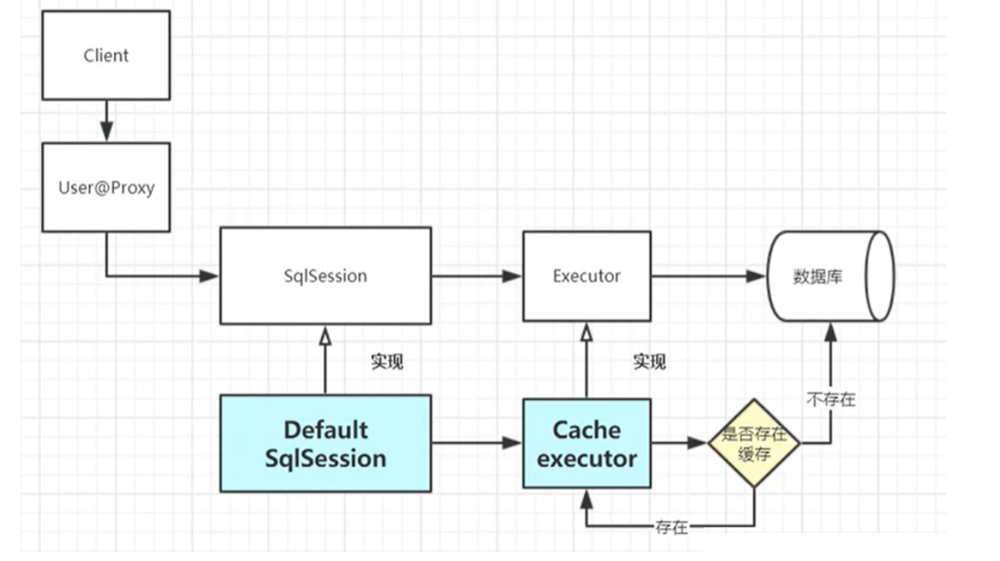

# mybatis

mybatis打印mysql执行的sql

https://blog.csdn.net/weixin_41037319/article/details/117335049
https://blog.csdn.net/ming_311/article/details/122881594

使用IDEA插件 mybatis log plugin

	<option :value="role.id" v-for="role in roleList">{{role.roleName}}</option>


sql注入
https://www.jb51.net/article/232026.htm

Mybatis中Like 的使用方式以及一些注意点

      select * from t_user where name like '%${name}%'   SQL注入风险
      select * from t_user where name like concat('%',#{name,jdbcType=VARCHAR},'%')

mybatis
CDATA

[MyBatis中*CDATA*的作用 - 简书](https://www.baidu.com/link?url=-vqdxT-JcYswI4IFz2Z_1tKMWcur1rjH5q2bSEFPSNTEK_K6B7dMbgtc5V7WXvzs&wd=&eqid=e65d6b3400148b5c0000000462f358bf)

Mybatis中实现批量更新的几种姿势
https://zhuanlan.zhihu.com/p/135839992

<update id="updateBatch"  parameterType="java.util.List">  
    <foreach collection="list" item="item" index="index" open="" close="" separator=";">
        update tableName
        <set>
            name=${item.name},
            name2=${item.name2}
        </set>
        where id = ${item.id}
    </foreach>      
</update>


Mybatis插入时返回自增主键（selectKey和useGeneratedKeys）
https://blog.csdn.net/qq_34122822/article/details/79254361

GROUP BY关键字与WITH ROLLUP一起使用
https://www.cnblogs.com/caicaizi/p/4988390.html

MySQLfunction.xmind

https://gitee.com/edidada/test-my-sqlbuilt-in-function

https://dev.mysql.com/doc/refman/8.0/en/built-in-function-reference.html

Flow Control Functions
Name     Description
CASE     Case operator
IF()     If/else construct
IFNULL() Null if/else construct
NULLIF() Return NULL if expr1 = expr2

cast as char
COALESCE()
GREATEST()
IN()
INTERVAL()
IS
IS NOT
IS NOT NULL

CASE
IF()
IFNULL()
NULLIF()

ABS()
ACOS()
ASIN()
ATAN()
CEIL()
CEILING()
CONV()
COS()
COT()
CRC32()
DEGREES()

Arithmetic Operators
%, MOD
DIV

12.6.2 Mathematical Functions
12.7 Date and Time Functions
DATE_FORMAT()
NOW()
12.8 String Functions and Operators

CONCAT()

12.8.1 String Comparison Functions and Operators


LIKE
NOT LIKE
STRCMP()

12.20 Aggregate Functions
sum avg min max count

12.20.1 Aggregate Function Descriptions
12.20.2 GROUP BY Modifiers

新特性解读 | GROUPING() 函数用法解析
https://zhuanlan.zhihu.com/p/178817990

12.20.3 MySQL Handling of GROUP BY
12.20.4 Detection of Functional Dependence


AVG()
COUNT()
MAX()
MIN()
SUM()

工作流
掌握Activiti，camunda等工作流框架中的至少一种

stored procedure

CREATE PROCEDURE p ()
BEGIN
  DECLARE i INT DEFAULT 0;
  DECLARE d DECIMAL(10,4) DEFAULT 0;
  DECLARE f FLOAT DEFAULT 0;
  WHILE i < 10000 DO
    SET d = d + .0001;
    SET f = f + .0001E0;
    SET i = i + 1;
  END WHILE;
  SELECT d, f;
END;


mysql explain 优化sql
type
https://dev.mysql.com/doc/refman/5.7/en/explain.html

sql in 要判断集合是否为null
update 不能直接使用set
用<set></set>

https://mybatis.org/mybatis-3/apidocs/index.html

mybatis_javadoc_api.xlsx


SqlSession内部运行原理
https://www.modb.pro/db/223729

org.apache.ibatis.session.SqlSession接口

select()
insert()
update()
delete()
flush()

select()
- selectOne
- selectMap
- selectList
- select

mybatis自身实现SqlSession的类
SqlSessionManager
DefaultSqlSession

mybatis-spring实现sqlsession的类
SqlSessionTemplate

SqlSessionTemplateInteceptor 实现了Invocation
invoke()方法

Proxy.newInstance()

## MapperProxy

MapperProxy是MyBatis框架中用于实现动态代理的关键类，它是通过JDK动态代理技术实现的，用于将接口与对应的SQL语句绑定在一起，实现接口方法调用时的SQL执行。
MapperProxy类的主要作用是：
实现接口的代理对象。当调用接口方法时，MapperProxy代理对象会根据方法名、参数类型等信息，从Configuration对象中获取对应的MappedStatement对象，并执行SQL语句，将查询结果映射成对应的Java对象返回给调用者。
将Mapper接口方法与MappedStatement对象绑定在一起。当使用SqlSession.getMapper()方法获取Mapper接口实例时，MyBatis框架会使用MapperRegistry类将Mapper接口与对应的MapperProxy对象进行绑定，从而实现Mapper接口方法的调用。
MapperProxy类的源码非常复杂，其核心方法是invoke方法，该方法会根据接口方法的返回值类型，调用对应的SQL执行方法
在上述代码中，如果接口方法是Object类中的方法，则直接调用对应的方法。如果接口方法是默认方法，则调用invokeDefaultMethod方法执行默认方法。如果接口方法不是Object类中的方法或默认方法，则使用cachedMapperMethod方法从MapperMethodCache中获取对应的MapperMethod对象，然后调用MapperMethod对象的execute方法执行SQL语句，并将查询结果映射成对应的Java对象返回给调用者。
需要注意的是，MapperProxy类并不会直接执行SQL语句，它会调用MapperMethod对象的execute方法来执行SQL语句。MapperMethod对象包含了SQL语句、SQL参数等信息，用于执行SQL语句并将查询结果映射成Java对象返回给调用者。
总之，MapperProxy类是MyBatis框架中非常重要的一个类，它实现了接口与SQL语句的绑定，并通过动态代理技术实现了接口方法的调用。了解MapperProxy类的原理和实现方式，对于深入理解MyBatis框架的原理和实现方式非常有帮助。


MappedStatement 跟java.sql中的Statement对应


#### MapperMethod

MapperMethod是MyBatis框架中的一个重要类，它用于执行Mapper接口方法对应的SQL语句，并将查询结果映射成对应的Java对象。在MyBatis框架中，每个Mapper接口方法都会对应一个MapperMethod对象。
MapperMethod类的源码非常复杂，但是它的核心方法是execute方法，该方法用于执行SQL语句并将查询结果映射成Java对象。下面对MapperMethod类的一些重要属性和方法进行简单介绍：
private final SqlCommand command：表示该MapperMethod对应的SQL语句的信息，包括SQL语句、参数类型、返回值类型等信息。

private final MethodSignature method：表示该MapperMethod对应的Mapper接口方法的信息，包括方法名、参数类型、返回值类型等信息。

public Object execute(SqlSession sqlSession, Object[] args)：该方法用于执行SQL语句并将查询结果映射成Java对象。在该方法中，首先根据SQL语句的类型调用SqlSession对象的对应方法，例如，如果SQL语句是查询语句，则调用SqlSession.selectOne方法；如果SQL语句是插入语句，则调用SqlSession.insert方法等。然后将SQL参数和返回值类型传递给SqlSession对象，执行SQL语句并获取查询结果。最后将查询结果通过TypeHandler进行映射成对应的Java对象，并返回给调用者。

private Object executeForMany(SqlSession sqlSession, Object[] args)：该方法用于执行查询多条记录的SQL语句，并将查询结果映射成List类型的Java对象。该方法会调用SqlSession.selectList方法执行SQL语句，并使用TypeHandler将查询结果映射成List类型的Java对象。

private Object executeForMap(SqlSession sqlSession, Object[] args)：该方法用于执行查询一条记录并将结果映射成Map类型的SQL语句。该方法会调用SqlSession.selectMap方法执行SQL语句，并使用TypeHandler将查询结果映射成Map类型的Java对象。

总之，MapperMethod类是MyBatis框架中非常重要的一个类，它用于执行Mapper接口方法对应的SQL语句，并将查询结果映射成对应的Java对象。

个人总结，有一个Mapper类方法，就有一个
MapperMethod对象

MapperMethod类跟springmvc中的 RequestMethod枚举 RequestInfo RequestMappingInfo


### mybatis调用流程


mybatis源码核心类
https://zhuanlan.zhihu.com/p/613769992


SqlSessionFactoryBuilder是构造器，见名知意，它的主要作用便是构造SqlSessionFactory实例，基本流程为根据传入的数据流创建XMLConfigBuilder，生成Configuration对象，然后根据Configuration对象创建默认的SqlSessionFactory实例。

解析mapper.xml时，Mybatis默认XML驱动类为XMLLanguageDriver，它的主要作用是解析select、update、insert、delete节点为完整的SQL语句，也是对应SQL的解析过程，XMLLanguageDriver在解析mapper.xml时，会将解析结果存储至SqlSource的实现类中，SqlSource是一个接口，只定义了一个 getBoundSql() 方法，它控制着动态 SQL 语句解析的整个流程，它会根据从 Mapper.xml 映射文件解析到的 SQL 语句以及执行 SQL 时传入的实参，返回一条可执行的 SQL。它有三个重要的实现类，对应图中写到的RawSqlSource、DynamicSqlSource及StaticSqlSource，其中RawSqlSource处理的是非动态 SQL 语句，DynamicSqlSource处理的是动态 SQL 语句，StaticSqlSource是BoundSql中要存储SQL语句的一个载体，上面RawSqlSource、DynamicSqlSource的SQL语句，最终都会存储到StaticSqlSource实现类中。StaticSqlSource的 getBoundSql() 方法是真正创建 BoundSql 对象的地方， BoundSql 包含了解析之后的 SQL 语句、字段、每个“#{}”占位符的属性信息、实参信息等。这里也重点介绍下Configuration对象，Configuration 的创建会装载一些基本属性，如事务，数据源，缓存，代理，类型处理器等，从这里可以看出 Configuration 也是一个大的容器，来为后面的SQL语句解析和初始化提供保障，也是Mybatis中贯穿全局的存在，后续我们要提到的Mybatis降低全表更新插件，也是基于这个对象来完成。其中解析mapper.xml这步最终作用便是将解析的每一条CRUD语句封装成对应的MappedStatement存放至Configuration中。


SqlSource 接口实现类

XMLLanguageDriver用于对sql脚本进行解析，解析各种标签。  重点

trim TrimHandler
where WhereHandler


XMLScriptBuilder

private void initNodeHandlerMap() {
    nodeHandlerMap.put("trim", new TrimHandler());
    nodeHandlerMap.put("where", new WhereHandler());
    nodeHandlerMap.put("set", new SetHandler());
    nodeHandlerMap.put("foreach", new ForEachHandler());
    nodeHandlerMap.put("if", new IfHandler());
    nodeHandlerMap.put("choose", new ChooseHandler());
    nodeHandlerMap.put("when", new IfHandler());
    nodeHandlerMap.put("otherwise", new OtherwiseHandler());
    nodeHandlerMap.put("bind", new BindHandler());
  }

https://blog.csdn.net/RenshenLi/article/details/118531540


XMLConfigBuilder：解析mybatis中configLocation属性中的全局xml文件，内部会使用 XMLMapperBuilder 解析各个xml文件。
XMLMapperBuilder：遍历mybatis中mapperLocations属性中的xml文件中每个节点的Builder，比如user.xml，内部会使用 XMLStatementBuilder 处理xml中的每个节点。
XMLStatementBuilder：解析xml文件中各个节点，比如select,insert,update,delete节点，内部会使用 XMLScriptBuilder 处理节点的sql部分，遍历产生的数据会丢到Configuration的mappedStatements中。
XMLScriptBuilder：解析xml中各个节点sql部分的Builder。


Mybatis动态解析里面有2个核心的类SqlNode、SqlSource、ExpressionEvaluator。Mybatis动态Sql使用分为2个部分：动态Sql解析、动态Sql拼接执行。


每个SqlNode负责自己那块功能。职责单一。SqlNode的核心方法apply就是通过ExpressionEvaluator来解析OGNL表达式数据的。接下来我们看看Mybatis是如何递归解析动态sql脚本的。


new GenericTokenParser("${", "}", new BindingTokenParser(context, injectionFilter))

ParameterMappingTokenHandler handler = new ParameterMappingTokenHandler(configuration, parameterType, additionalParameters);
//#{}解析器
GenericTokenParser parser = new GenericTokenParser("#{", "}", handler);


Mybatis对数据的处理可以分为 用入参动态的拼装sql 和 对sql执行的结果封装成 JavaBean


一个完整的Sql命令，其执行的完整流程图如下：


MapperRegistry
  MapperProxyFactory<T>
    MapperProxy

### Mybatis开启日志打印

https://blog.csdn.net/qq_41482600/article/details/126864628

### mybatis like
sql注入
https://www.jb51.net/article/232026.htm


Mybatis中Like 的使用方式以及一些注意点


      select * from t_user where name like '%${name}%'   SQL注入风险


      select * from t_user where name like concat('%',#{name,jdbcType=VARCHAR},'%')


使用mybatis的开源项目：
- sonar


mybatis xml文件 有哪些子节点，可以在IDEA中查看到，IDEA中有智能提示 .xsd文件，在mybatis jar包中

一个mybatis节点，可以执行多条sql语句

MyBatisCodeHelperPro idea插件


[springboot打印mybatis的sql语句](https://blog.csdn.net/qq_41345773/article/details/90178017)

[Spring Boot 打印mybatis sql日志信息](https://www.cnblogs.com/huxiaoguang/p/10808967.html)

在Mybatis已经整合到springBoot框架的情况下，只需要在配置文件中简单配置就能实现打印SQL日志功能。
如果使用的是application.properties文件，加入如下配置：


logging.level.main.blog.mapper=debug
如果使用的是application.yml文件，加入如下配置：

#开启logging myabtis语句打印
logging:
  level:
    main.blog.mapper: trace


[Mybatis 常用注解中的 SQL 注入](https://xie.infoq.cn/article/faf450b18559278a0ec051661)


- @SelectProvider
- @InsertProvider
- @UpdateProvider
- @DeleteProvider

  

mybatis 的动态sql语句是基于OGNL表达式的。可以方便的在 sql 语句中实现某些逻辑.
mybatis 的动态sql语句是基于OGNL表达式的。可以方便的在 sql 语句中实现某些逻辑.
mybatis 的动态sql语句是基于OGNL表达式的。可以方便的在 sql 语句中实现某些逻辑. 总体说来mybatis 动态SQL 语句主要有以下几类:

1. if 语句 (简单的条件判断)

2. choose (when,otherwize) ,相当于java 语言中的 switch ,与 jstl 中的choose 很类似.

3. trim (对包含的内容加上 prefix,或者 suffix 等，前缀，后缀)

4. where (主要是用来简化sql语句中where条件判断的，能智能的处理 and or ,不必担心多余导致语法错误)

5. set (主要用于更新时)

6. foreach (在实现 mybatis in 语句查询时特别有用 批量插入的时候有用)


Include sql if


mybatis Insert

public String Id

Get/set


<insert values(#Id)

报错


mybatis 源码 类


MapperProxy
MapperProxy<T> implements InvocationHandler  重要

InvocationHandler
public Object invoke(Object proxy, Method method, Object[] args)
        throws Throwable;

动态代理(接口级别代理)
动态代理又叫JDK动态代理是实现JDK里的InvocationHandler接口的invoke方法，但注意的是代理的是接口，也就是你的业务类必须要实现接口，通过Proxy里的newProxyInstance得到代理对象。
JDK动态代理是基于反射的,效率比较低。
动态代理不知道要代理什么东西，只有在运行时才知道。

java.lang.reflect.Proxy#newProxyInstance(java.lang.ClassLoader, java.lang.Class<?>[], java.lang.reflect.InvocationHandler)


ognl

Java类 xml文件 映射 填充sql


<trim

<foreach


jdbcTemplate


[【MyBatis】 动态SQL——模糊查询 LIKE](https://blog.csdn.net/wrs120/article/details/82530653)


SqlSessionTemplate.SqlSessionInterceptor 内部类


```xml
org.mybatis.spring.MyBatisSystemException: nested exception is org.apache.ibatis.exceptions.TooManyResultsException: Expected one result (or null) to be returned by selectOne(), but found: 4

    at org.mybatis.spring.MyBatisExceptionTranslator.translateExceptionIfPossible(MyBatisExceptionTranslator.java:77)
    at org.mybatis.spring.SqlSessionTemplate$SqlSessionInterceptor.invoke(SqlSessionTemplate.java:446)
    at com.sun.proxy.$Proxy68.selectOne(Unknown Source)
    at org.mybatis.spring.SqlSessionTemplate.selectOne(SqlSessionTemplate.java:166)
```

```xml
　　<update>
　　　　update user 
　　　　<set>
　　　　　　<if test="name != null and name.length()>0">name = #{name},</if>
　　　　　　<if test="gender != null and gender.length()>0">gender = #{gender},</if>
　　　　</set>
　　　　where id = #{id}
　　</update>
```

mybatis动态SQL中的set标签的使用
https://www.cnblogs.com/qiankun-site/p/5758383.html


mybatis api doc
https://mybatis.org/mybatis-3/apidocs/index.html

package  org.apache.ibatis

SqlSession session子包
- 	close()
- 	commit()

增删改查
	insert(String statement)
	insert(String statement, Object parameter)
	delete(String statement)
	delete(String statement, Object parameter)
	update(String statement)
	update(String statement, Object parameter)
	selectOne(String statement)
	selectOne(String statement, Object parameter)
	select(String statement, ResultHandler handler)
	selectCursor(String statement, Object parameter, RowBounds rowBounds)
	selectList(String statement)
	selectList(String statement, Object parameter)
	selectList(String statement, Object parameter, RowBounds rowBounds)

SqlSessionFactory   接口核心方法 SqlSession openSession()
实现类
	DefaultSqlSessionFactory, SqlSessionManager
	getConfiguration()
	openSession()


Configuration session包
跟mybatis-config.xml


RowBounds
行相关的 sql limit
	NO_ROW_OFFSET
	NO_ROW_LIMIT
	DEFAULT


在 MyBatis 源代码中，`${@com.xxx.yyy.ems.common.constants.Constants$PlanType@UNITE_PLAN}` 这样的占位符表达式的解析和处理是由 `org.apache.ibatis.scripting.xmltags.TextSqlNode` 类实现的。
`TextSqlNode` 类是 MyBatis 中用于解析 SQL 语句文本的节点类之一。它的作用是解析 SQL 语句中的文本内容，并处理其中的占位符和动态表达式。
当 `TextSqlNode` 遇到 `${}` 形式的占位符时，它会将占位符的内容交给 `org.apache.ibatis.scripting.xmltags.ExpressionEvaluator` 类处理。`ExpressionEvaluator` 类负责解析和求值占位符中的表达式。
在这个特定的占位符 `${@com.xxx.yyy.ems.common.constants.Constants$PlanType@UNITE_PLAN}` 中，`ExpressionEvaluator` 会解析表达式中的类名、常量名，并使用反射机制获取常量值。
然后，`TextSqlNode` 将获取到的常量值作为字面值插入到最终生成的 SQL 语句中。

因此，`org.apache.ibatis.scripting.xmltags.TextSqlNode` 类在 MyBatis 源代码中负责处理 `${@com.xxx.yyy.ems.common.constants.Constants$PlanType@UNITE_PLAN}` 这样的占位符表达式。

### SqlSessionFactoryBuilder

build(Configuration config)
build(InputStream inputStream)
build(Reader reader) 


org.apache.ibatis.session.defaults

DefaultSqlSession
DefaultSqlSession.StrictMap<V>
DefaultSqlSessionFactory

org.apache.ibatis.transaction
Transaction接口
JdbcTransaction, ManagedTransaction
commit()
getConnection()
getTimeout()
rollback()


JdbcTransaction
JdbcTransactionFactory

ManagedTransaction
ManagedTransactionFactory


org.apache.ibatis.type

### TypeHandler


ArrayTypeHandler, BaseTypeHandler, BigIntegerTypeHandler, BlobByteObjectArrayTypeHandler, BlobInputStreamTypeHandler, BlobTypeHandler, ByteArrayTypeHandler, ByteObjectArrayTypeHandler,  , ClobReaderTypeHandler, ClobTypeHandler, DateOnlyTypeHandler, DateTypeHandler, EnumOrdinalTypeHandler, EnumTypeHandler, InstantTypeHandler, , JapaneseDateTypeHandler, LocalDateTimeTypeHandler, LocalDateTypeHandler, LocalTimeTypeHandler, LongTypeHandler, MonthTypeHandler, NClobTypeHandler, NStringTypeHandler, ObjectTypeHandler, OffsetDateTimeTypeHandler, OffsetTimeTypeHandler, , SqlDateTypeHandler, SqlTimestampTypeHandler, SqlTimeTypeHandler, SqlxmlTypeHandler, TimeOnlyTypeHandler, UnknownTypeHandler, YearMonthTypeHandler, YearTypeHandler, ZonedDateTimeTypeHandler


BigDecimalTypeHandler
BooleanTypeHandler,
ByteTypeHandler,
IntegerTypeHandler
ShortTypeHandler
CharacterTypeHandler
DoubleTypeHandler
FloatTypeHandler
StringTypeHandler


getResult(CallableStatement cs, int columnIndex)
getResult(ResultSet rs, int columnIndex)
getResult(ResultSet rs, String columnName)
setParameter(PreparedStatement ps, int i, T parameter, JdbcType jdbcType)


JdbcType

ARRAY 
BIGINT 
BINARY 
BIT 
BLOB 
BOOLEAN 
CHAR 
CLOB 
CURSOR 
DATALINK 
DATE 
DATETIMEOFFSET 
DECIMAL 
DISTINCT 
DOUBLE 
FLOAT 
INTEGER 
JAVA_OBJECT 
LONGNVARCHAR 
LONGVARBINARY 
LONGVARCHAR 
NCHAR 
NCLOB 
NULL 
NUMERIC 
NVARCHAR 
OTHER 
REAL 
REF 
ROWID 
SMALLINT 
SQLXML 
STRUCT 
TIME 
TIME_WITH_TIMEZONE 
TIMESTAMP 
TIMESTAMP_WITH_TIMEZONE 
TINYINT 
UNDEFINED 
VARBINARY 
VARCHAR


MapUtil
computeIfAbsent(Map<K,V> map, K key, Function<K,V> mappingFunction)
entry(K key, V value)


org.apache.ibatis.scripting.xmltags

SqlNode
ChooseSqlNode, ForEachSqlNode, IfSqlNode, MixedSqlNode, SetSqlNode, StaticTextSqlNode, TextSqlNode, TrimSqlNode, VarDeclSqlNode, WhereSqlNode

apply(DynamicContext context) 


TextSqlNode表示的是包含${}占位符的动态SQL节点。它的接口实现方法如下

@Override
public boolean apply(DynamicContext context) {
  //将动态SQL（带${}占位符的SQL）解析成完成SQL语句的解析器，即将${}占位符替换成实际的变量值
  GenericTokenParser parser = createParser(new BindingTokenParser(context, injectionFilter));
  //将解析后的SQL片段添加到DynamicContext中
  context.appendSql(parser.parse(text));
  return true;
}

MixedSqlNode是树枝，TextSqlNode是树叶

MixedSqlNode是树枝，TextSqlNode是树叶

MixedSqlNode是树枝，TextSqlNode是树叶


https://blog.csdn.net/weixin_34240657/article/details/92407778

mybatis 预编译代码
https://blog.csdn.net/weixin_34452850/article/details/88991943
MixedSqlNode会遍历调用内部各个sqlNode的apply方法。

StaticTextSqlNode直接append sql文本。

TrimSqlNode的apply方法也是调用属性contents(一般都是MixedSqlNode)的apply方法，按照实例也就是7个SqlNode，都是StaticTextSqlNode和IfSqlNode。 最后会使用FilteredDynamicContext过滤掉prefix和suffix。


org.apache.ibatis.scripting
LanguageDriver

RawLanguageDriver, XMLLanguageDriver

createParameterHandler(MappedStatement mappedStatement, Object parameterObject, BoundSql boundSql)
createSqlSource(Configuration configuration, String script, Class<?> parameterType)
createSqlSource(Configuration configuration, XNode script, Class<?> parameterType)


org.apache.ibatis.scripting.LanguageDriverRegistry
getDefaultDriver() 
getDefaultDriverClass() 
getDriver(Class<? extends LanguageDriver> cls)
register(Class<? extends LanguageDriver> cls) 
register(Class<? extends LanguageDriver> cls) 

org.apache.ibatis.binding包
MapperMethod
MapperProxy<T>
	MapperProxyFactory<T>
MapperRegistry

MapperMethod
MapperMethod只有2个成员域,都是静态内部类,所以
MapperMethod ≈ SqlCommand + MethodSignature
MapperProxy是Mapper的动态代理实现,他的invoke方法会调用MapperMethod的execute方法.
MapperMethod这个类的作用就是把你自定义的Mapper里的方法和参数翻译成sqlSession里定义的那些selectOne呀selectMany等等方法.这样当调用你自定义的方法的时候MethodProxy就能够执行sqlSession对应的方法了.

| MapperMethod操作 | sqlSession方法名                                             |
| ---------------- | ------------------------------------------------------------ |
| INSERT           | sqlSession.insert()                                          |
| UPDATE           | sqlSession.update()                                          |
| DELETE           | sqlSession.delete()                                          |
| FLUSH            | sqlSession.flushStatements()                                 |
| SELECT           | executeWithResultHandler(sqlSession, args) executeForMany(sqlSession, args) method.returnsMap() executeForCursor() sqlSession.selectOne(command.getName(), param) |

org.apache.ibatis.builder包
BaseBuilder
CacheRefResolver
MapperBuilderAssistant
ParameterExpression
ResultMapResolver
SqlSourceBuilder
StaticSqlSource


org.apache.ibatis.builder.annotation包

ProviderMethodResolver
Classes有
MapperAnnotationBuilder
MethodResolver
ProviderContext
ProviderSqlSource

MyBatis mapper 注解过程中通过 LanguageDriver 实现动态 SQL
https://blog.csdn.net/w_yunlong/article/details/79201509

RawLanguageDriver, XMLLanguageDriver

XMLScriptBuilder自带处理节点的方法parseDynamicTags生成需要的MixedSqlNode，而在parseDynamicTags方法内部可能会调用内部类WhereHandler、IfHandler的handleNode方法生成对应的SqlNode，而在这些handleNode方法中第一步就是调用parseDynamicTags去生成MixedSqlNode，根据MixedSqlNode生成对应的SqlNode。通过这种递归实现了节点多层嵌套的解析。
https://www.163.com/dy/article/FSRBMFNB0531CIYN.html
https://www.cnblogs.com/zhjh256/p/8512392.html
https://www.cnblogs.com/fangjian0423/p/mybaits-dynamic-sql-analysis.html

mybatis session类 api

需要手动commit

github仓库 不然插入数据失败


支持多表join


Insert 返回自增id

两种方式

[mybatis 自增id](https://blog.51cto.com/xtceetg/1957557)

1、
        useGeneratedKeys="true" keyProperty="id"
2、
        <selectKey resultType="int" order="AFTER" keyProperty="id">
            SELECT LAST_INSERT_ID()
        </selectKey>


修饰xxxMapper.java接口的是import org.springframework.stereotype.Repository;
@Repository 接口


mybatis 自定义注解，修饰xxxMapper.java接口 公司用了
https://www.cnblogs.com/sharpest/p/6097682.html
http://blog.sina.com.cn/s/blog_14ffae8a60102x5u0.html

spring bean xml文件 配置MapperScannerConfigurer bean的annotationClass属性 

MapperScannerConfigurer markerInterface
basePackage


    <!-- 扫描basePackage下所有以@MyBatisRepository标识的 接口-->
    <bean class="tk.mybatis.spring.mapper.MapperScannerConfigurer">
        <property name="basePackage" value="com.xxx.yyy.**.dao"/>
        <property name="annotationClass" value="com.xxx.yyy.common.annotation.MyBatisRepository"/>
        <property name="markerInterface" value="com.xxx.yyy.common.dao.BaseDao"/>
    </bean>


mybatis 同时操作多个表，甚至是虚拟表


mybatis 动态sql bind
https://mybatis.org/mybatis-3/dynamic-sql.html
https://blog.csdn.net/u010002184/article/details/79378835
https://blog.csdn.net/yangshangwei/article/details/80073978

<select id="selectBlogsLike" resultType="Blog">   <bind name="pattern" value="'%' + _parameter.getTitle() + '%'" />   SELECT * FROM BLOG   WHERE title LIKE #{pattern} </select>
跨表的数据 分页 union

https://blog.csdn.net/QIU1988YANG/article/details/77247556

select * from 
不能这样写，以后增加/减少列

df -hl
df - report file system disk space usage

ognl，直接获取List Map array中的值，获取对象属性的值，直接绑定
sql，本质是字符串，sql语句，返回的结果/报错信息
select name from table_name where id='1';
sql有1.语句本身，2.参数
参数是java的类String Integer等类型
sql返回的结果，需要封装成Java类
sql 批量插入数据


例如：
CREATE TABLE "websites" (
  "id" int  NOT NULL  ,
  "name" char(20) NOT NULL DEFAULT ''  ,
  "url" varchar(255) NOT NULL DEFAULT '',
  "alexa" int  NOT NULL DEFAULT '0' ,
  "country" char(10) NOT NULL DEFAULT '' ,
  PRIMARY KEY ("id")
) 

INSERT INTO "websites" VALUES ('1', 'Google', 'https://www.google.cm/', '1', 'USA'), ('2', '淘宝', 'https://www.taobao.com/', '13', 'CN'), ('3', '菜鸟教程', 'http://www.runoob.com', '5892', ''), ('4', '微博', 'http://weibo.com/', '20', 'CN'), ('5', 'Facebook', 'https://www.facebook.com/', '3', 'USA');
本身的数据就很多了

## 书籍


书籍/book：
- Mybatis3源码深度解析
- mybatis 刘增辉
- MyBatis技术内幕
- 通用源码阅读指导书：MyBatis源码详解


## 高级特性


MyBatis 是一个流行的 Java 持久层框架，它提供了许多高级特性，以便更灵活地进行数据库访问和映射。以下是 MyBatis 的一些高级特性：

1. **动态 SQL**：
   MyBatis 允许在 SQL 语句中使用动态 SQL 来根据不同的条件生成不同的 SQL 片段。这样可以根据运行时的条件构建灵活的 SQL 查询。动态 SQL 包括条件判断、循环迭代和动态片段等功能。

1. **对象关系映射（ORM）**：
   MyBatis 支持将查询结果自动映射到 Java 对象。通过配置映射规则，可以将查询结果的列与 Java 对象的属性进行自动映射，简化了数据的转换和处理。

1. **批处理操作**：
   MyBatis 提供了批处理操作的支持，可以一次性执行多个数据库操作。这可以显著提高数据库操作的性能，特别是在需要插入或更新大量数据时。

1. **嵌套查询**：
   MyBatis 支持嵌套查询，允许在一个查询中嵌入另一个查询。这样可以在单个查询中获取更复杂的结果，通过减少数据库访问次数来提高性能。

1. **缓存支持**：
   MyBatis 提供了缓存机制，可以缓存查询结果以减少对数据库的访问。它支持两级缓存：一级缓存（默认开启）是会话级别的缓存，二级缓存是全局级别的缓存。可以根据需求配置缓存的刷新策略和失效机制。

1. **插件机制**：
   MyBatis 的插件机制允许开发人员在执行 SQL 语句的过程中自定义扩展逻辑。可以编写插件来拦截和修改 SQL 语句的执行流程，实现自定义的功能和增强。

1. **分页支持**：
   MyBatis 提供了分页查询的支持，可以方便地进行分页查询操作。可以指定查询的起始位置和返回的记录数，以实现分页效果。

这些是 MyBatis 的一些高级特性，它们提供了更灵活、高效的数据库访问和映射功能。使用这些特性，你可以更好地控制和优化你的数据库操作，提高应用程序的性能和可维护性。


mybatis需要练习

mybatis

jdbc

连接池

接口

xml

SqlSessionFactory等核心类

mybatis spring

http://mybatis.org/spring/zh/factorybean.html

https://github.com/edidada/testmybatis

https://github.com/edidada/testmybatisspring

@Mapper

作用？

mybatis.xml
spring-hikari.xml
spring-mybatis.xml

3、org.mybatis.spring.mapper.MapperScannerConfigurer

public class MapperScannerConfigurer implements BeanDefinitionRegistryPostProcessor, InitializingBean, ApplicationContextAware, BeanNameAware

2、org.mybatis.spring.mapper.MapperFactoryBean

1、org.mybatis.spring.SqlSessionFactoryBean

SqlSessionFactoryBean implements FactoryBean<SqlSessionFactory>, InitializingBean, ApplicationListener<ApplicationEvent>


http://www.mybatis.cn/archives/685.html

Spring源码深度分析
第9章

Configure九项
Spring中11项

http://mybatis.org/dtd/mybatis-3-mapper.dtd
mybatis-3-mapper.dtd

xml
跟节点

mapper

根节点的子节点
sql
ResultMap
select
insert
update
delete

Spring源码深度解析
Chap. 9
配置三样bean PooledDataSource SqlSessionFactoryBean MapperScannerConfigurer

一 xml文件（写SQL的）、二 数据库地址用户名密码、三 Java接口、四 接口中使用到的JavaBean类

```xml
    <bean id="dataSource" class="org.apache.ibatis.datasource.pooled.PooledDataSource">
        <property name="driver" value="com.mysql.jdbc.Driver"/>
        <property name="url" value="jdbc:mysql://localhost:3306/mybatis"/>
        <property name="username" value="root"/>
        <property name="password" value=""/>
    </bean>
    
    <bean id="sqlSessionFactory" class="org.mybatis.spring.SqlSessionFactoryBean">
        <property name="configLocation" value="classpath:mybatis-config.xml"/>
        <property name="dataSource" ref="dataSource"/>
        <property name="mapperLocations">
            <array>
                <value>classpath:tk/mybatis/**/mapper/*.xml</value>
            </array>
        </property>
        <property name="typeAliasesPackage" value="tk.mybatis.web.model"/>
    </bean>

    <bean class="org.mybatis.spring.mapper.MapperScannerConfigurer">
        <property name="addToConfig" value="true"/>
        <property name="basePackage" value="tk.mybatis.**.mapper"/>
    </bean>
```

```java
Exception in thread "main" org.apache.ibatis.binding.BindingException: Type interface com.learn.ssm.chapter4.mapper.RoleMapper is not known to the MapperRegistry.
	at org.apache.ibatis.binding.MapperRegistry.getMapper(MapperRegistry.java:47)
	at org.apache.ibatis.session.Configuration.getMapper(Configuration.java:717)
	at org.apache.ibatis.session.defaults.DefaultSqlSession.getMapper(DefaultSqlSession.java:292)
	at com.learn.ssm.chapter4.main.Chapter4Main.testRoleMapper(Chapter4Main.java:24)
	at com.learn.ssm.chapter4.main.Chapter4Main.main(Chapter4Main.java:15)

```


```java
Caused by: java.lang.ClassNotFoundException: com.duanxr.mgb.plugins.IsExistsPlugin
    at org.codehaus.plexus.classworlds.strategy.SelfFirstStrategy.loadClass (SelfFirstStrategy.java:50)
    at org.codehaus.plexus.classworlds.realm.ClassRealm.unsynchronizedLoadClass (ClassRealm.java:271)
    at org.codehaus.plexus.classworlds.realm.ClassRealm.loadClass (ClassRealm.java:247)
    at org.codehaus.plexus.classworlds.realm.ClassRealm.loadClass (ClassRealm.java:239)
    at java.lang.Class.forName0 (Native Method)
    at java.lang.Class.forName (Class.java:348)
    at org.mybatis.generator.internal.ObjectFactory.internalClassForName (ObjectFactory.java:148)
    at org.mybatis.generator.internal.ObjectFactory.createInternalObject (ObjectFactory.java:178)
    at org.mybatis.generator.internal.ObjectFactory.createPlugin (ObjectFactory.java:219)
    at org.mybatis.generator.config.Context.generateFiles (Context.java:500)
    at org.mybatis.generator.api.MyBatisGenerator.generate (MyBatisGenerator.java:269)
    at org.mybatis.generator.api.MyBatisGenerator.generate (MyBatisGenerator.java:189)
    at org.mybatis.generator.maven.MyBatisGeneratorMojo.execute (MyBatisGeneratorMojo.java:229)
    at org.apache.maven.plugin.DefaultBuildPluginManager.executeMojo (DefaultBuildPluginManager.java:137)
    at org.apache.maven.lifecycle.internal.MojoExecutor.execute (MojoExecutor.java:210)
    at org.apache.maven.lifecycle.internal.MojoExecutor.execute (MojoExecutor.java:156)
    at org.apache.maven.lifecycle.internal.MojoExecutor.execute (MojoExecutor.java:148)
    at org.apache.maven.lifecycle.internal.LifecycleModuleBuilder.buildProject (LifecycleModuleBuilder.java:117)
    at org.apache.maven.lifecycle.internal.LifecycleModuleBuilder.buildProject (LifecycleModuleBuilder.java:81)
    at org.apache.maven.lifecycle.internal.builder.singlethreaded.SingleThreadedBuilder.build (SingleThreadedBuilder.java:56)
    at org.apache.maven.lifecycle.internal.LifecycleStarter.execute (LifecycleStarter.java:128)
    at org.apache.maven.DefaultMaven.doExecute (DefaultMaven.java:305)
    at org.apache.maven.DefaultMaven.doExecute (DefaultMaven.java:192)
    at org.apache.maven.DefaultMaven.execute (DefaultMaven.java:105)
    at org.apache.maven.cli.MavenCli.execute (MavenCli.java:956)
    at org.apache.maven.cli.MavenCli.doMain (MavenCli.java:288)
    at org.apache.maven.cli.MavenCli.main (MavenCli.java:192)
    at sun.reflect.NativeMethodAccessorImpl.invoke0 (Native Method)
    at sun.reflect.NativeMethodAccessorImpl.invoke (NativeMethodAccessorImpl.java:62)
    at sun.reflect.DelegatingMethodAccessorImpl.invoke (DelegatingMethodAccessorImpl.java:43)
    at java.lang.reflect.Method.invoke (Method.java:498)
    at org.codehaus.plexus.classworlds.launcher.Launcher.launchEnhanced (Launcher.java:282)
    at org.codehaus.plexus.classworlds.launcher.Launcher.launch (Launcher.java:225)
    at org.codehaus.plexus.classworlds.launcher.Launcher.mainWithExitCode (Launcher.java:406)
    at org.codehaus.plexus.classworlds.launcher.Launcher.main (Launcher.java:347)
```

MyBatis 动态代理库

[Mybatis中Mapper动态代理的实现原理](https://blog.csdn.net/xiaokang123456kao/article/details/76228684)

动态SQL

```
  <insert id="insert" parameterType="com.xxxx.media.image.extraction.dal.models.FileInfoDO">
    insert into ${tableName} (ID, GROUP_ID, FILE_ID,
```
tableName是Java Bean中FileInfoDO的一个field，不是配置文件中的变量


[mybatis使用foreach的 separator="or" 失效问题](https://blog.csdn.net/u013091257/article/details/94858389)

[mybatis中动态SQL之trim详解](https://www.cnblogs.com/waterystone/p/7070836.html)

网上关于<trim>的介绍并不多，通过看mybatis的源码，一句话描述trim的功能：子句首尾的删除与添加。它就是一个字符串处理工具，类似于replace()，但它只处理首尾。真的是一个神器，其实mybatis中的<set>和<where>都可以用<trim>来实现，但<trim>的功能更强大，使用起来更灵活！！！

[MyBatis的Mapper接口以及Example的实例函数及详解](https://blog.csdn.net/biandous/article/details/65630783)

[MyBatis Generator产生的Example类](https://blog.csdn.net/luanlouis/article/details/22726635)

[关于Mybatis中的条件查询。createCriteria example里面的条件](https://blog.csdn.net/qq_34178998/article/details/79103586)

<trim prefix="(" prefixOverrides="OR" suffixOverrides="," suffix=")">子句</trim>

这里的子句会对其进行trim()处理，忽略掉换行、空格等字符，所以本文中的子句都是指trim()处理后的字符串。如果子句为空，那么整个<trim>块不起作用，相当于不存在。本<trim>块的作用就是：去掉子句首的OR和子句尾的逗号，并在子句前后分别加上(和)，比如，"orabc,"-->"(abc)"。

prefixOverrides：子句首的命中词列表，以|分隔，忽略大小写。如果命中（轮询命中词，最多只命中一次），会删除子句首命中的词；没命中就算了。
prefix：删除子句句首后，在子句最前边加上单个空格+prefix。
suffixOverrides：子句尾的命中词列表，以|分隔，忽略大小写。如果命中（轮询命中词，最多只命中一次），会删除子句尾命中的词；没命中就算了。
suffix：删除子句句尾后，在子句最后边加上单个空格+suffix。
有了这个神器，处理前文提起的需求，就可以用<trim>很悠然的处理了。 

替换sql字符串首尾

```java
WHERE a = #{a}
    <trim prefix="AND(" prefixOverrides="OR" suffix=")">
        <if test="b != -1">
            OR b = #{b}
        </if>
        <if test="c != -1">
            OR c = #{c}
        </if>
    </trim>
```

```java
StaticTextSqlNode (org.apache.ibatis.scripting.xmltags)
MixedSqlNode (org.apache.ibatis.scripting.xmltags)
TextSqlNode (org.apache.ibatis.scripting.xmltags)
ForEachSqlNode (org.apache.ibatis.scripting.xmltags)
IfSqlNode (org.apache.ibatis.scripting.xmltags)
VarDeclSqlNode (org.apache.ibatis.scripting.xmltags)
TrimSqlNode (org.apache.ibatis.scripting.xmltags)
    WhereSqlNode (org.apache.ibatis.scripting.xmltags)
    SetSqlNode (org.apache.ibatis.scripting.xmltags)
ChooseSqlNode (org.apache.ibatis.scripting.xmltags)
```


[mybatis中foreach标签详解](https://blog.csdn.net/gwd1154978352/article/details/75408498)

[MyBatis的foreach语句详解](https://www.jianshu.com/p/a45908678a52)

[在mybatis中使用Criteria式条件查询](https://www.iflym.com/index.php/code/201312250002.html)

[[mybatis]Example的用法 Criteria Criterion](https://blog.csdn.net/zhemeban/article/details/71901759)

`org.apache.ibatis.annotations.Param`

choose when foreach other

[Mybatis最入门---动态查询 choose,when,otherwise](https://blog.csdn.net/ABCD898989/article/details/51222452)

<choose><when><otherwise>配合使用是等价于java中的

```java

if（...）{
....
}else if(...){
...
}else{
....
}

```

按照官方文档给的示例，最后的<otherwise>是需要存在的，但是经过测试，即使最后的<otherwise>没有写，Mybatis也不会发生任何异常。而是将所有表数据返回。这是一种极为不推荐的做法。实际生产环境下，如果该表的数据量非常大，这条语句被执行，就是一个巨大的坑！


https://www.cnblogs.com/goloving/p/9241449.html

用注解来简化xml配置的时候，@Param注解的作用是给参数命名，参数命名后就能根据名字得到参数值，正确的将参数传入sql语句中

分为两种，一种是基本数据类型上
sql语句中直接引用

另一种是java类对象

```java

public List<student> selectuser(@Param(value = "page")int pn ,@Param(value = "st")student student);

<select id="selectuser" resultType="com.user.entity.student">
    SELECT * FROM student
    where sname like concat(concat("%",#{st.sname}),"%")
    LIMIT #{page} ,5
</select>

```

[Mybatis的@Param注解的用法](https://blog.csdn.net/nqmysbd/article/details/86615016)


[Mybatis 使用distinct问题](https://blog.csdn.net/a19891024/article/details/90716034)

[mybatis常用jdbcType数据类型](https://www.cnblogs.com/lixuwu/p/5916585.html)

- mybatis源码之解析xml文件
- MyBatis如何调用jdbc相关的api

[mybatis源码之解析xml文件](https://blog.csdn.net/qq_32292967/article/details/72403853)

debug
Spring Boot,MyBatis Spring
private XMLConfigBuilder(XPathParser parser, String environment, Properties props)

org.apache.ibatis.parsing.XPathParser

com.sun.org.apache.xpath.internal.jaxp.XPathImpl

https://www.jianshu.com/p/73db113748cc

### MyBatis如何调用jdbc相关的api


类型转换器

Typehandler

Java数据类型 MySQL数据库的类型


##  xml文件解析


有两个xml文件

mybatis-config.xml文件

参数


```java
String resource = "mybatis-config.xml";
Resources.getResourceAsStream(resource)
```


mybatis-config.xml文件如何被解析

org.apache.ibatis.builder.xml.XMLConfigBuilder#parseConfiguration


mybatis动态sql是如何解析的

org.apache.ibatis.builder.xml.XMLMapperBuilder#configurationElement


## MyBatis Generator

mybatis 2 3区别
mybatis命名空间？
namespace 接口？
mybatis spring boot starter
要熟悉

mybatis 的连接池

缓存

转换器

装饰器模式

```java
SqlSessionManager implements SqlSessionFactory, SqlSession
```

org.apache.ibatis.io.Resources#getResourceAsReader(java.lang.String)

org.apache.ibatis.session.SqlSessionFactoryBuilder


java

Configuration


mybatis 2 3区别


namespace 接口？

mybatis spring 多数据源？连接多个数据库？

第一种、直接通过RowBounds参数完成分页查询 

```java
List<Student> list = studentMapper.find(new RowBounds(0, 10));
Page page = ((Page) list;
```


第二种、PageHelper.startPage()静态方法

```
//获取第1页，10条内容，默认查询总数count
    PageHelper.startPage(1, 10);
//紧跟着的第一个select方法会被分页
    List<Country> list = studentMapper.find();
    Page page = ((Page) list;
```


[PageHelper分页插件源码及原理剖析](https://blog.csdn.net/scgyus/article/details/80694559)


https://blog.csdn.net/qq_26587997/article/details/83153747


pagerhelper例子


https://github.com/edidada/ssm

tk.mapper

### OGNL


[Mybatis 中的 SQL 节点的解析](https://xie.infoq.cn/article/026dd91a93ea90ee8900ff9bc)


mybatis高效插入
https://zhuanlan.zhihu.com/p/35305211

### mybatis缓存策略
使用escache三方缓存

MyBatis提供了两种缓存：一级缓存和二级缓存。其中，一级缓存是SqlSession级别的，也就是说，同一个SqlSession对象调用一个Mapper方法，往往只执行一次SQL，因为使用同一个SqlSession对象调用相同的Mapper方法时，MyBatis会先从它的本地Cache中查找是否有该数据，如果有则直接返回，否则才会去数据库中查询。而二级缓存是Mapper级别的，它可以被多个SqlSession对象共享
mybatis一级缓存实现类

MyBatis的一级缓存是指在应用运行过程中，一次数据库会话中，执行多次相同的查询，会优先查询缓存中的数据，减少数据库查询次数，提高查询效率。
MyBatis内部存储缓存使用的是一个HashMap对象，key为 hashCode + sqlId + sql 语句。2 而value值就是从查询出来映射生成的java对象。
每次查询都会先从缓存区域找，如果找不到就会从数据库查询数据，然后将查询到的数据写入一级缓存中。

https://blog.csdn.net/BruceLiu_code/article/details/119478137




CachingExecutor

一级缓存的实现是通过 CachingExecutor 实现的


DefaultSqlSession中有一个CacheExecutor
CachingExecutor 中有一个 SimpleExecutor
SimpleExecutor 中有一个叫 LocalCache (PerpetualCache类型)
LocalCache才是真正的存储缓存的地方
LocalCache 中有一个叫cache （Hashmap <Object,Object>类型的）


mybatis二级缓存实现类

https://www.cnblogs.com/cxuanBlog/p/11333021.html

https://www.jianshu.com/p/b8fa01332cdd


MyBatis的二级缓存是Application级别的缓存，它可以提高对数据库查询的效率，以提高应用的性能。MyBatis自身提供了丰富的，并且功能强大的二级缓存的实现，它拥有一系列的Cache接口装饰者，可以满足各种对缓存操作和更新的策略。开启二级缓存的条件也是比较简单，通过直接在 MyBatis 配置文件中通过 <settings> <setting name = "cacheEnabled" value = "true" /> </settings> 来开启。

MyBatis查询数据的顺序是：

二级缓存 ———> 一级缓存——> 数据库

        <dependency>    　　
            <groupId>org.slf4j</groupId>    　　
            <artifactId>slf4j-simple</artifactId>    　　
            <version>1.7.25</version>    　　
            <scope>compile</scope>
        </dependency>

使某条Select查询支持二级缓存，你需要保证：

1. MyBatis支持二级缓存的总开关：全局配置变量参数 cacheEnabled=true
2. 该select语句所在的Mapper，配置了<cache> 或<cached-ref>节点，并且有效
3. 该select语句的参数 useCache=true


实现分页的三种方法
RowBounds


SqlSessionFactoryBuilder
build()方法

- 通用源码阅读指导书：MyBatis源码详解
- mybatis3源码深度解析
- 手写MyBatis：渐进式源码实践


类型别名是你的好帮手。使用它们，你就可以不用输入类的全限定名了。比如：

<!-- mybatis-config.xml 中 -->
<typeAlias type="com.someapp.model.User" alias="User"/>

<!-- SQL 映射 XML 中 -->
<select id="selectUsers" resultType="User">
  select id, username, hashedPassword
  from some_table
  where id = #{id}
</select>


#{}和${}两者含义不同

#会把传入的数据都当成一个字符串来处理，会在传入的数据上面加一个双引号来处理。
而$则是把传入的数据直接显示在sql语句中，不会添加双引号。


Mybatis Dynamic SQL
https://mybatis.org/mybatis-dynamic-sql/docs/introduction.html


Mybatis Dynamic SQL 是 Mybatis 团队出的一个框架，兼容 Mybatis3 的生态，但与 Mybatis 最大的不同是：你既不用在 XML 里写 SQL，也不用在 Annotation 里拼接 SQL（用 Java 拼接过复杂字符串的都懂），而是直接以 Java 的方式去写 SQL。

这样会带来以下好处

Typesafe：在编译期就可以确保你的 sql 参数类型和列类型是一致的
Expressive：这就是要执行的 SQL 的样子
Flexible：再复杂的 if else、and、or 都能轻松实现
Mybatis Generator
Mybatis Generator 也是 Mybatis 团队出的代码自动生成工具，它支持 Mybatis3、Mybatis-Dynamic-SQL 等类型的代码生成。提供了非常多的扩展点和预定义配置项，使得用户可以灵活的自定义生成规则。

并且 Generator 也支持多种生成模式，用户可以根据使用场景自行选择

command 模式：可以通过命令行生成代码
Maven 插件：直接集成在 Maven 构建工具中
Java Runtime 模式：通过编写 Java 代码然后运行来生成


mybatis源码
https://www.zhihu.com/answer/2225895340

https://gitee.com/edidada/testmybatis jdbc分支 mybatis使用xpath技术解析xml


运行java程序，查看运行过程中有哪些对象

jmap -histo:live pid

jmap -histo:live 1424

 847:             1             16  oracle.jdbc.driver.Message11
 848:             1             16  org.apache.ibatis.cache.TransactionalCacheManager
 849:             1             16  org.apache.ibatis.executor.keygen.Jdbc3KeyGenerator
 850:             1             16  org.apache.ibatis.executor.keygen.NoKeyGenerator
 851:             1             16  org.apache.ibatis.executor.loader.javassist.JavassistProxyFactory
 852:             1             16  org.apache.ibatis.javassist.util.proxy.ProxyFactory$1
 853:             1             16  org.apache.ibatis.javassist.util.proxy.ProxyFactory$3
 854:             1             16  org.apache.ibatis.ognl.ArrayElementsAccessor
 855:             1             16  org.apache.ibatis.ognl.ArrayPropertyAccessor
 856:             1             16  org.apache.ibatis.ognl.CollectionElementsAccessor
 857:             1             16  org.apache.ibatis.ognl.EnumerationElementsAccessor
 858:             1             16  org.apache.ibatis.ognl.EnumerationPropertyAccessor
 859:             1             16  org.apache.ibatis.ognl.EvaluationPool
 860:             1             16  org.apache.ibatis.ognl.IteratorElementsAccessor
 861:             1             16  org.apache.ibatis.ognl.IteratorPropertyAccessor
 862:             1             16  org.apache.ibatis.ognl.ListPropertyAccessor
 863:             1             16  org.apache.ibatis.ognl.MapElementsAccessor
 864:             1             16  org.apache.ibatis.ognl.MapPropertyAccessor
 865:             1             16  org.apache.ibatis.ognl.NumberElementsAccessor
 866:             1             16  org.apache.ibatis.ognl.ObjectArrayPool
 867:             1             16  org.apache.ibatis.ognl.ObjectElementsAccessor
 868:             1             16  org.apache.ibatis.ognl.ObjectMethodAccessor
 869:             1             16  org.apache.ibatis.ognl.ObjectNullHandler
 870:             1             16  org.apache.ibatis.ognl.ObjectPropertyAccessor
 871:             1             16  org.apache.ibatis.ognl.SetPropertyAccessor
 872:             1             16  org.apache.ibatis.plugin.InterceptorChain
 873:             1             16  org.apache.ibatis.scripting.defaults.RawLanguageDriver
 874:             1             16  org.apache.ibatis.scripting.xmltags.DynamicContext$ContextAccessor
 875:             1             16  org.apache.ibatis.scripting.xmltags.XMLLanguageDriver
 876:             1             16  org.apache.ibatis.session.defaults.DefaultSqlSessionFactory
 877:             1             16  org.apache.ibatis.transaction.jdbc.JdbcTransactionFactory
 878:             1             16  org.apache.ibatis.type.TypeAliasRegistry

其他见：
mybatis项目内存对象.md


idea插件 mybatisprohelper

mybatis，如何生成sql


https://blog.csdn.net/goligu/article/details/124878614

org.apache.ibatis.scripting.xmltags.XMLScriptBuilder#parseDynamicTags

public class XMLScriptBuilder extends BaseBuilder


TypeAliasRegistry
TypeHandlerRegistry

[Java、Mysql、MyBatis 中枚举 enum 的使用](https://blog.csdn.net/JoeBlackzqq/article/details/90216582)


D:\git\github\LangNote\java\mybatis.md


MyBatis

依赖mysql-connector-java这个jar
jdbc
连接池

接口
xml
SqlSessionFactory等核心类


MyBatis xml
1、if
2、choose、when、otherwise
3、trim、where、set
4、foreach
bind

MyBatis动态SQL
https://mybatis.org/mybatis-3/zh/dynamic-sql.html


在MyBatis中，trim、where和set标签对应的源码类分别是：
- trim标签对应的源码类是org.apache.ibatis.scripting.xmltags.TrimSqlNode
- where标签对应的源码类是org.apache.ibatis.scripting.xmltags.WhereSqlNode
- set标签对应的源码类是org.apache.ibatis.scripting.xmltags.SetSqlNode

这些类都是org.apache.ibatis.scripting.xmltags包中的类，它们都实现了org.apache.ibatis.scripting.xmltags.SqlNode接口，用于表示MyBatis XML映射文件中的动态SQL语句节点。这些类的主要作用是根据用户定义的条件动态生成SQL语句，从而可以灵活地构建SQL语句，以适应不同的查询需求。
在执行SQL语句时，MyBatis会将动态SQL语句节点解析成一个个SqlNode对象，然后使用org.apache.ibatis.scripting.xmltags.MixedSqlNode类将它们组合成一个完整的SQL语句。在组合过程中，MyBatis会根据用户定义的条件动态生成SQL语句，以便生成最终的SQL语句。


script
https://blog.csdn.net/qq_32588349/article/details/51541871
https://blog.csdn.net/a18716374124/article/details/79638980

Jdbctemplate如何写动态sql
JdbcTemplate可以使用NamedParameterJdbcTemplate来支持动态SQL。通过NamedParameterJdbcTemplate，可以使用命名参数的方式来构建动态SQL语句。
下面是一个使用NamedParameterJdbcTemplate构建动态SQL的示例：
```
public List<User> getUsers(String name, Integer age) {
    String sql = "SELECT * FROM user WHERE 1=1 ";

    Map<String, Object> params = new HashMap<>();
    if (name != null) {
        sql += "AND name = :name ";
        params.put("name", name);
    }
    if (age != null) {
        sql += "AND age = :age ";
        params.put("age", age);
    }

    NamedParameterJdbcTemplate jdbcTemplate = new NamedParameterJdbcTemplate(dataSource);
    return jdbcTemplate.query(sql, params, new BeanPropertyRowMapper<>(User.class));
}
```
在这个示例中，我们使用了NamedParameterJdbcTemplate来构建动态SQL语句。首先，我们定义了一个基础的SQL语句"SELECT * FROM user WHERE 1=1"，然后根据传入的参数动态添加查询条件。在添加查询条件时，我们使用了命名参数的方式，例如":name"和":age"。最后，我们使用NamedParameterJdbcTemplate的query方法执行查询，传入SQL语句、参数和结果集的映射方式。
需要注意的是，使用NamedParameterJdbcTemplate构建动态SQL时，SQL语句中的参数名必须和params中的键名保持一致。

Restful HTTP 路径

### 面试题

mybatis批量插入数据有哪几种方式，有什么异同
1、mybatis xml文件中拼接xml
创建 UserMapper.xml 文件，使用 foreach 标签拼接 SQL，具体实现代码如下：
<?xml version="1.0" encoding="UTF-8"?>
<!DOCTYPE mapper PUBLIC "-//mybatis.org//DTD Mapper 3.0//EN" "http://mybatis.org/dtd/mybatis-3-mapper.dtd">
<mapper namespace="com.example.demo.mapper.UserMapper">
    <insert id="saveBatchByNative">
        INSERT INTO `USER`(`NAME`,`PASSWORD`) VALUES
        <foreach collection="list" separator="," item="item">
            (#{item.name},#{item.password})
        </foreach>
    </insert>
</mapper>

https://zhuanlan.zhihu.com/p/35305211


mybatis ExecutorType.BATCHMybatis内置的ExecutorType有3种，默认的是simple，该模式下它为每个语句的执行创建一个新的预处理语句，单条提交sql；而batch模式重复使用已经预处理的语句，并且批量执行所有更新语句，显然batch性能将更优； 但batch模式也有自己的问题，比如在Insert操作时，在事务没有提交之前，是没有办法获取到自增的id，这在某型情形下是不符合业务要求的具体用法如下:*方式一 spring+mybatis 的//获取sqlsession
//从spring注入原有的sqlSessionTemplate
@Autowired
private SqlSessionTemplate sqlSessionTemplate;
// 新获取一个模式为BATCH，自动提交为false的session
// 如果自动提交设置为true,将无法控制提交的条数，改为最后统一提交，可能导致内存溢出

```java
SqlSession session = sqlSessionTemplate.getSqlSessionFactory().openSession(ExecutorType.BATCH,false);
//通过新的session获取mapper
fooMapper = session.getMapper(FooMapper.class);
int size = 10000;
try{
for(int i = 0; i < size; i++) {
Foo foo = new Foo();
foo.setName(String.valueOf(System.currentTimeMillis()));
fooMapper.insert(foo);
if(i % 1000 == 0 || i == size - 1) {
//手动每1000个一提交，提交后无法回滚 
session.commit();
//清理缓存，防止溢出
session.clearCache();
}
}
} catch (Exception e) {
//没有提交的数据可以回滚
session.rollback();
} finally{
session.close();
}

```


spring+mybatis
方法二:结合通用mapper sql别名最好是包名＋类名public void insertBatch(Map<String,Object> paramMap, List<User> list) throws Exception {
// 新获取一个模式为BATCH，自动提交为false的session
// 如果自动提交设置为true,将无法控制提交的条数，改为最后统一提交，可能导致内存溢出

```java
SqlSession session = sqlSessionTemplate.getSqlSessionFactory().openSession(ExecutorType.BATCH, false);
try {
if(null != list || list.size()>0){
int lsize=list.size();
for (int i = 0, n=list.size(); i < n; i++) {
User user= list.get(i);
user.setIndate((String)paramMap.get("indate"));
user.setDatadate((String)paramMap.get("dataDate"));//数据归属时间
//session.insert("com.xx.mapper.UserMapper.insert",user);
//session.update("com.xx.mapper.UserMapper.updateByPrimaryKeySelective",_entity);
session.insert(“包名+类名", user);
if ((i>0 && i % 1000 == 0) || i == lsize - 1) {
// 手动每1000个一提交，提交后无法回滚
session.commit();
// 清理缓存，防止溢出
session.clearCache();
}
}
}
} catch (Exception e) {
// 没有提交的数据可以回滚
session.rollback();
e.printStackTrace();
} finally {
session.close();
}
}
```

### MyBatis四大组件之Executor执行器

每一个SqlSession都会拥有一个Executor对象，这个对象负责增删改查的具体操作，我们可以简单的将它理解为JDBC中Statement的封装版。
https://zhuanlan.zhihu.com/p/80497754

public enum ExecutorType {
  SIMPLE, REUSE, BATCH
}


Mybatis是如何将Mapper接口注册到Spring IoC的
https://zhuanlan.zhihu.com/p/256425436


ImportBeanDefinitionRegistrar接口
ImportBeanDefinitionRegistrar是Spring3.1开始引入的一个接口，用来动态注册bean定义的接口。通过@Import方式引入，和ImportSelector用法类似，通常和EnvironmentAware、BeanFactoryAware、BeanClassLoaderAware、ResourceLoaderAware接口一起使用。其作用就是把模糊的概念明确化，把抽象的东西实例化，为本地服务提供更方便的使用或者服务调用。

BeanDefinitionRegistryPostProcessor
BeanDefinitionRegistryPostProcessor是BeanFactoryPostProcessor的子接口,BeanFactoryPostProcessor的作用是在Spring Bean的定义信息已经加载但还没有初始化的时候执行postProcessBeanFactory()来处理一些额外的逻辑，
而BeanDefinitionRegistryPostProcessor的作用是在BeanFactoryPostProcessor增加了一个前置处理，当一个Bean实现了该接口后，始化前先执行该接口的postProcessBeanDefinitionRegistry()方法，然后再执行其父类的方法postProcessBeanFactory()。这样就把一个Spring Bean的初始化周期更加细化，让我们在各个阶段有定制它的可能。

mybatis，可以强制设置使用哪个日志工具 mybatis-config.xml里面配置
```xml
    <settings>

<!--
        <setting name="logImpl" value="SLF4J" />
-->
        <setting name="logImpl" value="LOG4J2"/>
    </settings>
```
dubbo也可以，设置环境变量


# 源代码分包解析

3.4.6

## org.apache.ibatis.annotations

| org.apache.ibatis.annotations | 类型       | 英文说明                                                     | 说明 |
| ----------------------------- | ---------- | ------------------------------------------------------------ | ---- |
| Arg                           | @interface | The annotation that specify a mapping definition for the constructor argument. |      |
| AutomapConstructor            | @interface | The marker annotation that indicate a constructor for automatic mapping. |      |
| CacheNamespace                | @interface | The annotation that specify to use cache on namespace(e.g.   |      |
| CacheNamespaceRef             | @interface | The annotation that reference a cache.                       |      |
| Case                          | @interface | The annotation that conditional mapping definition for TypeDiscriminator. |      |
| ConstructorArgs               | @interface | The annotation that be grouping mapping definitions for constructor. |      |
| Delete                        | @interface | The annotation that specify an SQL for deleting record(s).   |      |
| Delete.List                   | @interface | The container annotation for Delete.                         |      |
| DeleteProvider                | @interface | The annotation that specify a method that provide an SQL for deleting record(s). |      |
| DeleteProvider.List           | @interface | The container annotation for DeleteProvider.                 |      |
| Flush                         | @interface | The maker annotation that invoke a flush statements via Mapper interface. |      |
| Insert                        | @interface | The annotation that specify an SQL for inserting record(s).  |      |
| Insert.List                   | @interface | The container annotation for Insert.                         |      |
| InsertProvider                | @interface | The annotation that specify a method that provide an SQL for inserting record(s). |      |
| InsertProvider.List           | @interface | The container annotation for InsertProvider.                 |      |
| Lang                          | @interface | The annotation that specify a LanguageDriver to use.         |      |
| Many                          | @interface | The annotation that specify the nested statement for retrieving collections. |      |
| MapKey                        | @interface | The annotation that specify the property name(or column name) for a key value of Map. |      |
| Mapper                        | @interface | Marker interface for MyBatis mappers.                        |      |
| One                           | @interface | The annotation that specify the nested statement for retrieving single object. |      |
| Options                       | @interface | The annotation that specify options for customizing default behaviors. |      |
| Options.FlushCachePolicy      | @interface | The options for the Options.flushCache().                    |      |
| Options.List                  | @interface | The container annotation for Options.                        |      |
| Param                         | @interface | The annotation that specify the parameter name.              |      |
| Property                      | @interface | The annotation that inject a property value.                 |      |
| Result                        | @interface | The annotation that specify a mapping definition for the property. |      |
| ResultMap                     | @interface | The annotation that specify result map names to use.         |      |
| Results                       | @interface | The annotation that be grouping mapping definitions for property. |      |
| ResultType                    | @interface | This annotation can be used when a @Select method is using a ResultHandler. |      |
| Select                        | @interface | The annotation that specify an SQL for retrieving record(s). |      |
| Select.List                   | @interface | The container annotation for Select.                         |      |
| SelectKey                     | @interface | The annotation that specify an SQL for retrieving a key value. |      |
| SelectKey.List                | @interface | The container annotation for SelectKey.                      |      |
| SelectProvider                | @interface | The annotation that specify a method that provide an SQL for retrieving record(s). |      |
| SelectProvider.List           | @interface | The container annotation for SelectProvider.                 |      |
| TypeDiscriminator             | @interface | The annotation that be grouping conditional mapping definitions. |      |
| Update                        | @interface | The annotation that specify an SQL for updating record(s).   |      |
| Update.List                   | @interface | The container annotation for Update.                         |      |
| UpdateProvider                | @interface | The annotation that specify a method that provide an SQL for updating record(s). |      |
| UpdateProvider.List           | @interface | The container annotation for UpdateProvider.                 |      |


## org.apache.ibatis.binding 

| org.apache.ibatis.binding    | 类型 | 英文说明                                                     | 说明 |
| ---------------------------- | ---- | ------------------------------------------------------------ | ---- |
| BindingException             |      |                                                              |      |
| MapperMethod                 |      | public Object execute(SqlSession sqlSession, Object[] args) 核心方法 |      |
| MapperMethod.MethodSignature |      |                                                              |      |
| MapperMethod.ParamMap<V>     |      | HashMap<String, V>                                           |      |
| MapperMethod.SqlCommand      |      | SqlCommandType type                                          |      |
| MapperProxy<T>               |      | 动态代理                                                     |      |
| MapperProxyFactory<T>        | 泛型 | 见下面，调用动态代理                                         |      |
| MapperRegistry               |      | Mapper注册 getMapper() addMapper()   Map<Class<?>, MapperProxyFactory<?>> knownMappers  属性 |      |


MapperMethod构造函数

  private final SqlCommand command;
  private final MethodSignature method;


MapperMethod调用栈

selectList:147, DefaultSqlSession (org.apache.ibatis.session.defaults)
selectList:141, DefaultSqlSession (org.apache.ibatis.session.defaults)
selectOne:77, DefaultSqlSession (org.apache.ibatis.session.defaults)
execute:83, MapperMethod (org.apache.ibatis.binding)
invoke:59, MapperProxy (org.apache.ibatis.binding)
getUser:-1, $Proxy9 (com.sun.proxy)
makeWithMapper:101, TestMyBatis (cn.wdidada.testmybatis)
main:23, TestMyBatis (cn.wdidada.testmybatis)


SqlSession.getMapper()
    Configuration.getMapper()
        MapperRegistry.getMapper() knownMappers这个map里面获取


哪儿添加的呢？
SqlSessionFactoryBuilder.build()
XMLConfigBuilder.parse()
XMLConfigBuilder.mapperElement()
    Configuration.addMapper()


addMapper:61, MapperRegistry (org.apache.ibatis.binding)
addMappers:97, MapperRegistry (org.apache.ibatis.binding)
addMappers:105, MapperRegistry (org.apache.ibatis.binding)
addMappers:737, Configuration (org.apache.ibatis.session)
mapperElement:364, XMLConfigBuilder (org.apache.ibatis.builder.xml)
parseConfiguration:119, XMLConfigBuilder (org.apache.ibatis.builder.xml)
parse:99, XMLConfigBuilder (org.apache.ibatis.builder.xml)
build:78, SqlSessionFactoryBuilder (org.apache.ibatis.session)
build:64, SqlSessionFactoryBuilder (org.apache.ibatis.session)
makeWithMapper:86, TestMyBatis (cn.wdidada.testmybatis)
main:23, TestMyBatis (cn.wdidada.testmybatis)


org.apache.ibatis.builder.xml.XMLConfigBuilder#parseConfiguration

挨个解析mybatis-config.xml


一个mybatis接口，一个org.apache.ibatis.binding.MapperProxyFactory对象 泛型T就是接口动态代理对象


java.lang.reflect.Proxy#newProxyInstance(ClassLoader loader,
                                      Class<?>[] interfaces,
                                      InvocationHandler h)


InvocationHandler 参数是MapperProxy对象

MapperProxyFactory类公开方法

```
public T newInstance(SqlSession sqlSession)
```

## org.apache.ibatis.builder

| org.apache.ibatis.builder                     | 类型      | 英文说明                | 说明                                                         |
| --------------------------------------------- | --------- | ----------------------- | ------------------------------------------------------------ |
| BaseBuilder                                   | abstract  |                         |                                                              |
| BuilderException                              |           | PersistenceException    |                                                              |
| CacheRefResolver                              |           |                         |                                                              |
| IncompleteElementException                    |           |                         |                                                              |
| InitializingObject                            | interface |                         |                                                              |
| MapperBuilderAssistant                        |           |                         | BaseBuilder子类   XMLStatementBuilder类属性 MapperBuilderAssistant builderAssistant |
| ParameterExpression                           |           | HashMap<String, String> |                                                              |
| ResultMapResolver                             |           |                         |                                                              |
| SqlSourceBuilder                              |           |                         |                                                              |
| SqlSourceBuilder.ParameterMappingTokenHandler |           |                         |                                                              |
| StaticSqlSource                               |           | implements SqlSource    |                                                              |


BaseBuilder (org.apache.ibatis.builder)
    XMLMapperBuilder (org.apache.ibatis.builder.xml)
    ParameterMappingTokenHandler in SqlSourceBuilder (org.apache.ibatis.builder)
    MapperBuilderAssistant (org.apache.ibatis.builder)
    XMLScriptBuilder (org.apache.ibatis.scripting.xmltags)
    XMLConfigBuilder (org.apache.ibatis.builder.xml)
    SqlSourceBuilder (org.apache.ibatis.builder)
    XMLStatementBuilder (org.apache.ibatis.builder.xml)  接口对应文件的 select|insert|update|delete


这些类都是 MyBatis 框架中的组成部分，并且都扮演着重要的角色。以下是这些类的简单描述：

1. **BaseBuilder (org.apache.ibatis.builder)**: 这是一个基础的构建类，提供了一些公用的构建函数以及一些全局的配置信息。其他的构建类都继承自这个类。
2. **XMLMapperBuilder (org.apache.ibatis.builder.xml)**: 这个类的主要职责是解析 Mapper XML 文件，将 XML 文件中的 SQL 语句和结果映射转化为 MyBatis 框架可以理解的内部数据结构。
3. **ParameterMappingTokenHandler in SqlSourceBuilder (org.apache.ibatis.builder)**: 这个类用于处理 SQL 语句中的参数占位符，将它们转化为 `?`，同时生成参数映射列表。
4. **MapperBuilderAssistant (org.apache.ibatis.builder)**: 这个类是一个辅助类，提供了一些可以在创建映射器时使用的辅助函数。
5. **XMLScriptBuilder (org.apache.ibatis.scripting.xmltags)**: 这个类用于解析 SQL 脚本，将 XML 格式的 SQL 脚本转化为 MyBatis 可以理解的内部数据结构。
6. **XMLConfigBuilder (org.apache.ibatis.builder.xml)**: 这个类用于解析 MyBatis 的全局配置文件，将 XML 格式的配置文件转化为 MyBatis 可以理解的内部数据结构。
7. **SqlSourceBuilder (org.apache.ibatis.builder)**: 这个类用于解析 SQL 语句，将 SQL 语句和参数映射列表转化为 SqlSource 对象。
8. **XMLStatementBuilder (org.apache.ibatis.builder.xml)**: 这个类用于解析 Mapper XML 文件中的 `<select>`, `<update>`, `<delete>`, `<insert>` 等标签，将它们转化为 MyBatis 可以理解的内部数据结构。

XMLMapperBuilder 包括 result cache    select | update |insert |delate XMLStatementBuilder跟增删改查


### org.apache.ibatis.builder.annotation

| org.apache.ibatis.builder.annotation | 类型 | 英文说明                                                     | 说明 |
| ------------------------------------ | ---- | ------------------------------------------------------------ | ---- |
| MapperAnnotationBuilder              |      |                                                              |      |
| MethodResolver                       |      |                                                              |      |
| ProviderContext                      |      | The context object for sql provider method.                  |      |
| ProviderMethodResolver               |      | The interface that resolve an SQL provider method via an SQL provider class. |      |
| ProviderSqlSource                    |      |                                                              |      |


ProviderSqlSource RawSqlSource DynamicSqlSource StaticSqlSource

ProviderSqlSource、RawSqlSource、DynamicSqlSource和StaticSqlSource都是MyBatis框架中的SqlSource接口的实现类，用于封装SQL语句以及相关参数信息。

1. ProviderSqlSource：
ProviderSqlSource是一个相对较新的实现类，它允许你使用Java 8的lambda表达式或者方法引用来动态生成SQL语句。它通过指定一个提供SQL的Java方法来创建SQL语句，可以在Java代码中编写动态的SQL逻辑。这个实现类在MyBatis 3.4.0版本中引入。
2. RawSqlSource：
RawSqlSource是一个简单的实现类，它接受一个预定义的SQL语句作为参数。这个SQL语句可以包含静态的SQL文本以及占位符，占位符将在执行时被具体的参数取代。这种实现方式适用于那些在编写SQL语句时已经确定了所有的逻辑和参数。
3. DynamicSqlSource：
DynamicSqlSource是一个更加灵活的实现类，它可以根据运行时的条件和参数来动态生成SQL语句。它接受一个包含动态SQL逻辑的XML配置或者是一个包含动态SQL逻辑的字符串。DynamicSqlSource可以使用MyBatis提供的动态标签（如if、choose、foreach等）来构建具有条件判断和循环等逻辑的SQL语句。
4. StaticSqlSource：
StaticSqlSource是一个简单的实现类，它接受一个静态的SQL语句作为参数。这个SQL语句在编写时已经是完整的，不包含任何动态生成的逻辑和条件。
总结：
- ProviderSqlSource允许使用Java方法动态生成SQL语句。
- RawSqlSource接受预定义的SQL语句和占位符，适用于已知所有逻辑和参数的情况。
- DynamicSqlSource通过动态SQL逻辑生成SQL语句，可以根据运行时条件和参数进行灵活的SQL构建。
- StaticSqlSource接受静态的完整SQL语句。

这些实现类都是用于将SQL语句和参数封装成可执行的对象，供MyBatis框架使用。它们的选择取决于具体的需求和场景。


### org.apache.ibatis.builder.xml 

| org.apache.ibatis.builder.xml | 类型 | 英文说明                                      | 说明                                                         |
| ----------------------------- | ---- | --------------------------------------------- | ------------------------------------------------------------ |
| XMLConfigBuilder              |      |                                               |                                                              |
| XMLIncludeTransformer         |      |                                               |                                                              |
| XMLMapperBuilder              |      |                                               | 重点类 parse()  一个 mybatis xml文件，一个XMLMapperBuilder对象 |
| XMLMapperEntityResolver       |      | Offline entity resolver for the MyBatis DTDs. |                                                              |
| XMLStatementBuilder           |      |                                               | mybatis xml文件中一个<select 一个XMLStatementBuilder对象     |


解析 xml文件 <select 

XMLStatementBuilder parseStatementNode()

​	LanguageDriver createSqlSource()


MyBatis解析Mapper.xml文件的过程主要分为以下几步:

1. XmlMapperBuilder负责解析Mapper.xml文件

在完成MyBatis的配置和初始化后,会创建XmlMapperBuilder实例,它负责扫描和解析指定包下的Mapper.xml文件。

2. Document解析xml文档

XmlMapperBuilder会使用Dom4j或JDK自带的DocumentBuilder对Mapper.xml文件进行解析,生成Document对象。

3. 注册Mappers

XmlMapperBuilder会遍历Document查找<mapper>节点,使用Configuration的addMapper方法注册解析的Mapper接口或注解的Mapper类。

4. 解析SQL节点

对<select>、<insert>等SQL节点,XmlMapperBuilder会调用XMLStatementBuilder解析并生成MappedStatement。

5. 解析ResultMap

对<resultMap>节点,XmlMapperBuilder会使用ResultMapResolver解析并生成ResultMapping对象。

6. 注册到Configuration

最后将生成的MappedStatement、ResultMap等内容注册到MyBatis的Configuration中。

所以MyBatis的Mapper.xml解析主要分两步:

1) 使用Dom4j或JDK Document解析XML文档 

2) 使用XmlMapperBuilder解析文档内容,注册Mapper和生成MappedStatement

这是MyBatis解析Mapper XML的主要流程。


org.apache.ibatis.builder.xml.XMLConfigBuilder#mapperElement

解析mybatis-config.xml文件的mappers节点 ，当mappers节点不是package方法时，调用org.apache.ibatis.builder.xml.XMLMapperBuilder#parse方法


org.apache.ibatis.builder.xml.XMLMapperBuilder#configurationElement  重点看

解析mybatis xml文件 namespace不能为空


org.apache.ibatis.builder.xml.XMLMapperBuilder#buildStatementFromContext(java.util.List<org.apache.ibatis.parsing.XNode>, java.lang.String)

​	XMLStatementBuilder parseStatementNode();


org.apache.ibatis.builder.xml.XMLStatementBuilder#parseStatementNode

​	MapperBuilderAssistant.addMappedStatement()

​		Configuration.addMappedStatement()     


最后添加到Configuration的属性

protected final Map<String, MappedStatement> mappedStatements = new StrictMap<MappedStatement>("Mapped Statements collection");


## org.apache.ibatis.cache 

| org.apache.ibatis.cache                 | 类型 | 英文说明                                                     | 说明 |
| --------------------------------------- | ---- | ------------------------------------------------------------ | ---- |
| Cache                                   |      | SPI for cache providers.                                     |      |
| CacheException                          |      |                                                              |      |
| CacheKey                                |      |                                                              |      |
| NullCacheKey                            |      | Deprecated. Since 3.5.3, This class never used and will be removed future version. |      |
| TransactionalCacheManager               |      | org.apache.ibatis.cache.decorators                           |      |
|                                         |      |                                                              |      |
| BlockingCache                           |      | Simple blocking decorator                                    |      |
| FifoCache                               |      | FIFO (first in, first out) cache decorator.                  |      |
| LoggingCache                            |      |                                                              |      |
| LruCache                                |      | Lru (least recently used) cache decorator.                   |      |
| ScheduledCache                          |      |                                                              |      |
| SerializedCache                         |      |                                                              |      |
| SerializedCache.CustomObjectInputStream |      |                                                              |      |
| SoftCache                               |      | Soft Reference cache decorator.                              |      |
| SynchronizedCache                       |      |                                                              |      |
| TransactionalCache                      |      | The 2nd level cache transactional buffer.                    |      |
| WeakCache                               |      | Weak Reference cache decorator.                              |      |
| org.apache.ibatis.cache.impl            |      |                                                              |      |
| PerpetualCache                          |      |                                                              |      |


## org.apache.ibatis.cursor

| org.apache.ibatis.cursor                    | 类型 | 英文说明                                                     | 说明 |
| ------------------------------------------- | ---- | ------------------------------------------------------------ | ---- |
| Cursor<T>                                   |      | Cursor contract to handle fetching items lazily using an Iterator. |      |
| org.apache.ibatis.cursor.defaults           |      |                                                              |      |
| DefaultCursor<T>                            |      | This is the default implementation of a MyBatis Cursor.      |      |
| DefaultCursor.ObjectWrapperResultHandler<T> |      |                                                              |      |


## org.apache.ibatis.datasource
| org.apache.ibatis.datasource | 类型 | 英文说明                                                     | 说明 |
| ---------------------------- | ---- | ------------------------------------------------------------ | ---- |
| DataSourceException          |      |                                                              |      |
| DataSourceFactory            |      |                                                              |      |
| datasource.jndi              |      |                                                              |      |
| JndiDataSourceFactory        |      |                                                              |      |
| datasource.pooled            |      |                                                              |      |
| PooledDataSource             |      | This is a simple, synchronous, thread-safe database connection pool. |      |
| PooledDataSourceFactory      |      |                                                              |      |
| PoolState                    |      |                                                              |      |
| datasource.unpooled          |      |                                                              |      |
| UnpooledDataSource           |      |                                                              |      |
| UnpooledDataSourceFactory    |      |                                                              |      |


## org.apache.ibatis.exceptions

| org.apache.ibatis.exceptions | 类型      | 说明                                               |
| ---------------------------- | --------- | -------------------------------------------------- |
| ExceptionFactory             |           |                                                    |
| IbatisException              |           |                                                    |
| Deprecated.                  |           |                                                    |
| PersistenceException         |           |                                                    |
| TooManyResultsException      | exception | 查询数据库数据，有多个，但是你代码出参是一个，报错 |


## org.apache.ibatis.executor

| org.apache.ibatis.executor | 类型      | 英文说明                                                     | 说明       |
| -------------------------- | --------- | ------------------------------------------------------------ | ---------- |
| BaseExecutor               | abstract  |                                                              |            |
| BatchExecutor              |           |                                                              | 子类见下面 |
| BatchExecutorException     | exception | This exception is thrown if a java.sql.BatchUpdateException is caught during the execution of any nested batch. |            |
| BatchResult                |           |                                                              |            |
| CachingExecutor            |           |                                                              |            |
| ErrorContext               | context   |                                                              |            |
| ExecutionPlaceholder       | enum      |                                                              |            |
| Executor                   | interface |                                                              |            |
| ExecutorException          |           |                                                              |            |
| ResultExtractor            |           |                                                              |            |
| ReuseExecutor              |           |                                                              |            |
| SimpleExecutor             |           |                                                              |            |


Executor方法列表

事务相关的

rollback() 

commit() 

getTransaction() 

update() 

query() 

flushStatements() 

setExecutorWrapper() 


BaseExecutor (org.apache.ibatis.executor)
    SimpleExecutor (org.apache.ibatis.executor)
    ClosedExecutor in ResultLoaderMap (org.apache.ibatis.executor.loader)
    ReuseExecutor (org.apache.ibatis.executor)
    BatchExecutor (org.apache.ibatis.executor)


| org.apache.ibatis.executor.keygen |           |      |      |
| --------------------------------- | --------- | ---- | ---- |
| Jdbc3KeyGenerator                 |           |      |      |
| KeyGenerator                      | interface |      |      |
| NoKeyGenerator                    |           |      |      |
| SelectKeyGenerator                |           |      |      |


#### org.apache.ibatis.executor.loader 
| org.apache.ibatis.executor.loader    |           |                                    |            |
| ------------------------------------ | --------- | ---------------------------------- | ---------- |
| AbstractEnhancedDeserializationProxy | abstract  |                                    |            |
| AbstractSerialStateHolder            |           |                                    |            |
| CglibProxyFactory                    |           | Deprecated.                        |            |
| JavassistProxyFactory                |           | Deprecated.                        |            |
| ProxyFactory                         | interface |                                    | 子类见下面 |
| ResultLoader                         |           |                                    | 有很多属性 |
| ResultLoaderMap                      |           | Property which was not loaded yet. |            |
| ResultLoaderMap.LoadPair             |           |                                    |            |
| WriteReplaceInterface                |           |                                    |            |


ProxyFactory接口实现类

JavassistProxyFactory (org.apache.ibatis.executor.loader.javassist)
    JavassistProxyFactory (org.apache.ibatis.executor.loader)
CglibProxyFactory (org.apache.ibatis.executor.loader.cglib)
    CglibProxyFactory (org.apache.ibatis.executor.loader)


org.apache.ibatis.executor.loader.ResultLoader 作用

在MyBatis中,ResultLoader是结果加载器,其主要作用是实现延迟加载。

当某个属性被配置为延迟加载时,在获取该属性时不会直接加载关联数据,而是返回一个代理对象。

只有当真正使用该属性时,才通过ResultLoader进行加载。

ResultLoader的工作流程主要包括:

1. 创建代理对象

对于配置了延迟加载的属性,会为其创建一个代理对象,代理的目标是ResultLoader本身。

2. 接收加载请求

当真正用到该属性时,由于是代理对象,会调用ResultLoader的loadResult()方法发起加载请求。

3. 查询数据库

ResultLoader根据属性的配置,执行对应的SQL语句查询数据库,获取关联的数据。

4. 重设属性

将查询得到的关联数据设置到初始对象的属性上,完成延迟加载。

5. 返回数据

返回初始调用中的数据,此时已包含了延迟加载的关联属性。

所以ResultLoader实现了延迟加载的核心逻辑,它为MyBatis提供了重要的延迟加载能力,可以有效优化应用性能。


`org.apache.ibatis.executor.loader.ResultLoader` 是 MyBatis 中的一个重要组件，它用于实现延迟加载（lazy loading）功能。在 MyBatis 中，当我们查询一个对象时，如果该对象的某些属性是关联对象（即多对一或一对一关系），并且我们希望在需要时才去查询这些关联对象，而不是在查询该对象时一并查询出来，那么就可以使用延迟加载功能。延迟加载可以显著提高查询性能，因为它避免了在查询时一次性加载所有关联对象，而是在需要时才去加载。

`ResultLoader` 的作用就是在需要时加载延迟加载的对象。它的实现方式是，在查询主对象时，并不真正查询该对象的关联对象，而是将这些关联对象的信息保存下来，等到需要访问这些关联对象时，再去执行对应的查询语句，获取关联对象的数据，并将其设置到主对象中。

`ResultLoader` 主要用于处理延迟加载的场景，尤其是在查询对象的关联对象时。例如，当我们查询一个订单对象时，它可能包含多个订单项对象，而每个订单项对象又包含一个产品对象。如果我们希望在需要时才去查询订单项对象和产品对象，而不是在查询订单对象时一并查询出来，那么就可以使用延迟加载功能，并通过 `ResultLoader` 来加载延迟加载的对象。

需要注意的是，使用延迟加载功能虽然可以提高查询性能，但也会增加代码的复杂度，因为我们需要在代码中显式地处理延迟加载的情况。此外，延迟加载功能也可能会引发懒加载异常（LazyInitializationException），因为当我们访问延迟加载的对象时，如果此时数据库连接已经关闭或事务已经提交，那么就无法再去执行查询语句，从而导致异常的发生。因此，在使用延迟加载功能时，需要注意这些问题，并谨慎设计代码逻辑。


#### org.apache.ibatis.executor.loader.cglib


| org.apache.ibatis.executor.loader.cglib     |      |                                                              |                  |
| ------------------------------------------- | ---- | ------------------------------------------------------------ | ---------------- |
| CglibProxyFactory                           |      |                                                              |                  |


#### org.apache.ibatis.executor.loader.javassist


| org.apache.ibatis.executor.loader.javassist |           |      |                  |
| ------------------------------------------- | --------- | ---- | ---------------- |
| JavassistProxyFactory                       |           |      |                  |

#### org.apache.ibatis.executor.parameter


| org.apache.ibatis.executor.parameter        |           |      |                  |
| ------------------------------------------- | --------- | ---- | ---------------- |
| ParameterHandler                            |           |      |                  |

#### org.apache.ibatis.executor.result
| org.apache.ibatis.executor.result |           |      |                                 |
| --------------------------------- | --------- | ---- | ------------------------------- |
| DefaultMapResultHandler<K,V>      |           |      | ResultHandler接口实现类         |
| DefaultResultContext<T>           | context   |      | ResultContext<T>                |
| DefaultResultHandler              |           |      | ResultHandler<Object>接口实现类 |
| ResultMapException                | exception |      |                                 |


#### org.apache.ibatis.executor.resultset

| org.apache.ibatis.executor.resultset |           |      |                                       |
| ------------------------------------ | --------- | ---- | ------------------------------------- |
| DefaultResultSetHandler              |           |      | ResultSetHandler接口实现类 有很多属性 |
| ResultSetHandler                     | interface |      |                                       |
| ResultSetWrapper                     |           |      | 有很多属性                            |


在MyBatis中,ResultSetWrapper是一个结果集包装器,它的作用主要有:

1. 类型转换

可以把ResultSet中的原始数据类型转换为需要的Java类型。

比如将ResultSet中的String类型字段转换为Java中的Integer类型。

2. 结果映射

根据配置的ResultMap,把ResultSet中的数据映射到对应的Java对象的属性上。

3. 延迟加载

对于配置了延迟加载的属性,在获取时会自动调用延迟加载,从数据库中加载关联的数据。

4. 游标维护

内部需要维护一个指向ResultSet当前行的游标,nodeList等需要此游标进行定位。

5. 分页

支持与分页组件PageHelper结合,进行分页查询结果的包装。

6. 缓存管理

可与各级缓存结合,避免重复查询数据库。

7. 自动映射

可自动分析ResultSet元数据,将列映射到合适的Java类型属性上。

所以ResultSetWrapper为MyBatis提供了非常重要的功能,包括类型转换、映射、延迟加载等,都依赖它对结果集的包装处理。

它是MyBatis将数据库记录映射到Java对象的关键组件之一。


#### org.apache.ibatis.executor.executor.statement


| org.apache.ibatis.executor.executor.statement |          |      |                            |
| --------------------------------------------- | -------- | ---- | -------------------------- |
| BaseStatementHandler                          | abstract |      | StatementHandler接口实现类 |
| CallableStatementHandler                      |          |      |                            |
| PreparedStatementHandler                      |          |      |                            |
| RoutingStatementHandler                       |          |      |                            |
| SimpleStatementHandler                        |          |      | BaseStatementHandler子类   |
| StatementHandler                              |          |      |                            |
| StatementUtil                                 |          |      |                            |


BaseExecutor (org.apache.ibatis.executor)
    SimpleExecutor (org.apache.ibatis.executor)
    ClosedExecutor in ResultLoaderMap (org.apache.ibatis.executor.loader)
    ReuseExecutor (org.apache.ibatis.executor)
    BatchExecutor (org.apache.ibatis.executor)


ReuseExecutor


RoutingStatementHandler (org.apache.ibatis.executor.statement)
BaseStatementHandler (org.apache.ibatis.executor.statement)
    PreparedStatementHandler (org.apache.ibatis.executor.statement)
    CallableStatementHandler (org.apache.ibatis.executor.statement)
    SimpleStatementHandler (org.apache.ibatis.executor.statement)

RoutingStatementHandler
delete委托类 PreparedStatementHandler


ResultHandler<T>子类

ObjectWrapperResultHandler in DefaultCursor (org.apache.ibatis.cursor.defaults)
DefaultResultHandler (org.apache.ibatis.executor.result)
DefaultMapResultHandler (org.apache.ibatis.executor.result)

DefaultResultHandler

## org.apache.ibatis.io 


| org.apache.ibatis.io       | 类型 | 英文说明                                                     | 说明 |
| -------------------------- | ---- | ------------------------------------------------------------ | ---- |
| ClassLoaderWrapper         |      | A class to wrap access to multiple class loaders making them work as one | Resources中用 |
| DefaultVFS                 |      | A default implementation of VFS that works for most application servers. |      |
| ExternalResources          |      | Deprecated.                                                  |      |
| JBoss6VFS                  |      | A JBoss6VFS.VFS implementation that works with the VFS API provided by JBoss 6. |      |
| ResolverUtil<T>            |      | ResolverUtil is used to locate classes that are available in the/a class path and meet arbitrary conditions. |      |
| ResolverUtil.AnnotatedWith |      | A Test that checks to see if each class is annotated with a specific annotation. |      |
| ResolverUtil.IsA           | interface     | A Test that checks to see if each class is assignable to the provided class. |      |
| ResolverUtil.Test          |      | A simple interface that specifies how to test classes to determine if they are to be included in the results produced by the ResolverUtil. |      |
| Resources                  |      | A class to simplify access to resources through the classloader. | 静态方法 |
| SerialFilterChecker        |      |                                                              |      |
| VFS                        | abstract | Provides a very simple API for accessing resources within an application server. | 子类 DefaultVFS     JBoss6VFS |


ResolverUtil.find()在org.apache.ibatis.binding.MapperRegistry#addMappers(java.lang.String, java.lang.Class<?>)


## org.apache.ibatis.jdbc 

| org.apache.ibatis.jdbc | 类型 | 英文说明                                                     | 说明 |
| ---------------------- | ---- | ------------------------------------------------------------ | ---- |
| AbstractSQL<T>         |      |                                                              |      |
| Null                   |      |                                                              |      |
| RuntimeSqlException    |      |                                                              |      |
| ScriptRunner           |      | This is an internal testing utility.You are welcome to use this class for your own purposes,but if there is some feature/enhancement you need for your own usage,please make and modify your own copy instead of sending us an enhancement request. |      |
| SelectBuilder          |      | Deprecated.Use the SQL Class                                 |      |
| SQL                    |      |                                                              |      |
| SqlBuilder             |      | Deprecated.Use the SQL Class                                 |      |
| SqlRunner              |      |                                                              |      |


## org.apache.ibatis.lang

| org.apache.ibatis.lang | 类型 | 英文说明                                    | 说明 |
| ---------------------- | ---- | ------------------------------------------- | ---- |
| UsesJava7              |      | Indicates that the element uses Java 7 API. |      |
| UsesJava8              |      | Indicates that the element uses Java 8 API. |      |


## org.apache.ibatis.logging

| org.apache.ibatis.logging | 类型      | 英文说明 | 说明   |
| ------------------------- | --------- | -------- | ------ |
| Log                       | interface |          | 子类   |
| LogException              | exception |          |        |
| LogFactory                |           |          | 工厂类 |


| org.apache.ibatis.logging.commons | 类型 | 英文说明 | 说明        |
| --------------------------------- | ---- | -------- | ----------- |
| JakartaCommonsLoggingImpl         |      |          | Log接口子类 |


| org.apache.ibatis.logging.jdbc      |类型 | 英文说明                                | 说明 |
| ----------------------------------- | ---- | --------------------------------------- | ---- |
| BaseJdbcLogger                      |   abstract   | Base class for proxies to do logging.   | 子类 ConnectionLogger PreparedStatementLogger ResultSetLogger StatementLogger  有打印日志的属性Log statementLog;  SET_METHODS |
| ConnectionLogger                    |      | Connection proxy to add logging.        | BaseJdbcLogger子类 InvocationHandler动态代理 |
| PreparedStatementLogger             |      | PreparedStatement proxy to add logging. |   重要 BaseJdbcLogger子类 InvocationHandler动态代理 newInstance()静态方法   |
| ResultSetLogger                     |      | ResultSet proxy to add logging.         | BaseJdbcLogger子类 InvocationHandler动态代理 newInstance()静态方法 |
| StatementLogger                     |      | Statement proxy to add logging.         | BaseJdbcLogger子类 InvocationHandler动态代理 newInstance()静态方法 |


| org.apache.ibatis.logging.jdk14 | 类型 | 英文说明 | 说明        |
| ------------------------------- | ---- | -------- | ----------- |
| Jdk14LoggingImpl                |      |          | Log接口子类 |


| org.apache.ibatis.logging.log4j | 类型 | 英文说明 | 说明        |
| ------------------------------- | ---- | -------- | ----------- |
| Log4jImpl                       |      |          | Log接口子类 |


| org.apache.ibatis.logging.log4j2 | 类型 | 英文说明 | 说明        |
| -------------------------------- | ---- | -------- | ----------- |
| Log4j2AbstractLoggerImpl         |      |          | Log接口子类 |
| Log4j2Impl                       |      |          | Log接口子类 |
| Log4j2LoggerImpl                 |      |          | Log接口子类 |


| org.apache.ibatis.logging.nologging | 类型 | 英文说明 | 说明        |
| ----------------------------------- | ---- | -------- | ----------- |
| NoLoggingImpl                       |      |          | Log接口子类 |


| org.apache.ibatis.logging.slf4j | 类型 | 英文说明 | 说明        |
| ------------------------------- | ---- | -------- | ----------- |
| Slf4jImpl                       |      |          | Log接口子类 |


| org.apache.ibatis.logging.stdout | 类型 | 英文说明 | 说明        |
| -------------------------------- | ---- | -------- | ----------- |
| StdOutImpl                       |      |          | Log接口子类 |


```shell
2023-07-27 09:23:01.176 [main] DEBUG org.apache.ibatis.transaction.jdbc.JdbcTransaction 101 - Setting autocommit to false on JDBC Connection [com.mysql.jdbc.JDBC4Connection@1a72a540]
2023-07-27 09:23:01.211 [main] DEBUG cn.wdidada.testmybatis.mapper.UserMapper.getUser 159 - ==>  Preparing: select id,user_name userName,password,name,age,sex,birthday,created,updated from tb_user where id = ? 
2023-07-27 09:24:13.825 [main] DEBUG cn.wdidada.testmybatis.mapper.UserMapper.getUser 159 - ==> Parameters: 1(Long)
2023-07-27 09:24:13.843 [main] TRACE cn.wdidada.testmybatis.mapper.UserMapper.getUser 165 - <==    Columns: id, userName, password, name, age, sex, birthday, created, updated
2023-07-27 09:24:13.844 [main] TRACE cn.wdidada.testmybatis.mapper.UserMapper.getUser 165 - <==        Row: 1, test, 1, null, 1, 1, 2023-07-27, 2023-07-27 09:18:32.0, 2023-07-27 09:18:34.0
2023-07-27 09:24:13.847 [main] DEBUG cn.wdidada.testmybatis.mapper.UserMapper.getUser 159 - <==      Total: 1
```

PreparedStatementLogger父类BaseJdbcLogger159行打印
ResultSetLogger父类BaseJdbcLogger165行打印trace日志

PreparedStatementLogger InvocationHandler动态代理


```shell
invoke:59, PreparedStatementLogger (org.apache.ibatis.logging.jdbc)
execute:-1, $Proxy11 (com.sun.proxy)
query:63, PreparedStatementHandler (org.apache.ibatis.executor.statement)
query:79, RoutingStatementHandler (org.apache.ibatis.executor.statement)
doQuery:60, ReuseExecutor (org.apache.ibatis.executor)
queryFromDatabase:326, BaseExecutor (org.apache.ibatis.executor)
query:156, BaseExecutor (org.apache.ibatis.executor)
query:136, BaseExecutor (org.apache.ibatis.executor)
selectList:148, DefaultSqlSession (org.apache.ibatis.session.defaults)
selectList:141, DefaultSqlSession (org.apache.ibatis.session.defaults)
selectOne:77, DefaultSqlSession (org.apache.ibatis.session.defaults)
execute:83, MapperMethod (org.apache.ibatis.binding)
invoke:59, MapperProxy (org.apache.ibatis.binding)
getUser:-1, $Proxy9 (com.sun.proxy)
makeWithMapper:101, TestMyBatis (cn.wdidada.testmybatis)
main:23, TestMyBatis (cn.wdidada.testmybatis)
```

JDBC42PreparedStatement 真正执行sql的类
originalSql  select id,user_name userName,password,name,age,sex,birthday,created,updated from tb_user where id = ?

```shell
execute:1174, PreparedStatement (com.mysql.jdbc)
invoke0:-1, NativeMethodAccessorImpl (sun.reflect)
invoke:62, NativeMethodAccessorImpl (sun.reflect)
invoke:43, DelegatingMethodAccessorImpl (sun.reflect)
invoke:498, Method (java.lang.reflect)
invoke:59, PreparedStatementLogger (org.apache.ibatis.logging.jdbc)
execute:-1, $Proxy11 (com.sun.proxy)
query:63, PreparedStatementHandler (org.apache.ibatis.executor.statement)
query:79, RoutingStatementHandler (org.apache.ibatis.executor.statement)
doQuery:60, ReuseExecutor (org.apache.ibatis.executor)
queryFromDatabase:326, BaseExecutor (org.apache.ibatis.executor)
query:156, BaseExecutor (org.apache.ibatis.executor)
query:136, BaseExecutor (org.apache.ibatis.executor)
selectList:148, DefaultSqlSession (org.apache.ibatis.session.defaults)
selectList:141, DefaultSqlSession (org.apache.ibatis.session.defaults)
selectOne:77, DefaultSqlSession (org.apache.ibatis.session.defaults)
execute:83, MapperMethod (org.apache.ibatis.binding)
invoke:59, MapperProxy (org.apache.ibatis.binding)
getUser:-1, $Proxy9 (com.sun.proxy)
makeWithMapper:101, TestMyBatis (cn.wdidada.testmybatis)
main:23, TestMyBatis (cn.wdidada.testmybatis)
```

处理查询的结果
org.apache.ibatis.executor.resultset.DefaultResultSetHandler#handleResultSets


ResultSetWrapper这个类也很重要，一堆属性

## org.apache.ibatis.mapping

| org.apache.ibatis.mapping | 类型 | 英文说明                                                     | 说明                                                         |
| ------------------------- | ---- | ------------------------------------------------------------ | ------------------------------------------------------------ |
| BoundSql                  |      | An actual SQL String got from an SqlSource after having processed any dynamic content. |                                                              |
| CacheBuilder              |      |                                                              |                                                              |
| DatabaseIdProvider        |      | Should return an id to identify the type of this database.   |                                                              |
| DefaultDatabaseIdProvider |      | Deprecated.                                                  |                                                              |
| Discriminator             |      |                                                              |                                                              |
| Discriminator.Builder     |      |                                                              |                                                              |
| Environment               |      |                                                              |                                                              |
| Environment.Builder       |      |                                                              |                                                              |
| FetchType                 |      |                                                              |                                                              |
| MappedStatement           |      |                                                              | Configuration  属性 Map<String, MappedStatement> mappedStatements |
| MappedStatement.Builder   |      |                                                              | public Builder(Configuration configuration, String id, SqlSource sqlSource, SqlCommandType sqlCommandType) |
| ParameterMap              |      |                                                              |                                                              |
| ParameterMap.Builder      |      |                                                              |                                                              |
| ParameterMapping          |      |                                                              |                                                              |
| ParameterMapping.Builder  |      |                                                              |                                                              |
| ParameterMode             |      |                                                              |                                                              |
| ResultFlag                |      |                                                              |                                                              |
| ResultMap                 |      |                                                              |                                                              |
| ResultMap.Builder         |      |                                                              |                                                              |
| ResultMapping             |      |                                                              |                                                              |
| ResultMapping.Builder     |      |                                                              |                                                              |
| ResultSetType             |      |                                                              |                                                              |
| SqlCommandType            |      |                                                              |                                                              |
| SqlSource                 |      | Represents the content of a mapped statement read from an XML file or an annotation. |                                                              |
| StatementType             |      |                                                              |                                                              |
| VendorDatabaseIdProvider  |      | Vendor DatabaseId provider.                                  |                                                              |


ParameterMapping
ResultMapping 


在MyBatis中,ParameterMapping和ResultMapping都是描述映射关系的类,但用途不同:

1. ParameterMapping用于描述Java方法参数和SQL语句参数之间的映射关系。 

- 它包含参数名、Java类型等信息。
- 用于参数准备,将Java参数值设置到SQL参数上。

2. ResultMapping用于描述SQL结果集列和Java对象属性之间的映射关系。

- 它包含数据库列名、Java属性名、类型处理器等信息。 
- 用于结果映射,将SQL查询结果中的列值映射到Java对象属性上。

举例来说:

```
// ParameterMapping
@Select("select * from user where id = #{id}") 
User findUser(int id);

// ResultMapping  
@Select("...")
@Results({
  @Result(property="userName", column="user_name")
})
User findUser(int id);
```

所以:

- ParameterMapping负责输入映射,用于参数绑定。
- ResultMapping负责输出映射,用于结果映射。

两者共同实现了MyBatis中的参数映射和结果映射功能。


## org.apache.ibatis.ognl
| org.apache.ibatis.ognl | 类型 | 说明 |
| ---------------------- | ---- | ---- |
| ArrayElementsAccessor  |      |      |
| ArrayPropertyAccessor  |      |      |
| ASTAdd                 |      |      |
| ASTAnd                 |      |      |
| ASTAssign              |      |      |
| ASTBitAnd              |      |      |
| ASTBitNegate           |      |      |
| ASTBitOr               |      |      |

一大堆ASt开头的类
在MyBatis中,org.apache.ibatis.ognl包下面一大堆以AST开头的类都是用于构建OGNL表达式树的节点类。

其中:

- AST节点是对OGNL表达式的抽象语法树(Abstract Syntax Tree)的实现。

- OGNL表示Object-Graph Navigation Language,是一种表达式语言,可以用来访问对象图属性。

- MyBatis使用OGNL解析配置和映射文件中的表达式。

具体来看,这些AST节点类主要包括:

- ASTAssign: 赋值表达式节点
- ASTCompilationUnit: 编译单元根节点 
- ASTEq: 相等比对表达式节点
- ASTFalse: false布尔表达式节点
- ASTGt: 大于表达式节点
- ASTGte: 大于等于表达式节点  
- ASTLt: 小于表达式节点
- ASTLte: 小于等于表达式节点
- ASTNot: 非表达式节点
- ASTRoot: 树根节点
- ASTTrue: true布尔表达式节点

等等。每个节点类都代表一种OGNL表达式类型。 

MyBatis通过这些节点构建OGNL表达式树,然后解释执行,来实现动态SQL、映射属性等功能。

### org.apache.ibatis.ognl.enhance
| org.apache.ibatis.ognl.enhance | 类型 | 英文说明 | 说明 |
| ------------------------------ | ---- | -------- | ---- |
| ContextClassLoader             |      |          |      |
|                                |      |          |      |
|                                |      |          |      |


### org.apache.ibatis.ognl.internal

| org.apache.ibatis.ognl.internal | 类型 | 英文说明 | 说明 |
| ------------------------------- | ---- | -------- | ---- |
| ClassCache                      |      |          |      |
| ClassCacheImpl                  |      |          |      |
| Entry                           |      |          |      |


## org.apache.ibatis.parsing
| org.apache.ibatis.parsing   | 类型      | 英文说明 | 说明                                           |
| --------------------------- | --------- | -------- | ---------------------------------------------- |
| GenericTokenParser          |           |          |                                                |
| ParsingException            | exception |          |                                                |
| PropertyParser              |           |          |                                                |
| PropertyParser.TokenHandler |           |          |                                                |
| XNode                       |           |          | 重要 有属性 XPathParser xpathParser            |
| XPathParser                 |           |          | 在XNode中使用 evalString() evalBoolean()等方法 |


在MyBatis中,XPathParser类用于解析和处理XPath表达式。

XPath表达式通常用在MyBatis的<select>、<update>等语句中,用于提取或映射XML文档中的节点。

XPathParser的主要作用有:

1. 解析select语句的XPath节点抽取表达式

在<select>语句中,可以使用XPath表达式抽取结果集XML中的节点,例如:

```xml
<select id="selectBlog" resultType="Blog">
  select * from Blog 
  <include refid="Base_Column_List" />
  where id = #{id}
</select>

<sql id="Base_Column_List">
    id as 'Blog.id',
    title as 'Blog.title'
    from Blog
</sql>
```

这里的"Blog.id"等XPath表达式会由XPathParser解析。

2. 解析update语句的XPath写入表达式

在<update>语句中,也可以在set节点中使用XPath表达式指定更新的XML节点,XPathParser会解析这些XPath表达式。

3. 解析输入参数的XPath表达式

例如在<foreach>节点的collection属性中,可以指定一个XPath表达式提取集合参数,XPathParser会解析这个XPath表达式。

4. 解析结果映射的XPath表达式

在<resultMap>中,<id>和<result>的定义也可使用XPath表达式,同样需要XPathParser解析。

所以XPathParser是解析和处理Mapper XML中XPath表达式的关键组件。它为MyBatis提供了操作XML文档的重要支持。


Java中可以通过XPath表达式来查询XML文档,示例代码如下:

1. 导入JAXP XPath相关依赖:

```xml
<dependency>
  <groupId>javax.xml.xpath</groupId>
  <artifactId>jaxp-api</artifactId>
  <version>1.4.5</version>
</dependency>
```

2. 解析XML文档为Document对象:

```java  
DocumentBuilder builder = DocumentBuilderFactory.newInstance().newDocumentBuilder();
Document doc = builder.parse(new File("data.xml"));
```

3. 编写XPath表达式查询节点:

```java
XPath xpath = XPathFactory.newInstance().newXPath();

// 查询id属性值为1的user节点
XPathExpression expr = xpath.compile("/users/user[@id=1]"); 

Node user = (Node) expr.evaluate(doc, XPathConstants.NODE);
```

4. 可以通过XPath各种函数查询属性、文本等:

```java
// 查询user的name文本  
String name = xpath.evaluate("user/name/text()", doc);
```

XPath提供了非常强大的文档查询功能,可以灵活地定位元素、提取文本等,非常适合处理XML。


GenericTokenParser PropertyParser XPathParser区别

在MyBatis中,GenericTokenParser、PropertyParser和XPathParser都是表达式解析器,但各有不同的用途:

1. GenericTokenParser 

通用令牌解析器,用来解析带有变量占位符的字符串,这些占位符通常会被其他表达式解析器解析。

例如解析SQL语句中的"#{id}"占位符,其中"#{}"由GenericTokenParser处理,而id会由PropertyParser解析。

2. PropertyParser

属性表达式解析器,用于解析和处理OGNL表达式,从对象图中获取或设置属性值。

例如"#{user.name}"会解析user对象的name属性。

3. XPathParser

XPath表达式解析器,用于解析和处理XML文档的XPath表达式,从XML中提取或设置内容。

例如解析<foreach>节点collection属性中的XPath表达式,用于提取集合参数。

总结:

- GenericTokenParser处理带占位符的字符串

- PropertyParser处理OGNL表达式和对象属性 

- XPathParser处理XML文档的XPath表达式

它们各有不同的用途,但都为MyBatis提供了重要的表达式处理能力。


## org.apache.ibatis.plugin

| org.apache.ibatis.plugin | 类型 | 英文说明                                                 | 说明 |
| ------------------------ | ---- | -------------------------------------------------------- | ---- |
| Interceptor              | interface注解     |                                                          |      |
| InterceptorChain         |      |                                                          |      |
| Intercepts               |   注解   | The annotation that specify target methods to intercept. |      |
|                          |      |                                                          |      |
| Invocation               |      |                                                          |      |
| Plugin                   |      |                                                          |      |
| PluginException          |      |                                                          |      |
| Signature                |    注解  | The annotation that indicate the method signature.       |      |
|                          |      |                                                          |      |

Plugin是动态代理 Invocation这个类，dubbo中也有类似的，mybatis中


## org.apache.ibatis.reflection 
| org.apache.ibatis.reflection                                 | 类型 | 英文说明                                                     | 说明 |
| ------------------------------------------------------------ | ---- | ------------------------------------------------------------ | ---- |
| ArrayUtil                                                    |      |                                                              |      |
| Provides hashCode, equals and toString methods that can handle array. |      |                                                              |      |
| DefaultReflectorFactory                                      |      |                                                              |      |
| ExceptionUtil                                                |      |                                                              |      |
| Jdk                                                          |      | To check the existence of version dependent classes.         |      |
| MetaClass                                                    |      |                                                              |      |
| MetaObject                                                   |      |                                                              |      |
| OptionalUtil                                                 |      | Deprecated.Since 3.5.0, Will remove this class at future(next major version up). |      |
| ParamNameResolver                                            |      |                                                              |      |
| ParamNameUtil                                                |      |                                                              |      |
| ReflectionException                                          |      |                                                              |      |
| Reflector                                                    |      | This class represents a cached set of class definition information that allows for easy mapping between property names and getter/setter methods. |      |
| ReflectorFactory                                             |      |                                                              |      |
| SystemMetaObject                                             |      |                                                              |      |
| TypeParameterResolver                                        |      |                                                              |      |
|                                                              |      |                                                              |      |


ReflectorFactory接口
  Reflector findForClass(Class<?> type);
org.apache.ibatis.reflection.Reflector 核心类
属性
  private final Map<String, Invoker> setMethods = new HashMap<String, Invoker>();

org.apache.ibatis.reflection.invoker.Invoker


```java
public interface Invoker {
  Object invoke(Object target, Object[] args) throws IllegalAccessException, InvocationTargetException;

  Class<?> getType();
}
```

GetFieldInvoker (org.apache.ibatis.reflection.invoker)
SetFieldInvoker (org.apache.ibatis.reflection.invoker)
MethodInvoker (org.apache.ibatis.reflection.invoker)


GetFieldInvoker、SetFieldInvoker和MethodInvoker是MyBatis框架中org.apache.ibatis.reflection.invoker包下的类，用于反射调用对象的字段和方法。

1. GetFieldInvoker：
GetFieldInvoker是一个用于获取对象字段值的反射调用器。它通过反射获取对象的指定字段的值，并返回该值。这个类通常用于MyBatis框架内部的结果映射过程，用于从结果集中获取字段的值并设置到对象中。

2. SetFieldInvoker：
SetFieldInvoker是一个用于设置对象字段值的反射调用器。它通过反射设置对象的指定字段的值。这个类通常用于MyBatis框架内部的参数设置过程，用于将参数值设置到对象的字段中。

3. MethodInvoker：
MethodInvoker是一个用于调用对象方法的反射调用器。它通过反射调用对象的指定方法，并返回方法的执行结果。这个类通常用于MyBatis框架内部的方法调用过程，比如调用对象的getter、setter方法或自定义的映射方法。

区别：
- GetFieldInvoker和SetFieldInvoker主要用于对对象的字段进行读取和设置操作，而MethodInvoker则用于对对象的方法进行调用。
- GetFieldInvoker和SetFieldInvoker是针对字段的操作，而MethodInvoker是针对方法的操作。
- GetFieldInvoker用于获取字段值，SetFieldInvoker用于设置字段值，而MethodInvoker用于调用方法并返回方法的执行结果。
- GetFieldInvoker和SetFieldInvoker通常用于结果映射和参数设置过程，MethodInvoker用于方法调用过程。

这些反射调用器在MyBatis框架中起到了关键的作用，帮助实现了对象字段值的读取和设置，以及方法的动态调用。它们是实现数据映射、参数绑定和方法调用等核心功能的重要组成部分。


| org.apache.ibatis.reflection.factory                         | 类型 | 说明 |
| ------------------------------------------------------------ | ---- | ---- |
|      |||
| DefaultObjectFactory                                         |      |      |
| ObjectFactory                                                |      |      |
|                                                              |      |      |


| org.apache.ibatis.reflection.invoker | 类型 | 说明 |
| ------------------------------------ | ---- | ---- |
| AmbiguousMethodInvoker               |      |      |
| GetFieldInvoker                      |      |      |
| Invoker                              |      |      |
| MethodInvoker                        |      |      |
| SetFieldInvoker                      |      |      |
|                                      |      |      |


| org.apache.ibatis.reflection.property | 类型 | 英文说明 | 说明 |
| ------------------------------------- | ---- | -------- | ---- |
| PropertyCopier                        |      |          |      |
| PropertyNamer                         |      |          |      |
| PropertyTokenizer                     |      |          |      |
|                                       |      |          |      |

| org.apache.ibatis.reflection.wrapper | 类型 | 英文说明 | 说明 |
| ------------------------------------ | ---- | -------- | ---- |
| BaseWrapper                          |      |          |      |
| BeanWrapper                          |      |          |      |
| CollectionWrapper                    |      |          |      |
| DefaultObjectWrapperFactory          |      |          |      |
| MapWrapper                           |      |          |      |
| ObjectWrapper                        |      |          |      |
| ObjectWrapperFactory                 |      |          |      |


| org.apache.ibatis.scripting | 类型      | 英文说明 | 说明 |
| --------------------------- | --------- | -------- | ---- |
| LanguageDriver              | interface |          |      |
| LanguageDriverRegistry      |           |          |      |
| ScriptingException          | exception |          |      |
|                             |           |          |      |

解析mybatis xml文件到SqlSource对象

MappedStatement 类的 sqlSource属性


StaticSqlSource

```sql
select
        id,user_name
        tb_user where id = ?
```


| org.apache.ibatis.scripting.defaults | 类型 | 英文说明                                                     | 内容                                  |
| ------------------------------------ | ---- | ------------------------------------------------------------ | ------------------------------------- |
| DefaultParameterHandler              |      |                                                              | ParameterHandler接口实现类 有很多属性 |
| RawLanguageDriver                    |      | As of 3.2.4 the default XML language is able to identify static statements and create a RawSqlSource. |                                       |
| RawSqlSource                         |      |                                                              |                                       |
| StaticSqlSource                      |      |                                                              |                                       |
|                                      |      |                                                              |                                       |

| org.apache.ibatis.scripting.xmltags  | 类型 | 英文说明 | 说明 |
| ------------------------------------ | ---- | ------------------------------------------------------------ | ---- |
| ChooseSqlNode                        |      |                                                              | SqlNode子类 |
| DynamicContext                       |      |                                                              |      |
| DynamicSqlSource                     |      |                                                              | SqlNode子类 |
| ExpressionEvaluator                  |      |                                                              | 见下面 |
| ForEachSqlNode                       |      |                                                              | SqlNode子类 |
| IfSqlNode                            |      |                                                              | SqlNode子类 |
| MixedSqlNode                         |      |                                                              | SqlNode子类 |
| OgnlCache                            |      | Caches OGNL parsed expressions.                              |      |
| OgnlClassResolver                    |      | Custom ognl ClassResolver which behaves same like ognl's DefaultClassResolver. | ognl.ClassResolver实现类 |
| SetSqlNode                           |      |                                                              | SqlNode子类 |
| SqlNode                              | interface |                                                              | 见下面 |
| StaticTextSqlNode                    |      |                                                              | SqlNode子类 |
| TextSqlNode                          |      |                                                              | SqlNode子类 |
| TrimSqlNode                          |      |                                                              | SqlNode子类 |
| VarDeclSqlNode                       |      |                                                              | SqlNode子类 |
| WhereSqlNode                         |      |                                                              | SqlNode子类 |
| XMLLanguageDriver                    |      |                                                              | 重要，解析xml文件     |
| XMLScriptBuilder                     |      |                                                              | initNodeHandlerMap()方法 注册 trim where set foreach 等处理器 |
| XMLScriptBuilder.BindHandler | | | bind |
| XMLScriptBuilder.ChooseHandler | | | choose |
| XMLScriptBuilder.ForEachHandler | | | foreach |
| XMLScriptBuilder.IfHandler | | | if |
| XMLScriptBuilder.NodeHandler | interface | |  |
| XMLScriptBuilder.OtherwiseHandler | | | otherwise |
| XMLScriptBuilder.SetHandler | | | set |
| XMLScriptBuilder.TrimHandler | | | trim |
| XMLScriptBuilder.WhereHandler | | | where |


SqlNode接口及其子类
StaticTextSqlNode (org.apache.ibatis.scripting.xmltags)
MixedSqlNode (org.apache.ibatis.scripting.xmltags)
TextSqlNode (org.apache.ibatis.scripting.xmltags)
ForEachSqlNode (org.apache.ibatis.scripting.xmltags)
IfSqlNode (org.apache.ibatis.scripting.xmltags)
VarDeclSqlNode (org.apache.ibatis.scripting.xmltags)
TrimSqlNode (org.apache.ibatis.scripting.xmltags)
    WhereSqlNode (org.apache.ibatis.scripting.xmltags)
    SetSqlNode (org.apache.ibatis.scripting.xmltags)
ChooseSqlNode (org.apache.ibatis.scripting.xmltags)

xml文件里面的tag


在MyBatis中,ExpressionEvaluator是表达式评估器,它的作用是评估和处理ognl表达式。

主要的使用场景有:

1. 处理SQL语句中的参数表达式

在Mapper XML中,可以在SQL语句中使用#{}或${}包含ognl表达式,来表示参数或属性值。

比如:#{item.price},此时ExpressionEvaluator会解析item.price表达式,并根据参数值提取price属性。

2. 处理Select节点的结果映射

在<select>节点中可以使用ognl表达式来定义对象属性和查询结果列的映射关系。

例如:<id property="id" column="item_id"/>,ExpressionEvaluator会解析property和column的表达式。

3. 处理Update节点的参数映射 

在<update>节点中,可以通过ognl表达式来定义参数和SQL参数位的映射关系。

例如:#{itemId},会通过表达式映射到SQL的参数位。

4. 动态SQL的表达式判断

例如<if>节点中包含ognl判断表达式,这些表达式也会由ExpressionEvaluator处理。

5. 处理配置属性表达式

其他节点的attribute或value等,也可使用ognl表达式,会由ExpressionEvaluator解析。

所以ExpressionEvaluator是MyBatis非常重要的组件,它为MyBatis提供了强大的表达式处理能力,是MyBatis的核心之一。


SqlNode接口实现类

StaticTextSqlNode (org.apache.ibatis.scripting.xmltags)
MixedSqlNode (org.apache.ibatis.scripting.xmltags)
TextSqlNode (org.apache.ibatis.scripting.xmltags)
ForEachSqlNode (org.apache.ibatis.scripting.xmltags)
IfSqlNode (org.apache.ibatis.scripting.xmltags)
VarDeclSqlNode (org.apache.ibatis.scripting.xmltags)
TrimSqlNode (org.apache.ibatis.scripting.xmltags)
    WhereSqlNode (org.apache.ibatis.scripting.xmltags)
    SetSqlNode (org.apache.ibatis.scripting.xmltags)
ChooseSqlNode (org.apache.ibatis.scripting.xmltags)


MybatisLanguageDriverAutoConfiguration 是 MyBatis-Spring-Boot-Starter 自动配置的一部分，用于自动配置 MyBatis 的自定义语言驱动（Language Driver）。

在 MyBatis 中，语言驱动是用于解析 MyBatis Mapper 文件中的动态 SQL 语句的组件。默认情况下，MyBatis 支持的语言驱动有 XMLLanguageDriver 和 AnnotationLanguageDriver 两种，分别用于解析 XML 和注解方式编写的动态 SQL 语句。除此之外，MyBatis 还允许开发者自定义语言驱动，以支持更多的动态 SQL 语法。

MybatisLanguageDriverAutoConfiguration 就是用于自动配置 MyBatis 的自定义语言驱动的。在启用了该自动配置之后，如果项目中存在自定义的语言驱动类（实现了 org.apache.ibatis.scripting.LanguageDriver 接口），那么 MybatisLanguageDriverAutoConfiguration 就会自动将其加入到 MyBatis 的语言驱动列表中，从而使得 MyBatis 可以支持该自定义语言驱动。

需要注意的是，如果你要使用自定义的语言驱动，除了将其实现的类加入到项目的类路径中之外，还需要在 MyBatis 的 Mapper 文件中将其配置为使用该自定义语言驱动，例如：

```xml
<mapper namespace="com.example.mapper.UserMapper">
    <select id="findUsers" resultType="User">
        <!-- 使用自定义语言驱动解析动态 SQL 语句 -->
        <script language="com.example.mybatis.CustomLanguageDriver">
            SELECT * FROM users WHERE 1=1
            <if test="name != null">
                AND name = #{name}
            </if>
            <if test="age != null">
                AND age = #{age}
            </if>
        </script>
    </select>
</mapper>
```

在上面的示例中，我们使用了自定义的语言驱动 `com.example.mybatis.CustomLanguageDriver` 来解析动态 SQL 语句。需要注意的是，使用自定义语言驱动时，需要将 `language` 属性设置为自定义语言驱动的类全名。


XMLLanguageDriver 和 AnnotationLanguageDriver 是 MyBatis 中用于解析 Mapper 文件中的动态 SQL 语句的两种语言驱动。

XMLLanguageDriver 是默认的语言驱动，它使用 XML 标签和属性来定义动态 SQL 语句。例如，在 Mapper 文件中，我们可以使用 `<if>` 标签和 `${}` 占位符来编写动态 SQL 语句，例如：

```xml
<select id="findUsers" resultType="User">
    SELECT * FROM users WHERE 1=1
    <if test="name != null">
        AND name = #{name}
    </if>
    <if test="age != null">
        AND age = #{age}
    </if>
</select>
```

在上面的示例中，我们使用了 `<if>` 标签来根据条件动态生成 WHERE 语句，`${}` 占位符来表示 SQL 参数。XMLLanguageDriver 会解析 `<if>` 标签和 `${}` 占位符，并生成最终的 SQL 语句。

AnnotationLanguageDriver 是使用注解来定义动态 SQL 语句的语言驱动。例如，在 Mapper 接口中，我们可以使用 `@SelectProvider`、`@UpdateProvider`、`@DeleteProvider` 和 `@InsertProvider` 等注解来定义动态 SQL 语句的生成器。例如：

```java
@Mapper
public interface UserMapper {

    @SelectProvider(type = UserSqlProvider.class, method = "findUsers")
    List<User> findUsers(String name, Integer age);

    class UserSqlProvider {
        public String findUsers(String name, Integer age) {
            return new SQL()
                    .SELECT("*")
                    .FROM("users")
                    .WHERE("1=1")
                    .WHERE("name = #{name}")
                    .WHERE("age = #{age}")
                    .toString();
        }
    }
}
```

在上面的示例中，我们使用了 `@SelectProvider` 注解来定义了一个动态 SQL 语句的生成器 `UserSqlProvider.findUsers()`，该方法返回一个使用 SQL 类库生成的 SQL 语句。AnnotationLanguageDriver 会解析 `@SelectProvider` 注解，并调用对应的方法来生成最终的 SQL 语句。

总的来说，XMLLanguageDriver 和 AnnotationLanguageDriver 都是 MyBatis 中用于解析 Mapper 文件中的动态 SQL 语句的语言驱动，只是使用的方式有所不同。XMLLanguageDriver 使用 XML 标签和属性来定义动态 SQL 语句，而 AnnotationLanguageDriver 使用注解来定义动态 SQL 语句的生成器。两种语言驱动各有优缺点，具体使用哪种方式取决于个人的喜好和实际需求。


## org.apache.ibatis.session

| org.apache.ibatis.session         | 类型      | 英文说明                                                     | 说明                                                         |
| --------------------------------- | --------- | ------------------------------------------------------------ | ------------------------------------------------------------ |
| AutoMappingBehavior               |           | Specifies if and how MyBatis should automatically map columns to fields/properties. |                                                              |
| AutoMappingUnknownColumnBehavior  |           | Specify the behavior when detects an unknown column (or unknown property type) of automatic mapping target. |                                                              |
| Configuration                     |           |                                                              | 配置类                                                       |
| Configuration.StrictMap<V>        |           |                                                              |                                                              |
| Configuration.StrictMap.Ambiguity |           |                                                              |                                                              |
| ExecutorType                      | enum      |                                                              |                                                              |
| LocalCacheScope                   |           |                                                              |                                                              |
| ResultContext<T>                  | interface |                                                              |                                                              |
| ResultHandler<T>                  | interface |                                                              | void handleResult(ResultContext<? extends T> resultContext) 方法 子类 DefaultResultHandler  DefaultMapResultHandler<K, V> implements ResultHandler<V>  DefaultCursor.ObjectWrapperResultHandler  三个子类 |
| RowBounds                         |           |                                                              |                                                              |
| SqlSession                        | interface | The primary Java interface for working with MyBatis.         | select insert update delete getMapper()等方法                                               |
| SqlSessionException               | exception |                                                              |                                                              |
|                                   |           |                                                              |                                                              |
| SqlSessionFactory                 | interface | Creates an SqlSession out of a connection or a DataSource    | 获取 SqlSession对象 实现类DefaultSqlSessionFactory           |
| SqlSessionFactoryBuilder          |           | Builds SqlSession instances.                                 | public SqlSessionFactory build(Reader reader) 方法           |
| SqlSessionManager                 |           |                                                              | SqlSession接口实现类，跟DefaultSqlSession类比                |
| TransactionIsolationLevel         |           |                                                              |                                                              |
|                                   |           |                                                              |                                                              |


Configuration类属性很重要


### org.apache.ibatis.session.defaults
| org.apache.ibatis.session.defaults | 类型 | 英文说明                                   | 说明                                          |
| ---------------------------------- | ---- | ------------------------------------------ | --------------------------------------------- |
| DefaultSqlSession                  |      | The default implementation for SqlSession. | SqlSession接口实现类，跟SqlSessionManager类比 |
| DefaultSqlSession.StrictMap<V>     |      |                                            |                                               |
| DefaultSqlSessionFactory           |      |                                            |                                               |


## org.apache.ibatis.transaction


| org.apache.ibatis.transaction | 类型 | 英文说明                       | 说明 |
| ----------------------------- | ---- | ------------------------------ | ---- |
| Transaction                   |      | Wraps a database connection.   |      |
| TransactionException          |      |                                |      |
| TransactionFactory            |      | Creates Transaction instances. |      |
|                               |      |                                |      |
TransactionFactory 工厂接口创建Transaction


ManagedTransaction (org.apache.ibatis.transaction.managed)
JdbcTransaction (org.apache.ibatis.transaction.jdbc)


分别在两个子包里面

      transaction.commit();
      transaction.rollback();
        transaction.getTimeout()
    transaction.getConnection()
BaseExecutor中有Transaction对象

### org.apache.ibatis.transaction.transaction.jdbc

| org.apache.ibatis.transaction.transaction.jdbc | 类型 | 英文说明                                                     | 说明 |
| ---------------------------------------------- | ---- | ------------------------------------------------------------ | ---- |
| JdbcTransaction                                |      | Transaction that makes use of the JDBC commit and rollback facilities directly. |      |
| JdbcTransactionFactory                         |      | Creates JdbcTransaction instances.                           |      |
|                                                |      |                                                              |      |

#### org.apache.ibatis.transaction.managed

| org.apache.ibatis.transaction.managed         |      |                                                              |      |
| ---------------------------------------------- | ---- | ------------------------------------------------------------ | ---- |
| ManagedTransaction                             |      | Transaction that lets the container manage the full lifecycle of the transaction. |      |
| ManagedTransactionFactory                      |      | Creates ManagedTransaction instances.                        |      |


## org.apache.ibatis.type 

| org.apache.ibatis.type                    | 类型 | 英文说明                                                     | 说明 |
| ----------------------------------------- | ---- | ------------------------------------------------------------ | ---- |
| Alias                                     |      | The annotation that specify alias name.                      |      |
| ArrayTypeHandler                          |      |                                                              |      |
| BaseTypeHandler<T>                        |      | The base TypeHandler for references a generic type.          |      |
| BigDecimalTypeHandler                     |      |                                                              |      |
| BigIntegerTypeHandler                     |      |                                                              |      |
| BlobByteObjectArrayTypeHandler            |      |                                                              |      |
| BlobInputStreamTypeHandler                |      | The TypeHandler for Blob/InputStream using method supported at JDBC 4.0. |      |
| BlobTypeHandler                           |      |                                                              |      |
| BooleanTypeHandler                        |      |                                                              |      |
| ByteArrayTypeHandler                      |      |                                                              |      |
| ByteObjectArrayTypeHandler                |      |                                                              |      |
| ByteTypeHandler                           |      |                                                              |      |
| CharacterTypeHandler                      |      |                                                              |      |
| ClobReaderTypeHandler                     |      | The TypeHandler for Clob/Reader using method supported at JDBC 4.0. |      |
| ClobTypeHandler                           |      |                                                              |      |
| DateOnlyTypeHandler                       |      |                                                              |      |
| DateTypeHandler                           |      |                                                              |      |
| DoubleTypeHandler                         |      |                                                              |      |
| EnumOrdinalTypeHandler<E extends Enum<E>> |      |                                                              |      |
| EnumTypeHandler<E extends Enum<E>>        |      |                                                              |      |
| FloatTypeHandler                          |      |                                                              |      |
| InstantTypeHandler                        |      |                                                              |      |
| IntegerTypeHandler                        |      |                                                              |      |
| JapaneseDateTypeHandler                   |      | Type Handler for JapaneseDate.                               |      |
| JdbcType                                  |      |                                                              |      |
| LocalDateTimeTypeHandler                  |      |                                                              |      |
| LocalDateTypeHandler                      |      |                                                              |      |
| LocalTimeTypeHandler                      |      |                                                              |      |
| LongTypeHandler                           |      |                                                              |      |
| MappedJdbcTypes                           |      | The annotation that specify jdbc types to map TypeHandler.   |      |
| MappedTypes                               |      | The annotation that specify java types to map TypeHandler.   |      |
| MonthTypeHandler                          |      |                                                              |      |
| NClobTypeHandler                          |      |                                                              |      |
| NStringTypeHandler                        |      |                                                              |      |
| ObjectTypeHandler                         |      |                                                              |      |
| OffsetDateTimeTypeHandler                 |      |                                                              |      |
| OffsetTimeTypeHandler                     |      |                                                              |      |
| ShortTypeHandler                          |      |                                                              |      |
| SimpleTypeRegistry                        |      |                                                              |      |
| SqlDateTypeHandler                        |      |                                                              |      |
| SqlTimestampTypeHandler                   |      |                                                              |      |
| SqlTimeTypeHandler                        |      |                                                              |      |
| SqlxmlTypeHandler                         |      | Convert String to/from SQLXML.                               |      |
| StringTypeHandler                         |      |                                                              |      |
| TimeOnlyTypeHandler                       |      |                                                              |      |
| TypeAliasRegistry                         |      |                                                              |      |
| TypeException                             |      |                                                              |      |
| TypeHandler<T>                            |      |                                                              |      |
| TypeHandlerRegistry                       |      |                                                              |      |
| TypeReference<T>                          |      | References a generic type.                                   |      |
| UnknownTypeHandler                        |      |                                                              |      |
| YearMonthTypeHandler                      |      | Type Handler for YearMonth.                                  |      |
| YearTypeHandler                           |      |                                                              |      |
| ZonedDateTimeTypeHandler                  |      |                                                              |      |


TypeHandler<T> 接口子类


BaseTypeHandler (org.apache.ibatis.type)
    NClobTypeHandler (org.apache.ibatis.type)
    ClobReaderTypeHandler (org.apache.ibatis.type)
    OffsetTimeTypeHandler (org.apache.ibatis.type)
    ByteObjectArrayTypeHandler (org.apache.ibatis.type)
    DateOnlyTypeHandler (org.apache.ibatis.type)
    BlobTypeHandler (org.apache.ibatis.type)
    DateTypeHandler (org.apache.ibatis.type)
    IntegerTypeHandler (org.apache.ibatis.type)
    SqlTimeTypeHandler (org.apache.ibatis.type)
    NStringTypeHandler (org.apache.ibatis.type)
    CharacterTypeHandler (org.apache.ibatis.type)
    ArrayTypeHandler (org.apache.ibatis.type)
    StringTypeHandler (org.apache.ibatis.type)
    EnumOrdinalTypeHandler (org.apache.ibatis.type)
    BigDecimalTypeHandler (org.apache.ibatis.type)
    BooleanTypeHandler (org.apache.ibatis.type)
    SqlTimestampTypeHandler (org.apache.ibatis.type)
    BlobInputStreamTypeHandler (org.apache.ibatis.type)
    BlobByteObjectArrayTypeHandler (org.apache.ibatis.type)
    MonthTypeHandler (org.apache.ibatis.type)
    EnumTypeHandler (org.apache.ibatis.type)
    FloatTypeHandler (org.apache.ibatis.type)
    TimeOnlyTypeHandler (org.apache.ibatis.type)
    ByteTypeHandler (org.apache.ibatis.type)
    YearMonthTypeHandler (org.apache.ibatis.type)
    InstantTypeHandler (org.apache.ibatis.type)
    ObjectTypeHandler (org.apache.ibatis.type)
    ClobTypeHandler (org.apache.ibatis.type)
    DoubleTypeHandler (org.apache.ibatis.type)
    ShortTypeHandler (org.apache.ibatis.type)
    LongTypeHandler (org.apache.ibatis.type)
    LocalDateTypeHandler (org.apache.ibatis.type)
    UnknownTypeHandler (org.apache.ibatis.type)
    BigIntegerTypeHandler (org.apache.ibatis.type)
    ByteArrayTypeHandler (org.apache.ibatis.type)
    OffsetDateTimeTypeHandler (org.apache.ibatis.type)
    JapaneseDateTypeHandler (org.apache.ibatis.type)
    LocalDateTimeTypeHandler (org.apache.ibatis.type)
    ZonedDateTimeTypeHandler (org.apache.ibatis.type)
    SqlDateTypeHandler (org.apache.ibatis.type)
    YearTypeHandler (org.apache.ibatis.type)
    LocalTimeTypeHandler (org.apache.ibatis.type)

注意泛型
NClobTypeHandler extends BaseTypeHandler<String>
IntegerTypeHandler extends BaseTypeHandler<Integer>

自定义类型转换器