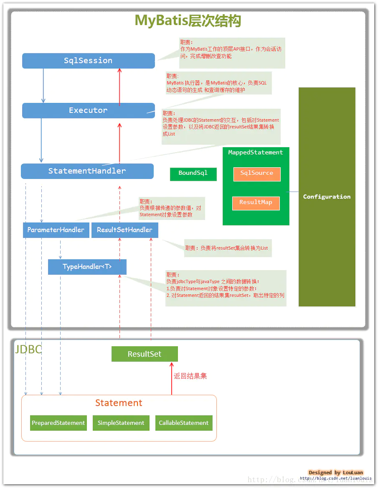

# mybatis spring boot


[Spring整合Mybatis核心总结](https://blog.csdn.net/weixin_39628945/article/details/111169146)


```
        <!-- Spring Boot Mybatis 依赖 -->
        <dependency>
            <groupId>org.mybatis.spring.boot</groupId>
            <artifactId>mybatis-spring-boot-starter</artifactId>
            <version>1.3.0</version>
        </dependency>
```


https://www.cnblogs.com/keepruning/p/9295395.html




application.yml


```
# Mybatis配置
mybatis:
    configLocation: classpath:mybatis.xml              #mybatis配置文件路径
    mapperLocations: classpath:mapper/**/*.xml  #所有mapper映射文件地址
```