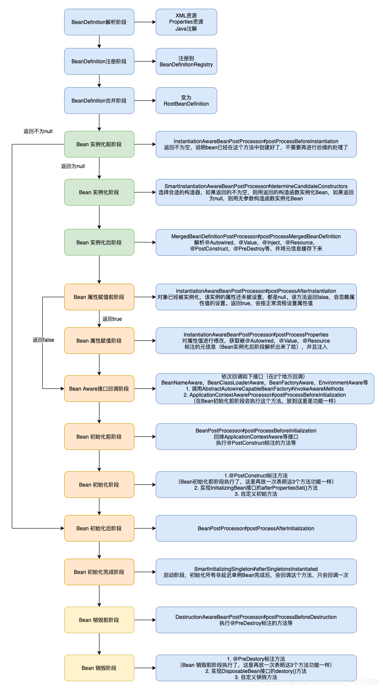
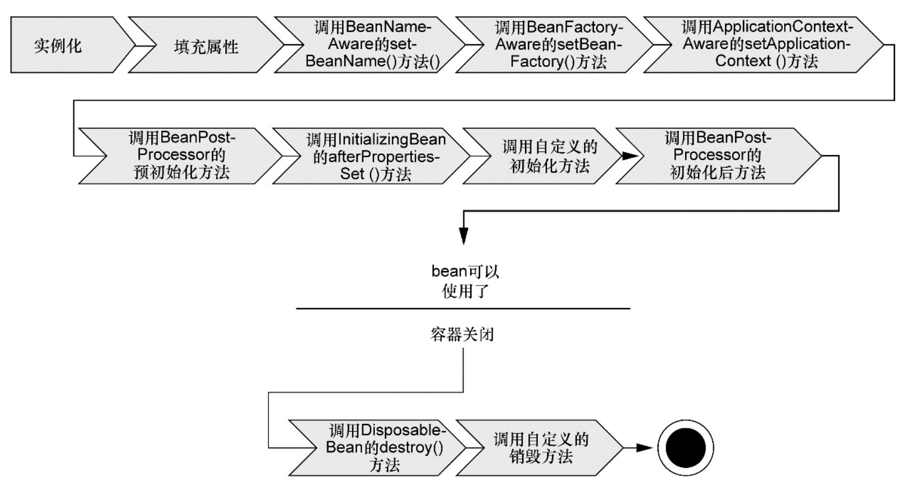

# Spring

Spring5.x 版本中 Web 模块的 Portlet 组件已经被废弃掉，同时增加了用于异步响应式处理的 WebFlux 组件。

## 自己写spring
https://github.com/DerekYRC/mini-spring

https://github.com/edidada/mini-spring-cloud

## spring 版本
spring 5 异步支持 webflux

Spring新功能
3.0
profile 多环境参数

查看java参数

```shell
java -XX:+PrintFlagsFinal -XX:+UnlockDiagnosticVMOptions -version | wc -l
java version "1.8.0_211"
Java(TM) SE Runtime Environment (build 1.8.0_211-b12)
Java HotSpot(TM) 64-Bit Server VM (build 25.211-b12, mixed mode)
```

public interface InitializingBean {
	void afterPropertiesSet() throws Exception;
}

public interface DisposableBean {
	void destroy() throws Exception;
}

spring api要记忆
SpringBoot之ApplicationRunner（一个spring容器启动完成执行的类）

Spring aop

Spring tx
@Transactional
Spring JDBC-Spring对事务管理的支持
https://blog.csdn.net/yangshangwei/article/details/78050480

xxxTransactionManager

jdbc DataSourceTransactionManager

事务	说明
org.springframework.orm.jpa.JpaTransactionManager	使用JPA进行持久化时，使用该事务管理器
org.springframework.orm.hibernateX.HibernateTransactionManager	使用HibernateX版本时使用该事务管理器
org.springframework.jdbc.datasource.DataSourceTransactionManager	使用SpringJDBC或MyBatis等基于DataSource数据源的持久化技术时，使用该事务管理器
org.springframework.orm.jdo.JdoTransactionManager	使用JDO进行持久化时，使用该事务管理器
org.springframework.transaction.jta.JtaTransactionManager	具有多个数据源的全局事务使用该事务管理器（不管采用何种持久化技术）

Springboot+Atomikos+Jpa+Mysql实现JTA分布式事务

MySQL/Spring事务隔离级别：
可串行化(serializable):保证可串行化调度。一些数据库系统对该隔离级别的实现，在某些情况下允许非可串行化执行。
可重复读(repetable read):只允许读取已提交的事务，而且一个事务两次读取一个数据项期间，其他事务不得更新该数据
已提交读(read commited):只允许读取已提交的数据，但不要求可重复读。（两次读取期间，其他事务可以更新数据）
未提交读(read uncommitted):允许读取未提交的数据(会出现脏读取)
MySQL隔离级别

事务隔离级别	脏读	不可重复读	幻读
读未提交（read-uncommitted）	是	是	是
不可重复读（read-committed）	否	是	是
可重复读（repeatable-read）	否	否	是
串行化（serializable）	否	否	否
JDBC
在JDBC(Java DataBase Connectivity)连接中，使用命令声明事务的开始、提交和取消。它通过java.sql.Connection接口实现，可以启用AutoCommit。
JDBC事务由Connnection对象控制管理，也就是说，事务管理实际上是在JDBC Connection中实现。事务周期限于Connection的生命周期。JDBC Connection接口(java.sql.Connection)提供了两种事务模式：自动提交和手工提交。
自动提交：缺省是自动提交。一条对数据库的更新（增/删/改）代表一项事务操作，操作成功后，系统将自动调用commit()来提交，否则将调用rollback()来回滚。
手工提交：通过调用setAutoCommit(false)来禁止自动提交。这样就可把多个数据库操作的表达式作为一个事务，在操作完成后调用commit()来进行整体提交，其中任何一个操作失败，都不会执行到commit()，并产生异常；此时可在异常捕获时调用rollback()进行回滚，以保持多次更新操作后，相关数据的一致性。
JDBC事务的一个缺点是事务的范围局限于一个数据库连接，一个JDBC事务不能跨越多个数据库。

JPA规范的实现主要是hibernate

JPA(Java Persistence API)为Java开发人员提供了一个对象/关系映射工具，用于管理Java应用程序中的关系数据。为我们提供了：
ORM映射元数据。JPA支持XML和注解两种元数据的形式，元数据描述对象和表之间的映射关系，框架据此将实体对象持久化到数据库表中。如：@Entity、@Table、@Column、@Transient等注解。
JPA的API。用来操作实体对象，执行CRUD操作，框架在后台替我们完成所有的事情，开发者从繁琐的JDBC和SQL代码中解脱出来。
JPQL查询语言：通过面向对象而非面向数据库的查询语言查询数据，避免程序的SQL语句紧密耦合。

https://www.cnblogs.com/xiaoyuanr/p/13904582.html

spring @Transtraction注解用法

```
ProxyFactory factory = new ProxyFactory(new SimplePojo());

factory.adddInterface(Pojo.class);

factory.addAdvice(new RetryAdvice());

factory.setExposeProxy(true);

Pojo pojo = (Pojo) factory.getProxy();

// this is a method call on the proxy! pojo.foo();
```
spring事务

https://docs.spring.io/spring/docs/4.0.5.RELEASE/spring-framework-reference/html/transaction.html

https://zhuanlan.zhihu.com/p/101396825

single, highly scalable database (such as Oracle RAC)

org.springframework.transaction.PlatformTransactionManager

public interface PlatformTransactionManager {

​      TransactionStatus getTransaction( TransactionDefinition definition) throws TransactionException;

​      void commit(TransactionStatus status) throws TransactionException;

​      void rollback(TransactionStatus status) throws TransactionException;
}

<bean id="txManager" class="org.springframework.jdbc.datasource.DataSourceTransactionManager">

​    <property name="dataSource" ref="dataSource"/>

</bean>

<tx:annotation-driven transaction-manager="txManager"/>

tx:advice
tx:attributes
tx:method
aop:config
aop:pointcut
aop:advisor

Spring的事务处理中，通用的事务处理流程是由抽象事务管理器AbstractPlatformTransactionManager来提供的，而具体的底层事务处理实现，由PlatformTransactionManager的具体实现类来实现，如 DataSourceTransactionManager 、JtaTransactionManager和 HibernateTransactionManager等。

spring编程式事务 声明式事务

https://zhuanlan.zhihu.com/p/46599754

对于只读查询，可以指定事务类型为readonly，即只读事务。

​    由于只读事务不存在数据的修改，因此数据库将会为只读事务提供一些优化手段，例如Oracle对于只读事务，不启动回滚段，不记录回滚log。指定只读事务的办法如下：

（1）在JDBC中，令connection.setReadOnly(true)；

hadoop flink beam

https://www.oschina.net/p/apachebeam

https://github.com/apache/beam

JSR303 - Bean Validation 为JavaBean的验证定义了相关的元数据模型和API。

在java 8之后，又推出了JSR380-Bean Validation 2.0

可以通过添加hibernate-validator-annotation-processor工具，在编译期就发现潜在错误使用约束的问题。maven依赖为：

<dependency>
  <groupId>org.hibernate</groupId>
  <artifactId>hibernate-validator-annotation-processor</artifactId>
  <version>6.1.5.Final</version>
</dependency>

添加此依赖后，编译时会提示相关的错误信息。
https://zhuanlan.zhihu.com/p/194097505

org.hibernate.validator.constraints.Length

最后给大家推荐下hibernate validate中文文档:

http://docs.jboss.org/hibernate/validator/4.2/reference/zh-CN/html_single/

javax.validation.ConstraintViolation

<dependency>
  <groupId>javax.validation</groupId>
  <artifactId>validation-api</artifactId>
  <version>2.0.1.Final</version>
</dependency>

查看hibernate依赖项

https://mvnrepository.com/artifact/org.hibernate.validator/hibernate-validator/6.1.4.Final

目前国内开发中间件产品的软件产商也在逐步增加，包括东方通，金蝶天燕，中创中间件，普元，宝兰德等。中间件承上启下，也会对国产软件甚至全球软件业起到促进作用

https://zhuanlan.zhihu.com/p/222111163

Spring框架事务处理技术研究
http://61.175.198.136:8083/rwt/WEIPUBK/http/NSVXELUDPF5GT6BPMNYXN/
Spring框架提供了强大的事务处理支持，包括声明式事务管理和编程式事务管理两种方式。下面是对这两种事务处理技术的简要介绍：
1. 声明式事务管理：
   - Spring的声明式事务管理是通过AOP（面向切面编程）实现的。
   - 通过在配置文件或注解中声明事务的属性，例如事务的传播行为、隔离级别、超时设置等。
   - 可以使用XML配置文件或基于注解的方式进行声明式事务管理。
   - 声明式事务管理对业务逻辑代码的侵入性较低，通过配置和注解就能实现事务的管理。
   - 声明式事务管理适用于需要将事务逻辑与业务逻辑解耦的场景。
2. 编程式事务管理：
   - 编程式事务管理是通过编写代码来管理事务的提交、回滚等操作。
   - Spring提供了`TransactionTemplate`类，通过它可以编写事务处理的代码。
   - 在编程式事务管理中，需要手动管理事务的开始、提交、回滚等操作。
   - 编程式事务管理对业务逻辑代码的侵入性较高，需要显式地在代码中编写事务相关的操作。
   - 编程式事务管理适用于需要更细粒度的事务控制或需要动态控制事务的场景。
   无论是声明式事务管理还是编程式事务管理，Spring框架都提供了对多种事务管理器的支持，包括JDBC事务、JTA事务、Hibernate事务等。可以根据具体的需求选择合适的事务管理器。

Spring的事务处理技术使得开发者能够轻松地管理和控制事务，提供了灵活且可扩展的事务管理方式。同时，Spring还支持与其他框架和技术的集成，如Spring Boot、Spring Data等，使得事务处理更加便捷和高效。
```java
import org.springframework.transaction.TransactionStatus;
import org.springframework.transaction.support.TransactionCallback;
import org.springframework.transaction.support.TransactionTemplate;

public class TransactionExample {
    
    private TransactionTemplate transactionTemplate;
    
    public void setTransactionTemplate(TransactionTemplate transactionTemplate) {
        this.transactionTemplate = transactionTemplate;
    }
    
    public void performTransaction() {
        transactionTemplate.execute(new TransactionCallback<Void>() {
            public Void doInTransaction(TransactionStatus status) {
                try {
                    // 在此处编写需要在事务中执行的业务逻辑代码
                    // 可能涉及数据库操作或其他资源访问
                    // 如果发生异常，事务将被回滚，否则将提交事务
                    // 可以在需要的地方使用status.setRollbackOnly()手动回滚事务
                    
                    // 示例：插入数据到数据库
                    insertDataIntoDatabase();
                    
                    // 示例：更新数据到数据库
                    updateDataInDatabase();
                    
                    // 在事务中执行的其他操作
                    
                } catch (Exception e) {
                    // 发生异常，标记事务为回滚状态
                    status.setRollbackOnly();
                    throw e;
                }
                return null;
            }
        });
    }
    
    private void insertDataIntoDatabase() {
        // 插入数据到数据库的逻辑
    }
    
    private void updateDataInDatabase() {
        // 更新数据到数据库的逻辑
    }
}
```

声明式事务

声明式事务 -- 编程式事务

https://zhuanlan.zhihu.com/p/54067384

https://blog.csdn.net/justloveyou_/article/details/73733278
Spring对方法的增强有五种方式：
前置增强（org.springframework.aop.BeforeAdvice）：在目标方法执行之前进行增强；
后置增强（org.springframework.aop.AfterReturningAdvice）：在目标方法执行之后进行增强；
环绕增强（org.aopalliance.intercept.MethodInterceptor）：在目标方法执行前后都执行增强；
异常抛出增强（org.springframework.aop.ThrowsAdvice）：在目标方法抛出异常后执行增强；
引介增强（org.springframework.aop.IntroductionInterceptor）：为目标类添加新的方法和属性。

TransactionDefinition

TransactionStatus


手写 Spring MVC
https://github.com/xpwi/spring-custom

Spring doc
PropertityEditor

AOP
Spring加载properties文件的两种方式
https://blog.csdn.net/eson_15/article/details/51365707

## spring的功能
KafkaTemplate spring-kafka org.springframework.kafka.core.KafkaTemplate
RedisTemplate spring-date-redis org.springframework.data.redis.core.RedisTemplate

发送消息
支持amqp协议，支持消息
http server restful
访问neo4j redis mongodb jdbc对应的mysql oracle 

自定义bean，继承某些接口 InitBean ApplicationAware Des BeanPostProcessor，bean生命周期

网页安全 spring security
单机定时任务 quartz

## spring的使用场景
- http springmvc soap cxf
- rpc 跟dubbo结合使用

## 不用spring，单纯用servlet api如何写web api
servlet实现 tomcat

自定义http server端口，tomcat里面设置
## 其他配置项如何从文件读取？
简单的
java.util.Properties

SpringBoot yaml格式的文件

Cpp
Go
Rust

### C++如何读取配置文件
在 C++ 中，有许多库可以用来读取配置文件。以下是其中的一些：
Boost.PropertyTree：这是一个非常强大的库，可以从各种格式的文件中读取数据，包括 INI 文件、XML 文件、JSON 文件等。它能够处理嵌套的配置数据。
Cascadia Code：Cascadia 是一个 Windows 平台的库，提供了一个 API 来处理 JSON 和 INI 文件。这个库被设计为易于使用，同时也能提供足够的灵活性和性能。
libconfig++：这是一个用于解析 libconfig 文件的库的 C++ 版本。libconfig 是一个用于存储和读取配置信息的跨平台库。
Simpleini：这是一个轻量级的库，专门用于处理 INI 文件。它支持注释、空行和嵌套的 section。
INIReader：这是一个简单的、轻量级的库，专门用于读取 INI 文件。它提供了一个易于使用的 API，并且没有外部依赖。
nlohmann/json：虽然 JSON 不是传统的配置文件格式，但 JSON 文件经常被用作配置文件。这个库可以方便地解析 JSON 文件，并且可以很容易地转换为 C++ 的数据结构。
请根据你的需求选择合适的库。

### Go如何读取配置文件
在Go语言中，可以使用第三方库来读取配置文件。一个常用的库是go-ini，它可以方便地读取和解析INI文件格式的配置文件。
要使用go-ini库，首先需要安装它。可以通过在终端中运行以下命令来安装：

```go
go get gopkg.in/ini.v1
```
安装完成后，可以按照以下步骤使用go-ini库读取配置文件：
导入库：

```go
import "gopkg.in/ini.v1"
```
加载配置文件：
```go
cfgFile := "config.ini" // 配置文件路径  
cfg, err := ini.Load(cfgFile)  
if err != nil {  
    // 处理加载配置文件错误  
}
```
获取配置项：
```go
section := cfg.Section("section_name") // 指定要读取的 section 名  
name := section.Key("key_name").String() // 获取指定 key 的值
```
遍历配置文件中的所有section和key：
```go
cfg.SectionIterator().Each(func(section *ini.Section, key *ini.Key) {  
    // 处理每个section和key的逻辑  
})
```
以上是使用go-ini库读取配置文件的基本步骤。你可以根据自己的需求进一步探索该库的其他功能和用法。

### Rust如何读取配置文件

在Rust中，有许多库可以用来读取配置文件。以下是其中的一些：
Config：Config 是一个功能完善的配置文件读取库，支持多种格式，如 TOML、JSON、YAML 等。它提供了一个简单易用的 API 来读取和操作配置数据。
libconfig：libconfig 是一个专门用于处理配置文件的库，它提供了一个易于使用的 API 来读取和写入配置数据。
env_logger：env_logger 是一个用于处理环境变量的库，可以方便地读取和操作环境变量。
toml：toml 是一个专门用于处理 TOML 格式文件的库，它提供了一个简单易用的 API 来读取和操作 TOML 文件中的数据。
serde：serde 是一个用于序列化和反序列化数据的库，可以用来读取和写入 JSON、TOML、YAML 等格式的配置文件。
请根据你的需求选择合适的库。

Spring Boot默认支持读取YAML格式的文件，这是通过Spring Boot的自动配置功能实现的。Spring Boot会自动配置一个PropertySourceLocator，用于将YAML文件加载到Spring应用程序上下文中。
具体来说，Spring Boot使用了一个名为YamlPropertySource的类，该类继承自PropertySource，它实现了从YAML文件中读取属性的功能。当Spring Boot启动时，它会自动扫描和加载所有以.yml或.yaml结尾的文件，并将其注册为Spring应用程序上下文中的属性源。
因此，你不需要额外的库或配置来读取YAML文件，只需将YAML文件放置在Spring Boot应用程序的配置目录中（默认是src/main/resources目录下的application.yml或application.yaml文件），Spring Boot就会自动将其加载到应用程序上下文中。

## spring工具类
BeanUtils org.springframework.beans.BeanUtils

spring事务

张开涛 跟我学spring 8章

jdbc事务
mybatis事务
spring tx事务

cxf

webservice三件套

SpringMvc接收multipart/form-data 传输的数据 及 PostMan各类数据类型的区别
https://www.cnblogs.com/ifindu-san/p/8251370.html

org.apache.ibatis.annotations.Mapper是MyBatis框架中的一个注解，用于标记一个接口作为Mapper接口. 该注解的作用是将接口标记为MyBatis Mapper接口，以便MyBatis框架可以扫描它并自动生成实现类 . 如果您想了解更多信息，请查看以下文章.

@Mapper @Repository区别
https://blog.csdn.net/qq_44421399/article/details/109825479

@Mapper是mybatis的
@Repository是spring的

@Repository是扫面类注入spring ioc
需要配置mybatis接口所在的package

testmybatisspring
打印spring日志

mybatis加载到spring
soring容器有哪些类

```
>>>>>>dataSource
>>>>>>hikariConfig
>>>>>>sqlSessionFactory
>>>>>>org.mybatis.spring.mapper.MapperScannerConfigurer#0
>>>>>>cn.wdidada.test.testmybatisspring.beans.MyBean#0
>>>>>>cn.wdidada.test.testmybatisspring.beans.MyBeanDefinitionRegistryPostProcessor#0
>>>>>>personDao
>>>>>>userDao
>>>>>>userFeedBackMapper
>>>>>>userMapper
>>>>>>org.springframework.context.annotation.internalConfigurationAnnotationProcessor
>>>>>>org.springframework.context.annotation.internalAutowiredAnnotationProcessor
>>>>>>org.springframework.context.annotation.internalRequiredAnnotationProcessor
>>>>>>org.springframework.context.event.internalEventListenerProcessor
>>>>>>org.springframework.context.event.internalEventListenerFactory

```

在spring初始化的过程中会注册六个非常重要的beandefinition，他们的名字分别是：
1.org.springframework.context.annotation.internalConfigurationAnnotationProcessor
2.org.springframework.context.annotation.internalAutowiredAnnotationProcessor
3.org.springframework.context.annotation.internalRequiredAnnotationProcessor
4.org.springframework.context.annotation.internalCommonAnnotationProcessor
5.org.springframework.context.event.internalEventListenerFactory
6.org.springframework.context.event.internalEventListenerProcessor
这六个名字他们分别对应了六个后置类他们分别是：
1.ConfigurationClassPostProcessor
2.AutowiredAnnotationBeanPostProcessor
3.RequiredAnnotationBeanPostProcessor
4.CommonAnnotationBeanPostProcessor
5.EventListenerMethodProcessor
6.DefaultEventListenerFactory

每个类在spring容器启动的过程中都起着至关重要的作用
(1)ConfigurationClassPostProcessor在之前的文章中提到过，他的作用就是扫描所有的类然后放入spring容器中；
(2)AutowiredAnnotationBeanPostProcessor的作用就是解析所有的@Autwried @Value然后在给早期对象填充属性的时候会去使用它；
(3)RequiredAnnotationBeanPostProcessor这个类的作用主要就是针对于@Required注解的解析；
(4)CommonAnnotationBeanPostProcessor这个类的作用就是支持通用Java注解,尤其是JSR-250注解,也就是javax.annotation包内的那些注解。比如 @PostConstruct, @PreDestroy,@Resource和@WebServiceRef，很多人认为 @PostConstruct是由spring提供的其实不是的，执行顺序为 @Autowired(依赖注入) -> @PostConstruct(注释的方法)；
(5)EventListenerMethodProcessor他的作用就是将@EventListener注解的方法作为单个ApplicationListener实例注册，它实现了SmartInitializingSingleton会在bean初始化完成以后调用，主要是执行所有@EventListener的方法；
(6)DefaultEventListenerFactory他的作用就是支持@EventListener注解的，上边的类在创建ApplicationListener的时候需要DefaultEventListenerFactory来进行创建。

https://blog.csdn.net/weixin_44225613/article/details/104503579


名字是“org.springframework.context.annotation.internalConfigurationAnnotationProcessor”。这个ConfigurationClassPostProcessor就是用来处理@Configuration注解的

https://blog.csdn.net/auerjds/article/details/111171150

@LookUp作用
https://blog.csdn.net/qq_25863845/article/details/123475147
@Lookup用于单例组件引用prototype组件。单例组件使用@Autowired方式注入prototype组件时，被引入prototype组件也会变成单例的。@Lookup可以保证被引入的组件保持prototype模式。

spring bean创建 三级缓存

DefaultSingletonBeanRegistry这个类
sdbr

`internalConfigurationAnnotationProcessor`是一个 Gradle 插件，它是由 Spring Boot Gradle 插件自动应用的一个注解处理器。
该注解处理器的作用是处理 Spring Boot 应用程序中的 `@ConfigurationProperties` 注解。在 Spring Boot 应用程序中，`@ConfigurationProperties` 注解通常用于将配置文件中的属性绑定到 Java 对象中，以便于在应用程序中使用。该注解处理器会扫描应用程序中的所有 `@ConfigurationProperties` 注解，并为它们生成相应的 Java Bean 类，以便于将配置文件中的属性值注入到这些 Bean 对象中。
具体来说，`internalConfigurationAnnotationProcessor` 的作用可以总结如下：

- 扫描应用程序中的 `@ConfigurationProperties` 注解
- 为这些注解生成相应的 Java Bean 类
- 将配置文件中的属性值注入到生成的 Bean 对象中
- 生成的 Bean 对象可以通过 Spring 的依赖注入机制在应用程序中使用

需要注意的是，`internalConfigurationAnnotationProcessor` 是一个内部实现细节，它不应该被直接使用或配置。如果你需要自定义注解处理器行为，建议使用 Gradle 的 `annotationProcessor` 或 `kapt` 插件，并手动配置相应的注解处理器。

AutowiredAnnotationBeanPostProcessor的作用就是解析所有的@Autwried @Value然后在给早期对象填充属性的时候会去使用它；

org.springframework.scheduling.concurrent.ThreadPoolTaskExecutor
这个类没有继承啥接口或者父类

public ExecutorService initializeExecutor()

`org.springframework.scheduling.concurrent.ThreadPoolTaskExecutor` 是 Spring 框架中的一个线程池实现，用于执行异步任务。它继承了 `java.util.concurrent.ThreadPoolExecutor` 类，并且实现了 Spring 的 `TaskExecutor` 接口。
使用 `ThreadPoolTaskExecutor`，你可以配置线程池的大小、队列容量、线程前缀等属性，以及在任务执行前、执行后、执行过程中发生异常时的回调方法。通过在应用程序中使用 `ThreadPoolTaskExecutor`，可以将耗时的操作转移到后台线程中，以避免阻塞主线程，从而提高应用程序的性能和响应速度。
具体来说，`ThreadPoolTaskExecutor` 的作用可以总结如下：

- 管理线程池的创建和销毁
- 处理异步任务，将其提交到线程池中执行
- 配置线程池的属性，例如线程池大小、队列容量等
- 提供回调方法，以便在任务执行前、执行后、执行过程中发生异常时进行处理

在 Spring MVC 中，将返回的对象序列化成 JSON 的过程是通过 HttpMessageConverter 实现的。Spring MVC 提供了多种 HttpMessageConverter 实现，其中 MappingJackson2HttpMessageConverter 是将对象序列化成 JSON 的常用实现。
在 Spring MVC 中，当一个请求处理方法返回一个对象时，Spring MVC 会使用 HandlerMethodReturnValueHandler 处理返回值。如果返回值的类型是需要序列化成 JSON 的类型，则会使用 HttpMessageConverter 将返回值序列化成 JSON。具体实现可以参考 RequestMappingHandlerAdapter 类中的 invokeHandlerMethod() 方法。

HandlerInterceptor是Spring MVC框架中的拦截器接口，可以用于在控制器执行前、后或视图渲染前对请求进行处理，通常用于实现权限控制、日志记录、数据验证等功能。
要获取请求头和请求尾并继续传递下去，可以在HandlerInterceptor的preHandle方法中进行处理。以下是一个示例代码：

public class MyInterceptor implements HandlerInterceptor {
    @Override
    public boolean preHandle(HttpServletRequest request, HttpServletResponse response, Object handler) throws Exception {
        // 获取请求头
        Enumeration<String> headerNames = request.getHeaderNames();
        while (headerNames.hasMoreElements()) {
            String headerName = headerNames.nextElement();
            String headerValue = request.getHeader(headerName);
            System.out.println(headerName + ": " + headerValue);
        }
        
        // 获取请求尾
        String footer = request.getParameter("footer");
        System.out.println("Footer: " + footer);
        
        // 继续传递下去
        return true;
    }
}


该类会将视图名解析为JSP文件名，并返回一个InternalResourceView对象，该对象负责将模型数据渲染到JSP视图中。在创建InternalResourceView对象时，InternalResourceViewResolver会将JSP文件名作为构造函数参数传递给InternalResourceView对象。同时，该类也支持配置视图前缀和后缀，以便更方便地引用JSP文件。
以下是一个示例配置：


<bean class="org.springframework.web.servlet.view.InternalResourceViewResolver">
  <property name="prefix" value="/WEB-INF/views/" />
  <property name="suffix" value=".jsp" />
</bean>

这个配置告诉Spring MVC在解析视图名时，将使用/WEB-INF/views/作为前缀，并将.jsp作为后缀。当Controller返回一个视图名时，例如home，ViewResolver会将其解析为/WEB-INF/views/home.jsp。这个JSP文件将由InternalResourceView对象渲染。

在 Spring MVC 中，View 是用来渲染模型数据的对象，可以是 JSP、Velocity、Freemarker 等模板技术，也可以是其他非模板技术如 PDF、Excel 等，甚至可以是其他 Web 层框架比如 Thymeleaf、React 等。View 是 Controller 处理完逻辑之后，根据返回的视图名字来渲染数据的一个组件。Spring MVC 提供了一些默认的 View 实现，比如 JstlView、InternalResourceView 等。
在 Spring MVC 中，View 的实现可以分为两类：
1. 基于模板技术的 View
这种 View 的实现是依赖于具体的模板引擎的，如 JSP、Freemarker、Velocity 等，它们通过解析和处理模板文件，将模型数据和模板文件中的表达式绑定起来，生成最终的 HTML 文档。
例如，Spring MVC 内置了一个 View 实现 JstlView，它是用来渲染 JSP 的。当控制器方法返回一个视图名字为“test”时，DispatcherServlet 会查找是否有名字为“test”的视图，如果有的话就会将模型数据和视图合并生成 HTML 页面，如果没有则抛出异常。在这个过程中，JstlView 会通过解析 JSP 页面，生成 Servlet，并将模型数据传递给这个 Servlet，最终得到渲染后的 HTML 页面。
2. 基于非模板技术的 View
这种 View 的实现不依赖于具体的模板引擎，而是通过编程方式生成 HTML 页面或其他格式的数据。例如，Spring MVC 提供了 AbstractExcelView 和 AbstractPdfView 两个 View 实现类，用于生成 Excel 和 PDF 格式的文件。
这些 View 实现类都是继承自 AbstractView，其中最主要的方法是 renderMergedOutputModel()，该方法用于将模型数据和视图合并生成最终的响应数据。在这个方法中，View 实现类可以访问模型数据和响应对象，从而将模型数据填充到响应对象中。
在Java中，也有一些开源的MVCC实现，如Infinispan和Apache Derby。这些实现通常都是基于Java语言自带的锁机制实现的，包括读写锁和乐观锁等。
总的来说，实现MVCC需要考虑一些复杂的问题，如锁的粒度、锁的类型、版本控制、事务隔离等。因此，在实现MVCC时，需要深入理解数据库系统的工作原理和并发控制机制，以及Java语言中的锁机制。

spring中文文档
https://www.docs4dev.com/docs/zh/spring-framework/5.1.3.RELEASE/reference/core.html#beans

comma (,), semicolon (;)

org.springframework.boot.autoconfigure.SpringBootApplication

@SpringBootApplication
自动装配


@SpringBootApplication是Spring Boot框架中的一个注解，表示一个Spring Boot应用程序的入口点。它是一个方便的注解，它将三个注解组合在一起：

@Configuration：指示类是一个配置类，它包含Spring bean的定义。
@EnableAutoConfiguration：启用Spring Boot的自动配置机制，根据类路径设置和其他条件自动配置Spring bean。
@ComponentScan：扫描指定的包及其子包，寻找带有特定注解的组件，并将它们注册为Spring bean。
@SpringBootApplication注解不仅简化了Spring Boot应用程序的配置，而且还能够自动配置很多Spring框架的功能，如自动配置Spring MVC、Spring Data JPA等。因此，使用@SpringBootApplication注解可以快速创建一个简单的Spring Boot应用程序。

在一个Spring Boot应用程序中，通常将@SpringBootApplication注解放在应用程序的主类上。主类是指应用程序的入口点，包含main方法和其他Spring Boot应用程序的配置。在@SpringBootApplication注解所在的主类中，也可以通过其他注解来配置Spring Boot应用程序的行为和功能，如@Controller、@Service、@Repository等。


基于xml的元数据
基于注解的元数据 2.5开始
基于Java的元数据 3.0

@Configuration, @Bean, @Import, 和 @DependsOn 

基于Java的元数据Spring容器，典型的使用@Bean修饰Java类的方法和@Configuration修饰的类

Servlet API (JSR 340)
WebSocket API (JSR 356)
Concurrency Utilities (JSR 236)
JSON Binding API (JSR 367)
Bean Validation (JSR 303)
JPA (JSR 338)
JMS (JSR 914)
as well as JTA/JCA setups for transaction coordination, if necessary.
the Dependency Injection (JSR 330) and Common Annotations (JSR 250) specifications（spring同样支持依赖注入和通用注解规范）
Spring5.0要求的最低Java版本为Java7

spring aop代码
https://zhuanlan.zhihu.com/p/617319712

事务底层原理是aop  TransactionInterceptor
https://www.zhihu.com/answer/2937095015
事务失效

IDEA使用SequenceDiagram，使用非常简单，我们只需要在需要生成时序图的方法上，点击鼠标右键，在idea的弹出菜单里面找到菜单，点击就可以。具体使用可以参照详细使用文档。

spring bean循环依赖 三级缓存 相关代码

一文告诉你Spring是如何利用"三级缓存"巧妙解决Bean的循环依赖问题的【享学Spring】
https://cloud.tencent.com/developer/article/1497692

org.springframework.beans.factory.support.DefaultSingletonBeanRegistry

dsbr

DefaultSingletonBeanRegistry类的属性

	/** Cache of singleton objects: bean name --> bean instance */
	private final Map<String, Object> singletonObjects = new ConcurrentHashMap<>(256);
	
	/** Cache of singleton factories: bean name --> ObjectFactory */
	private final Map<String, ObjectFactory<?>> singletonFactories = new HashMap<>(16);
	
	/** Cache of early singleton objects: bean name --> bean instance */
	private final Map<String, Object> earlySingletonObjects = new HashMap<>(16);

feign原理
https://zhuanlan.zhihu.com/p/371343762

spring全家桶课程资料，Windows电脑上有

讯飞:搞业务的基本都是增删改查吧，产品平台的就少点。

spring bean三级缓存
https://www.zhihu.com/answer/2379147054

手写spring的视频

Spring中的后置处理器分为两大类：
一类是针对Bean工厂的BeanFactoryPostProcessor
一类是针对Bean的BeanPostProcessor

```java
public interface BeanFactoryPostProcessor {
	void postProcessBeanFactory(BeanFactory beanFactory) throws BeansException;
}
```
```java
public interface BeanPostProcessor {
	@Nullable
	default Object postProcessBeforeInitialization(Object bean, String beanName) throws BeansException {
		return bean;
	}
	@Nullable
	default Object postProcessAfterInitialization(Object bean, String beanName) throws BeansException {
		return bean;
	}
}
```

[SpringBean生成流程详解 —— 由浅入深(附超精细流程图)
](https://blog.csdn.net/u011709538/article/details/129303025)

Spring声名式事务失效
1、被类里面其他方法直接调用  解决方案，必须被类调用
2、方法不是public
上面说到的两个问题，其实就是@Transactional注解使用不当，导致失效的两种情形；除此之外，以下几种情况也会导致事务失效：
业务代码中存在异常时，使用try…catch…语句块捕获，而catch语句块没有throw new RuntimeExecption异常;（最难被排查到问题且容易忽略）
注解@Transactional中Propagation属性值设置错误即Propagation.NOT_SUPPORTED（一般不会设置此种传播机制）
mysql关系型数据库，且存储引擎是MyISAM而非InnoDB，则事务会不起作用(比较少见)；
业务代码抛出异常类型非RuntimeException，事务失效；Spring默认抛出未检查unchecked异常（继承自 RuntimeException 的异常）或者 Error才回滚事务；其他异常不会触发回滚事务。如果在事务中抛出其他类型的异常，但却期望 Spring 能够回滚事务，就需要指定 rollbackFor属性。

https://www.zhihu.com/question/511211087/answer/2910590035

TransactionInterceptor （事务拦截器）

https://www.zhihu.com/answer/2910590035

https://www.cnblogs.com/aurawing/articles/1887030.html


spring三级缓存存了哪些信息
在Spring框架中，三级缓存用于存储Bean实例化过程中的信息，主要包括以下三种信息：
第一级缓存：单例对象缓存。存储已经实例化的单例Bean对象，以便下次使用时可以直接从缓存中获取，而不需要重新创建。
第二级缓存：提前暴露的Bean实例缓存。存储已经实例化但还未进行依赖注入的Bean实例，以便在依赖注入之前可以提前暴露Bean实例，供其他Bean进行依赖注入。
第三级缓存：早期Bean引用缓存。存储已经解析但还未实例化的Bean实例，以便在后续的实例化过程中可以避免循环依赖的问题。
这三级缓存分别存储了不同阶段的Bean实例化信息，通过缓存可以避免重复实例化Bean，提高Spring框架的性能和效率，并且可以更好地处理循环依赖问题。

DefaultSingletonBeanRegistry
org.springframework.beans.factory.support.DefaultSingletonBeanRegistry
Spring框架为了提高性能，使用了三级缓存，分别是singletonObjects、earlySingletonObjects、singletonFactories缓存。这样设计的原因是因为：
1. singletonObjects缓存：存储单例Bean实例化完成的对象，这些对象是可以被其他的Bean引用的，这部分缓存的主要目的是为了加快单例Bean的访问速度。
2. earlySingletonObjects缓存：存储正在创建中的单例Bean对象，一旦这些对象创建完成并存入singletonObjects缓存中，就会从该缓存中清除。这部分缓存的主要目的是为了解决循环依赖。
3. singletonFactories缓存：存储用于创建单例Bean的ObjectFactory，这个缓存的主要目的是为了解决BeanFactory单例Bean实现FactoryBean接口的情况，这里存储的是用于创建Bean的FactoryBean对象。

spring为什么使用三级缓存而不是两级
在Spring框架中，三级缓存是指用于Bean实例化的缓存，其目的是提高Spring的性能和效率。Spring框架之所以使用三级缓存而不是两级，是因为：
三级缓存能够提高Spring框架的性能和效率。在Spring框架中，Bean实例化需要从配置文件中读取配置信息，然后根据配置信息创建Bean实例。如果每次都需要重新读取配置信息，那么会降低Spring的性能和效率。因此，Spring框架使用缓存来存储已经读取的配置信息，以便下次使用。使用三级缓存可以更好地利用缓存，提高Spring的性能和效率。
三级缓存可以更好地处理循环依赖。在Spring框架中，Bean之间可能存在循环依赖，即Bean A依赖于Bean B，而Bean B又依赖于Bean A。如果使用两级缓存，那么循环依赖的处理可能会比较麻烦。而使用三级缓存，可以更好地处理循环依赖，避免出现循环依赖导致的死循环等问题。
因此，Spring框架使用三级缓存可以更好地提高性能和效率，并且可以更好地处理循环依赖。

[Spring 源码分析 (三)Spring 是如何把元素解析成 BeanDefinition 对象的](https://xie.infoq.cn/article/17eff2d7b5ba2e37ad169f47c)

[Sring 源码解析 (一)Spring 是怎么读取配置 Xml 文件的](https://xie.infoq.cn/article/de87256d3cc5823e8f3f83539)

[开源一夏 | 一场由 serialVersionUID 引发的线上问题](https://xie.infoq.cn/article/15a5b2568d5ff4ea4a68ab434)

Spring入参枚举类型转换
org.springframework.core.convert.converter.ConverterFactory;

SpringBoot 传参转换枚举
https://blog.csdn.net/qq_32867467/article/details/86743586

前端传的参数自动转换为枚举的方式——spring convert转换
https://blog.csdn.net/qq_45473439/article/details/121595619

Spring Converter入门之字符串转化为枚举
https://blog.csdn.net/CHENYUFENG1991/article/details/78242369

Spring框架在启动时，会在ConfigurationClassPostProcessor这个bean工厂后置处理器中将需要被加载到容器中的bean扫描到并创建BeanDefinition，然后缓存到BeanFactory的beanDefinitionMap中，beanDefinitionMap是一个Map，用于存放BeanDefinition，键为bean在容器中的名称，值为bean对应的BeanDefinition。
https://segmentfault.com/a/1190000041588395

打印Spring中所有的容器实例

https://www.cnblogs.com/jun1019/p/10807575.html

mybatis-spring在Spring容器中注入了哪些bean
spring项目
spring xml 注解定义的项目
spring mvc
spring boot

@Controller()后面加url不生效
@RequestMapping("")

Spring中@Autowired注解的工作原理
https://blog.csdn.net/Weixiaohuai/article/details/123005140

用法：
@Autowired注解可以应用在构造方法，普通方法，参数，字段，以及注解这五种类型的地方

AutowiredAnnotationBeanPostProcessor

总结：AutowiredAnnotationBeanPostProcessor#postProcessMergedBeanDefinition()方法的作用其实是，找到目标bean对象中的属性或者方法是否使用了@Autowired注解修饰，如果有@Autowired注解修饰，将会解析得到注解相关信息，将需要依赖注入的属性信息封装到InjectionMetadata类中，InjectionMetadata类中包含了哪些需要注入的元素及元素要注入到哪个目标类中。并将其存入到缓存injectionMetadataCache中，方便后面使用。说简单点，AutowiredAnnotationBeanPostProcessor#postProcessMergedBeanDefinition()方法其实就是找到那些需要自动装配的元素。

通过前面的分析，我们已经知道了@Autowired完成自动装配主要是在AutowiredAnnotationBeanPostProcessor后置处理器中实现的，主要分为两个步骤：

找出需要自动装配的元素：具体实现在AutowiredAnnotationBeanPostProcessor#postProcessMergedBeanDefinition()方法；
注入属性：具体实现在AutowiredAnnotationBeanPostProcessor#postProcessProperties()方法


有没有更好的设计方法

## Spring aop

Spring tx
@Transnal

##  Spring JDBC-Spring对事务管理的支持
https://blog.csdn.net/yangshangwei/article/details/78050480

xxxTransactionManager

jdbc DataSourceTransactionManager

事务	说明
org.springframework.orm.jpa.JpaTransactionManager	使用JPA进行持久化时，使用该事务管理器
org.springframework.orm.hibernateX.HibernateTransactionManager	使用HibernateX版本时使用该事务管理器
org.springframework.jdbc.datasource.DataSourceTransactionManager	使用SpringJDBC或MyBatis等基于DataSource数据源的持久化技术时，使用该事务管理器
org.springframework.orm.jdo.JdoTransactionManager	使用JDO进行持久化时，使用该事务管理器
org.springframework.transaction.jta.JtaTransactionManager	具有多个数据源的全局事务使用该事务管理器（不管采用何种持久化技术）

Springboot+Atomikos+Jpa+Mysql实现JTA分布式事务


事务隔离级别：

可串行化(serializable):保证可串行化调度。一些数据库系统对该隔离级别的实现，在某些情况下允许非可串行化执行。
可重复读(repetable read):只允许读取已提交的事务，而且一个事务两次读取一个数据项期间，其他事务不得更新该数据
已提交读(read commited):只允许读取已提交的数据，但不要求可重复读。（两次读取期间，其他事务可以更新数据）
未提交读(read uncommitted):允许读取未提交的数据(会出现脏读取)
MySQL隔离级别

事务隔离级别	脏读	不可重复读	幻读
读未提交（read-uncommitted）	是	是	是
不可重复读（read-committed）	否	是	是
可重复读（repeatable-read）	否	否	是
串行化（serializable）	否	否	否
JDBC
在JDBC(Java DataBase Connectivity)连接中，使用命令声明事务的开始、提交和取消。它通过java.sql.Connection接口实现，可以启用AutoCommit。
JDBC事务由Connnection对象控制管理，也就是说，事务管理实际上是在JDBC Connection中实现。事务周期限于Connection的生命周期。JDBC Connection接口(java.sql.Connection)提供了两种事务模式：自动提交和手工提交。
自动提交：缺省是自动提交。一条对数据库的更新（增/删/改）代表一项事务操作，操作成功后，系统将自动调用commit()来提交，否则将调用rollback()来回滚。
手工提交：通过调用setAutoCommit(false)来禁止自动提交。这样就可把多个数据库操作的表达式作为一个事务，在操作完成后调 用commit()来进行整体提交，其中任何一个操作失败，都不会执行到commit()，并产生异常；此时可在异常捕获时调用rollback()进行回滚，以保持多次更新操作后，相关数据的一致性。
JDBC 事务的一个缺点是事务的范围局限于一个数据库连接，一个 JDBC 事务不能跨越多个数据库。

JPA规范的实现主要是hibernate

JPA(Java Persistence API)为 Java 开发人员提供了一个对象 / 关系映射工具，用于管理 Java 应用程序中的关系数据。为我们提供了：
ORM映射元数据。JPA支持XML和注解两种元数据的形式，元数据描述对象和表之间的映射关系，框架据此将实体对象持久化到数据库表中。如：@Entity、@Table、@Column、@Transient等注解。
JPA 的API。用来操作实体对象，执行CRUD操作，框架在后台替我们完成所有的事情，开发者从繁琐的JDBC和SQL代码中解脱出来。
JPQL查询语言：通过面向对象而非面向数据库的查询语言查询数据，避免程序的SQL语句紧密耦合。

https://www.cnblogs.com/xiaoyuanr/p/13904582.html

## sping两种代理


###  <init-method>效果跟实现InitializingBean接口是一样的吗？
在Spring中，<init-method>标签和实现InitializingBean接口都可以用来指定Bean初始化之后执行的方法，但是它们的实现方式和用途是有些不同的。

spring ioc中的bean，创建好之后执行特定方法

```java
public class MyBean implements InitializingBean {

    @Override
    public void afterPropertiesSet() throws Exception {
        // 在这里进行初始化操作
    }
}
```


在 Spring 的 XML 配置文件中，如果你需要在 Bean 创建好之后执行特定方法，可以使用 Spring 提供的 `<init-method>` 和 `<destroy-method>` 元素。

1. `<init-method>` 元素：该元素用于指定 Bean 创建完成后要执行的初始化方法。你可以在该方法中进行一些初始化操作，例如初始化成员变量、连接数据库等。例如：
```
<bean id="myBean" class="com.example.MyBean" init-method="init">
    <!-- 在这里进行其他配置 -->
</bean>
```
在这个例子中，我们定义了一个名为 `myBean` 的 Bean，并使用 `<init-method>` 元素指定了一个名为 `init()` 的方法。在该方法中，我们可以进行一些初始化操作，例如初始化成员变量、连接数据库等。
2. `<destroy-method>` 元素：该元素用于指定 Bean 销毁之前要执行的清理方法。你可以在该方法中进行一些清理操作，例如关闭数据库连接、释放资源等。例如：
```
<bean id="myBean" class="com.example.MyBean" destroy-method="cleanup">
    <!-- 在这里进行其他配置 -->
</bean>
```
在这个例子中，我们定义了一个名为 `myBean` 的 Bean，并使用 `<destroy-method>` 元素指定了一个名为 `cleanup()` 的方法。在该方法中，我们可以进行一些清理操作，例如关闭数据库连接、释放资源等。
需要注意的是，使用 `<init-method>` 和 `<destroy-method>` 元素将使你的 Bean 与 Spring 框架产生强耦合。如果你想使你的 Bean 更加独立和可重用，可以使用 Spring 提供的注解来实现。
例如，你可以使用 `@PostConstruct` 注解来指定一个方法，在 Bean 创建好之后立即执行。例如：

```
public class MyBean {

    @PostConstruct
    public void init() {
        // 在这里进行初始化操作
    }
}
```

在这个例子中，我们定义了一个名为 `MyBean` 的 Bean，并使用 `@PostConstruct` 注解指定了一个名为 `init()` 的方法。在该方法中，我们可以进行一些初始化操作，例如初始化成员变量、连接数据库等。
类似地，你可以使用 `@PreDestroy` 注解来指定一个方法，在 Bean 销毁之前执行。例如：

```
public class MyBean {

    @PreDestroy
    public void cleanup() {
        // 在这里进行清理操作
    }
}
```

在这个例子中，我们定义了一个名为 `MyBean` 的 Bean，并使用 `@PreDestroy` 注解指定了一个名为 `cleanup()` 的方法。在该方法中，我们可以进行一些清理操作，例如关闭数据库连接、释放资源等。
总之，在 Spring 的 XML 配置文件中，如果你需要在 Bean 创建好之后执行特定方法，可以使用 `<init-method>` 和 `<destroy-method>` 元素。如果你想使你的 Bean 更加独立和可重用，可以使用 Spring 提供的注解来实现。

## 自己写spring

https://github.com/edidada/minis


廖雪峰 自己写spring

https://gitee.com/edidada/summer-framework


https://www.liaoxuefeng.com/wiki/1539348902182944





Spring 对bean 进行实例化。
  Spring 将值和bean的引用注入到bean对应的属性中。
  如果bean实现了BeanNameAware接口，Spring将bean的ID传递给setBean-Name()  方法。
  如果bean 实现了BeanFactoryAware接口，Spring将调用setBeanFactory() 方法，将BeanFactory容器实例传入。
  如果bean实现了ApplicationContextAware接口，Spring将调用setApplicationContext() 方法，将bean所在的应用上下文的引用传入进来。
  如果bean实现了BeanPostProcessor接口，Spring将调用它们的post-ProcessBeforeInitialization() 方法
  如果bean实现了InitializingBean接口，Spring将调用它们的after-PropertiesSet()方法。类似的，如果bean使用init-method声明了初始化方法，该方法也会被调用。
  如果bean实现了BeanPostProcessor接口，Spring将调用它们的post-ProcessAfterInitialization() 方法。
  此时, bean 已经准备就绪，可以被应用程序使用了，它们将一直驻留在应用上下文中，直到该应用上下文被销毁。
  如果bean实现了DisposableBean接口，Spring将调用它的destory()接口方法。同样,如果bean使用destroy-method声明了销毁方法，该方法也会被调用。


https://www.cnblogs.com/misscai/p/14749225.html


### bean属性及子元素使用总结 13属性 6子元素

bean标签
标签属性
id
id是bean的唯一标识符，在spring容器中不可能同时存在两个相同的id；
class
类的全限定名（包名+类名），用“.”号连接；
name
别名（alias），用法：getBean("name")，支持设置多个别名，之间用英文逗号分割；
abstract
设置bean是否为抽象类，默认abstract="false",如果设为true，将不能被实例化；
autowire-candidate
默认为true，如果为false，那么该bean不能作为其他bean自动装配的候选者。

autowire
default（默认）：采用父级标签beans中的default-autowire属性；
byName：通过属性名称来自动装配，即A类中的B对象名称为name，那么将根据id="name"找到该bean进行装配，A类必须提供setName方法；
byType：根据属性类型来找到和配置文件中配置的class类型一致的bean来自动装配，如果找到多个类型一致的bean，则抛异常，如果一个都没有找到，则不执行装配操作，也不抛出异常。
no：不执行自动装配操作，只能用<ref>标签进行装配；
constructor：根据构造器中参数类型来自动装配，如果找到多个类型一致的bean，则抛异常，如果一个都没有找到，则不执行装配操作，但是抛出异常（这是和byType不一样的地方）。
“autodetect”（spring3之前有该值，从spring4开始该值被抛弃）:通过Bean类的反省机制（introspection）决定是使用“constructor”还是使用“byType”。
depends-on
它的作用是一个bean实例化的过程需要依赖于另一个bean的初始化，也就是说被依赖的bean将会在需要依赖的bean初始化之前加载。多个依赖bean之间用","号分割；
destroy-method
它的作用是在销毁bean之前可以执行指定的方法。注意：必须满足scope="singleton"，并且destroy方法参数个数不能超过1，并且参数类型只能为boolean。
init-method
它的作用是在创建一个bean之后调用该方法，初始化方法必须是一个无参方法。
factory-bean和factory-method
设置了factory-bean属性后，将指定创建bean的工厂类对象，class属性将失效；
lazy-init
设置bean对象是否懒加载，如果设为true，则应用第一次用到bean时才实例化对象，否则在初始化spring容器时加载单例bean对象。（非单例不实例化）
parent
指定bean的父类，class属性失效。
primary
当一个bean出现多个候选者时，设置primary="true"后，则优先使用该bean来自动装配。

scope
bean的作用范围，它包括
singleton：单例，指定该bean在spring容器中只有一个对象，所有通过getBean获得的对象都是同一个对象。
prototype：只要重新获取该bean，都将返回一个不同的对象。
request：在一次http请求中对应一个bean，类似于servlet
session：在一次会话中对应一个bean。


子标签属性
<meta>
<lookup-method>
<replaced-method>
<constructor-arg>
<property>
<qualifier>


## edidada/SpringExample


https://github.com/edidada/SpringExample

PropertyPlaceholderConfigurer是Spring框架中的一个类，它是用来解析properties文件的。在Spring中，我们可以使用${}或#{}来引用properties文件中的值。这个类就是用来解析这些占位符的。如果你想深入了解这个类的实现，可以参考这篇博客：1。已收到消息.PropertyPlaceholderConfigurer是Spring框架中的一个类，它是用来解析properties文件的。在Spring中，我们可以使用${}或#{ }来引用properties文件中的值。这个类就是用来解析这些占位符的。如果你想深入了解这个类的实现，可以参考这篇博客：。
了解详细信息:
https://www.cnblogs.com/juniorMa/p/14323883.html


https://www.docs4dev.com/docs/zh/spring-framework/4.3.21.RELEASE/reference/aop.html

张开涛 跟我学Spring3 系列博客
跟我学spring 用的是spring3

Spring实战

## Spring 3.x企业开发实战
1. 什么是spring?Spring 是个java企业级应用的开源开发框架。Spring主要用来开发Java应用，但是有些扩展是针对构建J2EE平台的web应用。Spring 框架目标是简化Java企业级应用开发，并通过POJO为基础的编程模型促进良好的编程习惯。
2. 使用Spring框架的好处是什么？轻量：Spring 是轻量的，基本的版本大约2MB。控制反转：Spring通过控制反转实现了松散耦合，对象们给出它们的依赖，而不是创建或查找依赖的对象们。面向切面的编程(AOP)：Spring支持面向切面的编程，并且把应用业务逻辑和系统服务分开。容器：Spring 包含并管理应用中对象的生命周期和配置。MVC框架：Spring的WEB框架是个精心设计的框架，是Web框架的一个很好的替代品。事务管理：Spring 提供一个持续的事务管理接口，可以扩展到上至本地事务下至全局事务（JTA）。异常处理：Spring 提供方便的API把具体技术相关的异常（比如由JDBC，Hibernate or JDO抛出的）转化为一致的unchecked 异常。
3. Spring由哪些模块组成?以下是Spring 框架的基本模块：Core moduleBean moduleContext moduleExpression Language moduleJDBC moduleORM moduleOXM moduleJava Messaging Service(JMS) moduleTransaction moduleWeb moduleWeb-Servlet moduleWeb-Struts moduleWeb-Portlet module
4. 核心容器（应用上下文) 模块。这是基本的Spring模块，提供spring 框架的基础功能，BeanFactory 是 任何以spring为基础的应用的核心。Spring 框架建立在此模块之上，它使Spring成为一个容器。
5. BeanFactory – BeanFactory 实现举例。Bean 工厂是工厂模式的一个实现，提供了控制反转功能，用来把应用的配置和依赖从正真的应用代码中分离。最常用的BeanFactory 实现是XmlBeanFactory 类。
6. XMLBeanFactory最常用的就是org.springframework.beans.factory.xml.XmlBeanFactory ，它根据XML文件中的定义加载beans。该容器从XML 文件读取配置元数据并用它去创建一个完全配置的系统或应用。
7. 解释AOP模块AOP模块用于发给我们的Spring应用做面向切面的开发， 很多支持由AOP联盟提供，这样就确保了Spring和其他AOP框架的共通性。这个模块将元数据编程引入Spring。
8. 解释JDBC抽象和DAO模块。通过使用JDBC抽象和DAO模块，保证数据库代码的简洁，并能避免数据库资源错误关闭导致的问题，它在各种不同的数据库的错误信息之上，提供了一个统一的异常访问层。它还利用Spring的AOP 模块给Spring应用中的对象提供事务管理服务。
9. 解释对象/关系映射集成模块。Spring 通过提供ORM模块，支持我们在直接JDBC之上使用一个对象/关系映射映射(ORM)工具，Spring 支持集成主流的ORM框架，如Hiberate,JDO和 iBATIS SQL Maps。Spring的事务管理同样支持以上所有ORM框架及JDBC。
10. 解释WEB 模块。Spring的WEB模块是构建在application context 模块基础之上，提供一个适合web应用的上下文。这个模块也包括支持多种面向web的任务，如透明地处理多个文件上传请求和程序级请求参数的绑定到你的业务对象。它也有对Jakarta Struts的支持。
11. Spring配置文件Spring配置文件是个XML 文件，这个文件包含了类信息，描述了如何配置它们，以及如何相互调用。
12. 什么是Spring IOC 容器？Spring IOC 负责创建对象，管理对象（通过依赖注入（DI），装配对象，配置对象，并且管理这些对象的整个生命周期。
13. 你可以在Spring中注入一个null 和一个空字符串吗？可以。
14. IOC的优点是什么？IOC 或 依赖注入把应用的代码量降到最低。它使应用容易测试，单元测试不再需要单例和JNDI查找机制。最小的代价和最小的侵入性使松散耦合得以实现。IOC容器支持加载服务时的饿汉式初始化和懒加载。
15. ApplicationContext通常的实现是什么?FileSystemXmlApplicationContext ：此容器从一个XML文件中加载beans的定义，XML Bean 配置文件的全路径名必须提供给它的构造函数。ClassPathXmlApplicationContext：此容器也从一个XML文件中加载beans的定义，这里，你需要正确设置classpath因为这个容器将在classpath里找bean配置。WebXmlApplicationContext：此容器加载一个XML文件，此文件定义了一个WEB应用的所有bean。
16. Bean 工厂和 Application contexts 有什么区别？Application contexts提供一种方法处理文本消息，一个通常的做法是加载文件资源（比如镜像），它们可以向注册为监听器的bean发布事件。另外，在容器或容器内的对象上执行的那些不得不由bean工厂以程序化方式处理的操作，可以在Application contexts中以声明的方式处理。Application contexts实现了MessageSource接口，该接口的实现以可插拔的方式提供获取本地化消息的方法。
17. 一个Spring的应用看起来象什么？一个定义了一些功能的接口。这实现包括属性，它的Setter ， getter 方法和函数等。Spring AOP。Spring 的XML 配置文件。使用以上功能的客户端程序。
18. 什么是Spring的依赖注入？依赖注入，是IOC的一个方面，是个通常的概念，它有多种解释。这概念是说你不用创建对象，而只需要描述它如何被创建。你不在代码里直接组装你的组件和服务，但是要在配置文件里描述哪些组件需要哪些服务，之后一个容器（IOC容器）负责把他们组装起来。
19. 有哪些不同类型的IOC（依赖注入）方式？构造器依赖注入：构造器依赖注入通过容器触发一个类的构造器来实现的，该类有一系列参数，每个参数代表一个对其他类的依赖。Setter方法注入：Setter方法注入是容器通过调用无参构造器或无参static工厂 方法实例化bean之后，调用该bean的setter方法，即实现了基于setter的依赖注入。
20. 哪种依赖注入方式你建议使用，构造器注入，还是 Setter方法注入？你两种依赖方式都可以使用，构造器注入和Setter方法注入。最好的解决方案是用构造器参数实现强制依赖，setter方法实现可选依赖。
21. 什么是Spring beans?Spring beans 是那些形成Spring应用的主干的java对象。它们被Spring IOC容器初始化，装配，和管理。这些beans通过容器中配置的元数据创建。比如，以XML文件中<bean/> 的形式定义。Spring 框架定义的beans都是单件beans。在bean tag中有个属性”singleton”，如果它被赋为TRUE，bean 就是单件，否则就是一个 prototype bean。默认是TRUE，所以所有在Spring框架中的beans 缺省都是单件。
22. 一个 Spring Bean 定义 包含什么？一个Spring Bean 的定义包含容器必知的所有配置元数据，包括如何创建一个bean，它的生命周期详情及它的依赖。
23. 如何给Spring 容器提供配置元数据?这里有三种重要的方法给Spring 容器提供配置元数据。XML配置文件。基于注解的配置。基于java的配置。
24. 你怎样定义类的作用域?当定义一个<bean> 在Spring里，我们还能给这个bean声明一个作用域。它可以通过bean 定义中的scope属性来定义。如，当Spring要在需要的时候每次生产一个新的bean实例，bean的scope属性被指定为prototype。另一方面，一个bean每次使用的时候必须返回同一个实例，这个bean的scope 属性 必须设为 singleton。
25. 解释Spring支持的几种bean的作用域。Spring框架支持以下五种bean的作用域：singleton: bean在每个Spring ioc 容器中只有一个实例。prototype：一个bean的定义可以有多个实例。request：每次http请求都会创建一个bean，该作用域仅在基于web的Spring ApplicationContext情形下有效。session：在一个HTTP Session中，一个bean定义对应一个实例。该作用域仅在基于web的Spring ApplicationContext情形下有效。global-session：在一个全局的HTTP Session中，一个bean定义对应一个实例。该作用域仅在基于web的Spring ApplicationContext情形下有效。缺省的Spring bean 的作用域是Singleton.
26. Spring框架中的单例bean是线程安全的吗?不，Spring框架中的单例bean不是线程安全的。
27. 解释Spring框架中bean的生命周期。Spring容器 从XML 文件中读取bean的定义，并实例化bean。Spring根据bean的定义填充所有的属性。如果bean实现了BeanNameAware 接口，Spring 传递bean 的ID 到 setBeanName方法。如果Bean 实现了 BeanFactoryAware 接口， Spring传递beanfactory 给setBeanFactory 方法。如果有任何与bean相关联的BeanPostProcessors，Spring会在postProcesserBeforeInitialization()方法内调用它们。如果bean实现IntializingBean了，调用它的afterPropertySet方法，如果bean声明了初始化方法，调用此初始化方法。如果有BeanPostProcessors 和bean 关联，这些bean的postProcessAfterInitialization() 方法将被调用。如果bean实现了 DisposableBean，它将调用destroy()方法。
28. 哪些是重要的bean生命周期方法？ 你能重载它们吗？有两个重要的bean 生命周期方法，第一个是setup ， 它是在容器加载bean的时候被调用。第二个方法是 teardown 它是在容器卸载类的时候被调用。The bean 标签有两个重要的属性（init-method和destroy-method）。用它们你可以自己定制初始化和注销方法。它们也有相应的注解（@PostConstruct和@PreDestroy）。
29. 什么是Spring的内部bean？当一个bean仅被用作另一个bean的属性时，它能被声明为一个内部bean，为了定义inner bean，在Spring 的 基于XML的 配置元数据中，可以在 <property/>或 <constructor-arg/> 元素内使用<bean/> 元素，内部bean通常是匿名的，它们的Scope一般是prototype。
30. 在 Spring中如何注入一个java集合？Spring提供以下几种集合的配置元素：<list>类型用于注入一列值，允许有相同的值。<set> 类型用于注入一组值，不允许有相同的值。<map> 类型用于注入一组键值对，键和值都可以为任意类型。<props>类型用于注入一组键值对，键和值都只能为String类型。
31. 什么是bean装配?装配，或bean 装配是指在Spring 容器中把bean组装到一起，前提是容器需要知道bean的依赖关系，如何通过依赖注入来把它们装配到一起。32. 什么是bean的自动装配？Spring 容器能够自动装配相互合作的bean，这意味着容器不需要<constructor-arg>和<property>配置，能通过Bean工厂自动处理bean之间的协作。33. 解释不同方式的自动装配 。有五种自动装配的方式，可以用来指导Spring容器用自动装配方式来进行依赖注入。no：默认的方式是不进行自动装配，通过显式设置ref 属性来进行装配。byName：通过参数名 自动装配，Spring容器在配置文件中发现bean的autowire属性被设置成byname，之后容器试图匹配、装配和该bean的属性具有相同名字的bean。byType：通过参数类型自动装配，Spring容器在配置文件中发现bean的autowire属性被设置成byType，*之后容器试图匹配、装配和该bean的属性具有相同类型的bean。如果有多个bean符合条件，则抛出错误。constructor：这个方式类似于byType， 但是要提供给构造器参数，如果没有确定的带参数的构造器参数类型，将会抛出异常。autodetect：首先尝试使用constructor来自动装配，如果无法工作，则使用byType方式。34.自动装配有哪些局限性 ?自动装配的局限性是：重写： 你仍需用 <constructor-arg>和 <property> 配置来定义依赖，意味着总要重写自动装配。基本数据类型：你不能自动装配简单的属性，如基本数据类型，String字符串，和类。模糊特性：自动装配不如显式装配精确，如果有可能，建议使用显式装配。
35. @RequestMapping 注解
该注解是用来映射一个URL到一个类或一个特定的方处理法上。
36. 什么是基于Java的Spring注解配置? 给一些注解的例子.
基于Java的配置，允许你在少量的Java注解的帮助下，进行你的大部分Spring配置而非通过XML文件。
以@Configuration 注解为例，它用来标记类可以当做一个bean的定义，被Spring IOC容器使用。另一个例子是@Bean注解，它表示此方法将要返回一个对象，作为一个bean注册进Spring应用上下文。
37. 什么是基于注解的容器配置?
相对于XML文件，注解型的配置依赖于通过字节码元数据装配组件，而非尖括号的声明。
开发者通过在相应的类，方法或属性上使用注解的方式，直接组件类中进行配置，而不是使用xml表述bean的装配关系。
38. 怎样开启注解装配？
注解装配在默认情况下是不开启的，为了使用注解装配，我们必须在Spring配置文件中配置 <context:annotation-config/>元素。
39. @Required 注解
这个注解表明bean的属性必须在配置的时候设置，通过一个bean定义的显式的属性值或通过自动装配，若@Required注解的bean属性未被设置，容器将抛出BeanInitializationException。
40. @Autowired 注解
@Autowired 注解提供了更细粒度的控制，包括在何处以及如何完成自动装配。它的用法和@Required一样，修饰setter方法、构造器、属性或者具有任意名称和/或多个参数的PN方法。
41. @Qualifier 注解
当有多个相同类型的bean却只有一个需要自动装配时，将@Qualifier 注解和@Autowire 注解结合使用以消除这种混淆，指定需要装配的确切的bean。
42.在Spring框架中如何更有效地使用JDBC?
使用SpringJDBC 框架，资源管理和错误处理的代价都会被减轻。所以开发者只需写statements 和 queries从数据存取数据，JDBC也可以在Spring框架提供的模板类的帮助下更有效地被使用，这个模板叫JdbcTemplate （例子见这里here）
43. JdbcTemplate
JdbcTemplate 类提供了很多便利的方法解决诸如把数据库数据转变成基本数据类型或对象，执行写好的或可调用的数据库操作语句，提供自定义的数据错误处理。
44. Spring对DAO的支持
Spring对数据访问对象（DAO）的支持旨在简化它和数据访问技术如JDBC，Hibernate or JDO 结合使用。这使我们可以方便切换持久层。编码时也不用担心会捕获每种技术特有的异常。
45. 使用Spring通过什么方式访问Hibernate?
在Spring中有两种方式访问Hibernate：
控制反转 Hibernate Template和 Callback。
继承 HibernateDAOSupport提供一个AOP 拦截器。
46. Spring支持的ORM
Spring支持以下ORM：

- Hibernate
- iBatis
- JPA (Java Persistence API)
- TopLink
- JDO (Java Data Objects)
- OJB

47. 如何通过HibernateDaoSupport将Spring和Hibernate结合起来？
用Spring的 SessionFactory 调用 LocalSessionFactory。集成过程分三步：
配置the Hibernate SessionFactory。
继承HibernateDaoSupport实现一个DAO。
在AOP支持的事务中装配。
48. Spring支持的事务管理类型
Spring支持两种类型的事务管理：

- 编程式事务管理：这意味你通过编程的方式管理事务，给你带来极大的灵活性，但是难维护。
- 声明式事务管理：这意味着你可以将业务代码和事务管理分离，你只需用注解和XML配置来管理事务。

49. Spring框架的事务管理有哪些优点？

- 它为不同的事务API 如 JTA，JDBC，Hibernate，JPA 和JDO，提供一个不变的编程模式。
- 它为编程式事务管理提供了一套简单的API而不是一些复杂的事务API如
- 它支持声明式事务管理。
- 它和Spring各种数据访问抽象层很好得集成。

50. 你更倾向用那种事务管理类型？
大多数Spring框架的用户选择声明式事务管理，因为它对应用代码的影响最小，因此更符合一个无侵入的轻量级容器的思想。声明式事务管理要优于编程式事务管理，虽然比编程式事务管理（这种方式允许你通过代码控制事务）少了一点灵活性。
51. 解释AOP
面向切面的编程，或AOP， 是一种编程技术，允许程序模块化横向切割关注点，或横切典型的责任划分，如日志和事务管理。
52. Aspect 切面
AOP核心就是切面，它将多个类的通用行为封装成可重用的模块，该模块含有一组API提供横切功能。比如，一个日志模块可以被称作日志的AOP切面。根据需求的不同，一个应用程序可以有若干切面。在Spring AOP中，切面通过带有@Aspect注解的类实现。
53. 在Spring AOP 中，关注点和横切关注的区别是什么？
关注点是应用中一个模块的行为，一个关注点可能会被定义成一个我们想实现的一个功能。
横切关注点是一个关注点，此关注点是整个应用都会使用的功能，并影响整个应用，比如日志，安全和数据传输，几乎应用的每个模块都需要的功能。因此这些都属于横切关注点。
54. 连接点
连接点代表一个应用程序的某个位置，在这个位置我们可以插入一个AOP切面，它实际上是个应用程序执行Spring AOP的位置。
55. 通知
通知是个在方法执行前或执行后要做的动作，实际上是程序执行时要通过SpringAOP框架触发的代码段。
Spring切面可以应用五种类型的通知：

- before：前置通知，在一个方法执行前被调用。
- after: 在方法执行之后调用的通知，无论方法执行是否成功。
- after-returning: 仅当方法成功完成后执行的通知。
- after-throwing: 在方法抛出异常退出时执行的通知。
- around: 在方法执行之前和之后调用的通知。

56. 切点
切入点是一个或一组连接点，通知将在这些位置执行。可以通过表达式或匹配的方式指明切入点。
57. 什么是引入?
引入允许我们在已存在的类中增加新的方法和属性。
58. 什么是目标对象?
被一个或者多个切面所通知的对象。它通常是一个代理对象。也指被通知（advised）对象。
59. 什么是代理?
代理是通知目标对象后创建的对象。从客户端的角度看，代理对象和目标对象是一样的。
60. 有几种不同类型的自动代理？
BeanNameAutoProxyCreator
DefaultAdvisorAutoProxyCreator
Metadata autoproxying
61. 什么是织入。什么是织入应用的不同点？
织入是将切面和到其他应用类型或对象连接或创建一个被通知对象的过程。
织入可以在编译时，加载时，或运行时完成。
62. 解释基于XML Schema方式的切面实现。
在这种情况下，切面由常规类以及基于XML的配置实现。
63. 解释基于注解的切面实现
在这种情况下(基于@AspectJ的实现)，涉及到的切面声明的风格与带有java5标注的普通java类一致。
64. 什么是Spring的MVC框架？
Spring 配备构建Web 应用的全功能MVC框架。Spring可以很便捷地和其他MVC框架集成，如Struts，Spring 的MVC框架用控制反转把业务对象和控制逻辑清晰地隔离。它也允许以声明的方式把请求参数和业务对象绑定。
65. DispatcherServlet
Spring的MVC框架是围绕DispatcherServlet来设计的，它用来处理所有的HTTP请求和响应。
66. WebApplicationContext
WebApplicationContext 继承了ApplicationContext 并增加了一些WEB应用必备的特有功能，它不同于一般的ApplicationContext ，因为它能处理主题，并找到被关联的servlet。
67. 什么是Spring MVC框架的控制器？
控制器提供一个访问应用程序的行为，此行为通常通过服务接口实现。控制器解析用户输入并将其转换为一个由视图呈现给用户的模型。Spring用一个非常抽象的方式实现了一个控制层，允许用户创建多种用途的控制器。
68. @Controller 注解

该注解表明该类扮演控制器的角色，Spring不需要你继承任何其他控制器基类或引用Servlet API。

### spring vs ejb
spring更轻量

### ioc
类似guice
ioc的作用
单例，节省内存
三方框架写好jar，快速用起来，比如说mybatis-spring druid的spring jar
spring提供了从spring ioc容器中获取对象的方式
直接注入业务代码，方便，简洁，容易上手

### aop
避免重复代码


### springmvc 跟ioc的关系

servlet的web.xml中必须配置一个监听器
    <listener>  
        <listener-class>org.springframework.web.context.ContextLoaderListener</listener-class> 
    </listener>  

ContextLoaderListener 这个类代码就会启动initWebApplicationContext()，具体是XMLWebApplicationContext

PropertyValues
org.springframework.beans.PropertyValue
spring-beans包里面的

```xml
    <bean id="wrapService" class="top.guoziyang.main.service.WrapService">
        <property name="helloWorldService" ref="helloWorldService"></property>
    </bean>
```

xml文件<property/>节点在java代码中的对象

### 打印Spring容器所有的Bean名称

ApplicationContextBean.java

spring-beans包
org.springframework.beans.factory.InitializingBean


xml文件中的property节点对应的信息会封装到PropertyValues中
spring 中有多少种 IOC 容器？
BeanFactory - BeanFactory 就像一个包含 bean 集合的工厂类。它会在客户端要求时实例化bean。
ApplicationContext - ApplicationContext 接口扩展了BeanFactory接口。它在BeanFactory基础上提供了一些额外的功能。

@Required 注解有什么用？
@Required 应用于bean属性 setter 方法。此注解仅指示必须在配置时使用bean定义中的显式属性值或使用自动装配填充受影响的 bean
属性。如果尚未填充受影响的 bean 属性，则容器将抛出 eanInitializationException。 
示例：

```java
public class Employee {
	private String name;
	@Required
	public void setName(String name){
		this.name=name;
	}
	public string getName(){
		return name;
	}
}
```


### Spring IOC添加取出bean
@Resource 取出对象

https://blog.csdn.net/ljcgit/article/details/115353149
如何解决本文最上面出现的问题？
@Resource中指定name或着type；
@Qualifier指定bean名称；
将字段名称修改为指定的bean名称；
直接修改对象类型。
只推荐第一种方法。


https://www.zhihu.com/question/39356740/answer/1907479772


@Autowired和@Resouce的区别
@Autowired功能虽说非常强大，但是也有些不足之处。比如：比如它跟spring强耦合了，如果换成了JFinal等其他框架，功能就会失效。而@Resource是JSR-250提供的，它是Java标准，绝大部分框架都支持。
除此之外，有些场景使用@Autowired无法满足的要求，改成@Resource却能解决问题。接下来，我们重点看看@Autowired和@Resource的区别。
* @Autowired默认按byType自动装配，而@Resource默认byName自动装配。
* @Autowired只包含一个参数：required，表示是否开启自动准入，默认是true。而@Resource包含七个参数，其中最重要的两个参数是：name 和 type。
* @Autowired如果要使用byName，需要使用@Qualifier一起配合。而@Resource如果指定了name，则用byName自动装配，如果指定了type，则用byType自动装配。
* @Autowired能够用在：构造器、方法、参数、成员变量和注解上，而@Resource能用在：类、成员变量和方法上。
* @Autowired是spring定义的注解，而@Resource是JSR-250定义的注解。
此外，它们的装配顺序不同。
@Autowired的装配顺序如下：


jsr250的注解
@PostConstruct 和 @PreDestroy 注释：
@Resource
@Resources

spring JDBC API中存在哪些类？

spring profile properties

```xml
<profile
         activeDefault true
```


```java
public class ContextNamespaceHandler extends NamespaceHandlerSupport {
    public ContextNamespaceHandler() {
    }
    public void init() {
        this.registerBeanDefinitionParser("property-placeholder", new PropertyPlaceholderBeanDefinitionParser());
        this.registerBeanDefinitionParser("property-override", new PropertyOverrideBeanDefinitionParser());
        this.registerBeanDefinitionParser("annotation-config", new AnnotationConfigBeanDefinitionParser());
    //把ComponentScanBeanDefinitionParser加载到map中
        this.registerBeanDefinitionParser("component-scan", new ComponentScanBeanDefinitionParser());
        this.registerBeanDefinitionParser("load-time-weaver", new LoadTimeWeaverBeanDefinitionParser());
        this.registerBeanDefinitionParser("spring-configured", new SpringConfiguredBeanDefinitionParser());
        this.registerBeanDefinitionParser("mbean-export", new MBeanExportBeanDefinitionParser());
        this.registerBeanDefinitionParser("mbean-server", new MBeanServerBeanDefinitionParser());
    }
}
```
中

registerBeanDefinitionParser("component-scan", new ComponentScanBeanDefinitionParser());

在ComponentScanBeanDefinitionParser.java中进行处理

private static final String BASE_PACKAGE_ATTRIBUTE = "base-package";

String[] basePackages = StringUtils.tokenizeToStringArray(element.getAttribute(BASE_PACKAGE_ATTRIBUTE),         ConfigurableApplicationContext.CONFIG_LOCATION_DELIMITERS);
Set<BeanDefinitionHolder> beanDefinitions = scanner.doScan(basePackages);

https://blog.csdn.net/m0_46212601/article/details/122490746


https://www.jianshu.com/p/7938a1206fe7


问： ${jdbc.url}
注入失败 如何排错

打印spring ioc中所有的数据
String类型的

springframework
https://docs.spring.io/spring-framework/docs/5.2.14.RELEASE/javadoc-api/

https://docs.spring.io/spring-framework/docs/5.3.x/javadoc-api/

spring api

要挨个熟悉

https://zhuanlan.zhihu.com/p/157416835

#### 1.BeanDefinition

在 Spring容器中，我们广泛使用的是一个一个的 Bean，BeanDefinition 从名字上就可以看出是关于 Bean 的定义。

https://www.jianshu.com/p/3b338dda2437


### Spring-3.1.1

https://tool.oschina.net/apidocs/apidoc?api=Spring-3.1.1


https://docs.spring.io/spring-framework/docs/current/javadoc-api/


按照学习Java SE的方法来学习Spring

先用，在看源码类，挨个写用例


Spring用了注解 反射

代理 字节码生成

类加载器

用Spring一年之后，懂了好多


## seaswalker/spring-analysis

https://github.com/seaswalker/spring-analysis

https://github.com/edidada/spring-analysis


spring-context

ScopedProxyMode org.springframework.context.annotation.ScopedProxyMode
https://blog.csdn.net/weixin_37689658/article/details/122308798

```

public enum ScopedProxyMode {
   DEFAULT,
   NO,
   INTERFACES,
   TARGET_CLASS
}
```


配置文件

applicationContext.xml

```xml
<?xml version="1.0" encoding="UTF-8" ?>
<beans></beans>
```


```xml
<?xml version="1.0" encoding="UTF-8" ?>
<beans xmlns="http://www.springframework.org/schema/beans"
       xmlns:xsi="http://www.w3.org/2001/XMLSchema-instance"
       xsi:schemaLocation="http://www.springframework.org/schema/beans http://www.springframework.org/schema/beans/spring-beans.xsd">
</beans>
```


```xml
<?xml version="1.0" encoding="UTF-8" ?>
<beans xmlns="http://www.springframework.org/schema/beans"
       xmlns:xsi="http://www.w3.org/2001/XMLSchema-instance"
       xmlns:context="http://www.springframework.org/schema/context"
       xsi:schemaLocation="http://www.springframework.org/schema/beans http://www.springframework.org/schema/beans/spring-beans.xsd http://www.springframework.org/schema/context http://www.springframework.org/schema/context/spring-context.xsd">
    <context:component-scan base-package="cn.wdidada.dubbospring.provider"/>
    <import resource="classpath:spring/*.xml" />
</beans>
```


## 本质

spring bean的本质是内存 软件工程 解耦合

aop是软件工程，减少重复代码


Spring能方便的与Java EE（如Java Mail、任务调度）整合，与更多技术整合（比如缓存框架）

SpringBoot SpringCloud starter

- spring doc
- spring in action
- 各种培训班材料
- spring maillist


## 张开涛学Spring

https://github.com/edidada/spring-analysis


## spring 集成mybatis

https://github.com/edidada/testmybatisspring

控制反转    -------  定义bean
依赖注入    -------  获取bean


el 表达式

https://docs.spring.io/spring/docs/4.3.25.RELEASE/spring-framework-reference/htmlsingle/#expressions-beandef-xml-based 


##### 在Bean定义中使用EL


https://www.iteye.com/blog/jinnianshilongnian-1418311


https://zhuanlan.zhihu.com/p/99603669

整理spring beans，spring context support两个包

主要过程有:

1.实例化:主要是创建对象
2.填充属性：为对象属性赋值
3.初始化：调用初始化方法
4.使用：保存在缓冲池中等待使用
5.销毁：随着容器的销毁 对象也被回收


## spring与jsr

Servlet API (JSR 340)
WebSocket API (JSR 356)
Concurrency Utilities (JSR 236)
JSON Binding API (JSR 367)
Bean Validation (JSR 303)
JPA (JSR 338)
JMS (JSR 914)
as well as JTA/JCA setups for transaction coordination, if necessary.
Dependency Injection (JSR 330) and Common Annotations (JSR 250) specifications


Spring Framework 6.0 is fully compatible with Tomcat 10.1, Jetty 11 and Undertow 2.3 as web servers, and also with Hibernate ORM 6.1.


Scope
singleton
prototype
request
session
application
websocket

The JSR-250 @PostConstruct and @PreDestroy annotations


org.springframework.beans.factory.InitializingBean
不建议用InitializingBean
建议用@PostConstruct

<bean id="exampleInitBean" class="examples.ExampleBean" init-method="init"/>


public class ExampleBean {

	public void init() {
		// do some initialization work
	}
}


`@PostConstruct` 是一个标注在方法上的注解，它表示该方法在对象被创建后会被自动调用一次，通常用于执行一些初始化操作。在使用 Spring 框架时，`@PostConstruct` 注解可以与任何 bean 的初始化方法一起使用。
以下是 `@PostConstruct` 的用法：
1. 导入依赖：确保你的项目中包含了 `javax.annotation` 包的依赖，因为 `@PostConstruct` 注解位于该包中。如果使用 Maven，则需要添加以下依赖：
   ````xml
   <dependency>
       <groupId>javax.annotation</groupId>
       <artifactId>javax.annotation-api</artifactId>
       <version>1.3.2</version>
   </dependency>

2. 在类中添加初始化方法：在需要执行初始化操作的方法上添加 `@PostConstruct` 注解。该方法可以有任意名称，但不能有任何参数。

   ````java
   import javax.annotation.PostConstruct;
   import org.springframework.stereotype.Component;
   
   @Component
   public class MyBean {
       @PostConstruct
       public void init() {
           // 执行初始化操作
           System.out.println("Initializing MyBean...");
       }
   }
   ````
```

```

   在上面的示例中，`init()` 方法被标注为 `@PostConstruct`，在 `MyBean` 对象创建后会被自动调用。
   注意：`@PostConstruct` 注解可以与 `@Component`、`@Service`、`@Controller` 等 Spring 相关注解一起使用，以确保该方法被正确地识别为初始化方法。


1. 配置 Spring 上下文：确保 Spring 上下文能够扫描到带有 `@PostConstruct` 注解的类。这可以通过配置组件扫描或显式声明 bean 来实现。
   如果使用基于注解的配置方式（例如使用 `@ComponentScan` 注解），则需要确保将 `@PostConstruct` 注解的类所在的包包含在扫描范围内。
   如果使用 XML 配置方式，则需要在 XML 配置文件中使用适当的元素（如 `<context:component-scan>`）来启用组件扫描。

当 Spring 容器创建带有 `@PostConstruct` 注解的 bean 时，初始化方法将会被自动调用。这样，你可以在初始化方法中执行一些必要的操作，例如初始化对象、加载数据或建立连接等。

是的，当使用`@PostConstruct`注解修饰的方法时，Spring AOP会在方法执行前后织入额外的代码，以实现初始化的逻辑。
具体而言，`@PostConstruct`注解使用了Spring的`CommonAnnotationBeanPostProcessor`后置处理器。该后置处理器会在Bean初始化完成后，检查Bean中是否存在带有`@PostConstruct`注解的方法。如果存在，则会使用动态代理技术，在方法执行前后织入额外的代码。
这意味着，在标有`@PostConstruct`注解的方法执行前，Spring AOP会在其前面插入一段代码，用于执行特定的初始化逻辑。同样，在方法执行后，会插入另一段代码，用于执行其他必要的操作。
这种方式可以方便地实现Bean的初始化过程中的一些处理，例如资源的加载、依赖的注入、属性的初始化等。
需要注意的是，`@PostConstruct`注解只会在单例的Bean对象上生效，因为它们只会在Bean创建后执行一次。对于原型（prototype）作用域的Bean对象，`@PostConstruct`注解不会触发初始化方法的调用。如果需要在原型作用域的Bean上执行初始化逻辑，可以考虑使用`InitializingBean`接口或自定义的初始化方法来实现。

As of Spring 2.5, you have three options for controlling bean lifecycle behavior:
The InitializingBean and DisposableBean callback interfaces
Custom init() and destroy() methods
The @PostConstruct and @PreDestroy annotations


org.springframework.context.Lifecycle
org.springframework.context.SmartLifecycle


ConfigurableApplicationContext (org.springframework.context)
    ConfigurableWebServerApplicationContext (org.springframework.boot.web.context)
        ReactiveWebServerApplicationContext (org.springframework.boot.web.reactive.context)
            AnnotationConfigReactiveWebServerApplicationContext (org.springframework.boot.web.reactive.context)
        ServletWebServerApplicationContext (org.springframework.boot.web.servlet.context)
            AnnotationConfigServletWebServerApplicationContext (org.springframework.boot.web.servlet.context)
            XmlServletWebServerApplicationContext (org.springframework.boot.web.servlet.context)
    ConfigurableReactiveWebApplicationContext (org.springframework.boot.web.reactive.context)
        AnnotationConfigReactiveWebApplicationContext (org.springframework.boot.web.reactive.context)
        AssertableReactiveWebApplicationContext (org.springframework.boot.test.context.assertj)
        GenericReactiveWebApplicationContext (org.springframework.boot.web.reactive.context)
    AbstractApplicationContext (org.springframework.context.support)
        AbstractRefreshableApplicationContext (org.springframework.context.support)
        GenericApplicationContext (org.springframework.context.support)
    AssertableApplicationContext (org.springframework.boot.test.context.assertj)
    ConfigurableWebApplicationContext (org.springframework.web.context)
        AssertableWebApplicationContext (org.springframework.boot.test.context.assertj)
        GenericWebApplicationContext (org.springframework.web.context.support)
        StaticWebApplicationContext (org.springframework.web.context.support)
        AbstractRefreshableWebApplicationContext (org.springframework.web.context.support)
SmartLifecycle (org.springframework.context)
    RSocketServerBootstrap (org.springframework.boot.rsocket.context)
    WebServerGracefulShutdownLifecycle (org.springframework.boot.web.servlet.context)
    WebServerGracefulShutdownLifecycle (org.springframework.boot.web.reactive.context)
    WebServerStartStopLifecycle (org.springframework.boot.web.reactive.context)
    WebServerStartStopLifecycle (org.springframework.boot.web.servlet.context)
LifecycleProcessor (org.springframework.context)
    DefaultLifecycleProcessor (org.springframework.context.support)


	public interface Lifecycle {
	    void start();
	
	    void stop();
	
	    boolean isRunning();
	}


	public interface LifecycleProcessor extends Lifecycle {
	    void onRefresh();
	
	    void onClose();
	}


	public interface Phased {
	    int getPhase();
	}


	public interface SmartLifecycle extends Lifecycle, Phased {
	    boolean isAutoStartup();
	
	    void stop(Runnable callback);
	}


<bean id="lifecycleProcessor" class="org.springframework.context.support.DefaultLifecycleProcessor">
	<!-- timeout value in milliseconds -->
	<property name="timeoutPerShutdownPhase" value="10000"/>
</bean>


ApplicationContextAware and BeanNameAware

public interface ApplicationContextAware {
	void setApplicationContext(ApplicationContext applicationContext) throws BeansException;
}

public interface BeanNameAware {
	void setBeanName(String name) throws BeansException;
}


| Name                             | Injected Dependency                                          | Explained in…                                                |
| :------------------------------- | :----------------------------------------------------------- | :----------------------------------------------------------- |
| `ApplicationContextAware`        | Declaring `ApplicationContext`.                              | [`ApplicationContextAware` and `BeanNameAware`](https://docs.spring.io/spring-framework/reference/core/beans/factory-nature.html#beans-factory-aware) |
| `ApplicationEventPublisherAware` | Event publisher of the enclosing `ApplicationContext`.       | [Additional Capabilities of the `ApplicationContext`](https://docs.spring.io/spring-framework/reference/core/beans/context-introduction.html) |
| `BeanClassLoaderAware`           | Class loader used to load the bean classes.                  | [Instantiating Beans](https://docs.spring.io/spring-framework/reference/core/beans/definition.html#beans-factory-class) |
| `BeanFactoryAware`               | Declaring `BeanFactory`.                                     | [The `BeanFactory` API](https://docs.spring.io/spring-framework/reference/core/beans/beanfactory.html) |
| `BeanNameAware`                  | Name of the declaring bean.                                  | [`ApplicationContextAware` and `BeanNameAware`](https://docs.spring.io/spring-framework/reference/core/beans/factory-nature.html#beans-factory-aware) |
| `LoadTimeWeaverAware`            | Defined weaver for processing class definition at load time. | [Load-time Weaving with AspectJ in the Spring Framework](https://docs.spring.io/spring-framework/reference/core/aop/using-aspectj.html#aop-aj-ltw) |
| `MessageSourceAware`             | Configured strategy for resolving messages (with support for parameterization and internationalization). | [Additional Capabilities of the `ApplicationContext`](https://docs.spring.io/spring-framework/reference/core/beans/context-introduction.html) |
| `NotificationPublisherAware`     | Spring JMX notification publisher.                           | [Notifications](https://docs.spring.io/spring-framework/reference/integration/jmx/notifications.html) |
| `ResourceLoaderAware`            | Configured loader for low-level access to resources.         | [Resources](https://docs.spring.io/spring-framework/reference/web/webflux-webclient/client-builder.html#webflux-client-builder-reactor-resources) |
| `ServletConfigAware`             | Current `ServletConfig` the container runs in. Valid only in a web-aware Spring `ApplicationContext`. | [Spring MVC](https://docs.spring.io/spring-framework/reference/web/webmvc.html#mvc) |
| `ServletContextAware`            | Current `ServletContext` the container runs in. Valid only in a web-aware Spring `ApplicationContext`. | [Spring MVC](https://docs.spring.io/spring-framework/reference/web/webmvc.html#mvc) |


https://docs.spring.io/spring-framework/docs/5.1.6.RELEASE/spring-framework-reference/index.html

https://blog.csdn.net/yun6713/article/details/103291575/


《Spring官方文档》_笔记_spring 官方文档-CSDN博客.mhtml


## Features

- [Core technologies](https://docs.spring.io/spring-framework/reference/core.html): dependency injection, events, resources, i18n, validation, data binding, type conversion, SpEL, AOP.
- [Testing](https://docs.spring.io/spring-framework/reference/testing.html#testing): mock objects, TestContext framework, Spring MVC Test, `WebTestClient`.
- [Data Access](https://docs.spring.io/spring-framework/reference/data-access.html): transactions, DAO support, JDBC, ORM, Marshalling XML.
- [Spring MVC](https://docs.spring.io/spring-framework/reference/web.html) and [Spring WebFlux](https://docs.spring.io/spring-framework/reference/web-reactive.html) web frameworks.
- [Integration](https://docs.spring.io/spring-framework/reference/integration.html): remoting, JMS, JCA, JMX, email, tasks, scheduling, cache and observability.
- [Languages](https://docs.spring.io/spring-framework/reference/languages.html): Kotlin, Groovy, dynamic languages.


https://docs.spring.io/spring-framework/reference/core/beans/factory-extension.html

## 1. The IoC Container


###  1.1. Introduction to the Spring IoC Container and Beans

### 1.2. Container Overview


### 1.3. Bean Overview

###  1.4. Dependencies


###  1.5. Bean Scopes


###  1.6. Customizing the Nature of a Bean


### 1.7. Bean Definition Inheritance


### 1.8. Container Extension Points


AutowiredAnnotationBeanPostProcessor
Customizing Configuration Metadata with a BeanFactoryPostProcessor

PropertySourcesPlaceholderConfigurer

PropertyOverrideConfigurer

Customizing Instantiation Logic with a FactoryBean
"Customizing Instantiation Logic with a FactoryBean" 是Spring文档中关于使用FactoryBean自定义实例化逻辑的部分。让我用汉语解释一下，并提供一个代码示例。

在Spring中，通常我们使用`new`关键字或者通过构造方法来实例化Bean对象。但是有时候，我们可能需要在实例化过程中进行一些额外的逻辑操作，例如从缓存中获取对象、返回单例对象等。这时，我们可以使用`FactoryBean`接口来自定义实例化逻辑。

`FactoryBean`是Spring框架提供的一个接口，它允许我们定义一个工厂类，负责创建特定类型的对象。这个工厂类需要实现`FactoryBean`接口，并重写其中的方法。

下面是一个简单的示例，展示了如何使用`FactoryBean`来自定义实例化逻辑：

首先，创建一个实现`FactoryBean`接口的工厂类，例如`CustomFactoryBean`：

```java
import org.springframework.beans.factory.FactoryBean;

public class CustomFactoryBean implements FactoryBean<CustomObject> {

    @Override
    public CustomObject getObject() throws Exception {
        // 在这里进行自定义的实例化逻辑
        CustomObject customObject = new CustomObject();
        // 可以在这里对customObject进行进一步的操作
        return customObject;
    }

    @Override
    public Class<?> getObjectType() {
        return CustomObject.class;
    }

    @Override
    public boolean isSingleton() {
        return true;
    }
}
```

在上面的示例中，`CustomFactoryBean`实现了`FactoryBean<CustomObject>`接口，并重写了其中的方法。`getObject()`方法用于实例化并返回自定义的对象，`getObjectType()`方法返回工厂所创建的对象的类型，`isSingleton()`方法指示对象是否为单例。

然后，在Spring配置文件中，将`CustomFactoryBean`作为一个Bean进行配置：

```xml
<bean name="customObject" class="com.example.CustomFactoryBean" />
```

在上述配置中，`name`属性是Bean的名称，`class`属性指定了使用的工厂类。

当Spring容器启动时，它会检测到`CustomFactoryBean`的配置，并调用`getObject()`方法来获取实例化的对象。然后，该对象将被注册为一个Bean，并可以在应用程序中使用。

这样，通过使用`FactoryBean`接口和自定义工厂类，我们可以在实例化Bean对象时添加额外的逻辑操作，以满足特定的需求。


####  1.8.1. Customizing Beans by Using a `BeanPostProcessor`


1.8.2 Customizing Configuration Metadata with a `BeanFactoryPostProcessor`

```xml
<bean class="org.springframework.context.support.PropertySourcesPlaceholderConfigurer">
    <property name="locations" value="classpath:com/something/jdbc.properties"/>
</bean>
<bean id="dataSource" destroy-method="close"
        class="org.apache.commons.dbcp.BasicDataSource">
    <property name="driverClassName" value="${jdbc.driverClassName}"/>
    <property name="url" value="${jdbc.url}"/>
    <property name="username" value="${jdbc.username}"/>
    <property name="password" value="${jdbc.password}"/>
</bean>
```


<context:property-placeholder location="classpath:com/something/jdbc.properties"/>

## 1.9. Annotation-based Container Configuration

https://docs.spring.io/spring-framework/docs/5.1.6.RELEASE/spring-framework-reference/core.html#beans-annotation-config


AutowiredAnnotationBeanPostProcessor

spring beans定义的xml
<context:annotation-config/>
ConfigurationClassPostProcessor

AutowiredAnnotationBeanPostProcessor

CommonAnnotationBeanPostProcessor

PersistenceAnnotationBeanPostProcessor

EventListenerMethodProcessor


在 Spring 框架中，上述提到的一些关键的组件和类在实现依赖注入、注解驱动和事件处理等方面发挥着重要作用。以下是对这些组件和类的简要解释以及它们的相关源代码位置的详细说明：

1. `<context:annotation-config/>`： 这是一个 Spring XML 配置元素，用于启用默认的注解配置处理器。它告诉 Spring 在容器中自动检测和注册标注了注解（如 `@Autowired`、`@Component` 等）的类。
2. `ConfigurationClassPostProcessor`： 这个类是用于处理 Spring 配置类的后置处理器。它负责处理 `@Configuration` 注解标记的配置类，将其中的 `@Bean` 方法注册为 Spring 的 Bean 定义。
3. `AutowiredAnnotationBeanPostProcessor`： 这个类是一个后置处理器，负责处理 `@Autowired` 和 `@Value` 注解，进行依赖注入和属性注入。
4. `CommonAnnotationBeanPostProcessor`： 这个后置处理器用于处理一些常见的 Java EE 注解，如 `@Resource`、`@PostConstruct`、`@PreDestroy` 等。
5. `PersistenceAnnotationBeanPostProcessor`： 这个类是用于处理 JPA 注解的后置处理器，可以自动注册 JPA 实体类作为 Spring 的 Bean。
6. `EventListenerMethodProcessor`： 这个类是用于处理事件监听方法的后置处理器。它检测标注了 `@EventListener` 注解的方法，将其注册为 Spring 事件监听器。
这些组件和类的源代码都位于 Spring Framework 项目中，您可以在其 GitHub 仓库中找到它们的实现。以下是 Spring Framework 项目的 GitHub 仓库链接，您可以在这里找到相关的源代码：

The RequiredAnnotationBeanPostProcessor must be registered as a bean to enable support for the @Required annotation.

The @Required annotation and RequiredAnnotationBeanPostProcessor are formally deprecated as of Spring Framework 5.1, in favor of using constructor injection for required settings (or a custom implementation of InitializingBean.afterPropertiesSet() or a custom @PostConstruct method along with bean property setter methods).


@Autowired修饰数组 Set Map对象
在 Spring Framework 中，`@Autowired` 注解可以用于自动注入数组、Set 和 Map 类型的对象。这意味着您可以使用 `@Autowired` 注解来让 Spring 自动为您创建和注入这些集合类型的对象。以下是如何在 Spring 中使用 `@Autowired` 注解来注入数组、Set 和 Map 对象的示例：

1. 注入数组（Array）：

```java
@Component
public class MyBean {
    private String[] stringArray;

    @Autowired
    public void setStringArray(String[] stringArray) {
        this.stringArray = stringArray;
    }

    // ...
}
```

2. 注入 Set：

```java
@Component
public class MyBean {
    private Set<String> stringSet;

    @Autowired
    public void setStringSet(Set<String> stringSet) {
        this.stringSet = stringSet;
    }

    // ...
}
```

3. 注入 Map：

```java
@Component
public class MyBean {
    private Map<String, Integer> stringIntegerMap;

    @Autowired
    public void setStringIntegerMap(Map<String, Integer> stringIntegerMap) {
        this.stringIntegerMap = stringIntegerMap;
    }

    // ...
}
```

在上述示例中，使用 `@Autowired` 注解标注了相应的 setter 方法。Spring 将会自动检测容器中所有匹配类型的 Bean，然后将它们注入到数组、Set 或 Map 对象中，使您能够轻松地获取这些集合类型的组件。

请注意，当使用 `@Autowired` 注解注入 Set 和 Map 类型时，Spring 将会自动查找所有匹配的 Bean，并将它们注入到集合中。如果没有找到匹配的 Bean，集合将保持为空。如果有多个匹配的 Bean，它们将被注入到集合中。

要确保在类上添加 `@Component` 或其他适当的注解，以便 Spring 能够扫描和识别您的 Bean 类。另外，确保您已经正确配置了 Spring 上下文和组件扫描，以便 `@Autowired` 注解能够生效。


org.springframework.context.annotation.ComponentScanBeanDefinitionParser#registerComponents

	private static final String ANNOTATION_CONFIG_ATTRIBUTE = "annotation-config";

`<context:annotation-config/>` 是 Spring 框架中用于启用基于注解的配置和注解驱动的配置元素之一。它告诉 Spring 在应用程序上下文中自动检测和处理使用了注解的类和配置。

具体来说，`<context:annotation-config/>` 的作用是：

1. 启用注解处理器： 它启用了 Spring 框架中的各种注解处理器，用于处理不同类型的注解。这些处理器可以帮助 Spring 进行自动装配、AOP（面向切面编程）、事务管理等操作。

2. 激活组件扫描： 当您使用注解标记 Spring 组件（如 `@Component`、`@Service`、`@Repository`、`@Controller` 等）时，`<context:annotation-config/>` 会激活组件扫描，让 Spring 自动发现并注册这些组件。

3. 激活注解驱动功能： 除了组件扫描，`<context:annotation-config/>` 也会激活其他注解驱动的功能，如 `@Autowired`、`@Value` 等注解的处理，以及事件监听、异步方法等功能。

示例用法如下：

```xml
<context:annotation-config/>
```

通常情况下，当您使用 Spring 的注解特性时，您应该在 Spring 配置文件中添加 `<context:annotation-config/>`，以确保 Spring 能够正确地处理和应用您的注解。

请注意，`<context:annotation-config/>` 是 Spring Framework 中的一个核心配置元素，用于启用注解驱动的功能。它类似于 `<context:component-scan/>`，后者用于启用组件扫描并自动注册带有特定注解的类。通过这些配置元素，您可以更方便地使用基于注解的 Spring 特性。

## 1.9.7 Injection with `@Resource`
@Resource


```xml
<bean class="example.SimpleMovieCatalog">
    <qualifier value="main"/> 
	<!-- inject any dependencies required by this bean -->
</bean>
```
SimpleJndiBeanFactory

## 1.9.8 Using `@PostConstruct` and `@PreDestroy`

PropertySourcesPlaceholderConfigurer

## 1.9.9

@PostConstruct and @PreDestroy

CommonAnnotationBeanPostProcessor

## 1.10. Classpath Scanning and Managed Components


@Configuration
@ComponentScan(basePackages = "org.example")
public class AppConfig  {
    // ...
}

xml

    <context:component-scan base-package="org.example"/>

## 1.10.4. Using Filters to Customize Scanning
Filter Type	Example Expression	Description
annotation (default)

org.example.SomeAnnotation

An annotation to be present or meta-present at the type level in target components.

assignable

org.example.SomeClass

A class (or interface) that the target components are assignable to (extend or implement).

aspectj

org.example..*Service+

An AspectJ type expression to be matched by the target components.

regex

org\.example\.Default.*

A regex expression to be matched by the target components' class names.

custom

org.example.MyTypeFilter

A custom implementation of the org.springframework.core.type.TypeFilter interface.


@RequestScope
@Qualifier("public")


    @Component
    public class FactoryMethodComponent {
        private static int i;
    
        @Bean
        @Qualifier("public")
        public TestBean publicInstance() {
            return new TestBean("publicInstance");
        }
    
        // use of a custom qualifier and autowiring of method parameters
        @Bean
        protected TestBean protectedInstance(
                @Qualifier("public") TestBean spouse,
                @Value("#{privateInstance.age}") String country) {
            TestBean tb = new TestBean("protectedInstance", 1);
            tb.setSpouse(spouse);
            tb.setCountry(country);
            return tb;
        }
    
        @Bean
        private TestBean privateInstance() {
            return new TestBean("privateInstance", i++);
        }
    
        @Bean
        @RequestScope
        public TestBean requestScopedInstance() {
            return new TestBean("requestScopedInstance", 3);
        }
    }


DependencyDescriptor


ScopedProxyMode


@Configuration
@ComponentScan(basePackages = "org.example", scopedProxy = ScopedProxyMode.INTERFACES)
public class AppConfig {
    // ...
}


<beans>
    <context:component-scan base-package="org.example" scoped-proxy="interfaces"/>
</beans>


@Offline

## 1.11. Using JSR 330 Standard Annotations


<dependency>
    <groupId>javax.inject</groupId>
    <artifactId>javax.inject</artifactId>
    <version>1</version>
</dependency>


| Spring              | javax.inject.*        | javax.inject restrictions / comments                         |
| :------------------ | :-------------------- | :----------------------------------------------------------- |
| @Autowired          | @Inject               | `@Inject` has no 'required' attribute. Can be used with Java 8’s `Optional` instead. |
| @Component          | @Named / @ManagedBean | JSR-330 does not provide a composable model, only a way to identify named components. |
| @Scope("singleton") | @Singleton            | The JSR-330 default scope is like Spring’s `prototype`. However, in order to keep it consistent with Spring’s general defaults, a JSR-330 bean declared in the Spring container is a `singleton` by default. In order to use a scope other than `singleton`, you should use Spring’s `@Scope` annotation. `javax.inject` also provides a [@Scope](https://download.oracle.com/javaee/6/api/javax/inject/Scope.html) annotation. Nevertheless, this one is only intended to be used for creating your own annotations. |
| @Qualifier          | @Qualifier / @Named   | `javax.inject.Qualifier` is just a meta-annotation for building custom qualifiers. Concrete `String` qualifiers (like Spring’s `@Qualifier` with a value) can be associated through `javax.inject.Named`. |
| @Value              | -                     | no equivalent                                                |
| @Required           | -                     | no equivalent                                                |
| @Lazy               | -                     | no equivalent                                                |
| ObjectFactory       | Provider              | `javax.inject.Provider` is a direct alternative to Spring’s `ObjectFactory`, only with a shorter `get()` method name. It can also be used in combination with Spring’s `@Autowired` or with non-annotated constructors and setter methods. |


```java
    AnnotationConfigApplicationContext ctx = new AnnotationConfigApplicationContext();
    ctx.scan("com.acme");
    ctx.refresh();
```

AnnotationConfigApplicationContext

AnnotationConfigWebApplicationContext

```xml
<web-app>
    <!-- Configure ContextLoaderListener to use AnnotationConfigWebApplicationContext
        instead of the default XmlWebApplicationContext -->
    <context-param>
        <param-name>contextClass</param-name>
        <param-value>
            org.springframework.web.context.support.AnnotationConfigWebApplicationContext
        </param-value>
    </context-param>
```


```java
@Configuration
public class AppConfig {

    @Bean(initMethod = "init")
    public BeanOne beanOne() {
        return new BeanOne();
    }

    @Bean(destroyMethod = "cleanup")
    public BeanTwo beanTwo() {
        return new BeanTwo();
    }
}
```


### 1.12. Java-based Container Configuration


#### 1.12.1. Basic Concepts: `@Bean` and `@Configuration`


#### 1.12.5. Composing Java-based Configurations


##### Using the `@Import` Annotation


```java
@Configuration
@PropertySource("classpath:/com/myco/app.properties")
public class AppConfig {

    @Autowired
    Environment env;

    @Bean
    public TestBean testBean() {
        TestBean testBean = new TestBean();
        testBean.setName(env.getProperty("testbean.name"));
        return testBean;
    }
}
```


@Autowired and @Value
AutowiredAnnotationBeanPostProcessor


    @Autowired
    Environment env;

对象：StandardEnvironment

```shell
StandardServletEnvironment {activeProfiles=[dev], defaultProfiles=[default], propertySources=[ConfigurationPropertySourcesPropertySource@836841663 {name='configurationProperties', properties=org.springframework.boot.context.properties.source.SpringConfigurationPropertySources@54755dd9}, StubPropertySource@253722034 {name='servletConfigInitParams', properties=java.lang.Object@4462efe1}, ServletContextPropertySource@2084457242 {name='servletContextInitParams', properties=org.apache.catalina.core.ApplicationContextFacade@2db4ad1}, PropertiesPropertySource@1985828309 {name='systemProperties', properties={java.runtime.name=Java(TM) SE Runtime Environment, spring.output.ansi.enabled=always, sun.boot.library.path=D:\Java\jdk1.8.0_231\jre\bin, java.vm.version=25.231-b11, java.vm.vendor=Oracle Corporation, java.vendor.url=http://java.oracle.com/, java.rmi.server.randomIDs=true, path.separator=;, java.vm.name=Java HotSpot(TM) 64-Bit Server VM, file.encoding.pkg=sun.io, user.country=CN, user.script=, sun.java.launcher=SUN_STANDARD, sun.os.patch.level=, PID=15216, java.vm.specification.name=Java Virtual Machine Specification, user.dir=D:\git\github\springboothttpserver, intellij.debug.agent=true, java.runtime.version=1.8.0_231-b11, java.awt.graphicsenv=sun.awt.Win32GraphicsEnvironment, java.endorsed.dirs=D:\Java\jdk1.8.0_231\jre\lib\endorsed, os.arch=amd64, java.io.tmpdir=C:\Users\edidada\AppData\Local\Temp\, line.separator=
, java.vm.specification.vendor=Oracle Corporation, user.variant=, os.name=Windows 10, sun.jnu.encoding=GBK, spring.beaninfo.ignore=true, java.library.path=D:\Java\jdk1.8.0_231\bin;C:\WINDOWS\Sun\Java\bin;C:\WINDOWS\system32;C:\WINDOWS;D:\Program\Python36\Scripts\;D:\Program\Python36\;C:\Python39\Scripts\;C:\Python39\;C:\Users\edidada\.rustup\toolchains\stable-x86_64-pc-windows-msvc\bin;D:\Program\ripgrep-12.1.0-x86_64-pc-windows-gnu;d:\cloc;D:\Oracle\DataBase\app\edidada\product\12.1.0\dbhome_1\bin;D:\Oracle\DataBase\app\wdidada\product\12.1.0\dbhome_1\bin;D:\Program\kafka_2.12-0.11.0.3\bin\windows;D:\Java\jdk1.8.0_231\bin;C:\Program Files (x86)\Common Files\Oracle\Java\javapath;D:\kubernetes;D:\zookeeper-3.4.10\bin;D:\gradle-5.1.1\bin;D:\apache-maven-3.6.1\bin;C:\WINDOWS\system32;C:\WINDOWS;C:\WINDOWS\System32\Wbem;C:\WINDOWS\System32\WindowsPowerShell\v1.0\;D:\MinGW64\mingw64\bin;D:\Program Files\ffmpeg-win64-static\bin;C:\Program Files\PuTTY\;D:\mysql-5.7.17-winx64\bin;C:\Program Files (x86)\WinSCP\;C:\Program Files\erl9.0\bi;C:\WINDOWS\System32\OpenSSH\;%ANT_HOME%\bin;D:\Java\jdk1.8.0_231\jre\bin;C:\WINDOWS\system32;C:\WINDOWS;C:\WINDOWS\System32\Wbem;C:\WINDOWS\System32\WindowsPowerShell\v1.0\;C:\WINDOWS\System32\OpenSSH\;D:\antlr;C:\Program Files\nodejs\;C:\Program Files\Sublime Text 3;D:\groovy-2.5.7\bin;D:\Program\protoc-3.10.0-win64\bin;D:\Program Files\Microsoft Visual Studio\2019\Professional\MSBuild\Current\Bin;C:\Users\edidada\AppData\Roaming\local\bin;D:\Program\thrift;D:\Program\node-v8.11.3-win-x64;D:\Program\dart-sdk\bin;D:\Program\nasm-2.14.02;C:\Program Files (x86)\Microsoft Visual Studio\2019\BuildTools\VC\Tools\MSVC\14.26.28801\bin\Hostx64\x64\;D:\Program\rebar3;C:\Program Files\erl-23.0.1\bin;E:\Android\SDK\platform-tools;E:\apache-servicecomb-service-center-1.3.0-windows-amd64;C:\Program Files (x86)\Microsoft SQL Server\90\Tools\binn\;D:\Program\netcat-win32-1.12;D:\Programs\consul_1.9.4_windows_amd64;E:\Program Files\Redis\;C:\Program Files\Common Files\Autodesk Shared\;C:\Program Files\Git\cmd;C:\Program Files\dotnet\;E:\apache-ant-1.10.5\bin\;C:\Program Files\TortoiseGit\bin;C:\Program Files\Calibre2\;C:\Program Files\Microsoft SQL Server\150\Tools\Binn\;D:\git\github\vcpkg;D:\aspectj1.8\bin;D:\mule-enterprise-standalone-3.9.5-20230217\bin;C:\Program Files\Intel\WiFi\bin\;C:\Program Files\Common Files\Intel\WirelessCommon\;C:\Program Files\IDM Computer Solutions\UltraEdit;D:\Program Files\Conan\conan;C:\Users\edidada\.cargo\bin;d:\Ruby24-x64\bin;C:\Users\edidada\AppData\Local\Microsoft\WindowsApps;C:\Users\edidada\.dotnet\tools;D:\Programs\Microsoft VS Code\bin;C:\Users\edidada\go\bin;C:\Users\edidada\AppData\Local\Programs\Fiddler;C:\Users\edidada\AppData\Local\Microsoft\WindowsApps;C:\Users\edidada\AppData\Roaming\npm;C:\Program Files\JetBrains\CLion 2021.3.3\bin;;C:\Users\edidada\.dotnet\tools;C:\Users\edidada\xmake;C:\Program Files\Intel\WiFi\bin\;C:\Program Files\Common Files\Intel\WirelessCommon\;C:\Users\edidada\AppData\Local\GitHubDesktop\bin;., jboss.modules.system.pkgs=com.intellij.rt, spring.jmx.enabled=true, java.specification.name=Java Platform API Specification, java.class.version=52.0, sun.management.compiler=HotSpot 64-Bit Tiered Compilers, spring.liveBeansView.mbeanDomain=, os.version=10.0, user.home=C:\Users\edidada, catalina.useNaming=false, user.timezone=Asia/Shanghai, java.awt.printerjob=sun.awt.windows.WPrinterJob, file.encoding=UTF-8, java.specification.version=1.8, catalina.home=C:\Users\edidada\AppData\Local\Temp\tomcat.5950821585943334703.9991, java.class.path=D:\Java\jdk1.8.0_231\jre\lib\charsets.jar;D:\Java\jdk1.8.0_231\jre\lib\deploy.jar;D:\Java\jdk1.8.0_231\jre\lib\ext\access-bridge-64.jar;D:\Java\jdk1.8.0_231\jre\lib\ext\cldrdata.jar;D:\Java\jdk1.8.0_231\jre\lib\ext\dnsns.jar;D:\Java\jdk1.8.0_231\jre\lib\ext\jaccess.jar;D:\Java\jdk1.8.0_231\jre\lib\ext\jfxrt.jar;D:\Java\jdk1.8.0_231\jre\lib\ext\localedata.jar;D:\Java\jdk1.8.0_231\jre\lib\ext\nashorn.jar;D:\Java\jdk1.8.0_231\jre\lib\ext\sunec.jar;D:\Java\jdk1.8.0_231\jre\lib\ext\sunjce_provider.jar;D:\Java\jdk1.8.0_231\jre\lib\ext\sunmscapi.jar;D:\Java\jdk1.8.0_231\jre\lib\ext\sunpkcs11.jar;D:\Java\jdk1.8.0_231\jre\lib\ext\zipfs.jar;D:\Java\jdk1.8.0_231\jre\lib\javaws.jar;D:\Java\jdk1.8.0_231\jre\lib\jce.jar;D:\Java\jdk1.8.0_231\jre\lib\jfr.jar;D:\Java\jdk1.8.0_231\jre\lib\jfxswt.jar;D:\Java\jdk1.8.0_231\jre\lib\jsse.jar;D:\Java\jdk1.8.0_231\jre\lib\management-agent.jar;D:\Java\jdk1.8.0_231\jre\lib\plugin.jar;D:\Java\jdk1.8.0_231\jre\lib\resources.jar;D:\Java\jdk1.8.0_231\jre\lib\rt.jar;D:\git\github\springboothttpserver\target\classes;D:\mavenrepository\201904\com\fasterxml\jackson\dataformat\jackson-dataformat-xml\2.11.2\jackson-dataformat-xml-2.11.2.jar;D:\mavenrepository\201904\com\fasterxml\jackson\core\jackson-core\2.11.2\jackson-core-2.11.2.jar;D:\mavenrepository\201904\com\fasterxml\jackson\core\jackson-annotations\2.11.2\jackson-annotations-2.11.2.jar;D:\mavenrepository\201904\com\fasterxml\jackson\core\jackson-databind\2.11.2\jackson-databind-2.11.2.jar;D:\mavenrepository\201904\com\fasterxml\jackson\module\jackson-module-jaxb-annotations\2.11.2\jackson-module-jaxb-annotations-2.11.2.jar;D:\mavenrepository\201904\jakarta\activation\jakarta.activation-api\1.2.2\jakarta.activation-api-1.2.2.jar;D:\mavenrepository\201904\org\codehaus\woodstox\stax2-api\4.2.1\stax2-api-4.2.1.jar;D:\mavenrepository\201904\com\fasterxml\woodstox\woodstox-core\6.2.1\woodstox-core-6.2.1.jar;D:\mavenrepository\201904\org\hibernate\validator\hibernate-validator\6.2.0.Final\hibernate-validator-6.2.0.Final.jar;D:\mavenrepository\201904\com\fasterxml\classmate\1.5.1\classmate-1.5.1.jar;D:\mavenrepository\201904\jakarta\validation\jakarta.validation-api\2.0.2\jakarta.validation-api-2.0.2.jar;D:\mavenrepository\201904\com\wdidada\test\feign-api\1.0-SNAPSHOT\feign-api-1.0-SNAPSHOT.jar;D:\mavenrepository\201904\org\springframework\boot\spring-boot-starter-web\2.3.4.RELEASE\spring-boot-starter-web-2.3.4.RELEASE.jar;D:\mavenrepository\201904\org\springframework\boot\spring-boot-starter\2.3.4.RELEASE\spring-boot-starter-2.3.4.RELEASE.jar;D:\mavenrepository\201904\org\springframework\boot\spring-boot\2.3.4.RELEASE\spring-boot-2.3.4.RELEASE.jar;D:\mavenrepository\201904\org\springframework\boot\spring-boot-autoconfigure\2.3.4.RELEASE\spring-boot-autoconfigure-2.3.4.RELEASE.jar;D:\mavenrepository\201904\org\springframework\boot\spring-boot-starter-logging\2.3.4.RELEASE\spring-boot-starter-logging-2.3.4.RELEASE.jar;D:\mavenrepository\201904\ch\qos\logback\logback-classic\1.2.3\logback-classic-1.2.3.jar;D:\mavenrepository\201904\ch\qos\logback\logback-core\1.2.3\logback-core-1.2.3.jar;D:\mavenrepository\201904\org\apache\logging\log4j\log4j-to-slf4j\2.13.3\log4j-to-slf4j-2.13.3.jar;D:\mavenrepository\201904\org\apache\logging\log4j\log4j-api\2.13.3\log4j-api-2.13.3.jar;D:\mavenrepository\201904\org\slf4j\jul-to-slf4j\1.7.30\jul-to-slf4j-1.7.30.jar;D:\mavenrepository\201904\jakarta\annotation\jakarta.annotation-api\1.3.5\jakarta.annotation-api-1.3.5.jar;D:\mavenrepository\201904\org\yaml\snakeyaml\1.26\snakeyaml-1.26.jar;D:\mavenrepository\201904\org\springframework\boot\spring-boot-starter-json\2.3.4.RELEASE\spring-boot-starter-json-2.3.4.RELEASE.jar;D:\mavenrepository\201904\com\fasterxml\jackson\datatype\jackson-datatype-jdk8\2.11.2\jackson-datatype-jdk8-2.11.2.jar;D:\mavenrepository\201904\com\fasterxml\jackson\datatype\jackson-datatype-jsr310\2.11.2\jackson-datatype-jsr310-2.11.2.jar;D:\mavenrepository\201904\com\fasterxml\jackson\module\jackson-module-parameter-names\2.11.2\jackson-module-parameter-names-2.11.2.jar;D:\mavenrepository\201904\org\springframework\boot\spring-boot-starter-tomcat\2.3.4.RELEASE\spring-boot-starter-tomcat-2.3.4.RELEASE.jar;D:\mavenrepository\201904\org\apache\tomcat\embed\tomcat-embed-core\9.0.38\tomcat-embed-core-9.0.38.jar;D:\mavenrepository\201904\org\glassfish\jakarta.el\3.0.3\jakarta.el-3.0.3.jar;D:\mavenrepository\201904\org\apache\tomcat\embed\tomcat-embed-websocket\9.0.38\tomcat-embed-websocket-9.0.38.jar;D:\mavenrepository\201904\org\springframework\spring-web\5.2.9.RELEASE\spring-web-5.2.9.RELEASE.jar;D:\mavenrepository\201904\org\springframework\spring-webmvc\5.2.9.RELEASE\spring-webmvc-5.2.9.RELEASE.jar;D:\mavenrepository\201904\org\springframework\spring-aop\5.2.9.RELEASE\spring-aop-5.2.9.RELEASE.jar;D:\mavenrepository\201904\org\springframework\spring-context\5.2.9.RELEASE\spring-context-5.2.9.RELEASE.jar;D:\mavenrepository\201904\org\springframework\spring-expression\5.2.9.RELEASE\spring-expression-5.2.9.RELEASE.jar;D:\mavenrepository\201904\org\springframework\spring-jdbc\5.2.9.RELEASE\spring-jdbc-5.2.9.RELEASE.jar;D:\mavenrepository\201904\org\springframework\spring-beans\5.2.9.RELEASE\spring-beans-5.2.9.RELEASE.jar;D:\mavenrepository\201904\org\springframework\spring-core\5.2.9.RELEASE\spring-core-5.2.9.RELEASE.jar;D:\mavenrepository\201904\org\springframework\spring-jcl\5.2.9.RELEASE\spring-jcl-5.2.9.RELEASE.jar;D:\mavenrepository\201904\org\springframework\spring-tx\5.2.9.RELEASE\spring-tx-5.2.9.RELEASE.jar;D:\mavenrepository\201904\org\slf4j\jcl-over-slf4j\1.7.25\jcl-over-slf4j-1.7.25.jar;D:\mavenrepository\201904\org\slf4j\slf4j-api\1.7.30\slf4j-api-1.7.30.jar;D:\mavenrepository\201904\org\jboss\logging\jboss-logging\3.4.1.Final\jboss-logging-3.4.1.Final.jar;D:\mavenrepository\201904\net\logstash\logback\logstash-logback-encoder\7.3\logstash-logback-encoder-7.3.jar;D:\mavenrepository\201904\org\jboss\logmanager\jboss-logmanager\2.1.19.Final\jboss-logmanager-2.1.19.Final.jar;D:\mavenrepository\201904\org\wildfly\common\wildfly-common\1.5.1.Final\wildfly-common-1.5.1.Final.jar;D:\mavenrepository\201904\jakarta\xml\bind\jakarta.xml.bind-api\2.3.3\jakarta.xml.bind-api-2.3.3.jar;D:\mavenrepository\201904\commons-codec\commons-codec\1.14\commons-codec-1.14.jar;D:\mavenrepository\201904\com\alibaba\fastjson\1.2.76\fastjson-1.2.76.jar;D:\mavenrepository\201904\com\google\code\gson\gson\2.8.6\gson-2.8.6.jar;D:\mavenrepository\201904\org\apache\commons\commons-lang3\3.8.1\commons-lang3-3.8.1.jar;D:\mavenrepository\201904\commons-collections\commons-collections\3.2.1\commons-collections-3.2.1.jar;D:\mavenrepository\201904\org\springframework\boot\spring-boot-starter-actuator\2.3.4.RELEASE\spring-boot-starter-actuator-2.3.4.RELEASE.jar;D:\mavenrepository\201904\org\springframework\boot\spring-boot-actuator-autoconfigure\2.3.4.RELEASE\spring-boot-actuator-autoconfigure-2.3.4.RELEASE.jar;D:\mavenrepository\201904\org\springframework\boot\spring-boot-actuator\2.3.4.RELEASE\spring-boot-actuator-2.3.4.RELEASE.jar;D:\mavenrepository\201904\io\micrometer\micrometer-core\1.5.5\micrometer-core-1.5.5.jar;D:\mavenrepository\201904\org\hdrhistogram\HdrHistogram\2.1.12\HdrHistogram-2.1.12.jar;D:\mavenrepository\201904\org\latencyutils\LatencyUtils\2.0.3\LatencyUtils-2.0.3.jar;D:\mavenrepository\201904\org\projectlombok\lombok\1.18.12\lombok-1.18.12.jar;C:\Program Files\JetBrains\IntelliJ IDEA 2021.1.1\lib\idea_rt.jar;C:\Users\edidada\AppData\Local\JetBrains\IntelliJIdea2021.1\captureAgent\debugger-agent.jar, user.name=edidada, com.sun.management.jmxremote=, java.vm.specification.version=1.8, sun.java.command=com.wdidada.test.springboothttpserver.SpringboothttpserverApplication, java.home=D:\Java\jdk1.8.0_231\jre, sun.arch.data.model=64, user.language=zh, java.specification.vendor=Oracle Corporation, awt.toolkit=sun.awt.windows.WToolkit, java.vm.info=mixed mode, java.version=1.8.0_231, java.ext.dirs=D:\Java\jdk1.8.0_231\jre\lib\ext;C:\WINDOWS\Sun\Java\lib\ext, sun.boot.class.path=D:\Java\jdk1.8.0_231\jre\lib\resources.jar;D:\Java\jdk1.8.0_231\jre\lib\rt.jar;D:\Java\jdk1.8.0_231\jre\lib\sunrsasign.jar;D:\Java\jdk1.8.0_231\jre\lib\jsse.jar;D:\Java\jdk1.8.0_231\jre\lib\jce.jar;D:\Java\jdk1.8.0_231\jre\lib\charsets.jar;D:\Java\jdk1.8.0_231\jre\lib\jfr.jar;D:\Java\jdk1.8.0_231\jre\classes, java.awt.headless=true, java.vendor=Oracle Corporation, catalina.base=C:\Users\edidada\AppData\Local\Temp\tomcat.5950821585943334703.9991, spring.application.admin.enabled=true, file.separator=\, java.vendor.url.bug=http://bugreport.sun.com/bugreport/, sun.io.unicode.encoding=UnicodeLittle, sun.cpu.endian=little, sun.desktop=windows, sun.cpu.isalist=amd64}}, OriginAwareSystemEnvironmentPropertySource@622043416 {name='systemEnvironment', properties={USERDOMAIN_ROAMINGPROFILE=WDIDADA, NO_PROXY=192.168.99.100, PROCESSOR_LEVEL=6, VS140COMNTOOLS=C:\Program Files (x86)\Microsoft Visual Studio 14.0\Common7\Tools\, SESSIONNAME=Console, ALLUSERSPROFILE=C:\ProgramData, PROCESSOR_ARCHITECTURE=AMD64, ANDROID_HOME=E:\Android\SDK, PSModulePath=C:\WINDOWS\system32\WindowsPowerShell\v1.0\Modules\;, SystemDrive=C:, ADSK_3DSMAX_x64_2018=C:\Program Files\Autodesk\3ds Max 2018\, ROCKETMQ_HOME=E:\rocketmq-all-4.8.0-bin-release, USERNAME=edidada, ProgramFiles(x86)=C:\Program Files (x86), QtMsBuild=C:\Users\edidada\AppData\Local\QtMsBuild, FPS_BROWSER_USER_PROFILE_STRING=Default, PATHEXT=.COM;.EXE;.BAT;.CMD;.VBS;.VBE;.JS;.JSE;.WSF;.WSH;.MSC;.PY;.PYW;.RB;.RBW, COMPOSE_CONVERT_WINDOWS_PATHS=true, DriverData=C:\Windows\System32\Drivers\DriverData, CLion=C:\Program Files\JetBrains\CLion 2021.3.3\bin;, VCPKG_ROOT=D:\git\github\vcpkg, ProgramData=C:\ProgramData, ProgramW6432=C:\Program Files, HOMEPATH=\Users\edidada, PROCESSOR_IDENTIFIER=Intel64 Family 6 Model 61 Stepping 4, GenuineIntel, HADOOP_HOME=E:\hbase-1.6.0, M2_HOME=D:\apache-maven-3.6.1, ProgramFiles=C:\Program Files, PUBLIC=C:\Users\Public, windir=C:\WINDOWS, =::=::\, MINGW_HOME=D:\MinGW64\mingw64, LOCALAPPDATA=C:\Users\edidada\AppData\Local, USERDOMAIN=WDIDADA, FPS_BROWSER_APP_PROFILE_STRING=Internet Explorer, LOGONSERVER=\\WDIDADA, JAVA_HOME=D:\Java\jdk1.8.0_231, GRADLE_HOME=D:\gradle-5.1.1, GROOVY_HOME=D:\groovy-2.5.7, OneDrive=C:\Users\edidada\OneDrive, APPDATA=C:\Users\edidada\AppData\Roaming, GRADLE_USER_HOME=G:\gradle\cache, DokanLibrary1=C:\Program Files\Dokan\Dokan Library-1.1.0.2000\, VBOX_MSI_INSTALL_PATH=D:\Program Files\Oracle\VirtualBox\, CommonProgramFiles=C:\Program Files\Common Files, JMETER_HOME=D:\apache-jmeter-4.0, Path=D:\Program\Python36\Scripts\;D:\Program\Python36\;C:\Python39\Scripts\;C:\Python39\;C:\Users\edidada\.rustup\toolchains\stable-x86_64-pc-windows-msvc\bin;D:\Program\ripgrep-12.1.0-x86_64-pc-windows-gnu;d:\cloc;D:\Oracle\DataBase\app\edidada\product\12.1.0\dbhome_1\bin;D:\Oracle\DataBase\app\wdidada\product\12.1.0\dbhome_1\bin;D:\Program\kafka_2.12-0.11.0.3\bin\windows;D:\Java\jdk1.8.0_231\bin;C:\Program Files (x86)\Common Files\Oracle\Java\javapath;D:\kubernetes;D:\zookeeper-3.4.10\bin;D:\gradle-5.1.1\bin;D:\apache-maven-3.6.1\bin;C:\WINDOWS\system32;C:\WINDOWS;C:\WINDOWS\System32\Wbem;C:\WINDOWS\System32\WindowsPowerShell\v1.0\;D:\MinGW64\mingw64\bin;D:\Program Files\ffmpeg-win64-static\bin;C:\Program Files\PuTTY\;D:\mysql-5.7.17-winx64\bin;C:\Program Files (x86)\WinSCP\;C:\Program Files\erl9.0\bi;C:\WINDOWS\System32\OpenSSH\;%ANT_HOME%\bin;D:\Java\jdk1.8.0_231\jre\bin;C:\WINDOWS\system32;C:\WINDOWS;C:\WINDOWS\System32\Wbem;C:\WINDOWS\System32\WindowsPowerShell\v1.0\;C:\WINDOWS\System32\OpenSSH\;D:\antlr;C:\Program Files\nodejs\;C:\Program Files\Sublime Text 3;D:\groovy-2.5.7\bin;D:\Program\protoc-3.10.0-win64\bin;D:\Program Files\Microsoft Visual Studio\2019\Professional\MSBuild\Current\Bin;C:\Users\edidada\AppData\Roaming\local\bin;D:\Program\thrift;D:\Program\node-v8.11.3-win-x64;D:\Program\dart-sdk\bin;D:\Program\nasm-2.14.02;C:\Program Files (x86)\Microsoft Visual Studio\2019\BuildTools\VC\Tools\MSVC\14.26.28801\bin\Hostx64\x64\;D:\Program\rebar3;C:\Program Files\erl-23.0.1\bin;E:\Android\SDK\platform-tools;E:\apache-servicecomb-service-center-1.3.0-windows-amd64;C:\Program Files (x86)\Microsoft SQL Server\90\Tools\binn\;D:\Program\netcat-win32-1.12;D:\Programs\consul_1.9.4_windows_amd64;E:\Program Files\Redis\;C:\Program Files\Common Files\Autodesk Shared\;C:\Program Files\Git\cmd;C:\Program Files\dotnet\;E:\apache-ant-1.10.5\bin\;C:\Program Files\TortoiseGit\bin;C:\Program Files\Calibre2\;C:\Program Files\Microsoft SQL Server\150\Tools\Binn\;D:\git\github\vcpkg;D:\aspectj1.8\bin;D:\mule-enterprise-standalone-3.9.5-20230217\bin;C:\Program Files\Intel\WiFi\bin\;C:\Program Files\Common Files\Intel\WirelessCommon\;C:\Program Files\IDM Computer Solutions\UltraEdit;D:\Program Files\Conan\conan;C:\Users\edidada\.cargo\bin;d:\Ruby24-x64\bin;C:\Users\edidada\AppData\Local\Microsoft\WindowsApps;C:\Users\edidada\.dotnet\tools;D:\Programs\Microsoft VS Code\bin;C:\Users\edidada\go\bin;C:\Users\edidada\AppData\Local\Programs\Fiddler;C:\Users\edidada\AppData\Local\Microsoft\WindowsApps;C:\Users\edidada\AppData\Roaming\npm;C:\Program Files\JetBrains\CLion 2021.3.3\bin;;C:\Users\edidada\.dotnet\tools;C:\Users\edidada\xmake;C:\Program Files\Intel\WiFi\bin\;C:\Program Files\Common Files\Intel\WirelessCommon\;C:\Users\edidada\AppData\Local\GitHubDesktop\bin, OS=Windows_NT, COMPUTERNAME=WDIDADA, ANDROID_SDK_ROOT=E:\Android\SDK, PROCESSOR_REVISION=3d04, CLASSPATH=.;D:\Java\jdk1.8.0_231\lib;D:\Java\jdk1.8.0_231\lib\tools.jar;D:\antlr\jar\antlr-4.7.2-complete.jar;D:\apache-jmeter-4.0/lib;D:\apache-jmeter-4.0/lib/ext;D:\aspectj1.8\lib\aspectjrt.jar, CommonProgramW6432=C:\Program Files\Common Files, ComSpec=C:\WINDOWS\system32\cmd.exe, ZOOKEEPER_HOM=D:\zookeeper-3.4.10, RUBYOPT=-Eutf-8, MULE_HOME=D:\mule-enterprise-standalone-3.9.5-20230217, SystemRoot=C:\WINDOWS, TEMP=C:\Users\edidada\AppData\Local\Temp, HOMEDRIVE=C:, USERPROFILE=C:\Users\edidada, TMP=C:\Users\edidada\AppData\Local\Temp, CommonProgramFiles(x86)=C:\Program Files (x86)\Common Files, NUMBER_OF_PROCESSORS=4, IDEA_INITIAL_DIRECTORY=C:\Program Files\JetBrains\IntelliJ IDEA 2021.1.1\bin}}, RandomValuePropertySource@737892411 {name='random', properties=java.util.Random@73ae0257}, OriginTrackedMapPropertySource@1874919946 {name='applicationConfig: [classpath:/application.properties]', properties={server.port=9991, server.servlet.context-path=/httpserver, management.endpoints.web.exposure.include=*, spring.profiles.active=dev, spring.servlet.multipart.max-file-size=100, spring.servlet.multipart.max-request-size=100MB}}, ResourcePropertySource@1466066315 {name='class path resource [com/wdidada/test/springboothttpserver/app.properties]', properties={testbean.name=sdfsd}}]}
```


Conditionally Include @Configuration Classes or @Bean Methods

@Configuration
@Profile
@Conditional 

org.springframework.context.annotation.Condition 接口

	boolean matches(ConditionContext context, AnnotatedTypeMetadata metadata);


```java
@Override
public boolean matches(ConditionContext context, AnnotatedTypeMetadata metadata) {
    // Read the @Profile annotation attributes
    MultiValueMap<String, Object> attrs = metadata.getAllAnnotationAttributes(Profile.class.getName());
    if (attrs != null) {
        for (Object value : attrs.get("value")) {
            if (context.getEnvironment().acceptsProfiles(((String[]) value))) {
                return true;
            }
        }
        return false;
    }
    return true;
}

```


混合使用java配置和xml配置

system-test-config.xml
```xml
<beans>
    <!-- enable processing of annotations such as @Autowired and @Configuration -->
    <context:annotation-config/>
    <context:property-placeholder location="classpath:/com/acme/jdbc.properties"/>

    <bean class="com.acme.AppConfig"/>

    <bean class="org.springframework.jdbc.datasource.DriverManagerDataSource">
        <property name="url" value="${jdbc.url}"/>
        <property name="username" value="${jdbc.username}"/>
        <property name="password" value="${jdbc.password}"/>
    </bean>
</beans>
```


jdbc.properties

jdbc.url=jdbc:hsqldb:hsql://localhost/xdb
jdbc.username=sa
jdbc.password=


Using <context:component-scan/> to pick up @Configuration classes

@Configuration Class-centric Use of XML with @ImportResource


@Configuration
@ImportResource("classpath:/com/acme/properties-config.xml")
public class AppConfig {

    @Value("${jdbc.url}")
    private String url;
    
    @Value("${jdbc.username}")
    private String username;
    
    @Value("${jdbc.password}")
    private String password;
    
    @Bean
    public DataSource dataSource() {
        return new DriverManagerDataSource(url, username, password);
    }
}

properties-config.xml
<beans>
    <context:property-placeholder location="classpath:/com/acme/jdbc.properties"/>
</beans>


1.13. Environment Abstraction

@Profile("development")
@Profile("production")

激活

AnnotationConfigApplicationContext ctx = new AnnotationConfigApplicationContext();
ctx.getEnvironment().setActiveProfiles("development");
ctx.register(SomeConfig.class, StandaloneDataConfig.class, JndiDataConfig.class);
ctx.refresh();


1.13.3. Using @PropertySource

@PropertySource("classpath:/com/myco/app.properties")


1.13.4. Placeholder Resolution in Statements

1.14. Registering a LoadTimeWeaver

@EnableLoadTimeWeaving


@Configuration
@EnableLoadTimeWeaving
public class AppConfig {
}

<beans>
    <context:load-time-weaver/>
</beans>


1.15. Additional Capabilities 能力 of the ApplicationContext

1.15.1. Internationalization using MessageSource

org.springframework.context.MessageSource

String getMessage(String code, @Nullable Object[] args, Locale locale)

Locale locale

1.15.2. Standard and Custom Events


| Event                        | Explanation                                                  |
| :--------------------------- | :----------------------------------------------------------- |
| `ContextRefreshedEvent`      | Published when the `ApplicationContext` is initialized or refreshed (for example, by using the `refresh()` method on the `ConfigurableApplicationContext` interface). Here, “initialized” means that all beans are loaded, post-processor beans are detected and activated, singletons are pre-instantiated, and the `ApplicationContext` object is ready for use. As long as the context has not been closed, a refresh can be triggered multiple times, provided that the chosen `ApplicationContext` actually supports such “hot” refreshes. For example, `XmlWebApplicationContext` supports hot refreshes, but `GenericApplicationContext` does not. |
| `ContextStartedEvent`        | Published when the `ApplicationContext` is started by using the `start()` method on the `ConfigurableApplicationContext` interface. Here, “started” means that all `Lifecycle` beans receive an explicit start signal. Typically, this signal is used to restart beans after an explicit stop, but it may also be used to start components that have not been configured for autostart (for example, components that have not already started on initialization). |
| `ContextStoppedEvent`        | Published when the `ApplicationContext` is stopped by using the `stop()` method on the `ConfigurableApplicationContext` interface. Here, “stopped” means that all `Lifecycle` beans receive an explicit stop signal. A stopped context may be restarted through a `start()` call. |
| `ContextClosedEvent`         | Published when the `ApplicationContext` is being closed by using the `close()` method on the `ConfigurableApplicationContext` interface or via a JVM shutdown hook. Here, "closed" means that all singleton beans will be destroyed. Once the context is closed, it reaches its end of life and cannot be refreshed or restarted. |
| `RequestHandledEvent`        | A web-specific event telling all beans that an HTTP request has been serviced. This event is published after the request is complete. This event is only applicable to web applications that use Spring’s `DispatcherServlet`. |
| `ServletRequestHandledEvent` | A subclass of `RequestHandledEvent` that adds Servlet-specific context information. |

ApplicationEventMulticaster interface and SimpleApplicationEventMulticaster


@EventListener({ContextStartedEvent.class, ContextRefreshedEvent.class})

Asynchronous Listeners

@EventListener
@Async
public void processBlockedListEvent(BlockedListEvent event) {
    // BlockedListEvent is processed in a separate thread
}

Ordering Listeners

@EventListener
@Order(42)
public void processBlockedListEvent(BlockedListEvent event) {
    // notify appropriate parties via notificationAddress...
}

Generic Events

https://docs.spring.io/spring-framework/docs/5.3.29/reference/html/core.htm
看文档吧
ResolvableTypeProvider 


1.15.3. Convenient Access to Low-level Resources
1.15.4. Application Startup Tracking

ApplicationStartup 
FlightRecorderApplicationStartup
ApplicationStartupAware


1.15.5. Convenient ApplicationContext Instantiation for Web Applications
1.16. The BeanFactory API

2. Resources
2.3. Built-in Resource Implementations

https://docs.spring.io/spring-framework/docs/5.3.29/reference/html/core.html#resources

2.4. ResourceLoader 
2.5. ResourcePatternResolver 

2.6. The ResourceLoaderAware Interface

3. Validation, Data Binding, and Type Conversion
4. Spring Expression Language (SpEL)
5. Aspect Oriented Programming with Spring
6. Spring AOP APIs

org.springframework.aop.Pointcut


    public interface Pointcut {
        ClassFilter getClassFilter();
        MethodMatcher getMethodMatcher();
    }


    public interface ClassFilter {
    	boolean matches(Class clazz);
    }


public interface MethodMatcher {

    boolean matches(Method m, Class<?> targetClass);
    
    boolean isRuntime();
    
    boolean matches(Method m, Class<?> targetClass, Object... args);
}


org.springframework.aop.support.JdkRegexpMethodPointcut

<bean id="settersAndAbsquatulatePointcut"
        class="org.springframework.aop.support.JdkRegexpMethodPointcut">
    <property name="patterns">
        <list>
            <value>.*set.*</value>
            <value>.*absquatulate</value>
        </list>
    </property>
</bean>

RegexpMethodPointcutAdvisor

<bean id="settersAndAbsquatulateAdvisor"
        class="org.springframework.aop.support.RegexpMethodPointcutAdvisor">
    <property name="advice">
        <ref bean="beanNameOfAopAllianceInterceptor"/>
    </property>
    <property name="patterns">
        <list>
            <value>.*set.*</value>
            <value>.*absquatulate</value>
        </list>
    </property>
</bean>


6.1.5. Pointcut Superclasses
class TestStaticPointcut extends StaticMethodMatcherPointcut {

    public boolean matches(Method m, Class targetClass) {
        // return true if custom criteria match
    }
}

public interface MethodInterceptor extends Interceptor {

    Object invoke(MethodInvocation invocation) throws Throwable;
}

public class DebugInterceptor implements MethodInterceptor {

    public Object invoke(MethodInvocation invocation) throws Throwable {
        System.out.println("Before: invocation=[" + invocation + "]");
        Object rval = invocation.proceed();
        System.out.println("Invocation returned");
        return rval;
    }
}

Before Advice

public interface MethodBeforeAdvice extends BeforeAdvice {

    void before(Method m, Object[] args, Object target) throws Throwable;
}

public class CountingBeforeAdvice implements MethodBeforeAdvice {

    private int count;
    
    public void before(Method m, Object[] args, Object target) throws Throwable {
        ++count;
    }
    
    public int getCount() {
        return count;
    }
}

Throws Advice

afterThrowing([Method, args, target], subclassOfThrowable)

public class RemoteThrowsAdvice implements ThrowsAdvice {

    public void afterThrowing(RemoteException ex) throws Throwable {
        // Do something with remote exception
    }
}

After Returning Advice
Introduction Advice
6.3. The Advisor API in Spring

6.4. Using the ProxyFactoryBean to Create AOP Proxies

ProxyFactoryBean  org.springframework.aop.framework.ProxyFactoryBean
org.springframework.aop.framework.ProxyConfig

TransactionProxyFactoryBean 

6.4.4. Proxying Interfaces
org.springframework.aop.interceptor.DebugInterceptor
org.springframework.aop.interceptor.PerformanceMonitorInterceptor

6.5. Concise Proxy Definitions

6.6. Creating AOP Proxies Programmatically with the ProxyFactory

ProxyFactory factory = new ProxyFactory(myBusinessInterfaceImpl);
factory.addAdvice(myMethodInterceptor);
factory.addAdvisor(myAdvisor);
MyBusinessInterface tb = (MyBusinessInterface) factory.getProxy();

6.7. Manipulating Advised Objects

org.springframework.aop.framework.Advised 这个接口的核心方法

```java
Advisor[] getAdvisors();
void addAdvice(Advice advice) throws AopConfigException;
void addAdvice(int pos, Advice advice) throws AopConfigException;
void addAdvisor(Advisor advisor) throws AopConfigException;
void addAdvisor(int pos, Advisor advisor) throws AopConfigException;
int indexOf(Advisor advisor);
boolean removeAdvisor(Advisor advisor) throws AopConfigException;
void removeAdvisor(int index) throws AopConfigException;
boolean replaceAdvisor(Advisor a, Advisor b) throws AopConfigException;
boolean isFrozen();
```

6.8. Using the "auto-proxy" facility
6.8.1. Auto-proxy Bean Definitions
BeanNameAutoProxyCreator

<bean class="org.springframework.aop.framework.autoproxy.BeanNameAutoProxyCreator">
    <property name="beanNames" value="jdk*,onlyJdk"/>
    <property name="interceptorNames">
        <list>
            <value>myInterceptor</value>
        </list>
    </property>
</bean>
DefaultAdvisorAutoProxyCreator

<bean class="org.springframework.aop.framework.autoproxy.DefaultAdvisorAutoProxyCreator"/>

<bean class="org.springframework.transaction.interceptor.TransactionAttributeSourceAdvisor">
    <property name="transactionInterceptor" ref="transactionInterceptor"/>
</bean>

<bean id="customAdvisor" class="com.mycompany.MyAdvisor"/>

<bean id="businessObject1" class="com.mycompany.BusinessObject1">
    <!-- Properties omitted -->
</bean>

<bean id="businessObject2" class="com.mycompany.BusinessObject2"/>

6.9. Using TargetSource Implementations
org.springframework.aop.TargetSource

6.9.2. Pooling Target Sources

```xml
<bean id="businessObjectTarget" class="com.mycompany.MyBusinessObject"
        scope="prototype">
    ... properties omitted
</bean>

<bean id="poolTargetSource" class="org.springframework.aop.target.CommonsPool2TargetSource">
    <property name="targetBeanName" value="businessObjectTarget"/>
    <property name="maxSize" value="25"/>
</bean>

<bean id="businessObject" class="org.springframework.aop.framework.ProxyFactoryBean">
    <property name="targetSource" ref="poolTargetSource"/>
    <property name="interceptorNames" value="myInterceptor"/>
</bean>
```

```xml
<bean id="poolConfigAdvisor" class="org.springframework.beans.factory.config.MethodInvokingFactoryBean">
    <property name="targetObject" ref="poolTargetSource"/>
    <property name="targetMethod" value="getPoolingConfigMixin"/>
</bean>
```


6.9.3. Prototype Target Sources

```xml
<bean id="prototypeTargetSource" class="org.springframework.aop.target.PrototypeTargetSource">
    <property name="targetBeanName" ref="businessObjectTarget"/>
</bean>
```

### 6.9.4. ThreadLocal Target Sources
<bean id="threadlocalTargetSource" class="org.springframework.aop.target.ThreadLocalTargetSource">
    <property name="targetBeanName" value="businessObjectTarget"/>
</bean>

7. Null-safety
@Nullable: Annotation to indicate that a specific parameter, return value, or field can be null.
@NonNull: Annotation to indicate that a specific parameter, return value, or field cannot be null (not needed on parameters / return values and fields where @NonNullApi and @NonNullFields apply, respectively).
@NonNullApi: Annotation at the package level that declares non-null as the default semantics for parameters and return values.
@NonNullFields: Annotation at the package level that declares non-null as the default semantics for fields.

### 7.2. JSR-305 meta-annotations

https://jcp.org/en/jsr/detail?id=305

JSR 305是一项Java规范，用于提供一组注解，用于标记代码中的预期行为和约束。然而，JSR 305已经在2011年停止维护，并且不再推荐使用。因此，没有官方的Maven坐标可用于JSR 305。
如果您的项目需要使用JSR 305的注解，可以考虑使用以下非官方的Maven坐标：

```xml
<dependency>
    <groupId>com.google.code.findbugs</groupId>
    <artifactId>jsr305</artifactId>
    <version>3.0.2</version>
</dependency>
```

上述Maven坐标使用了FindBugs项目的扩展版本，其中包含JSR 305的注解。请注意，这只是一个非官方的提供方式，因此使用时请注意仔细评估和测试所选择的依赖项。
另外，建议您在考虑使用JSR 305之前，了解其他替代方案，例如使用Java 8及更高版本中的`javax.annotation`包中的注解（如`@Nonnull`和`@Nullable`），或者使用更现代的静态代码分析工具来实现类似的功能。
8. Data Buffers and Codecs

9. Logging

10. Appendix
10.1. XML Schemas

Using <util:constant/>
Using <util:property-path/>
Using <util:properties/>
Using <util:list/>
Using <util:map/>
Using <util:set/>

10.1.1. The util Schema
10.1.2. The aop Schema
10.1.3. The context Schema

Using <property-placeholder/>
Using <annotation-config/>
Using <component-scan/>
Using <load-time-weaver/>
Using <spring-configured/>
Using <mbean-export/>

10.2. XML Schema Authoring
10.3. Application Startup Steps


|                                              |                                                              |                                                              |
| -------------------------------------------- | ------------------------------------------------------------ | ------------------------------------------------------------ |
| Name                                         | Description                                                  | Tags                                                         |
|                                              |                                                              |                                                              |
| spring.beans.instantiate                     | Instantiation of a bean and its dependencies.                | beanName the name of the bean, beanType the type required at the injection point. |
| spring.beans.smart-initialize                | Initialization of SmartInitializingSingleton beans.          | beanName the name of the bean.                               |
| spring.context.annotated-bean-reader.create  | Creation of the AnnotatedBeanDefinitionReader.               |                                                              |
| spring.context.base-packages.scan            | Scanning of base packages.                                   | packages array of base packages for scanning.                |
| spring.context.beans.post-process            | Beans post-processing phase.                                 |                                                              |
| spring.context.bean-factory.post-process     | Invocation of the BeanFactoryPostProcessor beans.            | postProcessor the current post-processor.                    |
| spring.context.beandef-registry.post-process | Invocation of the BeanDefinitionRegistryPostProcessor beans. | postProcessor the current post-processor.                    |
| spring.context.component-classes.register    | Registration of component classes through AnnotationConfigApplicationContext#register. | classes array of given classes for registration.             |
| spring.context.config-classes.enhance        | Enhancement of configuration classes with CGLIB proxies.     | classCount count of enhanced classes.                        |
| spring.context.config-classes.parse          | Configuration classes parsing phase with the ConfigurationClassPostProcessor. | classCount count of processed classes.                       |
| spring.context.refresh                       | Application context refresh phase.                           |                                                              |

是的，这些术语涉及到 Spring IoC 容器的初始化和启动步骤。让我为你解释一下：

1. `spring.beans.instantiate`：这指的是 Spring IoC 容器在初始化过程中，实例化对象的步骤。在这个阶段，容器会根据配置信息创建对象的实例，包括通过构造函数或工厂方法创建。这是 Spring IoC 的核心部分之一。

2. `spring.beans.smart-initialize`：这是 Spring IoC 容器在初始化过程中，智能地进行初始化的步骤。在这个阶段，容器会检测对象是否实现了特定的接口（如 `SmartInitializingSingleton`），如果是，则会调用相应的初始化方法，这样可以在所有单例对象都实例化之后执行一些初始化逻辑。

3. `Application startup steps defined in the core container`：这指的是 Spring 容器核心模块中定义的应用程序启动步骤。Spring IoC 容器在启动过程中会经历一系列的步骤，包括加载配置、实例化对象、注入依赖、执行初始化等。这些步骤是在 Spring 核心模块中实现的，确保容器能够正确地初始化和启动应用程序。

总之，这些术语描述了 Spring IoC 容器初始化和启动过程中的不同阶段和步骤。在 Spring 应用程序中，了解这些步骤有助于深入理解 Spring IoC 容器的工作原理和内部机制。

## Resource

ResourceLoader

FileSystemResource


##### 自定义scope


https://blog.csdn.net/likun557/article/details/104284841

- single
- protobup

- request
- session
- application

request、session、application都是在spring web容器环境中才会有的


DTD技术——xml文件的验证机制

https://blog.csdn.net/zane3/article/details/63253281


# XML解析 验证之XSD和DTD验证以及 SpringXML验证源码分析

https://blog.csdn.net/GoSaint/article/details/101320827


##### jar包


- spring-aop spring_aop.md

- spring-beans

- spring-core

- spring-context

- spring-context-support

- spring-spel  spring_expression.md

- spring-jdbc

- spring-tx

- spring-orm

- spring-oxm

- spring-web

- spring-webmvc

- spring-jcl

- spring-test

  

org/springframework/beans/factory/xml文件夹下面

spring-beans-3.0.xsd

spring-beans依赖spring-core


spring源码 gradle多模块怎么组织的?


xml不能用正则表达式校验 形式语言表达式定理说明的

XML（可扩展标记语言）是一种用于创建结构化文档的标记语言，而正则表达式是一种用于匹配和操作文本的模式匹配工具。尽管正则表达式在处理简单文本格式时非常有用，但它并不能很好地处理XML的嵌套结构和复杂的标签属性。

形式语言表达式定理指出，正则表达式只能处理有限状态接受器类（即正则语言类）的字符串，而XML是一种上下文无关的语言，超出了正则表达式的处理能力。

因此，虽然正则表达式可以用于处理一些简单的文本格式，但不建议使用它来校验XML文档的格式。对于XML格式验证，通常使用专门的XML解析器和校验工具，如XML Schema定义（XSD）或XML DTD（文档类型定义）。这些工具能够正确地解析和处理XML的语法和结构，确保文档的格式符合预期的标准。


xml文件用.dtd校验


Spring如何解析XML文件——Spring源码之XML初解析
https://www.cnblogs.com/yuanmiemie/p/6843586.html


SAX解析XML文件
http://www.blogjava.net/DLevin/archive/2012/11/18/391545.html

Spring如何加载XSD文件
https://blog.csdn.net/iteye_16284/article/details/82334470


spring在加载xsd文件时总是先试图在本地查找xsd文件(spring的jar包中已经包含了所有版本的xsd文件)，如果没有找到，才会转向去URL指定的路径下载


xml DTD 和 xmlns xml schema 示例解析
https://www.jianshu.com/p/90987d624ff0

Spring解密 - XML解析 与 Bean注册
https://segmentfault.com/a/1190000012763946

我们可以得出Spring采用的是SAX解析


定义bean.xml文件，内容如下（XSD模式）

<?xml version="1.0" encoding="UTF-8"?>
<beans xmlns="http://www.springframework.org/schema/beans"
       xmlns:xsi="http://www.w3.org/2001/XMLSchema-instance"
       xsi:schemaLocation="http://www.springframework.org/schema/beans
    http://www.springframework.org/schema/beans/spring-beans.xsd">
</beans>
解析到如下两个参数:

publicId: null
systemId: http://www.springframework.org...
3.2 定义bean.xml文件，内容如下（DTD模式）

···shell


<?xml version="1.0" encoding="UTF-8"?>
<!DOCTYPE beans PUBLIC "-//SPRING//DTD BEAN 2.0//EN"
        "http://www.springframework.org/dtd/spring-beans.dtd">
<beans>
</beans>

···
解析到如下两个参数:

publicId: -//SPRING//DTD BEAN 2.0//EN
systemId: http://www.springframework.or...


### 自己实现的一个简易Spring框架(IoC+AOP)
https://github.com/edidada/festival

原仓库2020年更新
 对应的博客https://juejin.cn/post/6844903492667064334


### 分布式数据源管理

github.com/edidada/springboot-atomikos
项目介绍： atomikos+tk.mybatis+druid实现配置化atomikos分布式数据源管理

spring-beans jar包里面
DefaultSingletonBeanRegistry
org.springframework.beans.factory.support.DefaultSingletonBeanRegistry
DefaultSingletonBeanRegistry是Spring框架中单例Bean的默认注册表实现，其中保存了所有已经初始化的单例Bean对象。

```
D:\Java\jdk1.8.0_231\bin\java.exe "-javaagent:C:\Program Files\JetBrains\IntelliJ IDEA 2018.2.4\lib\idea_rt.jar=13521:C:\Program Files\JetBrains\IntelliJ IDEA 2018.2.4\bin" -Dfile.encoding=UTF-8 -classpath xx cn.edidada.testss.spring.namespace.mybatis.nodep.SpringNamespaceExample
Exception in thread "main" org.springframework.beans.factory.UnsatisfiedDependencyException: Error creating bean with name 'JDBCOrderRepositoryImpl' defined in file [D:\git\github\shardingspheretest_local\target\classes\cn\edidada\testss\repository\jdbc\repository\JDBCOrderRepositoryImpl.class]: Unsatisfied dependency expressed through constructor parameter 0; nested exception is org.springframework.beans.factory.NoUniqueBeanDefinitionException: No qualifying bean of type 'javax.sql.DataSource' available: expected single matching bean but found 5: demo_ds_2,demo_ds_0,demo_ds_1,demo_ds_3,shardingDataSource
	at org.springframework.beans.factory.support.ConstructorResolver.createArgumentArray(ConstructorResolver.java:749)
	at org.springframework.beans.factory.support.ConstructorResolver.autowireConstructor(ConstructorResolver.java:189)
	at org.springframework.beans.factory.support.AbstractAutowireCapableBeanFactory.autowireConstructor(AbstractAutowireCapableBeanFactory.java:1193)
	at org.springframework.beans.factory.support.AbstractAutowireCapableBeanFactory.createBeanInstance(AbstractAutowireCapableBeanFactory.java:1095)
	at org.springframework.beans.factory.support.AbstractAutowireCapableBeanFactory.doCreateBean(AbstractAutowireCapableBeanFactory.java:513)
	at org.springframework.beans.factory.support.AbstractAutowireCapableBeanFactory.createBean(AbstractAutowireCapableBeanFactory.java:483)
	at org.springframework.beans.factory.support.AbstractBeanFactory$1.getObject(AbstractBeanFactory.java:306)
	at org.springframework.beans.factory.support.DefaultSingletonBeanRegistry.getSingleton(DefaultSingletonBeanRegistry.java:230)
	at org.springframework.beans.factory.support.AbstractBeanFactory.doGetBean(AbstractBeanFactory.java:302)
	at org.springframework.beans.factory.support.AbstractBeanFactory.getBean(AbstractBeanFactory.java:197)
	at org.springframework.beans.factory.support.DefaultListableBeanFactory.preInstantiateSingletons(DefaultListableBeanFactory.java:761)
	at org.springframework.context.support.AbstractApplicationContext.finishBeanFactoryInitialization(AbstractApplicationContext.java:866)
	at org.springframework.context.support.AbstractApplicationContext.refresh(AbstractApplicationContext.java:542)
	at org.springframework.context.support.ClassPathXmlApplicationContext.<init>(ClassPathXmlApplicationContext.java:139)
	at org.springframework.context.support.ClassPathXmlApplicationContext.<init>(ClassPathXmlApplicationContext.java:83)
	at cn.edidada.testss.spring.namespace.mybatis.nodep.SpringNamespaceExample.main(SpringNamespaceExample.java:36)
Caused by: org.springframework.beans.factory.NoUniqueBeanDefinitionException: No qualifying bean of type 'javax.sql.DataSource' available: expected single matching bean but found 5: demo_ds_2,demo_ds_0,demo_ds_1,demo_ds_3,shardingDataSource
	at org.springframework.beans.factory.config.DependencyDescriptor.resolveNotUnique(DependencyDescriptor.java:173)
	at org.springframework.beans.factory.support.DefaultListableBeanFactory.doResolveDependency(DefaultListableBeanFactory.java:1116)
	at org.springframework.beans.factory.support.DefaultListableBeanFactory.resolveDependency(DefaultListableBeanFactory.java:1066)
	at org.springframework.beans.factory.support.ConstructorResolver.resolveAutowiredArgument(ConstructorResolver.java:835)
	at org.springframework.beans.factory.support.ConstructorResolver.createArgumentArray(ConstructorResolver.java:741)
	... 15 more

Process finished with exit code 1
```

Spring的核心是容器，容器有beanFactory和ApplicationContext，后者是更完善的，功能更齐备的容器


spring注解处理器

1.利用asm技术扫描class文件，转化成Spring bean结构，把符合扫描规则的（主要是是否有相关的注解标注，例如@Component）bean注册到Spring 容器中beanFactory
2.注册处理器，包括注解处理器
3.实例化处理器（包括注解处理器），并将其注册到容器的beanPostProcessors列表中
4.创建bean的过程中个，属性注入或者初始化bean时会调用对应的注解处理器进行处理。


### 过滤器

https://blog.csdn.net/honghailiang888/article/details/74981445

实际上，是把所有包下的class文件都扫描了的，并且利用asm技术读取java字节码并转化为MetadataReader中的AnnotationMetadataReadingVisitor结构


spring 配置事务管理器
https://www.cnblogs.com/ooo0/p/11029612.html

@Resource
在类上是注册资源
在field或method上是注入依赖？

@ResponseBody
如果没有，method返回字符串

[Spring对Groovy Bean的支持](https://my.oschina.net/joshuazhan/blog/137940)

[Spring MVC 接收POST表单请求，获取参数总结](https://blog.csdn.net/m0_37499059/article/details/78798077)

看相关源码

Spring log

spring如何打印源码中的日志


```java
		if (logger.isDebugEnabled()) {
			logger.debug("Eagerly caching bean '" + beanName +
					"' to allow for resolving potential circular references");
		}
```


自己编译spring jar


xsd文件的编写？

xml文件含有配置信息
xml中的配置项，信息是否正确，使用xsd文件去校验

基于Java代码的配置

bean标签有哪些子节点 属性

org.mybatis.spring.SqlSessionFactoryBean
从其他框架接入Spring的jar包来学习

Spring官方是spring-jdbc
MyBatis团队开发了mybatis-spring


[Spring注解处理器](https://www.jianshu.com/p/acd1565510e3)

下面是一个简单的 Java 注解处理器的例子，它用于处理自定义注解 `@MyAnnotation`：

```java
import javax.annotation.processing.AbstractProcessor;
import javax.annotation.processing.ProcessingEnvironment;
import javax.annotation.processing.RoundEnvironment;
import javax.annotation.processing.SupportedAnnotationTypes;
import javax.lang.model.element.Element;
import javax.lang.model.element.TypeElement;
import java.util.Set;

@SupportedAnnotationTypes("com.example.MyAnnotation")
public class MyAnnotationProcessor extends AbstractProcessor {

    @Override
    public synchronized void init(ProcessingEnvironment processingEnv) {
        super.init(processingEnv);
        // 在初始化阶段进行一些必要的准备工作
        // 可以获取编译参数、Messager、Filer 等工具类
    }

    @Override
    public boolean process(Set<? extends TypeElement> annotations, RoundEnvironment roundEnv) {
        for (TypeElement annotation : annotations) {
            Set<? extends Element> annotatedElements = roundEnv.getElementsAnnotatedWith(annotation);
            for (Element element : annotatedElements) {
                // 处理每个被注解的元素
                // 可以获取注解的属性值、元素类型、上下文信息等
                // 进行相应的逻辑处理、代码生成等操作
                System.out.println("Found element with @MyAnnotation: " + element.toString());
            }
        }
        return false;
    }
}
```

上述代码示例中，我们定义了一个名为 `MyAnnotationProcessor` 的注解处理器，它继承自 `AbstractProcessor`。通过 `@SupportedAnnotationTypes` 注解，我们指定了该处理器要处理的注解类型，这里是 `com.example.MyAnnotation`。
在 `init` 方法中，我们可以进行一些初始化操作，例如获取处理器的环境信息和工具类，如 `ProcessingEnvironment`、`Messager`、`Filer` 等。
在 `process` 方法中，我们通过 `roundEnv.getElementsAnnotatedWith(annotation)` 获取被注解的元素集合，并遍历处理每个被注解的元素。在这个例子中，我们只是简单地打印了被注解元素的信息，您可以根据实际需求进行更复杂的处理，例如生成代码、验证约束等。
请注意，上述代码只是一个简单的示例，实际应用中可能需要处理更复杂的注解和元素类型。此外，还需要将该处理器配置到您的构建工具或开发环境中，以便在编译时自动触发注解处理器的执行。

```java


"D:\Program Files\Java\jdk1.8.0_161\bin\java.exe" -XX:TieredStopAtLevel=1 -noverify -Dspring.output.ansi.enabled=always -Dcom.sun.management.jmxremote -Dcom.sun.management.jmxremote.port=10523 -Dcom.sun.management.jmxremote.authenticate=false -Dcom.sun.management.jmxremote.ssl=false -Djava.rmi.server.hostname=localhost -Dspring.liveBeansView.mbeanDomain -Dspring.application.admin.enabled=true "-javaagent:C:\Program Files\JetBrains\IntelliJ IDEA 2018.2.4\lib\idea_rt.jar=10524:C:\Program Files\JetBrains\IntelliJ IDEA 2018.2.4\bin" -Dfile.encoding=UTF-8 -classpath "D:\Program Files\Java\jdk1.8.0_161\jre\lib\charsets.jar;D:\Program Files\Java\jdk1.8.0_161\jre\lib\deploy.jar;D:\Program Files\Java\jdk1.8.0_161\jre\lib\ext\access-bridge-64.jar;D:\Program Files\Java\jdk1.8.0_161\jre\lib\ext\cldrdata.jar;D:\Program Files\Java\jdk1.8.0_161\jre\lib\ext\dnsns.jar;D:\Program Files\Java\jdk1.8.0_161\jre\lib\ext\jaccess.jar;D:\Program Files\Java\jdk1.8.0_161\jre\lib\ext\jfxrt.jar;D:\Program Files\Java\jdk1.8.0_161\jre\lib\ext\localedata.jar;D:\Program Files\Java\jdk1.8.0_161\jre\lib\ext\nashorn.jar;D:\Program Files\Java\jdk1.8.0_161\jre\lib\ext\sunec.jar;D:\Program Files\Java\jdk1.8.0_161\jre\lib\ext\sunjce_provider.jar;D:\Program Files\Java\jdk1.8.0_161\jre\lib\ext\sunmscapi.jar;D:\Program Files\Java\jdk1.8.0_161\jre\lib\ext\sunpkcs11.jar;D:\Program Files\Java\jdk1.8.0_161\jre\lib\ext\zipfs.jar;D:\Program Files\Java\jdk1.8.0_161\jre\lib\javaws.jar;D:\Program Files\Java\jdk1.8.0_161\jre\lib\jce.jar;D:\Program Files\Java\jdk1.8.0_161\jre\lib\jfr.jar;D:\Program Files\Java\jdk1.8.0_161\jre\lib\jfxswt.jar;D:\Program Files\Java\jdk1.8.0_161\jre\lib\jsse.jar;D:\Program Files\Java\jdk1.8.0_161\jre\lib\management-agent.jar;D:\Program Files\Java\jdk1.8.0_161\jre\lib\plugin.jar;D:\Program Files\Java\jdk1.8.0_161\jre\lib\resources.jar;D:\Program Files\Java\jdk1.8.0_161\jre\lib\rt.jar;D:\git\github\testhystrix\testhyxtrix-web\target\classes;D:\git\github\testhystrix\testhyxtrix-service\target\classes;D:\git\github\testhystrix\testhystrix-api\target\classes;D:\mavenrepository\201904\redis\clients\jedis\2.8.1\jedis-2.8.1.jar;D:\mavenrepository\201904\org\apache\commons\commons-pool2\2.4.2\commons-pool2-2.4.2.jar;D:\mavenrepository\201904\commons-codec\commons-codec\1.9\commons-codec-1.9.jar;D:\mavenrepository\201904\com\google\guava\guava\18.0\guava-18.0.jar;D:\mavenrepository\201904\com\netflix\hystrix\hystrix-request-servlet\1.5.18\hystrix-request-servlet-1.5.18.jar;D:\mavenrepository\201904\com\netflix\hystrix\hystrix-metrics-event-stream\1.5.18\hystrix-metrics-event-stream-1.5.18.jar;D:\mavenrepository\201904\com\netflix\hystrix\hystrix-serialization\1.5.18\hystrix-serialization-1.5.18.jar;D:\mavenrepository\201904\com\fasterxml\jackson\module\jackson-module-afterburner\2.7.5\jackson-module-afterburner-2.7.5.jar;D:\mavenrepository\201904\com\fasterxml\jackson\core\jackson-core\2.7.5\jackson-core-2.7.5.jar;D:\mavenrepository\201904\com\fasterxml\jackson\core\jackson-annotations\2.7.5\jackson-annotations-2.7.5.jar;D:\mavenrepository\201904\com\netflix\hystrix\hystrix-core\1.5.18\hystrix-core-1.5.18.jar;D:\mavenrepository\201904\org\slf4j\slf4j-api\1.7.25\slf4j-api-1.7.25.jar;D:\mavenrepository\201904\com\netflix\archaius\archaius-core\0.4.1\archaius-core-0.4.1.jar;D:\mavenrepository\201904\commons-configuration\commons-configuration\1.8\commons-configuration-1.8.jar;D:\mavenrepository\201904\commons-lang\commons-lang\2.6\commons-lang-2.6.jar;D:\mavenrepository\201904\commons-logging\commons-logging\1.1.1\commons-logging-1.1.1.jar;D:\mavenrepository\201904\io\reactivex\rxjava\1.2.0\rxjava-1.2.0.jar;D:\mavenrepository\201904\org\hdrhistogram\HdrHistogram\2.1.9\HdrHistogram-2.1.9.jar;D:\mavenrepository\201904\com\netflix\hystrix\hystrix-javanica\1.5.18\hystrix-javanica-1.5.18.jar;D:\mavenrepository\201904\org\aspectj\aspectjrt\1.8.6\aspectjrt-1.8.6.jar;D:\mavenrepository\201904\org\apache\commons\commons-lang3\3.1\commons-lang3-3.1.jar;D:\mavenrepository\201904\org\ow2\asm\asm\5.0.4\asm-5.0.4.jar;D:\mavenrepository\201904\org\aspectj\aspectjweaver\1.8.6\aspectjweaver-1.8.6.jar;D:\mavenrepository\201904\com\google\code\findbugs\jsr305\2.0.0\jsr305-2.0.0.jar;D:\mavenrepository\201904\org\projectlombok\lombok\1.18.4\lombok-1.18.4.jar;D:\mavenrepository\201904\cn\wdidada\commons\1.0.0\commons-1.0.0.jar;D:\mavenrepository\201904\org\springframework\spring-core\4.3.12.RELEASE\spring-core-4.3.12.RELEASE.jar;D:\mavenrepository\201904\org\springframework\boot\spring-boot-starter\1.5.8.RELEASE\spring-boot-starter-1.5.8.RELEASE.jar;D:\mavenrepository\201904\org\springframework\boot\spring-boot\1.5.8.RELEASE\spring-boot-1.5.8.RELEASE.jar;D:\mavenrepository\201904\org\springframework\spring-context\4.3.12.RELEASE\spring-context-4.3.12.RELEASE.jar;D:\mavenrepository\201904\org\springframework\boot\spring-boot-autoconfigure\1.5.8.RELEASE\spring-boot-autoconfigure-1.5.8.RELEASE.jar;D:\mavenrepository\201904\org\springframework\boot\spring-boot-starter-logging\1.5.8.RELEASE\spring-boot-starter-logging-1.5.8.RELEASE.jar;D:\mavenrepository\201904\ch\qos\logback\logback-classic\1.1.11\logback-classic-1.1.11.jar;D:\mavenrepository\201904\ch\qos\logback\logback-core\1.1.11\logback-core-1.1.11.jar;D:\mavenrepository\201904\org\slf4j\jul-to-slf4j\1.7.25\jul-to-slf4j-1.7.25.jar;D:\mavenrepository\201904\org\slf4j\log4j-over-slf4j\1.7.25\log4j-over-slf4j-1.7.25.jar;D:\mavenrepository\201904\org\yaml\snakeyaml\1.17\snakeyaml-1.17.jar;D:\mavenrepository\201904\org\springframework\data\spring-data-redis\1.8.8.RELEASE\spring-data-redis-1.8.8.RELEASE.jar;D:\mavenrepository\201904\org\springframework\data\spring-data-keyvalue\1.2.8.RELEASE\spring-data-keyvalue-1.2.8.RELEASE.jar;D:\mavenrepository\201904\org\springframework\data\spring-data-commons\1.13.8.RELEASE\spring-data-commons-1.13.8.RELEASE.jar;D:\mavenrepository\201904\org\springframework\spring-tx\4.3.12.RELEASE\spring-tx-4.3.12.RELEASE.jar;D:\mavenrepository\201904\org\springframework\spring-beans\4.3.12.RELEASE\spring-beans-4.3.12.RELEASE.jar;D:\mavenrepository\201904\org\springframework\spring-oxm\4.3.12.RELEASE\spring-oxm-4.3.12.RELEASE.jar;D:\mavenrepository\201904\org\springframework\spring-aop\4.3.12.RELEASE\spring-aop-4.3.12.RELEASE.jar;D:\mavenrepository\201904\org\springframework\spring-context-support\4.3.12.RELEASE\spring-context-support-4.3.12.RELEASE.jar;D:\mavenrepository\201904\org\slf4j\jcl-over-slf4j\1.7.25\jcl-over-slf4j-1.7.25.jar;D:\mavenrepository\201904\org\springframework\boot\spring-boot-starter-web\1.5.8.RELEASE\spring-boot-starter-web-1.5.8.RELEASE.jar;D:\mavenrepository\201904\org\springframework\boot\spring-boot-starter-tomcat\1.5.8.RELEASE\spring-boot-starter-tomcat-1.5.8.RELEASE.jar;D:\mavenrepository\201904\org\apache\tomcat\embed\tomcat-embed-core\8.5.23\tomcat-embed-core-8.5.23.jar;D:\mavenrepository\201904\org\apache\tomcat\tomcat-annotations-api\8.5.23\tomcat-annotations-api-8.5.23.jar;D:\mavenrepository\201904\org\apache\tomcat\embed\tomcat-embed-el\8.5.23\tomcat-embed-el-8.5.23.jar;D:\mavenrepository\201904\org\apache\tomcat\embed\tomcat-embed-websocket\8.5.23\tomcat-embed-websocket-8.5.23.jar;D:\mavenrepository\201904\org\hibernate\hibernate-validator\5.3.5.Final\hibernate-validator-5.3.5.Final.jar;D:\mavenrepository\201904\javax\validation\validation-api\1.1.0.Final\validation-api-1.1.0.Final.jar;D:\mavenrepository\201904\org\jboss\logging\jboss-logging\3.3.0.Final\jboss-logging-3.3.0.Final.jar;D:\mavenrepository\201904\com\fasterxml\classmate\1.3.1\classmate-1.3.1.jar;D:\mavenrepository\201904\com\fasterxml\jackson\core\jackson-databind\2.8.10\jackson-databind-2.8.10.jar;D:\mavenrepository\201904\org\springframework\spring-web\4.3.12.RELEASE\spring-web-4.3.12.RELEASE.jar;D:\mavenrepository\201904\org\springframework\spring-webmvc\4.3.12.RELEASE\spring-webmvc-4.3.12.RELEASE.jar;D:\mavenrepository\201904\org\springframework\spring-expression\4.3.12.RELEASE\spring-expression-4.3.12.RELEASE.jar" cn.wdidada.testhystrix.web.RetryApplication

  .   ____          _            __ _ _
 /\\ / ___'_ __ _ _(_)_ __  __ _ \ \ \ \
( ( )\___ | '_ | '_| | '_ \/ _` | \ \ \ \
 \\/  ___)| |_)| | | | | || (_| |  ) ) ) )
  '  |____| .__|_| |_|_| |_\__, | / / / /
 =========|_|==============|___/=/_/_/_/
 :: Spring Boot ::        (v1.5.8.RELEASE)

2019-10-12 09:07:10.864  INFO 218144 --- [           main] c.w.testhystrix.web.RetryApplication     : Starting RetryApplication on ChengWu-Win10 with PID 218144 (D:\git\github\testhystrix\testhyxtrix-web\target\classes started by edidada in D:\git\github\testhystrix)
2019-10-12 09:07:10.869  INFO 218144 --- [           main] c.w.testhystrix.web.RetryApplication     : No active profile set, falling back to default profiles: default
2019-10-12 09:07:11.075  INFO 218144 --- [           main] ationConfigEmbeddedWebApplicationContext : Refreshing org.springframework.boot.context.embedded.AnnotationConfigEmbeddedWebApplicationContext@75c072cb: startup date [Sat Oct 12 09:07:11 CST 2019]; root of context hierarchy
2019-10-12 09:07:12.217  INFO 218144 --- [           main] .s.d.r.c.RepositoryConfigurationDelegate : Multiple Spring Data modules found, entering strict repository configuration mode!
2019-10-12 09:07:12.965  INFO 218144 --- [           main] s.b.c.e.t.TomcatEmbeddedServletContainer : Tomcat initialized with port(s): 8080 (http)
2019-10-12 09:07:12.974  INFO 218144 --- [           main] o.apache.catalina.core.StandardService   : Starting service [Tomcat]
2019-10-12 09:07:12.975  INFO 218144 --- [           main] org.apache.catalina.core.StandardEngine  : Starting Servlet Engine: Apache Tomcat/8.5.23
2019-10-12 09:07:13.072  INFO 218144 --- [ost-startStop-1] o.a.c.c.C.[Tomcat].[localhost].[/]       : Initializing Spring embedded WebApplicationContext
2019-10-12 09:07:13.073  INFO 218144 --- [ost-startStop-1] o.s.web.context.ContextLoader            : Root WebApplicationContext: initialization completed in 2026 ms
2019-10-12 09:07:13.233  INFO 218144 --- [ost-startStop-1] o.s.b.w.servlet.ServletRegistrationBean  : Mapping servlet: 'dispatcherServlet' to [/]
2019-10-12 09:07:13.238  INFO 218144 --- [ost-startStop-1] o.s.b.w.servlet.FilterRegistrationBean   : Mapping filter: 'characterEncodingFilter' to: [/*]
2019-10-12 09:07:13.239  INFO 218144 --- [ost-startStop-1] o.s.b.w.servlet.FilterRegistrationBean   : Mapping filter: 'hiddenHttpMethodFilter' to: [/*]
2019-10-12 09:07:13.239  INFO 218144 --- [ost-startStop-1] o.s.b.w.servlet.FilterRegistrationBean   : Mapping filter: 'httpPutFormContentFilter' to: [/*]
2019-10-12 09:07:13.239  INFO 218144 --- [ost-startStop-1] o.s.b.w.servlet.FilterRegistrationBean   : Mapping filter: 'requestContextFilter' to: [/*]
2019-10-12 09:07:13.563  INFO 218144 --- [           main] s.w.s.m.m.a.RequestMappingHandlerAdapter : Looking for @ControllerAdvice: org.springframework.boot.context.embedded.AnnotationConfigEmbeddedWebApplicationContext@75c072cb: startup date [Sat Oct 12 09:07:11 CST 2019]; root of context hierarchy
2019-10-12 09:07:13.619  INFO 218144 --- [           main] s.w.s.m.m.a.RequestMappingHandlerMapping : Mapped "{[/]}" onto public java.lang.String cn.wdidada.testhystrix.web.control.MainControl.index()
2019-10-12 09:07:13.620  INFO 218144 --- [           main] s.w.s.m.m.a.RequestMappingHandlerMapping : Mapped "{[/hello]}" onto public java.lang.String cn.wdidada.testhystrix.web.control.MainControl.hello()
2019-10-12 09:07:13.621  INFO 218144 --- [           main] s.w.s.m.m.a.RequestMappingHandlerMapping : Mapped "{[/testservice]}" onto public java.lang.String cn.wdidada.testhystrix.web.control.MainControl.testService()
2019-10-12 09:07:13.624  INFO 218144 --- [           main] s.w.s.m.m.a.RequestMappingHandlerMapping : Mapped "{[/error]}" onto public org.springframework.http.ResponseEntity<java.util.Map<java.lang.String, java.lang.Object>> org.springframework.boot.autoconfigure.web.BasicErrorController.error(javax.servlet.http.HttpServletRequest)
2019-10-12 09:07:13.625  INFO 218144 --- [           main] s.w.s.m.m.a.RequestMappingHandlerMapping : Mapped "{[/error],produces=[text/html]}" onto public org.springframework.web.servlet.ModelAndView org.springframework.boot.autoconfigure.web.BasicErrorController.errorHtml(javax.servlet.http.HttpServletRequest,javax.servlet.http.HttpServletResponse)
2019-10-12 09:07:13.658  INFO 218144 --- [           main] o.s.w.s.handler.SimpleUrlHandlerMapping  : Mapped URL path [/webjars/**] onto handler of type [class org.springframework.web.servlet.resource.ResourceHttpRequestHandler]
2019-10-12 09:07:13.658  INFO 218144 --- [           main] o.s.w.s.handler.SimpleUrlHandlerMapping  : Mapped URL path [/**] onto handler of type [class org.springframework.web.servlet.resource.ResourceHttpRequestHandler]
2019-10-12 09:07:13.703  INFO 218144 --- [           main] o.s.w.s.handler.SimpleUrlHandlerMapping  : Mapped URL path [/**/favicon.ico] onto handler of type [class org.springframework.web.servlet.resource.ResourceHttpRequestHandler]
2019-10-12 09:07:13.858  WARN 218144 --- [           main] ationConfigEmbeddedWebApplicationContext : Exception encountered during context initialization - cancelling refresh attempt: org.springframework.beans.factory.UnsatisfiedDependencyException: Error creating bean with name 'redisTemplate' defined in class path resource [org/springframework/boot/autoconfigure/data/redis/RedisAutoConfiguration$RedisConfiguration.class]: Unsatisfied dependency expressed through method 'redisTemplate' parameter 0; nested exception is org.springframework.beans.factory.BeanCreationException: Error creating bean with name 'redisConnectionFactory' defined in class path resource [org/springframework/boot/autoconfigure/data/redis/RedisAutoConfiguration$RedisConnectionConfiguration.class]: Invocation of init method failed; nested exception is java.lang.NoSuchMethodError: redis.clients.jedis.JedisPool.<init>(Lorg/apache/commons/pool2/impl/GenericObjectPoolConfig;Ljava/lang/String;IILjava/lang/String;ILjava/lang/String;Z)V
2019-10-12 09:07:13.859  INFO 218144 --- [           main] o.s.j.e.a.AnnotationMBeanExporter        : Unregistering JMX-exposed beans on shutdown
2019-10-12 09:07:13.862  INFO 218144 --- [           main] o.apache.catalina.core.StandardService   : Stopping service [Tomcat]
2019-10-12 09:07:13.883  INFO 218144 --- [           main] utoConfigurationReportLoggingInitializer : 

Error starting ApplicationContext. To display the auto-configuration report re-run your application with 'debug' enabled.
2019-10-12 09:07:13.897 ERROR 218144 --- [           main] o.s.boot.SpringApplication               : Application startup failed

org.springframework.beans.factory.UnsatisfiedDependencyException: Error creating bean with name 'redisTemplate' defined in class path resource [org/springframework/boot/autoconfigure/data/redis/RedisAutoConfiguration$RedisConfiguration.class]: Unsatisfied dependency expressed through method 'redisTemplate' parameter 0; nested exception is org.springframework.beans.factory.BeanCreationException: Error creating bean with name 'redisConnectionFactory' defined in class path resource [org/springframework/boot/autoconfigure/data/redis/RedisAutoConfiguration$RedisConnectionConfiguration.class]: Invocation of init method failed; nested exception is java.lang.NoSuchMethodError: redis.clients.jedis.JedisPool.<init>(Lorg/apache/commons/pool2/impl/GenericObjectPoolConfig;Ljava/lang/String;IILjava/lang/String;ILjava/lang/String;Z)V
	at org.springframework.beans.factory.support.ConstructorResolver.createArgumentArray(ConstructorResolver.java:749) ~[spring-beans-4.3.12.RELEASE.jar:4.3.12.RELEASE]
	at org.springframework.beans.factory.support.ConstructorResolver.instantiateUsingFactoryMethod(ConstructorResolver.java:467) ~[spring-beans-4.3.12.RELEASE.jar:4.3.12.RELEASE]
	at org.springframework.beans.factory.support.AbstractAutowireCapableBeanFactory.instantiateUsingFactoryMethod(AbstractAutowireCapableBeanFactory.java:1173) ~[spring-beans-4.3.12.RELEASE.jar:4.3.12.RELEASE]
	at org.springframework.beans.factory.support.AbstractAutowireCapableBeanFactory.createBeanInstance(AbstractAutowireCapableBeanFactory.java:1067) ~[spring-beans-4.3.12.RELEASE.jar:4.3.12.RELEASE]
	at org.springframework.beans.factory.support.AbstractAutowireCapableBeanFactory.doCreateBean(AbstractAutowireCapableBeanFactory.java:513) ~[spring-beans-4.3.12.RELEASE.jar:4.3.12.RELEASE]
	at org.springframework.beans.factory.support.AbstractAutowireCapableBeanFactory.createBean(AbstractAutowireCapableBeanFactory.java:483) ~[spring-beans-4.3.12.RELEASE.jar:4.3.12.RELEASE]
	at org.springframework.beans.factory.support.AbstractBeanFactory$1.getObject(AbstractBeanFactory.java:306) ~[spring-beans-4.3.12.RELEASE.jar:4.3.12.RELEASE]
	at org.springframework.beans.factory.support.DefaultSingletonBeanRegistry.getSingleton(DefaultSingletonBeanRegistry.java:230) ~[spring-beans-4.3.12.RELEASE.jar:4.3.12.RELEASE]
	at org.springframework.beans.factory.support.AbstractBeanFactory.doGetBean(AbstractBeanFactory.java:302) ~[spring-beans-4.3.12.RELEASE.jar:4.3.12.RELEASE]
	at org.springframework.beans.factory.support.AbstractBeanFactory.getBean(AbstractBeanFactory.java:197) ~[spring-beans-4.3.12.RELEASE.jar:4.3.12.RELEASE]
	at org.springframework.beans.factory.support.DefaultListableBeanFactory.preInstantiateSingletons(DefaultListableBeanFactory.java:761) ~[spring-beans-4.3.12.RELEASE.jar:4.3.12.RELEASE]
	at org.springframework.context.support.AbstractApplicationContext.finishBeanFactoryInitialization(AbstractApplicationContext.java:867) ~[spring-context-4.3.12.RELEASE.jar:4.3.12.RELEASE]
	at org.springframework.context.support.AbstractApplicationContext.refresh(AbstractApplicationContext.java:543) ~[spring-context-4.3.12.RELEASE.jar:4.3.12.RELEASE]
	at org.springframework.boot.context.embedded.EmbeddedWebApplicationContext.refresh(EmbeddedWebApplicationContext.java:122) ~[spring-boot-1.5.8.RELEASE.jar:1.5.8.RELEASE]
	at org.springframework.boot.SpringApplication.refresh(SpringApplication.java:693) [spring-boot-1.5.8.RELEASE.jar:1.5.8.RELEASE]
	at org.springframework.boot.SpringApplication.refreshContext(SpringApplication.java:360) [spring-boot-1.5.8.RELEASE.jar:1.5.8.RELEASE]
	at org.springframework.boot.SpringApplication.run(SpringApplication.java:303) [spring-boot-1.5.8.RELEASE.jar:1.5.8.RELEASE]
	at org.springframework.boot.SpringApplication.run(SpringApplication.java:1118) [spring-boot-1.5.8.RELEASE.jar:1.5.8.RELEASE]
	at org.springframework.boot.SpringApplication.run(SpringApplication.java:1107) [spring-boot-1.5.8.RELEASE.jar:1.5.8.RELEASE]
	at cn.wdidada.testhystrix.web.RetryApplication.main(RetryApplication.java:15) [classes/:na]
Caused by: org.springframework.beans.factory.BeanCreationException: Error creating bean with name 'redisConnectionFactory' defined in class path resource [org/springframework/boot/autoconfigure/data/redis/RedisAutoConfiguration$RedisConnectionConfiguration.class]: Invocation of init method failed; nested exception is java.lang.NoSuchMethodError: redis.clients.jedis.JedisPool.<init>(Lorg/apache/commons/pool2/impl/GenericObjectPoolConfig;Ljava/lang/String;IILjava/lang/String;ILjava/lang/String;Z)V
	at org.springframework.beans.factory.support.AbstractAutowireCapableBeanFactory.initializeBean(AbstractAutowireCapableBeanFactory.java:1628) ~[spring-beans-4.3.12.RELEASE.jar:4.3.12.RELEASE]
	at org.springframework.beans.factory.support.AbstractAutowireCapableBeanFactory.doCreateBean(AbstractAutowireCapableBeanFactory.java:555) ~[spring-beans-4.3.12.RELEASE.jar:4.3.12.RELEASE]
	at org.springframework.beans.factory.support.AbstractAutowireCapableBeanFactory.createBean(AbstractAutowireCapableBeanFactory.java:483) ~[spring-beans-4.3.12.RELEASE.jar:4.3.12.RELEASE]
	at org.springframework.beans.factory.support.AbstractBeanFactory$1.getObject(AbstractBeanFactory.java:306) ~[spring-beans-4.3.12.RELEASE.jar:4.3.12.RELEASE]
	at org.springframework.beans.factory.support.DefaultSingletonBeanRegistry.getSingleton(DefaultSingletonBeanRegistry.java:230) ~[spring-beans-4.3.12.RELEASE.jar:4.3.12.RELEASE]
	at org.springframework.beans.factory.support.AbstractBeanFactory.doGetBean(AbstractBeanFactory.java:302) ~[spring-beans-4.3.12.RELEASE.jar:4.3.12.RELEASE]
	at org.springframework.beans.factory.support.AbstractBeanFactory.getBean(AbstractBeanFactory.java:202) ~[spring-beans-4.3.12.RELEASE.jar:4.3.12.RELEASE]
	at org.springframework.beans.factory.config.DependencyDescriptor.resolveCandidate(DependencyDescriptor.java:208) ~[spring-beans-4.3.12.RELEASE.jar:4.3.12.RELEASE]
	at org.springframework.beans.factory.support.DefaultListableBeanFactory.doResolveDependency(DefaultListableBeanFactory.java:1138) ~[spring-beans-4.3.12.RELEASE.jar:4.3.12.RELEASE]
	at org.springframework.beans.factory.support.DefaultListableBeanFactory.resolveDependency(DefaultListableBeanFactory.java:1066) ~[spring-beans-4.3.12.RELEASE.jar:4.3.12.RELEASE]
	at org.springframework.beans.factory.support.ConstructorResolver.resolveAutowiredArgument(ConstructorResolver.java:835) ~[spring-beans-4.3.12.RELEASE.jar:4.3.12.RELEASE]
	at org.springframework.beans.factory.support.ConstructorResolver.createArgumentArray(ConstructorResolver.java:741) ~[spring-beans-4.3.12.RELEASE.jar:4.3.12.RELEASE]
	... 19 common frames omitted
Caused by: java.lang.NoSuchMethodError: redis.clients.jedis.JedisPool.<init>(Lorg/apache/commons/pool2/impl/GenericObjectPoolConfig;Ljava/lang/String;IILjava/lang/String;ILjava/lang/String;Z)V
	at org.springframework.data.redis.connection.jedis.JedisConnectionFactory.createRedisPool(JedisConnectionFactory.java:275) ~[spring-data-redis-1.8.8.RELEASE.jar:na]
	at org.springframework.data.redis.connection.jedis.JedisConnectionFactory.createPool(JedisConnectionFactory.java:250) ~[spring-data-redis-1.8.8.RELEASE.jar:na]
	at org.springframework.data.redis.connection.jedis.JedisConnectionFactory.afterPropertiesSet(JedisConnectionFactory.java:237) ~[spring-data-redis-1.8.8.RELEASE.jar:na]
	at org.springframework.beans.factory.support.AbstractAutowireCapableBeanFactory.invokeInitMethods(AbstractAutowireCapableBeanFactory.java:1687) ~[spring-beans-4.3.12.RELEASE.jar:4.3.12.RELEASE]
	at org.springframework.beans.factory.support.AbstractAutowireCapableBeanFactory.initializeBean(AbstractAutowireCapableBeanFactory.java:1624) ~[spring-beans-4.3.12.RELEASE.jar:4.3.12.RELEASE]
	... 30 common frames omitted

```

JSR-330标准注解
Java依赖注入标准（JSR-330，Dependency Injection for Java）1.0 规范主要是面向依赖注入使用者，而对注入器实现、配置并未作详细要求。目前 Spring 、Guice 已经开始兼容该规范，JSR-299（Contexts and Dependency Injection for Java EE platform，参考实现 Weld ）在依赖注入上也使用该规范。JSR-330 规范并未按 JSR 惯例发布规范文档，只发布了规范 API 源码。
从Spring 3.0开始，Spring开始支持JSR-330标准的注解。这些注解和Spring注解扫描的方式是一直的，开发者只需要引入javax.inject即可。

```xml
<dependency>
    <groupId>javax.inject</groupId>
    <artifactId>javax.inject</artifactId>
    <version>xxx</version>
</dependency>
```


JSR-330中的标准注解与Spring中的注解的对应关系如下：

https://maxwell.gitbook.io/way-to-architect/java-yu-yan/zhu-jie/chang-yong-zhu-jie/jsr-330biao-zhun-zhu-jie

Spring中解析xml配置文件使用的类
`org.springframework.beans.factory.xml.NamespaceHandler`

MyBatis中解析xml配置文件的类
`org.mybatis.spring.config.NamespaceHandler`


org.springframework.cglib.proxy.MethodProxy

```java

at org.springframework.cglib.proxy.MethodProxy.invoke(MethodProxy.java:204)
	at org.springframework.aop.framework.CglibAopProxy$CglibMethodInvocation.invokeJoinpoint(CglibAopProxy.java:738)
	at org.springframework.aop.framework.ReflectiveMethodInvocation.proceed(ReflectiveMethodInvocation.java:157)
	at org.springframework.aop.aspectj.MethodInvocationProceedingJoinPoint.proceed(MethodInvocationProceedingJoinPoint.java:85)
	at com.XXX.media.platform.commons.aop.aspect.CatchManagerSqlExceptionAspect.catchRestException(CatchManagerSqlExceptionAspect.java:52)
	at sun.reflect.NativeMethodAccessorImpl.invoke0(Native Method)
	at sun.reflect.NativeMethodAccessorImpl.invoke(NativeMethodAccessorImpl.java:62)
	at sun.reflect.DelegatingMethodAccessorImpl.invoke(DelegatingMethodAccessorImpl.java:43)
	at java.lang.reflect.Method.invoke(Method.java:498)
	at org.springframework.aop.aspectj.AbstractAspectJAdvice.invokeAdviceMethodWithGivenArgs(AbstractAspectJAdvice.java:629)
	at org.springframework.aop.aspectj.AbstractAspectJAdvice.invokeAdviceMethod(AbstractAspectJAdvice.java:618)
	at org.springframework.aop.aspectj.AspectJAroundAdvice.invoke(AspectJAroundAdvice.java:70)
	at org.springframework.aop.framework.ReflectiveMethodInvocation.proceed(ReflectiveMethodInvocation.java:168)
	at org.springframework.aop.interceptor.ExposeInvocationInterceptor.invoke(ExposeInvocationInterceptor.java:92)

```

[Spring核心——Stereotype组件与Bean扫描](https://blog.csdn.net/GV7lZB0y87u7C/article/details/81151343)

org.aspectj.lang.JoinPoint 接口
org.aspectj.lang.ProceedingJoinPoint 接口
org.springframework.aop.aspectj.MethodInvocationProceedingJoinPoint

MethodInvocationProceedingJoinPoint方法
public Object[] getArgs()
Signature getSignature()

```java

The last packet sent successfully to the server was 0 milliseconds ago. The driver has not received any packets from the server.
	at sun.reflect.NativeConstructorAccessorImpl.newInstance0(Native Method) ~[?:1.8.0_161]
	at sun.reflect.NativeConstructorAccessorImpl.newInstance(NativeConstructorAccessorImpl.java:62) ~[?:1.8.0_161]
	at sun.reflect.DelegatingConstructorAccessorImpl.newInstance(DelegatingConstructorAccessorImpl.java:45) ~[?:1.8.0_161]
	at java.lang.reflect.Constructor.newInstance(Constructor.java:423) ~[?:1.8.0_161]
	at com.mysql.jdbc.Util.handleNewInstance(Util.java:411) ~[mysql-connector-java-5.1.21.jar:?]
	at com.mysql.jdbc.SQLError.createCommunicationsException(SQLError.java:1117) ~[mysql-connector-java-5.1.21.jar:?]
	at com.mysql.jdbc.MysqlIO.<init>(MysqlIO.java:350) ~[mysql-connector-java-5.1.21.jar:?]
	at com.mysql.jdbc.ConnectionImpl.coreConnect(ConnectionImpl.java:2393) ~[mysql-connector-java-5.1.21.jar:?]
	at com.mysql.jdbc.ConnectionImpl.connectOneTryOnly(ConnectionImpl.java:2430) ~[mysql-connector-java-5.1.21.jar:?]
	at com.mysql.jdbc.ConnectionImpl.createNewIO(ConnectionImpl.java:2215) ~[mysql-connector-java-5.1.21.jar:?]
	at com.mysql.jdbc.ConnectionImpl.<init>(ConnectionImpl.java:813) ~[mysql-connector-java-5.1.21.jar:?]
	at com.mysql.jdbc.JDBC4Connection.<init>(JDBC4Connection.java:47) ~[mysql-connector-java-5.1.21.jar:?]
	at sun.reflect.NativeConstructorAccessorImpl.newInstance0(Native Method) ~[?:1.8.0_161]
	at sun.reflect.NativeConstructorAccessorImpl.newInstance(NativeConstructorAccessorImpl.java:62) ~[?:1.8.0_161]
	at sun.reflect.DelegatingConstructorAccessorImpl.newInstance(DelegatingConstructorAccessorImpl.java:45) ~[?:1.8.0_161]
	at java.lang.reflect.Constructor.newInstance(Constructor.java:423) ~[?:1.8.0_161]
	at com.mysql.jdbc.Util.handleNewInstance(Util.java:411) ~[mysql-connector-java-5.1.21.jar:?]
	at com.mysql.jdbc.ConnectionImpl.getInstance(ConnectionImpl.java:399) ~[mysql-connector-java-5.1.21.jar:?]
	at com.mysql.jdbc.NonRegisteringDriver.connect(NonRegisteringDriver.java:334) ~[mysql-connector-java-5.1.21.jar:?]
	at com.mysql.jdbc.jdbc2.optional.MysqlDataSource.getConnection(MysqlDataSource.java:443) ~[mysql-connector-java-5.1.21.jar:?]
	at com.mysql.jdbc.jdbc2.optional.MysqlDataSource.getConnection(MysqlDataSource.java:141) ~[mysql-connector-java-5.1.21.jar:?]
	at com.mysql.jdbc.jdbc2.optional.MysqlDataSource.getConnection(MysqlDataSource.java:111) ~[mysql-connector-java-5.1.21.jar:?]
	at com.zaxxer.hikari.pool.PoolBase.newConnection(PoolBase.java:369) ~[HikariCP-3.2.0.jar:?]
	at com.zaxxer.hikari.pool.PoolBase.newPoolEntry(PoolBase.java:198) ~[HikariCP-3.2.0.jar:?]
	at com.zaxxer.hikari.pool.HikariPool.createPoolEntry(HikariPool.java:467) ~[HikariCP-3.2.0.jar:?]
	at com.zaxxer.hikari.pool.HikariPool.checkFailFast(HikariPool.java:541) ~[HikariCP-3.2.0.jar:?]
	at com.zaxxer.hikari.pool.HikariPool.<init>(HikariPool.java:115) ~[HikariCP-3.2.0.jar:?]
	at com.zaxxer.hikari.HikariDataSource.<init>(HikariDataSource.java:81) ~[HikariCP-3.2.0.jar:?]
	at sun.reflect.NativeConstructorAccessorImpl.newInstance0(Native Method) ~[?:1.8.0_161]
	at sun.reflect.NativeConstructorAccessorImpl.newInstance(NativeConstructorAccessorImpl.java:62) ~[?:1.8.0_161]
	at sun.reflect.DelegatingConstructorAccessorImpl.newInstance(DelegatingConstructorAccessorImpl.java:45) ~[?:1.8.0_161]
	at java.lang.reflect.Constructor.newInstance(Constructor.java:423) ~[?:1.8.0_161]
	at org.springframework.beans.BeanUtils.instantiateClass(BeanUtils.java:142) ~[spring-beans-4.3.11.RELEASE.jar:4.3.11.RELEASE]
	at org.springframework.beans.factory.support.SimpleInstantiationStrategy.instantiate(SimpleInstantiationStrategy.java:122) ~[spring-beans-4.3.11.RELEASE.jar:4.3.11.RELEASE]
	at org.springframework.beans.factory.support.ConstructorResolver.autowireConstructor(ConstructorResolver.java:271) ~[spring-beans-4.3.11.RELEASE.jar:4.3.11.RELEASE]
	at org.springframework.beans.factory.support.AbstractAutowireCapableBeanFactory.autowireConstructor(AbstractAutowireCapableBeanFactory.java:1193) ~[spring-beans-4.3.11.RELEASE.jar:4.3.11.RELEASE]
	at org.springframework.beans.factory.support.AbstractAutowireCapableBeanFactory.createBeanInstance(AbstractAutowireCapableBeanFactory.java:1095) ~[spring-beans-4.3.11.RELEASE.jar:4.3.11.RELEASE]
	at org.springframework.beans.factory.support.AbstractAutowireCapableBeanFactory.doCreateBean(AbstractAutowireCapableBeanFactory.java:513) ~[spring-beans-4.3.11.RELEASE.jar:4.3.11.RELEASE]
	at org.springframework.beans.factory.support.AbstractAutowireCapableBeanFactory.createBean(AbstractAutowireCapableBeanFactory.java:483) ~[spring-beans-4.3.11.RELEASE.jar:4.3.11.RELEASE]
	at org.springframework.beans.factory.support.AbstractBeanFactory$1.getObject(AbstractBeanFactory.java:306) ~[spring-beans-4.3.11.RELEASE.jar:4.3.11.RELEASE]
	at org.springframework.beans.factory.support.DefaultSingletonBeanRegistry.getSingleton(DefaultSingletonBeanRegistry.java:230) ~[spring-beans-4.3.11.RELEASE.jar:4.3.11.RELEASE]
	at org.springframework.beans.factory.support.AbstractBeanFactory.doGetBean(AbstractBeanFactory.java:302) ~[spring-beans-4.3.11.RELEASE.jar:4.3.11.RELEASE]
	at org.springframework.beans.factory.support.AbstractBeanFactory.getBean(AbstractBeanFactory.java:197) ~[spring-beans-4.3.11.RELEASE.jar:4.3.11.RELEASE]
	at org.springframework.beans.factory.support.BeanDefinitionValueResolver.resolveReference(BeanDefinitionValueResolver.java:351) ~[spring-beans-4.3.11.RELEASE.jar:4.3.11.RELEASE]
	at org.springframework.beans.factory.support.BeanDefinitionValueResolver.resolveValueIfNecessary(BeanDefinitionValueResolver.java:108) ~[spring-beans-4.3.11.RELEASE.jar:4.3.11.RELEASE]
	at org.springframework.beans.factory.support.AbstractAutowireCapableBeanFactory.applyPropertyValues(AbstractAutowireCapableBeanFactory.java:1531) ~[spring-beans-4.3.11.RELEASE.jar:4.3.11.RELEASE]
	at org.springframework.beans.factory.support.AbstractAutowireCapableBeanFactory.populateBean(AbstractAutowireCapableBeanFactory.java:1276) ~[spring-beans-4.3.11.RELEASE.jar:4.3.11.RELEASE]
	at org.springframework.beans.factory.support.AbstractAutowireCapableBeanFactory.doCreateBean(AbstractAutowireCapableBeanFactory.java:553) ~[spring-beans-4.3.11.RELEASE.jar:4.3.11.RELEASE]
	at org.springframework.beans.factory.support.AbstractAutowireCapableBeanFactory.createBean(AbstractAutowireCapableBeanFactory.java:483) ~[spring-beans-4.3.11.RELEASE.jar:4.3.11.RELEASE]
	at org.springframework.beans.factory.support.AbstractBeanFactory$1.getObject(AbstractBeanFactory.java:306) ~[spring-beans-4.3.11.RELEASE.jar:4.3.11.RELEASE]
	at org.springframework.beans.factory.support.DefaultSingletonBeanRegistry.getSingleton(DefaultSingletonBeanRegistry.java:230) ~[spring-beans-4.3.11.RELEASE.jar:4.3.11.RELEASE]
	at org.springframework.beans.factory.support.AbstractBeanFactory.doGetBean(AbstractBeanFactory.java:302) ~[spring-beans-4.3.11.RELEASE.jar:4.3.11.RELEASE]
	at org.springframework.beans.factory.support.AbstractBeanFactory.getBean(AbstractBeanFactory.java:197) ~[spring-beans-4.3.11.RELEASE.jar:4.3.11.RELEASE]
	at org.springframework.beans.factory.support.BeanDefinitionValueResolver.resolveReference(BeanDefinitionValueResolver.java:351) ~[spring-beans-4.3.11.RELEASE.jar:4.3.11.RELEASE]
	at org.springframework.beans.factory.support.BeanDefinitionValueResolver.resolveValueIfNecessary(BeanDefinitionValueResolver.java:108) ~[spring-beans-4.3.11.RELEASE.jar:4.3.11.RELEASE]
	at org.springframework.beans.factory.support.AbstractAutowireCapableBeanFactory.applyPropertyValues(AbstractAutowireCapableBeanFactory.java:1531) ~[spring-beans-4.3.11.RELEASE.jar:4.3.11.RELEASE]
	at org.springframework.beans.factory.support.AbstractAutowireCapableBeanFactory.populateBean(AbstractAutowireCapableBeanFactory.java:1276) ~[spring-beans-4.3.11.RELEASE.jar:4.3.11.RELEASE]
	at org.springframework.beans.factory.support.AbstractAutowireCapableBeanFactory.doCreateBean(AbstractAutowireCapableBeanFactory.java:553) ~[spring-beans-4.3.11.RELEASE.jar:4.3.11.RELEASE]
	at org.springframework.beans.factory.support.AbstractAutowireCapableBeanFactory.createBean(AbstractAutowireCapableBeanFactory.java:483) ~[spring-beans-4.3.11.RELEASE.jar:4.3.11.RELEASE]
	at org.springframework.beans.factory.support.AbstractBeanFactory$1.getObject(AbstractBeanFactory.java:306) ~[spring-beans-4.3.11.RELEASE.jar:4.3.11.RELEASE]
	at org.springframework.beans.factory.support.DefaultSingletonBeanRegistry.getSingleton(DefaultSingletonBeanRegistry.java:230) ~[spring-beans-4.3.11.RELEASE.jar:4.3.11.RELEASE]
	at org.springframework.beans.factory.support.AbstractBeanFactory.doGetBean(AbstractBeanFactory.java:302) ~[spring-beans-4.3.11.RELEASE.jar:4.3.11.RELEASE]
	at org.springframework.beans.factory.support.AbstractBeanFactory.getBean(AbstractBeanFactory.java:202) ~[spring-beans-4.3.11.RELEASE.jar:4.3.11.RELEASE]
	at org.springframework.beans.factory.config.DependencyDescriptor.resolveCandidate(DependencyDescriptor.java:208) ~[spring-beans-4.3.11.RELEASE.jar:4.3.11.RELEASE]
	at org.springframework.beans.factory.support.DefaultListableBeanFactory.doResolveDependency(DefaultListableBeanFactory.java:1138) ~[spring-beans-4.3.11.RELEASE.jar:4.3.11.RELEASE]
	at org.springframework.beans.factory.support.DefaultListableBeanFactory.resolveDependency(DefaultListableBeanFactory.java:1066) ~[spring-beans-4.3.11.RELEASE.jar:4.3.11.RELEASE]
	at org.springframework.beans.factory.annotation.AutowiredAnnotationBeanPostProcessor$AutowiredFieldElement.inject(AutowiredAnnotationBeanPostProcessor.java:585) ~[spring-beans-4.3.11.RELEASE.jar:4.3.11.RELEASE]
	... 37 more

```

## Spring test

```java

	at sun.reflect.NativeMethodAccessorImpl.invoke0(Native Method)
	at sun.reflect.NativeMethodAccessorImpl.invoke(NativeMethodAccessorImpl.java:62)
	at sun.reflect.DelegatingMethodAccessorImpl.invoke(DelegatingMethodAccessorImpl.java:43)
	at java.lang.reflect.Method.invoke(Method.java:498)
	at org.junit.runners.model.FrameworkMethod$1.runReflectiveCall(FrameworkMethod.java:50)
	at org.junit.internal.runners.model.ReflectiveCallable.run(ReflectiveCallable.java:12)
	at org.junit.runners.model.FrameworkMethod.invokeExplosively(FrameworkMethod.java:47)
	at org.junit.internal.runners.statements.InvokeMethod.evaluate(InvokeMethod.java:17)
	at org.springframework.test.context.junit4.statements.RunBeforeTestMethodCallbacks.evaluate(RunBeforeTestMethodCallbacks.java:75)
	at org.springframework.test.context.junit4.statements.RunAfterTestMethodCallbacks.evaluate(RunAfterTestMethodCallbacks.java:86)
	at org.springframework.test.context.junit4.statements.SpringRepeat.evaluate(SpringRepeat.java:84)
	at org.junit.runners.ParentRunner.runLeaf(ParentRunner.java:325)
	at org.springframework.test.context.junit4.SpringJUnit4ClassRunner.runChild(SpringJUnit4ClassRunner.java:252)
	at org.springframework.test.context.junit4.SpringJUnit4ClassRunner.runChild(SpringJUnit4ClassRunner.java:94)
	at org.junit.runners.ParentRunner$3.run(ParentRunner.java:290)
	at org.junit.runners.ParentRunner$1.schedule(ParentRunner.java:71)
	at org.junit.runners.ParentRunner.runChildren(ParentRunner.java:288)
	at org.junit.runners.ParentRunner.access$000(ParentRunner.java:58)
	at org.junit.runners.ParentRunner$2.evaluate(ParentRunner.java:268)
	at org.springframework.test.context.junit4.statements.RunBeforeTestClassCallbacks.evaluate(RunBeforeTestClassCallbacks.java:61)
	at org.springframework.test.context.junit4.statements.RunAfterTestClassCallbacks.evaluate(RunAfterTestClassCallbacks.java:70)
	at org.junit.runners.ParentRunner.run(ParentRunner.java:363)
	at org.springframework.test.context.junit4.SpringJUnit4ClassRunner.run(SpringJUnit4ClassRunner.java:191)

```


[testvalidate Spring](https://bitbucket.org/sandisks/testvalidate/src/master/)

Spring的注解@Qualifier用法
https://blog.csdn.net/qq_36567005/article/details/80611139

一个接口有多个bean在Spring Cointainer中

`@Service("beanName")`


```java

@Autowired
@Qualifier("beanName")
Interface ..
```

Qualifier的意思是合格者，通过这个标示，表明了哪个实现类才是我们所需要的，添加@Qualifier注解，需要注意的是@Qualifier的参数名称为我们之前定义@Service注解的名称之一。

@Resource(name="")
@Qualifier注解的用处：当一个接口有多个实现的时候，为了指名具体调用哪个类的实现。

Qualifier spring-beans的内容
org.springframework.beans.factory.annotation.Qualifier


##### Spring整理系列(11)——@Configuration注解、@Bean注解以及配置自动扫描、bean作用域
https://blog.csdn.net/javaloveiphone/article/details/52182899


BeanDefinitionStoreException：无法解析配置类

Spring注解之@PostConstruct在项目启动时执行指定方法

@PreDestroy

- javax.annotation.Resource
- javax.annotation.Resources

@Resource用法与@Autowired 用法 用法相似，也是做依赖注入的，从容器中自动获取bean。但还是有一定的区别。

Spring @Resource、@Autowired、@Qualifier的注解注入及区别
https://blog.csdn.net/Baple/article/details/17891755

@Primary

Resources
https://stackoverflow.com/questions/49791032/how-resources-annotation-works

javax.annotation

javax.annotation.PostConstruct

[spring注解之@PostConstruct在项目启动时执行指定方法](https://www.cnblogs.com/fnlingnzb-learner/p/10758848.html)

https://docs.oracle.com/javaee/7/api/javax/annotation/PostConstruct.html

[Spring加载Properties配置文件的四种方式](https://blog.csdn.net/HaHa_Sir/article/details/79105951)

- 一、通过 context:property-placeholder 标签实现配置文件加载
- 二、通过 util:properties 标签实现配置文件加载
- 三、通过 @PropertySource 注解实现配置文件加载
- 四、通过 PropertyPlaceholderConfigurer 类读取配置文件

PropertyPlaceholderConfigurer org.springframework.beans.factory.config.PropertyPlaceholderConfigurer
https://blog.csdn.net/weixin_43314519/article/details/109233365

PropertyPlaceholderConfigurer 的基本使用
PropertyPlaceholderConfigurer是个bean工厂后置处理器的实现，也就是 BeanFactoryPostProcessor接口的一个实现。PropertyPlaceholderConfigurer可以将上下文（配置文 件）中的属性值放在另一个单独的标准java Properties文件中去。在XML文件中用${…}替换指定的properties文件中的值。这样的话，只需要对properties文件进 行修改，而不用对xml配置文件进行修改。
在Spring中，使用PropertyPlaceholderConfigurer可以在XML配置文件中加入外部属性文件
PropertyPlaceholderConfigurer 引入外部属性文件

https://blog.csdn.net/weixin_43314519/article/details/109233365

[util:properties](https://maidong660.iteye.com/blog/2363666)

@Aspect// 这个注解表明 使用spring 的aop，需要开启aop 
<!--开启AOP自动代理 --><aop:aspectj-autoproxy />

java定义切面，需要定义bean，在xml或者其他地方配置

[类注解 例子](https://blog.csdn.net/jidetashuo/article/details/54406872)

jdbc包
SQLErrorCodesFactory

beans包
org.springframework.beans.factory.DisposableBean

interface void destroy() throws Exception;

org.springframework.beans.factory.InitializingBean

[InitializingBean的作用](https://blog.csdn.net/maclaren001/article/details/37039749)

InitializingBean接口为bean提供了初始化方法的方式，它只包括afterPropertiesSet方法，凡是继承该接口的类，在初始化bean的时候会执行该方法。

跟@PostConstruct类似

[java 自定义注解 spring aop 实现注解](https://blog.csdn.net/jidetashuo/article/details/54406872)

context**.jar包

org.springframework.scripting.ScriptSource

Spring的动态语言支持
动态语言支持将 Spring 从一个以 Java 为中心的应用程序框架改变成一个以 JVM 为中心的应用程序框架。现在，Spring 不再只是让 Java 开发变得更容易。它还允许将以静态和动态语言编写的代码轻松地插入到 Spring 支持的分层架构方法中，从而使 JVM 的开发也变得更加容易。如果您已经熟悉 Spring，那么您会感到很舒服：可以利用 Spring 已经提供的所有特性 — 控制反转（IoC）和依赖项注入、面向方面编程（AOP）、声明式事务划分、Web 和数据访问框架集成、远程调用等 — 同时又可以使用灵活动态的语言，比如 Groovy。
Spring 通过 ScriptFactory 和 ScriptSource 接口支持动态语言集成。ScriptFactory 接口定义用于创建和配置脚本 Spring bean 的机制。理论上，所有在 JVM 上运行语言都受支持，因此可以选择特定的语言来创建自己的实现。ScriptSource 定义 Spring 如何访问实际的脚本源代码；例如，通过文件系统或 URL。Groovy 语言集成通过 ScriptFactory 的 GroovyScriptFactory 实现得到支持。

Spring-data中，DefaultRedisScript类ScriptSource就是一种script

[spring data redis lun脚本](https://blog.csdn.net/weixin_34087301/article/details/87171615)

[lua脚本例子 Redis入门指南第六章 lua脚本](https://www.cnblogs.com/yanghuahui/p/3697996.html)
执行前三次 返回1
第四次 返回2

Redis入门指南 第2版

Redis入门指南第六章 lua脚本

```
org.springframework.beans.factory.BeanDefinitionStoreException: IOException parsing XML document from ServletContext resource [/WEB-INF/applicationContext.xml]; nested exception is java.io.FileNotFoundException: Could not open ServletContext resource [/WEB-INF/applicationContext.xml]
	at org.springframework.beans.factory.xml.XmlBeanDefinitionReader.loadBeanDefinitions(XmlBeanDefinitionReader.java:344) ~[spring-beans-4.3.12.RELEASE.jar:4.3.12.RELEASE]
	at org.springframework.beans.factory.xml.XmlBeanDefinitionReader.loadBeanDefinitions(XmlBeanDefinitionReader.java:304) ~[spring-beans-4.3.12.RELEASE.jar:4.3.12.RELEASE]
	at org.springframework.beans.factory.support.AbstractBeanDefinitionReader.loadBeanDefinitions(AbstractBeanDefinitionReader.java:181) ~[spring-beans-4.3.12.RELEASE.jar:4.3.12.RELEASE]
	at org.springframework.beans.factory.support.AbstractBeanDefinitionReader.loadBeanDefinitions(AbstractBeanDefinitionReader.java:217) ~[spring-beans-4.3.12.RELEASE.jar:4.3.12.RELEASE]
	at org.springframework.beans.factory.support.AbstractBeanDefinitionReader.loadBeanDefinitions(AbstractBeanDefinitionReader.java:188) ~[spring-beans-4.3.12.RELEASE.jar:4.3.12.RELEASE]
	at org.springframework.web.context.support.XmlWebApplicationContext.loadBeanDefinitions(XmlWebApplicationContext.java:125) ~[spring-web-4.3.12.RELEASE.jar:4.3.12.RELEASE]
	at org.springframework.web.context.support.XmlWebApplicationContext.loadBeanDefinitions(XmlWebApplicationContext.java:94) ~[spring-web-4.3.12.RELEASE.jar:4.3.12.RELEASE]
	at org.springframework.context.support.AbstractRefreshableApplicationContext.refreshBeanFactory(AbstractRefreshableApplicationContext.java:129) ~[spring-context-4.3.12.RELEASE.jar:4.3.12.RELEASE]


```


```java
org.springframework.beans.factory.config.PropertyPlaceholderConfigurer
```

加载properties文件


#### ApplicationContext及其子类

ClassPathXmlApplicationContext

close()

ApplicationContext无close() FileSystemXmlApplicationContext  AnnotationConfigServletWebApplicationContext  AnnotationConfigServletWebServerApplicationContext


ClassPathXmlApplicationContext类路径

```
DefaultResourceLoader (org.springframework.core.io)
    AbstractApplicationContext (org.springframework.context.support)
        AbstractRefreshableApplicationContext (org.springframework.context.support)
            AbstractRefreshableConfigApplicationContext (org.springframework.context.support)
                AbstractXmlApplicationContext (org.springframework.context.support)
                    ClassPathXmlApplicationContext (org.springframework.context.support)
```


applicationContext.xml是整个spring应用所有的，springmvc是属于spring的，在spring的基础上有xxx-servet.xml文件来配置http相关的bean


[ClassPathXmlApplicationContext配置文件路径解析](https://www.cnblogs.com/dream-saddle/p/9449870.html)


Java的升级比c#差

Spring bean生命周期，看源码


Spring bean的生命周期包括以下阶段：

实例化（Instantiation）：当Spring容器接收到一个请求时，它会根据Bean的定义，实例化一个对象。

属性设置（Population of Properties）：在对象实例化后，Spring容器会为Bean的属性设置值，包括依赖注入等操作。

初始化前（Initialization Before）：在Bean的初始化前，Spring容器会调用实现了InitializingBean接口的afterPropertiesSet方法，或者在XML配置中定义的init-method方法，来进行一些初始化操作。

初始化后（Initialization After）：在Bean的初始化后，Spring容器会调用实现了BeanPostProcessor接口的postProcessBeforeInitialization方法，或者在XML配置中定义的init-method方法，来进行一些初始化操作。

销毁前（Destruction Before）：在Bean的销毁前，Spring容器会调用实现了DisposableBean接口的destroy方法，或者在XML配置中定义的destroy-method方法，来进行一些销毁操作。

销毁后（Destruction After）：在Bean的销毁后，Spring容器会调用实现了BeanPostProcessor接口的postProcessAfterInitialization方法，或者在XML配置中定义的destroy-method方法，来进行一些销毁操作。

以上是Spring Bean的生命周期阶段，开发者可以通过实现相应的接口或者在XML配置中定义相应的方法来进行一些自定义操作。


Spring bean生命周期 看哪个类源码

Spring Bean的生命周期涉及多个类，包括BeanFactory、BeanDefinition、BeanPostProcessor、InitializingBean、DisposableBean等接口以及相关的实现类。

如果要查看Spring Bean的生命周期实现代码，可以先看一下BeanFactory的实现类，例如DefaultListableBeanFactory，其中包括了BeanDefinition的注册、获取、创建、初始化和销毁等操作。

在BeanFactory中，BeanPostProcessor是用来处理Bean初始化前后的操作的接口，可以通过实现该接口来实现一些自定义操作。在DefaultListableBeanFactory中，BeanPostProcessor的实现类包括了AutowiredAnnotationBeanPostProcessor、CommonAnnotationBeanPostProcessor、InitDestroyAnnotationBeanPostProcessor等。

同时，InitializingBean和DisposableBean接口的实现类也包含了Bean的初始化和销毁的操作，可以通过查看这些类的源码了解Spring Bean的生命周期实现。例如，InitializingBean接口的实现类包括了AbstractAutowireCapableBeanFactory、AbstractBeanFactory、AbstractApplicationContext等。


Spring中的循环依赖.pdf
三级缓存是通⽤的叫法。
⼀级缓存为：singletonObjects
⼆级缓存为：earlySingletonObjects
三级缓存为：singletonFactories
先稍微解释⼀下这三个缓存的作⽤，后⾯详细分析：
singletonObjects中缓存的是已经经历了完整⽣命周期的bean对象。
earlySingletonObjects⽐singletonObjects多了⼀个early，表示缓存的是早期的bean对象。早期是什么意思？表示Bean的⽣命周期还没⾛完就把这个Bean放⼊了earlySingletonObjects。
singletonFactories中缓存的是ObjectFactory，表示对象⼯⼚，⽤来创建某个对象的。


三级缓存指的是Spring在创建单例Bean时所使用的三个缓存池，包括singletonObjects、earlySingletonObjects和singletonFactories。

其中，singletonFactories缓存池是第三级缓存，用于存储Bean的工厂对象，即创建Bean的工厂方法。当Spring容器需要创建一个单例Bean时，它首先会尝试从singletonObjects缓存中获取，如果获取不到，就会去earlySingletonObjects缓存中查找。如果earlySingletonObjects缓存中也找不到，则Spring容器会尝试使用singletonFactories缓存中的Bean工厂方法来创建Bean实例。

如果Bean的工厂方法存在于singletonFactories缓存中，说明该Bean正在创建中，此时Spring容器会直接返回Bean工厂方法而不是创建Bean实例。当Bean实例创建成功后，Spring容器会将其存储到singletonObjects缓存中，并清空earlySingletonObjects和singletonFactories缓存。

需要注意的是，singletonFactories缓存中存储的是用于创建Bean实例的工厂方法，而不是Bean实例本身。这是因为如果工厂方法的调用出现问题，可以避免将错误的Bean实例放入singletonObjects缓存中，从而避免影响容器中其他单例Bean的正常使用。


继承FactoryBean生成bean   不经历spring bean完整周期
用@Bean注解   经历spring bean完整周期


Spring Framework是一个大型的开源框架，它包含了许多不同的模块，每个模块都提供了不同的功能。以下是Spring Framework中一些常见的核心模块及其功能，以及相应的jar包：
Spring Core：提供了Spring框架的核心功能，如IoC和DI容器。核心jar包为spring-core和spring-beans。
Spring Context：扩展了Spring Core模块，提供了更多的IoC容器的功能，如ApplicationContext。核心jar包为spring-context。
Spring AOP：提供了面向切面编程的支持，通过切面可以将业务逻辑模块化。核心jar包为spring-aop和spring-aspects。
Spring DAO：提供了对JDBC和ORM框架的支持，如JdbcTemplate、NamedParameterJdbcTemplate等。核心jar包为spring-jdbc和spring-tx。
Spring ORM：提供了对ORM框架的支持，如Hibernate、JPA、MyBatis等。核心jar包为spring-orm。
Spring Web：提供了对Web应用程序的支持，包括Web MVC框架、Web Socket、Web Servlet等。核心jar包为spring-web和spring-webmvc。
Spring Test：提供了对单元测试和集成测试的支持，包括JUnit和TestNG等测试框架的整合。核心jar包为spring-test。
除了上述的核心模块，Spring Framework还有其他许多的模块，如Spring Security、Spring Integration、Spring Batch、Spring Mobile等，每个模块都提供了不同的功能和特性。对于每个模块所包含的jar包，可以在相应的文档中查找。

BeanDefinition的实现类：
在Spring框架中，BeanDefinition接口的实现类有两个，分别是GenericBeanDefinition和RootBeanDefinition。
GenericBeanDefinition是BeanDefinition接口的通用实现类，用于描述一个Bean的配置信息。
RootBeanDefinition继承自GenericBeanDefinition，它是GenericBeanDefinition的子类，用于描述一个根Bean的配置信息，一般用于配置单例Bean。
BeanDefinitionRegistry接口：
在Spring框架中，BeanDefinitionRegistry接口是一个重要的接口，用于注册和管理BeanDefinition对象。


BeanDefinitionRegistry
在Spring框架中，BeanDefinitionRegistry接口的常用实现类有以下几个：

DefaultListableBeanFactory
DefaultListableBeanFactory是BeanDefinitionRegistry接口的默认实现类，它是BeanFactory接口的子类，用于管理BeanDefinition对象，并通过BeanFactory接口来管理Bean实例。DefaultListableBeanFactory实现了以下接口：

ConfigurableBeanFactory
SingletonBeanRegistry
AliasRegistry
BeanDefinitionRegistry
DefaultListableBeanFactory是Spring IoC容器中最常用的实现类，它是基于HashMap来实现BeanDefinition的注册和管理的，同时也支持基于XML和注解的BeanDefinition的注册和管理。
GenericApplicationContext
GenericApplicationContext是一个通用的应用上下文实现类，它是BeanDefinitionRegistry接口的实现类，用于管理BeanDefinition对象。它支持基于XML和注解的BeanDefinition的注册和管理，并可以创建和管理Spring IoC容器。
AnnotationConfigApplicationContext
AnnotationConfigApplicationContext是一个基于注解的应用上下文实现类，它是BeanDefinitionRegistry接口的实现类，用于管理基于注解的BeanDefinition对象。它支持基于注解的BeanDefinition的注册和管理，并可以创建和管理Spring IoC容器。
XmlWebApplicationContext
XmlWebApplicationContext是一个基于XML的Web应用上下文实现类，它是BeanDefinitionRegistry接口的实现类，用于管理基于XML的BeanDefinition对象。它支持基于XML的BeanDefinition的注册和管理，并可以创建和管理Spring IoC容器。
除了上述几种实现类之外，还有其他一些BeanDefinitionRegistry接口的实现类，如GenericGroovyApplicationContext、ClassPathXmlApplicationContext等。这些实现类的区别在于注册和管理BeanDefinition的方式和创建和管理Spring IoC容器的方式不同。
