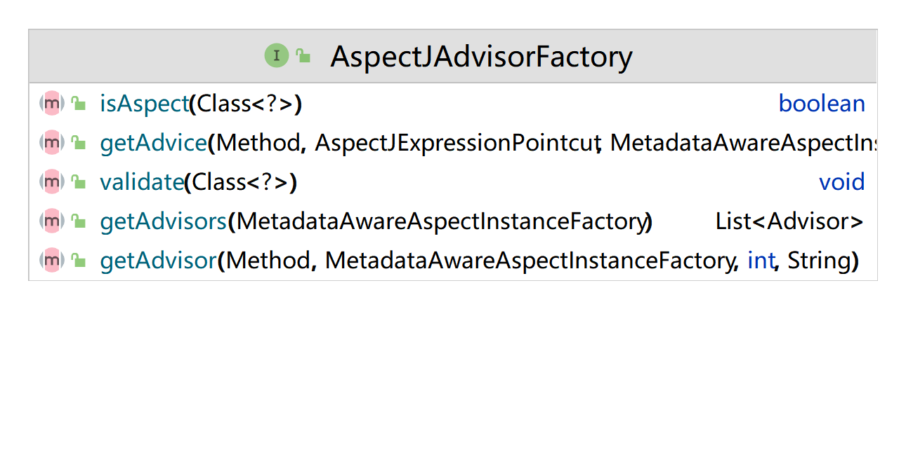

# Spring Aop
org.springframework.aop.interceptor.ExposeInvocationInterceptor

Spring2教案_aop事务.docx


SpringAOP开发的引入.png
cglib动态代理的实现原理和步骤.png

https://gitee.com/edidada/spring-aopexample   spring aop，直接注解和xml两种方式
https://gitee.com/edidada/springexample  com.samter.common.Main 这个是测试aop的

A : public class MyServiceImpl implements MyService
B : public class MyServiceImpl

上面的报错，

```java
Exception in thread "main" org.springframework.beans.factory.NoSuchBeanDefinitionException: No qualifying bean of type 'cn.wdidada.test.aop.impl.MyServiceImpl' available
	at org.springframework.beans.factory.support.DefaultListableBeanFactory.getBean(DefaultListableBeanFactory.java:353)
	at org.springframework.beans.factory.support.DefaultListableBeanFactory.getBean(DefaultListableBeanFactory.java:340)
	at org.springframework.context.support.AbstractApplicationContext.getBean(AbstractApplicationContext.java:1090)
	at cn.wdidada.test.aop.TestMyBatisAOPSpring.main(TestMyBatisAOPSpring.java:27)
```

下面的可以

上面为什么报错，因为aop方式是动态代理


bean是否是PointCut Advice Advisor接口的子类对象？


org.springframework.aop.framework.autoproxy.AbstractAutoProxyCreator 这个抽象类

InfrastructureAdvisorAutoProxyCreator 

IntroductionAdvisor接口

InfrastructureAdvisorAutoProxyCreator是Spring AOP中的一个Bean后置处理器，它的主要作用是自动创建AOP代理对象。

在Spring中，当一个Bean被注册到容器中时，InfrastructureAdvisorAutoProxyCreator会检查该Bean是否需要被代理。如果该Bean需要被代理，并且没有指定具体的代理方式，InfrastructureAdvisorAutoProxyCreator会根据该Bean的类型和配置信息自动选择合适的代理方式，并创建代理对象。代理对象将替代原始对象，成为该Bean在应用中的实际实例。
InfrastructureAdvisorAutoProxyCreator的具体工作流程如下：
遍历所有Bean的定义，找到需要被代理的Bean。
根据代理的目标类型和配置信息，选择合适的代理方式（JDK动态代理或CGLIB代理）。
创建代理对象，将其注册到Spring容器中。
将代理对象返回给调用方，替代原始对象成为该Bean在应用中的实际实例。
需要注意的是，InfrastructureAdvisorAutoProxyCreator只会对满足以下条件的Bean进行代理：
Bean必须是一个单例（Singleton）。
Bean必须是一个AOP代理的目标对象（Target Object）。
Bean必须符合AOP代理的切点条件。
由于InfrastructureAdvisorAutoProxyCreator是一个Bean后置处理器，它是在Bean实例化之后、初始化之前被调用的。因此，在使用InfrastructureAdvisorAutoProxyCreator时，需要确保代理的目标对象已经被实例化，但还没有被初始化。如果代理的目标对象已经被初始化，InfrastructureAdvisorAutoProxyCreator将无法创建代理对象。
总的来说，InfrastructureAdvisorAutoProxyCreator是Spring AOP中非常重要的一个组件，它为Spring AOP提供了自动代理的能力，简化了AOP的配置和使用。
InfrastructureAdvisorAutoProxyCreator在spring源码中对应的类

在 Spring 源码中，`InfrastructureAdvisorAutoProxyCreator` 实际上是一个 BeanPostProcessor 接口的实现类，它的实现类为 `org.springframework.aop.framework.autoproxy.AbstractAutoProxyCreator`。`AbstractAutoProxyCreator` 是一个抽象类，它提供了自动代理创建的基本实现，而 `InfrastructureAdvisorAutoProxyCreator` 则是其子类的一种具体实现。
`AbstractAutoProxyCreator` 的子类可以通过重写它的 `postProcessBeforeInitialization()` 和 `postProcessAfterInitialization()` 方法，在 Bean 初始化前后自动创建代理对象。在 Spring 中，当一个 Bean 实现了某些接口或符合某些切面表达式时，Spring 会自动将其创建成代理对象，并在调用该 Bean 的方法时，自动执行相应的增强操作。
需要注意的是，Spring 5.x 版本中，通过 `@EnableAspectJAutoProxy` 注解或者 `ProxyFactoryBean` 来实现自动代理的创建。


org.springframework.context.annotation.EnableAspectJAutoProxy


org.springframework.aop.aspectj.AspectJPointcutAdvisor spring-aop这个jar包
`AspectJPointcutAdvisor`是Spring AOP中的一个类，用于将AspectJ切点与通知（Advice）关联起来，构成一个切面（Aspect）。它是Spring AOP中切面的基本组成部分之一。

在Spring AOP中，切面（Aspect）是由切点（Pointcut）和通知（Advice）组成的。切点用于定义需要拦截的方法，而通知用于定义拦截后需要执行的逻辑。`AspectJPointcutAdvisor`的作用就是将切点和通知组合在一起，创建一个切面。
`AspectJPointcutAdvisor`通过实现`org.springframework.aop.PointcutAdvisor`接口来实现。它包含两个重要的属性：`Pointcut`和`Advice`。`Pointcut`用于定义需要拦截的方法，可以使用AspectJ切点表达式来描述；`Advice`用于定义拦截后需要执行的逻辑，可以是前置通知、后置通知、环绕通知等。
例如，以下是一个示例，它使用`AspectJPointcutAdvisor`来定义一个切面，拦截`com.example.service.UserService`类的所有方法，并在方法执行前后输出日志信息：

```java
@Aspect
@Component
public class LoggingAspect {

    @Pointcut("execution(* com.example.service.UserService.*(..))")
    public void userServicePointcut() {}

    @Around("userServicePointcut()")
    public Object logMethodExecutionTime(ProceedingJoinPoint joinPoint) throws Throwable {
        long startTime = System.currentTimeMillis();
        Object result = joinPoint.proceed();
        long endTime = System.currentTimeMillis();
        String methodName = joinPoint.getSignature().getName();
        String className = joinPoint.getTarget().getClass().getSimpleName();
        System.out.println(className + "." + methodName + " executed in " + (endTime - startTime) + "ms");
        return result;
    }

    @Bean
    public AspectJPointcutAdvisor userServiceAdvisor() {
        AspectJExpressionPointcut pointcut = new AspectJExpressionPointcut();
        pointcut.setExpression("execution(* com.example.service.UserService.*(..))");
        return new AspectJPointcutAdvisor(pointcut, this::logMethodExecutionTime);
    }
}
```

在上面的示例中，`@Aspect`注解用于声明一个切面类，`@Pointcut`注解用于定义一个切点，它拦截`com.example.service.UserService`类的所有方法。`@Around`注解用于定义一个环绕通知，它拦截`userServicePointcut()`切点，并在方法执行前后输出日志信息。`@Bean`注解用于定义一个Bean，它创建一个`AspectJPointcutAdvisor`对象，将切点和通知组合在一起，形成一个切面。通过这种方式，可以将日志逻辑从业务逻辑中分离出来，以模块化的方式进行管理，提高代码的可维护性和可扩展性。
需要注意的是，`AspectJPointcutAdvisor`适用于使用AspectJ切点表达式的情况，如果需要使用其他类型的切点，可以使用其他类型的Advisor，例如`NameMatchMethodPointcutAdvisor`、`RegexpMethodPointcutAdvisor`等。


org.springframework.aop.aspectj.AspectJPointcutAdvisor


`AspectJPointcutAdvisor`是Spring AOP中的一个类，用于将AspectJ切点与通知（Advice）关联起来，构成一个切面（Aspect）。它是Spring AOP中切面的基本组成部分之一。
在Spring AOP中，切面（Aspect）是由切点（Pointcut）和通知（Advice）组成的。切点用于定义需要拦截的方法，而通知用于定义拦截后需要执行的逻辑。`AspectJPointcutAdvisor`的作用就是将切点和通知组合在一起，创建一个切面。
`AspectJPointcutAdvisor`通过实现`org.springframework.aop.PointcutAdvisor`接口来实现。它包含两个重要的属性：`Pointcut`和`Advice`。`Pointcut`用于定义需要拦截的方法，可以使用AspectJ切点表达式来描述；`Advice`用于定义拦截后需要执行的逻辑，可以是前置通知、后置通知、环绕通知等。
例如，以下是一个示例，它使用`AspectJPointcutAdvisor`来定义一个切面，拦截`com.example.service.UserService`类的所有方法，并在方法执行前后输出日志信息：
```java
@Aspect
@Component
public class LoggingAspect {

    @Pointcut("execution(* com.example.service.UserService.*(..))")
    public void userServicePointcut() {}

    @Around("userServicePointcut()")
    public Object logMethodExecutionTime(ProceedingJoinPoint joinPoint) throws Throwable {
        long startTime = System.currentTimeMillis();
        Object result = joinPoint.proceed();
        long endTime = System.currentTimeMillis();
        String methodName = joinPoint.getSignature().getName();
        String className = joinPoint.getTarget().getClass().getSimpleName();
        System.out.println(className + "." + methodName + " executed in " + (endTime - startTime) + "ms");
        return result;
    }

    @Bean
    public AspectJPointcutAdvisor userServiceAdvisor() {
        AspectJExpressionPointcut pointcut = new AspectJExpressionPointcut();
        pointcut.setExpression("execution(* com.example.service.UserService.*(..))");
        return new AspectJPointcutAdvisor(pointcut, this::logMethodExecutionTime);
    }
}
```

在上面的示例中，`@Aspect`注解用于声明一个切面类，`@Pointcut`注解用于定义一个切点，它拦截`com.example.service.UserService`类的所有方法。`@Around`注解用于定义一个环绕通知，它拦截`userServicePointcut()`切点，并在方法执行前后输出日志信息。`@Bean`注解用于定义一个Bean，它创建一个`AspectJPointcutAdvisor`对象，将切点和通知组合在一起，形成一个切面。通过这种方式，可以将日志逻辑从业务逻辑中分离出来，以模块化的方式进行管理，提高代码的可维护性和可扩展性。
需要注意的是，`AspectJPointcutAdvisor`适用于使用AspectJ切点表达式的情况，如果需要使用其他类型的切点，可以使用其他类型的Advisor，例如`NameMatchMethodPointcutAdvisor`、`RegexpMethodPointcutAdvisor`等。


<aop:aspectj-autoproxy proxy-target-class="true"/>

https://gitee.com/edidada/springbootwebaop  spring boot aop实现

### 应用领域
日志 数据库事务 安全 缓存


私有的方法spring的aop是不是不会生效的吗？

Spring AOP默认使用的是JDK动态代理，而JDK动态代理只能代理实现了接口的类，对于没有实现接口的类，Spring AOP会选择使用CGLIB来动态代理。CGLIB是一个强大的高性能的代码生成库，它可以在运行期扩展Java类与实现Java接口。但是，CGLIB不能代理final修饰的方法和类，同时也不能代理static修饰的方法和类。对于private方法，在Spring使用纯Spring AOP（只能拦截public/protected/包）都是无法被拦截的


spring AOP的五种通知 Advice
1、@Before：
前置通知，在目标方法执行前执行。
2、@After ：
后置通知，在目标方法返回结果之后执行，无论是否出现异常都会执行。
3、@AfterReturning：
返回后通知，在目标方法执行后执行，如果出现异常不会执行。
4、@AfterThrowing：
异常通知，在目标方法抛出异常后执行。
5、@Around：
环绕通知，围绕着方法执行.


JoinPoint

poincut

Aspect

Introduce

Weaveing


@Aspect注解作用
这个类是一个spring bean
声明aop
@Aspect注解是Spring AOP框架中的一个注解，用于声明一个切面（Aspect）。切面是一种横切逻辑，它可以拦截应用程序中的方法调用，并在方法执行前、执行后或执行异常时执行额外的逻辑。

在使用@Aspect注解时，需要结合其他注解一起使用，以定义切点和增强等相关信息。常用的注解包括：

@Pointcut：用于定义切点，可以将一组方法定义为一个切点。
@Before：用于在方法执行前执行增强逻辑。
@After：用于在方法执行后执行增强逻辑。
@AfterReturning：用于在方法正常返回后执行增强逻辑。
@AfterThrowing：用于在方法抛出异常后执行增强逻辑。

@Aspect注解修饰的类必须是spring ioc中的bean吗？
是的，使用@Aspect注解声明的切面类必须是Spring IoC容器中的Bean。这是因为Spring AOP框架是基于Spring IoC容器实现的，它通过在IoC容器中查找切面Bean来创建切面对象，从而实现切面的拦截和增强。
在使用@Aspect注解时，还需要结合其他注解一起使用，如@Pointcut、@Before、@After、@Around等注解，用于定义切点和增强等相关信息。这些注解都是Spring框架提供的注解，并依赖于Spring IoC容器来实现Bean的创建和管理。
因此，使用@Aspect注解声明的切面类必须交由Spring IoC容器管理，并且需要在配置文件或通过注解方式将其声明为Bean，才能被Spring框架正确地创建和使用。如果没有将切面类声明为Bean，Spring框架将无法创建切面对象，从而无法实现切面的拦截和增强。


imgs\spring\spring_aop声明通知方法.PNG


aspect切点表达式.PNG

java切面.PNG

非侵入xml切面1.PNG
非侵入xml切面2.PNG

### 相关资料

spring实战4章

https://docs.spring.io/spring-framework/docs/3.0.x/spring-framework-reference/html/aop.html

spring aop没有生效

https://blog.csdn.net/weixin_39681171/article/details/113039439


```java
    @Pointcut("execution(public * cn.wdidada.test.springbootwebaop..*.*(..))")
```


匹配哪些方法
修饰符 返回值 类名 方法名 参数个数类型


创建注解
创建spring容器类 添加@Aspect注解
添加@PoinCut
添加@Aoround注解，注意返回值必须有，参数需要是ProceedingJoinPoint ，调用joinPoint.proceed();

```java
    @Around("planChangePointcut() && @annotation(cn.wdidada.test.springbootwebaop.annotion.PlanChange)")
    public Object planChangeAround(ProceedingJoinPoint joinPoint) throws Throwable{
        System.out.println("Around");
        MethodSignature methodSignature = (MethodSignature) joinPoint.getSignature();
        Method method = methodSignature.getMethod();
        PlanChange change = method.getAnnotation(PlanChange.class);
        change.tableName();
        return joinPoint.proceed();
    }
```


如何强制使用CGLIB实现AOP？

 （1）添加CGLIB库，SPRING_HOME/cglib/*.jar

 （2）在spring配置文件中加入<aop:aspectj-autoproxy proxy-target-class="true"/>


[基于注解的Spring AOP的配置和使用](https://my.oschina.net/sniperLi/blog/491854)

在Spring AOP中有两种代理方式，JDK动态代理和CGLIB代理。默认情况下，TargetObject实现了接口时，则采用JDK动态代理，例如，AServiceImpl；反之，采用CGLIB代理，例如，BServiceImpl。强制使用CGLIB代理需要将 <aop:config>的 proxy-target-class属性设为true。


```java

Caused by: java.lang.IllegalArgumentException: Pointcut is not well-formed: expecting 'identifier' at character position 0

^
	at org.aspectj.weaver.tools.PointcutParser.resolvePointcutExpression(PointcutParser.java:316)
	at org.aspectj.weaver.reflect.InternalUseOnlyPointcutParser.resolvePointcutExpression(InternalUseOnlyPointcutParser.java:36)
	at org.aspectj.weaver.reflect.Java15ReflectionBasedReferenceTypeDelegate.getDeclaredPointcuts(Java15ReflectionBasedReferenceTypeDelegate.java:307)
	at org.aspectj.weaver.ReferenceType.getDeclaredPointcuts(ReferenceType.java:884)
	at org.aspectj.weaver.ResolvedType$PointcutGetter.get(ResolvedType.java:243)
	at org.aspectj.weaver.ResolvedType$PointcutGetter.get(ResolvedType.java:241)
	at org.aspectj.weaver.Iterators$4$1.hasNext(Iterators.java:213)
	at org.aspectj.weaver.Iterators$4.hasNext(Iterators.java:230)
	at org.aspectj.weaver.ResolvedType.findPointcut(ResolvedType.java:743)
	at org.aspectj.weaver.patterns.ReferencePointcut.resolveBindings(ReferencePointcut.java:148)
	at org.aspectj.weaver.patterns.Pointcut.resolve(Pointcut.java:189)
	at org.aspectj.weaver.tools.PointcutParser.resolvePointcutExpression(PointcutParser.java:313)
	at org.aspectj.weaver.tools.PointcutParser.parsePointcutExpression(PointcutParser.java:294)
	at org.springframework.aop.aspectj.AspectJExpressionPointcut.buildPointcutExpression(AspectJExpressionPointcut.java:217)
	at org.springframework.aop.aspectj.AspectJExpressionPointcut.checkReadyToMatch(AspectJExpressionPointcut.java:190)
	at org.springframework.aop.aspectj.AspectJExpressionPointcut.getClassFilter(AspectJExpressionPointcut.java:169)
	at org.springframework.aop.support.AopUtils.canApply(AopUtils.java:220)
	at org.springframework.aop.support.AopUtils.canApply(AopUtils.java:279)
	at org.springframework.aop.support.AopUtils.findAdvisorsThatCanApply(AopUtils.java:311)
	at org.springframework.aop.framework.autoproxy.AbstractAdvisorAutoProxyCreator.findAdvisorsThatCanApply(AbstractAdvisorAutoProxyCreator.java:119)
	at org.springframework.aop.framework.autoproxy.AbstractAdvisorAutoProxyCreator.findEligibleAdvisors(AbstractAdvisorAutoProxyCreator.java:89)
	at org.springframework.aop.framework.autoproxy.AbstractAdvisorAutoProxyCreator.getAdvicesAndAdvisorsForBean(AbstractAdvisorAutoProxyCreator.java:70)
	at org.springframework.aop.framework.autoproxy.AbstractAutoProxyCreator.wrapIfNecessary(AbstractAutoProxyCreator.java:346)
	at org.springframework.aop.framework.autoproxy.AbstractAutoProxyCreator.postProcessAfterInitialization(AbstractAutoProxyCreator.java:298)
	at org.springframework.beans.factory.support.AbstractAutowireCapableBeanFactory.applyBeanPostProcessorsAfterInitialization(AbstractAutowireCapableBeanFactory.java:423)
	at org.springframework.beans.factory.support.AbstractAutowireCapableBeanFactory.initializeBean(AbstractAutowireCapableBeanFactory.java:1633)
	at org.springframework.beans.factory.support.AbstractAutowireCapableBeanFactory.doCreateBean(AbstractAutowireCapableBeanFactory.java:555)
	... 60 more

```

```java

@Aspect
@Component
public class MyPersonalAnnotationAspect {

    @Pointcut("")
    public void testArgs(){

    }
}

```

Pointcut is not well-formed: expecting 'identifier' at character position 0

Spring 切面必须是Java Bean？ 对
MyPersonalAnnotationAspect不加Component注解就不会生效


私有的方法spring的aop是不是不会生效


自己实现SpringAOP，含AOP实现的步骤分解

　　　　（1）被代理类、被代理类的接口、通知的注解类的创建；

　　　　（2）创建一个“动态代理类”，并把“被代理类的实例”传给该代理类；在该动态代理类的invoke()方法中，实现前置通知、后置通知等各种通知，也是在该invoke()方法中调用、执行真正的代理类要执行的那个方法。

　　　　（3）创建一个可以动态创建“代理类的实例”的类，通过该类的getProxyInstance(Object obj)方法可以得到一个动态代理类的实例。
　　　　（4）给方法加通知注解，该方法的实例须已交由IOC容器管理的；
　　　　（5）遍历BeanFactory，找出方法上有@通知注解的bean，为这些bean生成代理类对象（步骤：MyProxy3.getProxyInstance(Object obj)）

　　　　（6）用代理类的实例去替代BeanFactory中的被代理类的实例


## 源码解读

### AspectInstanceFactory接口及其子类
AspectInstanceFactory
MetadataAwareAspectInstanceFactory (org.springframework.aop.aspectj.annotation)
    SimpleMetadataAwareAspectInstanceFactory (org.springframework.aop.aspectj.annotation)
    SingletonMetadataAwareAspectInstanceFactory (org.springframework.aop.aspectj.annotation)
    BeanFactoryAspectInstanceFactory (org.springframework.aop.aspectj.annotation)
        PrototypeAspectInstanceFactory (org.springframework.aop.aspectj.annotation)
    LazySingletonAspectInstanceFactoryDecorator (org.springframework.aop.aspectj.annotation)
SingletonAspectInstanceFactory (org.springframework.aop.aspectj)
    SingletonMetadataAwareAspectInstanceFactory (org.springframework.aop.aspectj.annotation)
SimpleBeanFactoryAwareAspectInstanceFactory (org.springframework.aop.config)
SimpleAspectInstanceFactory (org.springframework.aop.aspectj)
    SimpleMetadataAwareAspectInstanceFactory (org.springframework.aop.aspectj.annotation)

### AspectInstanceFactory
`AspectInstanceFactory` 是 Spring AOP 框架中的一个接口，它的作用是用于创建切面实例对象。在 Spring AOP 中，切面是由一个或多个切面通知（Advice）组成的，而每个切面通知都需要一个切面实例对象来执行。

`AspectInstanceFactory` 接口有两个方法：

- `getAspectInstance()`：用于获取切面实例对象。
- `getAspectName()`：用于获取切面的名称。

`AspectInstanceFactory` 接口的实现类主要有以下两种：

- `SimpleAspectInstanceFactory`：用于创建简单的切面实例对象，即切面类对象的实例。
- `LazySingletonAspectInstanceFactory`：用于创建懒加载的单例切面实例对象，即切面类对象的单例实例，并且该实例是在首次访问时才被创建。

在 Spring AOP 中，每个切面都需要一个切面实例对象，如果切面类标注了 `@Aspect` 注解，则 Spring 会自动将其转化为一个切面实例对象；如果没有标注，则需要手动指定切面实例对象的创建方式。通过自定义 `AspectInstanceFactory` 及其子类，可以实现自定义的切面实例对象的创建方式，例如通过工厂方法、反射等方式来创建切面实例对象。

需要注意的是，Spring AOP 中的切面实例对象是非常重要的，因为它不仅仅是用来执行切面通知的，还承担了很多额外的功能，例如切面实例对象可以通过 `@Around` 注解来控制切点方法的执行，还可以通过 `@DeclareParents` 注解来为目标对象引入新的接口等。因此，正确地创建和管理切面实例对象是 Spring AOP 框架中的一个重要问题。

### AspectJAdvisorFactory

AspectJAdvisorFactory接口对应的实现类
AbstractAspectJAdvisorFactory (org.springframework.aop.aspectj.annotation)
    ReflectiveAspectJAdvisorFactory (org.springframework.aop.aspectj.annotation)

AspectJAdvisorFactory



### AspectMetadata
AspectMetadata 记录Aspect注解修饰的类信息
`ReflectiveAspectJAdvisorFactory` 是 Spring AOP 框架中的一个类，它实现了 `AspectJAdvisorFactory` 接口，用于根据 `@Aspect` 注解和其他切面注解来创建切面对象和切面通知对象。

`ReflectiveAspectJAdvisorFactory` 主要有以下两个作用：

1. 解析切面类中的注解：在 Spring AOP 框架中，切面类中的注解包括 `@Aspect`、`@Around`、`@Before`、`@After` 等注解。`ReflectiveAspectJAdvisorFactory` 会解析这些注解，并将其转化为相应的切面对象和切面通知对象。
2. 创建切面对象和切面通知对象：`ReflectiveAspectJAdvisorFactory` 根据切面类中的注解信息，创建切面对象和切面通知对象。具体来说，对于 `@Aspect` 注解，它会创建一个 `AspectMetadata` 对象来保存切面类的信息，例如切面类的名称、切面类的方法、切面类的 Pointcut 表达式等信息。对于其他的切面注解，例如 `@Around`、`@Before`、`@After` 等注解，`ReflectiveAspectJAdvisorFactory` 则会创建相应的切面通知对象，例如 `MethodBeforeAdvice`、`MethodAfterAdvice` 等对象，并将其与切面对象组合成一个完整的切面对象。

需要注意的是，`ReflectiveAspectJAdvisorFactory` 是 Spring AOP 框架中的一个默认实现类，它使用反射来生成切面对象和切面通知对象。除了 `ReflectiveAspectJAdvisorFactory` 之外，Spring AOP 框架还提供了其他实现 `AspectJAdvisorFactory` 接口的类，例如 `AnnotationAwareAspectJAutoProxyCreator`、`AspectJExpressionPointcutAdvisor` 等。这些类可以通过实现 `AspectJAdvisorFactory` 接口来自定义切面对象和切面通知对象的创建方式，从而实现更加灵活的 AOP 切面编程。


### Advice
ThrowsAdvice (org.springframework.aop)
AfterReturningAdviceInterceptor (org.springframework.aop.framework.adapter)
AspectJAfterAdvice (org.springframework.aop.aspectj)
AspectJAfterReturningAdvice (org.springframework.aop.aspectj)
AspectJAfterThrowingAdvice (org.springframework.aop.aspectj)
ThrowsAdviceInterceptor (org.springframework.aop.framework.adapter)
AfterReturningAdvice (org.springframework.aop)
    AspectJAfterReturningAdvice (org.springframework.aop.aspectj)


### Interceptor
Interceptor (org.aopalliance.intercept)
    MethodInterceptor (org.aopalliance.intercept)
        AbstractSlsbInvokerInterceptor (org.springframework.ejb.access)
        ProjectingMethodInterceptor (org.springframework.data.projection)
        InputMessageProjecting in JsonProjectingMethodInterceptorFactory (org.springframework.data.web)
        MethodValidationInterceptor (org.springframework.validation.beanvalidation)
        XmlRpcProxyFactoryBean (org.apache.dubbo.xml.rpc.protocol.xmlrpc)
        EventPublicationInterceptor (org.springframework.context.event)
        TargetAwareMethodInterceptor in ProxyProjectionFactory (org.springframework.data.projection)
        PersistenceExceptionTranslationInterceptor (org.springframework.dao.support)
        JndiContextExposingInterceptor in JndiObjectFactoryBean (org.springframework.jndi)
        AbstractTraceInterceptor (org.springframework.aop.interceptor)
        RmiClientInterceptor (org.springframework.remoting.rmi)
        IntroductionInterceptor (org.springframework.aop)
        PropertyAccessingMethodInterceptor (org.springframework.data.projection)
        HessianClientInterceptor (org.springframework.remoting.caucho)
        AspectJAfterThrowingAdvice (org.springframework.aop.aspectj)
        DruidStatInterceptor (com.alibaba.druid.support.spring.stat)
        ThrowsAdviceInterceptor (org.springframework.aop.framework.adapter)
        ConnectionSplittingInterceptor in RedisConnectionUtils (org.springframework.data.redis.core)
        CacheInterceptor (org.springframework.cache.interceptor)
        JCacheInterceptor (org.springframework.cache.jcache.interceptor)
        ExposeBeanNameInterceptor in ExposeBeanNameAdvisors (org.springframework.aop.interceptor)
        JaxWsPortClientInterceptor (org.springframework.remoting.jaxws)
        ExposeInvocationInterceptor (org.springframework.aop.interceptor)
        ImplementationMethodExecutionInterceptor in RepositoryFactorySupport (org.springframework.data.repository.core.support)
        AsyncExecutionInterceptor (org.springframework.aop.interceptor)
        TransactionInterceptor (org.springframework.transaction.interceptor)
        LockedScopedProxyFactoryBean in GenericScope (org.springframework.cloud.context.scope)
        EventPublishingMethodInterceptor in EventPublishingRepositoryProxyPostProcessor (org.springframework.data.repository.core.support)
        ConcurrencyThrottleInterceptor (org.springframework.aop.interceptor)
        JndiRmiClientInterceptor (org.springframework.remoting.rmi)
        RecordingMethodInterceptor in MethodInvocationRecorder (org.springframework.data.util)
        RemoteInvocationTraceInterceptor (org.springframework.remoting.support)
        AfterReturningAdviceInterceptor (org.springframework.aop.framework.adapter)
        AspectJAfterAdvice (org.springframework.aop.aspectj)
        AspectJAroundAdvice (org.springframework.aop.aspectj)
        QueryExecutorMethodInterceptor (org.springframework.data.repository.core.support)
        HttpInvokerClientInterceptor (org.springframework.remoting.httpinvoker)
        MethodInvocationValidator (org.springframework.data.repository.core.support)
        MBeanClientInterceptor (org.springframework.jmx.access)
        GenericMessageEndpoint in GenericMessageEndpointFactory (org.springframework.jca.endpoint)
        DefaultMethodInvokingMethodInterceptor (org.springframework.data.projection)
        MapAccessingMethodInterceptor (org.springframework.data.projection)
        DelegatingMethodInterceptor in ExtensionAwareQueryMethodEvaluationContextProvider (org.springframework.data.repository.query)
        SpelEvaluatingMethodInterceptor (org.springframework.data.projection)
        JsonRpcProxyFactoryBean (org.apache.dubbo.rpc.protocol.http)
        SurroundingTransactionDetectorMethodInterceptor (org.springframework.data.repository.core.support)
        ControllerMethodInvocationInterceptor in MvcUriComponentsBuilder (org.springframework.web.servlet.mvc.method.annotation)
        MethodBeforeAdviceInterceptor (org.springframework.aop.framework.adapter)
    ConstructorInterceptor (org.aopalliance.intercept)
BeforeAdvice (org.springframework.aop)
    MethodBeforeAdvice (org.springframework.aop)
        AspectJMethodBeforeAdvice (org.springframework.aop.aspectj)
    MethodBeforeAdviceInterceptor (org.springframework.aop.framework.adapter)
DynamicIntroductionAdvice (org.springframework.aop)
    IntroductionInterceptor (org.springframework.aop)
        DelegatingIntroductionInterceptor (org.springframework.aop.support)
            ExposeBeanNameIntroduction in ExposeBeanNameAdvisors (org.springframework.aop.interceptor)
        DelegatePerTargetObjectIntroductionInterceptor (org.springframework.aop.support)
AbstractAspectJAdvice (org.springframework.aop.aspectj)
    AspectJAfterAdvice (org.springframework.aop.aspectj)
    AspectJAfterReturningAdvice (org.springframework.aop.aspectj)
    AspectJAroundAdvice (org.springframework.aop.aspectj)
    AspectJAfterThrowingAdvice (org.springframework.aop.aspectj)
    AspectJMethodBeforeAdvice (org.springframework.aop.aspectj)
AfterAdvice (org.springframework.aop)
    ThrowsAdvice (org.springframework.aop)
    AfterReturningAdviceInterceptor (org.springframework.aop.framework.adapter)
    AspectJAfterAdvice (org.springframework.aop.aspectj)
    AspectJAfterReturningAdvice (org.springframework.aop.aspectj)
    AspectJAfterThrowingAdvice (org.springframework.aop.aspectj)
    ThrowsAdviceInterceptor (org.springframework.aop.framework.adapter)
    AfterReturningAdvice (org.springframework.aop)
        AspectJAfterReturningAdvice (org.springframework.aop.aspectj)
Anonymous in Advisor (org.springframework.aop)
Anonymous in InstantiationModelAwarePointcutAdvisorImpl (org.springframework.aop.aspectj.annotation)

### 自定义注解例子

自定义注解，被这个注解修饰的方法执行aop

要使被自定义注解修饰的方法执行AOP，可以使用Spring AOP中的注解方式来实现。

首先，需要定义一个自定义注解，例如：

```
@Target(ElementType.METHOD)
@Retention(RetentionPolicy.RUNTIME)
public @interface MyCustomAnnotation {
}
```

上述代码定义了一个名为`MyCustomAnnotation`的注解，它可以被用于方法上，并且在运行时保留注解信息。

然后，在需要执行AOP的方法上，使用`@MyCustomAnnotation`注解进行修饰，例如：

```
@Service
public class MyService {
    
    @MyCustomAnnotation
    public void doSomething() {
        // ...
    }
}
```

上述代码表示在`doSomething()`方法上使用`@MyCustomAnnotation`注解进行修饰。接下来，可以使用Spring AOP中的`@Around`注解定义一个切面，并使用`@Pointcut`注解定义切点，来拦截所有被`@MyCustomAnnotation`注解修饰的方法。例如：

```
@Aspect
@Component
public class MyCustomAnnotationAspect {
    
    @Pointcut("@annotation(com.example.MyCustomAnnotation)")
    public void myCustomAnnotationPointcut() {}
    
    @Around("myCustomAnnotationPointcut()")
    public Object myCustomAnnotationAdvice(ProceedingJoinPoint joinPoint) throws Throwable {
        // 在方法执行前执行一些逻辑
        System.out.println("before method execution");
        
        // 执行被拦截的方法
        Object result = joinPoint.proceed();
        
        // 在方法执行后执行一些逻辑
        System.out.println("after method execution");
        
        return result;
    }
}

上述代码定义了一个名为`MyCustomAnnotationAspect`的切面，它使用`@Pointcut`注解定义了一个切点`myCustomAnnotationPointcut()`，用于拦截所有被`@MyCustomAnnotation`注解修饰的方法。在切面中，使用`@Around`注解定义了一个环绕通知`myCustomAnnotationAdvice()`，它在方法执行前和方法执行后分别执行一些逻辑，并调用`joinPoint.proceed()`方法来继续执行被拦截的方法。

最后，在Spring配置文件中启用AOP和组件扫描功能，例如：

```
<aop:aspectj-autoproxy />
<context:component-scan base-package="com.example" />
```

上述代码启用了AOP和组件扫描功能，并设置了扫描的包路径。

在应用程序运行时，当调用`MyService`类中的`doSomething()`方法时，该方法将被`MyCustomAnnotationAspect`切面拦截，执行前后的逻辑，并最终执行`doSomething()`方法的原始逻辑。


@Pointcut("@annotation(com.example.MyCustomAnnotation)")
的原理

`@Pointcut("@annotation(com.example.MyCustomAnnotation)")`表示一个切点表达式，用于匹配所有被`com.example.MyCustomAnnotation`注解修饰的方法，从而实现对这些方法的AOP拦截和增强。

具体地说，`@Pointcut`注解的参数是一个切点表达式，用于定义需要匹配的连接点。在这个切点表达式中，`@annotation`是一个指示符，用于指示匹配所有被注解修饰的方法；而`com.example.MyCustomAnnotation`则是需要匹配的注解类型。因此，`@Pointcut("@annotation(com.example.MyCustomAnnotation)")`表示匹配所有被`com.example.MyCustomAnnotation`注解修饰的方法。

在方法调用时，Spring框架会通过反射机制获取方法上的注解信息，并根据注解信息判断是否需要应用AOP拦截和增强。如果一个方法被`com.example.MyCustomAnnotation`注解修饰，那么它就会被`@Pointcut("@annotation(com.example.MyCustomAnnotation)")`所匹配，从而被拦截并执行AOP增强逻辑。

AOP的实现原理是通过代理模式来实现的。在Spring框架中，当一个bean被注册到容器中时，Spring会根据其类型和声明的注解信息，动态生成一个代理对象，并将其注册到容器中。当调用该bean的方法时，实际上是调用代理对象的方法，从而实现了对方法调用的拦截和增强。

对于被`com.example.MyCustomAnnotation`注解修饰的方法，Spring框架会在生成代理对象时，检测该方法上是否存在该注解，并根据注解信息动态生成一个对应的增强逻辑。当调用该方法时，代理对象会先执行增强逻辑，然后再执行原始的方法逻辑，从而实现了对该方法的拦截和增强。

总之，`@Pointcut("@annotation(com.example.MyCustomAnnotation)")`的原理是通过匹配被注解修饰的方法，从而实现对这些方法的AOP拦截和增强。在实现过程中，Spring框架会根据注解信息生成代理对象，并动态生成对应的增强逻辑，从而实现了对方法调用的拦截和增强。


切点表达式有哪些指示符 除了@Annotation


除了`@annotation`指示符，Spring AOP中还支持以下几种切点表达式指示符：
1. `execution`：匹配方法执行的连接点。例如，`execution(* com.example.service.*.*(..))`表示匹配`com.example.service`包下的任意类的任意方法。
2. `within`：匹配指定类或包中所有方法的连接点。例如，`within(com.example.service.*)`表示匹配`com.example.service`包中所有类的所有方法。
3. `this`：匹配当前代理对象所实现的接口类型的连接点。例如，`this(com.example.MyInterface)`表示匹配当前代理对象实现了`com.example.MyInterface`接口的方法。
4. `target`：匹配当前目标对象所实现的接口类型的连接点。例如，`target(com.example.MyInterface)`表示匹配当前目标对象实现了`com.example.MyInterface`接口的方法。
5. `args`：匹配方法参数类型的连接点。例如，`args(String)`表示匹配接受一个字符串类型参数的方法。
6. `bean`：匹配指定bean名称的连接点。例如，`bean(myService)`表示匹配名称为`myService`的bean的所有方法。
需要注意的是，以上的切点表达式指示符可以结合使用，从而实现更精细的AOP拦截和增强。例如，`execution(* com.example.service.*.*(..)) && @annotation(com.example.MyCustomAnnotation)`表示匹配`com.example.service`包下所有被`com.example.MyCustomAnnotation`注解修饰的方法。这样的切点表达式既限定了匹配的方法范围，又限定了匹配的注解类型，从而实现了更精细的AOP拦截和增强。

除了以上的指示符，Spring AOP还支持更加高级的切点表达式，例如使用`bean()`指示符匹配所有实现了特定接口的bean，或者使用`@within()`指示符匹配所有在特定注解类型所标识的类中声明的方法等。可以根据具体的需求选择合适的切点表达式指示符，从而实现精细化的AOP拦截和增强。


@annotation 这个指示符在spring-aop这个jar包中对应的类

ControlFlowPointcut (org.springframework.aop.support)
ComposablePointcut (org.springframework.aop.support)
DynamicMethodMatcherPointcut (org.springframework.aop.support)
    PerTargetInstantiationModelPointcut in InstantiationModelAwarePointcutAdvisorImpl (org.springframework.aop.aspectj.annotation)
ExpressionPointcut (org.springframework.aop.support)
    AbstractExpressionPointcut (org.springframework.aop.support)
        AspectJExpressionPointcut (org.springframework.aop.aspectj)
TruePointcut (org.springframework.aop)
AnnotationMatchingPointcut (org.springframework.aop.support.annotation)
StaticMethodMatcherPointcut (org.springframework.aop.support)
    StaticMethodMatcherPointcutAdvisor (org.springframework.aop.support)
    TransactionAttributeSourcePointcut (org.springframework.transaction.interceptor)
        Anonymous in TransactionAttributeSourceAdvisor (org.springframework.transaction.interceptor)
        Anonymous in BeanFactoryTransactionAttributeSourceAdvisor (org.springframework.transaction.interceptor)
    SetterPointcut in Pointcuts (org.springframework.aop.support)
    JCacheOperationSourcePointcut (org.springframework.cache.jcache.interceptor)
        Anonymous in BeanFactoryJCacheOperationSourceAdvisor (org.springframework.cache.jcache.interceptor)
    CacheOperationSourcePointcut (org.springframework.cache.interceptor)
        Anonymous in BeanFactoryCacheOperationSourceAdvisor (org.springframework.cache.interceptor)
    GetterPointcut in Pointcuts (org.springframework.aop.support)
    AbstractRegexpMethodPointcut (org.springframework.aop.support)
        JdkRegexpMethodPointcut (org.springframework.aop.support)
    NameMatchMethodPointcut (org.springframework.aop.support)


在Spring AOP中，`execution`指示符没有对应的类，它是AspectJ切点表达式语言中的一个关键字，用于匹配方法执行的连接点，用法如下：

```
execution(modifiers-pattern? ret-type-pattern declaring-type-pattern?name-pattern(param-pattern)throws-pattern?)
```

其中，各个pattern表示匹配规则，例如：

- `modifiers-pattern`：表示方法的修饰符，例如`public`、`protected`、`private`等；
- `ret-type-pattern`：表示方法返回值类型，例如`void`、`int`、`java.lang.String`等；
- `declaring-type-pattern`：表示方法所在类的全路径名，例如`com.example.service.MyService`；
- `name-pattern`：表示方法名，例如`doSomething`、`*Something`等；
- `param-pattern`：表示方法参数类型和个数，例如`(int, java.lang.String)`、`(*)`等；
- `throws-pattern`：表示方法抛出的异常类型，例如`java.lang.Exception`。

`execution`指示符可以根据以上各个pattern来匹配方法，从而实现对方法的拦截和增强。在Spring AOP中，可以使用`AspectJExpressionPointcut`类来解析和匹配`execution`指示符，例如：

```
AspectJExpressionPointcut pointcut = new AspectJExpressionPointcut();
pointcut.setExpression("execution(* com.example.service.*.*(..))");
```

上述代码使用`AspectJExpressionPointcut`类创建了一个切点对象，并通过`setExpression()`方法设置切点表达式。在实际应用中，可以将该切点对象传入到AOP拦截器中，从而实现对匹配方法的拦截和增强。

需要注意的是，在Spring AOP中，`execution`指示符可以与其他指示符（如`@annotation`、`bean`、`args`等）组合使用，从而实现更精细的AOP拦截和增强。例如，`execution(* com.example.service.*.*(..)) && @annotation(com.example.MyCustomAnnotation)`表示匹配`com.example.service`包下所有被`com.example.MyCustomAnnotation`注解修饰的方法。


within this target是关键字吗？
`within`、`this`和`target`不是关键字，它们是AspectJ切点表达式语言中的指示符，用于匹配连接点的类型或实例。
具体来说，这些指示符的作用如下：

- `within`：匹配指定类或包中所有方法的连接点；
- `this`：匹配当前代理对象所实现的接口类型的连接点；
- `target`：匹配当前目标对象所实现的接口类型的连接点。
在Spring AOP中，这些指示符也被支持，并且可以与其他指示符（如`execution`、`@annotation`、`bean`、`args`等）组合使用，从而实现更加精细的AOP拦截和增强。

需要注意的是，这些指示符在使用时需要注意语法和语义，否则可能会导致匹配失败或产生意外的结果。例如，在使用`this`指示符时，需要注意当前代理对象所实现的接口类型，而非代理对象本身的类型；在使用`target`指示符时，需要注意当前目标对象所实现的接口类型，而非目标对象本身的类型。

在Spring AOP中，`@annotation`指示符对应的类是`org.springframework.aop.support.annotation.AnnotationMatchingPointcut`。

`AnnotationMatchingPointcut`是一个切点实现类，用于匹配带有特定注解的方法。它实现了`org.springframework.aop.ClassFilter`和`org.springframework.aop.MethodMatcher`接口，可以用于对类和方法进行拦截和增强。

在`AnnotationMatchingPointcut`类中，通过`@annotation`指示符和注解类型来匹配被注解修饰的方法。具体地说，它通过获取目标类上和方法上的注解信息，判断方法是否被指定注解所修饰，从而实现对该方法的拦截和增强。

在使用`@annotation`指示符时，可以通过创建一个`AnnotationMatchingPointcut`对象，并将注解类型作为参数传入，来实现对该注解的匹配。例如，下面的代码使用`@annotation`指示符匹配所有被`com.example.MyCustomAnnotation`注解修饰的方法：

```
AnnotationMatchingPointcut pointcut = new AnnotationMatchingPointcut(com.example.MyCustomAnnotation.class);
```

需要注意的是，`AnnotationMatchingPointcut`类是Spring AOP的内部实现类，一般不需要直接使用它来实现AOP拦截和增强。在实际开发中，可以使用Spring AOP提供的注解方式或编程方式来实现AOP拦截和增强，而不需要直接操作`AnnotationMatchingPointcut`类。

对于注解方式，可以使用`@Pointcut`注解和`@Around`注解来定义切点和增强逻辑，例如：

```
@Pointcut("@annotation(com.example.MyCustomAnnotation)")
public void myCustomAnnotationPointcut() {}

@Around("myCustomAnnotationPointcut()")
public Object myCustomAnnotationAdvice(ProceedingJoinPoint joinPoint) throws Throwable {
    // ...
}
```

对于编程方式，可以使用`AspectJExpressionPointcut`类来实现切点表达式的解析和匹配，例如：

```
AspectJExpressionPointcut pointcut = new AspectJExpressionPointcut();
pointcut.setExpression("execution(* com.example.service.*.*(..)) && @annotation(com.example.MyCustomAnnotation)");
```

上述代码使用`AspectJExpressionPointcut`类创建了一个切点对象，并通过`setExpression()`方法设置切点表达式。在实际应用中，可以将该切点对象传入到AOP拦截器中，从而实现对匹配方法的拦截和增强。

在Spring AOP中，当一个bean被注册到IoC容器中时，Spring框架会为其创建一个代理对象，并将其放入容器中。这个代理对象包含了原始bean对象的所有方法，并在方法调用时执行AOP拦截和增强。
在AOP拦截和增强的过程中，Spring框架会遍历所有注册的切点，对每个切点表达式进行正则匹配，以判断当前方法是否需要被拦截和增强。如果当前方法匹配了某个切点表达式，那么Spring框架会根据该切点表达式所定义的增强逻辑，生成一个对应的增强器，并将其应用到当前方法上。增强器可以是一个前置通知、后置通知、环绕通知、异常通知或引介通知，它们分别对应不同的AOP增强类型。

spring如何获取spring aop代理对象的信息？
在Spring中，获取Spring AOP代理对象的信息可以使用`AopContext`类，该类提供了获取当前代理对象的静态方法`currentProxy()`以及获取当前代理对象的目标对象的方法`getTarget()`，可以用于获取代理对象的相关信息。
具体来说，可以通过以下步骤来获取代理对象的信息：
1. 在需要获取代理对象信息的类中，注入一个`ApplicationContext`对象，用于获取`AopContext`对象。
2. 在需要获取代理对象信息的方法中，通过`AopContext.currentProxy()`方法获取当前代理对象。
3. 通过代理对象的类信息、方法信息等，获取代理对象的相关信息。
下面是一个示例代码：

```
@Service
public class MyService {
    @Autowired
    private ApplicationContext context;

    public void doSomething() {
        // 获取当前代理对象
        MyService proxy = (MyService) AopContext.currentProxy();
    
        // 获取代理对象的相关信息
        Class<?> clazz = proxy.getClass();
        Method[] methods = clazz.getMethods();
        String methodName = methods[0].getName();
    
        // 输出代理对象的信息
        System.out.println("Proxy class: " + clazz.getName());
        System.out.println("Method name: " + methodName);
   需要注意的是，使用`AopContext`类获取代理对象信息需要满足以下条件：

1. 代理对象必须是基于接口的代理对象，而非基于类的代理对象。
2. 代理对象必须开启了`exposeProxy`选项，以允许AopContext类访问当前代理对象。
在默认情况下，Spring AOP不会开启`exposeProxy`选项，因此需要手动开启。可以在使用`@EnableAspectJAutoProxy`注解时指定`exposeProxy=true`，或在XML配置文件中使用`<aop:aspectj-autoproxy expose-proxy="true"/>`来开启该选项。

### AopContext
org.springframework.aop.framework.AopContext


Spring AOP是Spring框架的一个核心模块，它提供了基于代理的AOP实现，支持切面、切点、通知、增强等AOP概念和功能。Spring AOP的源码主要包含以下几个jar包：

1. spring-aop.jar：包含Spring AOP的核心实现类和接口，如`AspectJExpressionPointcut`、`JdkDynamicAopProxy`、`CglibAopProxy`、`AbstractAutoProxyCreator`等。
2. spring-aspects.jar：包含Spring AOP的扩展功能和切面库，如`@Aspect`、`@Pointcut`、`@Before`、`@After`、`@Around`等注解和`AspectJAfterAdvice`、`AspectJAroundAdvice`等增强器。
3. spring-context.jar：包含Spring IoC容器的核心实现类和接口，如`ApplicationContext`、`BeanFactory`、`BeanPostProcessor`、`BeanDefinition`等。
4. spring-core.jar：包含Spring框架的核心实现类和接口，如`Resource`、`ResourceLoader`、`StringUtils`、`ClassUtils`等工具类和`FactoryBean`、`InitializingBean`、`DisposableBean`等生命周期接口。
5. spring-beans.jar：包含Spring框架的Bean相关实现类和接口，如`BeanWrapper`、`BeanDefinitionRegistry`、`BeanDefinitionReader`等。

接下来，我将简要介绍spring-aop.jar中一些常用类的作用和实现原理：

1. `AspectJExpressionPointcut`类：用于解析和匹配AspectJ切点表达式。它继承了`StaticMethodMatcherPointcut`类，并实现了`Serializable`接口，可以序列化和反序列化。在实现上，`AspectJExpressionPointcut`类使用AspectJ的解析器来解析切点表达式，并将解析结果封装成一个`PointcutExpression`对象，然后通过`matches()`方法来匹配连接点和切点表达式。
2. `JdkDynamicAopProxy`类：用于基于JDK动态代理实现AOP代理对象。它实现了`AopProxy`接口，并包含一个`InvocationHandler`对象和一个`AdvisedSupport`对象。在实现上，`JdkDynamicAopProxy`类通过`Proxy.newProxyInstance()`方法创建一个代理对象，并将`InvocationHandler`对象作为参数传入，以实现AOP拦截和增强。在代理对象的方法调用时，`InvocationHandler`对象会根据其包含的`AdvisedSupport`对象来判断当前方法是否需要被拦截和增强，如果需要，则执行相应的增强器。
3. `CglibAopProxy`类：用于基于CGLIB动态代理实现AOP代理对象。它实现了`AopProxy`接口，并包含一个`MethodInterceptor`对象和一个`AdvisedSupport`对象。在实现上，`CglibAopProxy`类通过`Enhancer.create()`方法创建一个代理对象，并将`MethodInterceptor`对象作为回调函数传入，以实现AOP拦截和增强。在代理对象的方法调用时，`MethodInterceptor`对象会根据其包含的`AdvisedSupport`对象来判断当前方法是否需要被拦截和增强，如果需要，则执行相应的增强器。
4. `AbstractAutoProxyCreator`类：用于自动创建AOP代理对象的抽象类。它实现了`BeanPostProcessor`接口和`BeanFactoryAware`接口，并包含一个`AopInfrastructureBean`集合、一个`ProxyFactory`对象和一个`BeanFactory`对象。在实现上，`AbstractAutoProxyCreator`类通过实现`BeanPostProcessor`接口，在Bean初始化之前和之后，分别创建和应用AOP代理对象。在创建AOP代理对象时，它会根据Bean的类型和名称，以及已注册的切面类和切点表达式，选择合适的代理方式（JDK动态代理或CGLIB动态代理），并创建一个`ProxyFactory`对象。在应用AOP代理对象时，它会将代理对象注入到BeanFactory中，并将代理对象的属性复制到原始Bean对象中。

除了以上类之外，`spring-aop.jar`还包含了一些其他的重要类和接口，如`Advisor`、`Advice`、`PointcutAdvisor`、`MethodInterceptor`、`AfterReturningAdvice`、`ThrowsAdvice`等，它们分别对应AOP中的概念和功能，如增强器、通知、切面等。在使用Spring AOP时，可以通过这些类和接口来实现自定义的AOP拦截和增强逻辑，从而实现对Bean的控制和定制。需要注意的是，Spring AOP虽然提供了基于代理的AOP实现，但它并不是完整的AOP框架，它只支持方法级别的拦截和增强，不支持属性级别的拦截和增强。如果需要实现属性级别的AOP拦截和增强，可以考虑使用其他AOP框架，如AspectJ或Javassist等。


### CglibAopProxy
org.springframework.aop.framework.CglibAopProxy

org.springframework.cglib.proxy.Enhancer

`CglibAopProxy`是Spring AOP中基于CGLIB动态代理实现的AOP代理对象生成器，用于生成代理对象并将其注入到Spring IoC容器中。本文将对`CglibAopProxy`的源码进行详细解析，以便读者更好地理解其实现原理。

`CglibAopProxy`的源码位于`org.springframework.aop.framework.CglibAopProxy`类中，其主要实现原理如下：

1. 准备工作
首先，`CglibAopProxy`会根据传入的`AdvisedSupport`对象来判断当前代理对象是否需要被代理。具体来说，它会判断`AdvisedSupport`对象中是否包含了切面类（`AspectJExpressionPointcutAdvisor`、`AnnotationAwareAspectJAutoProxyCreator`等）以及切点表达式（`Pointcut`）等信息，如果包含，则说明当前代理对象需要被代理。
2. 创建Enhancer对象
接下来，`CglibAopProxy`会创建一个`Enhancer`对象，并设置其被代理的类（即目标对象）和回调函数（即`MethodInterceptor`对象）。`Enhancer`是CGLIB库中的一个关键类，它可以用于创建一个被代理的子类，并将回调函数绑定到该子类上。
在`CglibAopProxy`中，使用`Enhancer`对象来创建代理对象的过程如下：
```java
Enhancer enhancer = new Enhancer();
enhancer.setSuperclass(advised.getTargetClass());
enhancer.setInterfaces(advised.getProxiedInterfaces());
enhancer.setCallback(new DynamicAdvisedInterceptor(advised));
enhancer.setNamingPolicy(SpringNamingPolicy.INSTANCE);
enhancer.setStrategy(new ClassLoaderAwareUndeclaredThrowableStrategy(getClass().getClassLoader()));
```
在上述代码中，`enhancer.setSuperclass(advised.getTargetClass())`用于设置被代理的类，即目标对象的Class对象；`enhancer.setInterfaces(advised.getProxiedInterfaces())`用于设置被代理的接口列表；`enhancer.setCallback(new DynamicAdvisedInterceptor(advised))`用于设置回调函数，即`DynamicAdvisedInterceptor`对象，它实现了`MethodInterceptor`接口，可以在代理对象的方法调用时执行AOP拦截和增强逻辑；`enhancer.setNamingPolicy(SpringNamingPolicy.INSTANCE)`用于设置命名策略，即类名生成器；`enhancer.setStrategy(new ClassLoaderAwareUndeclaredThrowableStrategy(getClass().getClassLoader()))`用于设置异常处理策略，即当代理对象抛出未声明异常时，如何处理。
3. 创建代理对象
在完成`Enhancer`对象的设置后，`CglibAopProxy`会调用`enhancer.create()`方法创建代理对象。这个方法会返回一个被代理的子类实例。在创建代理对象时，`enhancer.create()`方法会首先尝试使用`FastClass`技术来生成代理对象的方法调用，从而提高方法调用的效率。如果当前类没有支持`FastClass`技术的方法，`enhancer.create()`方法会使用`MethodProxy`技术来生成代理对象的方法调用。
4. 注入代理对象
最后，`CglibAopProxy`会将代理对象注入到Spring IoC容器中，并返回代理对象。
综上所述，`CglibAopProxy`的实现原理主要涉及到CGLIB库中的`Enhancer`、`FastClass`和`MethodProxy`等关键类和技术。CGLIB库可以通过生成代理对象的子类，并将回调函数绑定到该子类上，从而实现对目标对象的拦截和增强。与JDK动态代理相比，CGLIB动态代理不需要目标对象实现接口，因此更加灵活。但是，CGLIB动态代理的代理对象比JDK动态代理的代理对象更加复杂，而且生成代理对象所需的时间和内存开销都比较大。因此，在使用Spring AOP时，需要根据实际情况选择合适的代理方式，以达到最优的性能和效果。

### org.aspectj.lang.ProceedingJoinPoint
JoinPoint
ProceedingJoinPoint 
aspectweaver这个jar包中的类

ProceedingJoinPoint接口在debug时候的实现类是？

在debug的时候,ProceedingJoinPoint接口的实现类可能是:

- org.springframework.aop.framework.JdkDynamicAopProxy$MiniProxInvocationHandler - 当使用Jdk动态代理时的实现类
- org.springframework.aop.framework.CglibAopProxy$DynamicAdvisedInterceptor - 当使用Cglib代理时的实现类
这两个实现类分别对应于Spring AOP使用的两种代理方式:
- Jdk动态代理:使用JDK的Proxy类生成代理,实现InvocationHandler接口。
- Cglib代理:使用CGLIB库生成子类来模拟代理,实现MethodInterceptor接口。
Spring会根据情况选择使用Jdk动态代理还是Cglib代理,两种代理方式都会在内部实现ProceedingJoinPoint接口,以提供获取连接点信息和执行方法的功能。
所以在debug时,具体ProceedingJoinPoint的实现类会是上面两个类中的一个,具体要看Spring是如何为该对象创建代理的。


ProceedingJoinPoint类是AOP中的一个核心类,主要提供以下功能:

1. 获取连接点信息:可以获取方法签名、参数、异常类型等信息。
2. 执行方法:可以执行连接点所代表的方法。
3. 中断方法执行:可以中断连接点方法的执行。

主要方法:

1. String getSignature():获取方法签名。
2. Object[] getArgs(): 获取方法参数。
3. Object proceed() throws Throwable:执行连接点方法。
4. Object proceed(Object[] args) throws Throwable:以指定参数执行连接点方法。
5. boolean isKind(int kind):判断连接点种类。
6. static int GET_CLASS:获取类连接点。
7. static int GET_CONNECTION_POINTCUT:获取连接点切入点。
8. static int FIELD:获取字段连接点。 
9. static int METHOD: 获取方法连接点。
10.static int CONSTRUCTOR:获取构造器连接点。

通常在AOP的通知(Before、After等)中,我们会获取 ProceedingJoinPoint类型的参数,通过它可以获取方法信息、执行方法等。

ProceedingJoinPoint代表一个被AOP增强的连接点,即方法。我们可以通过它获取方法信息,或者执行/中断方法。它提供了在控制流穿过该连接点时所需的功能。


### ProxyConfig
org.springframework.aop.framework.ProxyConfig


ProxyProcessorSupport

抽象类
AbstractAutoProxyCreator


ProxyConfig (org.springframework.aop.framework)
    ProxyProcessorSupport (org.springframework.aop.framework)
        AbstractAutoProxyCreator (org.springframework.aop.framework.autoproxy)
            BeanNameAutoProxyCreator (org.springframework.aop.framework.autoproxy)
            AbstractAdvisorAutoProxyCreator (org.springframework.aop.framework.autoproxy)
                DefaultAdvisorAutoProxyCreator (org.springframework.aop.framework.autoproxy)
                AspectJAwareAdvisorAutoProxyCreator (org.springframework.aop.aspectj.autoproxy)
                    AnnotationAwareAspectJAutoProxyCreator (org.springframework.aop.aspectj.annotation)
                InfrastructureAdvisorAutoProxyCreator (org.springframework.aop.framework.autoproxy)


这四个类都是 Spring AOP 中的自动代理创建器（AutoProxyCreator），用于自动创建和管理 AOP 代理对象。它们在实现上存在一些异同点，下面对它们的使用场景和区别进行解释：

1. DefaultAdvisorAutoProxyCreator：
   - 使用场景：主要用于基于 Advisor 的 AOP 配置。它通过扫描 Spring 容器中的 Advisor 类型的 Bean，并为这些 Advisor 创建对应的 AOP 代理对象。通常与 `ProxyFactoryBean` 配合使用，用于声明式的配置 AOP。
   - 异同点：与其他三个类相比，`DefaultAdvisorAutoProxyCreator` 是最基础的自动代理创建器，不支持 AspectJ 注解风格的切面。

2. AspectJAwareAdvisorAutoProxyCreator：
   - 使用场景：与 AspectJ 注解风格的切面结合使用。它扩展了 `DefaultAdvisorAutoProxyCreator`，提供了对 AspectJ 注解切面的支持。它能够识别并创建 AspectJ 注解切面的代理对象，同时也支持基于 Advisor 的配置。
   - 异同点：在功能上，`AspectJAwareAdvisorAutoProxyCreator` 是对 `DefaultAdvisorAutoProxyCreator` 的扩展，增加了对 AspectJ 注解切面的支持。

3. AnnotationAwareAspectJAutoProxyCreator：
   - 使用场景：主要用于基于 AspectJ 注解风格的切面配置。它扩展了 `AspectJAwareAdvisorAutoProxyCreator`，允许使用 AspectJ 注解来定义切面，并根据注解配置创建相应的代理对象。
   - 异同点：相对于前两个类，`AnnotationAwareAspectJAutoProxyCreator` 是更高级的自动代理创建器，它支持基于 AspectJ 注解的切面配置，并能够自动创建相应的代理对象。

4. InfrastructureAdvisorAutoProxyCreator：
   - 使用场景：主要用于内部基础架构的 AOP 配置。它是 `DefaultAdvisorAutoProxyCreator` 的子类，但只为特定类型的 Advisor 创建代理对象，如 Spring 内部的基础架构 Advisor。这些 Advisor 主要用于实现一些基础功能，如事务、缓存等。
   - 异同点：`InfrastructureAdvisorAutoProxyCreator` 是专门为内部基础架构 Advisor 创建代理对象的自动代理创建器，它与其他三个类的主要区别在于所处理的 Advisor 类型不同。

综上所述，这四个类在 Spring AOP 中分别针对不同的使用场景和配置风格，提供了自动创建和管理 AOP 代理对象的功能。它们的区别主要在于支持的 AOP 配置方式、创建代理对象的规则和处理的 Advisor 类型。根据具体的需求和配置方式，选择适合的自动代理创建器来实现 AOP 功能。


AspectJ注解风格的切面具体是指？
AspectJ 注解风格的切面是指使用 AspectJ 注解来定义和配置切面的一种方式。AspectJ 是一个功能强大的面向切面编程（AOP）框架，它提供了一套丰富的注解来定义切面、切点和通知等概念。

在 AspectJ 注解风格的切面中，可以使用以下注解来定义和配置切面的各个组成部分：
1. **@Aspect**：用于标识一个类为切面类。被该注解标记的类会被 Spring AOP 自动识别为切面，并用于创建相应的代理对象。
2. **@Pointcut**：用于定义切点，即在哪些方法或连接点上应用切面的通知。可以通过表达式语言或方法定义来指定切点表达式。
3. **@Before**：在目标方法执行前执行通知。可以定义通知方法的具体逻辑。
4. **@AfterReturning**：在目标方法成功返回后执行通知。可以定义通知方法的具体逻辑。
5. **@AfterThrowing**：在目标方法抛出异常后执行通知。可以定义通知方法的具体逻辑。
6. **@After**：在目标方法执行后（无论成功返回还是抛出异常）执行通知。可以定义通知方法的具体逻辑。
7. **@Around**：在目标方法执行前后执行通知，可以控制目标方法的执行流程。需要在通知方法中显式调用目标方法。
使用 AspectJ 注解风格的切面可以更加简洁和直观地定义和配置切面逻辑，避免了传统 XML 配置的繁琐性。它提供了更灵活的切点表达式和通知定义方式，使得 AOP 的使用更加便捷和易于理解。同时，AspectJ 注解风格的切面也可以与 Spring AOP 整合使用，实现对 Spring 容器中的 Bean 的增强和切面逻辑的应用。


以下是一个使用 AspectJ 注解风格定义切面的 Java 代码示例：

```java
import org.aspectj.lang.annotation.Aspect;
import org.aspectj.lang.annotation.Before;
import org.aspectj.lang.annotation.Pointcut;

@Aspect
public class LoggingAspect {

    @Pointcut("execution(* com.example.service.*.*(..))")
    public void serviceMethods() {}

    @Before("serviceMethods()")
    public void beforeServiceMethodExecution() {
        System.out.println("Before executing service method");
    }
}
```

在这个示例中，我们定义了一个名为 `LoggingAspect` 的切面类，使用 `@Aspect` 注解将其标记为切面。切面类中的方法用于定义切点和通知。

- `@Pointcut` 注解用于定义切点，指定了要拦截的方法或连接点。在这里，我们使用 `execution` 表达式来匹配 `com.example.service` 包中的所有方法，并使用 `(..)` 表示匹配任意参数的方法。

- `@Before` 注解表示在目标方法执行前执行通知。在 `beforeServiceMethodExecution()` 方法中，我们可以定义通知的具体逻辑，这里简单地输出了一条日志信息。

要使上述切面生效，还需要在 Spring 配置文件中进行相应的配置，以启用 AspectJ 注解风格的切面。

```xml
<beans xmlns:aop="http://www.springframework.org/schema/aop"
       xsi:schemaLocation="http://www.springframework.org/schema/aop http://www.springframework.org/schema/aop/spring-aop.xsd">

    <aop:aspectj-autoproxy/>
    
    <bean id="loggingAspect" class="com.example.aspect.LoggingAspect"/>

    <!-- 其他配置 -->
</beans>
```

在配置文件中，我们需要使用 `<aop:aspectj-autoproxy/>` 元素启用 AspectJ 注解风格的切面自动代理功能。然后，将切面类 `LoggingAspect` 作为一个 Bean 进行配置。

通过以上的配置和代码，`LoggingAspect` 切面将拦截 `com.example.service` 包中的所有方法，在方法执行前输出日志信息。当我们调用被拦截的服务方法时，切面的通知会被触发执行。

请注意，以上示例仅展示了 AspectJ 注解风格切面的基本用法，实际使用时可以根据需要进行更复杂的配置和逻辑定义。


以下是一个使用 Advisor 配置 AOP 的 Java 代码示例：

```java
import org.springframework.aop.Advisor;
import org.springframework.aop.aspectj.AspectJExpressionPointcutAdvisor;
import org.springframework.aop.framework.ProxyFactory;
import org.springframework.aop.support.DefaultPointcutAdvisor;

public class AopExample {

    public static void main(String[] args) {
        // 创建目标对象
        MyService myService = new MyService();

        // 创建切面对象
        MyAspect myAspect = new MyAspect();

        // 创建切点和通知的 Advisor 对象
        AspectJExpressionPointcutAdvisor advisor = new AspectJExpressionPointcutAdvisor();
        advisor.setExpression("execution(* com.example.service.MyService.*(..))");
        advisor.setAdvice(myAspect);

        // 创建代理工厂
        ProxyFactory proxyFactory = new ProxyFactory();
        proxyFactory.setTarget(myService);
        proxyFactory.addAdvisor(advisor);

        // 获取代理对象
        MyService proxy = (MyService) proxyFactory.getProxy();

        // 调用代理对象的方法
        proxy.doSomething();
    }
}
```

在这个示例中，我们通过 `ProxyFactory` 和 `Advisor` 对象来配置 AOP。

- 首先，我们创建了一个目标对象 `MyService`，它是我们要增强的业务逻辑类。

- 然后，我们创建了一个切面对象 `MyAspect`，它实现了要添加到目标对象的增强逻辑。

- 接下来，我们创建了一个切点和通知的 `Advisor` 对象。在这里，我们使用 `AspectJExpressionPointcutAdvisor`，并设置了切点表达式为 `"execution(* com.example.service.MyService.*(..))"`，即匹配 `com.example.service.MyService` 类中的所有方法。

- 然后，我们将切点和通知的 `Advisor` 对象添加到 `ProxyFactory` 中。

- 最后，我们通过 `ProxyFactory` 的 `getProxy()` 方法获取代理对象。该代理对象会代理目标对象的方法，并在方法执行前后应用切面的增强逻辑。

当我们调用代理对象的方法时，切面的增强逻辑会被触发执行。

请注意，上述示例中的 `MyService` 和 `MyAspect` 类需要根据实际的业务需求进行编写。同时，该示例中的 AOP 配置是基于 Spring 的原生 AOP，因此需要在项目中引入 Spring 相关的依赖和配置。

此外，还可以使用其他类型的 Advisor，如 `DefaultPointcutAdvisor`，它支持更灵活的切点定义和多个通知的组合。在实际应用中，可以根据具体的需求选择合适的 Advisor 类型来配置 AOP。


### BeanNameAutoProxyCreator
org.springframework.aop.framework.autoproxy.BeanNameAutoProxyCreator

BeanNameAutoProxyCreator 是一个自动代理创建器，它可以根据指定的 bean 名称，为这些 bean 创建代理。BeanNameAutoProxyCreator 的配置非常简单，只需要在 Spring 配置文件中指定 bean 名称即可。

以下是一个使用 BeanNameAutoProxyCreator 的示例：

```xml
<beans xmlns="http://www.springframework.org/schema/beans"
       xmlns:xsi="http://www.w3.org/2001/XMLSchema-instance"
       xsi:schemaLocation="http://www.springframework.org/schema/beans
        http://www.springframework.org/schema/beans/spring-beans.xsd">

    <!-- 定义 bean 名称 -->
    <bean id="userService" class="com.example.UserServiceImpl"/>

    <!-- 配置 BeanNameAutoProxyCreator -->
    <bean class="org.springframework.aop.framework.autoproxy.BeanNameAutoProxyCreator">
        <property name="beanNames" value="userService"/>
    </bean>
</beans>
```

在上面这个例子中，BeanNameAutoProxyCreator 会为 bean 名称为 "userService" 的 bean 创建代理。

BeanNameAutoProxyCreator 可以用来实现很多功能，比如：

* 为 bean 添加切面
* 为 bean 添加事务管理
* 为 bean 添加缓存

BeanNameAutoProxyCreator 是一个非常灵活的自动代理创建器，它可以满足很多不同的需求。

BeanNameAutoProxyCreator是Spring框架中的一个自动代理创建器，用于生成代理对象，实现对特定Bean的自动代理。
它的作用是根据配置的Bean名称匹配模式，自动创建代理对象，将匹配的Bean对象包装成代理对象，并将代理对象返回给调用者。在代理对象中可以添加额外的功能，如事务处理、安全控制、性能监控等。
BeanNameAutoProxyCreator通常用于AOP编程中，当我们需要为特定的Bean对象添加切面功能时，可以使用它来自动生成代理对象。通过配置BeanNameAutoProxyCreator的属性，我们可以指定需要被代理的Bean名称，以及需要添加的拦截器。当满足配置条件时，BeanNameAutoProxyCreator会自动为匹配的Bean对象创建代理对象。
除了BeanNameAutoProxyCreator，Spring框架还提供了其他的自动代理创建器，如DefaultAdvisorAutoProxyCreator和AnnotationAwareAspectJAutoProxyCreator等，它们可以通过不同的方式来实现代理对象的自动创建。

spring事务用到BeanNameAutoProxyCreator

BeanNameAutoProxyCreator DefaultAdvisorAutoProxyCreator AspectJAwareAdvisorAutoProxyCreator AnnotationAwareAspectJAutoProxyCreator区别

这几个类都是Spring框架中用于创建AOP代理的自动代理创建器，它们的区别如下：
1. BeanNameAutoProxyCreator：根据Bean名称匹配模式自动创建代理对象。
2. DefaultAdvisorAutoProxyCreator：根据Advisor（通知器）自动创建代理对象。它会查找上下文中所有的Advisor，并将它们应用到适当的Bean上，从而创建代理对象。
3. AspectJAwareAdvisorAutoProxyCreator：专门用于支持AspectJ注解风格的AOP代理创建器。它可以识别并处理使用AspectJ注解声明的切面，并为符合切面条件的Bean创建代理对象。
4. AnnotationAwareAspectJAutoProxyCreator：也是支持AspectJ注解风格的AOP代理创建器，相比于AspectJAwareAdvisorAutoProxyCreator，它提供了更多的功能，比如支持基于注解的切点声明、自动代理创建等。
总的来说，BeanNameAutoProxyCreator和DefaultAdvisorAutoProxyCreator是比较基础、通用的代理创建器，而AspectJAwareAdvisorAutoProxyCreator和AnnotationAwareAspectJAutoProxyCreator则是更加专注于支持AspectJ注解风格的AOP代理创建器，提供了更多的功能和特性。其中，AnnotationAwareAspectJAutoProxyCreator还支持基于注解的切点声明，使得AOP的使用更加便捷和灵活。


org.springframework.aop.aspectj.MethodInvocationProceedingJoinPoint

```java
    @Before("execution(* chop(..))")
    public void beforeAttack(JoinPoint point) {
        System.out.println("Advice: " + point.getTarget().getClass().getSimpleName() + "****");
    }
```

这里的JoinPoint实现类是MethodInvocationProceedingJoinPoint
MethodInvocationProceedingJoinPoint在spring-aop这个包里面


spring aop自己的注解

Advisor
AfterAdvice
org.springframework.aop.AfterReturningAdvice
ThrowsAdvice
AfterReturningAdvice
org.springframework.aop.Pointcut  接口  aspectj里面有同名注解和接口  org.aspectj.lang.reflect.Pointcut
PointcutAdvisor


org.springframework.aop.Pointcut接口和org.aspectj.lang.reflect.Pointcut接口是在不同的AOP框架中定义的，尽管它们具有相似的名称，但在功能和用途上有一些区别。
org.springframework.aop.Pointcut接口是Spring AOP框架中定义的接口，用于定义切入点（Pointcut）。切入点用于确定哪些方法应该被AOP代理拦截和增强。Pointcut接口定义了一个方法matches(Method method, Class<?> targetClass)，该方法接受要判断的方法和目标类作为参数，并返回一个布尔值，表示该方法是否匹配切入点。
org.aspectj.lang.reflect.Pointcut接口是AspectJ框架中定义的接口，也用于定义切入点。AspectJ是一个功能强大的AOP框架，它提供了更丰富和灵活的切入点表达式语言，允许开发人员更精确地定义切入点。Pointcut接口定义了一些方法，例如getMethodMatcher()和getClassFilter()，用于获取方法匹配器和类过滤器，这些方法用于确定哪些方法和类应该被AOP拦截和增强。
总结来说，org.springframework.aop.Pointcut接口是Spring AOP框架中用于定义切入点的接口，而org.aspectj.lang.reflect.Pointcut接口是AspectJ框架中用于定义切入点的接口。它们在功能和用法上略有差异，具体取决于你使用的AOP框架和你想要实现的切入点的复杂性。


Spring 不太推荐使用 .aj 切面文件来实现 AOP。
有以下几个原因:
1. 可读性差。.aj 文件使用 AspectJ 的语法,对很多人来说比较难懂。
2. 与 Spring 分离。.aj 文件使用的是 AspectJ 的原生切面语法,与 Spring 框架本身分离。
3. 维护性差。修改.aj 文件需要重新编译项目。
4. 功能有限。 .aj文件只能用在编译时织入,无法实现 Spring 提供的一些高级功能,如:运行时织入、条件织入等。
相比而言,Spring 提倡使用以下 AOP 实现方式:
- 注解驱动:使用 @AspectJ 注解在类上直接定义切面。
- `@AfterReturning`、`@AfterThrowing`、`@Around` 等注解定义切面功能。
- Spring 提供的 AOP API:使用 Spring AOP API 在 Java 中定义切面。
- 如使用 `AspectJExpressionPointcut`、`MethodMatcher` 等。
这两种方式更加与 Spring 集成、利用了 Spring 的全部 AOP 能力,如运行时织入、条件织入等。
总的来说,Spring 不推荐使用 .aj 文件来实现 AOP,主要是因为与 Spring 框架分离、维护性差、功能有限。
相比之下,建议使用 Spring 提供的注解驱动方式或 AOP API 来实现切面功能,这与 Spring 框架天然集成。


条件切面是Spring AOP的一个有用特性。它允许只在某种条件满足时才去织入切面。

下面是一个使用@ConditionOnProperty注解实现条件切面的例子:

```java
@Aspect
public class LoggingAspect {
    
    @Pointcut("execution(* com.company.service.*(..))")
    public void loggable() {}
    
    @Around("loggable()")
    public Object log(ProceedingJoinedPoint pjp) throws Throwable {
        // 日志代码...
    }
}

@Component
@ConditionOnProperty(name="enable.logging", havingValue="true") 
public class LoggingAspectConfig {
  
}
```

在这个例子中:
- `@ConditionOnProperty` 指明只有当`enable.logging`属性的值为`true`时,这个切面才会生效。
- `@Aspect` 定义LoggingAspect为一个切面。
- `@Pointcut` 定义了一个切点loggable。
- `@Around` 在 loggable() 切点上织入日志功能。
- LoggingAspectConfig 是一个 Spring Bean,当`enable.logging=true`时,它会激活LoggingAspect这个切面。
这样一来,只有在应用配置文件中设置`enable.logging=true`时,LoggingAspect这个日志切面才会生效。
Spring 中还提供了许多其他条件注解:
- @ConditionOnBean
- @ConditionOnClass
- @ConditionOnExpression 等等
都可以用来做条件切面。
通过条件切面,可以做到只在特定条件满足时才激活 Spring AOP。这为只在应用中特定情况下需要AOP提供了便利。

对于Spring条件切面,推荐以下几本书:
1. Spring in Action, 5th Edition
这本书详细讲解了Spring条件化配置。它介绍了Spring支持的各种条件注解,包括:
- @ConditionalOnBean
- @ConditionalOnMissingBean
- @ConditionalOnProperty
- @ConditionalOnExpression等
并通过示例展示了如何使用这些条件注解实现条件切面。
2. Spring Boot in Action
该书专门讲解Spring Boot。其中有一章介绍了Spring Boot支持的条件配置。
Spring Boot默认支持大部分Spring条件注解,并新增了一些自己的条件注解:
- @ConditionalOnWebApplication 
- @ConditionalOnNotWebApplication 
- @ConditionalOnMissingBean等
通过这些条件注解,可以实现只在特定Web环境、非Web环境下激活Bean或者切面等。
3. Effective Java
Joshua Bloch的这本经典书。虽然不专注Spring,但介绍了Java制定条件的一些最佳实践。
如利用polymorphism而非多重if-else来实现条件逻辑,利用构造器替代静态工厂创建类实例等。
这些设计模式也很适用于Spring条件切面。
这三本书均能提供有关Spring条件切面使用与设计方面的参考。另外,Spring官方文档也推荐阅读,里面列举了支持的条件注解及示例。


如果需要建议字段访问和更新连接点，请考虑使用诸如 AspectJ 之类的语言。

要使用 Java @Configuration启用@AspectJ 支持，请添加@EnableAspectJAutoProxy注解
要通过基于 XML 的配置启用@AspectJ 支持，请使用aop:aspectj-autoproxy元素，如以下示例所示：

<aop:aspectj-autoproxy/>


## 分包解析v5.2.9

https://docs.spring.io/spring-framework/docs/5.2.x/javadoc-api/

### org.springframework.aop
| org.springframework.aop        | 类型      | 解释 |
| ------------------------------ | --------- | ---- |
|                                |           |      |
| Interfaces                     |           |      |
|                                |           |      |
| Advisor                        | interface |      |
| AfterAdvice                    | interface |      |
| AfterReturningAdvice           | interface |      |
| BeforeAdvice                   | interface |      |
| ClassFilter                    | interface |      |
| DynamicIntroductionAdvice      | interface |      |
| IntroductionAdvisor            | interface |      |
| IntroductionAwareMethodMatcher | interface |      |
| IntroductionInfo               | interface |      |
| IntroductionInterceptor        | interface |      |
| MethodBeforeAdvice             | interface |      |
| MethodMatcher                  | interface |      |
| Pointcut                       | interface |      |
| PointcutAdvisor                | interface |      |
| ProxyMethodInvocation          | interface |      |
| RawTargetAccess                | interface |      |
| SpringProxy                    | interface |      |
| TargetClassAware               | interface |      |
| TargetSource                   | interface |      |
| ThrowsAdvice                   | interface |      |
|                                |           |      |
| Exceptions                     |           |      |
|                                |           |      |
| AopInvocationException         |           |      |

Pointcut接口，在AspectMetadata类中被使用

### org.springframework.aop.aspectj
| org.springframework.aop.aspectj                              | 类型      | 解释 |
| ------------------------------------------------------------ | --------- | ---- |
|                                                              |           |      |
| Interfaces                                                   |           |      |
|                                                              |           |      |
| AspectInstanceFactory                                        | interface |      |
| AspectJPrecedenceInformation                                 | interface |      |
| InstantiationModelAwarePointcutAdvisor                       | interface |      |
|                                                              |           |      |
| Classes                                                      |           |      |
|                                                              |           |      |
| AbstractAspectJAdvice                                        |           |      |
| AspectJAdviceParameterNameDiscoverer                         |           |      |
| AspectJAfterAdvice                                           |           |      |
| AspectJAfterReturningAdvice                                  |           |      |
| AspectJAfterThrowingAdvice                                   |           |      |
| AspectJAopUtils                                              |           |      |
| AspectJAroundAdvice                                          |           |      |
| AspectJExpressionPointcut                                    |           |      |
| AspectJExpressionPointcutAdvisor                             |           |      |
| AspectJMethodBeforeAdvice                                    |           |      |
| AspectJPointcutAdvisor                                       |           |      |
| AspectJProxyUtils                                            |           |      |
| AspectJWeaverMessageHandler                                  |           |      |
| DeclareParentsAdvisor                                        |           |      |
| MethodInvocationProceedingJoinPoint                          |           |      |
| SimpleAspectInstanceFactory                                  |           |      |
| SingletonAspectInstanceFactory                               |           |      |
| TypePatternClassFilter                                       |           |      |
|                                                              |           |      |
| Exceptions                                                   |           |      |
|                                                              |           |      |
| AspectJAdviceParameterNameDiscoverer.AmbiguousBindingException |           |      |


AspectJExpressionPointcut 分析源代码
org.aspectj.weaver.tools.PointcutPrimitive中的变量

execution
args
reference pointcut
this
target
within
@annotation
@within
@args
@target


AspectJExpressionPointcutAdvisor例子
```java
import org.springframework.aop.Advisor;
import org.springframework.aop.aspectj.AspectJExpressionPointcutAdvisor;
import org.springframework.aop.framework.ProxyFactory;
import org.springframework.aop.support.DefaultPointcutAdvisor;

public class AopExample {

    public static void main(String[] args) {
        // 创建目标对象
        MyService myService = new MyService();

        // 创建切面对象
        MyAspect myAspect = new MyAspect();

        // 创建切点和通知的 Advisor 对象
        AspectJExpressionPointcutAdvisor advisor = new AspectJExpressionPointcutAdvisor();
        advisor.setExpression("execution(* com.example.service.MyService.*(..))");
        advisor.setAdvice(myAspect);

        // 创建代理工厂
        ProxyFactory proxyFactory = new ProxyFactory();
        proxyFactory.setTarget(myService);
        proxyFactory.addAdvisor(advisor);

        // 获取代理对象
        MyService proxy = (MyService) proxyFactory.getProxy();

        // 调用代理对象的方法
        proxy.doSomething();
    }
}
```

#### org.springframework.aop.aspectj.annotation

| org.springframework.aop.aspectj.annotation                   | 类型      | 解释 |
| ------------------------------------------------------------ | --------- | ---- |
|                                                              |           |      |
| Interfaces                                                   |           |      |
|                                                              |           |      |
| AspectJAdvisorFactory                                        | interface |      |
| MetadataAwareAspectInstanceFactory                           | interface |      |
|                                                              |           |      |
| Classes                                                      |           |      |
|                                                              |           |      |
| AbstractAspectJAdvisorFactory                                |           |      |
| AbstractAspectJAdvisorFactory.AspectJAnnotation              |           |      |
| AnnotationAwareAspectJAutoProxyCreator                       |           |      |
| AspectJProxyFactory                                          |           |      |
| AspectMetadata                                               |           |      |
| BeanFactoryAspectInstanceFactory                             |           |      |
| BeanFactoryAspectJAdvisorsBuilder                            |           |      |
| LazySingletonAspectInstanceFactoryDecorator                  |           |      |
| PrototypeAspectInstanceFactory                               |           |      |
| ReflectiveAspectJAdvisorFactory                              |           |      |
| ReflectiveAspectJAdvisorFactory.SyntheticInstantiationAdvisor |           |      |
| SimpleMetadataAwareAspectInstanceFactory                     |           |      |
| SingletonMetadataAwareAspectInstanceFactory                  |           |      |
|                                                              |           |      |
| Enums                                                        |           |      |
|                                                              |           |      |
| AbstractAspectJAdvisorFactory.AspectJAnnotationType          |           |      |
|                                                              |           |      |
| Exceptions                                                   |           |      |
|                                                              |           |      |
| NotAnAtAspectException                                       |           |      |


AspectMetadata是普通类
属性
private final String aspectName;
private final Class<?> aspectClass;
private transient AjType<?> ajType;
private final Pointcut perClausePointcut;


#### org.springframework.aop.aspectj.autoproxy
AspectJAwareAdvisorAutoProxyCreator
AspectJPrecedenceComparator


AspectJAwareAdvisorAutoProxyCreator 跟AnnotationAwareAspectJAutoProxyCreator比较

### org.springframework.aop.config
| org.springframework.aop.aspectj.annotation                   | 类型      | 解释 |
| ------------------------------------------------------------ | --------- | ---- |
|                                                              |           |      |
| Interfaces                                                   |           |      |
|                                                              |           |      |
| AspectJAdvisorFactory                                        | interface |      |
| MetadataAwareAspectInstanceFactory                           | interface |      |
|                                                              |           |      |
| Classes                                                      |           |      |
|                                                              |           |      |
| AbstractAspectJAdvisorFactory                                |           |      |
| AbstractAspectJAdvisorFactory.AspectJAnnotation              |           |      |
| AnnotationAwareAspectJAutoProxyCreator                       |           |      |
| AspectJProxyFactory                                          |           |      |
| AspectMetadata                                               |           |      |
| BeanFactoryAspectInstanceFactory                             |           |      |
| BeanFactoryAspectJAdvisorsBuilder                            |           |      |
| LazySingletonAspectInstanceFactoryDecorator                  |           |      |
| PrototypeAspectInstanceFactory                               |           |      |
| ReflectiveAspectJAdvisorFactory                              |           |      |
| ReflectiveAspectJAdvisorFactory.SyntheticInstantiationAdvisor |           |      |
| SimpleMetadataAwareAspectInstanceFactory                     |           |      |
| SingletonMetadataAwareAspectInstanceFactory                  |           |      |
|                                                              |           |      |
| Enums                                                        |           |      |
|                                                              |           |      |
| AbstractAspectJAdvisorFactory.AspectJAnnotationType          |           |      |
|                                                              |           |      |
| Exceptions                                                   |           |      |
|                                                              |           |      |
| NotAnAtAspectException                                       |           |      |


### org.springframework.aop.framework

| org.springframework.aop.framework | 类型      | 解释 |
| --------------------------------- | --------- | ---- |
|                                   |           |      |
| Interfaces                        |           |      |
|                                   |           |      |
| Advised                           | interface |      |
| AdvisedSupportListener            | interface |      |
| AdvisorChainFactory               | interface |      |
| AopInfrastructureBean             | interface |      |
| AopProxy                          | interface |      |
| AopProxyFactory                   | interface |  接口库实现类DefaultAopProxyFactory    |
|                                   |           |      |
| Classes                           |           |      |
|                                   |           |      |
| AbstractAdvisingBeanPostProcessor |           |      |
| AbstractSingletonProxyFactoryBean |           |      |
| AdvisedSupport                    |           |      |
| AopContext                        |           |      |
| AopProxyUtils                     |           |      |
| CglibAopProxy                     |           |      |
| CglibAopProxy.AdvisedDispatcher     |           |      |
| CglibAopProxy.CglibMethodInvocation |           |      |
| CglibAopProxy.DynamicAdvisedInterceptor |           |      |
| CglibAopProxy.DynamicUnadvisedExposedInterceptor |           |      |
| CglibAopProxy.DynamicUnadvisedInterceptor |           |      |
| CglibAopProxy.EqualsInterceptor    |           |      |
| CglibAopProxy.FixedChainStaticTargetInterceptor |           |      |
| CglibAopProxy.HashCodeInterceptor  |           |      |
| CglibAopProxy.ProxyCallbackFilter  |           |      |
| CglibAopProxy.SerializableNoOp     |           |      |
| CglibAopProxy.StaticDispatcher     |           |      |
| CglibAopProxy.StaticUnadvisedExposedInterceptor |           |      |
| CglibAopProxy.StaticUnadvisedInterceptor | | |
| DefaultAdvisorChainFactory        |           |      |
| DefaultAopProxyFactory            |           |      |
| InterceptorAndDynamicMethodMatcher            |           |      |
| JdkDynamicAopProxy            |           |      |
| ObjenesisCglibAopProxy            |           |      |
| ProxyConfig                       |           |      |
| ProxyCreatorSupport               |           |      |
| ProxyFactory                      |           |      |
| ProxyFactoryBean                  |           |      |
| ProxyProcessorSupport             |           |      |
| ReflectiveMethodInvocation        |           |      |
|                                   |           |      |
| Exceptions                        |           |      |
|                                   |           |      |
| AopConfigException                |           |      |

AopProxyFactory接口方法
AopProxy createAopProxy(AdvisedSupport config)

DefaultAopProxyFactory实现类


#### org.springframework.aop.framework.adapter

| org.springframework.aop.framework.adapter | 类型      | 解释 |
| ----------------------------------------- | --------- | ---- |
|                                           |           |      |
| Interfaces                                |           |      |
|                                           |           |      |
| AdvisorAdapter                            | interface |      |
| AdvisorAdapterRegistry                    | interface |      |
|                                           |           |      |
| Classes                                   |           |      |
|                                           |           |      |
| AdvisorAdapterRegistrationManager         |           |      |
| AfterReturningAdviceInterceptor           |           |      |
| DefaultAdvisorAdapterRegistry             |           |      |
| GlobalAdvisorAdapterRegistry              |           |      |
| MethodBeforeAdviceInterceptor             |           |      |
| ThrowsAdviceInterceptor                   |           |      |
|                                           |           |      |
| Exceptions                                |           |      |
|                                           |           |      |
| UnknownAdviceTypeException                |           |      |


#### org.springframework.aop.framework.autoproxy

| org.springframework.aop.framework.autoproxy   | 类型      | 解释 |
| --------------------------------------------- | --------- | ---- |
|                                               |           |      |
| Interfaces                                    |           |      |
|                                               |           |      |
| TargetSourceCreator                           | interface |      |
|                                               |           |      |
| Classes                                       |           |      |
|                                               |           |      |
| AbstractAdvisorAutoProxyCreator               |           |      |
| AbstractAutoProxyCreator                      |           |      |
| AbstractBeanFactoryAwareAdvisingPostProcessor |           |      |
| AutoProxyUtils                                |           |      |
| BeanFactoryAdvisorRetrievalHelper             |           |      |
| BeanNameAutoProxyCreator                      |           |      |
| DefaultAdvisorAutoProxyCreator                |           |      |
| InfrastructureAdvisorAutoProxyCreator         |           |      |
| ProxyCreationContext                          |           |      |


##### org.springframework.aop.framework.autoproxy.target


| org.springframework.aop.framework.autoproxy.target | 类型 | 解释 |
| -------------------------------------------------- | ---- | ---- |
| AbstractBeanFactoryBasedTargetSourceCreator        |      |      |
| LazyInitTargetSourceCreator                        |      |      |
| QuickTargetSourceCreator                           |      |      |


### org.springframework.aop.interceptor

| org.springframework.aop.interceptor | 类型      | 解释 |
| ----------------------------------- | --------- | ---- |
|                                     |           |      |
| Interfaces                          |           |      |
|                                     |           |      |
| AsyncUncaughtExceptionHandler       | interface |      |
|                                     |           |      |
| Classes                             |           |      |
|                                     |           |      |
| AbstractMonitoringInterceptor       |           |      |
| AbstractTraceInterceptor            |           |      |
| AsyncExecutionAspectSupport         |           |      |
| AsyncExecutionInterceptor           |           |      |
| ConcurrencyThrottleInterceptor      |           |      |
| CustomizableTraceInterceptor        |           |      |
| DebugInterceptor                    |           |      |
| ExposeBeanNameAdvisors              |           |      |
| ExposeInvocationInterceptor         |           |      |
| JamonPerformanceMonitorInterceptor  |           |      |
| PerformanceMonitorInterceptor       |           |      |
| SimpleAsyncUncaughtExceptionHandler |           |      |
| SimpleTraceInterceptor              |           |      |


### org.springframework.aop.scope


| org.springframework.aop.scope | 类型           | 解释 |
| ----------------------------- | -------------- | ---- |
| DefaultScopedObject           |                |      |
| ScopedObject                  | interface      |      |
| ScopedProxyFactoryBean        |                |      |
| ScopedProxyUtils              | 抽象静态工具类 |      |


### org.springframework.aop.support
| org.springframework.aop.support                | 类型      | 解释 |
| ---------------------------------------------- | --------- | ---- |
|                                                |           |      |
| Interfaces                                     |           |      |
|                                                |           |      |
| ExpressionPointcut                             | interface |      |
|                                                |           |      |
| Classes                                        |           |      |
|                                                |           |      |
| AbstractBeanFactoryPointcutAdvisor             | abstract  |      |
| AbstractExpressionPointcut                     | abstract  |      |
| AbstractGenericPointcutAdvisor                 | abstract  |      |
| AbstractPointcutAdvisor                        | abstract  |      |
| AbstractRegexpMethodPointcut                   | abstract  |      |
| AopUtils                                       |           |      |
| ClassFilters                                   |           |      |
| ComposablePointcut                             |           |      |
| ControlFlowPointcut                            |           |      |
| DefaultBeanFactoryPointcutAdvisor              |           |      |
| DefaultIntroductionAdvisor                     |           |      |
| DefaultPointcutAdvisor                         |           |      |
| DelegatePerTargetObjectIntroductionInterceptor |           |      |
| DelegatingIntroductionInterceptor              |           |      |
| DynamicMethodMatcher                           |           |      |
| DynamicMethodMatcherPointcut                   |           |      |
| IntroductionInfoSupport                        |           |      |
| JdkRegexpMethodPointcut                        |           |      |
| MethodMatchers                                 |           |      |
| NameMatchMethodPointcut                        |           |      |
| NameMatchMethodPointcutAdvisor                 |           |      |
| Pointcuts                                      |           |      |
| RegexpMethodPointcutAdvisor                    |           |      |
| RootClassFilter                                |           |      |
| StaticMethodMatcher                            |           |      |
| StaticMethodMatcherPointcut                    |           |      |
| StaticMethodMatcherPointcutAdvisor             |           |      |

#### org.springframework.aop.support.annotation

| org.springframework.aop.support.annotation                | 类型 | 解释 |
| --------------------------------------------------------- | ---- | ---- |
| AnnotationClassFilter                                     |      |      |
| AnnotationMatchingPointcut                                |      |      |
| AnnotationMatchingPointcut.AnnotationCandidateClassFilter |      |      |
| AnnotationMethodMatcher                                   |      |      |


### org.springframework.aop.target
| org.springframework.aop.target       | 类型      | 解释 |
| ------------------------------------ | --------- | ---- |
|                                      |           |      |
| Interfaces                           |           |      |
|                                      |           |      |
| PoolingConfig                        | interface |      |
| ThreadLocalTargetSourceStats         | interface |      |
|                                      |           |      |
| Classes                              |           |      |
|                                      |           |      |
| AbstractBeanFactoryBasedTargetSource |           |      |
| AbstractLazyCreationTargetSource     |           |      |
| AbstractPoolingTargetSource          |           |      |
| AbstractPrototypeBasedTargetSource   |           |      |
| CommonsPool2TargetSource             |           |      |
| EmptyTargetSource                    |           |      |
| HotSwappableTargetSource             |           |      |
| LazyInitTargetSource                 |           |      |
| PrototypeTargetSource                |           |      |
| SimpleBeanTargetSource               |           |      |
| SingletonTargetSource                |           |      |
| ThreadLocalTargetSource              |           |      |

#### org.springframework.aop.target.dynamic


| org.springframework.aop.target.dynamic     | 类型 | 解释 |
| ---- | ---- | ---- |
|  AbstractRefreshableTargetSource    | abstract     |      |
|  BeanFactoryRefreshableTargetSource    |      |      |
|  Refreshable    | interface     |      |