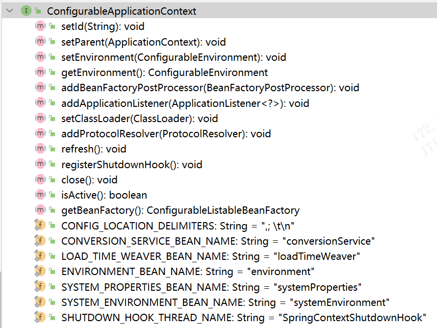

# context


spring-context.xlsx
spring-context2.xlsx
spring-context_4.xlsx
spring-context_cache.xlsx
spring-context_remote.xlsx
spring-context_jmx.xlsx


Spring Security 提供了诸多的 TokenStore 实现，如存在内存中的 InMemoryTokenStore 、存在数据库中的 JdbcTokenStore、存在 Redis 中的 RedisTokenStore

https://www.jianshu.com/p/64f2ee59acd9

org.springframework.context.annotation.ImportResource


ComponentScanAnnotationParser

org.springframework.context.annotation.ConfigurationClassParser#ConfigurationClassParser 中用ComponentScanAnnotationParser


## 源代码分包详解v5.2.9

https://docs.spring.io/spring-framework/docs/5.2.x/javadoc-api/

### org.springframework.cache


| org.springframework.cache     | 类型      | 详解 |
| ----------------------------- | --------- | ---- |
| Cache                         | interface |      |
| Cache.ValueRetrievalException | exception |      |
| Cache.ValueWrapper            | interface |      |
| CacheManager                  |           |      |
|                               |           |      |

#### org.springframework.cache.annotation


| org.springframework.cache.annotation                  | 类型 | 详解 |
| ----------------------------------------------------- | ---- | ---- |
|                                                       |      |      |
| Interfaces                                            |      |      |
|                                                       |      |      |
| AnnotationCacheOperationSource.CacheOperationProvider |      |      |
| CacheAnnotationParser                                 |      |      |
| CachingConfigurer                                     |      |      |
|                                                       |      |      |
| Classes                                               |      |      |
|                                                       |      |      |
| AbstractCachingConfiguration                          |      |      |
| AnnotationCacheOperationSource                        |      |      |
| CachingConfigurationSelector                          |      |      |
| CachingConfigurerSupport                              |      |      |
| ProxyCachingConfiguration                             |      |      |
| SpringCacheAnnotationParser                           |      |      |
|                                                       |      |      |
| Annotation Types                                      |      |      |
|                                                       |      |      |
| Cacheable                                             |      |      |
| CacheConfig                                           |      |      |
| CacheEvict                                            |      |      |
| CachePut                                              |      |      |
| Caching                                               |      |      |
| EnableCaching                                         |      |      |

#### org.springframework.cache.concurrent

| org.springframework.cache.concurrent | 类型 | 详解 |
| ------------------------------------ | ---- | ---- |
| ConcurrentMapCache                   |      |      |
| ConcurrentMapCacheFactoryBean        |      |      |
| ConcurrentMapCacheManager            |      |      |

在 Spring Framework 5.2.9 版本中，`ConcurrentMapCacheFactoryBean` 是一个用于创建基于 `ConcurrentHashMap` 的缓存的 FactoryBean。

`ConcurrentMapCacheFactoryBean` 的作用是创建一个 `ConcurrentMapCache` 对象，该对象实现了 Spring 的 `Cache` 接口，用于在应用程序中进行缓存操作。该缓存对象使用 `ConcurrentHashMap` 作为底层数据结构，提供了并发访问和线程安全的功能。

以下是使用 `ConcurrentMapCacheFactoryBean` 的示例代码：

```java
import org.springframework.cache.Cache;
import org.springframework.cache.CacheManager;
import org.springframework.cache.concurrent.ConcurrentMapCacheManager;
import org.springframework.context.annotation.Bean;
import org.springframework.context.annotation.Configuration;

@Configuration
public class CacheConfig {

    @Bean
    public CacheManager cacheManager() {
        ConcurrentMapCacheManager cacheManager = new ConcurrentMapCacheManager();
        cacheManager.setCacheNames("myCache"); // 设置缓存名称
        cacheManager.setAllowNullValues(false); // 设置是否允许缓存中存储 null 值
        cacheManager.setDefaultExpiration(3600); // 设置默认缓存过期时间（单位：秒）
        cacheManager.setTransactionAware(true); // 设置是否支持事务感知

        return cacheManager;
    }

    @Bean
    public Cache myCache(CacheManager cacheManager) {
        return cacheManager.getCache("myCache");
    }
}
```

在上述示例中，我们使用 `ConcurrentMapCacheFactoryBean` 创建了一个基于 `ConcurrentHashMap` 的缓存管理器 `ConcurrentMapCacheManager`。通过调用 `cacheManager.setCacheNames("myCache")` 方法，我们设置了一个名为 "myCache" 的缓存名称。

然后，我们可以通过注入 `CacheManager` 对象，并调用 `getCache("myCache")` 方法来获取具体的缓存对象，如示例中的 `myCache` bean。

在实际应用中，我们可以使用这个缓存对象来进行缓存操作，例如存储和获取数据。例如：

```java
import org.springframework.beans.factory.annotation.Autowired;
import org.springframework.cache.Cache;
import org.springframework.stereotype.Service;

@Service
public class MyService {

    @Autowired
    private Cache myCache;

    public String getData(String key) {
        // 尝试从缓存中获取数据
        Cache.ValueWrapper valueWrapper = myCache.get(key);
        if (valueWrapper != null) {
            return (String) valueWrapper.get();
        }

        // 从数据库或其他数据源获取数据
        String data = fetchDataFromDataSource(key);

        // 将数据存入缓存
        myCache.put(key, data);

        return data;
    }

    private String fetchDataFromDataSource(String key) {
        // 从数据库或其他数据源获取数据的实现
        // ...
    }
}
```

在上述示例中，我们在 `MyService` 类中注入了名为 `myCache` 的缓存对象。在 `getData` 方法中，我们首先尝试从缓存中获取数据，如果缓存中存在数据，则直接返回。如果缓存中不存在数据，则从数据源中获取数据，并将其存入缓存中。

通过使用 `ConcurrentMapCacheFactoryBean` 创建缓存对象，我们可以方便地在 Spring 应用程序中使用基于 `ConcurrentHashMap` 的缓存来提高应用程序的性能和响应速度。

#### org.springframework.cache.config

| org.springframework.cache.config                             | 类型     | 详解                        |
| ------------------------------------------------------------ | -------- | --------------------------- |
| AnnotationDrivenCacheBeanDefinitionParser                    |          |                             |
| AnnotationDrivenCacheBeanDefinitionParser.JCacheCachingConfigurer |          |                             |
| AnnotationDrivenCacheBeanDefinitionParser.SpringCachingConfigurer |          |                             |
| CacheAdviceParser                                            |          |                             |
| CacheAdviceParser.Props                                      |          |                             |
| CacheManagementConfigUtils                                   | abstract |                             |
| CacheNamespaceHandler                                        |          | NamespaceHandlerSupport子类 |


#### org.springframework.cache.interceptor

| org.springframework.cache.interceptor     | 类型 | 详解 |
| ----------------------------------------- | ---- | ---- |
|                                           |      |      |
| BasicOperation                            |      |      |
| CacheErrorHandler                         |      |      |
| CacheOperationInvocationContext           |      |      |
| CacheOperationInvoker                     |      |      |
| CacheOperationSource                      |      |      |
| CacheResolver                             |      |      |
| KeyGenerator                              |      |      |
|                                           |      |      |
| Classes                                   |      |      |
|                                           |      |      |
| AbstractCacheInvoker                      |      |      |
| AbstractCacheResolver                     |      |      |
| AbstractFallbackCacheOperationSource      |      |      |
| BeanFactoryCacheOperationSourceAdvisor    |      |      |
| CacheableOperation                        |      |      |
| CacheableOperation.Builder                |      |      |
| CacheAspectSupport                        |      |      |
| CacheAspectSupport.CacheOperationMetadata |      |      |
| CacheEvictOperation                       |      |      |
| CacheEvictOperation.Builder               |      |      |
| CacheInterceptor                          |      |      |
| CacheOperation                            |      |      |
| CacheOperation.Builder                    |      |      |
| CacheProxyFactoryBean                     |      |      |
| CachePutOperation                         |      |      |
| CachePutOperation.Builder                 |      |      |
| CompositeCacheOperationSource             |      |      |
| NamedCacheResolver                        |      |      |
| NameMatchCacheOperationSource             |      |      |
| SimpleCacheErrorHandler                   |      |      |
| SimpleCacheResolver                       |      |      |
| SimpleKey                                 |      |      |
| SimpleKeyGenerator                        |      |      |
|                                           |      |      |
| Exceptions                                |      |      |
|                                           |      |      |
| CacheOperationInvoker.ThrowableWrapper    |      |      |


CacheInterceptor
在 Spring Framework 5.2.9 版本中，`CacheInterceptor` 是一个 AOP 拦截器，用于在方法调用前后进行缓存操作。
`CacheInterceptor` 的作用是拦截被 `@Cacheable`、`@CachePut` 和 `@CacheEvict` 注解修饰的方法，并根据注解的配置进行缓存读取、写入和清除操作。它是 Spring Cache 抽象模块的一部分，用于与底层的缓存提供商（如`ConcurrentHashMap`、Redis 等）进行交互。
以下是使用 `CacheInterceptor` 的示例代码：

```java
import org.springframework.cache.annotation.EnableCaching;
import org.springframework.cache.annotation.Cacheable;
import org.springframework.context.annotation.Bean;
import org.springframework.context.annotation.Configuration;
import org.springframework.context.annotation.EnableAspectJAutoProxy;

@Configuration
@EnableCaching
@EnableAspectJAutoProxy
public class CacheConfig {

    @Bean
    public MyService myService() {
        return new MyService();
    }
}

public class MyService {

    @Cacheable("myCache")
    public String getData(String key) {
        // 从数据库或其他数据源获取数据的实现
        // ...
    }
}
```

在上述示例中，我们首先通过 `@EnableCaching` 注解启用 Spring 的缓存支持，并通过 `@EnableAspectJAutoProxy` 注解启用 AspectJ 自动代理。
然后，在 `MyService` 类中，我们使用 `@Cacheable("myCache")` 注解修饰了 `getData` 方法。该注解指定了缓存名称为 "myCache"，表示该方法的返回值可以被缓存。
当调用 `getData` 方法时，`CacheInterceptor` 拦截到方法调用，并根据注解配置进行缓存操作。如果缓存中存在对应的数据，则直接返回缓存中的数据；如果缓存中不存在对应的数据，则执行方法体内的逻辑，从数据库或其他数据源中获取数据，并将其存入缓存中。
通过使用 `CacheInterceptor`，我们可以方便地在 Spring 应用程序中使用缓存注解来提高数据访问性能。它简化了缓存的配置和管理，使得开发者能够专注于业务逻辑而无需过多关注缓存的细节。

#### org.springframework.cache.support

| org.springframework.cache.support | 类型 | 详解 |
| --------------------------------- | ---- | ---- |
| Classes                           |      |      |
| AbstractCacheManager              |      |      |
| AbstractValueAdaptingCache        |      |      |
| CompositeCacheManager             |      |      |
| NoOpCache                         |      |      |
| NoOpCacheManager                  |      |      |
| NullValue                         |      |      |
| SimpleCacheManager                |      |      |
| SimpleValueWrapper                |      |      |

CompositeCacheManager NoOpCacheManager SimpleCacheManager
对于CompositeCacheManager、NoOpCacheManager和SimpleCacheManager这三个类的使用场景如下:

1. CompositeCacheManager: 它可以组合多个CacheManager实例,并按顺序检查每个CacheManager是否包含key。这样就可以在多个CacheManager实例之间搜索cache。它通常用于在多个CacheManager实例之间进行cache的层层查找。

2. NoOpCacheManager: 它是一个空实现,不提供任何caching功能。它主要用于在还没有cache实现的时候作为placeholder,或者在不需要cache的场景下使用。

3. SimpleCacheManager: 它是一个使用ConcurrentHashMap作为cache存储的简单实现。它对cache的操作是线程安全的。它提供了基本的put/get/clear等方法,可以覆盖默认过期策略。它通常用于需要一个简单的本地缓存实现的场景。

所以综上:

- CompositeCacheManager用于跨多个CacheManager查找缓存。

- NoOpCacheManager用于placeholder的场景。 

- SimpleCacheManager用于需要一个简单线程安全的本地缓存的场景。

根据实际需要选择使用不同的CacheManager实现。
### org.springframework.context

| org.springframework.context    | 类型      | 详解 |
| ------------------------------ | --------- | ---- |
| ApplicationContext             | interface |      |
| ApplicationContextAware        | interface |      |
| ApplicationContextInitializer  | interface |      |
| ApplicationEventPublisher      | interface |      |
| ApplicationEventPublisherAware | interface |      |
| ApplicationListener            | interface |      |
| ConfigurableApplicationContext | interface |  下面 |
| EmbeddedValueResolverAware     | interface |      |
| EnvironmentAware               | interface |      |
| HierarchicalMessageSource      | interface |      |
| Lifecycle                      | interface |      |
| LifecycleProcessor             | interface |      |
| MessageSource                  | interface |      |
| MessageSourceAware             | interface |      |
| MessageSourceResolvable        | interface |      |
| Phased                         | interface |      |
| ResourceLoaderAware            | interface |      |
| SmartLifecycle                 | interface |      |
|                                |           |      |
| ApplicationEvent               |           |      |
| PayloadApplicationEvent        |           |      |
|                                |           |      |
| Exceptions                     |           |      |
|                                |           |      |
| ApplicationContextException    |           |      |
| NoSuchMessageException         |           |      |


ApplicationContextInitializer<C extends ConfigurableApplicationContext>


在org.springframework.boot.SpringApplication#initializers 中使用

spring boot项目调用栈例子


```shell
initialize:39, DubboServiceRegistrationApplicationContextInitializer (com.alibaba.cloud.dubbo.context)
applyInitializers:626, SpringApplication (org.springframework.boot)
prepareContext:370, SpringApplication (org.springframework.boot)
run:314, SpringApplication (org.springframework.boot)
run:140, SpringApplicationBuilder (org.springframework.boot.builder)
bootstrapServiceContext:212, BootstrapApplicationListener (org.springframework.cloud.bootstrap)
onApplicationEvent:117, BootstrapApplicationListener (org.springframework.cloud.bootstrap)
onApplicationEvent:74, BootstrapApplicationListener (org.springframework.cloud.bootstrap)
doInvokeListener:172, SimpleApplicationEventMulticaster (org.springframework.context.event)
invokeListener:165, SimpleApplicationEventMulticaster (org.springframework.context.event)
multicastEvent:139, SimpleApplicationEventMulticaster (org.springframework.context.event)
multicastEvent:127, SimpleApplicationEventMulticaster (org.springframework.context.event)
environmentPrepared:80, EventPublishingRunListener (org.springframework.boot.context.event)
environmentPrepared:53, SpringApplicationRunListeners (org.springframework.boot)
prepareEnvironment:345, SpringApplication (org.springframework.boot)
run:308, SpringApplication (org.springframework.boot)
run:1237, SpringApplication (org.springframework.boot)
run:1226, SpringApplication (org.springframework.boot)
```


ApplicationContextInitializer


```
ParentContextApplicationContextInitializer (org.springframework.boot.builder)
ConditionEvaluationReportLoggingListener (org.springframework.boot.autoconfigure.logging)
BeanDefinitionDsl (org.springframework.context.support)
DubboApplicationContextInitializer (org.apache.dubbo.spring.boot.context)
AncestorInitializer in BootstrapApplicationListener (org.springframework.cloud.bootstrap)
EnvironmentDecryptApplicationInitializer (org.springframework.cloud.bootstrap.encrypt)
DelegatingEnvironmentDecryptApplicationInitializer in BootstrapApplicationListener (org.springframework.cloud.bootstrap)
ServerPortInfoApplicationContextInitializer (org.springframework.boot.web.context)
DelegatingApplicationContextInitializer (org.springframework.boot.context.config)
ServletContextApplicationContextInitializer (org.springframework.boot.web.servlet.support)
ParentContextApplicationContextInitializer in SpringBootContextLoader (org.springframework.boot.test.context)
ContextCustomizerAdapter in SpringBootContextLoader (org.springframework.boot.test.context)
SharedMetadataReaderFactoryContextInitializer (org.springframework.boot.autoconfigure)
RSocketPortInfoApplicationContextInitializer (org.springframework.boot.rsocket.context)
ConfigurationWarningsApplicationContextInitializer (org.springframework.boot.context)
DubboServiceRegistrationApplicationContextInitializer (com.alibaba.cloud.dubbo.context)
ConfigFileApplicationContextInitializer (org.springframework.boot.test.context)
PostProcessorInitializer in RestartEndpoint (org.springframework.cloud.context.restart)
PropertySourceBootstrapConfiguration (org.springframework.cloud.bootstrap.config)
ContextIdApplicationContextInitializer (org.springframework.boot.context)
```





#### org.springframework.context.annotation


| org.springframework.context.annotation          | 类型       |      | 详解                                                         |                                                              |      |
| ----------------------------------------------- | ---------- | ---- | ------------------------------------------------------------ | ------------------------------------------------------------ | ---- |
| AdviceMode                                      |            |      | Enumeration used to determine whether JDK proxy-based or AspectJ weaving-based advice should be applied. |                                                              |      |
| AdviceModeImportSelector<A extends Annotation>  |            |      | Convenient base class for ImportSelector implementations that select imports based on an AdviceMode value from an annotation (such as the @Enable* annotations). |                                                              |      |
|                                                 |            |      |                                                              |                                                              |      |
| AnnotatedBeanDefinitionReader                   |            |      | Convenient adapter for programmatic registration of bean classes. |                                                              |      |
|                                                 |            |      |                                                              |                                                              |      |
| AnnotationBeanNameGenerator                     |            |      | BeanNameGenerator implementation for bean classes annotated with the @Component annotation or with another annotation that is itself annotated with @Component as a meta-annotation. |                                                              |      |
|                                                 |            |      |                                                              |                                                              |      |
| AnnotationConfigApplicationContext              |            |      | Standalone application context, accepting component classes as input — in particular @Configuration-annotated classes, but also plain @Component types and JSR-330 compliant classes using jakarta.inject annotations. |                                                              |      |
|                                                 |            |      |                                                              |                                                              |      |
| AnnotationConfigBeanDefinitionParser            |            |      | Parser for the <context:annotation-config/> element.         |                                                              |      |
|                                                 |            |      |                                                              |                                                              |      |
| AnnotationConfigRegistry                        |            |      | Common interface for annotation config application contexts, defining AnnotationConfigRegistry.register(java.lang.Class<?>...) and AnnotationConfigRegistry.scan(java.lang.String...) methods. |                                                              |      |
|                                                 |            |      |                                                              |                                                              |      |
| AnnotationConfigUtils                           |            |      | Utility class that allows for convenient registration of common BeanPostProcessor and BeanFactoryPostProcessor definitions for annotation-based configuration. |                                                              |      |
|                                                 |            |      |                                                              |                                                              |      |
| AnnotationScopeMetadataResolver                 |            |      | A ScopeMetadataResolver implementation that by default checks for the presence of Spring's @Scope annotation on the bean class. |                                                              |      |
|                                                 |            |      |                                                              |                                                              |      |
| AutoProxyRegistrar                              |            |      | Registers an auto proxy creator against the current BeanDefinitionRegistry as appropriate based on an @Enable* annotation having mode and proxyTargetClass attributes set to the correct values. |                                                              |      |
|                                                 |            |      |                                                              |                                                              |      |
| Bean                                            | @interface |      | Indicates that a method produces a bean to be managed by the Spring container. |                                                              |      |
|                                                 |            |      |                                                              |                                                              |      |
| ClassPathBeanDefinitionScanner              |            |      | A bean definition scanner that detects bean candidates on the classpath, registering corresponding bean definitions with a given registry (BeanFactory or ApplicationContext). | ClassPathScanningCandidateComponentProvider子类 scan() doScan() addIncludeFilter() 很多三方框架都自定义这个类的子类 |      |
|                                                 |            |      |                                                              |                                                              |      |
| ClassPathScanningCandidateComponentProvider     |            |      | A component provider that provides candidate components from a base package. |                                                              |      |
|                                                 |            |      |                                                              |                                                              |      |
| CommonAnnotationBeanPostProcessor               |            |      | BeanPostProcessor implementation that supports common Java annotations out of the box, in particular the common annotations in the jakarta.annotation package. |                                                              |      |
|                                                 |            |      |                                                              |                                                              |      |
| CommonAnnotationBeanPostProcessor.LookupElement |            |      | Class representing generic injection information about an annotated field or setter method, supporting @Resource and related annotations. |                                                              |      |
|                                                 |            |      |                                                              |                                                              |      |
| ComponentScan                                   | @interface |      | Configures component scanning directives for use with @Configuration classes. |                                                              |      |
|                                                 |            |      |                                                              |                                                              |      |
| ComponentScanAnnotationParser                   |            |      |                                                              | @ComponentScan会被解析为一个Bean定义扫描器                   |      |
|                                                 |            |      |                                                              |                                                              |      |
| ComponentScan.Filter                            |            |      | Declares the type filter to be used as an include filter or exclude filter. |                                                              |      |
|                                                 |            |      |                                                              |                                                              |      |
| ComponentScanBeanDefinitionParser               |            |      | Parser for the <context:component-scan/> element.            |                                                              |      |
|                                                 |            |      |                                                              |                                                              |      |
| ComponentScans                                  |            |      | Container annotation that aggregates several ComponentScan annotations. |                                                              |      |
|                                                 |            |      |                                                              |                                                              |      |
| Condition                                       |            |      | A single condition that must be matched in order for a component to be registered. |                                                              |      |
|                                                 |            |      |                                                              |                                                              |      |
| Conditional                                     | @interface |      | Indicates that a component is only eligible for registration when all specified conditions match. |                                                              |      |
|                                                 |            |      |                                                              |                                                              |      |
| ConditionContext                                |            |      | Context information for use by Condition implementations.    |                                                              |      |
|                                                 |            |      |                                                              |                                                              |      |
| Configuration                                   | @interface |      | Indicates that a class declares one or more @Bean methods and may be processed by the Spring container to generate bean definitions and service requests for those beans at runtime, for example: |                                                              |      |
|                                                 |            |      |                                                              |                                                              |      |
| ConfigurationClassPostProcessor                 |            |      | BeanFactoryPostProcessor used for bootstrapping processing of @Configuration classes. | processConfigBeanDefinitions()核心方法                       |      |
| ConfigurationClassUtils                         |            |      | Utilities for identifying and configuring Configuration classes. |                                                              |      |
|                                                 |            |      |                                                              |                                                              |      |
| ConfigurationCondition                          |            |      | A Condition that offers more fine-grained control when used with @Configuration. |                                                              |      |
|                                                 |            |      |                                                              |                                                              |      |
| ConfigurationCondition.ConfigurationPhase       |            |      | The various configuration phases where the condition could be evaluated. |                                                              |      |
|                                                 |            |      |                                                              |                                                              |      |
| ContextAnnotationAutowireCandidateResolver      |            |      | Complete implementation of the AutowireCandidateResolver strategy interface, providing support for qualifier annotations as well as for lazy resolution driven by the Lazy annotation in the context.annotation package. |                                                              |      |
|                                                 |            |      |                                                              |                                                              |      |
| DeferredImportSelector                          |            |      | A variation of ImportSelector that runs after all @Configuration beans have been processed. |                                                              |      |
|                                                 |            |      |                                                              |                                                              |      |
| DeferredImportSelector.Group                    |            |      | Interface used to group results from different import selectors. |                                                              |      |
|                                                 |            |      |                                                              |                                                              |      |
| DeferredImportSelector.Group.Entry              |            |      | An entry that holds the AnnotationMetadata of the importing Configuration class and the class name to import. |                                                              |      |
|                                                 |            |      |                                                              |                                                              |      |
| DependsOn                                       | @interface |      | Beans on which the current bean depends.                     |                                                              |      |
|                                                 |            |      |                                                              |                                                              |      |
| Description                                     | @interface |      | Adds a textual description to bean definitions derived from Component or Bean. |                                                              |      |
|                                                 |            |      |                                                              |                                                              |      |
| EnableAspectJAutoProxy                          | @interface |      | Enables support for handling components marked with AspectJ's @Aspect annotation, similar to functionality found in Spring's <aop:aspectj-autoproxy> XML element. |                                                              |      |
|                                                 |            |      |                                                              |                                                              |      |
| EnableLoadTimeWeaving                           | @interface |      | "Activates a Spring LoadTimeWeaver for this application context, available as a bean with the name ""loadTimeWeaver"", similar to the <context:load-time-weaver> element in Spring XML." |                                                              |      |
|                                                 |            |      |                                                              |                                                              |      |
| EnableLoadTimeWeaving.AspectJWeaving            | @interface |      | AspectJ weaving enablement options.                          |                                                              |      |
|                                                 |            |      |                                                              |                                                              |      |
| EnableMBeanExport                               |            |      | Enables default exporting of all standard MBeans from the Spring context, as well as all @ManagedResource annotated beans. |                                                              |      |
|                                                 |            |      |                                                              |                                                              |      |
| FilterType                                      |            |      | Enumeration of the type filters that may be used in conjunction with @ComponentScan. |                                                              |      |
|                                                 |            |      |                                                              |                                                              |      |
| FullyQualifiedAnnotationBeanNameGenerator       |            |      | An extension of AnnotationBeanNameGenerator that uses the fully qualified class name as the default bean name if an explicit bean name is not supplied via a supported type-level annotation such as @Component (see AnnotationBeanNameGenerator for details on supported annotations). |                                                              |      |
|                                                 |            |      |                                                              |                                                              |      |
| Import                                          | @interface |      | Indicates one or more component classes to import — typically @Configuration classes. |                                                              |      |
|                                                 |            |      |                                                              |                                                              |      |
| ImportAware                                     |            |      | Interface to be implemented by any @Configuration class that wishes to be injected with the AnnotationMetadata of the @Configuration class that imported it. |                                                              |      |
|                                                 |            |      |                                                              |                                                              |      |
| ImportAwareAotBeanPostProcessor                 |            |      | A BeanPostProcessor that honours ImportAware callback using a mapping computed at build time. |                                                              |      |
|                                                 |            |      |                                                              |                                                              |      |
| ImportBeanDefinitionRegistrar                   |            |      | Interface to be implemented by types that register additional bean definitions when processing @Configuration classes. |                                                              |      |
|                                                 |            |      |                                                              |                                                              |      |
| ImportResource                                  | @interface |      | Indicates one or more resources containing bean definitions to import. |                                                              |      |
|                                                 |            |      |                                                              |                                                              |      |
| ImportRuntimeHints                              |            |      | Indicates that one or more RuntimeHintsRegistrar implementations should be processed. |                                                              |      |
|                                                 |            |      |                                                              |                                                              |      |
| ImportSelector                                  |            |      | Interface to be implemented by types that determine which @Configuration class(es) should be imported based on a given selection criteria, usually one or more annotation attributes. |                                                              |      |
|                                                 |            |      |                                                              |                                                              |      |
| Jsr330ScopeMetadataResolver                     |            |      | Simple ScopeMetadataResolver implementation that follows JSR-330 scoping rules: defaulting to prototype scope unless Singleton is present. |                                                              |      |
|                                                 |            |      |                                                              |                                                              |      |
| Lazy                                            | @interface |      | Indicates whether a bean is to be lazily initialized.        |                                                              |      |
|                                                 |            |      |                                                              |                                                              |      |
| LoadTimeWeavingConfiguration                    |            |      | @Configuration class that registers a LoadTimeWeaver bean.   |                                                              |      |
|                                                 |            |      |                                                              |                                                              |      |
| LoadTimeWeavingConfigurer                       |            |      | Interface to be implemented by @Configuration classes annotated with @EnableLoadTimeWeaving that wish to customize the LoadTimeWeaver instance to be used. |                                                              |      |
|                                                 |            |      |                                                              |                                                              |      |
| MBeanExportConfiguration                        |            |      | @Configuration class that registers a AnnotationMBeanExporter bean. |                                                              |      |
|                                                 |            |      |                                                              |                                                              |      |
| Primary                                         | @interface |      | Indicates that a bean should be given preference when multiple candidates are qualified to autowire a single-valued dependency. |                                                              |      |
|                                                 |            |      |                                                              |                                                              |      |
| Profile                                         | @interface |      | Indicates that a component is eligible for registration when one or more specified profiles are active. |                                                              |      |
|                                                 |            |      |                                                              |                                                              |      |
| PropertySource                                  | @interface |      | Annotation providing a convenient and declarative mechanism for adding a PropertySource to Spring's Environment. |                                                              |      |
|                                                 |            |      |                                                              |                                                              |      |
| PropertySources                                 |            |      | Container annotation that aggregates several PropertySource annotations. |                                                              |      |
|                                                 |            |      |                                                              |                                                              |      |
| Role                                            | @interface |      | Indicates the 'role' hint for a given bean.                  |                                                              |      |
|                                                 |            |      |                                                              |                                                              |      |
| ScannedGenericBeanDefinition                    |            |      | Extension of the GenericBeanDefinition class, based on an ASM ClassReader, with support for annotation metadata exposed through the AnnotatedBeanDefinition interface. |                                                              |      |
|                                                 |            |      |                                                              |                                                              |      |
| Scope                                           | @interface |      | When used as a type-level annotation in conjunction with @Component, @Scope indicates the name of a scope to use for instances of the annotated type. |                                                              |      |
|                                                 |            |      |                                                              |                                                              |      |
| ScopedProxyMode                                 |            |      | Enumerates the various scoped-proxy options.                 |                                                              |      |
|                                                 |            |      |                                                              |                                                              |      |
| ScopeMetadata                                   |            |      | Describes scope characteristics for a Spring-managed bean including the scope name and the scoped-proxy behavior. |                                                              |      |
|                                                 |            |      |                                                              |                                                              |      |
| ScopeMetadataResolver                           |            |      | Strategy interface for resolving the scope of bean definitions. |                                                              |      |
|                                                 |            |      |                                                              |                                                              |      |
| TypeFilterUtils                                 |            |      | Collection of utilities for working with @ComponentScan type filters. |                                                              |      |
|                                                 |            |      |                                                              |                                                              |      |
| EnableSpringConfigured                          |            |      | Signals the current application context to apply dependency injection to non-managed classes that are instantiated outside the Spring bean factory (typically classes annotated with the @Configurable annotation). |                                                              |      |
|                                                 |            |      |                                                              |                                                              |      |
| SpringConfiguredConfiguration                   |            |      | @Configuration class that registers an AnnotationBeanConfigurerAspect capable of performing dependency injection services for non-Spring managed objects annotated with @Configurable. |                                                              |      |
|                                                 |            |      |                                                              |                                                              |      |


```
AnnotationConfigRegistry子类
```


AnnotationConfigServletWebServerApplicationContext (org.springframework.boot.web.servlet.context)
AnnotationConfigReactiveWebServerApplicationContext (org.springframework.boot.web.reactive.context)
AnnotationConfigWebApplicationContext (org.springframework.web.context.support)
AnnotationConfigApplicationContext (org.springframework.context.annotation)
    AnnotationConfigReactiveWebApplicationContext (org.springframework.boot.web.reactive.context)
AnnotationConfigServletWebApplicationContext (org.springframework.boot.web.servlet.context)


org.springframework.context.annotation.AnnotatedBeanDefinitionReader#doRegisterBean 断点


```
doRegisterBean:253, AnnotatedBeanDefinitionReader (org.springframework.context.annotation)
registerBean:147, AnnotatedBeanDefinitionReader (org.springframework.context.annotation)
register:137, AnnotatedBeanDefinitionReader (org.springframework.context.annotation)
load:157, BeanDefinitionLoader (org.springframework.boot)
load:136, BeanDefinitionLoader (org.springframework.boot)
load:128, BeanDefinitionLoader (org.springframework.boot)
load:691, SpringApplication (org.springframework.boot)
prepareContext:392, SpringApplication (org.springframework.boot)
run:314, SpringApplication (org.springframework.boot)
run:1237, SpringApplication (org.springframework.boot)
run:1226, SpringApplication (org.springframework.boot)

```


org.springframework.boot.BeanDefinitionLoader#annotatedReader 中有该类的对象


ImportAware接口实现类 LoadTimeWeavingConfiguration


org.springframework.context.annotation.ConfigurationClassPostProcessor#postProcessBeanFactory

代码

```
beanFactory.addBeanPostProcessor(new ImportAwareBeanPostProcessor(beanFactory));
```


PropertySource注解

@Repeatable(PropertySources.class)
public @interface PropertySource {
    
用法例子
   ```java
   import org.springframework.beans.factory.annotation.Value;
   import org.springframework.context.annotation.PropertySource;
   import org.springframework.stereotype.Component;

   @Component
   @PropertySource("classpath:config.properties")
   public class ConfigReader {
       @Value("${key}")
       private String value;

       public void printValue() {
           System.out.println("Value: " + value);
       }
   }
   ```


AnnotatedBeanDefinitionReader
`AnnotatedBeanDefinitionReader` 是 Spring 框架中的一个类，它的作用是将带有注解的类转换成 Bean 定义（BeanDefinition），并将这些 Bean 定义注册到 Spring 应用上下文中。
在 Spring 中，Bean 定义是描述 Spring 容器中的 Bean 的元数据，它包含了 Bean 的类名、作用域、属性、构造函数参数等信息。通常情况下，我们可以通过 XML 配置文件或者 Java 配置类来定义 Bean，但是 Spring 还提供了一种方式，即使用注解来定义 Bean。
`AnnotatedBeanDefinitionReader` 类就是用于处理这种注解方式的 Bean 定义。它可以扫描指定的包路径，查找带有特定注解的类，并将这些类转换成对应的 Bean 定义。常用的注解包括 `@Component`、`@Service`、`@Repository`、`@Controller` 等。
使用 `AnnotatedBeanDefinitionReader` 可以使 Bean 的定义更加简洁，避免了繁琐的 XML 配置或 Java 配置类的编写。同时，它也提供了更加灵活的方式对 Bean 进行定制。
需要注意的是，要使用 `AnnotatedBeanDefinitionReader`，你需要先创建一个空的 `BeanDefinitionRegistry` 对象，然后将其作为参数传递给 `AnnotatedBeanDefinitionReader` 的构造函数，最后使用 `register` 方法将 Bean 定义注册到该对象中。


ClassPathScanningCandidateComponentProvider
cpsccp

<context:component-scan base-package="cn.edidada.test.testspring32.scan.service" />


```shell
14:43:14.878 TRACE org.springframework.context.annotation.ClassPathScanningCandidateComponentProvider 425 scanCandidateComponents - Scanning file [D:\testspring32\target\classes\cn\edidada\test\testspring32\scan\service\NotifyService.class]
14:43:14.891 TRACE org.springframework.context.annotation.ClassPathScanningCandidateComponentProvider 447 scanCandidateComponents - Ignored because not matching any filter: file [D:\testspring32\target\classes\cn\edidada\test\testspring32\scan\service\NotifyService.class]
14:43:14.891 TRACE org.springframework.context.annotation.ClassPathScanningCandidateComponentProvider 425 scanCandidateComponents - Scanning file [D:\testspring32\target\classes\cn\edidada\test\testspring32\scan\service\Order.class]
14:43:14.909 DEBUG org.springframework.context.annotation.ClassPathScanningCandidateComponentProvider 435 scanCandidateComponents - Identified candidate component class: file [D:\testspring32\target\classes\cn\edidada\test\testspring32\scan\service\Order.class]
14:43:14.909 TRACE org.springframework.context.annotation.ClassPathScanningCandidateComponentProvider 425 scanCandidateComponents - Scanning file [D:\testspring32\target\classes\cn\edidada\test\testspring32\scan\service\impl\NotifyServiceByCellPhoneImpl.class]
14:43:14.910 DEBUG org.springframework.context.annotation.ClassPathScanningCandidateComponentProvider 435 scanCandidateComponents - Identified candidate component class: file [D:\testspring32\target\classes\cn\edidada\test\testspring32\scan\service\impl\NotifyServiceByCellPhoneImpl.class]
14:43:14.910 TRACE org.springframework.context.annotation.ClassPathScanningCandidateComponentProvider 425 scanCandidateComponents - Scanning file [D:\testspring32\target\classes\cn\edidada\test\testspring32\scan\service\impl\NotifyServiceByWeixinImpl.class]
14:43:14.911 TRACE org.springframework.context.annotation.ClassPathScanningCandidateComponentProvider 447 scanCandidateComponents - Ignored because not matching any filter: file [D:\testspring32\target\classes\cn\edidada\test\testspring32\scan\service\impl\NotifyServiceByWeixinImpl.class]
```


CommonAnnotationBeanPostProcessor
处理@PostConstruct
PreDestroy
注解

```java
@Component
public class MyBean {
    @PostConstruct
    public void init() {
        // 执行初始化操作
        System.out.println("Initializing MyBean...");
    }
}
```


#### org.springframework.context.config


| org.springframework.context.config | 类型 | 解释 |
| ---------------------------------- | ---- | ---- |
| Classes                            |      |      |
|  AbstractPropertyLoadingBeanDefinitionParser          |  abstract    |      |
| ContextNamespaceHandler            |      |      |
|   LoadTimeWeaverBeanDefinitionParser        |      |  load-time-weaver xml文件子节点   |
|   MBeanExportBeanDefinitionParser           |      |  mbean-export   |
|  MBeanServerBeanDefinitionParser     |      | mbean-server |
|  PropertyOverrideBeanDefinitionParser       |      | property-override  |
|  PropertyPlaceholderBeanDefinitionParser    |      | property-placeholder   |
|  SpringConfiguredBeanDefinitionParser        |      |  spring-configured  |

spring-context.xsd

ContextNamespaceHandler继承NamespaceHandlerSupport来处理xml

#### org.springframework.context.event

| org.springframework.context.event   | 类型 |      |
| ----------------------------------- | ---- | ---- |
| Interfaces                          |      |      |
| ApplicationEventMulticaster         |      |      |
| EventListenerFactory                |      |      |
| GenericApplicationListener          |      |      |
| SmartApplicationListener            |      |      |
|                                     |      |      |
| Classes                             |      |      |
| AbstractApplicationEventMulticaster |      |      |
| ApplicationContextEvent             |      |      |
| ApplicationListenerMethodAdapter    |      |      |
| ContextClosedEvent                  |      |      |
| ContextRefreshedEvent               |      |      |
| ContextStartedEvent                 |      |      |
| ContextStoppedEvent                 |      |      |
| DefaultEventListenerFactory         |      |      |
| EventListenerMethodProcessor        |      |      |
| EventPublicationInterceptor         |      |      |
| GenericApplicationListenerAdapter   |      |      |
| SimpleApplicationEventMulticaster   |      |      |
| SourceFilteringListener             |      |      |
|                                     |      |      |
| Annotation Types                    |      |      |
| EventListener                       |      |      |

XXXEvent
ApplicationContextEvent
ContextClosedEvent
ContextRefreshedEvent
ContextStartedEvent
ContextStoppedEvent

SmartApplicationListener接口
子类
GenericApplicationListenerAdapter (org.springframework.context.event)
RefreshEventListener (org.springframework.cloud.endpoint.event)
CloseContextOnFailureApplicationListener in BootstrapApplicationListener (org.springframework.cloud.bootstrap)
AwaitingNonWebApplicationListener (org.apache.dubbo.spring.boot.context.event)
RestartListener (org.springframework.cloud.context.restart)
ConfigFileApplicationListener (org.springframework.boot.context.config)
    Anonymous in ConfigFileApplicationContextInitializer (org.springframework.boot.test.context)
SourceFilteringListener (org.springframework.context.event)


SmartApplicationListener接口是Spring框架中的一个事件监听器接口，用于监听应用程序中的事件并执行相应的逻辑。与普通的ApplicationListener接口相比，SmartApplicationListener接口提供了更多的灵活性和扩展性。

下面是列出的子类以及它们的作用和区别：

1. GenericApplicationListenerAdapter (org.springframework.context.event)：
GenericApplicationListenerAdapter是一个适配器类，用于将普通的ApplicationListener适配成SmartApplicationListener。它实现了SmartApplicationListener接口，并将普通的ApplicationListener委托给其处理。
2. RefreshEventListener (org.springframework.cloud.endpoint.event)：
RefreshEventListener是用于监听Spring Cloud中的刷新事件的监听器。它负责处理应用程序中的RefreshEvent事件，通常与Spring Cloud Config等组件一起使用，用于动态刷新配置。
3. CloseContextOnFailureApplicationListener in BootstrapApplicationListener (org.springframework.cloud.bootstrap)：
CloseContextOnFailureApplicationListener是BootstrapApplicationListener中的一个内部类，用于在引导过程中处理应用程序启动失败的情况，关闭应用程序上下文。
4. AwaitingNonWebApplicationListener (org.apache.dubbo.spring.boot.context.event)：
AwaitingNonWebApplicationListener是Dubbo框架中的一个监听器，用于等待非Web应用程序上下文的加载完成。它主要用于Dubbo在Spring Boot环境下的初始化过程。
5. RestartListener (org.springframework.cloud.context.restart)：
RestartListener是用于监听Spring Cloud应用程序的重启事件的监听器。它负责处理应用程序的重启逻辑，通常与Spring Cloud的热加载和热部署功能一起使用。
6. ConfigFileApplicationListener (org.springframework.boot.context.config)：
ConfigFileApplicationListener是Spring Boot中的一个监听器，用于加载和解析应用程序的配置文件。它负责处理应用程序配置文件的加载和刷新，支持多种配置文件格式和位置。
7. Anonymous in ConfigFileApplicationContextInitializer (org.springframework.boot.test.context)：
Anonymous是ConfigFileApplicationContextInitializer中的一个匿名内部类，用于为测试环境中的应用程序上下文初始化提供配置文件的加载和解析功能。
8. SourceFilteringListener (org.springframework.context.event)：
SourceFilteringListener是一个用于过滤事件源的监听器。它可以根据特定的事件源类型来过滤掉不感兴趣的事件，只处理目标类型的事件。

这些类的作用和区别主要体现在监听的事件类型、处理的逻辑和使用的上下文环境等方面。它们各自针对不同的场景和需求，提供了特定的事件监听和处理功能，用于增强和扩展应用程序的事件驱动能力。


EventListenerFactory接口
子类
DefaultEventListenerFactory


ApplicationEventMulticaster接口

ApplicationEventMulticaster接口的作用是在Spring应用程序内广播ApplicationEvent事件。
主要功能有:
1. 添加和移除ApplicationListener监听器。监听器可以接收并处理ApplicationEvent事件。
2. 广播ApplicationEvent事件。当有事件发生时,Multicaster会通知所有的监听器进行处理。
3. 支持同步和异步两种广播方式。同步方式立即调用监听器,异步方式使用线程池调度监听器。
4. 支持指定事件的超时时间。如果监听器在超时时间内没有处理完事件,会中断处理。
5. 继承自MessageSource,可以解析国际化消息。
使用ApplicationEventMulticaster的好处是实现了事件机制的松耦合,事件发布者不需要知道哪些监听器存在,只需要通过Multicaster广播事件,由Multicaster通知适当的监听器即可。
所以ApplicationEventMulticaster是一个事件广播器,它负责传递ApplicationEvent事件到注册的监听器,是Spring事件驱动模型的关键组件。

子类
AbstractApplicationEventMulticaster (org.springframework.context.event)
    SimpleApplicationEventMulticaster (org.springframework.context.event)

EventListenerMethodProcessor类 实现了 BeanFactoryPostProcessor接口
属性
	private List<EventListenerFactory> eventListenerFactories;

在Spring 5.2.9版本中，EventListenerMethodProcessor是Spring框架中的一个事件监听器方法处理器。它用于处理使用@EventListener注解标记的方法，实现事件的发布与监听。

EventListenerMethodProcessor的主要作用是将带有@EventListener注解的方法注册为事件监听器，并在相应的事件发生时触发这些方法的执行。
具体功能和作用如下：
1. 事件监听器的注册：
EventListenerMethodProcessor会扫描Spring容器中的bean，检查bean中的方法是否带有@EventListener注解。如果发现带有@EventListener注解的方法，它会将这些方法注册为事件监听器。
2. 事件发布与监听：
一旦被注册为事件监听器，带有@EventListener注解的方法就能够监听到相应的事件。当事件被发布时，EventListenerMethodProcessor会根据事件类型找到对应的监听器方法，并触发其执行。
3. 事件参数注入：
带有@EventListener注解的方法可以定义参数，用于接收事件对象或其他相关参数。EventListenerMethodProcessor会根据方法参数的类型，将相应的事件对象或参数传递给监听器方法。
4. 异步事件监听：
EventListenerMethodProcessor还支持异步事件监听。当方法被标记为@EventListener并且使用@Async注解时，事件监听器方法将在异步线程中执行。
通过使用EventListenerMethodProcessor，开发者可以方便地在Spring应用中使用事件驱动的编程模型。它提供了一种简洁的方式来定义和处理事件，让应用程序的不同组件之间能够通过事件进行解耦和交互，从而实现更灵活、可扩展的应用架构。


org.springframework.context.event.EventListenerMethodProcessor#postProcessBeanFactory()方法断点


	@Override
	public void postProcessBeanFactory(ConfigurableListableBeanFactory beanFactory) {
		this.beanFactory = beanFactory;
	
		Map<String, EventListenerFactory> beans = beanFactory.getBeansOfType(EventListenerFactory.class, false, false);
		List<EventListenerFactory> factories = new ArrayList<>(beans.values());
		AnnotationAwareOrderComparator.sort(factories);
		this.eventListenerFactories = factories;
	}

是查找EventListenerFactory的ioc容器对象，不是EventListener对象

EventListenerFactory创建的是ApplicationListener对象，ApplicationListener是EventListener子接口
ApplicationListener<?> createApplicationListener(String beanName, Class<?> type, Method method);


postProcessBeanFactory:93, EventListenerMethodProcessor (org.springframework.context.event)
invokeBeanFactoryPostProcessors:291, PostProcessorRegistrationDelegate (org.springframework.context.support)
invokeBeanFactoryPostProcessors:182, PostProcessorRegistrationDelegate (org.springframework.context.support)
invokeBeanFactoryPostProcessors:707, AbstractApplicationContext (org.springframework.context.support)
refresh:533, AbstractApplicationContext (org.springframework.context.support)
refresh:758, SpringApplication (org.springframework.boot)
refresh:750, SpringApplication (org.springframework.boot)
refreshContext:397, SpringApplication (org.springframework.boot)
run:315, SpringApplication (org.springframework.boot)
run:140, SpringApplicationBuilder (org.springframework.boot.builder)
bootstrapServiceContext:212, BootstrapApplicationListener (org.springframework.cloud.bootstrap)
onApplicationEvent:117, BootstrapApplicationListener (org.springframework.cloud.bootstrap)
onApplicationEvent:74, BootstrapApplicationListener (org.springframework.cloud.bootstrap)
doInvokeListener:172, SimpleApplicationEventMulticaster (org.springframework.context.event)
invokeListener:165, SimpleApplicationEventMulticaster (org.springframework.context.event)
multicastEvent:139, SimpleApplicationEventMulticaster (org.springframework.context.event)
multicastEvent:127, SimpleApplicationEventMulticaster (org.springframework.context.event)
environmentPrepared:80, EventPublishingRunListener (org.springframework.boot.context.event)
environmentPrepared:53, SpringApplicationRunListeners (org.springframework.boot)
prepareEnvironment:345, SpringApplication (org.springframework.boot)
run:308, SpringApplication (org.springframework.boot)
run:1237, SpringApplication (org.springframework.boot)
run:1226, SpringApplication (org.springframework.boot)


EventListenerMethodProcessor


```shell
15:08:10.741 TRACE org.springframework.context.event.EventListenerMethodProcessor 166 processBean - No @EventListener annotations found on bean class: org.apache.logging.log4j.core.config.Configurator
15:08:10.741 TRACE org.springframework.context.event.EventListenerMethodProcessor 166 processBean - No @EventListener annotations found on bean class: cn.edidada.test.testspring32.scan.service.Order
15:08:10.742 TRACE org.springframework.context.event.EventListenerMethodProcessor 166 processBean - No @EventListener annotations found on bean class: cn.edidada.test.testspring32.scan.service.impl.NotifyServiceByCellPhoneImpl
```


org.springframework.context.event.EventListenerMethodProcessor#processBean

查看spring bean对象方法上是否有@EventListener注解


EventListenerMethodProcessor跟@EventListener注解绑定


#### org.springframework.context.expression


| org.springframework.context.expression  | 类型 | 详解 |
| --------------------------------------- | ---- | ---- |
|                                         |      |      |
| Classes                                 |      |      |
|                                         |      |      |
| AnnotatedElementKey                     |      |      |
| BeanExpressionContextAccessor           |      |      |
| BeanFactoryAccessor                     |      |      |
| BeanFactoryResolver                     |      |      |
| CachedExpressionEvaluator               |      |      |
| CachedExpressionEvaluator.ExpressionKey |      |      |
| EnvironmentAccessor                     |      |      |
| MapAccessor                             |      |      |
| MethodBasedEvaluationContext            |      |      |
| StandardBeanExpressionResolver          |      |      |

BeanExpressionResolver实现类StandardBeanExpressionResolver


```shell
evaluate:141, StandardBeanExpressionResolver (org.springframework.context.expression)
evaluateBeanDefinitionString:1575, AbstractBeanFactory (org.springframework.beans.factory.support)
doEvaluate:280, BeanDefinitionValueResolver (org.springframework.beans.factory.support)
resolveReference:329, BeanDefinitionValueResolver (org.springframework.beans.factory.support)
resolveValueIfNecessary:113, BeanDefinitionValueResolver (org.springframework.beans.factory.support)
applyPropertyValues:1697, AbstractAutowireCapableBeanFactory (org.springframework.beans.factory.support)
populateBean:1442, AbstractAutowireCapableBeanFactory (org.springframework.beans.factory.support)
doCreateBean:593, AbstractAutowireCapableBeanFactory (org.springframework.beans.factory.support)
createBean:516, AbstractAutowireCapableBeanFactory (org.springframework.beans.factory.support)
lambda$doGetBean$0:324, AbstractBeanFactory (org.springframework.beans.factory.support)
getObject:-1, 474933596 (org.springframework.beans.factory.support.AbstractBeanFactory$$Lambda$144)
getSingleton:234, DefaultSingletonBeanRegistry (org.springframework.beans.factory.support)
doGetBean:322, AbstractBeanFactory (org.springframework.beans.factory.support)
getBean:207, AbstractBeanFactory (org.springframework.beans.factory.support)
invokeBeanFactoryPostProcessors:90, PostProcessorRegistrationDelegate (org.springframework.context.support)
invokeBeanFactoryPostProcessors:707, AbstractApplicationContext (org.springframework.context.support)
refresh:533, AbstractApplicationContext (org.springframework.context.support)
refresh:758, SpringApplication (org.springframework.boot)
refresh:750, SpringApplication (org.springframework.boot)
refreshContext:397, SpringApplication (org.springframework.boot)
run:315, SpringApplication (org.springframework.boot)
run:140, SpringApplicationBuilder (org.springframework.boot.builder)
bootstrapServiceContext:212, BootstrapApplicationListener (org.springframework.cloud.bootstrap)
onApplicationEvent:117, BootstrapApplicationListener (org.springframework.cloud.bootstrap)
onApplicationEvent:74, BootstrapApplicationListener (org.springframework.cloud.bootstrap)
doInvokeListener:172, SimpleApplicationEventMulticaster (org.springframework.context.event)
invokeListener:165, SimpleApplicationEventMulticaster (org.springframework.context.event)
multicastEvent:139, SimpleApplicationEventMulticaster (org.springframework.context.event)
multicastEvent:127, SimpleApplicationEventMulticaster (org.springframework.context.event)
environmentPrepared:80, EventPublishingRunListener (org.springframework.boot.context.event)
environmentPrepared:53, SpringApplicationRunListeners (org.springframework.boot)
prepareEnvironment:345, SpringApplication (org.springframework.boot)
run:308, SpringApplication (org.springframework.boot)
run:1237, SpringApplication (org.springframework.boot)
run:1226, SpringApplication (org.springframework.boot)
```
#### org.springframework.context.i18n


| org.springframework.context.i18n | 类型 | 详解 |
| -------------------------------- | ---- | ---- |
|                                  |      |      |
| Interfaces                       |      |      |
|                                  |      |      |
| LocaleContext                    |      |      |
| TimeZoneAwareLocaleContext       |      |      |
|                                  |      |      |
| Classes                          |      |      |
|                                  |      |      |
| LocaleContextHolder              |      |      |
| SimpleLocaleContext              |      |      |
| SimpleTimeZoneAwareLocaleContext |      |      |


#### org.springframework.context.index


| org.springframework.context.index | 类型 | 详解 |
| --------------------------------- | ---- | ---- |
|                                   |      |      |
| Classes                           |      |      |
|                                   |      |      |
| CandidateComponentsIndex          |      |      |
| CandidateComponentsIndexLoader    |      |      |

##### org.springframework.context.index.processor


| org.springframework.context.index.processor | 类型 | 详解 |
| ------------------------------------------- | ---- | ---- |
|                                             |      |      |
| Classes                                     |      |      |
|                                             |      |      |
| CandidateComponentsIndexer                  |      |      |


#### org.springframework.context.support  


| org.springframework.context.support         | 类型      | 详解 |
| ------------------------------------------- | --------- | ---- |
| Interfaces                                  |           |      |
|                                             |           |      |
| LiveBeansViewMBean                          | interface |      |
|                                             |           |      |
| Classes                                     |           |      |
|                                             |           |      |
| AbstractApplicationContext                  |           |      |
| AbstractMessageSource                       |           |      |
| AbstractRefreshableApplicationContext       |           |      |
| AbstractRefreshableConfigApplicationContext |           |      |
| AbstractResourceBasedMessageSource          |           |      |
| AbstractXmlApplicationContext               |           |      |
| ApplicationObjectSupport                    |           |      |
| ClassPathXmlApplicationContext              |           |      |
| ConversionServiceFactoryBean                |           |      |
| DefaultLifecycleProcessor                   |           |      |
| DefaultMessageSourceResolvable              |           |      |
| DelegatingMessageSource                     |           |      |
| EmbeddedValueResolutionSupport              |           |      |
| FileSystemXmlApplicationContext             |           |      |
| GenericApplicationContext                   |           |      |
| GenericGroovyApplicationContext             |           |      |
| GenericXmlApplicationContext                |           |      |
| LiveBeansView                               |           |      |
| MessageSourceAccessor                       |           |      |
| MessageSourceResourceBundle                 |           |      |
| MessageSourceSupport                        |           |      |
| PostProcessorRegistrationDelegate        |           |  final 非public类，重要  |
| PropertySourcesPlaceholderConfigurer        |           |      |
| ReloadableResourceBundleMessageSource       |           |      |
| ResourceBundleMessageSource                 |           |      |
| SimpleThreadScope                           |           |      |
| StaticApplicationContext                    |           |      |
| StaticMessageSource                         |           |      |


AbstractApplicationContext
    GenericApplicationContext
        AnnotationConfigApplicationContext


PropertySourcesPlaceholderConfigurer使用例子
```
    @Bean
    public PropertySourcesPlaceholderConfigurer propertySourcesPlaceholderConfigurer() {
        PropertySourcesPlaceholderConfigurer configurer = new PropertySourcesPlaceholderConfigurer();
        Resource[] resources = new ClassPathResource[]{new ClassPathResource("application.properties")};
        configurer.setLocations(resources);
        return configurer;
    }
```

在 Spring Framework 5.2.9 版本中，`org.springframework.context.support.PostProcessorRegistrationDelegate` 是一个辅助类，用于注册和应用 BeanPostProcessor（后置处理器）。
`BeanPostProcessor` 是 Spring 容器中的一种扩展机制，它允许开发者在 Bean 实例化和初始化的过程中对 Bean 进行自定义处理。`PostProcessorRegistrationDelegate` 提供了一些静态方法，用于方便地注册和应用这些后置处理器。
以下是一个使用 `PostProcessorRegistrationDelegate` 的示例：

```java
import org.springframework.beans.factory.config.BeanPostProcessor;
import org.springframework.context.annotation.Bean;
import org.springframework.context.annotation.Configuration;
import org.springframework.context.support.PostProcessorRegistrationDelegate;

@Configuration
public class AppConfig {

    @Bean
    public MyBeanPostProcessor myBeanPostProcessor() {
        return new MyBeanPostProcessor();
    }

    @Bean
    public MyService myService() {
        return new MyService();
    }

    public static void main(String[] args) {
        // 创建 Spring 应用上下文
        AnnotationConfigApplicationContext context = new AnnotationConfigApplicationContext(AppConfig.class);

        // 注册并应用 BeanPostProcessor
        PostProcessorRegistrationDelegate.registerBeanPostProcessors(context, context.getBeanFactory());

        // 获取 MyService Bean
        MyService myService = context.getBean(MyService.class);

        // 使用 MyService Bean
        myService.doSomething();

        // 关闭应用上下文
        context.close();
    }
}

public class MyBeanPostProcessor implements BeanPostProcessor {

    @Override
    public Object postProcessBeforeInitialization(Object bean, String beanName) {
        // 在初始化之前对 Bean 进行自定义处理
        // ...
        return bean;
    }

    @Override
    public Object postProcessAfterInitialization(Object bean, String beanName) {
        // 在初始化之后对 Bean 进行自定义处理
        // ...
        return bean;
    }
}

public class MyService {

    public void doSomething() {
        // 执行业务逻辑
        // ...
    }
}
```

在上述示例中，我们首先定义了一个 `MyBeanPostProcessor` 类，它实现了 `BeanPostProcessor` 接口，并重写了 `postProcessBeforeInitialization` 和 `postProcessAfterInitialization` 方法，用于对 Bean 进行自定义处理。
然后，在 `AppConfig` 类中，我们通过 `@Bean` 注解将 `MyBeanPostProcessor` 和 `MyService` 注册为 Bean。
在 `main` 方法中，我们创建了一个 `AnnotationConfigApplicationContext` 应用上下文，并将 `AppConfig` 作为配置类传入。然后，我们使用 `PostProcessorRegistrationDelegate.registerBeanPostProcessors` 方法注册并应用 `BeanPostProcessor`。
最后，我们通过 `context.getBean(MyService.class)` 获取 `MyService` Bean，并调用其方法执行业务逻辑。
通过使用 `PostProcessorRegistrationDelegate`，我们可以方便地注册和应用 `BeanPostProcessor`，并对 Bean 进行自定义处理，如在初始化前后执行特定的逻辑或修改 Bean 实例。这为我们提供了更大的灵活性和扩展性，同时保持了代码的简洁性。


#### org.springframework.context.weaving

| org.springframework.context.weaving   | 类型 | 详解 |
| ---------------------------- | ---- | ---- |
| LoadTimeWeaverAware          |      | Aware子接口   |
|                              |      |      |
| Classes                      |      |      |
| AspectJWeavingEnabler        |      | BeanFactoryPostProcessor接口实现类  |
| DefaultContextLoadTimeWeaver |      |      |
| LoadTimeWeaverAwareProcessor |      |      |

LoadTimeWeaverAware接口方法
void setLoadTimeWeaver(LoadTimeWeaver loadTimeWeaver)


在 Spring Framework 中，`AspectJWeavingEnabler` 是一个类，用于启用 AspectJ 编织（weaving）功能。AspectJ 编织是一种 AOP 技术，它允许在编译时或运行时将切面织入到目标对象中，以实现横切关注点的功能增强。

`AspectJWeavingEnabler` 的作用是在 Spring 应用程序中启用 AspectJ 编织功能，使得可以使用 AspectJ 注解和配置来定义切面，并将切面织入到目标对象中。

使用场景：
1. 定义切面：使用 AspectJ 注解和配置定义切面，包括切点（Pointcut）和增强逻辑（Advice）等。
2. 编写切面类：编写实现了切面逻辑的切面类，其中包含了在特定切点上要执行的增强逻辑。
3. 启用 AspectJ 编织：在 Spring 配置中使用 `AspectJWeavingEnabler` 来启用 AspectJ 编织功能，以确保切面能够正确地织入到目标对象中。

以下是一个使用 `AspectJWeavingEnabler` 的示例：

```java
import org.springframework.context.annotation.Bean;
import org.springframework.context.annotation.Configuration;
import org.springframework.context.annotation.EnableAspectJAutoProxy;
import org.springframework.context.support.AspectJWeavingEnabler;

@Configuration
@EnableAspectJAutoProxy
public class AppConfig {

    @Bean
    public MyAspect myAspect() {
        return new MyAspect();
    }

    @Bean
    public MyService myService() {
        return new MyService();
    }

    @Bean
    public AspectJWeavingEnabler aspectJWeavingEnabler() {
        return new AspectJWeavingEnabler();
    }

    public static void main(String[] args) {
        // 创建 Spring 应用上下文
        AnnotationConfigApplicationContext context = new AnnotationConfigApplicationContext(AppConfig.class);

        // 获取 MyService Bean
        MyService myService = context.getBean(MyService.class);

        // 调用 MyService 方法
        myService.doSomething();

        // 关闭应用上下文
        context.close();
    }
}

@Aspect
public class MyAspect {

    @Before("execution(* com.example.MyService.doSomething())")
    public void beforeDoSomething() {
        System.out.println("Before doSomething()");
    }
}

public class MyService {

    public void doSomething() {
        System.out.println("Doing something...");
    }
}
```

在上述示例中，我们首先定义了一个 `MyAspect` 类，使用 AspectJ 注解 `@Aspect` 标记它为一个切面，并在 `beforeDoSomething()` 方法上使用 AspectJ 切点表达式来定义切点。
然后，在 `AppConfig` 类中，我们使用 `@EnableAspectJAutoProxy` 注解启用 AspectJ 自动代理，并在 `aspectJWeavingEnabler()` 方法中创建了一个 `AspectJWeavingEnabler` bean，以启用 AspectJ 编织功能。
在 `main` 方法中，我们创建了一个 `AnnotationConfigApplicationContext` 应用上下文，并获取 `MyService` Bean。当调用 `myService.doSomething()` 方法时，AspectJ 编织功能会拦截该方法，并在切点（`@Before`）处执行 `beforeDoSomething()` 方法中定义的增强逻辑。
通过使用 `AspectJWeavingEnabler`，我们可以在 Spring 应用程序中使用 AspectJ 注解和配置来定义切面，并将其织入到目标对象中。这使得我们能够使用强大的 AspectJ 功能来实现更复杂的横切关注点的功能增强，如日志记录、性能监控等。

### org.springframework.ejb


#### org.springframework.ejb.access

| org.springframework.ejb.access               | 类型 | 详解 |
| -------------------------------------------- | ---- | ---- |
|                                              |      |      |
| Classes                                      |      |      |
|                                              |      |      |
| AbstractRemoteSlsbInvokerInterceptor         |      |      |
| AbstractSlsbInvokerInterceptor               |      |      |
| LocalSlsbInvokerInterceptor                  |      |      |
| LocalStatelessSessionProxyFactoryBean        |      |      |
| SimpleRemoteSlsbInvokerInterceptor           |      |      |
| SimpleRemoteStatelessSessionProxyFactoryBean |      |      |
|                                              |      |      |
| Exceptions                                   |      |      |
|                                              |      |      |
| EjbAccessException                           |      |      |

#### org.springframework.ejb.config


### org.springframework.format

| org.springframework.format | 类型 | 详解 |
| -------------------------- | ---- | ---- |
|                            |      |      |
| Interfaces                 |      |      |
|                            |      |      |
| AnnotationFormatterFactory |      |      |
| Formatter                  |      |      |
| FormatterRegistrar         |      |      |
| FormatterRegistry          |      |      |
| Parser                     |      |      |
| Printer                    |      |      |

#### org.springframework.format.annotation

| org.springframework.format.annotation | 类型       | 详解 |
| ------------------------------------- | ---------- | ---- |
| DateTimeFormat                        | @interface |      |
| DateTimeFormat.ISO                    | enum       |      |
| NumberFormat                          | @interface |      |
| NumberFormat.Style                    | enum       |      |
|                                       |            |      |
在 Spring Framework 5.2.9 版本中，`org.springframework.format.annotation.DateTimeFormat` 是一个注解，用于指定日期时间格式的解析和格式化规则。
使用 `@DateTimeFormat` 注解，我们可以将日期时间类型的字段或方法参数与特定的日期时间格式进行绑定，以便在 Spring 应用程序中进行日期时间的解析和格式化。
以下是一个使用 `@DateTimeFormat` 的示例：

```java
import org.springframework.format.annotation.DateTimeFormat;

public class Event {

    private String name;

    @DateTimeFormat(pattern = "yyyy-MM-dd")
    private LocalDate eventDate;

    // Getter and Setter methods
}
```

在上述示例中，我们定义了一个名为 `Event` 的类，其中包含了一个 `eventDate` 字段，它表示事件的日期。我们使用 `@DateTimeFormat` 注解来指定日期的格式为 "yyyy-MM-dd"。
在使用 `@DateTimeFormat` 注解时，我们需要提供一个 `pattern` 参数，该参数指定日期时间的格式模式。在上述示例中，我们使用 "yyyy-MM-dd" 模式，表示日期的格式为年-月-日。
通过使用 `@DateTimeFormat` 注解，当我们在 Spring 应用程序中绑定 `Event` 对象时，可以自动将日期字符串解析为 `LocalDate` 类型，并将其赋值给 `eventDate` 字段。
```java
import org.springframework.context.annotation.AnnotationConfigApplicationContext;

public class Main {

    public static void main(String[] args) {
        AnnotationConfigApplicationContext context = new AnnotationConfigApplicationContext(AppConfig.class);

        Event event = new Event();
        event.setName("Spring Conference");
        event.setEventDate(LocalDate.parse("2023-08-21")); // 日期字符串解析为 LocalDate

        EventService eventService = context.getBean(EventService.class);
        eventService.createEvent(event);

        context.close();
    }
}

public class EventService {

    public void createEvent(Event event) {
        // 创建事件的逻辑
        // ...
    }
}
```
在上述示例的 `Main` 类中，我们创建了一个 `Event` 对象，并将日期字符串 "2023-08-21" 解析为 `LocalDate` 类型，并设置给 `eventDate` 字段。
然后，我们获取 `EventService` Bean，并调用 `createEvent` 方法，将 `Event` 对象传递给该方法进行处理。
通过使用 `@DateTimeFormat` 注解，我们能够方便地在 Spring 应用程序中处理日期时间的解析和格式化，而无需手动编写解析和格式化的代码。这提供了一种简洁和易于使用的方式来处理日期时间数据。


#### org.springframework.format.datetime


| org.springframework.format.datetime            | 类型 | 详解 |
| ---------------------------------------------- | ---- | ---- |
| DateFormatter                                  |      |      |
| DateFormatterRegistrar                         |      |      |
| DateFormatterRegistrar.CalendarToDateConverter |      |      |
| DateFormatterRegistrar.CalendarToLongConverter |      |      |
| DateFormatterRegistrar.DateToCalendarConverter |      |      |
| DateFormatterRegistrar.DateToLongConverter     |      |      |
| DateFormatterRegistrar.LongToCalendarConverter |      |      |
| DateFormatterRegistrar.LongToDateConverter     |      |      |
| DateTimeFormatAnnotationFormatterFactory       |      |      |
|                                                |      |      |

DateFormatter支持国际化的

DateFormatterRegistrar是FormatterRegistrar接口实现类
JodaTimeFormatterRegistrar
##### org.springframework.format.datetime.joda

| org.springframework.format.datetime.joda     | 类型 | 详解 |
| -------------------------------------------- | ---- | ---- |
|                                              |      |      |
| Classes                                      |      |      |
|                                              |      |      |
| DateTimeFormatterFactory                     |      |      |
| DateTimeFormatterFactoryBean                 |      |      |
| DateTimeParser                               |      |      |
| JodaDateTimeFormatAnnotationFormatterFactory |      |      |
| JodaTimeContext                              |      |      |
| JodaTimeContextHolder                        |      |      |
| JodaTimeFormatterRegistrar                   |      |      |
| LocalDateParser                              |      |      |
| LocalDateTimeParser                          |      |      |
| LocalTimeParser                              |      |      |
| MillisecondInstantPrinter                    |      |      |
| ReadableInstantPrinter                       |      |      |
| ReadablePartialPrinter                       |      |      |

JodaTimeContext
使用
org.joda.time.Chronology;
org.joda.time.DateTimeZone;
org.joda.time.format.DateTimeFormatter;


##### org.springframework.format.datetime.standard

| org.springframework.format.datetime.standard   | 类型 | 详解 |
| ---------------------------------------------- | ---- | ---- |
| Classes                                        |      |      |
|                                                |      |      |
| DateTimeContext                                |      |      |
| DateTimeContextHolder                          |      |      |
| DateTimeFormatterFactory                       |      |      |
| DateTimeFormatterFactoryBean                   |      |      |
| DateTimeFormatterRegistrar                     |      |      |
| InstantFormatter                               |      |      |
| Jsr310DateTimeFormatAnnotationFormatterFactory |      |      |
| TemporalAccessorParser                         |      |      |
| TemporalAccessorPrinter                        |      |      |

#### org.springframework.format.number

| org.springframework.format.number      | 类型 | 详解 |
| -------------------------------------- | ---- | ---- |
| Classes                                |      |      |
|                                        |      |      |
| AbstractNumberFormatter                |      |      |
| CurrencyStyleFormatter                 |      |      |
| NumberFormatAnnotationFormatterFactory |      |      |
| NumberStyleFormatter                   |      |      |
| PercentStyleFormatter                  |      |      |

##### org.springframework.format.number.money

| org.springframework.format.number.money      | 类型 |      |
| -------------------------------------------- | ---- | ---- |
| Classes                                      |      |      |
|                                              |      |      |
| CurrencyUnitFormatter                        |      |      |
| Jsr354NumberFormatAnnotationFormatterFactory |      |      |
| MonetaryAmountFormatter                      |      |      |

Jsr354NumberFormatAnnotationFormatterFactory
javax.money.CurrencyUnit;
javax.money.Monetary;
javax.money.MonetaryAmount;


#### org.springframework.format.support


| org.springframework.format.support                     | 类型 | 详解 |
| ------------------------------------------------------ | ---- | ---- |
| DefaultFormattingConversionService                     |      |      |
| FormatterPropertyEditorAdapter                         |      |      |
| FormattingConversionService                            |      |      |
| FormattingConversionService.AnnotationConverterKey     |      |      |
| FormattingConversionService.AnnotationParserConverter  |      |      |
| FormattingConversionService.AnnotationPrinterConverter |      |      |
| FormattingConversionService.ParserConverter            |      |      |
| FormattingConversionService.PrinterConverter           |      |      |
| FormattingConversionServiceFactoryBean                 |      |      |


#### org.springframework.instrument.classloading


| org.springframework.instrument.classloading | 类型 | 详解 |
| ------------------------------------------- | ---- | ---- |
| Interfaces                                  |      |      |
| LoadTimeWeaver                              |      |      |
|                                             |      |      |
| Classes                                     |      |      |
| InstrumentationLoadTimeWeaver               |      |      |
| ReflectiveLoadTimeWeaver                    |      |      |
| ResourceOverridingShadowingClassLoader      |      |      |
| ShadowingClassLoader                        |      |      |
| SimpleInstrumentableClassLoader             |      |      |
| SimpleLoadTimeWeaver                        |      |      |
| SimpleThrowawayClassLoader                  |      |      |
| WeavingTransformer                          |      |      |


###### org.springframework.instrument.classloading.glassfish

| org.springframework.instrument.classloading.glassfish | 类型 | 详解 |
| ----------------------------------------------------- | ---- | ---- |
| GlassFishLoadTimeWeaver                               |      |      |


##### org.springframework.instrument.classloading.jboss

JBossLoadTimeWeaver


##### org.springframework.instrument.classloading.tomcat


TomcatLoadTimeWeaver


##### org.springframework.instrument.classloading.weblogic


WebLogicClassLoaderAdapter WebLogicClassPreProcessorAdapter WebLogicLoadTimeWeaver


##### org.springframework.instrument.classloading.websphere

WebSphereClassLoaderAdapter WebSphereClassPreDefinePlugin WebSphereClassPreDefinePlugin.Dummy WebSphereLoadTimeWeaver


### org.springframework.jmx


JMX（Java Management Extensions，即Java管理扩展）是一个为应用程序、设备、系统等植入管理功能的框架。JMX可以跨越一系列异构操作系统平台、系统体系结构和网络传输协议，灵活的开发无缝集成的系统、网络和服务管理应用。

| org.springframework.jmx      | 类型      | 详解 |
| ---------------------------- | --------- | ---- |
| JmxException                 |           |      |
| MBeanServerNotFoundException | exception |      |


#### org.springframework.jmx.access

| org.springframework.jmx.access | 类型 | 详解 |
| ------------------------------ | ---- | ---- |
| Classes                        |      |      |
|                                |      |      |
| MBeanClientInterceptor         |      |      |
| MBeanProxyFactoryBean          |      |      |
| NotificationListenerRegistrar  |      |      |
|                                |      |      |
| Exceptions                     |      |      |
| InvalidInvocationException     |      |      |
| InvocationFailureException     |      |      |
| MBeanConnectFailureException   |      |      |
| MBeanInfoRetrievalException    |      |      |

#### org.springframework.jmx.export

| org.springframework.jmx.export | 类型 | 详解 |
| ------------------------------ | ---- | ---- |
| Interfaces                     |      |      |
|                                |      |      |
| MBeanExporterListener          |      |      |
| MBeanExportOperations          |      |      |
|                                |      |      |
| Classes                        |      |      |
| MBeanExporter                  |      |      |
| NotificationListenerBean       |      |      |
| SpringModelMBean               |      |      |
|                                |      |      |
| Exceptions                     |      |      |
| MBeanExportException           |      |      |
| UnableToRegisterMBeanException |      |      |

##### org.springframework.jmx.export.annotation

| org.springframework.jmx.export.annotation | 类型 | 详解 |
| ----------------------------------------- | ---- | ---- |
|                                           |      |      |
| Classes                                   |      |      |
| AnnotationJmxAttributeSource              |      |      |
| AnnotationMBeanExporter                   |      |      |
|                                           |      |      |
| Annotation Types                          |      |      |
| ManagedAttribute                          |      |      |
| ManagedMetric                             |      |      |
| ManagedNotification                       |      |      |
| ManagedNotifications                      |      |      |
| ManagedOperation                          |      |      |
| ManagedOperationParameter                 |      |      |
| ManagedOperationParameters                |      |      |
| ManagedResource                           |      |      |

##### org.springframework.jmx.export.assembler

| org.springframework.jmx.export.assembler | 类型 | 详解 |
| ---------------------------------------- | ---- | ---- |
|                                          |      |      |
| Interfaces                               |      |      |
| AutodetectCapableMBeanInfoAssembler      |      |      |
| MBeanInfoAssembler                       |      |      |
|                                          |      |      |
| Classes                                  |      |      |
| AbstractConfigurableMBeanInfoAssembler   |      |      |
| AbstractMBeanInfoAssembler               |      |      |
| AbstractReflectiveMBeanInfoAssembler     |      |      |
| InterfaceBasedMBeanInfoAssembler         |      |      |
| MetadataMBeanInfoAssembler               |      |      |
| MethodExclusionMBeanInfoAssembler        |      |      |
| MethodNameBasedMBeanInfoAssembler        |      |      |
| SimpleReflectiveMBeanInfoAssembler       |      |      |

##### org.springframework.jmx.export.metadata

| org.springframework.jmx.export.metadata | 类型 | 详解 |
| --------------------------------------- | ---- | ---- |
| Interfaces                              |      |      |
| JmxAttributeSource                      |      |      |
|                                         |      |      |
| Classes                                 |      |      |
| AbstractJmxAttribute                    |      |      |
| JmxMetadataUtils                        |      |      |
| ManagedAttribute                        |      |      |
| ManagedMetric                           |      |      |
| ManagedNotification                     |      |      |
| ManagedOperation                        |      |      |
| ManagedOperationParameter               |      |      |
| ManagedResource                         |      |      |
|                                         |      |      |
| Exceptions                              |      |      |
| InvalidMetadataException                |      |      |

##### org.springframework.jmx.export.naming

| org.springframework.jmx.export.naming | 类型 | 详解 |
| ------------------------------------- | ---- | ---- |
|                                       |      |      |
| Interfaces                            |      |      |
| ObjectNamingStrategy                  |      |      |
| SelfNaming                            |      |      |
|                                       |      |      |
| Classes                               |      |      |
| IdentityNamingStrategy                |      |      |
| KeyNamingStrategy                     |      |      |
| MetadataNamingStrategy                |      |      |

##### org.springframework.jmx.export.notification

| org.springframework.jmx.export.notification | 类型 | 详解 |
| ------------------------------------------- | ---- | ---- |
|                                             |      |      |
| Interfaces                                  |      |      |
| NotificationPublisher                       |      |      |
| NotificationPublisherAware                  |      |      |
|                                             |      |      |
| Classes                                     |      |      |
| ModelMBeanNotificationPublisher             |      |      |
|                                             |      |      |
| Exceptions                                  |      |      |
| UnableToSendNotificationException           |      |      |


### org.springframework.jndi

| org.springframework.jndi    | 类型 | 详解 |
| --------------------------- | ---- | ---- |
| Interfaces                  |      |      |
| JndiCallback                |      |      |
|                             |      |      |
| Classes                     |      |      |
| JndiAccessor                |      |      |
| JndiLocatorDelegate         |      |      |
| JndiLocatorSupport          |      |      |
| JndiObjectFactoryBean       |      |      |
| JndiObjectLocator           |      |      |
| JndiObjectTargetSource      |      |      |
| JndiPropertySource          |      |      |
| JndiTemplate                |      |      |
| JndiTemplateEditor          |      |      |
|                             |      |      |
| Exceptions                  |      |      |
| JndiLookupFailureException  |      |      |
| TypeMismatchNamingException |      |      |

#### org.springframework.jndi.support


SimpleJndiBeanFactory


### org.springframework.remoting

| org.springframework.remoting     | 类型 | 详解 |
| -------------------------------- | ---- | ---- |
| Exceptions                       |      |      |
|                                  |      |      |
| RemoteAccessException            |      |      |
| RemoteConnectFailureException    |      |      |
| RemoteInvocationFailureException |      |      |
| RemoteLookupFailureException     |      |      |
| RemoteProxyFailureException      |      |      |
| RemoteTimeoutException           |      |      |


#### org.springframework.remoting.rmi


| org.springframework.remoting.rmi    | 类型 | 详解 |
| ----------------------------------- | ---- | ---- |
| Interfaces                          |      |      |
| RmiInvocationHandler                |      |      |
|                                     |      |      |
| Classes                             |      |      |
| CodebaseAwareObjectInputStream      |      |      |
| JndiRmiClientInterceptor            |      |      |
| JndiRmiProxyFactoryBean             |      |      |
| JndiRmiServiceExporter              |      |      |
| RemoteInvocationSerializingExporter |      |      |
| RmiBasedExporter                    |      |      |
| RmiClientInterceptor                |      |      |
| RmiClientInterceptorUtils           |      |      |
| RmiProxyFactoryBean                 |      |      |
| RmiRegistryFactoryBean              |      |      |
| RmiServiceExporter                  |      |      |


#### org.springframework.remoting.soap

| org.springframework.remoting.soap | 类型     | 详解 |
| --------------------------------- | -------- | ---- |
| SoapFaultException                | abstract |      |


#### org.springframework.remoting.support

| org.springframework.remoting.support | 类型 | 详解 |
| ------------------------------------ | ---- | ---- |
|                                      |      |      |
| Interfaces                           |      |      |
| RemoteInvocationExecutor             |      |      |
| RemoteInvocationFactory              |      |      |
|                                      |      |      |
| Classes                              |      |      |
| DefaultRemoteInvocationExecutor      |      |      |
| DefaultRemoteInvocationFactory       |      |      |
| RemoteAccessor                       |      |      |
| RemoteExporter                       |      |      |
| RemoteInvocation                     |      |      |
| RemoteInvocationBasedAccessor        |      |      |
| RemoteInvocationBasedExporter        |      |      |
| RemoteInvocationResult               |      |      |
| RemoteInvocationTraceInterceptor     |      |      |
| RemoteInvocationUtils                |      |      |
| RemotingSupport                      |      |      |
| SimpleHttpServerFactoryBean          |      |      |
| UrlBasedRemoteAccessor               |      |      |


### org.springframework.scheduling


| org.springframework.scheduling | 类型 | 详解 |
| ------------------------------ | ---- | ---- |
| Interfaces                     |      |      |
| SchedulingAwareRunnable        | 接口  | Runnable子接口   |
| SchedulingTaskExecutor         |      | AsyncTaskExecutor子接口   |
| TaskScheduler                  |      |      |
| Trigger                        |      |      |
| TriggerContext                 |      |      |
|                                |      |      |
| Exceptions                     |      |      |
| SchedulingException            |      |      |

SchedulingAwareRunnable接口独有方法
boolean isLongLived();


在Spring中可以使用AsyncTaskExecutor接口实现异步任务执行。下面是一个使用SimpleAsyncTaskExecutor的例子:
1. 定义一个任务类:
```java
public class AsyncTask {

  public void doTask() {
    // 执行异步任务 
  }

}
```
2. 创建AsyncTaskExecutor实现:
```java  
SimpleAsyncTaskExecutor asyncExecutor = new SimpleAsyncTaskExecutor();
```
3. 提交任务执行:
```java
AsyncTask task = new AsyncTask();
asyncExecutor.submit(task::doTask);
```
4. 也可以使用lambda表达式简化:

```java
SimpleAsyncTaskExecutor asyncExecutor = new SimpleAsyncTaskExecutor();

asyncExecutor.submit(() -> {
  // 执行异步任务
});
```
5. 如果需要执行有返回值的异步任务,可以使用Future:

```java 
Future<String> future = asyncExecutor.submit(() -> {
  // 执行有返回值的异步任务 
  return "result"; 
});

String result = future.get();
```

SimpleAsyncTaskExecutor使用调用线程进行异步执行,也可以使用线程池实现作为AsyncTaskExecutor。
这样通过AsyncTaskExecutor就可以轻松实现异步任务处理。


SchedulingTaskExecutor接口是AsyncTaskExecutor接口的子类
SchedulingTaskExecutor独有方法
default boolean prefersShortLivedTasks() {
		return true;
	}

#### org.springframework.scheduling.annotation


| org.springframework.scheduling.annotation | 类型 | 详解 |
| ----------------------------------------- | ---- | ---- |
| Interfaces                                |      |      |
| AsyncConfigurer                           |      |      |
| SchedulingConfigurer                      |      |      |
|                                           |      |      |
| Classes                                   |      |      |
| AbstractAsyncConfiguration                |      |      |
| AnnotationAsyncExecutionInterceptor       |      |      |
| AsyncAnnotationAdvisor                    |      |      |
| AsyncAnnotationBeanPostProcessor          |      |      |
| AsyncConfigurationSelector                |      |      |
| AsyncConfigurerSupport                    |      |      |
| AsyncResult                               |      |      |
| ProxyAsyncConfiguration                   |      |      |
| ScheduledAnnotationBeanPostProcessor      |      |      |
| SchedulingConfiguration                   |      |      |
|                                           |      |      |
| Annotation Types                          |      |      |
| Async                                     |      |      |
| EnableAsync                               |      |      |
| EnableScheduling                          |      |      |
| Scheduled                                 |      |      |
| Schedules                                 |      |      |


ScheduledAnnotationBeanPostProcessor实现了 ScheduledTaskHolder接口

MergedBeanDefinitionPostProcessor, DestructionAwareBeanPostProcessor接口
#### org.springframework.scheduling.concurrent

| org.springframework.scheduling.concurrent | 类型 | 详解 |
| ----------------------------------------- | ---- | ---- |
|                                           |      |      |
| Classes                                   |      |      |
|                                           |      |      |
| ConcurrentTaskExecutor                    |      |      |
| ConcurrentTaskExecutor.ManagedTaskBuilder |      |      |
| ConcurrentTaskExecutor.ManagedTaskExecutorAdapter |      |      |
| ConcurrentTaskScheduler                   |      |      |
| ConcurrentTaskScheduler.EnterpriseConcurrentTriggerScheduler                   |      |      |
| CustomizableThreadFactory                 |      |      |
| DefaultManagedAwareThreadFactory          |      |      |
| DefaultManagedTaskExecutor                |      |      |
| DefaultManagedTaskScheduler               |      |      |
| ExecutorConfigurationSupport              |      |      |
| ForkJoinPoolFactoryBean                   |      |      |
| ScheduledExecutorFactoryBean              |      |      |
| ScheduledExecutorTask                     |      |      |
| ThreadPoolExecutorFactoryBean             |      |      |
| ThreadPoolTaskExecutor                    |      |      |
| ThreadPoolTaskScheduler                   |      |      |
| ThreadPoolTaskScheduler.DelegatingErrorHandlingCallable<V>                   |      |      |


CustomizableThreadFactory是类，继承了CustomizableThreadCreator

ExecutorConfigurationSupport抽象类，子类包括ThreadPoolTaskExecutor，继承了CustomizableThreadFactory接口

ThreadPoolTaskExecutor
实现了AsyncListenableTaskExecutor和SchedulingTaskExecutor接口，

####  org.springframework.scheduling.config


| org.springframework.scheduling.config  | 类型 | 详解 |
| -------------------------------------- | ---- | ---- |
|                                        |      |      |
| Interfaces                             |      |      |
|                                        |      |      |
| ScheduledTaskHolder                    |      |      |
|                                        |      |      |
| Classes                                |      |      |
|                                        |      |      |
| AnnotationDrivenBeanDefinitionParser   |      |      |
| ContextLifecycleScheduledTaskRegistrar |      |      |
| CronTask                               |      |      |
| ExecutorBeanDefinitionParser           |      |      |
| FixedDelayTask                         |      |      |
| FixedRateTask                          |      |      |
| IntervalTask                           |      |      |
| ScheduledTask                          |      |      |
| ScheduledTaskRegistrar                 |      |      |
| ScheduledTasksBeanDefinitionParser     |      |      |
| SchedulerBeanDefinitionParser          |      |      |
| Task                                   |      |      |
| TaskExecutorFactoryBean                |      |      |
| TaskManagementConfigUtils              |      |      |
| TaskNamespaceHandler                   |      |      |
| TriggerTask                            |      |      |


#### org.springframework.scheduling.support


| org.springframework.scheduling.support | 类型 | 详解 |
| -------------------------------------- | ---- | ---- |
|                                        |      |      |
| Classes                                |      |      |
|                                        |      |      |
| CronSequenceGenerator                  |      |      |
| CronTrigger                            |      |      |
| DelegatingErrorHandlingRunnable        |      |      |
| MethodInvokingRunnable                 |      |      |
| PeriodicTrigger                        |      |      |
| ScheduledMethodRunnable                |      |      |
| SimpleTriggerContext                   |      |      |
| TaskUtils                              |      |      |


### org.springframework.scripting


| org.springframework.scripting | 类型 | 详解 |
| ----------------------------- | ---- | ---- |
|                               |      |      |
| Interfaces                    |      |      |
|                               |      |      |
| ScriptEvaluator               |      |      |
| ScriptFactory                 |      |      |
| ScriptSource                  |      |      |
|                               |      |      |
| Exceptions                    |      |      |
|                               |      |      |
| ScriptCompilationException    |      |      |


#### org.springframework.scripting.bsh


| org.springframework.scripting.bsh    | 类型 | 详解 |
| ------------------------------------ | ---- | ---- |
|                                      |      |      |
| Classes                              |      |      |
|                                      |      |      |
| BshScriptEvaluator                   |      |      |
| BshScriptFactory                     |      |      |
| BshScriptUtils                       |      |      |
|                                      |      |      |
| Exceptions                           |      |      |
|                                      |      |      |
| BshScriptUtils.BshExecutionException |      |      |


#### org.springframework.scripting.config


| org.springframework.scripting.config | 类型 | 详解 |
| ------------------------------------ | ---- | ---- |
|                                      |      |      |
| Classes                              |      |      |
|                                      |      |      |
| LangNamespaceHandler                 |      |      |
| LangNamespaceUtils                   |      |      |


#### org.springframework.scriptingg.groovy


| org.springframework.scriptingg.groovy | 类型 | 详解 |
| ------------------------------------- | ---- | ---- |
|                                       |      |      |
| Interfaces                            |      |      |
|                                       |      |      |
| GroovyObjectCustomizer                |      |      |
|                                       |      |      |
| Classes                               |      |      |
|                                       |      |      |
| GroovyScriptEvaluator                 |      |      |
| GroovyScriptFactory                   |      |      |


#### org.springframework.scripting.support


| org.springframework.scripting.support | 类型 | 详解 |
| ------------------------------------- | ---- | ---- |
|                                       |      |      |
| Classes                               |      |      |
|                                       |      |      |
| RefreshableScriptTargetSource         |      |      |
| ResourceScriptSource                  |      |      |
| ScriptFactoryPostProcessor            |      |      |
| StandardScriptEvaluator               |      |      |
| StandardScriptFactory                 |      |      |
| StandardScriptUtils                   |      |      |
| StaticScriptSource                    |      |      |
|                                       |      |      |
| Exceptions                            |      |      |
|                                       |      |      |
| StandardScriptEvalException           |      |      |


### org.springframework.stereotype


| org.springframework.stereotype | 类型 | 详解 |
| ------------------------------ | ---- | ---- |
|                                |      |      |
| Annotation Types               |      |      |
|                                |      |      |
| Component                      |      |      |
| Controller                     |      |      |
| Indexed                        |      |      |
| Repository                     |      |      |
| Service                        |      |      |


### org.springframework.ui


| org.springframework.ui | 类型 | 详解 |
| ---------------------- | ---- | ---- |
|                        |      |      |
| Interfaces             |      |      |
|                        |      |      |
| Model                  |      |      |
|                        |      |      |
| Classes                |      |      |
|                        |      |      |
| ConcurrentModel        |      |      |
| ExtendedModelMap       |      |      |
| ModelMap               |      |      |


#### org.springframework.ui.context


| org.springframework.ui.context | 类型 | 详解 |
| ------------------------------ | ---- | ---- |
|                                |      |      |
| Interfaces                     |      |      |
|                                |      |      |
| HierarchicalThemeSource        |      |      |
| Theme                          |      |      |
| ThemeSource                    |      |      |


##### org.springframework.ui.context.support

| org.springframework.ui.context.support | 类型 | 详解 |
| -------------------------------------- | ---- | ---- |
|                                        |      |      |
| Classes                                |      |      |
|                                        |      |      |
| DelegatingThemeSource                  |      |      |
| ResourceBundleThemeSource              |      |      |
| SimpleTheme                            |      |      |
| UiApplicationContextUtils              |      |      |


### org.springframework.validation


| org.springframework.validation     | 类型 | 详解 |
| ---------------------------------- | ---- | ---- |
|                                    |      |      |
| Interfaces                         |      |      |
|                                    |      |      |
| BindingErrorProcessor              |      |      |
| BindingResult                      |      |      |
| Errors                             |      |      |
| MessageCodeFormatter               |      |      |
| MessageCodesResolver               |      |      |
| SmartValidator                     |      |      |
| Validator                          |      |      |
|                                    |      |      |
| Classes                            |      |      |
|                                    |      |      |
| AbstractBindingResult              |      |      |
| AbstractErrors                     |      |      |
| AbstractPropertyBindingResult      |      |      |
| BeanPropertyBindingResult          |      |      |
| BindingResultUtils                 |      |      |
| DataBinder                         |      |      |
| DefaultBindingErrorProcessor       |      |      |
| DefaultMessageCodesResolver        |      |      |
| DirectFieldBindingResult           |      |      |
| FieldError                         |      |      |
| MapBindingResult                   |      |      |
| ObjectError                        |      |      |
| ValidationUtils                    |      |      |
|                                    |      |      |
| Enums                              |      |      |
|                                    |      |      |
| DefaultMessageCodesResolver.Format |      |      |
|                                    |      |      |
| Exceptions                         |      |      |
|                                    |      |      |
| BindException                      |      |      |


#### org.springframework.validation.annotation


| org.springframework.validation.annotation | 类型       | 详解 |
| ----------------------------------------- | ---------- | ---- |
| Validated                                 | @interface |      |
|                                           |            |      |
|                                           |            |      |


#### org.springframework.validation.beanvalidation


| org.springframework.validation.beanvalidation | 类型 | 详解 |
| --------------------------------------------- | ---- | ---- |
|                                               |      |      |
| Classes                                       |      |      |
|                                               |      |      |
| BeanValidationPostProcessor                   |      |      |
| CustomValidatorBean                           |      |      |
| LocaleContextMessageInterpolator              |      |      |
| LocalValidatorFactoryBean                     |      |      |
| MessageSourceResourceBundleLocator            |      |      |
| MethodValidationInterceptor                   |      |      |
| MethodValidationPostProcessor                 |      |      |
| OptionalValidatorFactoryBean                  |      |      |
| SpringConstraintValidatorFactory              |      |      |
| SpringValidatorAdapter                        |      |      |


#### org.springframework.validation.support


| org.springframework.validation.support | 类型 | 详解 |
| -------------------------------------- | ---- | ---- |
| BindingAwareConcurrentModel            |      |      |
| BindingAwareModelMap                   |      |      |
|                                        |      |      |

