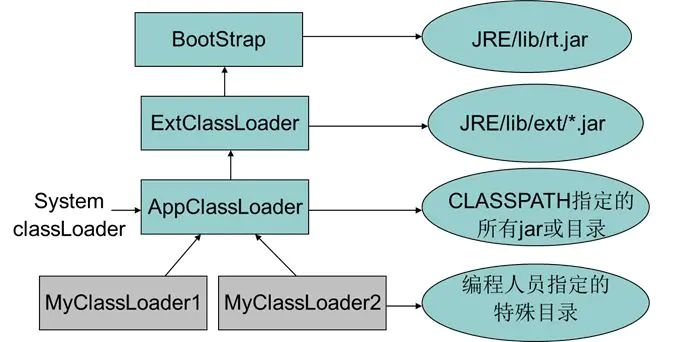
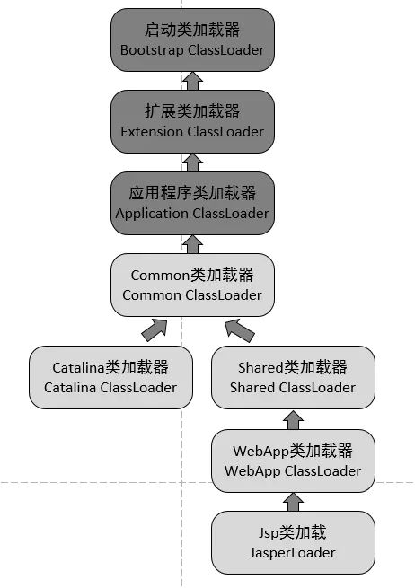

# Tomcat

org.apache.catalina.startup.Bootstrap#initClassLoaders
这个方法有初始化类加载器

https://blog.csdn.net/xyw591238/article/details/51900275
java 的 AccessController.doPrivileged使用

运行这个server类.注意这里要用上之前的my.policy文件 
在vm参数中写上这样的: 
-Djava.security.manager   
-Djava.security.policy=/home/h/my.policy  
运行,结果是 
TestService has permission 
在配置文件my.policy中我们没有允许server去读取/1.txt,但是现在却可以正常访问.这个就是 AccessController.doPrivileged的作用.

这个很重要 加载特定路径下的jar
hotswap

"${catalina.base}/lib","${catalina.base}/lib/*.jar","${catalina.home}/lib","${catalina.home}/lib/*.jar"

tomcat
自定义类加载器
jsp
common

    ClassLoader commonLoader = null;
    ClassLoader catalinaLoader = null;
    ClassLoader sharedLoader = null;

    this.commonLoader = this.createClassLoader("common", (ClassLoader)null);
    if (this.commonLoader == null) {
        this.commonLoader = this.getClass().getClassLoader();
    }

    this.catalinaLoader = this.createClassLoader("server", this.commonLoader);
    this.sharedLoader = this.createClassLoader("shared", this.commonLoader);

ReentrantLock
多次lock
多次unlpck

tryLock

r2dbc springdata

ForkJoinTask
RecursiveTask

ForkJoinPool

java.util.concurrent.ForkJoinPool#submit(java.util.concurrent.ForkJoinTask<T>)

java.util.concurrent.RecursiveTask#compute
	java.util.concurrent.ForkJoinTask#get()

recursive 递归的

各平台安卓输入法
https://www.cnblogs.com/lvkun/archive/2012/12/27/open-source-input-method.html
rime 中州韻輸入法引擎
https://github.com/osfans/trime

https://www.zhihu.com/column/p/20661774

章灏
地图
openGL

java io -- FilterInputStream 与 装饰者模式

Iterator remove()
https://blog.csdn.net/lxh123456789asd/article/details/80248418


https://blog.csdn.net/f641385712/article/details/81880711
最后
比如对于要保存的key，k1和k2，当且仅当k1== k2的时候，IdentityHashMap才会相等，而对于HashMap来说，相等的条件则是：对比两个key的hashCode等
IdentityHashMap不是Map的通用实现，它有意违反了Map的常规协定。并且IdentityHashMap允许key和value都为null。
同HashMap，IdentityHashMap也是无序的，并且该类不是线程安全的，如果要使之线程安全，可以调用Collections.synchronizedMap(new IdentityHashMap(…))方法来实现。
https://blog.csdn.net/f641385712/article/details/81880711

CompletionService与ExecutorService类似都可以用来执行线程池的任务，ExecutorService继承了Executor接口，而CompletionService则是一个接口，那么为什么CompletionService不直接继承Executor接口呢？主要是Executor的特性决定的，Executor框架不能完全保证任务执行的异步性，那就是如果需要实现任务（task）的异步性，只要为每个task创建一个线程就实现了任务的异步性。代码往往包含new Thread(task).start()。这种方式的问题在于，它没有限制可创建线程的数量（在ExecutorService可以限制），不过，这样最大的问题是在高并发的情况下，不断创建线程异步执行任务将会极大增大线程创建的开销、造成极大的资源消耗和影响系统的稳定性。另外，Executor框架还支持同步任务的执行，就是在execute方法中调用提交任务的run()方法就属于同步调用。
一般情况下，如果需要判断任务是否完成，思路是得到Future列表的每个Future，然后反复调用其get方法，并将timeout参数设为0，从而通过轮询的方式判断任务是否完成。为了更精确实现任务的异步执行以及更简便的完成任务的异步执行，可以使用CompletionService。
https://blog.csdn.net/qq_36898043/article/details/79733124

ArrayBlockingQueue

ConcurrentSkipListMap 跳表

全國銀行間同業拆借中心（China Foreign Exchange Trade System (CFETS)
ＣＩＦ（Ｃｕｓｔｏｍｅｒ Ｉｎｆｏｒｍａｔｉｏｎ Ｆｉｌｅ，客户信息文件）
https://blog.csdn.net/csdnd2014061810/article/details/100489648

https://blog.csdn.net/weixin_42800008/article/details/82148346

sofastack
单元化

spring源码
从bean元素着手

getBean

xml定义bean

spring使用DefaultSingletonBeanRegistry来本地缓存来保存创建过的对象。
https://blog.csdn.net/hotmocha/article/details/72935227
private final Map<String, Object> singletonObjects = new ConcurrentHashMap<String, Object>(256);

org.springframework.beans.factory.support.DefaultSingletonBeanRegistry#containsSingleton断点

import java.util.ServiceLoader;

        ServiceLoader<MyPrinterAPI> printers = ServiceLoader.load(MyPrinterAPI.class);
//        System.out.println(printers);
        for (MyPrinterAPI printer : printers) {
            printer.sayHello("SPI");
        }
https://blog.csdn.net/lenfranky/article/details/95880981

自定义权限中心
crud

tomcat类加载机制
Tomcat的类加载机制违反了双亲委托原则，对于一些未加载的非基础类（Object,String等），各个web应用自己的类加载器（WebAppClassLoader）会优先加载，加载不到时再交给CommonClassLoader走双亲委托。对于标准类库中的类，会让系统类加载器加载，然后一直委托到启动类加载器，这个过程是没有违背双亲委派的。Tomcat的类加载机制启动类加载器（Bootstrap）和扩展类加载器（Extension ClassLoader），应用程序类加载器（Application ClassLoader），这三个类加载器默认的一致。CommonClassLoader、CatalinaClassLoader、SharedClassLoader和WebappClassLoader则是Tomcat自己定义的类加载器。

自己写tomcat
https://www.liaoxuefeng.com/wiki/1545956031987744

code repo
https://gitee.com/edidada/jerrymouse

对于Java后端开发的同学来说，Tomcat服务器肯定不陌生。开发Java Web App，最后通常都会部署到Tomcat这样的服务器上。

很多同学可能觉得开发Web App是比较容易的，开发Web服务器就比较困难了。实际上，虽然开发Web服务器的难度比开发Web App要高，但也不是高得特别离谱。

对于已经能熟练开发Web App的同学来说，要进一步提升自己的架构水平，不如自己动手，从零开始编写一个Tomcat服务器。

本教程的目标就是以Tomcat服务器为原型，专注于实现一个支持Servlet标准的Web服务器，即实现一个迷你版的Tomcat Server，我们把它命名为Jerrymouse Server，与Tomcat主要区别在于，它俩的图标有所不同：
Jerrymouse Server设计目标如下：

支持Servlet 6的大部分功能：
支持Servlet组件；
支持Filter组件；
支持Listener组件；
支持Sesssion（仅限Cookie模式）；
不支持JSP；
不支持async模式与WebSocket；
可部署一个标准的Web App；
不支持同时部署多个Web App；
不支持热部署。
我们会一步一步实现一个完整的Web Server，并在此基础上部署一个完整的Web应用程序。
https://github.com/michaelliao/jerrymouse


apache-tomcat-8.5.34-src
G:\tomcat8src\apache-tomcat-8.5.34-src

apache-tomcat-8.5.34-src.zip
#### Tomcat
servlet-api实现
arp nio
.bat .sh来启动java程序的，需要jre环境
自定义ClassLoader防止webapp跨应用访问class/jar文件
war文件解压到webapp下面
.conf配置项
servlet-api 设计与实现分离
Java EE
vs ide如何打包成msi等格式的安装包

## 版本更新记录

## 功能更新记录

## api doc
https://tomcat.apache.org/tomcat-10.0-doc/api/index.html

https://tomcat.apache.org/tomcat-9.0-doc/api/index.html

https://tomcat.apache.org/tomcat-8.5-doc/api/index.html

https://tomcat.apache.org/tomcat-7.0-doc/api/index.html

Tomcat是一个开源的Web应用服务器，使用Java编写。它是Apache软件基金会的一部分，旨在为Java Web应用程序提供一个容器。以下是Tomcat的Java API文档的链接：

- Tomcat 10: https://tomcat.apache.org/tomcat-10.0-doc/api/index.html
- Tomcat 9: https://tomcat.apache.org/tomcat-9.0-doc/api/index.html
- Tomcat 8: https://tomcat.apache.org/tomcat-8.5-doc/api/index.html
- Tomcat 7: https://tomcat.apache.org/tomcat-7.0-doc/api/index.html

以上链接分别是Tomcat的不同版本的Java API文档。您可以在这些文档中找到Tomcat API的类、接口、方法和字段等详细信息。这些文档非常有用，可以帮助您开发和调试Java Web应用程序，并使用Tomcat作为Web应用服务器。

在文档中，您可以通过输入关键字来搜索特定的类或方法。您也可以浏览Java类的层次结构，以查看每个类的详细信息。文档中的每个类都包含有其构造函数、方法和字段的详细描述，以及相关的代码示例和使用说明。

此外，Tomcat的Java API文档还包括一些其他的有用资源，例如：

- Servlet API文档：描述了Java Servlet API的类、接口和方法等详细信息。Servlet是Java Web应用程序的核心组件之一，它负责处理Web请求并生成响应。
- JSP API文档：描述了Java Server Pages（JSP）API的类、接口和方法等详细信息。JSP是一种动态Web页面技术，它允许在HTML页面中嵌入Java代码。
- WebSocket API文档：描述了Java WebSocket API的类、接口和方法等详细信息。WebSocket是一种用于实现双向通信的Web协议，它允许服务器和客户端之间进行实时通信。

这些文档都可以在Tomcat的Java API文档页面中找到。在阅读Tomcat的Java API文档时，建议您先了解Java编程语言和Web应用程序的基本概念和技术，以便更好地理解和应用这些API。


Tomcat 9的源码中包含多个类加载器，用于加载Tomcat本身和Web应用程序。这些类加载器的实现基于Java的ClassLoader类，但具有一些特定的功能和行为，以满足Tomcat的需求。以下是Tomcat 9源码中的一些类加载器：
1. CatalinaClassLoader（不存在 CatalinaClassLoaderFactory：这是Tomcat的主要类加载器，用于加载Tomcat的核心类和组件。它由BootstrapClassLoader、CommonClassLoader和CatalinaSharedClassLoader组成，可以加载多个类路径中的类。CatalinaClassLoader实现了类的隔离和防止冲突，确保每个Web应用程序都有独立的类加载器和类路径。
2. WebappClassLoaderBase：这是Web应用程序的类加载器，用于加载Web应用程序的所有类。它继承自ClassLoader类，支持从多个类路径中加载类。WebappClassLoaderBase实现了类的隔离和防止冲突，确保每个Web应用程序都有独立的类加载器和类路径。
3. ParallelWebappClassLoader：这是Web应用程序的类加载器，用于在多核CPU上并行加载类。它继承自WebappClassLoaderBase类，但使用了Java 7中新增的ClassLoader API，支持并行加载类。ParallelWebappClassLoader可以提高Web应用程序的启动速度和性能。
4. JreMemoryLeakPreventionListener.ClassLoaderLeakPreventionClassLoader：这是一个特殊的类加载器，用于防止JRE内存泄漏。在某些情况下，Java虚拟机会在应用程序关闭后仍然保留应用程序的类加载器，导致内存泄漏。JreMemoryLeakPreventionListener.ClassLoaderLeakPreventionClassLoader通过重载finalize()方法来解决这个问题，确保在应用程序关闭后释放类加载器。
以上是Tomcat 9源码中的一些类加载器。除了这些类加载器外，Tomcat 9还提供了其他的类加载器和工具，例如VirtualWebappClassLoader、WebappClassLoader、JdbcLeakPrevention、ClassloaderLogManager等，用于实现更高级的类加载和管理功能。在编写Web应用程序或开发Tomcat插件时，您可以利用这些类加载器和工具来实现自己的需求。


### tomcat哪个版本支持nio

Tomcat 从版本 6.0 开始支持 NIO（New I/O）模式，但要使用 NIO，需要将 Connector 的 protocol 属性设置为 "org.apache.coyote.http11.Http11NioProtocol"。

在 Tomcat 6.0 中，NIO 是一个可选的协议，需要手动配置。在 Tomcat 7.0 中，NIO 成为了默认的协议，可以通过配置文件进行启用和禁用。
如果您需要使用 NIO，建议使用 Tomcat 7.0 或更高版本，以获得更好的性能和可靠性。此外，还要注意，使用 NIO 需要注意线程安全和内存管理等问题，需要仔细评估和调整系统配置和代码实现。

tomcat 8配置文件设置线程池
在 Tomcat 8 中，可以通过配置文件设置线程池。Tomcat 8 默认使用的线程池是 org.apache.tomcat.util.threads.ThreadPoolExecutor，但您可以根据需要进行自定义配置。以下是一些示例配置：
使用默认线程池
```xml
<Connector port="8080" protocol="HTTP/1.1" 
           connectionTimeout="20000" 
           redirectPort="8443" />
```
自定义线程池
```xml
<Connector port="8080" protocol="HTTP/1.1"
           connectionTimeout="20000"
           redirectPort="8443"
           executor="myThreadPool" />

<Executor name="myThreadPool" 
          namePrefix="catalina-exec-" 
          maxThreads="1000" 
          minSpareThreads="50" 
          maxIdleTime="60000" 
          prestartminSpareThreads="true" />
```

Tomcat 使用的线程池类是 org.apache.tomcat.util.threads.ThreadPoolExecutor。

该类实现了 java.util.concurrent.Executor 接口，可以被用于执行异步任务。

ThreadPoolExecutor 类继承自 java.util.concurrent.ThreadPoolExecutor，并添加了一些 Tomcat 特有的功能，例如：

可以设置线程池的名称，方便调试和监控。
可以设置线程池的最大线程数、核心线程数、线程池队列等参数。
可以设置线程池的拒绝策略，当线程池已经满载但又有新的任务需要执行时，可以根据设置的拒绝策略来处理这些任务。
Tomcat 中的线程池类通常会在 org.apache.catalina.core.StandardThreadExecutor 类中进行配置和使用。在该类中，会创建一个 ThreadPoolExecutor 实例，并将其用于执行异步任务。

值得注意的是，Tomcat 9.x 版本中的线程池类已经发生了变化，具体实现可以查看 org.apache.tomcat.util.threads.ThreadPoolExecutor 和 org.apache.tomcat.util.threads.ThreadPoolExecutor 类的源码实现。

Coyote的AbstractProcessor类如何处理http body

Coyote是Tomcat中处理HTTP请求的核心组件，而AbstractProcessor是Coyote处理请求的核心类之一，主要负责解析HTTP请求头和请求体，并将其封装成Request对象，传递给Tomcat中的其他组件进行处理。
在AbstractProcessor中，处理HTTP请求体的方法为parseRequest()，该方法通过获取Content-Length请求头判断请求体的长度，然后根据Content-Type请求头决定请求体的数据格式（如application/x-www-form-urlencoded、multipart/form-data等），最终将请求体中的数据解析并封装到Request对象中。具体实现细节可以参考AbstractProcessor类的源码。


servlet 单例多线程

servlet类 不能有经常更改的属性

因为servlet不是线程安全的


tomcat 有线程池


tomcat netty实现http协议 server端 对比

http://openejb.apache.org/latest/examples/
http://tomee.apache.org/jakartaee-8.0/javadoc/


Tomcat双亲委派模型 重点 类加载器 需要整理进anki
https://zhuanlan.zhihu.com/p/347776927


我想，在研究tomcat 类加载之前，我们复习一下或者说巩固一下java 默认的类加载器。楼主以前对类加载也是懵懵懂懂，借此机会，也好好复习一下。楼主翻开了神书《深入理解Java虚拟机》第二版，p227, 关于类加载器的部分。请看：

1. 什么是类加载机制？
代码编译的结果从本地机器码转变成字节码，是存储格式的一小步，却是编程语言发展的一大步。
Java虚拟机把描述类的数据从Class文件加载进内存，并对数据进行校验，转换解析和初始化，最终形成可以呗虚拟机直接使用的Java类型，这就是虚拟机的类加载机制。
虚拟机设计团队把类加载阶段中的“通过一个类的全限定名来获取描述此类的二进制字节流”这个动作放到Java虚拟机外部去实现，以便让应用程序自己决定如何去获取所需要的类。实现这动作的代码模块成为“类加载器”。
类与类加载器的关系

类加载器虽然只用于实现类的加载动作，但它在Java程序中起到的作用却远远不限于类加载阶段。对于任意一个类，都需要由加载他的类加载器和这个类本身一同确立其在Java虚拟机中的唯一性，每一个类加载器，都拥有一个独立的类命名空间。这句话可以表达的更通俗一些：比较两个类是否“相等”，只有在这两个类是由同一个类加载器加载的前提下才有意义，否则，即使这两个类来自同一个Class文件，被同一个虚拟机加载，只要加载他们的类加载器不同，那这个两个类就必定不相等。
2. 什么是双亲委任模型
从Java虚拟机的角度来说，只存在两种不同类加载器：一种是启动类加载器(Bootstrap ClassLoader)，这个类加载器使用C++语言实现（只限HotSpot），是虚拟机自身的一部分；另一种就是所有其他的类加载器，这些类加载器都由Java语言实现，独立于虚拟机外部，并且全都继承自抽象类java.lang.ClassLoader.
从Java开发人员的角度来看，类加载还可以划分的更细致一些，绝大部分Java程序员都会使用以下3种系统提供的类加载器：
启动类加载器（Bootstrap ClassLoader）：这个类加载器复杂将存放在 JAVA_HOME/lib 目录中的，或者被-Xbootclasspath 参数所指定的路径种的，并且是虚拟机识别的（仅按照文件名识别，如rt.jar，名字不符合的类库即使放在lib目录下也不会重载）。
扩展类加载器（Extension ClassLoader）：这个类加载器由sun.misc.Launcher$ExtClassLoader实现，它负责夹杂JAVA_HOME/lib/ext 目录下的，或者被java.ext.dirs 系统变量所指定的路径种的所有类库。开发者可以直接使用扩展类加载器。
应用程序类加载器（Application ClassLoader）：这个类加载器由sun.misc.Launcher$AppClassLoader 实现。由于这个类加载器是ClassLoader 种的getSystemClassLoader方法的返回值，所以也成为系统类加载器。它负责加载用户类路径（ClassPath）上所指定的类库。开发者可以直接使用这个类加载器，如果应用中没有定义过自己的类加载器，一般情况下这个就是程序中默认的类加载器。
这些类加载器之间的关系一般如下图所示：



Tomcat是个web容器， 那么它要解决什么问题：
一个web容器可能需要部署两个应用程序，不同的应用程序可能会依赖同一个第三方类库的不同版本，不能要求同一个类库在同一个服务器只有一份，因此要保证每个应用程序的类库都是独立的，保证相互隔离。
部署在同一个web容器中相同的类库相同的版本可以共享。否则，如果服务器有10个应用程序，那么要有10份相同的类库加载进虚拟机，这是扯淡的。
web容器也有自己依赖的类库，不能于应用程序的类库混淆。基于安全考虑，应该让容器的类库和程序的类库隔离开来。
web容器要支持jsp的修改，我们知道，jsp 文件最终也是要编译成class文件才能在虚拟机中运行，但程序运行后修改jsp已经是司空见惯的事情，否则要你何用？ 所以，web容器需要支持 jsp 修改后不用重启。



[Tomcat config](https://www.cnblogs.com/chengssblog/p/6635211.html)

[写一个迷你版的Tomcat](https://www.jianshu.com/p/dce1ee01fb90)

Servlet如何处理
社区下一步发展方向


## tomcat 9如何处理session？
Tomcat 9使用Session来跟踪用户的状态和数据。在Tomcat 9中，Session是一个接口，它定义了访问和管理会话数据的方法。Tomcat 9通过多种方式实现Session，包括内存、文件、数据库和分布式存储等。以下是Tomcat 9如何处理Session的概述：

1. 内存Session：Tomcat 9默认使用内存存储Session。在内存中创建Session对象，并将其与一个唯一的Session ID关联。Session的数据存储在内存中，并在Session超时或无效时被删除。

2. 文件Session：Tomcat 9还支持使用文件存储Session。在文件系统中创建Session对象，并将其与一个唯一的Session ID关联。Session的数据存储在文件中，并在Session超时或无效时被删除。

3. 数据库Session：Tomcat 9支持使用数据库存储Session。在数据库中创建Session对象，并将其与一个唯一的Session ID关联。Session的数据存储在数据库中，并在Session超时或无效时被删除。Tomcat 9支持多种数据库，包括MySQL、Oracle、PostgreSQL等。

4. 分布式Session：Tomcat 9支持使用分布式存储Session。在分布式环境中，Session的数据存储在多个物理节点上，并在节点之间同步。Tomcat 9通过使用多种技术实现分布式Session，包括基于JDBC的存储、基于Redis的存储、基于Hazelcast的存储等。

无论使用哪种方式存储Session，Tomcat 9都提供了一些配置选项和API来管理Session。例如，可以使用session-timeout属性设置Session的超时时间，可以使用Session API来获取、设置和删除Session中的数据等。在Web应用程序中，可以使用HttpServletRequest和HttpSession API来访问和管理Session。例如，可以使用request.getSession()方法获取Session对象，并使用Session API来获取、设置和删除Session中的数据。

需要注意的是，Session数据通常包含敏感信息，例如用户的登录凭证、购物车信息等。为了保护Session数据的安全性，建议使用HTTPS协议来加密Session通信，并尽可能使用安全的Session ID生成算法，以避免Session ID的泄露和伪造。此外，还可以使用Session Fixation攻击的防范策略，例如在用户登录时随机生成Session ID，或在每次请求时使用不同的Session ID来防止Session Fixation攻击。

## tomcat 9如何实现https？


Tomcat 9可以通过以下步骤来实现HTTPS：

1. 获取SSL证书：HTTPS需要使用SSL/TLS协议进行加密和身份验证。您需要从可信的证书颁发机构（CA）或自签名证书创建工具中获取SSL证书。可以使用keytool工具生成自签名证书。

2. 配置Tomcat 9：在Tomcat 9的配置文件server.xml中，您需要配置SSL协议和证书。在<Connector>元素中添加以下属性：

   - protocol="org.apache.coyote.http11.Http11NioProtocol"：指定SSL协议为NIO协议。

   - SSLEnabled="true"：开启SSL功能。

   - keystoreFile="证书文件路径"：指定SSL证书的路径。

   - keystorePass="证书密码"：指定SSL证书的密码。

   - keyAlias="证书别名"：指定SSL证书的别名。

以下是一个示例配置：

```xml
<Connector port="443" protocol="org.apache.coyote.http11.Http11NioProtocol"
           maxThreads="150" SSLEnabled="true" scheme="https" secure="true"
           clientAuth="false" sslProtocol="TLS"
           keystoreFile="证书文件路径" keystorePass="证书密码" keyAlias="证书别名" />
```

3. 重启Tomcat 9：重启Tomcat 9以使配置生效。

4. 测试HTTPS：在Web浏览器中输入HTTPS网址（例如https://localhost），如果SSL证书有效，则应该能够安全地连接到Tomcat 9服务器。

需要注意的是，HTTPS协议可以保护数据的机密性和完整性，但并不能保证数据的真实性和可信性。为了确保HTTPS通信的安全性，您还应该遵循一些最佳实践，例如使用密码强度较高的SSL证书、使用HTTPS Strict Transport Security（HSTS）协议、使用双因素身份验证等。另外，由于SSL证书可能会过期、被吊销或被伪造，因此您还应该定期更新证书并进行审计和监控。


BEA WebLogic Sever：是一款十分强大的服务器软件，配置比较简单，而且对JSP的扩展十分强大，附带了数据库的JDBC驱动程序，支持JHTML，是目前市场占有率最高的服务器，目前最新版本是6.1版，价格很贵，不过嘿嘿.....有破解版哦：）
IBM WebSphere Application Server:是IBM的产品，功能很强大，而且有IBM的开发工具相配套，开发Web程序十分方便，不过价格上万元。


## tomcat打破双亲委派模型


Tomcat 9中与Session相关的类、接口和枚举主要有以下几个：
1. HttpSession：这是一个接口，它定义了访问和管理Session数据的方法。例如，getAttribute()方法用于获取Session中的属性值，setAttribute()方法用于设置Session中的属性值，invalidate()方法用于使Session无效。
2. HttpServletRequest：这是一个接口，它定义了访问和管理HTTP请求数据的方法。例如，getSession()方法用于获取Session对象，getRequestedSessionId()方法用于获取请求中包含的Session ID。
3. HttpServletResponse：这是一个接口，它定义了访问和管理HTTP响应数据的方法。例如，addCookie()方法用于添加Cookie，sendRedirect()方法用于重定向HTTP请求。
4. Session：这是一个接口，它继承自HttpSession接口，增加了一些额外的方法，例如getId()方法用于获取Session ID，getCreationTime()方法用于获取Session创建时间。
5. StandardSession：这是一个类，它实现了Session接口。它可以存储Session数据，并在Session超时或无效时自动删除数据。
6. SessionIdGenerator：这是一个接口，它定义了生成Session ID的方法。Tomcat 9中提供了多种Session ID生成器实现，例如StandardSessionIdGenerator、SecureRandomSessionIdGenerator等。
7. SessionCookieConfig：这是一个接口，它定义了Session ID Cookie的配置选项。例如，setMaxAge()方法用于设置Cookie的最大存活时间，setHttpOnly()方法用于设置Cookie是否只能通过HTTP访问。
8. SessionTrackingMode：这是一个枚举，它定义了Session跟踪模式。Tomcat 9支持多种Session跟踪模式，包括COOKIE、URL和SSL等。
9. SessionManager：这是一个接口，它定义了Session管理的方法。Tomcat 9中提供了多种Session管理器实现，例如StandardManager、PersistManager、DeltaManager等。
以上是Tomcat 9中与Session相关的主要类、接口和枚举。在编写Web应用程序或开发Tomcat插件时，您可以利用这些类、接口和枚举来访问和管理Session数据，实现自己的需求。


Spring Session Redis是一个开源的Spring Session模块，它使用Redis作为Session存储后端，为Spring应用程序提供了分布式Session管理的功能。在使用Spring Session Redis时，它会拦截Tomcat的Session请求，并将Session数据存储到Redis中。
具体地说，Spring Session Redis使用一个名为SessionRepositoryFilter的Servlet过滤器来拦截Tomcat的Session请求，并将请求重定向到一个名为SessionRepository的Session仓库中。SessionRepository是一个接口，它定义了Session数据的存储、管理和访问方法。Spring Session Redis提供了一个名为RedisOperationsSessionRepository的SessionRepository实现，它使用RedisTemplate来访问Redis，并将Session数据存储为JSON格式。
当Tomcat收到一个Session请求时，SessionRepositoryFilter会检查请求中是否包含Session ID。如果包含，则SessionRepositoryFilter会使用SessionRepository从Redis中获取Session数据，并将其绑定到HttpServletRequest对象上。如果不包含，则SessionRepositoryFilter会创建一个新的Session，并将其存储到Redis中，并将Session ID添加到响应中的Cookie或URL参数中（根据配置的Session跟踪模式而定）。
通过这种方式，Spring Session Redis实现了对Tomcat的Session请求的拦截和管理。它将Session数据存储到Redis中，从而实现了Session的分布式管理和共享。在使用Spring Session Redis时，您可以像使用普通Session一样访问和管理Session数据，而无需关心Session数据的存储和同步问题。同时，Spring Session Redis还提供了一些高级功能，例如Session超时和失效处理、Session ID生成和管理、Session事件监听等。


org.springframework.session.web.http.SessionRepositoryFilter
继承自servlet的filter


org.apache.catalina.connector.RequestFacade


org.apache.catalina.core.ApplicationFilterChain

org.apache.tomcat.util.net.SocketProcessorBase 实现Runnable接口

在apr模式下，Tomcat将以JNI(Java Native Interface)的形式调用Apache HTTP服务器的核心动态链接库来处理文件读取或网络传输操作，从而大大提高Tomcat对静态文件的处理性能。Tomcat apr是在Tomcat上运行高并发应用的首选模式。
https://blog.csdn.net/weixin_39778417/article/details/88946533