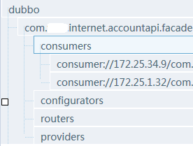

# zookeeper


zkCli.cmd
在Windows环境下，您可以使用ZooKeeper的命令行界面或API查看存储在ZooKeeper中的数据。以下是一些常用的命令：

查看数据：ls， ls2
获取数据：get
创建节点：create
删除节点：delete
更新节点：set

zab协议

ZooKeeper’s atomic broadcast protocol: Theory and practice


AP?
ZooKeeper是一个分布式协调服务，它既不是CP也不是AP，而是一种满足一致性和可用性的特殊类型的系统，通常被称为CA系统。
在CAP理论中，CP和AP是两个极端的选项。CP系统强调一致性，即在分区情况下保证数据一致性，但可能会牺牲可用性，因为在分区情况下无法提供服务。AP系统强调可用性，即在分区情况下保证数据可用性，但可能会牺牲一致性，因为在分区情况下无法保证数据一致性。
而ZooKeeper则是一种CA系统，它既要满足一致性，也要满足可用性。ZooKeeper通过在所有节点之间保持强一致性来实现一致性，同时通过在所有节点之间共享负载来实现高可用性。当一个节点发生故障时，ZooKeeper会自动将该节点的任务分配给其他节点，以确保系统的可用性。
需要注意的是，尽管ZooKeeper是一种CA系统，但它也有一些局限性。例如，在网络分区情况下，ZooKeeper可能会出现“脑裂”问题，即多个节点同时认为自己是主节点，导致数据不一致。因此，在使用ZooKeeper时需要特别注意网络环境和配置参数，以确保系统的稳定性和一致性。
一致性

zookeeper做dubbo的服务注册/发现，会出现40-60分钟(几十秒)的不可用


选举的时候，也只是服务上线不可用

服务信息在本地会做缓存


为什么不应该使用ZooKeeper做服务发现

http://dockone.io/article/78


ZK实现分布式锁
基于zookeeper临时有序节点可以实现的分布式锁。
大致思想即为：每个客户端对某个方法加锁时，在zookeeper上的与该方法对应的指定节点的目录下，生成一个唯一的瞬时有序节点。 判断是否获取锁的方式很简单，只需要判断有序节点中序号最小的一个。 当释放锁的时候，只需将这个瞬时节点删除即可。同时，其可以避免服务宕机导致的锁无法释放，而产生的死锁问题。

可以直接使用zookeeper第三方库Curator客户端，这个客户端中封装了一个可重入的锁服务。

Curator提供的InterProcessMutex是分布式锁的实现。acquire方法用户获取锁，release方法用于释放锁。


非阻塞的，无论成功还是失败都直接返回


源码是用什么语言写的？
分别有什么功能，分布式，实现了Paxos？
raft？


自己写zk

ping
pong

zk maillist
edidada@outlook.com

[zk github repo](https://github.com/apache/zookeeper)

源代码是由maven组织的
java开发的

October, 2008: release 3.0.0 available


zk在dubbo hadoop中的应用


ZooKeeper是一个开源的分布式协调服务，由雅虎创建，是Google Chubby的开源实现。分布式应用程序可以基于ZooKeeper实现诸如数据发布/订阅、负载均衡、命名服务、分布式协调/通知、集群管理、Master选举、分布式锁和分布式队列等功能。


https://blog.csdn.net/shmily_lsl/article/details/81479158


书籍

zab协议

zookeeper入门系列-理论基础-zab协议
https://blog.csdn.net/liweisnake/article/details/70045164

ZooKeeper’s atomic broadcast protocol: Theory and practice

Andr ́e Medeiros March 20, 2012


zk上如何看到dubbo库中请求zk server的记录的

zkCli 操作dubbo
https://blog.csdn.net/keep_learn/article/details/71090259

[zookeeperInternals](http://zookeeper.apache.org/doc/r3.5.0-alpha/zookeeperInternals.html)

[zk操作](https://blog.csdn.net/feixiang2039/article/details/79810102#zookeeper-cli)

Zookeeper是Apacahe Hadoop的子项目，是一个树型的目录服务，支持变更推送

zkCli -server host:port
连接远程zk

dubbo的在向zookeeper注册服务时，放了些什么数据进去？
dubbo的负载均衡是dubbo自己做的，还是zookeeper做的？



dubbo在zookeeper存储的格式
1、根节点：dubbo
2、一级子节点：提供服务的服务名
3、二级子节点：固定的四个子节点：分别为：consumers、configurators、routers、providers

dubbo的负载均衡是dubbo自己做的，还是zookeeper做的
Dubbbo自己做的

[dubbo在zookeeper存储的格式](https://blog.csdn.net/duzm200542901104/article/details/80949282)

[Zookeeper 保存的Dubbo信息详解](https://blog.csdn.net/robin90814/article/details/86523502)


Consumers:
/dubbo/com.example.dubbo.service.CityService/consumers/consumer://192.168.198.1/com.example.dubbo.service.CityService?application=consumer&category=consumers&check=false&dubbo=2.5.3&interface=com.example.dubbo.service.CityService&methods=findCityByName&pid=1976&side=consumer&timestamp=1547599528693

?

application：应用名

category：类型

check：检查

dubbo：dubbo版本

interface：接口名称

methods：接口方法名

pid：进程号

side：消费端或服务端

timestamp：时间戳

Providers
/dubbo/com.example.dubbo.service.CityService/providers/dubbo://192.168.198.1:20880/com.example.dubbo.service.CityService?anyhost=true&application=provider&dubbo=2.5.3&interface=com.example.dubbo.service.CityService&methods=findCityByName&pid=17608&side=provider&timestamp=1547599515151

anyhost：

application：应用名

dubbo：dubbo版本

interface：接口名称

methods：接口方法名

pid：进程号

side：消费端或服务端

timestamp：时间戳


Routers
配置路由规则

/dubbo/com.example.dubbo.service.CityService/routers/route://0.0.0.0/com.example.dubbo.service.CityService?category=routers&dynamic=false&enabled=true&force=false&name=cityservice&priority=10&router=condition&rule=method+=+findCityByName+&+consumer.host+=+192.168.198.1+=>+provider.port+=+20881+&+provider.port+!=+20880&runtime=false

?

Category：类型

Dynamic：是否动态调整，false表示需要手动调整

Enabled：是否启动

Force：是否强制，false表示，如果没有匹配到则调用其它可调用的服务

Name：路由名称

Priority：优先级

Router：condition符合条件则路由

Rule：路由规则

访问控制

禁止

/dubbo/com.example.dubbo.service.CityService/routers/route://0.0.0.0/com.example.dubbo.service.CityService?category=routers&dynamic=false&enabled=true&force=true&name=com.example.dubbo.service.CityService+blackwhitelist&priority=0&router=condition&rule=consumer.host=192.168.198.1=>false&runtime=false

?

Category：类型

Dynamic：是否动态调整，false表示需要手动调整

Enabled：是否启动

Force：是否强制

Name：接口名称

Priority：优先级

Router：condition符合条件则路由

Rule：路由规则IP为192.168.198.1的消费者禁止访问


Configrators
负载均衡
/dubbo/com.example.dubbo.service.CityService/configurators/override://0.0.0.0/com.example.dubbo.service.CityService?category=configurators&dynamic=false&enabled=true&loadbalance=random


Category：类型
Dynamic：是否动态调整，false表示需要手动调整
Enabled：是否启动
Loadbalance：负载均衡策略

权重
/dubbo/com.example.dubbo.service.CityService/configurators/override://192.168.198.1:20880/com.example.dubbo.service.CityService?category=configurators&dynamic=false&enabled=true&weight=200
Category：类型
Dynamic：是否动态调整，false表示需要手动调整
Enabled：是否启动
Weight：权重


zk clinet Watch机制

推送

重Leader


zookeeper

client实现


Zookeeper原生Java API、ZKClient和Apache Curator 区别对比
https://blog.csdn.net/l18848956739/article/details/99693299

1、zookeeper原生Java API
Zookeeper客户端提供了基本的操作，比如，创建会话、创建节点、读取节点、更新数据、删除节点和检查节点是否存在等。但对于开发人员来说，Zookeeper提供的基本操纵还是有一些不足之处。

Zookeeper API不足之处
（1）Watcher注册是一次性的，每次触发之后都需要重新进行注册；
（2）Session超时之后没有实现重连机制；
（3）异常处理繁琐，Zookeeper提供了很多异常，对于开发人员来说可能根本不知道该如何处理这些异常信息；
（4）只提供了简单的byte[]数组的接口，没有提供针对对象级别的序列化；
（5）创建节点时如果节点存在抛出异常，需要自行检查节点是否存在；
（6）删除节点无法实现级联删除；
基于以上原因，直接使用Zookeeper原生API的人并不多。

2、ZkClient

ZkClient是一个开源客户端，在Zookeeper原生API接口的基础上进行了包装，更便于开发人员使用。解决如下问题：

1）session会话超时重连
2）解决Watcher反复注册
3）简化API开发
虽然 ZkClient 对原生 API 进行了封装，但也有它自身的不足之处：

几乎没有参考文档；
异常处理简化（抛出RuntimeException）；
重试机制比较难用；
没有提供各种使用场景的实现；


Apache Curator
Curator是Netflix公司开源的一套Zookeeper客户端框架，和ZkClient一样，解决了非常底层的细节开发工作，包括连接重连、反复注册Watcher和NodeExistsException异常等。目前已经成为 Apache 的顶级项目。

其特点：

Apache 的开源项目
解决Watch注册一次就会失效的问题
提供一套Fluent风格的 API 更加简单易用
提供更多解决方案并且实现简单，例如：分布式锁
提供常用的ZooKeeper工具类
编程风格更舒服
除此之外，Curator中还提供了Zookeeper各种应用场景（Recipe，如共享锁服务、Master选举机制和分布式计算器等）的抽象封装。


```shell
<dependency>
    <groupId>com.101tec</groupId>
    <artifactId>zkclient</artifactId>
    <version>0.10</version>
</dependency>
<dependency>
    <groupId>org.apache.zookeeper</groupId>
    <artifactId>zookeeper</artifactId>
    <version>3.4.14</version>
    <type>pom</type>
</dependency>
```


```xml
        <dependency>
            <groupId>org.apache.curator</groupId>
            <artifactId>curator-framework</artifactId>
            <version>2.8.0</version>
        </dependency>
        <dependency>
            <groupId>org.apache.curator</groupId>
            <artifactId>curator-recipes</artifactId>
            <version>2.8.0</version>
        </dependency>
```


kafka也用zk

kafaka集群的 broker，和 Consumer 都需要连接 Zookeeper。
Producer 直接连接 Broker。
https://www.jianshu.com/p/a036405f989c


Zookeeper夺命连环9问
https://zhuanlan.zhihu.com/p/348753812
zxid是全局事务id，每次选举或者事务都会自增。myid是配置文件里写的那个id。相当于节点的唯一标识
zookeeper火的时候raft还没出
zookeeper的算法有自己的名字，叫zab，但是跟raft的确很像：选主用lamport时钟，决策用2pc，防脑裂用epoch。大思路都差不多

AP

一致性

zookeeper做dubbo的服务注册/发现，会出现40-60分钟(几十秒)的不可用

hbase kafka

竞品：etcd nacos


主从分离的

单主？
ZooKeeper是一个分布式协调服务，它既不是CP也不是AP，而是一种满足一致性和可用性的特殊类型的系统，通常被称为CA系统。
在CAP理论中，CP和AP是两个极端的选项。CP系统强调一致性，即在分区情况下保证数据一致性，但可能会牺牲可用性，因为在分区情况下无法提供服务。AP系统强调可用性，即在分区情况下保证数据可用性，但可能会牺牲一致性，因为在分区情况下无法保证数据一致性。
而ZooKeeper则是一种CA系统，它既要满足一致性，也要满足可用性。ZooKeeper通过在所有节点之间保持强一致性来实现一致性，同时通过在所有节点之间共享负载来实现高可用性。当一个节点发生故障时，ZooKeeper会自动将该节点的任务分配给其他节点，以确保系统的可用性。
需要注意的是，尽管ZooKeeper是一种CA系统，但它也有一些局限性。例如，在网络分区情况下，ZooKeeper可能会出现“脑裂”问题，即多个节点同时认为自己是主节点，导致数据不一致。因此，在使用ZooKeeper时需要特别注意网络环境和配置参数，以确保系统的稳定性和一致性。


选举的时候，也只是服务上线不可用

Dubbo customer有缓存的 服务信息在本地会做缓存


为什么不应该使用ZooKeeper做服务发现

http://dockone.io/article/78


ZK实现分布式锁
基于zookeeper临时有序节点可以实现的分布式锁。
大致思想即为：每个客户端对某个方法加锁时，在zookeeper上的与该方法对应的指定节点的目录下，生成一个唯一的瞬时有序节点。 判断是否获取锁的方式很简单，只需要判断有序节点中序号最小的一个。 当释放锁的时候，只需将这个瞬时节点删除即可。同时，其可以避免服务宕机导致的锁无法释放，而产生的死锁问题。
可以直接使用zookeeper第三方库Curator客户端，这个客户端中封装了一个可重入的锁服务。
Curator提供的InterProcessMutex是分布式锁的实现。acquire方法用户获取锁，release方法用于释放锁。

```java
CuratorFramework client = CuratorFrameworkFactory.newClient("localhost:2181", new RetryNTimes(3, 1000));
client.start();

InterProcessMutex lock = new InterProcessMutex(client, "/lock");
try {
    // 获取锁
    lock.acquire();
    // 执行业务逻辑
    // ...
} finally {
    // 释放锁
    lock.release();
}
```


非阻塞的，无论成功还是失败都直接返回


源码是用什么语言写的？
分别有什么功能，分布式，实现了Paxos？
raft？


自己写zk


ping
pong

zk maillist
edidada@outlook.com


maven组织的
java开发的

October, 2008: release 3.0.0 available


zk在dubbo hadoop中的应用


ZooKeeper是一个开源的分布式协调服务，由雅虎创建，是Google Chubby的开源实现。分布式应用程序可以基于ZooKeeper实现诸如数据发布/订阅、负载均衡、命名服务、分布式协调/通知、集群管理、Master选举、分布式锁和分布式队列等功能。


https://blog.csdn.net/shmily_lsl/article/details/81479158


书籍

zab协议


https://blog.csdn.net/liweisnake/article/details/70045164


ZooKeeper’s atomic broadcast protocol: Theory and practice

Andr ́e Medeiros March 20, 2012


zk上如何看到dubbo库中请求zk server的记录的
如果你想查看Dubbo库中请求ZooKeeper服务器的记录，可以通过在ZooKeeper服务器上的日志文件中查找相关记录来实现。在ZooKeeper服务器的日志文件中，每一条记录都会包含请求的详细信息，例如请求的类型、请求的路径、请求的参数等。

ZooKeeper服务器的日志文件默认存储在ZooKeeper服务器的dataDir目录下，文件名为zookeeper.log。你可以通过查看这个文件中的内容来了解Dubbo库请求ZooKeeper服务器的详细信息。

另外，Dubbo库也提供了一些配置选项，可以用来控制Dubbo库与ZooKeeper服务器之间的交互。例如，你可以通过设置dubbo.registry.check=false来禁用Dubbo库与ZooKeeper服务器之间的心跳检测。在Dubbo库与ZooKeeper服务器之间发生交互时，Dubbo库也会打印一些相关的日志记录，你可以通过查看这些日志记录来了解Dubbo库与ZooKeeper服务器之间的交互情况。

需要注意的是，ZooKeeper服务器的日志文件中可能包含大量的记录，因此在查找Dubbo库请求ZooKeeper服务器的记录时，你需要使用一些过滤工具，例如grep、awk等，来快速定位相关记录。
zkCli 操作dubbo
https://blog.csdn.net/keep_learn/article/details/71090259

[zookeeperInternals](http://zookeeper.apache.org/doc/r3.5.0-alpha/zookeeperInternals.html)

[zk操作](https://blog.csdn.net/feixiang2039/article/details/79810102#zookeeper-cli)

Zookeeper是Apacahe Hadoop的子项目，是一个树型的目录服务，支持变更推送

zkCli -server host:port
连接远程zk

dubbo的在向zookeeper注册服务时，放了些什么数据进去？ /dubbo /d../config /d.../provider 
dubbo的负载均衡是dubbo自己做的，还是zookeeper做的？dubbo自己做的


dubbo在zookeeper存储的格式
1、根节点：dubbo
2、一级子节点：提供服务的服务名
3、二级子节点：固定的四个子节点：分别为：consumers、configurators、routers、providers

dubbo的负载均衡是dubbo自己做的，还是zookeeper做的
Dubbbo自己做的

[dubbo在zookeeper存储的格式](https://blog.csdn.net/duzm200542901104/article/details/80949282)

[Zookeeper 保存的Dubbo信息详解](https://blog.csdn.net/robin90814/article/details/86523502)


Consumers:
/dubbo/com.example.dubbo.service.CityService/consumers/consumer://192.168.198.1/com.example.dubbo.service.CityService?application=consumer&category=consumers&check=false&dubbo=2.5.3&interface=com.example.dubbo.service.CityService&methods=findCityByName&pid=1976&side=consumer&timestamp=1547599528693

?

application：应用名
category：类型
check：检查
dubbo：dubbo版本
interface：接口名称
methods：接口方法名
pid：进程号
side：消费端或服务端
timestamp：时间戳
Providers
/dubbo/com.example.dubbo.service.CityService/providers/dubbo://192.168.198.1:20880/com.example.dubbo.service.CityService?anyhost=true&application=provider&dubbo=2.5.3&interface=com.example.dubbo.service.CityService&methods=findCityByName&pid=17608&side=provider&timestamp=1547599515151

anyhost：
application：应用名
dubbo：dubbo版本
interface：接口名称
methods：接口方法名
pid：进程号
side：消费端或服务端
timestamp：时间戳


Routers
配置路由规则

/dubbo/com.example.dubbo.service.CityService/routers/route://0.0.0.0/com.example.dubbo.service.CityService?category=routers&dynamic=false&enabled=true&force=false&name=cityservice&priority=10&router=condition&rule=method+=+findCityByName+&+consumer.host+=+192.168.198.1+=>+provider.port+=+20881+&+provider.port+!=+20880&runtime=false

?

Category：类型
Dynamic：是否动态调整，false表示需要手动调整
Enabled：是否启动
Force：是否强制，false表示，如果没有匹配到则调用其它可调用的服务
Name：路由名称
Priority：优先级
Router：condition符合条件则路由
Rule：路由规则
访问控制

禁止

/dubbo/com.example.dubbo.service.CityService/routers/route://0.0.0.0/com.example.dubbo.service.CityService?category=routers&dynamic=false&enabled=true&force=true&name=com.example.dubbo.service.CityService+blackwhitelist&priority=0&router=condition&rule=consumer.host=192.168.198.1=>false&runtime=false
?
Category：类型
Dynamic：是否动态调整，false表示需要手动调整
Enabled：是否启动
Force：是否强制
Name：接口名称
Priority：优先级
Router：condition符合条件则路由
Rule：路由规则IP为192.168.198.1的消费者禁止访问


Configrators
负载均衡
/dubbo/com.example.dubbo.service.CityService/configurators/override://0.0.0.0/com.example.dubbo.service.CityService?category=configurators&dynamic=false&enabled=true&loadbalance=random
Category：类型
Dynamic：是否动态调整，false表示需要手动调整
Enabled：是否启动
Loadbalance：负载均衡策略
权重
/dubbo/com.example.dubbo.service.CityService/configurators/override://192.168.198.1:20880/com.example.dubbo.service.CityService?category=configurators&dynamic=false&enabled=true&weight=200
Category：类型
Dynamic：是否动态调整，false表示需要手动调整
Enabled：是否启动
Weight：权重


zk clinet Watch机制

推送

重Leader


zookeeper

client实现


Zookeeper原生Java API、ZKClient和Apache Curator 区别对比
https://blog.csdn.net/l18848956739/article/details/99693299

1、zookeeper原生Java API
Zookeeper客户端提供了基本的操作，比如，创建会话、创建节点、读取节点、更新数据、删除节点和检查节点是否存在等。但对于开发人员来说，Zookeeper提供的基本操纵还是有一些不足之处。

Zookeeper API不足之处

（1）Watcher注册是一次性的，每次触发之后都需要重新进行注册；
（2）Session超时之后没有实现重连机制；
（3）异常处理繁琐，Zookeeper提供了很多异常，对于开发人员来说可能根本不知道该如何处理这些异常信息；
（4）只提供了简单的byte[]数组的接口，没有提供针对对象级别的序列化；
（5）创建节点时如果节点存在抛出异常，需要自行检查节点是否存在；
（6）删除节点无法实现级联删除；
基于以上原因，直接使用Zookeeper原生API的人并不多。

2、ZkClient

ZkClient是一个开源客户端，在Zookeeper原生API接口的基础上进行了包装，更便于开发人员使用。解决如下问题：

1）session会话超时重连
2）解决Watcher反复注册
3）简化API开发
虽然 ZkClient 对原生 API 进行了封装，但也有它自身的不足之处：

几乎没有参考文档；
异常处理简化（抛出RuntimeException）；
重试机制比较难用；
没有提供各种使用场景的实现；


Apache Curator
Curator是Netflix公司开源的一套Zookeeper客户端框架，和ZkClient一样，解决了非常底层的细节开发工作，包括连接重连、反复注册Watcher和NodeExistsException异常等。目前已经成为 Apache 的顶级项目。

其特点：

- Apache 的开源项目
- 解决Watch注册一次就会失效的问题
- 提供一套Fluent风格的 API 更加简单易用
- 提供更多解决方案并且实现简单，例如：分布式锁
- 提供常用的ZooKeeper工具类
- 编程风格更舒服
除此之外，Curator中还提供了Zookeeper各种应用场景（Recipe，如共享锁服务、Master选举机制和分布式计算器等）的抽象封装。


```shell
<dependency>
    <groupId>com.101tec</groupId>
    <artifactId>zkclient</artifactId>
    <version>0.10</version>
</dependency>
<dependency>
    <groupId>org.apache.zookeeper</groupId>
    <artifactId>zookeeper</artifactId>
    <version>3.4.14</version>
    <type>pom</type>
</dependency>
```


```xml
        <dependency>
            <groupId>org.apache.curator</groupId>
            <artifactId>curator-framework</artifactId>
            <version>2.8.0</version>
        </dependency>
        <dependency>
            <groupId>org.apache.curator</groupId>
            <artifactId>curator-recipes</artifactId>
            <version>2.8.0</version>
        </dependency>
```


