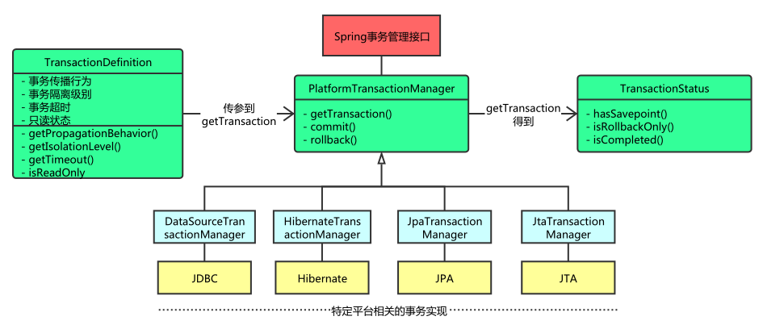

# jta

*JTA*，即Java Transaction API，*JTA*允许应用程序执行分布式事务处理——在两个或多个网络计算机资源上访问并且更新数据。JDBC驱动程序的*JTA*支持极大地增强了数据访问能力。

<dependency>
    <groupId>javax.transaction</groupId>
    <artifactId>jta</artifactId>
    <version>1.1</version>
</dependency>

https://blog.csdn.net/qingmuluoyang/article/details/82961801

https://blog.csdn.net/weixin_30409927/article/details/105438267

java.tranzaction.UserTransaction

javax.persistence.EntityManager
javax.persistence.EntityManagerFactory
javax.persistence.EntityTransaction
javax.persistence.Persistence

<dependency>
    <groupId>javax.persistence</groupId>
    <artifactId>javax.persistence-api</artifactId>
    <version>2.2</version>
</dependency>

<dependency>
    <groupId>javax.persistence</groupId>
    <artifactId>persistence-api</artifactId>
    <version>1.0.2</version>
</dependency>