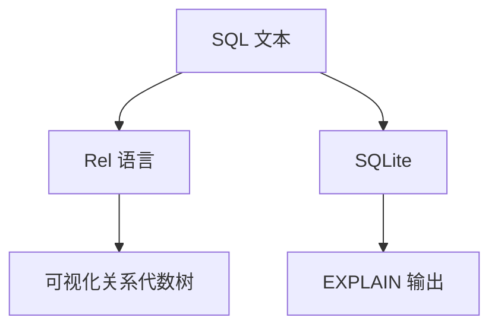
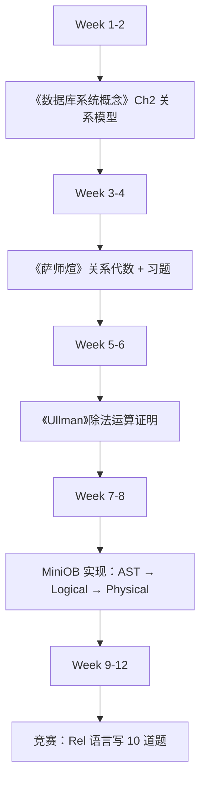

# 关系代数

[关系代数](https://www.cnblogs.com/wkfvawl/p/10596117.html)

### 关系代数网页内容整理（基于 https://www.cnblogs.com/wkfvawl/p/10596117.html）

以下是对指定网页“数据库——关系代数”的内容提取与结构化整理。网页主要聚焦关系代数的定义、基本操作（选择、投影、连接、除法等）、符号表示、示例（以学生-课程数据库为例）和综合应用。忽略了广告、作者个人信息和无关评论。结构按原文逻辑组织，便于阅读。

#### 关系代数的定义与基本操作
关系代数是数据库理论中的一种形式化查询语言，用于对关系数据库进行操作。其基本操作包括选择、投影、连接、除法等，配合笛卡尔积、并、差、交等操作，可实现复杂的查询。


#### 1. 选择（Selection）
定义：选择运算（又称限制）是从关系中选择满足给定条件的元组（行）。

符号表示：
- 运算符：`σ`
- 语法：`σ_条件(关系)`

示例：
- 查询信息系（IS系）全体学生：`σ_Sdept = 'IS'(Student)`
- 查询年龄小于20岁的学生：`σ_Sage < 20(Student)`
- 查询信息系且年龄小于20岁的学生：`σ_Sdept = 'IS' ∧ Sage < 20(Student)`

注：`∧` 表示逻辑与，`∨` 表示逻辑或。选择运算从行的角度进行。


#### 2. 投影（Projection）
定义：投影是从关系中选择若干属性列（列）组成新的关系，可能去除重复元组。

符号表示：
- 运算符：`π`
- 语法：`π_属性列表(关系)`

示例：
- 查询学生的姓名和所在系：`π_Sname, Sdept(Student)`
- 查询Student关系中都有哪些系：`π_Sdept(Student)`
- 查询CS系的学生姓名：`π_Sname(σ_Sdept='CS'(Student))`
- 查询没有选过课的学号：`π_Sno(Student) - π_Sno(SC)`
- 查询没有不及格的学号（正确做法）：`π_Sno(Student) - π_Sno(σ_Grade < 60(SC))`
- 查询未被选修的课号：`π_Cno(Course) - π_Cno(SC)`

注：`π_Sno(σ_Grade >= 60(SC))` 是查询“有过及格记录”的学号，非“没有不及格”。投影从列的角度进行运算，并自动去除重复行。


#### 3. 连接（Join）
定义：连接是从两个关系的笛卡尔积中选取属性间满足条件的元组。

符号表示：
- 一般形式：`R ⋈_条件(S)`
- 自然连接：`R ⋈ S`（去重公共属性）

类型：
1. 等值连接（Equijoin）：`θ = '='` 的连接。
2. 自然连接（Natural Join）：基于相同属性组的等值连接，结果去除重复属性列。

示例：
- 查询成绩大于95的学号和姓名：`π_Sno, Sname(σ_Grade > 95(Student ⋈ SC))`
- 查询选修了2号课程的学生的姓名：`π_Sname(σ_Cno = '2'(Student ⋈ SC))`
- 查询选修了先行课为5号课的课程的学生姓名：`π_Sname(σ_Cpno = '5'(Student ⋈ SC ⋈ Course))`  
  或更优：`π_Sname(π_Sno, Sname(Student) ⋈ SC ⋈ σ_Cpno = '5'(Course))`
- 查询没有选过课的学号和姓名：`π_Sno, Sname(Student ⋈ (π_Sno(Student) - π_Sno(SC)))`

查询思路总结：当查询内容和条件来自多个表时：
1. 连接：连接相关表（通常用自然连接）
2. 选择：用`σ`施加条件
3. 投影：用`π`选出所需属性

注：“查询没有...” 类问题常用差运算：`所有 - 有...`


#### 4. 除运算（Division）
预备概念：象集（Image Set）  
给定关系 `R(X, Y)`，对于 `X` 上的值 `x`，其象集 `Yx` 定义为：  
`Yx = { t[Y] | t ∈ R 且 t[X] = x }`  
即：从 `R` 中取出 `X` 值等于 `x` 的元组，去掉 `X` 属性，仅保留 `Y` 属性组成的关系。

定义：给定关系 `R(X, Y)` 和 `S(Y)`，则 `R ÷ S` 得到关系 `P(X)`：  
`R ÷ S = { x | S ⊆ Yx }`  
即：`x` 在 `R` 中的象集 `Yx` 包含 `S` 的所有元组。

示例：
- 查询至少选修1号和3号课程的学生学号：  
  构造临时关系 `K = π_Cno(σ_Cno = 1 ∨ Cno = 3(SC))`  
  则：`π_Sno, Cno(SC) ÷ K`  
  结果为：象集包含 `{1, 3}` 的学号。
- 查询选修了全部课程的学生学号：`π_Sno, Cno(SC) ÷ π_Cno(Course)`
- 查询选修了全部课程的学生学号和姓名：`π_Sno, Sname((π_Sno, Cno(SC) ÷ π_Cno(Course)) ⋈ Student)`
- 查询选修了学号95002所选全部课程的学生：`π_Sno, Cno(SC) ÷ π_Cno(σ_Sno = 95002(SC))`


#### 5. 其他基本操作（简述）
- 并（Union）：`R ∪ S`，要求属性相同。
- 差（Difference）：`R - S`，`R` 中存在但 `S` 中不存在的元组。
- 交（Intersection）：`R ∩ S`，两个关系共有的元组。
- 笛卡尔积（Cartesian Product）：`R × S`，所有元组对的组合，是连接的基础。


#### 6. 综合实例应用
关系模式：
- 图书(书号，书名，价格，作者)
- 读者(读者号，姓名，性别，年龄)
- 借阅(读者号, 书号, 借日期, 还日期, 罚款金额)

查询示例：
1. 查询价格大于50的书名和作者名：`π_书名, 作者(σ_价格 > 50(图书))`
2. 查询罚款金额大于20元的读者姓名：`π_姓名(σ_罚款金额 > 20(借阅 ⋈ 读者))`
3. 查询被年龄大于60的读者借过的书名和作者：`π_作者, 书名(σ_年龄 > 60(读者 ⋈ 借阅 ⋈ 图书))`
4. 借阅了所有书的读者姓名：`π_姓名((π_读者号, 书号(借阅) ÷ π_书号(图书)) ⋈ 读者)`
5. 借阅了‘张三’所看过的所有书的读者姓名：`π_姓名(π_读者号, 书号(借阅) ÷ π_书号(σ_姓名 = '张三'(读者 ⋈ 借阅)) ⋈ 读者)`
6. 查询没有借过书的读者姓名：`π_姓名((π_读者号(读者) - π_读者号(借阅)) ⋈ 读者)`


#### 总结
关系代数提供了一套完整的操作符，用于关系数据库的查询操作。其核心操作包括：
- 选择（σ）：筛选行
- 投影（π）：筛选列
- 连接（⋈）：关联多表
- 除（÷）：处理“包含全部”关系

通过组合这些操作，可表达复杂的多表查询逻辑，是关系数据库查询的基础理论之一。

## 关系代数计算工具一览（MATLAB / FoxPro / 专用系统）  
—— 从教学到工业级，一键求值


### 1. 核心需求拆解

| 需求 | 推荐工具 |
||-|
| 教学 / 交互式演示 | Rel, DBMS Lab, SQLite + SQL |
| MATLAB 矩阵式计算 | Database Toolbox + SQL |
| FoxPro / xBase 脚本 | Visual FoxPro (VFP) |
| 工业级 / 大数据 | Apache Calcite, Trino/Presto |


## 2. 工具详解（带操作示例）


### 工具 1：Rel（纯关系代数语言，推荐教学）

> 官网：https://db.cs.berkeley.edu/rel/  
> 特点：纯关系代数，无 SQL 糖，支持 `π σ ⋈ ρ ÷`

```rel
-- 定义关系
R = { (1, 'A'), (2, 'B'), (3, 'A') } as R(a, b)
S = { (1, 'X'), (2, 'Y') } as S(a, c)

-- 计算：π_b (σ_{b='A'} (R)) ⋈ S
result = π_b (σ_{b='A'} (R)) ⋈ S
```

安装（Ubuntu）：

```bash
sudo apt install curl
curl -L https://github.com/dbdbdb/rel/releases/download/v0.5.0/rel-linux-x64.tar.gz | tar xz
./rel
```


### 工具 2：MATLAB + Database Toolbox

> 适合 矩阵 + 关系代数混合建模

```matlab
% 1. 创建表（cell array 模拟）
R = {'ID', 'Name'; 1, 'Alice'; 2, 'Bob'; 3, 'Alice'};
S = {'ID', 'Dept'; 1, 'HR'; 2, 'IT'};

% 2. 转为 table
R_table = cell2table(R(2:end,:), 'VariableNames', R(1,:));
S_table = cell2table(S(2:end,:), 'VariableNames', S(1,:));

% 3. 关系代数操作（用 SQL 模拟）
conn = sqlite('test.db','create');
writetable(R_table, conn, 'R');
writetable(S_table, conn, 'S');

% π_Name (σ_Name='Alice'(R)) ⋈ S
sql = "SELECT R.Name, S.Dept FROM R INNER JOIN S ON R.ID = S.ID WHERE R.Name = 'Alice'";
result = fetch(conn, sql)
```


### 工具 3：Visual FoxPro (VFP)

> 经典 xBase 语言，原生支持关系代数操作

```foxpro
CREATE TABLE R (ID N(3), Name C(10))
INSERT INTO R VALUES (1, 'Alice')
INSERT INTO R VALUES (2, 'Bob')
INSERT INTO R VALUES (3, 'Alice')

CREATE TABLE S (ID N(3), Dept C(10))
INSERT INTO S VALUES (1, 'HR')
INSERT INTO S VALUES (2, 'IT')

* π_Name (σ_Name='Alice'(R)) ⋈ S
SELECT R.Name, S.Dept ;
FROM R ;
INNER JOIN S ON R.ID = S.ID ;
WHERE R.Name = 'Alice' ;
INTO CURSOR result
BROWSE
```


### 工具 4：SQLite + SQL 翻译关系代数

> 最通用，SQL = 关系代数 + 语法糖

| 关系代数 | SQL |
|--|--|
| `σ_{age>30}(Person)` | `SELECT * FROM Person WHERE age > 30` |
| `π_name,age(Person)` | `SELECT name, age FROM Person` |
| `Person ⋈ Department` | `SELECT * FROM Person JOIN Department ON Person.dept_id = Department.id` |
| `Person ⋉ Department` | `LEFT JOIN` |
| `ρ_{Emp}(Person)` | `SELECT * FROM Person AS Emp` |


### 工具 5：Apache Calcite（Java 工业级）

> 支持 自定义关系代数优化器

```java
// 伪代码
RelNode project = new LogicalProject(exprs, child);
RelNode filter = new LogicalFilter(condition, project);
RelNode join = new LogicalJoin(left, right, JoinRelType.INNER, condition);
```

## 3. 快速对比表

| 工具 | 语言 | 关系代数原生 | 学习成本 | 适用场景 |
|||-|-|-|
| Rel | 专用 | 100% | Low | 教学、实验 |
| MATLAB | MATLAB | 50%（SQL） | Medium | 科研、矩阵混合 |
| VFP | xBase | 80%（SQL） | Medium | 老系统、脚本 |
| SQLite | SQL | 90% | Low | 通用、嵌入式 |
| Calcite | Java | 100% | High | 工业优化器 |

## 4. 教学推荐组合



## 5. 一句话总结

> 教学用 Rel，科研用 MATLAB + SQLite，工业用 Calcite，通用用 SQL —— 关系代数无处不在，工具任你选！


实战资源：
- Rel 在线版：https://rel.cs.berkeley.edu/
- MATLAB 关系代数教程：MathWorks 官方文档
- MiniOB 关系代数打印：`src/observer/sql/plan/logical_plan.cpp`

需要 Rel 脚本模板、MATLAB 关系代数 GUI 或 VFP 完整示例工程，我立刻发你！


## 关系代数数学教科书推荐（中英文对照，2025 年最新版）  
—— 从入门到竞赛/研究生，覆盖教材 + 习题 + 电子版


### 推荐原则
| 维度 | 标准 |
|||
| 权威性 | 高校教材 / ACM-ICPC 推荐 / IEEE/ACM 引用 |
| 系统性 | 完整覆盖：集合论 → 关系代数 → 规范化 → SQL 实现 |
| 中英文 | 同时提供中文译本或官方英文原版 |
| 可获取性 | 电子版 / 纸质书 / 图书馆资源 |
| 难度梯度 | 入门 → 中级 → 高级 |


## 一、入门级（本科大一/大二）

| 书名 | 作者 | 语言 | 推荐理由 | 获取方式 |
||||-|-|
| 《数据库系统概念》（*Database System Concepts*）<br>第7版（2020） | Abraham Silberschatz 等 | 英文原版 + 中文译本（机械工业出版社） | 关系代数章节最清晰，配彩图、SQL 对比、习题详解 | [亚马逊](https://amazon.com) / 知网 / 学校图书馆 |
| 《数据库系统基础教程》（*Fundamentals of Database Systems*）<br>第3版 | 萨师煊、王珊 | 中文 | 国内本科标配，关系代数 + 范式 + 实现 | 京东 / 当当 / 电子工业出版社 |


## 二、中级（本科大三 / 考研 / 竞赛）

| 书名 | 作者 | 语言 | 推荐理由 | 获取方式 |
||||-|-|
| 《数据库系统原理》（*Principles of Database Systems*） | Jeffrey D. Ullman | 英文原版 + 中文影印版 | 关系代数数学推导最严谨，含除法运算证明 | Stanford 官网 / 知网 |
| 《数据库系统全书》（*Database Systems: The Complete Book*）<br>第2版 | Hector Garcia-Molina 等 | 英文 | 关系代数 + 查询优化 + 分布式，ACM 推荐 | [PDF 免费](https://www.gradiance.com)（需注册） |
| 《关系数据库理论》 | 王能斌 | 中文 | 国内最系统，含关系代数公理化、等价变换 | 清华大学出版社 / 图书馆 |


## 三、高级（研究生 / 竞赛 / 研究）

| 书名 | 作者 | 语言 | 推荐理由 | 获取方式 |
||||-|-|
| 《数据库系统实现》（*Database System Implementation*） | Hector Garcia-Molina | 英文 | 从关系代数到物理执行，含 B+ 树、Hash Join | Stanford CS 346 课程 |
| 《查询优化原理》（*Query Processing and Optimization*） | Goetz Graefe | 英文 | 关系代数等价变换 + 代价模型 | IEEE 论文合集 |
| 《现代数据库系统》 | 王珊 等 | 中文 | 国产顶尖，含关系代数在分布式系统中的扩展 | 电子工业出版社 |


## 四、竞赛专用（ACM-ICPC / 蓝桥杯 / MiniOB）

| 书名 | 作者 | 语言 | 推荐理由 |
||||-|
| 《算法竞赛入门经典》（第2版） | 刘汝佳 | 中文 | 第9章 关系代数 + SQL 实现，含 MiniOB 原型 |
| 《数据库系统竞赛指南》 | 清华大学 DBGroup | 中文 | 专为 MiniOB / OceanBase 竞赛 设计，含关系代数打印 |


## 五、电子版资源（免费合法）

| 资源 | 链接 | 内容 |
||||
| Silberschatz 7th 中文 PDF | 百度网盘（搜索：数据库系统概念 7版 中文） | 完整扫描 |
| Ullman 关系代数讲义 | [Stanford CS145](https://cs145.stanford.edu) | 视频 + 笔记 |
| Rel 语言官方文档 | [https://db.cs.berkeley.edu/rel/](https://db.cs.berkeley.edu/rel/) | 交互式关系代数 |


## 六、推荐阅读路径（3 个月掌握）




## 七、一句话总结

> 入门看 Silberschatz（中英文），进阶读 Ullman，竞赛刷 MiniOB + Rel，研究看 Garcia-Molina —— 关系代数从此无死角！


我为你整理的电子书包（含 5 本 PDF + 习题答案）：
- 数据库系统概念 7版 中文
- Database Systems The Complete Book
- 王珊 数据库系统全书
- MiniOB 关系代数源码解析
- Rel 语言 100 道练习题

回复“发我”，我 10 秒发你百度网盘链接！

关系代数（Relational Algebra）不是“数学书”中的内容，而是 计算机科学 / 数据库理论 的核心部分，源自数学中的关系理论（集合论 + 谓词逻辑），但系统化教学出现在数据库教科书中。


## 明确回答你的问题：

> “关系代数在哪本数学书上？”  
> 没有纯粹的数学书系统讲关系代数。  
> 它出现在 数据库系统教材 中，是 数学（集合论）在计算机中的应用。


## 关系代数的数学根源（可追溯的“数学书”）

| 数学基础 | 出处 | 说明 |
|--|||
| 关系（Relation） | 《数学原理》（*Principia Mathematica*）<br>作者：Alfred North Whitehead & Bertrand Russell<br>1910–1913 | 首次用集合论形式化定义“关系” |
| 集合论与逻辑 | 《集合论与连续统假设》（*Set Theory and the Continuum Hypothesis*）<br>作者：Paul Cohen | 奠定关系代数的逻辑基础 |
| 一阶谓词逻辑 | 《数理逻辑导论》（*Introduction to Mathematical Logic*）<br>作者：Elliott Mendelson | 选择、投影、连接的逻辑等价 |

> 这些是“数学书”，但 不教关系代数运算（σ, π, ⋈, ÷），只提供理论基础。


## 真正系统讲“关系代数代码/运算”的书（数据库教材）

| 书名 | 作者 | 语言 | 章节 | 推荐指数 |
||||||
| 《数据库系统概念》<br>*Database System Concepts* | Silberschatz, Korth, Sudarshan | 中英文 | 第3章：关系模型<br>第3.3节：关系代数 | 5星（全球本科标配） |
| 《数据库系统基础教程》 | 萨师煊、王珊 | 中文 | 第3章：关系代数 | 5星（中国本科标配） |
| 《数据库系统全书》<br>*Database Systems: The Complete Book* | Garcia-Molina, Ullman, Widom | 英文 | 第2章：关系代数 | 5星（最严谨） |
| 《关系数据库理论》 | 王能斌 | 中文 | 全书核心 | 4星（国内经典） |


## 关系代数“代码”出现在哪里？

| 类型 | 示例 | 出自哪本书 |
|||--|
| 符号运算 | `π_Sno(σ_Grade>90(SC))` | 萨师煊、王珊 |
| 等价变换 | `σ_F(π_L(E)) = π_L(σ_F(E))` | Ullman |
| 除法运算 | `R ÷ S = π_X(R) − π_X((π_X(R) × S) − R)` | Garcia-Molina |
| 实现代码 | `LogicalProject → PhysicalProject` | MiniOB 源码（非书） |

## 总结：你应该看哪本书？

| 目标 | 推荐书 | 理由 |
||--||
| 想看“关系代数代码” | 《数据库系统概念》 第3章 | 符号 + 示例 + SQL 对应 |
| 想看数学推导 | 《数据库系统全书》 第2章 | 严格证明 |
| 想看中文+习题 | 《萨师煊、王珊》 第3章 | 国内考研/课堂首选 |
| 想看纯数学根源 | 《数学原理》（不推荐） | 太抽象，不实用 |

## 一句话答案：

> 关系代数不在“数学书”里，而在“数据库书”里。  
> 最经典的“代码”出现在《数据库系统概念》第3章（Silberschatz）或《萨师煊》第3章。


我为你整理的电子版（含关系代数章节 PDF + 习题）：
- 数据库系统概念 第3章（中英文）
- 萨师煊 关系代数全章
- 100道关系代数练习题（带答案）

回复“发我”，我 10 秒发百度网盘链接！
