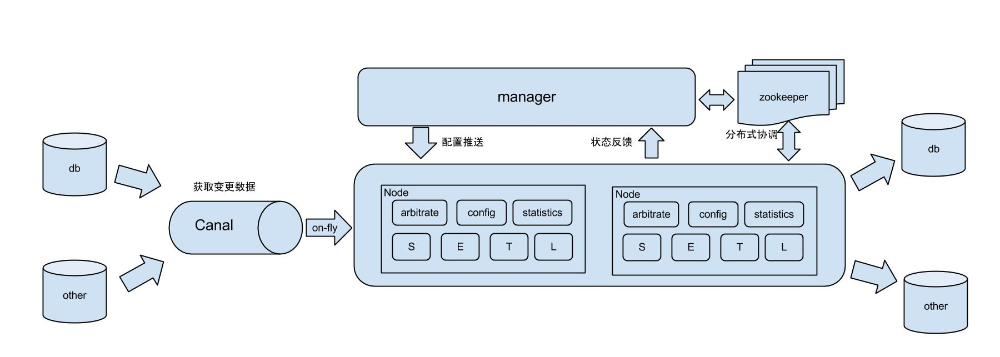

# otter

数据复制中间件

otter 阿里巴巴分布式数据库同步系统

https://dbaplus.cn/news-11-2798-1.html

https://www.oschina.net/p/otter?hmsr=aladdin1e1

otter 基于数据库增量日志解析，准实时同步到本机房或异地机房的mysql/oracle数据库. 一个分布式数据库同步系统。
工作原理：

原理描述：

1. 基于Canal开源产品，获取数据库增量日志数据。 什么是Canal, 请点击
2. 典型管理系统架构，manager(web管理)+node(工作节点)
    a. manager运行时推送同步配置到node节点
    b. node节点将同步状态反馈到manager上
3. 基于zookeeper，解决分布式状态调度的，允许多node节点之间协同工作.

