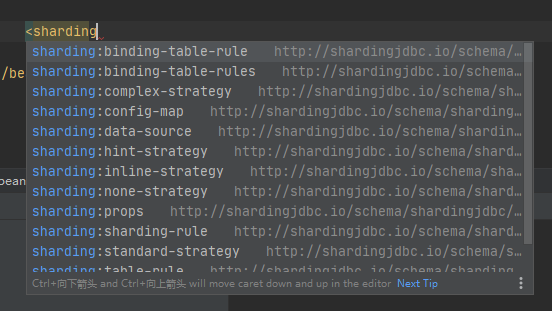

# ss 20200623

ss

spring xml 配置

https://shardingsphere.apache.org/document/legacy/4.x/document/cn/manual/sharding-jdbc/configuration/config-spring-namespace/

sharding:standard-strategy

sharding:data-source

sharding:table-rule

sharding:table-rules

