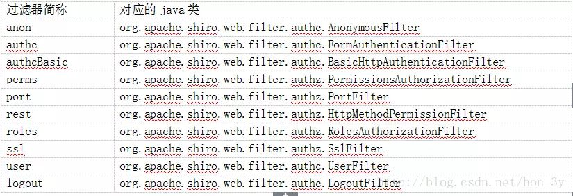

# shiro

shiro netty项目，或者爬虫项目，大数据处理项目，如何鉴权？
数据拿去校验

testshiro gitee repo
https://gitee.com/edidada/testshiro


代码仓库

shiro springboot
https://gitee.com/edidada/testspringmvcshiro

springboot2项目


relam 相当于数据源
Realm即领域，相当于datasource数据源，可以是JDBC实现，也可以是LDAP实现，或者内存实现等等，securityManager进行安全认证需要通过Realm获取用户权限数据




LDAP，Lightweight Directory Access Protocol，轻量级目录访问协议
用户认证
基于 LDAP 做一个认证同样也需要用户名和密码，在这个案例描述中用户名就是 LDAP 中的 DN，因此，假设用户 Tom Riddle 的密码为 123456，你将使用如下方式认证成功：
username: cn=triddle, ou=users, dc=hogwarts, dc=com
password: 123456

Authenticator（认证）
Authorizer（授权）

shiro authc和user的区别
前者是认证过，后者是登录过，如果开启了Readmemberme功能的话，后者也是可以通过的，而前者通过不了。


需要写一个user权限接口的例子


web
认证
Authrization

token
jwt
auth0.

Shiro的AOP横切模式-注解权限控制
https://www.cnblogs.com/BINGJJFLY/p/9066524.html


RequiresPermissions注解
org.apache.shiro.authz.annotation.RequiresPermissions

RequiresAuthentication
RequiresGuest
RequiresPermissions
RequiresRoles
RequiresUser

org.apache.shiro.authz.aop
org.apache.shiro.authz.aop.AnnotationsAuthorizingMethodInterceptor

原理 aop


Spring Security


org.apache.shiro.realm.AuthorizingRealm

doGetAuthorizationInfo
doGetAuthenticationInfo


SimpleAuthenticationInfo   读写权限 在ca之后
SimpleAuthorizationInfo    能否访问系统

核心类Subject
http://shiro.apache.org/static/1.3.2/apidocs/org/apache/shiro/subject/Subject.html

        Subject subject = SecurityUtils.getSubject();

login()
logout()


https://shiro.apache.org/

https://blog.csdn.net/lei_1994/article/details/80504075

- IniSecurityManagerFactory ini纯文件保存用户名密码
- SecurityManager
- Factory

SecurityUtils

Realm

```shell
CachingRealm (org.apache.shiro.realm)
    AuthenticatingRealm (org.apache.shiro.realm)
        AuthorizingRealm (org.apache.shiro.realm)
            SimpleAccountRealm (org.apache.shiro.realm)
                TextConfigurationRealm (org.apache.shiro.realm.text)
                    IniRealm (org.apache.shiro.realm.text)
                    PropertiesRealm (org.apache.shiro.realm.text)
            AbstractLdapRealm (org.apache.shiro.realm.ldap)
                ActiveDirectoryRealm (org.apache.shiro.realm.activedirectory)
            JdbcRealm (org.apache.shiro.realm.jdbc)
            DefaultLdapRealm (org.apache.shiro.realm.ldap)
                JndiLdapRealm (org.apache.shiro.realm.ldap)
```


Subject
- login()
- logout()
- hasRole()
- hasRoles()
- checkRole()

shiro

shiro用户角色
https://www.jianshu.com/p/6a43af2ad044


```shell
2021-10-29 13:16:49,747 DEBUG [org.apache.shiro.io.ResourceUtils] - Opening resource from class path [shiro-permission.ini] 
2021-10-29 13:16:49,761 DEBUG [org.apache.shiro.config.Ini] - Parsing [users] 
2021-10-29 13:16:49,763 TRACE [org.apache.shiro.config.Ini] - Discovered key/value pair: zhangsan = 666,role1,role2 
2021-10-29 13:16:49,763 TRACE [org.apache.shiro.config.Ini] - Discovered key/value pair: lisi = 888,role2 
2021-10-29 13:16:49,763 DEBUG [org.apache.shiro.config.Ini] - Parsing [roles] 
2021-10-29 13:16:49,764 TRACE [org.apache.shiro.config.Ini] - Discovered key/value pair: role1 = user:create,user:update 
2021-10-29 13:16:49,764 TRACE [org.apache.shiro.config.Ini] - Discovered key/value pair: role2 = user:create,user:delete 
2021-10-29 13:16:49,764 TRACE [org.apache.shiro.config.Ini] - Discovered key/value pair: role3 = user:create 
2021-10-29 13:16:49,765 DEBUG [org.apache.shiro.config.IniFactorySupport] - Creating instance from Ini [sections=users,roles] 
2021-10-29 13:16:49,765 TRACE [org.apache.shiro.config.Ini] - Specified name was null or empty.  Defaulting to the default section (name = "") 
2021-10-29 13:16:49,873 DEBUG [org.apache.shiro.realm.text.IniRealm] - Discovered the [roles] section.  Processing... 
2021-10-29 13:16:49,876 DEBUG [org.apache.shiro.realm.text.IniRealm] - Discovered the [users] section.  Processing... 
2021-10-29 13:16:49,899 TRACE [org.apache.shiro.mgt.DefaultSecurityManager] - Context already contains a SecurityManager instance.  Returning. 
2021-10-29 13:16:49,899 TRACE [org.apache.shiro.mgt.DefaultSecurityManager] - No identity (PrincipalCollection) found in the context.  Looking for a remembered identity. 
2021-10-29 13:16:49,899 TRACE [org.apache.shiro.mgt.DefaultSecurityManager] - No remembered identity found.  Returning original context. 
2021-10-29 13:16:49,904 TRACE [org.apache.shiro.subject.support.DelegatingSubject] - attempting to get session; create = false; session is null = true; session has id = false 
2021-10-29 13:16:49,904 TRACE [org.apache.shiro.subject.support.DelegatingSubject] - attempting to get session; create = false; session is null = true; session has id = false 
2021-10-29 13:16:49,905 TRACE [org.apache.shiro.subject.support.DelegatingSubject] - attempting to get session; create = false; session is null = true; session has id = false 
2021-10-29 13:16:49,905 TRACE [org.apache.shiro.subject.support.DelegatingSubject] - attempting to get session; create = false; session is null = true; session has id = false 
2021-10-29 13:16:49,905 TRACE [org.apache.shiro.subject.support.DelegatingSubject] - attempting to get session; create = false; session is null = true; session has id = false 
2021-10-29 13:16:49,906 TRACE [org.apache.shiro.subject.support.DelegatingSubject] - attempting to get session; create = false; session is null = true; session has id = false 
2021-10-29 13:16:49,906 TRACE [org.apache.shiro.authc.AbstractAuthenticator] - Authentication attempt received for token [org.apache.shiro.authc.UsernamePasswordToken - zhangsan, rememberMe=false] 
2021-10-29 13:16:49,906 DEBUG [org.apache.shiro.realm.AuthenticatingRealm] - Looked up AuthenticationInfo [zhangsan] from doGetAuthenticationInfo 
2021-10-29 13:16:49,907 DEBUG [org.apache.shiro.realm.AuthenticatingRealm] - AuthenticationInfo caching is disabled for info [zhangsan].  Submitted token: [org.apache.shiro.authc.UsernamePasswordToken - zhangsan, rememberMe=false]. 
2021-10-29 13:16:49,907 DEBUG [org.apache.shiro.authc.credential.SimpleCredentialsMatcher] - Performing credentials equality check for tokenCredentials of type [[C and accountCredentials of type [java.lang.String] 
2021-10-29 13:16:49,907 DEBUG [org.apache.shiro.authc.credential.SimpleCredentialsMatcher] - Both credentials arguments can be easily converted to byte arrays.  Performing array equals comparison 
2021-10-29 13:16:49,908 DEBUG [org.apache.shiro.authc.AbstractAuthenticator] - Authentication successful for token [org.apache.shiro.authc.UsernamePasswordToken - zhangsan, rememberMe=false].  Returned account [zhangsan] 
2021-10-29 13:16:49,909 DEBUG [org.apache.shiro.subject.support.DefaultSubjectContext] - No SecurityManager available in subject context map.  Falling back to SecurityUtils.getSecurityManager() lookup. 
2021-10-29 13:16:49,909 TRACE [org.apache.shiro.mgt.DefaultSecurityManager] - Context already contains a SecurityManager instance.  Returning. 
2021-10-29 13:16:49,909 TRACE [org.apache.shiro.subject.support.DelegatingSubject] - attempting to get session; create = false; session is null = true; session has id = false 
2021-10-29 13:16:49,909 DEBUG [org.apache.shiro.subject.support.DefaultSubjectContext] - No SecurityManager available in subject context map.  Falling back to SecurityUtils.getSecurityManager() lookup. 
2021-10-29 13:16:49,909 TRACE [org.apache.shiro.subject.support.DelegatingSubject] - attempting to get session; create = false; session is null = true; session has id = false 
2021-10-29 13:16:49,909 TRACE [org.apache.shiro.subject.support.DelegatingSubject] - attempting to get session; create = false; session is null = true; session has id = false 
2021-10-29 13:16:49,909 TRACE [org.apache.shiro.subject.support.DelegatingSubject] - attempting to get session; create = false; session is null = true; session has id = false 
2021-10-29 13:16:49,909 TRACE [org.apache.shiro.subject.support.DelegatingSubject] - attempting to get session; create = false; session is null = true; session has id = false 
2021-10-29 13:16:49,909 TRACE [org.apache.shiro.subject.support.DelegatingSubject] - attempting to get session; create = false; session is null = true; session has id = false 
2021-10-29 13:16:49,909 TRACE [org.apache.shiro.subject.support.DelegatingSubject] - attempting to get session; create = false; session is null = true; session has id = false 
2021-10-29 13:16:49,909 TRACE [org.apache.shiro.subject.support.DelegatingSubject] - attempting to get session; create = true; session is null = true; session has id = false 
2021-10-29 13:16:49,909 TRACE [org.apache.shiro.subject.support.DelegatingSubject] - Starting session for host null 
2021-10-29 13:16:49,910 DEBUG [org.apache.shiro.session.mgt.AbstractValidatingSessionManager] - No sessionValidationScheduler set.  Attempting to create default instance. 
2021-10-29 13:16:49,911 TRACE [org.apache.shiro.session.mgt.AbstractValidatingSessionManager] - Created default SessionValidationScheduler instance of type [org.apache.shiro.session.mgt.ExecutorServiceSessionValidationScheduler]. 
2021-10-29 13:16:49,911 INFO [org.apache.shiro.session.mgt.AbstractValidatingSessionManager] - Enabling session validation scheduler... 
2021-10-29 13:16:49,919 TRACE [org.apache.shiro.session.mgt.DefaultSessionManager] - Creating session for host null 
2021-10-29 13:16:49,920 DEBUG [org.apache.shiro.session.mgt.DefaultSessionManager] - Creating new EIS record for new session instance [org.apache.shiro.session.mgt.SimpleSession,id=null] 
2021-10-29 13:16:50,542 TRACE [org.apache.shiro.session.mgt.AbstractValidatingSessionManager] - Attempting to retrieve session with key org.apache.shiro.session.mgt.DefaultSessionKey@50f8360d 
2021-10-29 13:16:50,542 TRACE [org.apache.shiro.subject.support.DelegatingSubject] - attempting to get session; create = false; session is null = false; session has id = true 
2021-10-29 13:16:50,542 TRACE [org.apache.shiro.session.mgt.AbstractValidatingSessionManager] - Attempting to retrieve session with key org.apache.shiro.session.mgt.DefaultSessionKey@50f8360d 
2021-10-29 13:16:50,543 TRACE [org.apache.shiro.session.mgt.AbstractValidatingSessionManager] - Attempting to retrieve session with key org.apache.shiro.session.mgt.DefaultSessionKey@50f8360d 
2021-10-29 13:16:50,543 TRACE [org.apache.shiro.mgt.DefaultSecurityManager] - This org.apache.shiro.mgt.DefaultSecurityManager instance does not have a [org.apache.shiro.mgt.RememberMeManager] instance configured.  RememberMe services will not be performed for account [zhangsan]. 
2021-10-29 13:16:50,543 TRACE [org.apache.shiro.subject.support.DelegatingSubject] - attempting to get session; create = false; session is null = false; session has id = true 
2021-10-29 13:16:50,543 TRACE [org.apache.shiro.subject.support.DelegatingSubject] - attempting to get session; create = false; session is null = false; session has id = true 
2021-10-29 13:16:50,543 TRACE [org.apache.shiro.session.mgt.AbstractValidatingSessionManager] - Attempting to retrieve session with key org.apache.shiro.session.mgt.DefaultSessionKey@50f8360d 
2021-10-29 13:16:50,544 TRACE [org.apache.shiro.subject.support.DelegatingSubject] - attempting to get session; create = false; session is null = false; session has id = true 
2021-10-29 13:16:50,544 TRACE [org.apache.shiro.session.mgt.AbstractValidatingSessionManager] - Attempting to retrieve session with key org.apache.shiro.session.mgt.DefaultSessionKey@50f8360d 
2021-10-29 13:16:50,544 TRACE [org.apache.shiro.realm.AuthorizingRealm] - Retrieving AuthorizationInfo for principals [zhangsan] 
true
2021-10-29 13:16:50,544 TRACE [org.apache.shiro.subject.support.DelegatingSubject] - attempting to get session; create = false; session is null = false; session has id = true 
2021-10-29 13:16:50,544 TRACE [org.apache.shiro.session.mgt.AbstractValidatingSessionManager] - Attempting to retrieve session with key org.apache.shiro.session.mgt.DefaultSessionKey@50f8360d 
2021-10-29 13:16:50,544 TRACE [org.apache.shiro.subject.support.DelegatingSubject] - attempting to get session; create = false; session is null = false; session has id = true 
2021-10-29 13:16:50,544 TRACE [org.apache.shiro.session.mgt.AbstractValidatingSessionManager] - Attempting to retrieve session with key org.apache.shiro.session.mgt.DefaultSessionKey@50f8360d 
2021-10-29 13:16:50,544 TRACE [org.apache.shiro.realm.AuthorizingRealm] - Retrieving AuthorizationInfo for principals [zhangsan] 
2021-10-29 13:16:50,545 TRACE [org.apache.shiro.realm.AuthorizingRealm] - Retrieving AuthorizationInfo for principals [zhangsan] 
[Z@12843fce
2021-10-29 13:16:50,545 TRACE [org.apache.shiro.subject.support.DelegatingSubject] - attempting to get session; create = false; session is null = false; session has id = true 
2021-10-29 13:16:50,546 TRACE [org.apache.shiro.session.mgt.AbstractValidatingSessionManager] - Attempting to retrieve session with key org.apache.shiro.session.mgt.DefaultSessionKey@50f8360d 
2021-10-29 13:16:50,546 TRACE [org.apache.shiro.subject.support.DelegatingSubject] - attempting to get session; create = false; session is null = false; session has id = true 
2021-10-29 13:16:50,546 TRACE [org.apache.shiro.session.mgt.AbstractValidatingSessionManager] - Attempting to retrieve session with key org.apache.shiro.session.mgt.DefaultSessionKey@50f8360d 
2021-10-29 13:16:50,546 TRACE [org.apache.shiro.realm.AuthorizingRealm] - Retrieving AuthorizationInfo for principals [zhangsan] 
````


```java
//1.创建SecurityManager工厂对象：加载配置文件，创建工厂对象
  Factory<SecurityManager> factory =  new IniSecurityManagerFactory("classpath:shiro-permission.ini");
  //2.创建工厂对象，创建SecurityManager对象
  SecurityManager securityManager = (SecurityManager) factory.getInstance();
  //3.将securityManager绑定到当前运行环境中，让系统随时都可以访问SecurityManager对象
  SecurityUtils.setSecurityManager((org.apache.shiro.mgt.SecurityManager) securityManager);
  //4.创建当前登录的主体，注意：此时主体没有经验证
  Subject subject = SecurityUtils.getSubject();
  //5.绑定主体登录的身份/凭证，即账号密码
  //参数1：将要登录的用户名，参数2：登录用户的密码
  UsernamePasswordToken token = new UsernamePasswordToken("zhangsan","666");
  subject.login(token);
  //进行授权操作时前提：用户必须通过认证
  //判断当前用户手否拥有某个角色
  System.out.println(subject.hasRole("role1"));
  System.out.println(subject.hasRoles(Arrays.asList("role1","role2")));
  //判断当前用户是否拥有某个角色：没有返回值，如果有角色不做任何操作，没有报一个异常
  subject.checkRole("role4");
```

如果身份验证失败请捕获AuthenticationException 或其子类，常见的如：
DisabledAccountException（禁用的帐号）、LockedAccountException（锁定的帐号）、
UnknownAccountException（错误的帐号）、ExcessiveAttemptsException（登录失败次数过
多）、IncorrectCredentialsException （错误的凭证）、ExpiredCredentialsException（过期的
凭证）等


spring-springmvc-mybatis-shiro项目介绍 https://segmentfault.com/a/1190000011001391

AopAllianceAnnotationsAuthorizingMethodInterceptor


shiro web支持多节点部署吗？

https://blog.csdn.net/lgxzzz/article/details/102632667

Shiro-redis插件版本:3.1.0
https://my.oschina.net/linwl/blog/1813441


shiro使用了cookie jsessionid


[SpringMVC整合Shiro权限框架](https://www.cnblogs.com/xiaohouzai/p/7795980.html)
Authentication(身份验证)：简称为“登录”，即证明用户是谁。
Authorization(授权)：访问控制的过程，即决定是否有权限去访问受保护的资源。
Session Management(会话管理)：管理用户特定的会话，即使在非 Web 或 EJB 应用程序。
Cryptography(加密)：通过使用加密算法保持数据安全
SpringMVC整合Shiro权限框架
https://www.cnblogs.com/xiaohouzai/p/7795980.html

Springboot+SpringMVC+Myabtis整合shiro权限控制
https://blog.csdn.net/qq_35272054/article/details/81263214

Authentication
shiro配置
ShiroConfiguration类 spring bean
ShiroFilterFactoryBean

http接口
login

subject
WebDelegatingSubject


[教你 Shiro 整合 SpringBoot，避开各种坑](https://www.cnblogs.com/HowieYuan/p/9259638.html)

package org.apache.shiro.web.filter.mgt;


public enum DefaultFilter {
    anon(AnonymousFilter.class),
    authc(FormAuthenticationFilter.class),
    authcBasic(BasicHttpAuthenticationFilter.class),
    logout(LogoutFilter.class),
    noSessionCreation(NoSessionCreationFilter.class),
    perms(PermissionsAuthorizationFilter.class),
    port(PortFilter.class),
    rest(HttpMethodPermissionFilter.class),
    roles(RolesAuthorizationFilter.class),
    ssl(SslFilter.class),
    user(UserFilter.class);


        shiroFilterFactoryBean.setLoginUrl("/login?username=1&password=1");//拦截的页面先到这里去
没有授权的往这个网页跳转

### 成功的演示

127.0.0.1:30811/shop/getToken?d=1&ds=1
第一次跳转到登录页面
第二次成功

admin页面需要角色admin
数据寸数据库里面

127.0.0.1:30811/admin/logis?d=1&ds=1
第一次跳转到登录页面
第二次成功

shiro SpringMVC注解
@RequiresAuthentication
表示subject已经通过登录验证，才可使用

@RequiresUser
表示subject已经身份验证或者通过记住我登录，才可使用

@RequiresGuest
表示subject没有身份验证或通过记住我登录过，即是游客身份，才可使用

@RequiresRoles(value={“admin”, “user”}, logical=Logical.AND)
表示subject需要xx（value）角色，才可使用

@RequiresPermissions (value={“user:a”, “user:b”},logical= Logical.OR)
表示subject需要xxx（value）权限，才可使用

https://blog.csdn.net/magicproblem/article/details/113607230


https://blog.csdn.net/tragedyxd/article/details/51224279
```shell
org.apache.shiro.authz.AuthorizationException: Not authorized to invoke method: public java.lang.String cn.wdidada.testspringmvcshiro.controller.AnnotationController.login(javax.servlet.http.HttpServletRequest,javax.servlet.http.HttpServletResponse)
	at org.apache.shiro.authz.aop.AuthorizingAnnotationMethodInterceptor.assertAuthorized(AuthorizingAnnotationMethodInterceptor.java:90) ~[shiro-core-1.2.2.jar:1.2.2]
	at org.apache.shiro.authz.aop.AnnotationsAuthorizingMethodInterceptor.assertAuthorized(AnnotationsAuthorizingMethodInterceptor.java:100) ~[shiro-core-1.2.2.jar:1.2.2]
	at org.apache.shiro.authz.aop.AuthorizingMethodInterceptor.invoke(AuthorizingMethodInterceptor.java:38) ~[shiro-core-1.2.2.jar:1.2.2]
	at org.apache.shiro.spring.security.interceptor.AopAllianceAnnotationsAuthorizingMethodInterceptor.invoke(AopAllianceAnnotationsAuthorizingMethodInterceptor.java:115) ~[shiro-spring-1.2.2.jar:1.2.2]
	at org.springframework.aop.framework.ReflectiveMethodInvocation.proceed(ReflectiveMethodInvocation.java:186) ~[spring-aop-5.1.6.RELEASE.jar:5.1.6.RELEASE]
	at org.springframework.aop.framework.CglibAopProxy$DynamicAdvisedInterceptor.intercept(CglibAopProxy.java:688) ~[spring-aop-5.1.6.RELEASE.jar:5.1.6.RELEASE]
	at cn.wdidada.testspringmvcshiro.controller.AnnotationController$$EnhancerBySpringCGLIB$$b143d0fe.login(<generated>) ~[classes/:na]
	at sun.reflect.NativeMethodAccessorImpl.invoke0(Native Method) ~[na:1.8.0_231]
	at sun.reflect.NativeMethodAccessorImpl.invoke(NativeMethodAccessorImpl.java:62) ~[na:1.8.0_231]
	at sun.reflect.DelegatingMethodAccessorImpl.invoke(DelegatingMethodAccessorImpl.java:43) ~[na:1.8.0_231]
	at java.lang.reflect.Method.invoke(Method.java:498) ~[na:1.8.0_231]
	at org.springframework.web.method.support.InvocableHandlerMethod.doInvoke(InvocableHandlerMethod.java:189) ~[spring-web-5.1.6.RELEASE.jar:5.1.6.RELEASE]
	at org.springframework.web.method.support.InvocableHandlerMethod.invokeForRequest(InvocableHandlerMethod.java:138) ~[spring-web-5.1.6.RELEASE.jar:5.1.6.RELEASE]
	at org.springframework.web.servlet.mvc.method.annotation.ServletInvocableHandlerMethod.invokeAndHandle(ServletInvocableHandlerMethod.java:102) ~[spring-webmvc-5.1.6.RELEASE.jar:5.1.6.RELEASE]
	at org.springframework.web.servlet.mvc.method.annotation.RequestMappingHandlerAdapter.invokeHandlerMethod(RequestMappingHandlerAdapter.java:892) ~[spring-webmvc-5.1.6.RELEASE.jar:5.1.6.RELEASE]
	at org.springframework.web.servlet.mvc.method.annotation.RequestMappingHandlerAdapter.handleInternal(RequestMappingHandlerAdapter.java:797) ~[spring-webmvc-5.1.6.RELEASE.jar:5.1.6.RELEASE]
	at org.springframework.web.servlet.mvc.method.AbstractHandlerMethodAdapter.handle(AbstractHandlerMethodAdapter.java:87) ~[spring-webmvc-5.1.6.RELEASE.jar:5.1.6.RELEASE]
	at org.springframework.web.servlet.DispatcherServlet.doDispatch(DispatcherServlet.java:1038) ~[spring-webmvc-5.1.6.RELEASE.jar:5.1.6.RELEASE]
	at org.springframework.web.servlet.DispatcherServlet.doService(DispatcherServlet.java:942) ~[spring-webmvc-5.1.6.RELEASE.jar:5.1.6.RELEASE]
	at org.springframework.web.servlet.FrameworkServlet.processRequest(FrameworkServlet.java:1005) ~[spring-webmvc-5.1.6.RELEASE.jar:5.1.6.RELEASE]
	at org.springframework.web.servlet.FrameworkServlet.doPost(FrameworkServlet.java:908) ~[spring-webmvc-5.1.6.RELEASE.jar:5.1.6.RELEASE]
	at javax.servlet.http.HttpServlet.service(HttpServlet.java:660) ~[tomcat-embed-core-9.0.17.jar:9.0.17]
	at org.springframework.web.servlet.FrameworkServlet.service(FrameworkServlet.java:882) ~[spring-webmvc-5.1.6.RELEASE.jar:5.1.6.RELEASE]
	at javax.servlet.http.HttpServlet.service(HttpServlet.java:741) ~[tomcat-embed-core-9.0.17.jar:9.0.17]
	at org.apache.catalina.core.ApplicationFilterChain.internalDoFilter(ApplicationFilterChain.java:231) ~[tomcat-embed-core-9.0.17.jar:9.0.17]
	at org.apache.catalina.core.ApplicationFilterChain.doFilter(ApplicationFilterChain.java:166) ~[tomcat-embed-core-9.0.17.jar:9.0.17]
	at org.apache.tomcat.websocket.server.WsFilter.doFilter(WsFilter.java:53) ~[tomcat-embed-websocket-9.0.17.jar:9.0.17]
	at org.apache.catalina.core.ApplicationFilterChain.internalDoFilter(ApplicationFilterChain.java:193) ~[tomcat-embed-core-9.0.17.jar:9.0.17]
	at org.apache.catalina.core.ApplicationFilterChain.doFilter(ApplicationFilterChain.java:166) ~[tomcat-embed-core-9.0.17.jar:9.0.17]
	at org.apache.shiro.web.servlet.ProxiedFilterChain.doFilter(ProxiedFilterChain.java:61) ~[shiro-web-1.2.2.jar:1.2.2]
	at org.apache.shiro.web.servlet.AdviceFilter.executeChain(AdviceFilter.java:108) ~[shiro-web-1.2.2.jar:1.2.2]
	at org.apache.shiro.web.servlet.AdviceFilter.doFilterInternal(AdviceFilter.java:137) ~[shiro-web-1.2.2.jar:1.2.2]
	at org.apache.shiro.web.servlet.OncePerRequestFilter.doFilter(OncePerRequestFilter.java:125) ~[shiro-web-1.2.2.jar:1.2.2]
	at org.apache.shiro.web.servlet.ProxiedFilterChain.doFilter(ProxiedFilterChain.java:66) ~[shiro-web-1.2.2.jar:1.2.2]
	at org.apache.shiro.web.servlet.AbstractShiroFilter.executeChain(AbstractShiroFilter.java:449) ~[shiro-web-1.2.2.jar:1.2.2]
	at org.apache.shiro.web.servlet.AbstractShiroFilter$1.call(AbstractShiroFilter.java:365) ~[shiro-web-1.2.2.jar:1.2.2]
	at org.apache.shiro.subject.support.SubjectCallable.doCall(SubjectCallable.java:90) ~[shiro-core-1.2.2.jar:1.2.2]
	at org.apache.shiro.subject.support.SubjectCallable.call(SubjectCallable.java:83) ~[shiro-core-1.2.2.jar:1.2.2]
	at org.apache.shiro.subject.support.DelegatingSubject.execute(DelegatingSubject.java:383) ~[shiro-core-1.2.2.jar:1.2.2]
	at org.apache.shiro.web.servlet.AbstractShiroFilter.doFilterInternal(AbstractShiroFilter.java:362) ~[shiro-web-1.2.2.jar:1.2.2]
	at org.apache.shiro.web.servlet.OncePerRequestFilter.doFilter(OncePerRequestFilter.java:125) ~[shiro-web-1.2.2.jar:1.2.2]
	at org.apache.catalina.core.ApplicationFilterChain.internalDoFilter(ApplicationFilterChain.java:193) ~[tomcat-embed-core-9.0.17.jar:9.0.17]
	at org.apache.catalina.core.ApplicationFilterChain.doFilter(ApplicationFilterChain.java:166) ~[tomcat-embed-core-9.0.17.jar:9.0.17]
	at org.springframework.web.filter.RequestContextFilter.doFilterInternal(RequestContextFilter.java:99) ~[spring-web-5.1.6.RELEASE.jar:5.1.6.RELEASE]
	at org.springframework.web.filter.OncePerRequestFilter.doFilter(OncePerRequestFilter.java:107) ~[spring-web-5.1.6.RELEASE.jar:5.1.6.RELEASE]
	at org.apache.catalina.core.ApplicationFilterChain.internalDoFilter(ApplicationFilterChain.java:193) ~[tomcat-embed-core-9.0.17.jar:9.0.17]
	at org.apache.catalina.core.ApplicationFilterChain.doFilter(ApplicationFilterChain.java:166) ~[tomcat-embed-core-9.0.17.jar:9.0.17]
	at org.springframework.web.filter.FormContentFilter.doFilterInternal(FormContentFilter.java:92) ~[spring-web-5.1.6.RELEASE.jar:5.1.6.RELEASE]
	at org.springframework.web.filter.OncePerRequestFilter.doFilter(OncePerRequestFilter.java:107) ~[spring-web-5.1.6.RELEASE.jar:5.1.6.RELEASE]
	at org.apache.catalina.core.ApplicationFilterChain.internalDoFilter(ApplicationFilterChain.java:193) ~[tomcat-embed-core-9.0.17.jar:9.0.17]
	at org.apache.catalina.core.ApplicationFilterChain.doFilter(ApplicationFilterChain.java:166) ~[tomcat-embed-core-9.0.17.jar:9.0.17]
	at org.springframework.web.filter.HiddenHttpMethodFilter.doFilterInternal(HiddenHttpMethodFilter.java:93) ~[spring-web-5.1.6.RELEASE.jar:5.1.6.RELEASE]
	at org.springframework.web.filter.OncePerRequestFilter.doFilter(OncePerRequestFilter.java:107) ~[spring-web-5.1.6.RELEASE.jar:5.1.6.RELEASE]
	at org.apache.catalina.core.ApplicationFilterChain.internalDoFilter(ApplicationFilterChain.java:193) ~[tomcat-embed-core-9.0.17.jar:9.0.17]
	at org.apache.catalina.core.ApplicationFilterChain.doFilter(ApplicationFilterChain.java:166) ~[tomcat-embed-core-9.0.17.jar:9.0.17]
	at org.springframework.web.filter.CharacterEncodingFilter.doFilterInternal(CharacterEncodingFilter.java:200) ~[spring-web-5.1.6.RELEASE.jar:5.1.6.RELEASE]
	at org.springframework.web.filter.OncePerRequestFilter.doFilter(OncePerRequestFilter.java:107) ~[spring-web-5.1.6.RELEASE.jar:5.1.6.RELEASE]
	at org.apache.catalina.core.ApplicationFilterChain.internalDoFilter(ApplicationFilterChain.java:193) ~[tomcat-embed-core-9.0.17.jar:9.0.17]
	at org.apache.catalina.core.ApplicationFilterChain.doFilter(ApplicationFilterChain.java:166) ~[tomcat-embed-core-9.0.17.jar:9.0.17]
	at org.apache.catalina.core.StandardWrapperValve.invoke(StandardWrapperValve.java:200) ~[tomcat-embed-core-9.0.17.jar:9.0.17]
	at org.apache.catalina.core.StandardContextValve.invoke(StandardContextValve.java:96) [tomcat-embed-core-9.0.17.jar:9.0.17]
	at org.apache.catalina.authenticator.AuthenticatorBase.invoke(AuthenticatorBase.java:490) [tomcat-embed-core-9.0.17.jar:9.0.17]
	at org.apache.catalina.core.StandardHostValve.invoke(StandardHostValve.java:139) [tomcat-embed-core-9.0.17.jar:9.0.17]
	at org.apache.catalina.valves.ErrorReportValve.invoke(ErrorReportValve.java:92) [tomcat-embed-core-9.0.17.jar:9.0.17]
	at org.apache.catalina.core.StandardEngineValve.invoke(StandardEngineValve.java:74) [tomcat-embed-core-9.0.17.jar:9.0.17]
	at org.apache.catalina.connector.CoyoteAdapter.service(CoyoteAdapter.java:343) [tomcat-embed-core-9.0.17.jar:9.0.17]
	at org.apache.coyote.http11.Http11Processor.service(Http11Processor.java:408) [tomcat-embed-core-9.0.17.jar:9.0.17]
	at org.apache.coyote.AbstractProcessorLight.process(AbstractProcessorLight.java:66) [tomcat-embed-core-9.0.17.jar:9.0.17]
	at org.apache.coyote.AbstractProtocol$ConnectionHandler.process(AbstractProtocol.java:834) [tomcat-embed-core-9.0.17.jar:9.0.17]
	at org.apache.tomcat.util.net.NioEndpoint$SocketProcessor.doRun(NioEndpoint.java:1415) [tomcat-embed-core-9.0.17.jar:9.0.17]
	at org.apache.tomcat.util.net.SocketProcessorBase.run(SocketProcessorBase.java:49) [tomcat-embed-core-9.0.17.jar:9.0.17]
	at java.util.concurrent.ThreadPoolExecutor.runWorker(ThreadPoolExecutor.java:1149) [na:1.8.0_231]
	at java.util.concurrent.ThreadPoolExecutor$Worker.run(ThreadPoolExecutor.java:624) [na:1.8.0_231]
	at org.apache.tomcat.util.threads.TaskThread$WrappingRunnable.run(TaskThread.java:61) [tomcat-embed-core-9.0.17.jar:9.0.17]
	at java.lang.Thread.run(Thread.java:748) [na:1.8.0_231]
```

shiro直接对类进行注解，类似于@Controller的形式
https://blog.csdn.net/tragedyxd/article/details/51224279


Shiro 架构 3 个核心组件:
- Subject: 正与系统进行交互的人, 或某一个第三方服务. 所有 Subject 实例都被绑定到（且这是必须的）一个SecurityManager 上。
- SecurityManager: Shiro 架构的心脏, 用来协调内部各安全组件, 管理内部组件实例, 并通过它来提供安全管理的各种服务. 当 Shiro 与一个 Subject 进行交互时, 实质上是幕后的 SecurityManager 处理所有繁重的 Subject 安全操作。
- Realms: 本质上是一个特定安全的 DAO. 当配置 Shiro 时, 必须指定至少一个 Realm 用来进行身份验证和/或授权. Shiro 提供了多种可用的 Realms 来获取安全相关的数据. 如关系数据库(JDBC), INI 及属性文件等.
可以定义自己 Realm 实现来代表自定义的数据源。

```shell
2023-06-08 21:29:42.237 [http-nio-30811-exec-5] TRACE org.apache.shiro.util.ThreadContext 120 - Retrieved value of type [org.apache.shiro.web.subject.support.WebDelegatingSubject] for key [org.apache.shiro.util.ThreadContext_SUBJECT_KEY] bound to thread [http-nio-30811-exec-5]
```

没有授权，报错
访问：
127.0.0.1:30811/api/user
返回
```json
{
    "timestamp": "2023-06-08T13:49:40.823+0000",
    "status": 500,
    "error": "Internal Server Error",
    "message": "This subject is anonymous - it does not have any identifying principals and authorization operations require an identity to check against.  A Subject instance will acquire these identifying principals automatically after a successful login is performed be executing org.apache.shiro.subject.Subject.login(AuthenticationToken) or when 'Remember Me' functionality is enabled by the SecurityManager.  This exception can also occur when a previously logged-in Subject has logged out which makes it anonymous again.  Because an identity is currently not known due to any of these conditions, authorization is denied.",
    "path": "/api/user"
}
```
```shell
org.apache.shiro.authz.AuthorizationException: Not authorized to invoke method: public cn.wdidada.testspringmvcshiro.beans.User cn.wdidada.testspringmvcshiro.controller.ApiController.getUser()
	at org.apache.shiro.authz.aop.AuthorizingAnnotationMethodInterceptor.assertAuthorized(AuthorizingAnnotationMethodInterceptor.java:90)
	at org.apache.shiro.authz.aop.AnnotationsAuthorizingMethodInterceptor.assertAuthorized(AnnotationsAuthorizingMethodInterceptor.java:100)
	at org.apache.shiro.authz.aop.AuthorizingMethodInterceptor.invoke(AuthorizingMethodInterceptor.java:38)
	at org.apache.shiro.spring.security.interceptor.AopAllianceAnnotationsAuthorizingMethodInterceptor.invoke(AopAllianceAnnotationsAuthorizingMethodInterceptor.java:115)
	at org.springframework.aop.framework.ReflectiveMethodInvocation.proceed(ReflectiveMethodInvocation.java:186)
	at org.springframework.aop.framework.CglibAopProxy$DynamicAdvisedInterceptor.intercept(CglibAopProxy.java:688)
	at cn.wdidada.testspringmvcshiro.controller.ApiController$$EnhancerBySpringCGLIB$$8a2e539b.getUser(<generated>)
	at sun.reflect.NativeMethodAccessorImpl.invoke0(Native Method)
	at sun.reflect.NativeMethodAccessorImpl.invoke(NativeMethodAccessorImpl.java:62)
	at sun.reflect.DelegatingMethodAccessorImpl.invoke(DelegatingMethodAccessorImpl.java:43)
	at java.lang.reflect.Method.invoke(Method.java:498)
	at org.springframework.web.method.support.InvocableHandlerMethod.doInvoke(InvocableHandlerMethod.java:189)
	at org.springframework.web.method.support.InvocableHandlerMethod.invokeForRequest(InvocableHandlerMethod.java:138)
	at org.springframework.web.servlet.mvc.method.annotation.ServletInvocableHandlerMethod.invokeAndHandle(ServletInvocableHandlerMethod.java:102)
	at org.springframework.web.servlet.mvc.method.annotation.RequestMappingHandlerAdapter.invokeHandlerMethod(RequestMappingHandlerAdapter.java:892)
	at org.springframework.web.servlet.mvc.method.annotation.RequestMappingHandlerAdapter.handleInternal(RequestMappingHandlerAdapter.java:797)
	at org.springframework.web.servlet.mvc.method.AbstractHandlerMethodAdapter.handle(AbstractHandlerMethodAdapter.java:87)
	at org.springframework.web.servlet.DispatcherServlet.doDispatch(DispatcherServlet.java:1038)
	at org.springframework.web.servlet.DispatcherServlet.doService(DispatcherServlet.java:942)
	at org.springframework.web.servlet.FrameworkServlet.processRequest(FrameworkServlet.java:1005)
	at org.springframework.web.servlet.FrameworkServlet.doGet(FrameworkServlet.java:897)
	at javax.servlet.http.HttpServlet.service(HttpServlet.java:634)
	at org.springframework.web.servlet.FrameworkServlet.service(FrameworkServlet.java:882)
	at javax.servlet.http.HttpServlet.service(HttpServlet.java:741)
	at org.apache.catalina.core.ApplicationFilterChain.internalDoFilter(ApplicationFilterChain.java:231)
	at org.apache.catalina.core.ApplicationFilterChain.doFilter(ApplicationFilterChain.java:166)
	at org.apache.tomcat.websocket.server.WsFilter.doFilter(WsFilter.java:53)
	at org.apache.catalina.core.ApplicationFilterChain.internalDoFilter(ApplicationFilterChain.java:193)
	at org.apache.catalina.core.ApplicationFilterChain.doFilter(ApplicationFilterChain.java:166)
	at org.apache.shiro.web.servlet.ProxiedFilterChain.doFilter(ProxiedFilterChain.java:61)
	at org.apache.shiro.web.servlet.AdviceFilter.executeChain(AdviceFilter.java:108)
	at org.apache.shiro.web.servlet.AdviceFilter.doFilterInternal(AdviceFilter.java:137)
	at org.apache.shiro.web.servlet.OncePerRequestFilter.doFilter(OncePerRequestFilter.java:125)
	at org.apache.shiro.web.servlet.ProxiedFilterChain.doFilter(ProxiedFilterChain.java:66)
	at org.apache.shiro.web.servlet.AbstractShiroFilter.executeChain(AbstractShiroFilter.java:449)
	at org.apache.shiro.web.servlet.AbstractShiroFilter$1.call(AbstractShiroFilter.java:365)
	at org.apache.shiro.subject.support.SubjectCallable.doCall(SubjectCallable.java:90)
	at org.apache.shiro.subject.support.SubjectCallable.call(SubjectCallable.java:83)
	at org.apache.shiro.subject.support.DelegatingSubject.execute(DelegatingSubject.java:383)
	at org.apache.shiro.web.servlet.AbstractShiroFilter.doFilterInternal(AbstractShiroFilter.java:362)
	at org.apache.shiro.web.servlet.OncePerRequestFilter.doFilter(OncePerRequestFilter.java:125)
	at org.apache.catalina.core.ApplicationFilterChain.internalDoFilter(ApplicationFilterChain.java:193)
	at org.apache.catalina.core.ApplicationFilterChain.doFilter(ApplicationFilterChain.java:166)
	at org.springframework.web.filter.RequestContextFilter.doFilterInternal(RequestContextFilter.java:99)
	at org.springframework.web.filter.OncePerRequestFilter.doFilter(OncePerRequestFilter.java:107)
	at org.apache.catalina.core.ApplicationFilterChain.internalDoFilter(ApplicationFilterChain.java:193)
	at org.apache.catalina.core.ApplicationFilterChain.doFilter(ApplicationFilterChain.java:166)
	at org.springframework.web.filter.FormContentFilter.doFilterInternal(FormContentFilter.java:92)
	at org.springframework.web.filter.OncePerRequestFilter.doFilter(OncePerRequestFilter.java:107)
	at org.apache.catalina.core.ApplicationFilterChain.internalDoFilter(ApplicationFilterChain.java:193)
	at org.apache.catalina.core.ApplicationFilterChain.doFilter(ApplicationFilterChain.java:166)
	at org.springframework.web.filter.HiddenHttpMethodFilter.doFilterInternal(HiddenHttpMethodFilter.java:93)
	at org.springframework.web.filter.OncePerRequestFilter.doFilter(OncePerRequestFilter.java:107)
	at org.apache.catalina.core.ApplicationFilterChain.internalDoFilter(ApplicationFilterChain.java:193)
	at org.apache.catalina.core.ApplicationFilterChain.doFilter(ApplicationFilterChain.java:166)
	at org.springframework.web.filter.CharacterEncodingFilter.doFilterInternal(CharacterEncodingFilter.java:200)
	at org.springframework.web.filter.OncePerRequestFilter.doFilter(OncePerRequestFilter.java:107)
	at org.apache.catalina.core.ApplicationFilterChain.internalDoFilter(ApplicationFilterChain.java:193)
	at org.apache.catalina.core.ApplicationFilterChain.doFilter(ApplicationFilterChain.java:166)
	at org.apache.catalina.core.StandardWrapperValve.invoke(StandardWrapperValve.java:200)
	at org.apache.catalina.core.StandardContextValve.invoke(StandardContextValve.java:96)
	at org.apache.catalina.authenticator.AuthenticatorBase.invoke(AuthenticatorBase.java:490)
	at org.apache.catalina.core.StandardHostValve.invoke(StandardHostValve.java:139)
	at org.apache.catalina.valves.ErrorReportValve.invoke(ErrorReportValve.java:92)
	at org.apache.catalina.core.StandardEngineValve.invoke(StandardEngineValve.java:74)
	at org.apache.catalina.connector.CoyoteAdapter.service(CoyoteAdapter.java:343)
	at org.apache.coyote.http11.Http11Processor.service(Http11Processor.java:408)
	at org.apache.coyote.AbstractProcessorLight.process(AbstractProcessorLight.java:66)
	at org.apache.coyote.AbstractProtocol$ConnectionHandler.process(AbstractProtocol.java:834)
	at org.apache.tomcat.util.net.NioEndpoint$SocketProcessor.doRun(NioEndpoint.java:1415)
	at org.apache.tomcat.util.net.SocketProcessorBase.run(SocketProcessorBase.java:49)
	at java.util.concurrent.ThreadPoolExecutor.runWorker(ThreadPoolExecutor.java:1149)
	at java.util.concurrent.ThreadPoolExecutor$Worker.run(ThreadPoolExecutor.java:624)
	at org.apache.tomcat.util.threads.TaskThread$WrappingRunnable.run(TaskThread.java:61)
	at java.lang.Thread.run(Thread.java:748)
```

## 打印日志
测试发现的现象

访问
127.0.0.1:30811/admin/logis?d=1&ds=1
直接跳转到GET的login.html

org.apache.shiro.spring.web.ShiroFilterFactoryBean.setLoginUrl

http://127.0.0.1:30811/login.html;jsessionid=E5A6BA776A20306CB93EBD65B7209AAB

注意
```shell
jsessionid=E5A6BA776A20306CB93EBD65B7209AAB
```

Shiro 的 `UsernamePasswordToken` 类是用于封装用户输入的用户名和密码的，它不会进行用户名和密码的校验，而是通过 `Realm` 类来进行身份验证。
`Realm` 是 Shiro 中进行身份验证和授权的核心组件，它负责从数据源（例如数据库、LDAP 等）中获取用户信息，并对用户信息进行校验。在 `Realm` 中，可以通过重写 `doGetAuthenticationInfo` 方法来实现身份验证逻辑。
`doGetAuthenticationInfo` 方法接收一个 `AuthenticationToken` 类型的参数，该参数就是 `UsernamePasswordToken` 类型的实例，其包含用户输入的用户名和密码等信息。在 `doGetAuthenticationInfo` 方法中，需要根据用户名从数据源中获取用户信息，并进行密码校验。如果密码校验通过，则返回一个 `AuthenticationInfo` 对象，表示身份验证成功；否则返回 `null`，表示身份验证失败。
示例代码如下：
```java
public class MyRealm extends AuthorizingRealm {

    // 省略其他方法

    @Override
    protected AuthenticationInfo doGetAuthenticationInfo(AuthenticationToken authenticationToken) throws AuthenticationException {
        UsernamePasswordToken token = (UsernamePasswordToken) authenticationToken;
        String username = token.getUsername();
        // TODO: 根据用户名从数据源中获取用户信息
        User user = userService.findByUsername(username);
        if (user == null) {
            throw new UnknownAccountException("Unknown account: " + username);
        }
        // 校验密码
        String password = new String(token.getPassword());
        if (!password.equals(user.getPassword())) {
            throw new IncorrectCredentialsException("Incorrect password");
        }
        // 构造 AuthenticationInfo 对象并返回，表示身份验证成功
        SimpleAuthenticationInfo info = new SimpleAuthenticationInfo(user, user.getPassword(), getName());
        return info;
    }
}
```
在上述代码中，`doGetAuthenticationInfo` 方法接收一个 `AuthenticationToken` 参数，将其转换为 `UsernamePasswordToken` 类型的实例，并从中获取用户名和密码。然后根据用户名从数据源中获取用户信息，如果用户不存在，则抛出 `UnknownAccountException` 异常；如果密码校验失败，则抛出 `IncorrectCredentialsException` 异常；如果校验通过，则构造一个 `SimpleAuthenticationInfo` 对象返回，表示身份验证成功。

跳转到
cn.wdidada.testspringmvcshiro.shiro.ShiroRealm.doGetAuthenticationInfo

问题：
org.apache.shiro.subject.Subject.login
org.apache.shiro.realm.AuthenticatingRealm.doGetAuthenticationInfo
调用login()后，doGetAuthenticationInfo()被调用

在 Shiro 框架中，`Subject.login` 方法用于进行身份认证，而 `AuthenticatingRealm.doGetAuthenticationInfo` 方法则是 Realm 中用于获取身份验证信息的方法。在调用 `Subject.login` 方法时，Shiro 会先调用 `AuthenticatingRealm.doGetAuthenticationInfo` 方法获取身份验证信息，然后再对用户提交的身份信息进行比对，从而完成身份认证的过程。
`Subject.login` 方法的调用流程通常如下：
1. 用户在客户端提交身份信息，例如用户名和密码。
2. 应用程序调用 `Subject.login` 方法进行身份认证。
3. Shiro 框架根据配置的 Realm 实现类调用 `doGetAuthenticationInfo` 方法获取身份验证信息。
4. 如果获取到身份验证信息，则将用户提交的身份信息与获取到的身份验证信息进行比对，如果比对成功，则身份认证通过，否则身份认证失败。
5. 如果身份认证通过，则将用户信息绑定到当前的 Subject 对象上，以供后续的授权使用。
在 `AuthenticatingRealm.doGetAuthenticationInfo` 方法中，通常需要从数据库或其他数据源中获取用户的身份验证信息，例如从数据库中查询用户的密码等信息。如果获取到的身份验证信息不为空，则返回一个 `AuthenticationInfo` 对象，否则返回 null。
需要注意的是，`doGetAuthenticationInfo` 方法只是获取身份验证信息的方法，实际的身份认证过程会由 Shiro 框架完成。在实现 `doGetAuthenticationInfo` 方法时，需要根据具体的业务需求和场景，灵活地处理身份验证信息，并确保身份认证的安全性和可靠性。

   @RequiresAuthentication
   @RequiresPermissions("user:view")
   @RequiresRoles(value={"admin","user"}, logical= Logical.AND)

Apache Shiro可以用于单机应用程序的安全管理，但是在分布式环境下，需要考虑集群支持的问题。在Spring Cloud环境下，可以通过使用 Spring Cloud Config 和 Spring Cloud Netflix Ribbon 来实现 Shiro 集群支持。
具体来说，可以将Shiro的配置信息存储在Spring Cloud Config中，然后在应用程序中通过Spring Cloud Config Client 获取配置信息。这样，当应用程序启动时，会从 Spring Cloud Config Server 中获取最新的 Shiro 配置信息，并在应用程序中进行相应的配置。
另外，可以使用 Spring Cloud Netflix Ribbon 来实现负载均衡和故障转移。Spring Cloud Netflix Ribbon 是一个客户端负载均衡器，它可以将请求分配到多个 Shiro 服务器上，并在某个服务器出现故障时自动切换到另一个服务器。
需要注意的是，当使用 Shiro 集群时，应该将 Shiro Session 存储在外部缓存中，以便多个 Shiro 服务器之间共享 Session 数据。可以使用 Spring Session 来将 Shiro Session 存储在 Redis、MongoDB 等外部缓存中。这样，当用户在一个 Shiro 服务器上登录后，即使切换到另一个服务器，也可以保持登录状态。

### jar文件列表

- shiro-spring
- shiro-core
- shiro-web
- shiro-ehcache

### shiro-core

org.apache.shiro.util.ThreadContext 抽象静态类

org.apache.shiro.util.ThreadContext跟线程绑定，tomcat是多线程的，shiro-web如何解决这个问题

在Web应用程序中，每个请求都会被分配到一个独立的线程中进行处理。因此，在使用Shiro进行Web应用程序的安全管理时，需要将Shiro上下文与线程进行绑定，以确保在整个请求处理过程中，可以访问正确的Shiro上下文。
Shiro-web模块提供了一个 Servlet 过滤器，用于将 Shiro 上下文与线程进行绑定。该过滤器为每个请求创建一个新的线程，并将 Shiro 上下文绑定到该线程中。在请求处理过程中，可以通过 ThreadContext 类访问绑定到当前线程的 Shiro 上下文。当请求处理完成后，该过滤器会将线程与 Shiro 上下文解绑，并将线程返回到线程池中，以便重用。
要使用 Shiro-web 模块，需要在 web.xml 文件中配置 ShiroFilter 过滤器，如下所示：
```
<filter>
  <filter-name>ShiroFilter</filter-name>
  <filter-class>org.apache.shiro.web.servlet.ShiroFilter</filter-class>
</filter>
<filter-mapping>
  <filter-name>ShiroFilter</filter-name>
  <url-pattern>/*</url-pattern>
</filter-mapping>
```
通过将 ShiroFilter 过滤器配置在所有请求的 URL 上，可以确保所有请求都会被 Shiro 上下文正确地绑定到线程中。这样，在整个请求处理过程中，就可以通过 ThreadContext 类访问正确的 Shiro 上下文。


### shiro-web


ServletContextSupport (org.apache.shiro.web.servlet)
    AbstractFilter (org.apache.shiro.web.servlet)
        NameableFilter (org.apache.shiro.web.servlet)
            OncePerRequestFilter (org.apache.shiro.web.servlet)
                AbstractShiroFilter (org.apache.shiro.web.servlet)
                    ShiroFilter (org.apache.shiro.web.servlet)


AbstractFilter实现javax.servlet.Filter接口


### shiro-spring

shiro-spring依赖shiro-web

SpringAnnotationResolver
SecureRemoteInvocationExecutor
SecureRemoteInvocationFactory
AopAllianceAnnotationsAuthorizingMethodInterceptor
AuthorizationAttributeSourceAdvisor
ShiroFilterFactoryBean
LifecycleBeanPostProcessor


这些类都是Apache Shiro在Spring框架中的集成类，用于在Spring应用程序中使用Shiro进行安全管理。
1. SpringAnnotationResolver：用于解析 Spring 中的注解，将其转换为 Shiro 的权限信息。它可以将 Spring 的 @Secured、@RolesAllowed、@PreAuthorize、@PostAuthorize 等注解转换为Shiro的权限信息。
2. SecureRemoteInvocationExecutor：用于在远程调用中执行安全检查。它可以在 RMI、Hessian、Burlap 等远程调用协议中执行 Shiro 安全检查，确保只有具有相应权限的用户才能调用远程方法。
3. SecureRemoteInvocationFactory：用于创建安全的远程调用对象。它可以在 RMI、Hessian、Burlap 等远程调用协议中创建安全的远程调用对象，确保只有具有相应权限的用户才能调用远程方法。
4. AopAllianceAnnotationsAuthorizingMethodInterceptor：用于在 Spring AOP 中拦截方法调用，并执行 Shiro 安全检查。它可以拦截 Spring 中使用 AOP 进行方法调用的地方，执行 Shiro 安全检查，并阻止没有相应权限的用户执行该方法。
5. AuthorizationAttributeSourceAdvisor：用于将 Shiro 的授权信息应用到 Spring AOP 中。它可以将 Shiro 的授权信息应用到 Spring AOP 中，确保只有具有相应权限的用户才能执行相应方法。
6. ShiroFilterFactoryBean：用于创建 Shiro 的 Filter 链，实现 Web 应用程序的安全管理。它可以创建 Shiro 的 Filter 链，将 Shiro 的认证和授权功能应用到 Web 应用程序中，并防止未经认证的用户访问受保护的资源。
7. LifecycleBeanPostProcessor：用于在 Spring 容器中自动初始化实现了 Initializable 接口和 Destroyable 接口的 Shiro Bean。它可以在 Spring 容器中自动初始化实现了 Initializable 接口和 Destroyable 接口的 Shiro Bean，确保这些 Bean 在应用程序启动和关闭时正确地初始化和销毁。

```java
        Map<String, String> filterChainDefinitionManager = new LinkedHashMap<>();
        filterChainDefinitionManager.put("/logout", "logout");
        filterChainDefinitionManager.put("/user/**", "authc,roles[user]");
        shiroFilterFactoryBean.setFilterChainDefinitionMap(filterChainDefinitionManager);
```


`filterChainDefinitionManager.put("/shop/**", "authc") `和 @RequiresAuthentication 都是用于实现身份验证的。它们的相同点是都需要用户进行身份验证才能访问被保护的资源，否则会被拦截并要求用户进行登录。
不同点在于，filterChainDefinitionManager.put("/shop/**", "authc") 是在 Shiro 的 Filter Chain 中配置的身份验证过滤器，用于对 Web 应用程序的访问进行安全管理，而 @RequiresAuthentication 是一个注解，用于在代码中标注需要身份验证的方法或类。使用该注解可以简化代码开发，并提高代码的可读性和维护性。
另外，@RequiresAuthentication 还有一些高级功能，例如可以指定身份验证失败时的错误处理器、可以指定是否需要记住身份验证等。而 filterChainDefinitionManager.put("/shop/**", "authc") 只是配置了一个简单的身份验证过滤器，不支持这些高级功能。

### shiro单独使用例子

密码不对
```shell
Exception in thread "main" org.apache.shiro.authc.IncorrectCredentialsException: Submitted credentials for token [org.apache.shiro.authc.UsernamePasswordToken - zhangsan, rememberMe=false] did not match the expected credentials.
	at org.apache.shiro.realm.AuthenticatingRealm.assertCredentialsMatch(AuthenticatingRealm.java:600)
	at org.apache.shiro.realm.AuthenticatingRealm.getAuthenticationInfo(AuthenticatingRealm.java:578)
	at org.apache.shiro.authc.pam.ModularRealmAuthenticator.doSingleRealmAuthentication(ModularRealmAuthenticator.java:180)
	at org.apache.shiro.authc.pam.ModularRealmAuthenticator.doAuthenticate(ModularRealmAuthenticator.java:267)
	at org.apache.shiro.authc.AbstractAuthenticator.authenticate(AbstractAuthenticator.java:198)
	at org.apache.shiro.mgt.AuthenticatingSecurityManager.authenticate(AuthenticatingSecurityManager.java:106)
	at org.apache.shiro.mgt.DefaultSecurityManager.login(DefaultSecurityManager.java:270)
	at org.apache.shiro.subject.support.DelegatingSubject.login(DelegatingSubject.java:256)
	at cn.wdidada.testspringmvcshiro.AloneMain.main(AloneMain.java:26)
```

### ShiroHttpServletRequest

public class ShiroHttpServletRequest extends HttpServletRequestWrapper


shiro-web 校验是否有某个角色权限在哪儿？

jsession 

shiro_jsession.png


当年shiro springmvc项目登录接口login丢失json字符串的某个值
本来返回user name age role
现在没有返回role

org.springframework.web.servlet.mvc.method.annotation.ServletInvocableHandlerMethod#invokeAndHandle
处理返回值的方法


处理返回值
org.springframework.web.method.support.HandlerMethodReturnValueHandlerComposite


HandlerMethodReturnValueHandlerComposite.png


`org.apache.shiro.spring.web.ShiroFilterFactoryBean.SpringShiroFilter` 是 Shiro Web 应用程序中的过滤器，用于拦截 Web 请求并进行安全认证和授权。在 Spring 中，可以通过 `ShiroFilterFactoryBean` 类将 `SpringShiroFilter` 过滤器注册到应用程序中。

具体来说，`ShiroFilterFactoryBean` 是一个 Spring Bean，用于配置 Shiro 的过滤器链。在 Spring 配置文件中，您可以使用 `<bean>` 元素声明 `ShiroFilterFactoryBean`，并设置相应的属性，例如 `securityManager`、`filterChainDefinitions` 等。

下面是一个示例配置，展示如何在 Spring 中注册 `ShiroFilterFactoryBean` 和 `SpringShiroFilter`：

```xml
<bean id="securityManager" class="org.apache.shiro.web.mgt.DefaultWebSecurityManager">
    <!-- 配置 Realm 等安全组件 -->
    <property name="realm" ref="myRealm" />
    <!-- 其他配置 -->
    <!-- ... -->
</bean>

<bean id="shiroFilter" class="org.apache.shiro.spring.web.ShiroFilterFactoryBean">
    <!-- 配置 SecurityManager -->
    <property name="securityManager" ref="securityManager" />
    <!-- 配置过滤器链 -->
    <property name="filterChainDefinitions">
        <value>
            /login = anon
            /logout = logout
            /** = authc
        </value>
    </property>
    <!-- 配置其他属性 -->
    <!-- ... -->
</bean>

<!-- 将 SpringShiroFilter 注册到 Web 应用程序中 -->
<filter>
    <filter-name>shiroFilter</filter-name>
    <filter-class>org.springframework.web.filter.DelegatingFilterProxy</filter-class>
</filter>

<filter-mapping>
    <filter-name>shiroFilter</filter-name>
    <url-pattern>/*</url-pattern>
</filter-mapping>
```

在这个示例配置中，我们首先声明了一个 `securityManager` Bean，用于配置 Shiro 的安全组件，例如 Realm、SessionManager 等。随后，我们声明了一个 `shiroFilter` Bean，用于配置 Shiro 的过滤器链，例如设置 URL 模式和过滤器类型等。最后，我们使用 `DelegatingFilterProxy` 将 `SpringShiroFilter` 过滤器注册到 Web 应用程序中，以便拦截 HTTP 请求并进行安全认证和授权。

需要注意的是，在使用 `DelegatingFilterProxy` 注册 `SpringShiroFilter` 过滤器时，需要设置 `filter-name` 为 `shiroFilter`，与 `shiroFilter` Bean 的名称保持一致，并将 `filter-class` 设置为 `org.springframework.web.filter.DelegatingFilterProxy`。此外，还需要设置 `<filter-mapping>` 元素来指定过滤器的 URL 模式，例如 `/*`，表示拦截所有的 HTTP 请求。


注册了org.apache.shiro.spring.web.ShiroFilterFactoryBean.SpringShiroFilter 这个filter过滤器


org.apache.shiro.web.servlet.ProxiedFilterChain#ProxiedFilterChain 这里的断点

在 Shiro 中，可以通过 `Subject` 对象来获取当前用户的登录状态和相关的认证信息。具体来说，可以通过 `SecurityUtils.getSubject()` 方法获取当前用户的 `Subject` 对象，并使用 `Subject` 对象提供的方法来获取认证信息、权限信息等。

在访问 authc 的 URL 时，Shiro 会先检查当前用户的登录状态，如果用户未登录，则会重定向到登录页面进行认证。如果用户已经登录，Shiro 会根据配置文件中的过滤器链，依次对 URL 进行过滤，以检查用户是否具有访问该 URL 的权限。

在进行权限检查时，Shiro 会调用 `org.apache.shiro.web.filter.authc.FormAuthenticationFilter` 过滤器中的 `isAccessAllowed` 方法，该方法的实现流程如下：

1. 首先，从 `Subject` 对象中获取已认证的身份信息，例如用户名、密码、Session 等。
2. 然后，根据 URL 模式和过滤器类型，从 `Subject` 对象中获取用户的权限信息，例如角色、权限等。
3. 最后，根据用户的身份信息和权限信息，判断用户是否具有访问该 URL 的权限。

如果用户具有访问该 URL 的权限，则可以继续访问该 URL，并执行相应的业务逻辑。如果用户没有权限访问该 URL，则会返回相应的错误信息或跳转到其他页面。

在实际应用中，可以通过重写 `FormAuthenticationFilter` 过滤器中的 `isAccessAllowed` 方法，来自定义权限检查逻辑。例如，可以添加自定义的身份认证信息或权限信息，以便根据业务需求进行访问控制。

需要注意的是，在使用 Shiro 进行应用程序开发时，需要仔细阅读官方文档和源代码，以了解各种过滤器、过滤器链、身份认证和权限控制等相关知识。同时，还需要进行充分的测试和验证，以确保应用程序的安全性和可靠性。

https://shiro.apache.org/
https://github.com/apache/shiro/tree/shiro-root-1.11.0/

官方例子
https://github.com/lhazlewood/apache-shiro-tutorial-webapp


### shiro samples
https://github.com/apache/shiro/tree/main/samples/spring-boot


Apache Shiro 的 Web Support 主要包括以下模块：

1. 认证模块：提供了基于表单、HTTP 基本身份验证、证书等方式的认证机制。
2. 授权模块：提供了基于角色、权限、资源等的授权机制，可以对 URL、方法、类级别进行授权。
3. Session 管理模块：提供了基于 Cookie 和 URL 重写的 Session 管理机制，以便于在分布式环境下管理用户 Session。
4. Servlet 环境集成模块：提供了与 Servlet API 集成的支持，可以轻松地将 Shiro 集成到 Web 应用程序中。
5. Filter 支持模块：提供了基于 Filter 的集成支持，可以通过 Filter 轻松地将 Shiro 集成到 Web 应用程序中。
总的来说，Shiro 的 Web Support 模块提供了一系列的 Web 安全性特性，可以帮助开发人员构建安全的 Web 应用程序。

shiro保存的信息在内存中吗？登录信息可以保存在redis中吗？


自定义SessionDAO
MySQLSessionDAO


org.apache.shiro.session.mgt.eis.SessionDAO

org.apache.shiro.mgt.SubjectDAO
